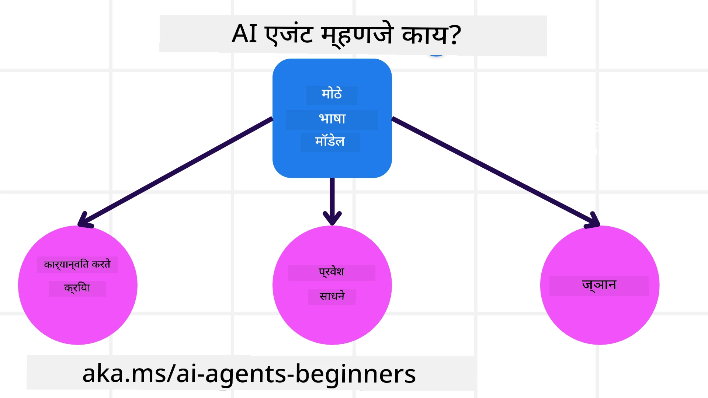
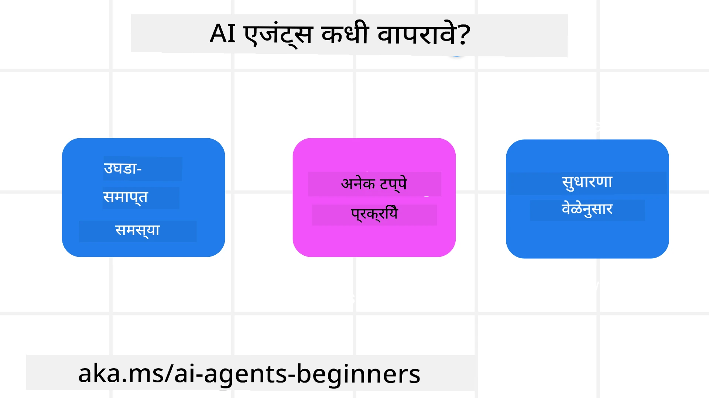

<!--
CO_OP_TRANSLATOR_METADATA:
{
  "original_hash": "cdd28bc00816d2773bb2b5968d782abc",
  "translation_date": "2025-11-11T11:05:23+00:00",
  "source_file": "01-intro-to-ai-agents/README.md",
  "language_code": "mr"
}
-->

> _(वरील प्रतिमेवर क्लिक करून या धड्याचा व्हिडिओ पहा)_

# AI एजंट्स आणि एजंट वापर प्रकरणांची ओळख

"AI एजंट्स फॉर बिगिनर्स" कोर्समध्ये आपले स्वागत आहे! हा कोर्स AI एजंट्स तयार करण्यासाठी मूलभूत ज्ञान आणि लागू नमुने प्रदान करतो.

<a href="https://discord.gg/kzRShWzttr" target="_blank">Azure AI डिस्कॉर्ड कम्युनिटी</a> मध्ये सामील व्हा, इतर शिकणाऱ्यांना आणि AI एजंट बिल्डर्सना भेटा आणि या कोर्सबद्दल तुमचे प्रश्न विचारा.

या कोर्सची सुरुवात आपण AI एजंट्स काय आहेत आणि आपण तयार केलेल्या अनुप्रयोगांमध्ये आणि कार्यप्रवाहांमध्ये त्यांचा कसा उपयोग करू शकतो हे अधिक चांगल्या प्रकारे समजून घेऊन करतो.

## परिचय

या धड्यात आपण शिकणार आहोत:

- AI एजंट्स म्हणजे काय आणि त्यांचे वेगवेगळे प्रकार कोणते आहेत?
- कोणत्या वापर प्रकरणांसाठी AI एजंट्स सर्वोत्तम आहेत आणि ते आपल्याला कसे मदत करू शकतात?
- एजंटिक सोल्यूशन्स डिझाइन करताना काही मूलभूत घटक कोणते आहेत?

## शिकण्याची उद्दिष्टे
हा धडा पूर्ण केल्यानंतर, तुम्ही:

- AI एजंट्सची संकल्पना समजून घेऊ शकता आणि ती इतर AI सोल्यूशन्सपेक्षा कशी वेगळी आहे हे जाणून घेऊ शकता.
- AI एजंट्स अधिक कार्यक्षमतेने लागू करू शकता.
- वापरकर्त्यांसाठी आणि ग्राहकांसाठी उत्पादकपणे एजंटिक सोल्यूशन्स डिझाइन करू शकता.

## AI एजंट्सची व्याख्या आणि प्रकार

### AI एजंट्स म्हणजे काय?

AI एजंट्स हे **सिस्टम्स** आहेत जे **लार्ज लँग्वेज मॉडेल्स (LLMs)** ला **क्रिया करण्यास सक्षम** करतात, त्यांची क्षमता वाढवून LLMs ला **टूल्स** आणि **ज्ञान** उपलब्ध करून देतात.

या व्याख्येचे छोटे भाग करून समजून घेऊया:

- **सिस्टम** - एजंट्सला एकच घटक म्हणून न पाहता अनेक घटकांच्या प्रणाली म्हणून विचार करणे महत्त्वाचे आहे. AI एजंट्सच्या मूलभूत स्तरावर घटक आहेत:
  - **पर्यावरण** - AI एजंट कार्यरत असलेली परिभाषित जागा. उदाहरणार्थ, जर आपल्याकडे ट्रॅव्हल बुकिंग AI एजंट असेल, तर पर्यावरण म्हणजे ट्रॅव्हल बुकिंग सिस्टम जिथे AI एजंट कार्ये पूर्ण करण्यासाठी वापरतो.
  - **सेन्सर्स** - पर्यावरणामध्ये माहिती असते आणि फीडबॅक प्रदान करते. AI एजंट्स सेन्सर्सचा वापर करून पर्यावरणाच्या वर्तमान स्थितीबद्दल माहिती गोळा करतात आणि ती समजून घेतात. ट्रॅव्हल बुकिंग एजंटच्या उदाहरणात, ट्रॅव्हल बुकिंग सिस्टम हॉटेल उपलब्धता किंवा फ्लाइटच्या किंमती यासारखी माहिती प्रदान करू शकते.
  - **अॅक्च्युएटर्स** - AI एजंटला पर्यावरणाची वर्तमान स्थिती मिळाल्यानंतर, सध्याच्या कार्यासाठी एजंट पर्यावरण बदलण्यासाठी कोणती क्रिया करायची ते ठरवतो. ट्रॅव्हल बुकिंग एजंटसाठी, ते वापरकर्त्यासाठी उपलब्ध खोली बुक करणे असू शकते.

**लार्ज लँग्वेज मॉडेल्स** - एजंट्सची संकल्पना LLMs तयार होण्यापूर्वी अस्तित्वात होती. LLMs सह AI एजंट्स तयार करण्याचा फायदा म्हणजे मानवी भाषा आणि डेटा समजून घेण्याची त्यांची क्षमता. ही क्षमता LLMs ला पर्यावरणीय माहिती समजून घेण्यास आणि पर्यावरण बदलण्यासाठी योजना तयार करण्यास सक्षम करते.

**क्रिया करणे** - AI एजंट सिस्टम्सच्या बाहेर, LLMs वापरकर्त्याच्या प्रॉम्प्टवर आधारित सामग्री किंवा माहिती तयार करण्याच्या परिस्थितीपुरते मर्यादित असतात. AI एजंट सिस्टम्सच्या आत, LLMs वापरकर्त्याच्या विनंतीचे विश्लेषण करून आणि त्यांच्या पर्यावरणात उपलब्ध असलेल्या टूल्सचा वापर करून कार्ये पूर्ण करू शकतात.

**टूल्सचा प्रवेश** - LLM ला कोणत्या टूल्सचा प्रवेश आहे हे 1) ते कार्यरत असलेल्या पर्यावरणाने आणि 2) AI एजंटच्या विकसकाने परिभाषित केले जाते. आमच्या ट्रॅव्हल एजंटच्या उदाहरणात, एजंटचे टूल्स बुकिंग सिस्टममध्ये उपलब्ध ऑपरेशन्सने मर्यादित आहेत आणि/किंवा विकसक एजंटच्या टूल्सचा प्रवेश फ्लाइट्सपर्यंत मर्यादित करू शकतो.

**मेमरी+ज्ञान** - मेमरी ही वापरकर्ता आणि एजंटमधील संभाषणाच्या संदर्भात अल्पकालीन असू शकते. दीर्घकालीन, पर्यावरणाद्वारे प्रदान केलेल्या माहितीसह, AI एजंट्स इतर सिस्टम्स, सेवा, टूल्स आणि अगदी इतर एजंट्सकडूनही ज्ञान मिळवू शकतात. ट्रॅव्हल एजंटच्या उदाहरणात, हे ज्ञान ग्राहक डेटाबेसमध्ये असलेल्या वापरकर्त्याच्या प्रवासाच्या प्राधान्यांवरील माहिती असू शकते.

### एजंट्सचे वेगवेगळे प्रकार

आता आपल्याला AI एजंट्सची सामान्य व्याख्या मिळाली आहे, चला काही विशिष्ट एजंट प्रकार आणि ट्रॅव्हल बुकिंग AI एजंटसाठी ते कसे लागू केले जातील ते पाहूया.

| **एजंट प्रकार**                | **वर्णन**                                                                                                                       | **उदाहरण**                                                                                                                                                                                                                   |
| ----------------------------- | ------------------------------------------------------------------------------------------------------------------------------------- | ----------------------------------------------------------------------------------------------------------------------------------------------------------------------------------------------------------------------------- |
| **सिंपल रिफ्लेक्स एजंट्स**      | पूर्वनिर्धारित नियमांवर आधारित त्वरित क्रिया करतात.                                                                                  | ट्रॅव्हल एजंट ईमेलचा संदर्भ समजून घेऊन प्रवासाच्या तक्रारी ग्राहक सेवेकडे पाठवतो.                                                                                                                          |
| **मॉडेल-बेस्ड रिफ्लेक्स एजंट्स** | जगाच्या मॉडेलवर आणि त्या मॉडेलमधील बदलांवर आधारित क्रिया करतात.                                                              | ट्रॅव्हल एजंट ऐतिहासिक किंमतींच्या डेटावर आधारित महत्त्वपूर्ण किंमत बदल असलेल्या मार्गांना प्राधान्य देतो.                                                                                                             |
| **गोल-बेस्ड एजंट्स**         | विशिष्ट उद्दिष्टे साध्य करण्यासाठी योजना तयार करतात, उद्दिष्ट समजून घेऊन त्यापर्यंत पोहोचण्यासाठी क्रिया ठरवतात.                                  | ट्रॅव्हल एजंट प्रवासाची व्यवस्था (कार, सार्वजनिक वाहतूक, फ्लाइट्स) सध्याच्या स्थानापासून गंतव्यस्थानापर्यंत ठरवून प्रवास बुक करतो.                                                                                |
| **युटिलिटी-बेस्ड एजंट्स**      | प्राधान्ये विचारात घेतात आणि संख्यात्मकदृष्ट्या व्यापार-तोल ठरवून उद्दिष्टे साध्य करण्याचा मार्ग ठरवतात.                                               | ट्रॅव्हल एजंट प्रवास बुक करताना सोयीसाठी आणि खर्चासाठी युटिलिटी जास्तीत जास्त करतो.                                                                                                                                          |
| **लर्निंग एजंट्स**           | फीडबॅकला प्रतिसाद देऊन आणि त्यानुसार क्रिया समायोजित करून वेळोवेळी सुधारणा करतात.                                                        | ट्रॅव्हल एजंट पोस्ट-ट्रिप सर्व्हेमधून ग्राहक फीडबॅक वापरून भविष्यातील बुकिंगमध्ये सुधारणा करतो.                                                                                                               |
| **हायरार्किकल एजंट्स**       | टियरड सिस्टममध्ये एकाधिक एजंट्स असतात, उच्च-स्तरीय एजंट्स कार्ये उपकार्यांमध्ये विभागतात जे कमी-स्तरीय एजंट्स पूर्ण करतात. | ट्रॅव्हल एजंट प्रवास रद्द करतो, कार्याला उपकार्यांमध्ये विभागतो (उदाहरणार्थ, विशिष्ट बुकिंग रद्द करणे) आणि कमी-स्तरीय एजंट्सना ते पूर्ण करण्यास सांगतो, उच्च-स्तरीय एजंटला अहवाल देतो.                                     |
| **मल्टी-एजंट सिस्टम्स (MAS)** | एजंट्स स्वतंत्रपणे कार्ये पूर्ण करतात, सहकारी किंवा स्पर्धात्मक पद्धतीने.                                                           | सहकारी: अनेक एजंट्स विशिष्ट प्रवास सेवा जसे की हॉटेल्स, फ्लाइट्स आणि मनोरंजन बुक करतात. स्पर्धात्मक: अनेक एजंट्स सामायिक हॉटेल बुकिंग कॅलेंडर व्यवस्थापित करतात आणि ग्राहकांना हॉटेलमध्ये बुक करण्यासाठी स्पर्धा करतात. |

## AI एजंट्स कधी वापरायचे?

पूर्वीच्या विभागात, आम्ही ट्रॅव्हल एजंट वापर प्रकरणाचा उपयोग करून ट्रॅव्हल बुकिंगच्या वेगवेगळ्या परिस्थितींमध्ये वेगवेगळ्या प्रकारच्या एजंट्सचा कसा उपयोग केला जाऊ शकतो हे स्पष्ट केले. आम्ही या कोर्समध्ये संपूर्ण अनुप्रयोगाचा उपयोग करत राहू.

चला पाहूया की AI एजंट्स कोणत्या प्रकारच्या वापर प्रकरणांसाठी सर्वोत्तम आहेत:

- **ओपन-एंडेड समस्या** - LLM ला कार्य पूर्ण करण्यासाठी आवश्यक असलेल्या चरणांचा निर्णय घेऊ देणे कारण ते नेहमी कार्यप्रवाहात हार्डकोड केले जाऊ शकत नाही.
- **मल्टी-स्टेप प्रक्रिया** - ज्या कार्यांमध्ये जटिलतेची पातळी आवश्यक असते ज्यामध्ये AI एजंटला टूल्स किंवा माहितीचा एकाच वेळी पुनर्प्राप्तीऐवजी अनेक टप्प्यांमध्ये वापर करावा लागतो.  
- **वेळोवेळी सुधारणा** - ज्या कार्यांमध्ये एजंट पर्यावरण किंवा वापरकर्त्यांकडून फीडबॅक मिळवून वेळोवेळी सुधारणा करू शकतो जेणेकरून चांगले युटिलिटी प्रदान करता येईल.

AI एजंट्स वापरण्याच्या अधिक विचारांवर आम्ही "ट्रस्टवर्दी AI एजंट्स तयार करणे" धड्यात चर्चा करतो.

## एजंटिक सोल्यूशन्सची मूलभूत माहिती

### एजंट विकास

AI एजंट सिस्टम डिझाइन करण्याचा पहिला टप्पा म्हणजे टूल्स, क्रिया आणि वर्तन परिभाषित करणे. या कोर्समध्ये, आम्ही आमचे एजंट्स परिभाषित करण्यासाठी **Azure AI Agent Service** वापरण्यावर लक्ष केंद्रित करतो. यात खालील वैशिष्ट्ये आहेत:

- OpenAI, Mistral, आणि Llama सारख्या ओपन मॉडेल्सची निवड
- Tripadvisor सारख्या प्रदात्यांद्वारे लाइसन्स केलेल्या डेटाचा वापर
- OpenAPI 3.0 टूल्सचा मानक वापर

### एजंटिक पॅटर्न्स

LLMs सोबत संवाद प्रॉम्प्ट्सद्वारे होतो. AI एजंट्सच्या अर्ध-स्वायत्त स्वरूपामुळे, पर्यावरणात बदल झाल्यानंतर LLM ला मॅन्युअली पुन्हा प्रॉम्प्ट करणे नेहमी शक्य किंवा आवश्यक नसते. आम्ही **एजंटिक पॅटर्न्स** वापरतो जे LLM ला अनेक टप्प्यांमध्ये अधिक स्केलेबल पद्धतीने प्रॉम्प्ट करण्यास अनुमती देतात.

हा कोर्स काही सध्याच्या लोकप्रिय एजंटिक पॅटर्न्समध्ये विभागलेला आहे.

### एजंटिक फ्रेमवर्क्स

एजंटिक फ्रेमवर्क्स विकसकांना कोडद्वारे एजंटिक पॅटर्न्स लागू करण्यास अनुमती देतात. हे फ्रेमवर्क्स टेम्पलेट्स, प्लगइन्स आणि टूल्स प्रदान करतात जे AI एजंट्सच्या चांगल्या सहकार्यासाठी उपयुक्त ठरतात. या फायद्यांमुळे AI एजंट सिस्टम्सची चांगली निरीक्षणक्षमता आणि समस्या निवारण क्षमता मिळते.

या कोर्समध्ये, आम्ही संशोधन-चालित AutoGen फ्रेमवर्क आणि उत्पादनासाठी तयार Agent फ्रेमवर्क (Semantic Kernel) एक्सप्लोर करू.

## नमुना कोड्स

- Python: [Agent Framework](./code_samples/01-python-agent-framework.ipynb)
- .NET: [Agent Framework](./code_samples/01-dotnet-agent-framework.md)

## AI एजंट्सबद्दल अधिक प्रश्न आहेत?

[Azure AI Foundry Discord](https://aka.ms/ai-agents/discord) मध्ये सामील व्हा, इतर शिकणाऱ्यांना भेटा, ऑफिस तासांमध्ये सहभागी व्हा आणि तुमचे AI एजंट्सबद्दलचे प्रश्न विचारून उत्तर मिळवा.

## मागील धडा

[कोर्स सेटअप](../00-course-setup/README.md)

## पुढील धडा

[एजंटिक फ्रेमवर्क्स एक्सप्लोर करणे](../02-explore-agentic-frameworks/README.md)

---

<!-- CO-OP TRANSLATOR DISCLAIMER START -->
**अस्वीकरण**:  
हा दस्तऐवज AI भाषांतर सेवा [Co-op Translator](https://github.com/Azure/co-op-translator) वापरून भाषांतरित करण्यात आला आहे. आम्ही अचूकतेसाठी प्रयत्नशील असलो तरी, कृपयास लक्षात ठेवा की स्वयंचलित भाषांतरे त्रुटी किंवा अचूकतेच्या अभावाने युक्त असू शकतात. मूळ भाषेतील दस्तऐवज हा अधिकृत स्रोत मानला जावा. महत्त्वाच्या माहितीसाठी, व्यावसायिक मानवी भाषांतराची शिफारस केली जाते. या भाषांतराचा वापर करून उद्भवलेल्या कोणत्याही गैरसमज किंवा चुकीच्या अर्थासाठी आम्ही जबाबदार नाही.
<!-- CO-OP TRANSLATOR DISCLAIMER END -->