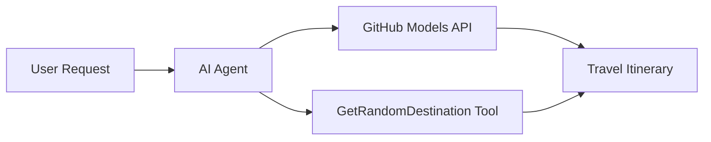

<!--
CO_OP_TRANSLATOR_METADATA:
{
  "original_hash": "5f351412e934f0833c8c821a0a60efaf",
  "translation_date": "2025-11-13T11:48:49+00:00",
  "source_file": "01-intro-to-ai-agents/code_samples/01-dotnet-agent-framework.md",
  "language_code": "mr"
}
-->
# 🌍 Microsoft Agent Framework (.NET) सह AI प्रवास एजंट

## 📋 परिस्थितीचा आढावा

ही उदाहरणे Microsoft Agent Framework for .NET वापरून बुद्धिमान प्रवास नियोजन एजंट कसा तयार करायचा हे दर्शवते. हा एजंट जगभरातील यादृच्छिक स्थळांसाठी वैयक्तिकृत दिवस-यात्रा कार्यक्रम स्वयंचलितपणे तयार करू शकतो.

### मुख्य क्षमता:

- 🎲 **यादृच्छिक स्थळ निवड**: सुट्ट्यांसाठी स्थळ निवडण्यासाठी सानुकूल साधन वापरते
- 🗺️ **बुद्धिमान प्रवास नियोजन**: तपशीलवार दिवस-वार कार्यक्रम तयार करते
- 🔄 **रिअल-टाइम स्ट्रीमिंग**: त्वरित आणि स्ट्रीमिंग प्रतिसादांना समर्थन देते
- 🛠️ **सानुकूल साधन एकत्रीकरण**: एजंटच्या क्षमतांचा विस्तार कसा करायचा हे दर्शवते

## 🔧 तांत्रिक आर्किटेक्चर

### मुख्य तंत्रज्ञान

- **Microsoft Agent Framework**: AI एजंट विकासासाठी नवीनतम .NET अंमलबजावणी
- **GitHub Models Integration**: GitHub च्या AI मॉडेल अनुमान सेवांचा वापर करते
- **OpenAI API Compatibility**: सानुकूल एंडपॉइंटसह OpenAI क्लायंट लायब्ररींचा लाभ घेते
- **सुरक्षित कॉन्फिगरेशन**: पर्यावरण-आधारित API की व्यवस्थापन

### मुख्य घटक

1. **AIAgent**: मुख्य एजंट ऑर्केस्ट्रेटर जो संभाषण प्रवाह हाताळतो
2. **सानुकूल साधने**: एजंटसाठी उपलब्ध `GetRandomDestination()` फंक्शन
3. **चॅट क्लायंट**: GitHub Models-समर्थित संभाषण इंटरफेस
4. **स्ट्रीमिंग समर्थन**: रिअल-टाइम प्रतिसाद निर्मिती क्षमता

### एकत्रीकरण नमुना



## 🚀 सुरुवात कशी करावी

### पूर्वापेक्षित

- [.NET 10 SDK](https://dotnet.microsoft.com/download/dotnet/10.0) किंवा त्याहून अधिक
- [GitHub Models API प्रवेश टोकन](https://docs.github.com/github-models/github-models-at-scale/using-your-own-api-keys-in-github-models)

### आवश्यक पर्यावरणीय व्हेरिएबल्स

```bash
# zsh/bash
export GH_TOKEN=<your_github_token>
export GH_ENDPOINT=https://models.github.ai/inference
export GH_MODEL_ID=openai/gpt-5-mini
```

```powershell
# PowerShell
$env:GH_TOKEN = "<your_github_token>"
$env:GH_ENDPOINT = "https://models.github.ai/inference"
$env:GH_MODEL_ID = "openai/gpt-5-mini"
```

### नमुना कोड

कोड उदाहरण चालवण्यासाठी,

```bash
# zsh/bash
chmod +x ./01-dotnet-agent-framework.cs
./01-dotnet-agent-framework.cs
```

किंवा dotnet CLI वापरून:

```bash
dotnet run ./01-dotnet-agent-framework.cs
```

संपूर्ण कोडसाठी [`01-dotnet-agent-framework.cs`](../../../../01-intro-to-ai-agents/code_samples/01-dotnet-agent-framework.cs) पहा.

```csharp
#!/usr/bin/dotnet run

#:package Microsoft.Extensions.AI@9.*
#:package Microsoft.Agents.AI.OpenAI@1.*-*

using System.ClientModel;
using System.ComponentModel;

using Microsoft.Agents.AI;
using Microsoft.Extensions.AI;

using OpenAI;

// Tool Function: Random Destination Generator
// This static method will be available to the agent as a callable tool
// The [Description] attribute helps the AI understand when to use this function
// This demonstrates how to create custom tools for AI agents
[Description("Provides a random vacation destination.")]
static string GetRandomDestination()
{
    // List of popular vacation destinations around the world
    // The agent will randomly select from these options
    var destinations = new List<string>
    {
        "Paris, France",
        "Tokyo, Japan",
        "New York City, USA",
        "Sydney, Australia",
        "Rome, Italy",
        "Barcelona, Spain",
        "Cape Town, South Africa",
        "Rio de Janeiro, Brazil",
        "Bangkok, Thailand",
        "Vancouver, Canada"
    };

    // Generate random index and return selected destination
    // Uses System.Random for simple random selection
    var random = new Random();
    int index = random.Next(destinations.Count);
    return destinations[index];
}

// Extract configuration from environment variables
// Retrieve the GitHub Models API endpoint, defaults to https://models.github.ai/inference if not specified
// Retrieve the model ID, defaults to openai/gpt-5-mini if not specified
// Retrieve the GitHub token for authentication, throws exception if not specified
var github_endpoint = Environment.GetEnvironmentVariable("GH_ENDPOINT") ?? "https://models.github.ai/inference";
var github_model_id = Environment.GetEnvironmentVariable("GH_MODEL_ID") ?? "openai/gpt-5-mini";
var github_token = Environment.GetEnvironmentVariable("GH_TOKEN") ?? throw new InvalidOperationException("GH_TOKEN is not set.");

// Configure OpenAI Client Options
// Create configuration options to point to GitHub Models endpoint
// This redirects OpenAI client calls to GitHub's model inference service
var openAIOptions = new OpenAIClientOptions()
{
    Endpoint = new Uri(github_endpoint)
};

// Initialize OpenAI Client with GitHub Models Configuration
// Create OpenAI client using GitHub token for authentication
// Configure it to use GitHub Models endpoint instead of OpenAI directly
var openAIClient = new OpenAIClient(new ApiKeyCredential(github_token), openAIOptions);

// Create AI Agent with Travel Planning Capabilities
// Initialize OpenAI client, get chat client for specified model, and create AI agent
// Configure agent with travel planning instructions and random destination tool
// The agent can now plan trips using the GetRandomDestination function
AIAgent agent = openAIClient
    .GetChatClient(github_model_id)
    .CreateAIAgent(
        instructions: "You are a helpful AI Agent that can help plan vacations for customers at random destinations",
        tools: [AIFunctionFactory.Create(GetRandomDestination)]
    );

// Execute Agent: Plan a Day Trip
// Run the agent with streaming enabled for real-time response display
// Shows the agent's thinking and response as it generates the content
// Provides better user experience with immediate feedback
await foreach (var update in agent.RunStreamingAsync("Plan me a day trip"))
{
    await Task.Delay(10);
    Console.Write(update);
}
```

## 🎓 मुख्य शिकवण्या

1. **एजंट आर्किटेक्चर**: Microsoft Agent Framework .NET मध्ये AI एजंट तयार करण्यासाठी स्वच्छ, प्रकार-सुरक्षित दृष्टिकोन प्रदान करते
2. **साधन एकत्रीकरण**: `[Description]` गुणधर्मांसह सजवलेले फंक्शन्स एजंटसाठी उपलब्ध साधने बनतात
3. **कॉन्फिगरेशन व्यवस्थापन**: पर्यावरणीय व्हेरिएबल्स आणि सुरक्षित क्रेडेन्शियल हाताळणी .NET सर्वोत्तम पद्धतींचे अनुसरण करते
4. **OpenAI सुसंगतता**: GitHub Models एकत्रीकरण OpenAI-सुसंगत API द्वारे सहजपणे कार्य करते

## 🔗 अतिरिक्त संसाधने

- [Microsoft Agent Framework दस्तऐवज](https://learn.microsoft.com/agent-framework)
- [GitHub Models Marketplace](https://github.com/marketplace?type=models)
- [Microsoft.Extensions.AI](https://learn.microsoft.com/dotnet/ai/microsoft-extensions-ai)
- [.NET Single File Apps](https://devblogs.microsoft.com/dotnet/announcing-dotnet-run-app)

---

<!-- CO-OP TRANSLATOR DISCLAIMER START -->
**अस्वीकरण**:  
हा दस्तऐवज AI भाषांतर सेवा [Co-op Translator](https://github.com/Azure/co-op-translator) वापरून भाषांतरित केला गेला आहे. आम्ही अचूकतेसाठी प्रयत्नशील असलो तरी, कृपया लक्षात घ्या की स्वयंचलित भाषांतरांमध्ये चुका किंवा अचूकतेचा अभाव असू शकतो. मूळ भाषेतील मूळ दस्तऐवज हा अधिकृत स्रोत मानला जावा. महत्त्वाच्या माहितीसाठी, व्यावसायिक मानवी भाषांतराची शिफारस केली जाते. या भाषांतराचा वापर केल्यामुळे उद्भवणाऱ्या कोणत्याही गैरसमज किंवा चुकीच्या अर्थासाठी आम्ही जबाबदार राहणार नाही.
<!-- CO-OP TRANSLATOR DISCLAIMER END -->