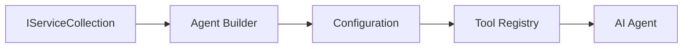

<!--
CO_OP_TRANSLATOR_METADATA:
{
  "original_hash": "bcc874e190347bd6a095aed56dc16de8",
  "translation_date": "2025-11-13T11:54:43+00:00",
  "source_file": "03-agentic-design-patterns/code_samples/03-dotnet-agent-framework.md",
  "language_code": "mr"
}
-->
# 🎨 GitHub मॉडेल्स (.NET) सह Agentic डिझाइन पॅटर्न्स

## 📋 शिकण्याचे उद्दिष्ट

हे उदाहरण Microsoft Agent Framework वापरून .NET मध्ये GitHub मॉडेल्ससह बुद्धिमान एजंट तयार करण्यासाठी एंटरप्राइझ-ग्रेड डिझाइन पॅटर्न्स प्रदर्शित करते. तुम्ही एजंट्सला उत्पादनासाठी तयार, देखभालक्षम आणि स्केलेबल बनवणारे व्यावसायिक पॅटर्न्स आणि आर्किटेक्चरल दृष्टिकोन शिकाल.

### एंटरप्राइझ डिझाइन पॅटर्न्स

- 🏭 **फॅक्टरी पॅटर्न**: डिपेंडन्सी इंजेक्शनसह मानकीकृत एजंट निर्मिती
- 🔧 **बिल्डर पॅटर्न**: फ्लुएंट एजंट कॉन्फिगरेशन आणि सेटअप
- 🧵 **थ्रेड-सेफ पॅटर्न्स**: समांतर संभाषण व्यवस्थापन
- 📋 **रिपॉझिटरी पॅटर्न**: साधन आणि क्षमता व्यवस्थापनाचे आयोजन

## 🎯 .NET-विशिष्ट आर्किटेक्चरल फायदे

### एंटरप्राइझ वैशिष्ट्ये

- **स्ट्रॉंग टायपिंग**: संकलन-वेळी सत्यापन आणि IntelliSense समर्थन
- **डिपेंडन्सी इंजेक्शन**: अंगभूत DI कंटेनर एकत्रीकरण
- **कॉन्फिगरेशन व्यवस्थापन**: IConfiguration आणि Options पॅटर्न्स
- **Async/Await**: प्रथम श्रेणी असिंक्रोनस प्रोग्रामिंग समर्थन

### उत्पादनासाठी तयार पॅटर्न्स

- **लॉगिंग इंटिग्रेशन**: ILogger आणि संरचित लॉगिंग समर्थन
- **हेल्थ चेक्स**: अंगभूत मॉनिटरिंग आणि डायग्नोस्टिक्स
- **कॉन्फिगरेशन सत्यापन**: डेटा अॅनोटेशन्ससह स्ट्रॉंग टायपिंग
- **एरर हँडलिंग**: संरचित अपवाद व्यवस्थापन

## 🔧 तांत्रिक आर्किटेक्चर

### कोर .NET घटक

- **Microsoft.Extensions.AI**: एकत्रित AI सेवा अब्स्ट्रॅक्शन्स
- **Microsoft.Agents.AI**: एंटरप्राइझ एजंट ऑर्केस्ट्रेशन फ्रेमवर्क
- **GitHub मॉडेल्स इंटिग्रेशन**: उच्च-प्रदर्शन API क्लायंट पॅटर्न्स
- **कॉन्फिगरेशन सिस्टम**: appsettings.json आणि पर्यावरण एकत्रीकरण

### डिझाइन पॅटर्न अंमलबजावणी



## 🏗️ प्रदर्शित एंटरप्राइझ पॅटर्न्स

### 1. **निर्मिती पॅटर्न्स**

- **एजंट फॅक्टरी**: सुसंगत कॉन्फिगरेशनसह केंद्रीकृत एजंट निर्मिती
- **बिल्डर पॅटर्न**: जटिल एजंट कॉन्फिगरेशनसाठी फ्लुएंट API
- **सिंगलटन पॅटर्न**: सामायिक संसाधने आणि कॉन्फिगरेशन व्यवस्थापन
- **डिपेंडन्सी इंजेक्शन**: सैल कपलिंग आणि चाचणीयोग्यता

### 2. **वर्तनात्मक पॅटर्न्स**

- **स्टॅटेजी पॅटर्न**: बदलण्यायोग्य साधन अंमलबजावणी धोरणे
- **कमांड पॅटर्न**: एजंट ऑपरेशन्ससाठी इनकॅप्सुलेशनसह Undo/Redo
- **ऑब्झर्व्हर पॅटर्न**: इव्हेंट-ड्रिव्हन एजंट जीवनचक्र व्यवस्थापन
- **टेम्पलेट मेथड**: मानकीकृत एजंट अंमलबजावणी कार्यप्रवाह

### 3. **स्ट्रक्चरल पॅटर्न्स**

- **अडॅप्टर पॅटर्न**: GitHub मॉडेल्स API इंटिग्रेशन लेयर
- **डेकोरेटर पॅटर्न**: एजंट क्षमता वाढवणे
- **फॅसाड पॅटर्न**: सरलीकृत एजंट संवाद इंटरफेस
- **प्रॉक्सी पॅटर्न**: कार्यक्षमतेसाठी Lazy लोडिंग आणि कॅशिंग

## 📚 .NET डिझाइन तत्त्वे

### SOLID तत्त्वे

- **सिंगल रिस्पॉन्सिबिलिटी**: प्रत्येक घटकाचे एक स्पष्ट उद्दिष्ट
- **ओपन/क्लोज्ड**: बदल न करता विस्तारयोग्यता
- **लिस्कॉव सब्स्टिट्यूशन**: इंटरफेस-आधारित साधन अंमलबजावणी
- **इंटरफेस सेग्रिगेशन**: लक्ष केंद्रित, सुसंगत इंटरफेस
- **डिपेंडन्सी इनव्हर्शन**: ठोस घटकांवर अवलंबून न राहता अब्स्ट्रॅक्शन्सवर अवलंबून राहणे

### क्लीन आर्किटेक्चर

- **डोमेन लेयर**: कोर एजंट आणि साधन अब्स्ट्रॅक्शन्स
- **अॅप्लिकेशन लेयर**: एजंट ऑर्केस्ट्रेशन आणि कार्यप्रवाह
- **इन्फ्रास्ट्रक्चर लेयर**: GitHub मॉडेल्स इंटिग्रेशन आणि बाह्य सेवा
- **प्रेझेंटेशन लेयर**: वापरकर्ता संवाद आणि प्रतिसाद स्वरूपन

## 🔒 एंटरप्राइझ विचार

### सुरक्षा

- **क्रेडेन्शियल व्यवस्थापन**: IConfiguration सह सुरक्षित API की हाताळणी
- **इनपुट सत्यापन**: स्ट्रॉंग टायपिंग आणि डेटा अॅनोटेशन सत्यापन
- **आउटपुट सॅनिटायझेशन**: सुरक्षित प्रतिसाद प्रक्रिया आणि फिल्टरिंग
- **ऑडिट लॉगिंग**: व्यापक ऑपरेशन ट्रॅकिंग

### कार्यक्षमता

- **Async पॅटर्न्स**: नॉन-ब्लॉकिंग I/O ऑपरेशन्स
- **कनेक्शन पूलिंग**: कार्यक्षम HTTP क्लायंट व्यवस्थापन
- **कॅशिंग**: कार्यक्षमता सुधारण्यासाठी प्रतिसाद कॅशिंग
- **संसाधन व्यवस्थापन**: योग्य डिस्पोजल आणि क्लीनअप पॅटर्न्स

### स्केलेबिलिटी

- **थ्रेड सेफ्टी**: समांतर एजंट अंमलबजावणी समर्थन
- **संसाधन पूलिंग**: कार्यक्षम संसाधन वापर
- **लोड व्यवस्थापन**: दर मर्यादित करणे आणि बॅकप्रेशर हाताळणे
- **मॉनिटरिंग**: कार्यक्षमता मेट्रिक्स आणि हेल्थ चेक्स

## 🚀 उत्पादन तैनाती

- **कॉन्फिगरेशन व्यवस्थापन**: पर्यावरण-विशिष्ट सेटिंग्ज
- **लॉगिंग स्ट्रॅटेजी**: संरचित लॉगिंगसह कोरिलेशन IDs
- **एरर हँडलिंग**: योग्य पुनर्प्राप्तीसह जागतिक अपवाद हाताळणी
- **मॉनिटरिंग**: अॅप्लिकेशन इनसाइट्स आणि कार्यक्षमता काउंटर्स
- **चाचणी**: युनिट चाचण्या, इंटिग्रेशन चाचण्या आणि लोड चाचणी पॅटर्न्स

.NET सह एंटरप्राइझ-ग्रेड बुद्धिमान एजंट तयार करण्यासाठी तयार आहात? चला काहीतरी मजबूत आर्किटेक्ट करूया! 🏢✨

## 🚀 सुरुवात करा

### पूर्वापेक्षित

- [.NET 10 SDK](https://dotnet.microsoft.com/download/dotnet/10.0) किंवा उच्च
- [GitHub मॉडेल्स API ऍक्सेस टोकन](https://docs.github.com/github-models/github-models-at-scale/using-your-own-api-keys-in-github-models)

### आवश्यक पर्यावरणीय व्हेरिएबल्स

```bash
# zsh/bash
export GH_TOKEN=<your_github_token>
export GH_ENDPOINT=https://models.github.ai/inference
export GH_MODEL_ID=openai/gpt-5-mini
```

```powershell
# PowerShell
$env:GH_TOKEN = "<your_github_token>"
$env:GH_ENDPOINT = "https://models.github.ai/inference"
$env:GH_MODEL_ID = "openai/gpt-5-mini"
```

### नमुना कोड

कोड उदाहरण चालवण्यासाठी,

```bash
# zsh/bash
chmod +x ./03-dotnet-agent-framework.cs
./03-dotnet-agent-framework.cs
```

किंवा dotnet CLI वापरून:

```bash
dotnet run ./03-dotnet-agent-framework.cs
```

पूर्ण कोडसाठी [`03-dotnet-agent-framework.cs`](../../../../03-agentic-design-patterns/code_samples/03-dotnet-agent-framework.cs) पहा.

```csharp
#!/usr/bin/dotnet run

#:package Microsoft.Extensions.AI@10.*
#:package Microsoft.Agents.AI.OpenAI@1.*-*

using System.ClientModel;
using System.ComponentModel;

using Microsoft.Agents.AI;
using Microsoft.Extensions.AI;

using OpenAI;

// Tool Function: Random Destination Generator
// This static method will be available to the agent as a callable tool
// The [Description] attribute helps the AI understand when to use this function
// This demonstrates how to create custom tools for AI agents
[Description("Provides a random vacation destination.")]
static string GetRandomDestination()
{
    // List of popular vacation destinations around the world
    // The agent will randomly select from these options
    var destinations = new List<string>
    {
        "Paris, France",
        "Tokyo, Japan",
        "New York City, USA",
        "Sydney, Australia",
        "Rome, Italy",
        "Barcelona, Spain",
        "Cape Town, South Africa",
        "Rio de Janeiro, Brazil",
        "Bangkok, Thailand",
        "Vancouver, Canada"
    };

    // Generate random index and return selected destination
    // Uses System.Random for simple random selection
    var random = new Random();
    int index = random.Next(destinations.Count);
    return destinations[index];
}

// Extract configuration from environment variables
// Retrieve the GitHub Models API endpoint, defaults to https://models.github.ai/inference if not specified
// Retrieve the model ID, defaults to openai/gpt-5-mini if not specified
// Retrieve the GitHub token for authentication, throws exception if not specified
var github_endpoint = Environment.GetEnvironmentVariable("GH_ENDPOINT") ?? "https://models.github.ai/inference";
var github_model_id = Environment.GetEnvironmentVariable("GH_MODEL_ID") ?? "openai/gpt-5-mini";
var github_token = Environment.GetEnvironmentVariable("GH_TOKEN") ?? throw new InvalidOperationException("GH_TOKEN is not set.");

// Configure OpenAI Client Options
// Create configuration options to point to GitHub Models endpoint
// This redirects OpenAI client calls to GitHub's model inference service
var openAIOptions = new OpenAIClientOptions()
{
    Endpoint = new Uri(github_endpoint)
};

// Initialize OpenAI Client with GitHub Models Configuration
// Create OpenAI client using GitHub token for authentication
// Configure it to use GitHub Models endpoint instead of OpenAI directly
var openAIClient = new OpenAIClient(new ApiKeyCredential(github_token), openAIOptions);

// Define Agent Identity and Comprehensive Instructions
// Agent name for identification and logging purposes
var AGENT_NAME = "TravelAgent";

// Detailed instructions that define the agent's personality, capabilities, and behavior
// This system prompt shapes how the agent responds and interacts with users
var AGENT_INSTRUCTIONS = """
You are a helpful AI Agent that can help plan vacations for customers.

Important: When users specify a destination, always plan for that location. Only suggest random destinations when the user hasn't specified a preference.

When the conversation begins, introduce yourself with this message:
"Hello! I'm your TravelAgent assistant. I can help plan vacations and suggest interesting destinations for you. Here are some things you can ask me:
1. Plan a day trip to a specific location
2. Suggest a random vacation destination
3. Find destinations with specific features (beaches, mountains, historical sites, etc.)
4. Plan an alternative trip if you don't like my first suggestion

What kind of trip would you like me to help you plan today?"

Always prioritize user preferences. If they mention a specific destination like "Bali" or "Paris," focus your planning on that location rather than suggesting alternatives.
""";

// Create AI Agent with Advanced Travel Planning Capabilities
// Initialize complete agent pipeline: OpenAI client → Chat client → AI agent
// Configure agent with name, detailed instructions, and available tools
// This demonstrates the .NET agent creation pattern with full configuration
AIAgent agent = openAIClient
    .GetChatClient(github_model_id)
    .CreateAIAgent(
        name: AGENT_NAME,
        instructions: AGENT_INSTRUCTIONS,
        tools: [AIFunctionFactory.Create(GetRandomDestination)]
    );

// Create New Conversation Thread for Context Management
// Initialize a new conversation thread to maintain context across multiple interactions
// Threads enable the agent to remember previous exchanges and maintain conversational state
// This is essential for multi-turn conversations and contextual understanding
AgentThread thread = agent.GetNewThread();

// Execute Agent: First Travel Planning Request
// Run the agent with an initial request that will likely trigger the random destination tool
// The agent will analyze the request, use the GetRandomDestination tool, and create an itinerary
// Using the thread parameter maintains conversation context for subsequent interactions
await foreach (var update in agent.RunStreamingAsync("Plan me a day trip", thread))
{
    await Task.Delay(10);
    Console.Write(update);
}

Console.WriteLine();

// Execute Agent: Follow-up Request with Context Awareness
// Demonstrate contextual conversation by referencing the previous response
// The agent remembers the previous destination suggestion and will provide an alternative
// This showcases the power of conversation threads and contextual understanding in .NET agents
await foreach (var update in agent.RunStreamingAsync("I don't like that destination. Plan me another vacation.", thread))
{
    await Task.Delay(10);
    Console.Write(update);
}
```

---

<!-- CO-OP TRANSLATOR DISCLAIMER START -->
**अस्वीकरण**:  
हा दस्तऐवज AI भाषांतर सेवा [Co-op Translator](https://github.com/Azure/co-op-translator) वापरून भाषांतरित केला आहे. आम्ही अचूकतेसाठी प्रयत्नशील असलो तरी, कृपयाआहे की स्वयंचलित भाषांतरांमध्ये चुका किंवा अचूकतेचा अभाव असू शकतो. मूळ भाषेतील मूळ दस्तऐवज हा अधिकृत स्रोत मानला जावा. महत्त्वाच्या माहितीसाठी, व्यावसायिक मानवी भाषांतराची शिफारस केली जाते. या भाषांतराचा वापर करून उद्भवलेल्या कोणत्याही गैरसमज किंवा चुकीच्या अर्थासाठी आम्ही जबाबदार राहणार नाही.
<!-- CO-OP TRANSLATOR DISCLAIMER END -->