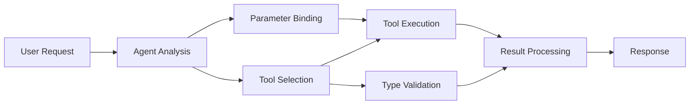

<!--
CO_OP_TRANSLATOR_METADATA:
{
  "original_hash": "91d6061e402489603f2ec8b528cae59b",
  "translation_date": "2025-11-18T17:08:26+00:00",
  "source_file": "04-tool-use/code_samples/04-dotnet-agent-framework.md",
  "language_code": "mr"
}
-->
# 🛠️ GitHub मॉडेल्स (.NET) सह प्रगत साधन वापर

## 📋 शिकण्याचे उद्दिष्टे

हे नोटबुक Microsoft Agent Framework चा वापर करून GitHub मॉडेल्ससह एंटरप्राइझ-ग्रेड साधन एकत्रीकरण नमुने दाखवते. तुम्ही C# च्या मजबूत टायपिंग आणि .NET च्या एंटरप्राइझ वैशिष्ट्यांचा लाभ घेत, अनेक विशेष साधनांसह प्रगत एजंट तयार करायला शिकाल.

### प्रगत साधन क्षमता ज्यामध्ये तुम्ही प्राविण्य मिळवाल

- 🔧 **मल्टी-टूल आर्किटेक्चर**: अनेक विशेष क्षमतांसह एजंट तयार करणे
- 🎯 **टाइप-सेफ टूल अंमलबजावणी**: C# च्या संकलन-वेळेच्या पडताळणीचा लाभ घेणे
- 📊 **एंटरप्राइझ टूल नमुने**: उत्पादन-तयार साधन डिझाइन आणि त्रुटी हाताळणी
- 🔗 **साधन संयोजन**: जटिल व्यवसाय कार्यप्रवाहांसाठी साधने एकत्र करणे

## 🎯 .NET टूल आर्किटेक्चरचे फायदे

### एंटरप्राइझ टूल वैशिष्ट्ये

- **संकलन-वेळेची पडताळणी**: मजबूत टायपिंग साधन पॅरामीटरची अचूकता सुनिश्चित करते
- **डिपेंडन्सी इंजेक्शन**: IoC कंटेनर एकत्रीकरण साधन व्यवस्थापनासाठी
- **Async/Await नमुने**: योग्य संसाधन व्यवस्थापनासह नॉन-ब्लॉकिंग साधन अंमलबजावणी
- **संरचित लॉगिंग**: साधन अंमलबजावणीचे निरीक्षण करण्यासाठी अंगभूत लॉगिंग एकत्रीकरण

### उत्पादन-तयार नमुने

- **अपवाद हाताळणी**: टाइप केलेल्या अपवादांसह व्यापक त्रुटी व्यवस्थापन
- **संसाधन व्यवस्थापन**: योग्य डिस्पोजल नमुने आणि मेमरी व्यवस्थापन
- **कामगिरी निरीक्षण**: अंगभूत मेट्रिक्स आणि कामगिरी काउंटर
- **कॉन्फिगरेशन व्यवस्थापन**: पडताळणीसह टाइप-सेफ कॉन्फिगरेशन

## 🔧 तांत्रिक आर्किटेक्चर

### मुख्य .NET टूल घटक

- **Microsoft.Extensions.AI**: एकसंध साधन अब्स्ट्रॅक्शन लेयर
- **Microsoft.Agents.AI**: एंटरप्राइझ-ग्रेड साधन ऑर्केस्ट्रेशन
- **GitHub मॉडेल्स एकत्रीकरण**: कनेक्शन पूलिंगसह उच्च-कार्यक्षमता API क्लायंट

### टूल अंमलबजावणी पाइपलाइन



## 🛠️ टूल श्रेण्या आणि नमुने

### 1. **डेटा प्रक्रिया साधने**

- **इनपुट पडताळणी**: डेटा अ‍ॅनोटेशन्ससह मजबूत टायपिंग
- **रूपांतरण ऑपरेशन्स**: टाइप-सेफ डेटा रूपांतरण आणि स्वरूपन
- **व्यवसाय लॉजिक**: डोमेन-विशिष्ट गणना आणि विश्लेषण साधने
- **आउटपुट स्वरूपन**: संरचित प्रतिसाद निर्मिती

### 2. **एकत्रीकरण साधने**

- **API कनेक्टर्स**: HttpClient सह RESTful सेवा एकत्रीकरण
- **डेटाबेस साधने**: डेटा ऍक्सेससाठी Entity Framework एकत्रीकरण
- **फाइल ऑपरेशन्स**: पडताळणीसह सुरक्षित फाइल सिस्टम ऑपरेशन्स
- **बाह्य सेवा**: तृतीय-पक्ष सेवा एकत्रीकरण नमुने

### 3. **उपयुक्तता साधने**

- **टेक्स्ट प्रक्रिया**: स्ट्रिंग मॅनिप्युलेशन आणि स्वरूपन उपयुक्तता
- **दिनांक/वेळ ऑपरेशन्स**: सांस्कृतिक-जाणीव असलेली दिनांक/वेळ गणना
- **गणितीय साधने**: अचूक गणना आणि सांख्यिकीय ऑपरेशन्स
- **पडताळणी साधने**: व्यवसाय नियम पडताळणी आणि डेटा सत्यापन

एंटरप्राइझ-ग्रेड एजंट्स तयार करण्यासाठी तयार आहात का? .NET मध्ये शक्तिशाली, टाइप-सेफ टूल क्षमता वापरून व्यावसायिक-ग्रेड सोल्यूशन्स तयार करूया! 🏢⚡

## 🚀 सुरुवात करणे

### पूर्वापेक्षा

- [.NET 10 SDK](https://dotnet.microsoft.com/download/dotnet/10.0) किंवा त्याहून अधिक
- [GitHub मॉडेल्स API ऍक्सेस टोकन](https://docs.github.com/github-models/github-models-at-scale/using-your-own-api-keys-in-github-models)

### आवश्यक पर्यावरणीय व्हेरिएबल्स

```bash
# zsh/bash
export GH_TOKEN=<your_github_token>
export GH_ENDPOINT=https://models.github.ai/inference
export GH_MODEL_ID=openai/gpt-5-mini
```

```powershell
# PowerShell
$env:GH_TOKEN = "<your_github_token>"
$env:GH_ENDPOINT = "https://models.github.ai/inference"
$env:GH_MODEL_ID = "openai/gpt-5-mini"
```

### नमुना कोड

कोड उदाहरण चालवण्यासाठी,

```bash
# zsh/bash
chmod +x ./04-dotnet-agent-framework.cs
./04-dotnet-agent-framework.cs
```

किंवा dotnet CLI वापरून:

```bash
dotnet run ./04-dotnet-agent-framework.cs
```

पूर्ण कोडसाठी [`04-dotnet-agent-framework.cs`](../../../../04-tool-use/code_samples/04-dotnet-agent-framework.cs) पहा.

```csharp
#!/usr/bin/dotnet run

#:package Microsoft.Extensions.AI@10.*
#:package Microsoft.Agents.AI.OpenAI@1.*-*

using System.ClientModel;
using System.ComponentModel;

using Microsoft.Agents.AI;
using Microsoft.Extensions.AI;

using OpenAI;

// Tool Function: Random Destination Generator
// This static method will be available to the agent as a callable tool
// The [Description] attribute helps the AI understand when to use this function
// This demonstrates how to create custom tools for AI agents
[Description("Provides a random vacation destination.")]
static string GetRandomDestination()
{
    // List of popular vacation destinations around the world
    // The agent will randomly select from these options
    var destinations = new List<string>
    {
        "Paris, France",
        "Tokyo, Japan",
        "New York City, USA",
        "Sydney, Australia",
        "Rome, Italy",
        "Barcelona, Spain",
        "Cape Town, South Africa",
        "Rio de Janeiro, Brazil",
        "Bangkok, Thailand",
        "Vancouver, Canada"
    };

    // Generate random index and return selected destination
    // Uses System.Random for simple random selection
    var random = new Random();
    int index = random.Next(destinations.Count);
    return destinations[index];
}

// Extract configuration from environment variables
// Retrieve the GitHub Models API endpoint, defaults to https://models.github.ai/inference if not specified
// Retrieve the model ID, defaults to openai/gpt-5-mini if not specified
// Retrieve the GitHub token for authentication, throws exception if not specified
var github_endpoint = Environment.GetEnvironmentVariable("GH_ENDPOINT") ?? "https://models.github.ai/inference";
var github_model_id = Environment.GetEnvironmentVariable("GH_MODEL_ID") ?? "openai/gpt-5-mini";
var github_token = Environment.GetEnvironmentVariable("GH_TOKEN") ?? throw new InvalidOperationException("GH_TOKEN is not set.");

// Configure OpenAI Client Options
// Create configuration options to point to GitHub Models endpoint
// This redirects OpenAI client calls to GitHub's model inference service
var openAIOptions = new OpenAIClientOptions()
{
    Endpoint = new Uri(github_endpoint)
};

// Initialize OpenAI Client with GitHub Models Configuration
// Create OpenAI client using GitHub token for authentication
// Configure it to use GitHub Models endpoint instead of OpenAI directly
var openAIClient = new OpenAIClient(new ApiKeyCredential(github_token), openAIOptions);

// Define Agent Identity and Comprehensive Instructions
// Agent name for identification and logging purposes
var AGENT_NAME = "TravelAgent";

// Detailed instructions that define the agent's personality, capabilities, and behavior
// This system prompt shapes how the agent responds and interacts with users
var AGENT_INSTRUCTIONS = """
You are a helpful AI Agent that can help plan vacations for customers.

Important: When users specify a destination, always plan for that location. Only suggest random destinations when the user hasn't specified a preference.

When the conversation begins, introduce yourself with this message:
"Hello! I'm your TravelAgent assistant. I can help plan vacations and suggest interesting destinations for you. Here are some things you can ask me:
1. Plan a day trip to a specific location
2. Suggest a random vacation destination
3. Find destinations with specific features (beaches, mountains, historical sites, etc.)
4. Plan an alternative trip if you don't like my first suggestion

What kind of trip would you like me to help you plan today?"

Always prioritize user preferences. If they mention a specific destination like "Bali" or "Paris," focus your planning on that location rather than suggesting alternatives.
""";

// Create AI Agent with Advanced Travel Planning Capabilities
// Initialize complete agent pipeline: OpenAI client → Chat client → AI agent
// Configure agent with name, detailed instructions, and available tools
// This demonstrates the .NET agent creation pattern with full configuration
AIAgent agent = openAIClient
    .GetChatClient(github_model_id)
    .CreateAIAgent(
        name: AGENT_NAME,
        instructions: AGENT_INSTRUCTIONS,
        tools: [AIFunctionFactory.Create(GetRandomDestination)]
    );

// Create New Conversation Thread for Context Management
// Initialize a new conversation thread to maintain context across multiple interactions
// Threads enable the agent to remember previous exchanges and maintain conversational state
// This is essential for multi-turn conversations and contextual understanding
AgentThread thread = agent.GetNewThread();

// Execute Agent: First Travel Planning Request
// Run the agent with an initial request that will likely trigger the random destination tool
// The agent will analyze the request, use the GetRandomDestination tool, and create an itinerary
// Using the thread parameter maintains conversation context for subsequent interactions
await foreach (var update in agent.RunStreamingAsync("Plan me a day trip", thread))
{
    await Task.Delay(10);
    Console.Write(update);
}

Console.WriteLine();

// Execute Agent: Follow-up Request with Context Awareness
// Demonstrate contextual conversation by referencing the previous response
// The agent remembers the previous destination suggestion and will provide an alternative
// This showcases the power of conversation threads and contextual understanding in .NET agents
await foreach (var update in agent.RunStreamingAsync("I don't like that destination. Plan me another vacation.", thread))
{
    await Task.Delay(10);
    Console.Write(update);
}
```

---

<!-- CO-OP TRANSLATOR DISCLAIMER START -->
**अस्वीकरण**:  
हा दस्तऐवज AI भाषांतर सेवा [Co-op Translator](https://github.com/Azure/co-op-translator) वापरून भाषांतरित केला आहे. आम्ही अचूकतेसाठी प्रयत्नशील असलो तरी, कृपया लक्षात घ्या की स्वयंचलित भाषांतरांमध्ये चुका किंवा अचूकतेचा अभाव असू शकतो. मूळ भाषेतील मूळ दस्तऐवज हा अधिकृत स्रोत मानला जावा. महत्त्वाच्या माहितीसाठी व्यावसायिक मानवी भाषांतराची शिफारस केली जाते. या भाषांतराचा वापर करून उद्भवलेल्या कोणत्याही गैरसमज किंवा चुकीच्या अर्थासाठी आम्ही जबाबदार राहणार नाही.
<!-- CO-OP TRANSLATOR DISCLAIMER END -->