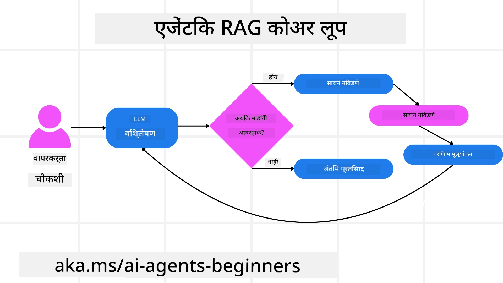
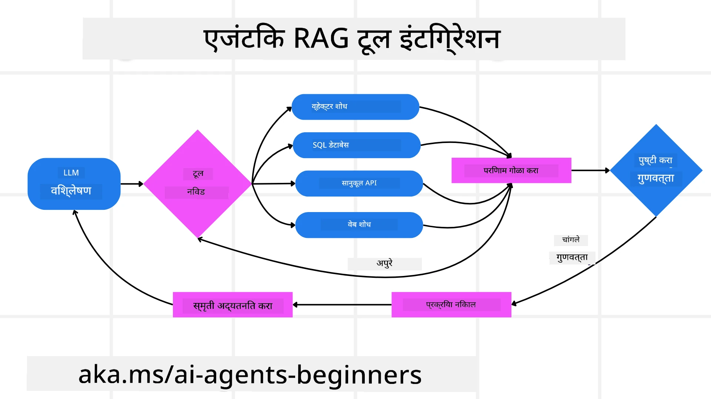
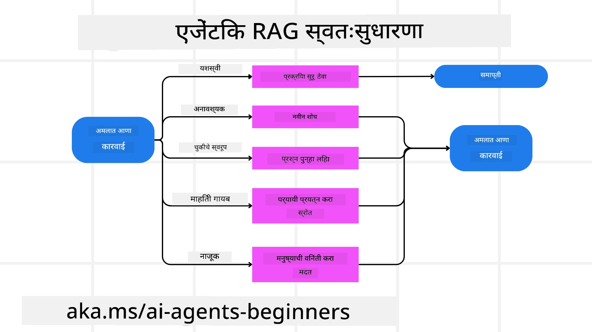

<!--
CO_OP_TRANSLATOR_METADATA:
{
  "original_hash": "0ebf6b2290db55dbf2d10cc49655523b",
  "translation_date": "2025-09-30T06:42:25+00:00",
  "source_file": "05-agentic-rag/README.md",
  "language_code": "mr"
}
-->

> _(वरील प्रतिमेवर क्लिक करून या धड्याचा व्हिडिओ पहा)_

# Agentic RAG

हा धडा Agentic Retrieval-Augmented Generation (Agentic RAG) या उदयोन्मुख AI पद्धतीचा सविस्तर आढावा प्रदान करतो, जिथे मोठे भाषा मॉडेल्स (LLMs) स्वायत्तपणे पुढील पावले ठरवतात आणि बाह्य स्रोतांकडून माहिती घेतात. स्थिर retrieval-then-read पद्धतींपेक्षा वेगळा, Agentic RAG मध्ये LLM ला पुनरावृत्तीने कॉल करणे, टूल्स किंवा फंक्शन कॉल्स आणि संरचित आउटपुट्स यांचा समावेश असतो. प्रणाली परिणामांचे मूल्यांकन करते, क्वेरी सुधारते, आवश्यक असल्यास अतिरिक्त टूल्स वापरते आणि समाधानकारक उत्तर मिळेपर्यंत हा चक्र सुरू ठेवते.

## परिचय

या धड्यात आपण शिकणार आहोत:

- **Agentic RAG समजून घेणे:** मोठ्या भाषा मॉडेल्स (LLMs) स्वायत्तपणे पुढील पावले ठरवतात आणि बाह्य डेटा स्रोतांकडून माहिती घेतात, या AI च्या उदयोन्मुख पद्धतीबद्दल जाणून घ्या.
- **Iterative Maker-Checker शैली समजून घेणे:** LLM ला पुनरावृत्तीने कॉल करणे, टूल्स किंवा फंक्शन कॉल्स आणि संरचित आउटपुट्स यांचा समावेश असलेला लूप समजून घ्या, जो अचूकता सुधारण्यासाठी आणि चुकीच्या क्वेरी हाताळण्यासाठी डिझाइन केलेला आहे.
- **व्यावहारिक उपयोग शोधणे:** Agentic RAG च्या उपयोगी ठरणाऱ्या परिस्थिती ओळखा, जसे की अचूकता-प्रथम वातावरण, जटिल डेटाबेस संवाद, आणि विस्तारित कार्यप्रवाह.

## शिकण्याची उद्दिष्टे

हा धडा पूर्ण केल्यानंतर, तुम्हाला खालील गोष्टी समजतील:

- **Agentic RAG समजून घेणे:** मोठ्या भाषा मॉडेल्स (LLMs) स्वायत्तपणे पुढील पावले ठरवतात आणि बाह्य डेटा स्रोतांकडून माहिती घेतात, या AI च्या उदयोन्मुख पद्धतीबद्दल जाणून घ्या.
- **Iterative Maker-Checker शैली:** LLM ला पुनरावृत्तीने कॉल करणे, टूल्स किंवा फंक्शन कॉल्स आणि संरचित आउटपुट्स यांचा समावेश असलेला लूप समजून घ्या, जो अचूकता सुधारण्यासाठी आणि चुकीच्या क्वेरी हाताळण्यासाठी डिझाइन केलेला आहे.
- **तर्क प्रक्रिया स्वतःच सांभाळणे:** प्रणालीची स्वतःची तर्क प्रक्रिया सांभाळण्याची क्षमता समजून घ्या, जिथे ती पूर्वनिर्धारित मार्गांवर अवलंबून न राहता समस्यांकडे कसे जायचे हे ठरवते.
- **कार्यप्रवाह:** Agentic मॉडेल स्वतंत्रपणे बाजारातील ट्रेंड रिपोर्ट्स मिळवणे, स्पर्धक डेटा ओळखणे, अंतर्गत विक्री मेट्रिक्सशी संबंध जोडणे, निष्कर्षांचे संश्लेषण करणे आणि रणनीतीचे मूल्यांकन करणे कसे ठरवते ते समजून घ्या.
- **पुनरावृत्ती लूप्स, टूल्सचे एकत्रीकरण आणि मेमरी:** प्रणालीच्या लूप केलेल्या संवाद पद्धतीवर, पावले ओलांडून स्थिती आणि मेमरी राखणे, पुनरावृत्ती टाळणे आणि माहितीपूर्ण निर्णय घेणे यावर शिकून घ्या.
- **अपयश हाताळणे आणि स्वतः सुधारणा:** प्रणालीच्या मजबूत स्वतः सुधारणा यंत्रणांचा अभ्यास करा, ज्यामध्ये पुनरावृत्ती करणे, पुनः क्वेरी करणे, डायग्नोस्टिक टूल्स वापरणे आणि मानवी निरीक्षणावर अवलंबून राहणे यांचा समावेश आहे.
- **स्वायत्ततेच्या मर्यादा:** Agentic RAG च्या मर्यादा समजून घ्या, जसे की डोमेन-विशिष्ट स्वायत्तता, पायाभूत सुविधांवर अवलंबित्व, आणि सुरक्षा उपायांचे पालन.
- **व्यावहारिक उपयोग आणि मूल्य:** Agentic RAG च्या उपयोगी ठरणाऱ्या परिस्थिती ओळखा, जसे की अचूकता-प्रथम वातावरण, जटिल डेटाबेस संवाद, आणि विस्तारित कार्यप्रवाह.
- **शासन, पारदर्शकता आणि विश्वास:** शासन आणि पारदर्शकतेचे महत्त्व जाणून घ्या, ज्यामध्ये स्पष्ट तर्क, पक्षपात नियंत्रण, आणि मानवी निरीक्षण यांचा समावेश आहे.

## Agentic RAG म्हणजे काय?

Agentic Retrieval-Augmented Generation (Agentic RAG) ही एक उदयोन्मुख AI पद्धती आहे जिथे मोठे भाषा मॉडेल्स (LLMs) स्वायत्तपणे पुढील पावले ठरवतात आणि बाह्य स्रोतांकडून माहिती घेतात. स्थिर retrieval-then-read पद्धतींपेक्षा वेगळा, Agentic RAG मध्ये LLM ला पुनरावृत्तीने कॉल करणे, टूल्स किंवा फंक्शन कॉल्स आणि संरचित आउटपुट्स यांचा समावेश असतो. प्रणाली परिणामांचे मूल्यांकन करते, क्वेरी सुधारते, आवश्यक असल्यास अतिरिक्त टूल्स वापरते आणि समाधानकारक उत्तर मिळेपर्यंत हा चक्र सुरू ठेवते. 

ही पुनरावृत्ती “maker-checker” शैली अचूकता सुधारण्यासाठी, चुकीच्या क्वेरी हाताळण्यासाठी, आणि उच्च-गुणवत्तेचे परिणाम सुनिश्चित करण्यासाठी डिझाइन केलेली आहे. प्रणाली स्वतःची तर्क प्रक्रिया सक्रियपणे सांभाळते, अपयशी क्वेरी पुन्हा लिहिते, वेगवेगळ्या retrieval पद्धती निवडते, आणि अंतिम उत्तर देण्यापूर्वी अनेक टूल्स एकत्रित करते—जसे की Azure AI Search मधील व्हेक्टर शोध, SQL डेटाबेस, किंवा कस्टम APIs. Agentic प्रणालीची वेगळी गुणवत्ता म्हणजे तिची स्वतःची तर्क प्रक्रिया सांभाळण्याची क्षमता. पारंपरिक RAG अंमलबजावणी पूर्वनिर्धारित मार्गांवर अवलंबून असते, परंतु Agentic प्रणाली माहितीच्या गुणवत्तेवर आधारित पावले स्वायत्तपणे ठरवते.

## Agentic Retrieval-Augmented Generation (Agentic RAG) ची व्याख्या

Agentic Retrieval-Augmented Generation (Agentic RAG) ही AI विकासातील एक उदयोन्मुख पद्धती आहे जिथे LLMs केवळ बाह्य डेटा स्रोतांकडून माहिती घेत नाहीत तर स्वायत्तपणे पुढील पावले ठरवतात. स्थिर retrieval-then-read पद्धती किंवा काळजीपूर्वक स्क्रिप्ट केलेल्या प्रॉम्प्ट अनुक्रमांपेक्षा वेगळा, Agentic RAG मध्ये LLM ला पुनरावृत्तीने कॉल करणे, टूल्स किंवा फंक्शन कॉल्स आणि संरचित आउटपुट्स यांचा समावेश असतो. प्रत्येक टप्प्यावर, प्रणाली प्राप्त केलेल्या परिणामांचे मूल्यांकन करते, क्वेरी सुधारण्याचा निर्णय घेते, आवश्यक असल्यास अतिरिक्त टूल्स वापरते, आणि समाधानकारक उत्तर मिळेपर्यंत हा चक्र सुरू ठेवते.

ही पुनरावृत्ती “maker-checker” शैली अचूकता सुधारण्यासाठी, चुकीच्या क्वेरी हाताळण्यासाठी, आणि संतुलित, उच्च-गुणवत्तेचे परिणाम सुनिश्चित करण्यासाठी डिझाइन केलेली आहे. काळजीपूर्वक इंजिनिअर केलेल्या प्रॉम्प्ट चेनवर अवलंबून राहण्याऐवजी, प्रणाली स्वतःची तर्क प्रक्रिया सक्रियपणे सांभाळते. ती अपयशी क्वेरी पुन्हा लिहिते, वेगवेगळ्या retrieval पद्धती निवडते, आणि अंतिम उत्तर देण्यापूर्वी अनेक टूल्स एकत्रित करते—जसे की Azure AI Search मधील व्हेक्टर शोध, SQL डेटाबेस, किंवा कस्टम APIs. यामुळे अत्यंत जटिल ऑर्केस्ट्रेशन फ्रेमवर्कची गरज दूर होते. त्याऐवजी, “LLM कॉल → टूल वापर → LLM कॉल → …” चा तुलनेने साधा लूप परिष्कृत आणि चांगल्या प्रकारे ग्राउंड केलेले आउटपुट देऊ शकतो.

## तर्क प्रक्रिया स्वतःच सांभाळणे

“Agentic” प्रणाली बनवणारी वेगळी गुणवत्ता म्हणजे तिची स्वतःची तर्क प्रक्रिया सांभाळण्याची क्षमता. पारंपरिक RAG अंमलबजावणी अनेकदा मॉडेलसाठी मार्ग पूर्वनिर्धारित करण्यासाठी मानवांवर अवलंबून असते: काय retrieve करायचे आणि कधी करायचे याचे chain-of-thought.
परंतु जेव्हा प्रणाली खरोखरच Agentic असते, तेव्हा ती अंतर्गतपणे समस्येकडे कसे जायचे हे ठरवते. ती फक्त स्क्रिप्ट अंमलात आणत नाही; ती मिळालेल्या माहितीच्या गुणवत्तेवर आधारित पावले स्वायत्तपणे ठरवते.
उदाहरणार्थ, जर तिला उत्पादन लॉन्च रणनीती तयार करण्यास सांगितले गेले, तर ती संपूर्ण संशोधन आणि निर्णय घेण्याचा कार्यप्रवाह स्पष्ट करणाऱ्या प्रॉम्प्टवर अवलंबून राहत नाही. त्याऐवजी, Agentic मॉडेल स्वतंत्रपणे ठरवते:

1. Bing Web Grounding वापरून वर्तमान बाजारातील ट्रेंड रिपोर्ट्स retrieve करणे.
2. Azure AI Search वापरून संबंधित स्पर्धक डेटा ओळखणे.
3. Azure SQL Database वापरून ऐतिहासिक अंतर्गत विक्री मेट्रिक्सशी संबंध जोडणे.
4. Azure OpenAI Service द्वारे समन्वयित सुसंगत रणनीतीमध्ये निष्कर्षांचे संश्लेषण करणे.
5. रणनीतीतील अंतर किंवा विसंगतींसाठी मूल्यांकन करणे, आवश्यक असल्यास आणखी एक retrieval फेरी सुरू करणे.
या सर्व पावले—क्वेरी सुधारणे, स्रोत निवडणे, उत्तरावर “संतुष्ट” होईपर्यंत पुनरावृत्ती करणे—मॉडेलद्वारे ठरवली जातात, मानवाने पूर्वनिर्धारित केलेली नाहीत.

## पुनरावृत्ती लूप्स, टूल्सचे एकत्रीकरण आणि मेमरी

Agentic प्रणाली लूप केलेल्या संवाद पद्धतीवर अवलंबून असते:

- **प्रारंभिक कॉल:** वापरकर्त्याचे उद्दिष्ट (उर्फ. वापरकर्ता प्रॉम्प्ट) LLM ला सादर केले जाते.
- **टूल्सचे वापर:** जर मॉडेलला माहिती गहाळ असल्याचे किंवा अस्पष्ट सूचना आढळल्या, तर ते टूल्स किंवा retrieval पद्धती निवडते—जसे की व्हेक्टर डेटाबेस क्वेरी (उदा. Azure AI Search Hybrid search खाजगी डेटावर) किंवा संरचित SQL कॉल—अधिक संदर्भ गोळा करण्यासाठी.
- **मूल्यांकन आणि सुधारणा:** परत आलेल्या डेटाचे पुनरावलोकन केल्यानंतर, मॉडेल ठरवते की माहिती पुरेशी आहे का. जर नसेल, तर ते क्वेरी सुधारते, वेगळे टूल वापरते, किंवा त्याचा दृष्टिकोन समायोजित करते.
- **संतुष्ट होईपर्यंत पुनरावृत्ती:** हा चक्र मॉडेलला पुरेशी स्पष्टता आणि पुरावा मिळेपर्यंत सुरू राहतो, ज्यामुळे अंतिम, चांगल्या प्रकारे तर्कसंगत प्रतिसाद दिला जातो.
- **मेमरी आणि स्थिती:** कारण प्रणाली पावले ओलांडून स्थिती आणि मेमरी राखते, ती मागील प्रयत्न आणि त्यांचे परिणाम लक्षात ठेवू शकते, पुनरावृत्ती टाळते आणि पुढे जाताना अधिक माहितीपूर्ण निर्णय घेते.

कालांतराने, यामुळे विकसित होणाऱ्या समजुतीची भावना निर्माण होते, ज्यामुळे मॉडेलला जटिल, बहु-चरणीय कार्ये नेव्हिगेट करण्याची क्षमता मिळते, मानवाने सतत हस्तक्षेप किंवा प्रॉम्प्ट पुन्हा आकारण्याची गरज न पडता.

## अपयश हाताळणे आणि स्वतः सुधारणा

Agentic RAG ची स्वायत्तता मजबूत स्वतः सुधारणा यंत्रणांचा समावेश करते. जेव्हा प्रणाली अडथळ्यांना सामोरे जाते—जसे की असंबंधित दस्तऐवज retrieve करणे किंवा चुकीच्या क्वेरींना सामोरे जाणे—तेव्हा ती:

- **पुनरावृत्ती करणे आणि पुनः क्वेरी करणे:** कमी मूल्य असलेले प्रतिसाद परत देण्याऐवजी, मॉडेल नवीन शोध रणनीतींचा प्रयत्न करते, डेटाबेस क्वेरी पुन्हा लिहिते, किंवा पर्यायी डेटा सेट्स पाहते.
- **डायग्नोस्टिक टूल्स वापरणे:** प्रणाली अतिरिक्त फंक्शन्स invoke करू शकते, ज्यामुळे तिला तिच्या तर्क चरणांचे डीबग करण्यात किंवा retrieve केलेल्या डेटाची अचूकता पुष्टी करण्यात मदत होते. Azure AI Tracing सारखी टूल्स मजबूत निरीक्षण आणि मॉनिटरिंग सक्षम करण्यासाठी महत्त्वाची ठरतील.
- **मानवी निरीक्षणावर अवलंबून राहणे:** उच्च-जोखमीच्या किंवा वारंवार अपयशी ठरणाऱ्या परिस्थितींसाठी, मॉडेल अनिश्चितता दर्शवू शकते आणि मानवी मार्गदर्शनाची विनंती करू शकते. मानवाने सुधारात्मक अभिप्राय दिल्यानंतर, मॉडेल पुढे जाण्यासाठी तो धडा समाविष्ट करू शकते.

ही पुनरावृत्ती आणि गतिशील पद्धती मॉडेलला सतत सुधारण्याची परवानगी देते, हे सुनिश्चित करते की ते फक्त एक-वेळ प्रणाली नाही तर दिलेल्या सत्रादरम्यान त्याच्या चुका शिकणारी प्रणाली आहे.

## स्वायत्ततेच्या मर्यादा

कार्याच्या आत असलेल्या स्वायत्ततेच्या मर्यादांनुसार, Agentic RAG कृत्रिम सामान्य बुद्धिमत्तेसारखे नाही. त्याच्या “Agentic” क्षमता मानव विकसकांनी प्रदान केलेल्या टूल्स, डेटा स्रोत, आणि धोरणांपुरत्या मर्यादित आहेत. ती स्वतःची टूल्स तयार करू शकत नाही किंवा सेट केलेल्या डोमेन सीमांबाहेर जाऊ शकत नाही. त्याऐवजी, ती उपलब्ध संसाधनांचे गतिशीलपणे समन्वय करण्यात उत्कृष्ट आहे.
अधिक प्रगत AI प्रकारांपासून महत्त्वाचे फरक समाविष्ट करतात:

1. **डोमेन-विशिष्ट स्वायत्तता:** Agentic RAG प्रणाली ज्ञात डोमेनमध्ये वापरकर्त्याने परिभाषित केलेल्या उद्दिष्टे साध्य करण्यावर लक्ष केंद्रित करतात, क्वेरी पुन्हा लिहिणे किंवा टूल्स निवडणे यासारख्या रणनीतींचा वापर करून परिणाम सुधारतात.
2. **पायाभूत सुविधांवर अवलंबित्व:** प्रणालीची क्षमता विकसकांनी समाकलित केलेल्या टूल्स आणि डेटावर अवलंबून असते. मानवी हस्तक्षेपाशिवाय ती या सीमांपलीकडे जाऊ शकत नाही.
3. **सुरक्षा उपायांचे पालन:** नैतिक मार्गदर्शक तत्त्वे, अनुपालन नियम, आणि व्यवसाय धोरणे खूप महत्त्वाची राहतात. एजंटची स्वातंत्र्य नेहमीच सुरक्षा उपाय आणि निरीक्षण यंत्रणांनी मर्यादित असते (कदाचित?).

## व्यावहारिक उपयोग आणि मूल्य

Agentic RAG अचूकता आणि पुनरावृत्ती सुधारणा आवश्यक असलेल्या परिस्थितींमध्ये उत्कृष्ट आहे:

1. **अचूकता-प्रथम वातावरण:** अनुपालन तपासणी, नियामक विश्लेषण, किंवा कायदेशीर संशोधनात, Agentic मॉडेल वारंवार तथ्यांची पुष्टी करू शकते, अनेक स्रोतांचा सल्ला घेऊ शकते, आणि पूर्णपणे पडताळलेले उत्तर तयार होईपर्यंत क्वेरी पुन्हा लिहू शकते.
2. **जटिल डेटाबेस संवाद:** संरचित डेटाशी व्यवहार करताना जिथे क्वेरी वारंवार अपयशी ठरू शकते किंवा समायोजनाची आवश्यकता असते, प्रणाली स्वतःच्या क्वेरी सुधारू शकते, Azure SQL किंवा Microsoft Fabric OneLake वापरून अंतिम retrieval वापरकर्त्याच्या हेतूशी जुळवून घेते.
3. **विस्तारित कार्यप्रवाह:** नवीन माहिती समोर येताच दीर्घकालीन सत्रे विकसित होऊ शकतात. Agentic RAG सतत नवीन डेटा समाविष्ट करू शकते, समस्या क्षेत्राबद्दल अधिक जाणून घेतल्यावर रणनीती बदलू शकते.

## शासन, पारदर्शकता, आणि विश्वास

या प्रणाली त्यांच्या तर्क प्रक्रियेत अधिक स्वायत्त होत असताना, शासन आणि पारदर्शकता अत्यंत महत्त्वाची आहे:

- **स्पष्ट तर्क:** मॉडेलने केलेल्या क्वेरी, सल्ला घेतलेले स्रोत, आणि निष्कर्षापर्यंत पोहोचण्यासाठी घेतलेले तर्क चरण यांचे ऑडिट ट्रेल प्रदान करू शकते. Azure AI Content Safety आणि Azure AI Tracing / GenAIOps सारखी टूल्स पारदर्शकता राखण्यासाठी आणि जोखमी कमी करण्यासाठी मदत करू शकतात.
- **पक्षपात नियंत्रण आणि संतुलित retrieval:** विकसक retrieval रणनीती ट्यून करू शकतात, जेणेकरून संतुलित, प्रतिनिधिक डेटा स्रोतांचा विचार केला जाईल, आणि आउटपुट्स नियमितपणे ऑडिट करू शकतात, पक्षपात किंवा skewed पॅटर्न शोधण्यासाठी कस्टम मॉडेल्स वापरून प्रगत डेटा विज्ञान संस्थांसाठी Azure Machine Learning वापरू शकतात.
- **मानवी निरीक्षण आणि अनुपालन:** संवेदनशील कार्यांसाठी मानवी पुनरावलोकन आवश्यक राहते. Agentic RAG उच्च-जोख
- <a href="https://ragaboutit.com/agentic-rag-a-complete-guide-to-agent-based-retrieval-augmented-generation/" target="_blank">एजेंटिक RAG: एजंट-आधारित रिट्रीव्हल ऑगमेंटेड जनरेशनसाठी संपूर्ण मार्गदर्शक – जनरेशन RAG मधील बातम्या</a>
- <a href="https://huggingface.co/learn/cookbook/agent_rag" target="_blank">एजेंटिक RAG: क्वेरी सुधारणा आणि सेल्फ-क्वेरीसह तुमच्या RAG ला टर्बोचार्ज करा! Hugging Face ओपन-सोर्स AI कुकबुक</a>
- <a href="https://youtu.be/aQ4yQXeB1Ss?si=2HUqBzHoeB5tR04U" target="_blank">RAG मध्ये एजेंटिक स्तर जोडणे</a>
- <a href="https://www.youtube.com/watch?v=zeAyuLc_f3Q&t=244s" target="_blank">ज्ञान सहाय्यकांचे भविष्य: जेरी लियू</a>
- <a href="https://www.youtube.com/watch?v=AOSjiXP1jmQ" target="_blank">एजेंटिक RAG प्रणाली कशा तयार करायच्या</a>
- <a href="https://ignite.microsoft.com/sessions/BRK102?source=sessions" target="_blank">तुमच्या AI एजंट्सचे प्रमाण वाढवण्यासाठी Azure AI Foundry Agent Service वापरणे</a>

### शैक्षणिक संशोधन पत्रे

- <a href="https://arxiv.org/abs/2303.17651" target="_blank">2303.17651 सेल्फ-रिफाइन: सेल्फ-फीडबॅकसह पुनरावृत्ती सुधारणा</a>
- <a href="https://arxiv.org/abs/2303.11366" target="_blank">2303.11366 रिफ्लेक्शन: व्हर्बल रिइनफोर्समेंट लर्निंगसह भाषा एजंट्स</a>
- <a href="https://arxiv.org/abs/2305.11738" target="_blank">2305.11738 CRITIC: मोठ्या भाषा मॉडेल्स टूल-इंटरएक्टिव्ह क्रिटिकिंगसह स्वतः सुधारणा करू शकतात</a>
- <a href="https://arxiv.org/abs/2501.09136" target="_blank">2501.09136 एजेंटिक रिट्रीव्हल-ऑगमेंटेड जनरेशन: एजेंटिक RAG वर सर्वेक्षण</a>

## मागील धडा

[टूल वापर डिझाइन पॅटर्न](../04-tool-use/README.md)

## पुढील धडा

[विश्वसनीय AI एजंट्स तयार करणे](../06-building-trustworthy-agents/README.md)

---

**अस्वीकरण**:  
हा दस्तऐवज AI भाषांतर सेवा [Co-op Translator](https://github.com/Azure/co-op-translator) वापरून भाषांतरित करण्यात आला आहे. आम्ही अचूकतेसाठी प्रयत्नशील असलो तरी कृपया लक्षात ठेवा की स्वयंचलित भाषांतरांमध्ये त्रुटी किंवा अचूकतेचा अभाव असू शकतो. मूळ भाषेतील दस्तऐवज हा अधिकृत स्रोत मानला जावा. महत्त्वाच्या माहितीसाठी व्यावसायिक मानवी भाषांतराची शिफारस केली जाते. या भाषांतराचा वापर करून उद्भवलेल्या कोणत्याही गैरसमज किंवा चुकीच्या अर्थासाठी आम्ही जबाबदार राहणार नाही.