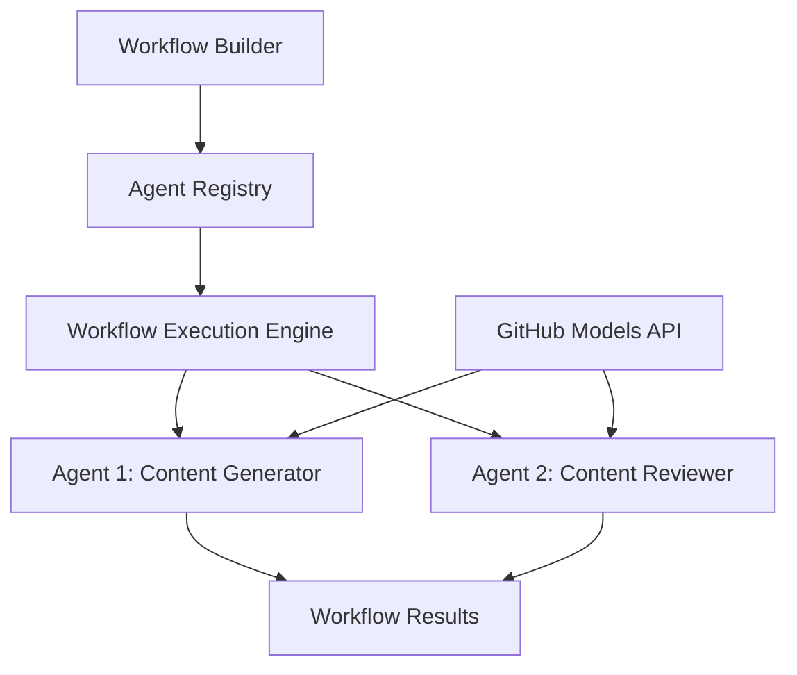

<!--
CO_OP_TRANSLATOR_METADATA:
{
  "original_hash": "034158688d0a45aae06dcbb21b0da5ae",
  "translation_date": "2025-11-11T12:45:37+00:00",
  "source_file": "08-multi-agent/code_samples/workflows-agent-framework/dotNET/01.dotnet-agent-framework-workflow-ghmodel-basic.md",
  "language_code": "mr"
}
-->
# 🔄 GitHub मॉडेल्स (.NET) सह मूलभूत एजंट वर्कफ्लो

## 📋 वर्कफ्लो ऑर्केस्ट्रेशन ट्यूटोरियल

या नोटबुकमध्ये Microsoft Agent Framework for .NET आणि GitHub मॉडेल्स वापरून प्रगत **एजंट वर्कफ्लो** तयार करण्याचे प्रदर्शन केले आहे. तुम्ही अशा बहु-चरणीय व्यवसाय प्रक्रियांचे निर्माण करणे शिकाल जिथे AI एजंट्स एकत्र काम करून संरचित ऑर्केस्ट्रेशन पॅटर्नद्वारे जटिल कार्ये पूर्ण करतात.

## 🎯 शिकण्याची उद्दिष्टे

### 🏗️ **वर्कफ्लो आर्किटेक्चर मूलभूत गोष्टी**
- **वर्कफ्लो बिल्डर**: जटिल बहु-चरणीय AI प्रक्रिया डिझाइन आणि ऑर्केस्ट्रेट करा
- **एजंट समन्वय**: वर्कफ्लोमध्ये अनेक विशेष एजंट्स समन्वयित करा
- **GitHub मॉडेल्स इंटिग्रेशन**: वर्कफ्लोमध्ये GitHub च्या AI मॉडेल इनफरन्स सेवा वापरा
- **व्हिज्युअल वर्कफ्लो डिझाइन**: चांगल्या समजासाठी वर्कफ्लो संरचना तयार करा आणि व्हिज्युअलाइझ करा

### 🔄 **प्रक्रिया ऑर्केस्ट्रेशन पॅटर्न्स**
- **क्रमिक प्रक्रिया**: लॉजिकल क्रमाने अनेक एजंट कार्ये साखळीबद्ध करा
- **स्टेट मॅनेजमेंट**: वर्कफ्लो टप्प्यांमध्ये संदर्भ आणि डेटा प्रवाह राखा
- **त्रुटी हाताळणी**: मजबूत त्रुटी पुनर्प्राप्ती आणि वर्कफ्लो लवचिकता अंमलात आणा
- **कामगिरी ऑप्टिमायझेशन**: एंटरप्राइझ-स्केल ऑपरेशन्ससाठी कार्यक्षम वर्कफ्लो डिझाइन करा

### 🏢 **एंटरप्राइझ वर्कफ्लो अनुप्रयोग**
- **व्यवसाय प्रक्रिया ऑटोमेशन**: जटिल संस्थात्मक वर्कफ्लो स्वयंचलित करा
- **सामग्री उत्पादन पाइपलाइन**: पुनरावलोकन आणि मंजुरी टप्प्यांसह संपादकीय वर्कफ्लो
- **ग्राहक सेवा ऑटोमेशन**: बहु-चरणीय ग्राहक चौकशी निराकरण
- **डेटा प्रक्रिया वर्कफ्लो**: AI-सक्षम रूपांतरणासह ETL वर्कफ्लो

## ⚙️ पूर्वअटी आणि सेटअप

### 📦 **आवश्यक NuGet पॅकेजेस**

या वर्कफ्लो प्रदर्शनात अनेक प्रमुख .NET पॅकेजेस वापरले जातात:

```xml
<!-- Core AI Framework -->
<PackageReference Include="Microsoft.Extensions.AI" Version="9.9.0" />

<!-- Agent Framework (Local Development) -->
<!-- Microsoft.Agents.AI.dll - Core agent abstractions -->
<!-- Microsoft.Agents.AI.OpenAI.dll - OpenAI/GitHub Models integration -->

<!-- Configuration and Environment -->
<PackageReference Include="DotNetEnv" Version="3.1.1" />
```

### 🔑 **GitHub मॉडेल्स कॉन्फिगरेशन**

**पर्यावरण सेटअप (.env फाइल):**
```env
GITHUB_TOKEN=your_github_personal_access_token
GITHUB_ENDPOINT=https://models.inference.ai.azure.com
GITHUB_MODEL_ID=gpt-4o-mini
```

**GitHub मॉडेल्स प्रवेश:**
1. GitHub मॉडेल्ससाठी साइन अप करा (सध्या प्रीव्ह्यूमध्ये)
2. मॉडेल प्रवेश परवानग्यांसह वैयक्तिक प्रवेश टोकन तयार करा
3. वरीलप्रमाणे पर्यावरणीय व्हेरिएबल्स कॉन्फिगर करा

### 🏗️ **वर्कफ्लो आर्किटेक्चर विहंगावलोकन**



**मुख्य घटक:**
- **WorkflowBuilder**: वर्कफ्लो डिझाइनसाठी मुख्य ऑर्केस्ट्रेशन इंजिन
- **AIAgent**: विशिष्ट क्षमता असलेले वैयक्तिक विशेष एजंट्स
- **GitHub Models Client**: AI मॉडेल इनफरन्स सेवा इंटिग्रेशन
- **Execution Context**: वर्कफ्लो टप्प्यांमध्ये स्टेट आणि डेटा प्रवाह व्यवस्थापित करते

## 🎨 **एंटरप्राइझ वर्कफ्लो डिझाइन पॅटर्न्स**

### 📝 **सामग्री उत्पादन वर्कफ्लो**
```
User Request → Content Generation → Quality Review → Final Output
```

### 🔍 **दस्तऐवज प्रक्रिया पाइपलाइन**
```
Document Input → Analysis → Extraction → Validation → Structured Output
```

### 💼 **व्यवसाय बुद्धिमत्ता वर्कफ्लो**
```
Data Collection → Processing → Analysis → Report Generation → Distribution
```

### 🤝 **ग्राहक सेवा ऑटोमेशन**
```
Customer Inquiry → Classification → Processing → Response Generation → Follow-up
```

## 🏢 **एंटरप्राइझ फायदे**

### 🎯 **विश्वसनीयता आणि स्केलेबिलिटी**
- **निश्चित अंमलबजावणी**: सुसंगत, पुनरावृत्ती करण्यायोग्य वर्कफ्लो परिणाम
- **त्रुटी पुनर्प्राप्ती**: वर्कफ्लोच्या कोणत्याही टप्प्यावर अपयशाचे सौम्य हाताळणी
- **कामगिरी निरीक्षण**: अंमलबजावणी मेट्रिक्स आणि ऑप्टिमायझेशन संधींचा मागोवा घ्या
- **संसाधन व्यवस्थापन**: AI मॉडेल संसाधनांचे कार्यक्षम वाटप आणि उपयोग

### 🔒 **सुरक्षा आणि अनुपालन**
- **सुरक्षित प्रमाणीकरण**: API प्रवेशासाठी GitHub टोकन-आधारित प्रमाणीकरण
- **ऑडिट ट्रेल्स**: वर्कफ्लो अंमलबजावणी आणि निर्णय बिंदूंची संपूर्ण लॉगिंग
- **प्रवेश नियंत्रण**: वर्कफ्लो अंमलबजावणी आणि निरीक्षणासाठी सूक्ष्म परवानग्या
- **डेटा गोपनीयता**: वर्कफ्लोमध्ये संवेदनशील माहितीचे सुरक्षित हाताळणी

### 📊 **निरीक्षणक्षमता आणि व्यवस्थापन**
- **व्हिज्युअल वर्कफ्लो डिझाइन**: प्रक्रिया प्रवाह आणि अवलंबित्वांचे स्पष्ट प्रतिनिधित्व
- **अंमलबजावणी निरीक्षण**: वर्कफ्लो प्रगती आणि कामगिरीचे रिअल-टाइम ट्रॅकिंग
- **त्रुटी अहवाल**: तपशीलवार त्रुटी विश्लेषण आणि डीबगिंग क्षमता
- **कामगिरी विश्लेषण**: ऑप्टिमायझेशन आणि क्षमता नियोजनासाठी मेट्रिक्स

तुमचा पहिला एंटरप्राइझ-रेडी AI वर्कफ्लो तयार करूया! 🚀

## 💻 कोड चालवणे

पूर्ण अंमलबजावणी `01.dotnet-agent-framework-workflow-ghmodel-basic.cs` मध्ये उपलब्ध आहे. या फाइलमध्ये खालील गोष्टींचे प्रदर्शन केले आहे:

1. **पर्यावरण कॉन्फिगरेशन** - GitHub मॉडेल्स क्रेडेन्शियल्स `.env` फाइलमधून लोड करणे
2. **OpenAI क्लायंट सेटअप** - GitHub मॉडेल्स एंडपॉइंट वापरण्यासाठी क्लायंट कॉन्फिगर करणे
3. **एजंट निर्मिती** - विशेष एजंट्स (फ्रंट डेस्क आणि कन्सीअर्ज) परिभाषित करणे
4. **वर्कफ्लो बिल्डर** - क्रमिक प्रक्रियेसह बहु-एजंट वर्कफ्लो तयार करणे
5. **वर्कफ्लो अंमलबजावणी** - स्ट्रीमिंग परिणामांसह वर्कफ्लो चालवणे

### 🚀 उदाहरण चालवणे

```bash
# Make the script executable (Unix/Linux/macOS)
chmod +x 01.dotnet-agent-framework-workflow-ghmodel-basic.cs

# Run the workflow
./01.dotnet-agent-framework-workflow-ghmodel-basic.cs
```

किंवा Windows वर:
```powershell
dotnet run 01.dotnet-agent-framework-workflow-ghmodel-basic.cs
```

### 📝 अपेक्षित आउटपुट

वर्कफ्लो:
1. तुमच्या प्रवासाच्या गंतव्यस्थानाच्या विनंतीचा स्वीकार करेल ("मला पॅरिसला जायचे आहे")
2. फ्रंट डेस्क एजंट प्रारंभिक शिफारस प्रदान करेल
3. कन्सीअर्ज एजंट शिफारस पुनरावलोकन करून सुधारित करेल
4. अंतिम आउटपुट संपूर्ण संभाषण प्रवाह प्रदर्शित करेल

### 🔧 सानुकूलन

तुम्ही वर्कफ्लो सानुकूलित करू शकता:
- एजंटच्या वर्तनात बदल करण्यासाठी त्यांच्या सूचना बदलून
- अधिक एजंट्स जोडून जटिल बहु-चरणीय वर्कफ्लो तयार करण्यासाठी
- वेगवेगळ्या परिस्थितींची चाचणी करण्यासाठी वापरकर्ता संदेश बदलून
- वेगवेगळ्या अंमलबजावणी पॅटर्न तयार करण्यासाठी वर्कफ्लो एजेस समायोजित करून

---

<!-- CO-OP TRANSLATOR DISCLAIMER START -->
**अस्वीकरण**:  
हा दस्तऐवज AI भाषांतर सेवा [Co-op Translator](https://github.com/Azure/co-op-translator) वापरून भाषांतरित करण्यात आला आहे. आम्ही अचूकतेसाठी प्रयत्नशील असलो तरी, कृपयास लक्षात ठेवा की स्वयंचलित भाषांतरे त्रुटी किंवा अचूकतेच्या अभावाने युक्त असू शकतात. मूळ भाषेतील दस्तऐवज हा अधिकृत स्रोत मानला जावा. महत्त्वाच्या माहितीसाठी, व्यावसायिक मानवी भाषांतराची शिफारस केली जाते. या भाषांतराचा वापर करून उद्भवलेल्या कोणत्याही गैरसमज किंवा चुकीच्या अर्थासाठी आम्ही जबाबदार नाही.
<!-- CO-OP TRANSLATOR DISCLAIMER END -->