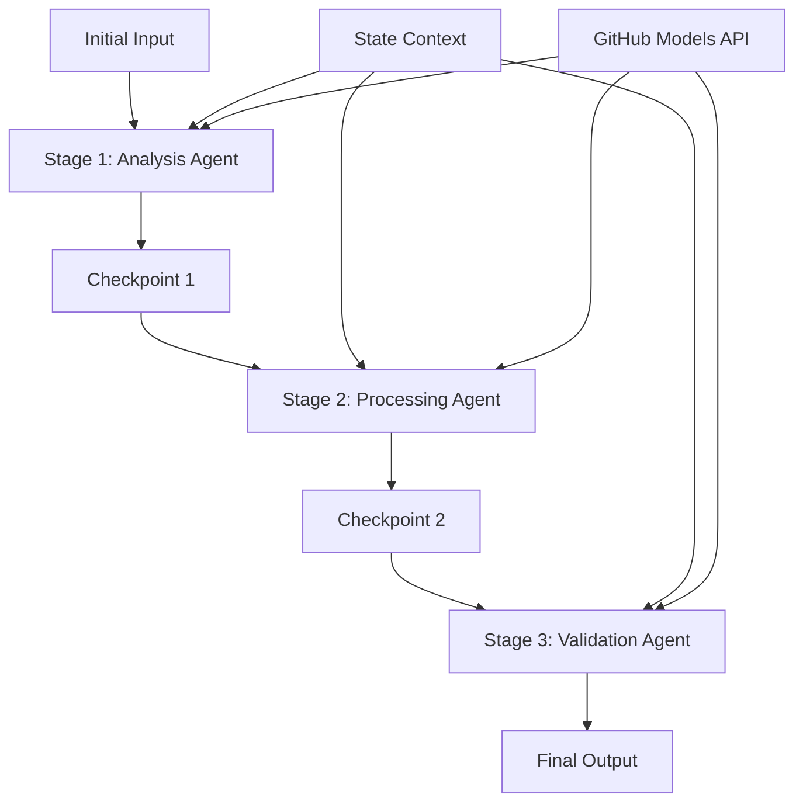

<!--
CO_OP_TRANSLATOR_METADATA:
{
  "original_hash": "1be9c8dcbd79a02d33d2c138684c1394",
  "translation_date": "2025-11-11T13:47:33+00:00",
  "source_file": "08-multi-agent/code_samples/workflows-agent-framework/dotNET/02.dotnet-agent-framework-workflow-ghmodel-sequential.md",
  "language_code": "mr"
}
-->
# ⏩ GitHub मॉडेल्स (.NET) सह अनुक्रमिक एजंट वर्कफ्लो

## 📋 प्रगत अनुक्रमिक प्रक्रिया ट्यूटोरियल

या नोटबुकमध्ये Microsoft Agent Framework for .NET आणि GitHub मॉडेल्स वापरून **अनुक्रमिक वर्कफ्लो पॅटर्न्स** कसे तयार करायचे हे दाखवले आहे. तुम्ही एजंट्स विशिष्ट क्रमाने कसे कार्य करतात आणि प्रत्येक टप्पा मागील टप्प्याच्या निकालांवर आधारित कसा असतो हे शिकाल.

## 🎯 शिकण्याचे उद्दिष्टे

### 🔄 **अनुक्रमिक प्रक्रिया आर्किटेक्चर**
- **रेखीय वर्कफ्लो डिझाइन**: स्पष्ट अवलंबित्वांसह चरण-दर-चरण प्रक्रिया पाइपलाइन तयार करा
- **स्थिती व्यवस्थापन**: अनुक्रमिक वर्कफ्लो टप्प्यांमध्ये संदर्भ आणि डेटा प्रवाह टिकवून ठेवा
- **GitHub मॉडेल्स एकत्रीकरण**: GitHub च्या AI मॉडेल्सचा बहु-टप्प्याच्या .NET वर्कफ्लोमध्ये उपयोग करा
- **एंटरप्राइझ पाइपलाइन पॅटर्न्स**: उत्पादनासाठी तयार अनुक्रमिक प्रक्रिया प्रणाली तयार करा

### 🏗️ **प्रगत अनुक्रमिक पॅटर्न्स**
- **स्टेज-गेट प्रक्रिया**: वर्कफ्लो टप्प्यांमध्ये पडताळणी चेकपॉइंट्स लागू करा
- **संदर्भ टिकवून ठेवणे**: सर्व टप्प्यांमध्ये स्थिती आणि जमा झालेल्या ज्ञानाची देखभाल करा
- **त्रुटी प्रसार**: अनुक्रमिक प्रक्रिया साखळ्यांमध्ये अपयशांचा सौम्यपणे सामना करा
- **कामगिरीची ऑप्टिमायझेशन**: किमान ओव्हरहेडसह कार्यक्षम अनुक्रमिक अंमलबजावणी

### 🏢 **एंटरप्राइझ अनुक्रमिक अनुप्रयोग**
- **दस्तऐवज प्रक्रिया पाइपलाइन**: बहु-टप्प्याची दस्तऐवज विश्लेषण, रूपांतरण आणि पडताळणी
- **गुणवत्ता आश्वासन वर्कफ्लो**: अनुक्रमिक पुनरावलोकन, पडताळणी आणि मंजुरी प्रक्रिया
- **सामग्री उत्पादन पाइपलाइन**: संशोधन → लेखन → संपादन → पुनरावलोकन → प्रकाशन
- **व्यवसाय प्रक्रिया ऑटोमेशन**: स्पष्ट टप्प्याच्या अवलंबित्वांसह बहु-चरण व्यवसाय वर्कफ्लो

## ⚙️ पूर्वतयारी आणि सेटअप

### 📦 **आवश्यक NuGet पॅकेजेस**

.NET अनुक्रमिक वर्कफ्लो साठी आवश्यक पॅकेजेस:

```xml
<!-- Core AI Framework -->
<PackageReference Include="Microsoft.Extensions.AI" Version="9.9.0" />

<!-- Client Model Abstractions -->
<PackageReference Include="System.ClientModel" Version="1.6.1.0" />

<!-- Azure Identity and Async LINQ Support -->
<PackageReference Include="Azure.Identity" Version="1.15.0" />
<PackageReference Include="System.Linq.Async" Version="6.0.3" />

<!-- Local Agent Framework References -->
<!-- Microsoft.Agents.AI.dll - Core agent abstractions -->
<!-- Microsoft.Agents.AI.OpenAI.dll - GitHub Models integration -->
```

### 🔑 **GitHub मॉडेल्स कॉन्फिगरेशन**

**पर्यावरण सेटअप (.env फाइल):**
```env
GITHUB_TOKEN=your_github_personal_access_token
GITHUB_ENDPOINT=https://models.inference.ai.azure.com
GITHUB_MODEL_ID=gpt-4o-mini
```

**कॉन्फिगरेशन व्यवस्थापन:**
```csharp
// Load environment variables securely
Env.Load("../../../.env");
var githubToken = Environment.GetEnvironmentVariable("GITHUB_TOKEN");
var githubEndpoint = Environment.GetEnvironmentVariable("GITHUB_ENDPOINT");
var modelId = Environment.GetEnvironmentVariable("GITHUB_MODEL_ID");
```

### 🏗️ **अनुक्रमिक वर्कफ्लो आर्किटेक्चर**



**मुख्य घटक:**
- **अनुक्रमिक एजंट्स**: प्रत्येक प्रक्रिया टप्प्यासाठी विशेष एजंट्स
- **स्थिती संदर्भ**: सर्व टप्प्यांमध्ये जमा झालेल्या डेटा आणि निर्णयांची देखभाल
- **चेकपॉइंट्स**: प्रत्येक टप्प्यात गुणवत्ता आणि सुसंगतता सुनिश्चित करण्यासाठी पडताळणी बिंदू
- **GitHub मॉडेल्स क्लायंट**: सर्व वर्कफ्लो टप्प्यांमध्ये सुसंगत AI मॉडेल प्रवेश

## 🎨 **अनुक्रमिक वर्कफ्लो डिझाइन पॅटर्न्स**

### 📝 **दस्तऐवज प्रक्रिया पाइपलाइन**
```
Raw Document → Content Extraction → Analysis → Validation → Structured Output
```

### 🎯 **सामग्री निर्मिती वर्कफ्लो**
```
Brief/Requirements → Research → Content Creation → Review → Final Polish
```

### 🔍 **गुणवत्ता आश्वासन पाइपलाइन**
```
Initial Review → Technical Validation → Compliance Check → Final Approval
```

### 💼 **व्यवसाय बुद्धिमत्ता वर्कफ्लो**
```
Data Collection → Processing → Analysis → Report Generation → Distribution
```

## 🏢 **एंटरप्राइझ अनुक्रमिक फायदे**

### 🎯 **विश्वसनीयता आणि गुणवत्ता**
- **निश्चित प्रक्रिया**: संरचित टप्प्यांद्वारे सुसंगत, पुनरावृत्ती होणारे परिणाम
- **गुणवत्ता गेट्स**: प्रत्येक टप्प्यात पडताळणी चेकपॉइंट्स गुणवत्ता सुनिश्चित करतात
- **त्रुटी वेगळे करणे**: एका टप्प्यातील समस्या पुढील टप्प्यांमध्ये प्रसारित होत नाहीत
- **ऑडिट ट्रेल्स**: प्रत्येक टप्प्यातील निर्णय आणि रूपांतरणांचे संपूर्ण ट्रॅकिंग

### 📈 **स्केलेबिलिटी आणि कामगिरी**
- **मॉड्युलर डिझाइन**: प्रत्येक टप्प्याचे स्वतंत्रपणे ऑप्टिमायझेशन करता येते
- **संसाधन व्यवस्थापन**: टप्प्यांमध्ये AI मॉडेल संसाधनांचा कार्यक्षम वाटप
- **स्थिती ऑप्टिमायझेशन**: किमान स्थिती हस्तांतरणासह सर्वोत्तम कामगिरी
- **पॅरलल स्टेज ग्रुप्स**: अनेक अनुक्रमिक वर्कफ्लो समांतर चालवता येतात

### 🔒 **सुरक्षा आणि अनुपालन**
- **टप्पा-स्तरीय सुरक्षा**: वेगवेगळ्या प्रक्रिया टप्प्यांसाठी वेगवेगळ्या सुरक्षा धोरणे
- **डेटा पडताळणी**: प्रत्येक चेकपॉइंटवर डेटा अखंडता आणि अनुपालन सुनिश्चित करा
- **प्रवेश नियंत्रण**: वेगवेगळ्या वर्कफ्लो टप्प्यांसाठी सूक्ष्म परवानग्या
- **नियामक अनुपालन**: संरचित प्रक्रियेद्वारे नियामक आवश्यकता पूर्ण करा

### 📊 **मॉनिटरिंग आणि विश्लेषण**
- **टप्पा-स्तरीय मेट्रिक्स**: प्रत्येक वर्कफ्लो टप्प्यासाठी कामगिरीचे निरीक्षण
- **बॉटलनेक ओळख**: धीमे टप्पे ओळखून ऑप्टिमायझेशन करा
- **गुणवत्ता मेट्रिक्स**: प्रत्येक टप्प्यात गुणवत्ता आणि यश दर ट्रॅक करा
- **प्रक्रिया ऑप्टिमायझेशन**: टप्पा-स्तरीय विश्लेषणावर आधारित सतत सुधारणा

चला मजबूत अनुक्रमिक AI प्रक्रिया पाइपलाइन तयार करूया! 🚀

## 💻 कोड चालवणे

संपूर्ण अंमलबजावणी `02.dotnet-agent-framework-workflow-ghmodel-sequential.cs` मध्ये उपलब्ध आहे. या फाइलमध्ये **तीन-टप्प्याची फर्निचर विश्लेषण वर्कफ्लो** दाखवली आहे:

1. **टप्पा 1 - विक्री एजंट**: फर्निचर प्रतिमा विश्लेषण करतो आणि खरेदीच्या शिफारसी देतो
2. **टप्पा 2 - किंमत एजंट**: तपशीलवार किंमत विश्लेषण आणि बजेट पर्याय प्रदान करतो
3. **टप्पा 3 - कोट एजंट**: Markdown स्वरूपात व्यावसायिक कोट दस्तऐवज तयार करतो

### 🏗️ **वर्कफ्लो आर्किटेक्चर**

```
Image Input → Sales Analysis → Price Estimation → Quote Generation → Final Output
```

प्रत्येक एजंट:
- मागील टप्प्याचा आउटपुट संदर्भ म्हणून प्राप्त करतो
- मागील विश्लेषणावर विशेष कौशल्यासह पुढे कार्य करतो
- स्थिती व्यवस्थापनाद्वारे वर्कफ्लो सातत्य टिकवतो

### 🚀 उदाहरण चालवणे

**पूर्वतयारी:**
- `../imgs/home.png` येथे फर्निचर प्रतिमा ठेवा (किंवा `imgPath` व्हेरिएबल अपडेट करा)
- तुमच्या `.env` फाइलमध्ये GitHub मॉडेल्स क्रेडेन्शियल्स कॉन्फिगर करा

```bash
# Make the script executable (Unix/Linux/macOS)
chmod +x 02.dotnet-agent-framework-workflow-ghmodel-sequential.cs

# Run the sequential workflow
./02.dotnet-agent-framework-workflow-ghmodel-sequential.cs
```

किंवा Windows वर:
```powershell
dotnet run 02.dotnet-agent-framework-workflow-ghmodel-sequential.cs
```

### 📝 अपेक्षित आउटपुट

वर्कफ्लो:
1. **विक्री एजंट**: प्रतिमेतून फर्निचर आयटम ओळखतो आणि शिफारसी देतो
2. **किंमत एजंट**: बजेट स्तरांसह तपशीलवार किंमत विश्लेषण आणि खरेदीच्या शिफारसी जोडतो
3. **कोट एजंट**: सर्व माहिती एकत्रित करून स्वरूपित कोट दस्तऐवज तयार करतो

अंतिम आउटपुट प्रतिमा विश्लेषणावर आधारित एक व्यापक, व्यावसायिक फर्निचर कोट असेल.

### 🔧 सानुकूलन पर्याय

**एजंट वर्तन बदलणे:**
```csharp
// Adjust agent instructions to change their focus
const string SalesAgentInstructions = "Your custom instructions...";
```

**अनुक्रमिक प्रवाह बदलणे:**
```csharp
// Add or reorder workflow stages
var workflow = new WorkflowBuilder(salesagent)
    .AddEdge(salesagent, priceagent)
    .AddEdge(priceagent, quoteagent)
    .AddEdge(quoteagent, newAgent)  // Add another stage
    .Build();
```

**वेगळा इनपुट वापरणे:**
```csharp
// Process text instead of images
ChatMessage userMessage = new ChatMessage(ChatRole.User, [
    new TextContent("Analyze pricing for a modern living room set")
]);
```

### 🎯 वास्तविक-जगातील अनुप्रयोग

हा अनुक्रमिक पॅटर्न आदर्श आहे:
- **ई-कॉमर्स**: उत्पादन विश्लेषण → किंमत → कोट निर्मिती
- **रिअल इस्टेट**: मालमत्ता विश्लेषण → मूल्यांकन → लिस्टिंग निर्मिती
- **विमा**: दावा विश्लेषण → मूल्यांकन → कोट निर्मिती
- **सामग्री निर्मिती**: संशोधन → लेखन → संपादन → प्रकाशन

### 🔍 स्थिती प्रवाह समजून घेणे

अनुक्रमात प्रत्येक एजंट प्राप्त करतो:
- **मूळ इनपुट**: प्रारंभिक वापरकर्ता संदेश (प्रतिमा + मजकूर)
- **मागील एजंट आउटपुट्स**: संभाषण इतिहासातील सर्व मागील एजंट प्रतिसाद
- **जमा झालेला संदर्भ**: वर्कफ्लो दरम्यान टिकवलेली संपूर्ण स्थिती

यामुळे प्रगत बहु-टप्प्याची प्रक्रिया शक्य होते जिथे प्रत्येक एजंट मागील सर्व टप्प्यांमधील व्यापक संदर्भावर आधारित कार्य करतो.

---

<!-- CO-OP TRANSLATOR DISCLAIMER START -->
**अस्वीकरण**:  
हा दस्तऐवज AI भाषांतर सेवा [Co-op Translator](https://github.com/Azure/co-op-translator) वापरून भाषांतरित करण्यात आला आहे. आम्ही अचूकतेसाठी प्रयत्नशील असलो तरी, कृपया लक्षात ठेवा की स्वयंचलित भाषांतरे त्रुटी किंवा अचूकतेच्या अभावाने युक्त असू शकतात. मूळ भाषेतील दस्तऐवज हा अधिकृत स्रोत मानला जावा. महत्त्वाच्या माहितीसाठी, व्यावसायिक मानवी भाषांतराची शिफारस केली जाते. या भाषांतराचा वापर करून उद्भवलेल्या कोणत्याही गैरसमज किंवा चुकीच्या अर्थासाठी आम्ही जबाबदार राहणार नाही.
<!-- CO-OP TRANSLATOR DISCLAIMER END -->