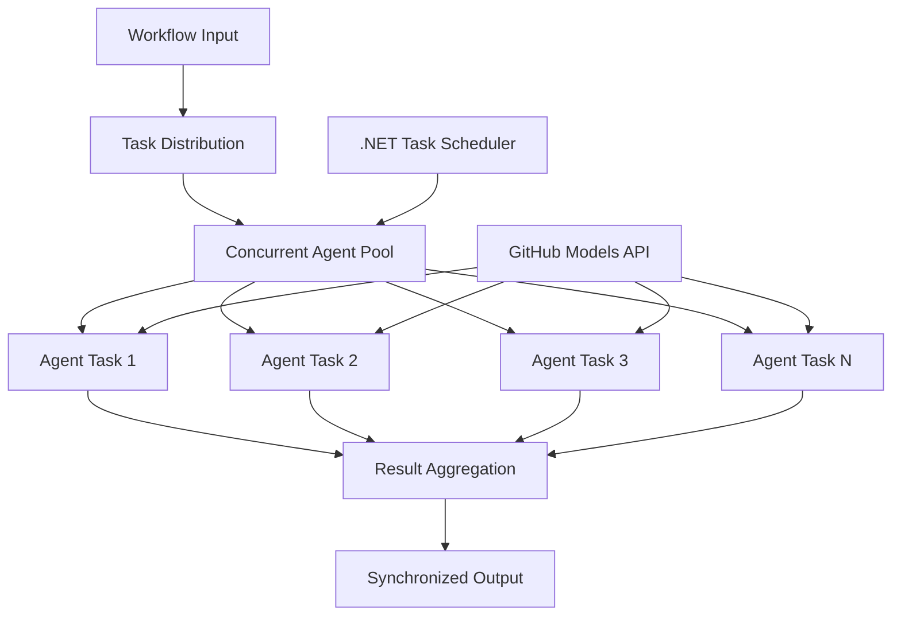

<!--
CO_OP_TRANSLATOR_METADATA:
{
  "original_hash": "b9c6e32c9b5f2fed20b6916984440d88",
  "translation_date": "2025-11-11T13:13:51+00:00",
  "source_file": "08-multi-agent/code_samples/workflows-agent-framework/dotNET/03.dotnet-agent-framework-workflow-ghmodel-concurrent.md",
  "language_code": "mr"
}
-->
# ⚡ GitHub मॉडेल्स (.NET) सह समांतर एजंट वर्कफ्लो

## 📋 उच्च-प्रदर्शन समांतर प्रक्रिया ट्यूटोरियल

या नोटबुकमध्ये Microsoft Agent Framework for .NET आणि GitHub मॉडेल्स वापरून **समांतर वर्कफ्लो पॅटर्न्स** कसे तयार करायचे हे दाखवले आहे. तुम्ही एकाच वेळी अनेक AI एजंट्स चालवून समन्वय आणि डेटा सुसंगतता राखत throughput कसा वाढवायचा हे शिकाल.

## 🎯 शिकण्याचे उद्दिष्ट

### 🚀 **समांतर प्रक्रिया मूलतत्त्वे**
- **समांतर एजंट अंमलबजावणी**: जास्तीत जास्त कार्यक्षमतेसाठी एकाच वेळी अनेक AI एजंट्स चालवा
- **Async/Await पॅटर्न्स**: कार्यक्षम समांतरतेसाठी .NET च्या async प्रोग्रामिंग मॉडेलचा लाभ घ्या
- **GitHub मॉडेल्स एकत्रीकरण**: GitHub च्या AI मॉडेल इनफरन्स सेवेसाठी अनेक समांतर कॉल समन्वयित करा
- **संसाधन व्यवस्थापन**: समांतर ऑपरेशन्समध्ये AI मॉडेल संसाधने कार्यक्षमतेने व्यवस्थापित करा

### 🏗️ **प्रगत समांतर आर्किटेक्चर**
- **टास्क-आधारित समांतरता**: इष्टतम समांतर अंमलबजावणीसाठी .NET Task Parallel Library वापरा
- **समन्वय पॅटर्न्स**: रेस कंडीशन्स टाळून समांतर एजंट्स समन्वयित करा
- **लोड बॅलन्सिंग**: उपलब्ध समांतर प्रक्रिया क्षमतेवर कार्य कार्यक्षमतेने वितरित करा
- **फॉल्ट टॉलरन्स**: संपूर्ण वर्कफ्लो थांबविल्याशिवाय वैयक्तिक एजंट अपयश हाताळा

### 🏢 **एंटरप्राइझ समांतर अनुप्रयोग**
- **उच्च-खंड दस्तऐवज प्रक्रिया**: एकाच वेळी अनेक दस्तऐवज प्रक्रिया करा
- **रिअल-टाइम सामग्री विश्लेषण**: येणाऱ्या डेटा प्रवाहांचे समांतर विश्लेषण
- **बॅच प्रक्रिया ऑप्टिमायझेशन**: मोठ्या प्रमाणात डेटा प्रक्रिया ऑपरेशन्ससाठी throughput जास्तीत जास्त करा
- **मल्टी-मोडल विश्लेषण**: विविध सामग्री प्रकार आणि स्वरूपांचे समांतर प्रक्रिया

## ⚙️ पूर्वअटी आणि सेटअप

### 📦 **आवश्यक NuGet पॅकेजेस**

उच्च-प्रदर्शन समांतर वर्कफ्लोसाठी आवश्यक पॅकेजेस:

```xml
<!-- Core AI Framework with Async Support -->
<PackageReference Include="Microsoft.Extensions.AI" Version="9.9.0" />

<!-- Client Model Abstractions for API Communication -->
<PackageReference Include="System.ClientModel" Version="1.6.1.0" />

<!-- Azure Identity and Async LINQ for Advanced Operations -->
<PackageReference Include="Azure.Identity" Version="1.15.0" />
<PackageReference Include="System.Linq.Async" Version="6.0.3" />

<!-- Local Agent Framework References -->
<!-- Microsoft.Agents.AI.dll - Core agent abstractions with async support -->
<!-- Microsoft.Agents.AI.OpenAI.dll - GitHub Models integration with concurrency -->
```

### 🔑 **GitHub मॉडेल्स कॉन्फिगरेशन**

**पर्यावरण सेटअप (.env फाइल):**
```env
GITHUB_TOKEN=your_github_personal_access_token
GITHUB_ENDPOINT=https://models.inference.ai.azure.com
GITHUB_MODEL_ID=gpt-4o-mini
```

**समांतर प्रक्रिया विचार:**
```csharp
// Configure for concurrent operations
var clientOptions = new OpenAIClientOptions()
{
    Endpoint = new Uri(githubEndpoint),
    // Configure connection pooling for concurrent requests
    NetworkTimeout = TimeSpan.FromMinutes(5)
};
```

### 🏗️ **समांतर वर्कफ्लो आर्किटेक्चर**



**मुख्य घटक:**
- **Task Parallel Library**: समांतर ऑपरेशन्ससाठी .NET ची अंगभूत समर्थन
- **Agent Pool**: समांतर प्रक्रियेसाठी अनेक एजंट उदाहरणे
- **Result Aggregation**: समांतर एजंट्सच्या निकालांचे समन्वय आणि विलीन करणे
- **Synchronization Points**: समांतर ऑपरेशन्समध्ये डेटा सुसंगतता सुनिश्चित करा

## 🎨 **समांतर वर्कफ्लो डिझाइन पॅटर्न्स**

### 🔍 **समांतर संशोधन आणि विश्लेषण**
```
Research Topic → Concurrent Research Agents → Result Synthesis → Final Report
```

### 📊 **मल्टी-सोर्स डेटा प्रक्रिया**
```
Data Sources → Parallel Processing Agents → Data Integration → Unified Output
```

### 🎭 **सामग्री निर्मिती पाइपलाइन**
```
Content Requirements → Concurrent Content Generators → Quality Review → Final Content
```

### 🔄 **Fan-Out/Fan-In प्रक्रिया**
```
Single Input → Multiple Concurrent Processors → Result Aggregation → Single Output
```

## 🏢 **एंटरप्राइझ कार्यक्षमता फायदे**

### ⚡ **थ्रूपुट आणि स्केलेबिलिटी**
- **रेखीय कार्यक्षमता स्केलिंग**: throughput वाढवण्यासाठी अधिक समांतर एजंट्स जोडा
- **संसाधन उपयोग**: उपलब्ध AI मॉडेल क्षमतेची जास्तीत जास्त कार्यक्षमता
- **कमी प्रक्रिया वेळ**: समांतर अंमलबजावणीद्वारे लक्षणीय वेळ कमी करणे
- **एलास्टिक स्केलिंग**: वर्कलोडवर आधारित समांतर एजंट्सची संख्या गतिशीलपणे समायोजित करा

### 🛡️ **विश्वसनीयता आणि लवचिकता**
- **फॉल्ट आयसोलेशन**: वैयक्तिक एजंट अपयश इतर समांतर ऑपरेशन्सवर परिणाम करत नाही
- **ग्रेसफुल डिग्रेडेशन**: कमी एजंट क्षमतेसह प्रणाली कार्य करत राहते
- **एरर रिकव्हरी**: अपयशी समांतर ऑपरेशन्ससाठी स्वयंचलित पुनर्प्रयत्न यंत्रणा
- **लोड वितरण**: उपलब्ध एजंट्समध्ये कार्य समानपणे वितरित करा

### 📊 **कार्यप्रदर्शन निरीक्षण**
- **समांतर अंमलबजावणी मेट्रिक्स**: सर्व समांतर ऑपरेशन्सचे कार्यप्रदर्शन ट्रॅक करा
- **संसाधन वापर विश्लेषण**: CPU, मेमरी आणि नेटवर्क उपयोगाचे निरीक्षण करा
- **थ्रूपुट विश्लेषण**: समांतर प्रक्रियेमुळे कार्यक्षमतेत मिळालेली वाढ मोजा
- **बॉटलनेक डिटेक्शन**: कार्यप्रदर्शन मर्यादा ओळखून सोडवा

### 🔧 **विकसन आणि ऑपरेशन्स**
- **Async प्रोग्रामिंग मॉडेल**: .NET च्या परिपक्व async/await पॅटर्न्सचा लाभ घ्या
- **टास्क समन्वय**: अंगभूत टास्क व्यवस्थापन आणि समन्वय क्षमता
- **अपवाद हाताळणी**: समांतर ऑपरेशन्ससाठी व्यापक एरर हँडलिंग
- **डिबगिंग समर्थन**: समांतर वर्कफ्लोसाठी Visual Studio डिबगिंग टूल्स

चला .NET सह उच्च-प्रदर्शन समांतर AI वर्कफ्लो तयार करूया! 🚀

## 💻 कोड चालवणे

पूर्ण अंमलबजावणी `03.dotnet-agent-framework-workflow-ghmodel-concurrent.cs` मध्ये उपलब्ध आहे. ही फाइल प्रवास नियोजनासाठी **Fan-Out/Fan-In समांतर वर्कफ्लो** प्रदर्शित करते:

### 🏗️ **वर्कफ्लो आर्किटेक्चर**

```
User Request → ConcurrentStartExecutor → [Researcher Agent || Planner Agent] → ConcurrentAggregationExecutor → Final Output
```

**मुख्य घटक:**

1. **ConcurrentStartExecutor**: वापरकर्त्याच्या विनंतीला एकाच वेळी सर्व एजंट्सकडे प्रसारित करते
2. **Researcher Agent**: गंतव्ये आणि आकर्षणे समांतरपणे विश्लेषित करते
3. **Planner Agent**: तपशीलवार प्रवास योजना समांतरपणे तयार करते
4. **ConcurrentAggregationExecutor**: दोन्ही एजंट्सकडून निकाल गोळा करून विलीन करते

### 🎯 **Fan-Out/Fan-In पॅटर्न**

हा वर्कफ्लो क्लासिक **Fan-Out/Fan-In** पॅटर्न प्रदर्शित करतो:
- **Fan-Out**: एक इनपुट संदेश एकाच वेळी अनेक एजंट्सकडे प्रसारित केला जातो
- **समांतर प्रक्रिया**: अनेक एजंट्स एकाच कार्यावर समांतरपणे काम करतात
- **Fan-In**: सर्व एजंट्सकडून निकाल गोळा करून एकाच आउटपुटमध्ये विलीन करणे

### 🚀 उदाहरण चालवणे

```bash
# Make the script executable (Unix/Linux/macOS)
chmod +x 03.dotnet-agent-framework-workflow-ghmodel-concurrent.cs

# Run the concurrent workflow
./03.dotnet-agent-framework-workflow-ghmodel-concurrent.cs
```

किंवा Windows वर:
```powershell
dotnet run 03.dotnet-agent-framework-workflow-ghmodel-concurrent.cs
```

### 📝 अपेक्षित आउटपुट

वर्कफ्लो:
1. **विनंती प्रसारित करेल**: "डिसेंबरमध्ये सिएटलला प्रवास योजना करा" दोन्ही एजंट्सकडे पाठवेल
2. **समांतर प्रक्रिया**: दोन्ही एजंट्स एकाच वेळी काम करतील:
   - रिसर्चर आकर्षणे आणि तपशील ओळखेल
   - प्लॅनर प्रवासाचे वेळापत्रक आणि लॉजिस्टिक्स तयार करेल
3. **Aggregation**: दोन्ही प्रतिसाद एकत्रित करून व्यापक आउटपुट तयार करेल
4. **निकाल प्रदर्शित करेल**: सर्व माहिती असलेली एकत्रित प्रवास योजना दाखवेल

### 🔧 सानुकूलन पर्याय

**अधिक समांतर एजंट्स जोडा:**
```csharp
// Create additional specialized agents
AIAgent budgetAgent = openAIClient.GetChatClient(github_model_id).CreateAIAgent(
    name: "Budget-Agent", instructions: "Calculate travel costs...");

// Add to fan-out
var workflow = new WorkflowBuilder(startExecutor)
    .AddFanOutEdge(startExecutor, targets: [researcherAgent, plannerAgent, budgetAgent])
    .AddFanInEdge(aggregationExecutor, sources: [researcherAgent, plannerAgent, budgetAgent])
    .WithOutputFrom(aggregationExecutor)
    .Build();

// Update aggregation count
if (this._messages.Count == 3) { ... }
```

**एजंट सूचना बदला:**
```csharp
const string ResearcherAgentInstructions = "Your custom instructions for research...";
const string PlanAgentInstructions = "Your custom instructions for planning...";
```

**कार्य बदला:**
```csharp
StreamingRun run = await InProcessExecution.StreamAsync(
    workflow, 
    "Plan a European vacation for 2 weeks in summer"
);
```

### 🎯 वास्तविक-जगातील अनुप्रयोग

हा समांतर पॅटर्न आदर्श आहे:
- **सामग्री निर्मिती**: अनेक लेखक एकाच वेळी विविध विभाग तयार करत आहेत
- **कोड पुनरावलोकन**: विविध दृष्टिकोनातून कोडचे विश्लेषण करणारे अनेक पुनरावलोकक
- **बाजार संशोधन**: विविध बाजार विभागांचे समांतर विश्लेषण
- **दस्तऐवज प्रक्रिया**: समांतरपणे काढणे, विश्लेषण आणि पडताळणी
- **मल्टी-पर्सपेक्टिव्ह विश्लेषण**: एकाच इनपुटवर विविध दृष्टिकोन मिळवणे

### 🔍 सानुकूल Executors समजून घेणे

**ConcurrentStartExecutor:**
- `IMessageHandler<string>` अंमलबजावणी करून स्ट्रिंग इनपुट स्वीकारतो
- सर्व कनेक्टेड एजंट्सकडे संदेश प्रसारित करतो
- समांतर प्रक्रियेसाठी `TurnToken` पाठवतो

**ConcurrentAggregationExecutor:**
- `IMessageHandler<ChatMessage>` अंमलबजावणी करून एजंट प्रतिसाद स्वीकारतो
- थ्रेड-सुरक्षित पद्धतीने संदेश गोळा करतो
- अपेक्षित प्रतिसाद आल्यावर विलीन करतो
- `context.YieldOutputAsync()` वापरून अंतिम आउटपुट देते

### ⚡ कार्यक्षमता फायदे

**समांतर vs अनुक्रमिक:**
- अनुक्रमिक: Agent1 (30s) → Agent2 (30s) = **60 सेकंद एकूण**
- समांतर: Agent1 (30s) || Agent2 (30s) = **30 सेकंद एकूण**

**थ्रूपुट सुधारणा**: N समांतर एजंट्ससाठी N× वेगवान (वर्कलोड आणि संसाधनांवर अवलंबून)

### 🛡️ एरर हाताळणी

वर्कफ्लो वैयक्तिक एजंट अपयश सहजपणे हाताळतो:
- जर एक एजंट अपयशी झाला, तर इतर प्रक्रिया सुरू ठेवतात
- Aggregator टाइमआउट लॉजिक अंमलबजावणी करू शकतो
- आवश्यक असल्यास आंशिक निकाल परत करता येतो

### 📊 प्रगत वैशिष्ट्ये

**डायनॅमिक एजंट संख्या:**
विलीन लॉजिक बदलून बदलत्या एजंट संख्येला समर्थन द्या:

```csharp
private int _expectedAgentCount;
private readonly List<ChatMessage> _messages = [];

public async ValueTask HandleAsync(ChatMessage message, IWorkflowContext context)
{
    this._messages.Add(message);
    if (this._messages.Count == _expectedAgentCount)
    {
        // Process aggregation
    }
}
```

हा समांतर वर्कफ्लो पॅटर्न उच्च-प्रदर्शन, स्केलेबल AI एजंट सिस्टम्स तयार करण्यासाठी आवश्यक आहे!

---

<!-- CO-OP TRANSLATOR DISCLAIMER START -->
**अस्वीकरण**:  
हा दस्तऐवज AI भाषांतर सेवा [Co-op Translator](https://github.com/Azure/co-op-translator) वापरून भाषांतरित करण्यात आला आहे. आम्ही अचूकतेसाठी प्रयत्नशील असलो तरी, कृपया लक्षात ठेवा की स्वयंचलित भाषांतरे त्रुटी किंवा अचूकतेच्या अभावाने युक्त असू शकतात. मूळ भाषेतील दस्तऐवज हा अधिकृत स्रोत मानला जावा. महत्त्वाच्या माहितीसाठी, व्यावसायिक मानवी भाषांतराची शिफारस केली जाते. या भाषांतराचा वापर करून निर्माण झालेल्या कोणत्याही गैरसमज किंवा चुकीच्या अर्थासाठी आम्ही जबाबदार राहणार नाही.
<!-- CO-OP TRANSLATOR DISCLAIMER END -->