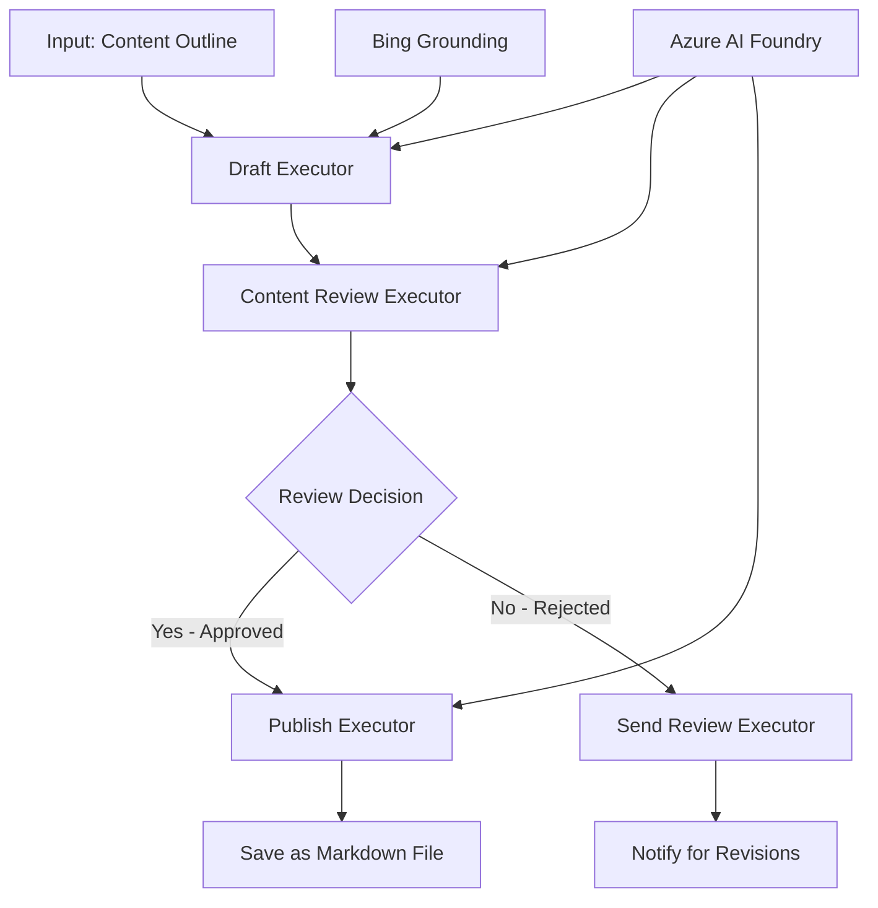

<!--
CO_OP_TRANSLATOR_METADATA:
{
  "original_hash": "8abd335151cee553293b637ee3d80d10",
  "translation_date": "2025-11-11T12:10:11+00:00",
  "source_file": "08-multi-agent/code_samples/workflows-agent-framework/dotNET/04.dotnet-agent-framework-workflow-aifoundry-condition.md",
  "language_code": "mr"
}
-->
# 🔀 Azure AI Foundry (.NET) सह सशर्त एजंट वर्कफ्लो

## 📋 बुद्धिमान निर्णय-आधारित वर्कफ्लो ट्यूटोरियल

या नोटबुकमध्ये Azure AI Foundry आणि Microsoft Agent Framework for .NET वापरून **सशर्त वर्कफ्लो पॅटर्न** कसे तयार करायचे हे दाखवले आहे. तुम्ही AI विश्लेषण, व्यवसाय नियम आणि गतिशील अटींवर आधारित प्रक्रिया बुद्धिमानपणे मार्गक्रमित करणारे निर्णय-आधारित वर्कफ्लो तयार करणे शिकाल, जे एंटरप्राइझ-ग्रेड ऑटोमेशनसाठी उपयुक्त आहेत.

## 🎯 शिकण्याची उद्दिष्टे

### 🧠 **बुद्धिमान निर्णय आर्किटेक्चर**
- **सशर्त लॉजिक अंमलबजावणी**: अनेक शाखा बिंदूंसह जटिल निर्णय वृक्ष तयार करा
- **AI-सक्षम रूटिंग**: Azure AI Foundry मॉडेल्स वापरून बुद्धिमान रूटिंग निर्णय घ्या
- **डायनॅमिक वर्कफ्लो अडॅप्टेशन**: रनटाइम विश्लेषण आणि अटींवर आधारित वर्कफ्लोचे वर्तन बदला
- **एंटरप्राइझ नियम समाकलन**: वर्कफ्लोमध्ये व्यवसाय लॉजिक आणि अनुपालन आवश्यकता समाविष्ट करा

### 🔀 **प्रगत सशर्त पॅटर्न**
- **मल्टी-क्रायटेरिया निर्णय घेणे**: रूटिंग निर्णयांसाठी अनेक घटकांचे मूल्यांकन करा
- **संदर्भ-जागरूक प्रक्रिया**: जमा केलेल्या वर्कफ्लो संदर्भ आणि इतिहासावर आधारित निर्णय घ्या
- **अडॅप्टिव्ह वर्कफ्लो मॉडिफिकेशन**: रिअल-टाइम अटींवर आधारित प्रक्रिया मार्ग गतिशीलपणे समायोजित करा
- **नियम इंजिन समाकलन**: वर्कफ्लोमध्ये प्रगत व्यवसाय नियम इंजिन अंमलात आणा

### 🏢 **एंटरप्राइझ सशर्त अनुप्रयोग**
- **दस्तऐवज वर्गीकरण आणि रूटिंग**: दस्तऐवज स्वयंचलितपणे वर्गीकृत करा आणि योग्य वर्कफ्लोमध्ये रूट करा
- **ग्राहक सेवा ट्रायज**: ग्राहकांच्या चौकशीचे विशेष हाताळणी टीमकडे बुद्धिमान रूटिंग
- **अनुपालन आणि जोखीम प्रक्रिया**: जोखीम मूल्यांकनावर आधारित वेगवेगळ्या पडताळणी आणि पुनरावलोकन प्रक्रिया लागू करा
- **गुणवत्ता आश्वासन वर्कफ्लो**: गुणवत्ता मेट्रिक्सवर आधारित योग्य पुनरावलोकन प्रक्रियेद्वारे सामग्री रूट करा

## ⚙️ पूर्वापेक्षा आणि सेटअप

### 📦 **आवश्यक NuGet पॅकेजेस**

सशर्त वर्कफ्लो प्रक्रियेसाठी प्रगत पॅकेजेस:

```xml
<!-- Core AI Framework -->
<PackageReference Include="Microsoft.Extensions.AI" Version="9.9.0" />

<!-- Azure AI Agents with Persistent State -->
<PackageReference Include="Azure.AI.Agents.Persistent" Version="1.2.0-beta.5" />

<!-- Azure Identity and Utilities -->
<PackageReference Include="Azure.Identity" Version="1.15.0" />
<PackageReference Include="System.Linq.Async" Version="6.0.3" />
<PackageReference Include="DotNetEnv" Version="3.1.1" />

<!-- Local Workflow Framework References -->
<!-- Microsoft.Agents.Workflows.dll - Advanced workflow orchestration -->
<!-- Microsoft.Agents.AI.AzureAI.dll - Azure AI Foundry integration -->
<!-- Microsoft.Agents.AI.dll - Core agent abstractions -->
```

### 🔑 **Azure AI Foundry कॉन्फिगरेशन**

**आवश्यक Azure संसाधने:**
- सशर्त प्रक्रिया मॉडेल्ससह Azure AI Foundry कार्यक्षेत्र
- योग्य संगणन कोटा आणि परवानग्यांसह Azure सदस्यता
- निर्णय घेणे आणि सामग्री विश्लेषणासाठी तैनात AI मॉडेल्स
- (पर्यायी) Bing Search API कनेक्शन ग्राउंडिंग क्षमता साठी

**पर्यावरण कॉन्फिगरेशन (.env फाइल):**
```env
# Azure AI Foundry Configuration
AZURE_AI_PROJECT_ENDPOINT=https://your-project.cognitiveservices.azure.com/
BING_CONNECTION_ID=your-bing-connection-id
```

**प्रमाणीकरण सेटअप:**
```csharp
// Azure CLI or Managed Identity authentication
using Azure.Identity;
var credential = new AzureCliCredential();

// Load environment configuration
DotNetEnv.Env.Load("../../../.env");
```

### 🏗️ **सशर्त वर्कफ्लो आर्किटेक्चर**



**मुख्य घटक:**
- **Draft Executor**: रूपरेषांमधून प्रारंभिक सामग्री मसुदा तयार करणारा AI एजंट
- **Content Review Executor**: मसुद्याची गुणवत्ता आणि अनुपालनाचे मूल्यांकन करणारा AI एजंट
- **Conditional Routing**: पुनरावलोकन परिणामांवर आधारित निर्णय लॉजिक रूटिंग
- **Publish/Review Paths**: मंजूर आणि नाकारलेल्या सामग्रीसाठी वेगळे प्रक्रिया मार्ग
- **State Management**: वर्कफ्लो दरम्यान सामग्री आणि पुनरावलोकन संदर्भ राखतो

## 🎨 **सशर्त वर्कफ्लो डिझाइन पॅटर्न**

### 📋 **गुणवत्ता गेट्ससह सामग्री उत्पादन**
```
Outline → Draft Creation → Quality Review → {Approve: Publish | Reject: Revise}
```

### 🎯 **जोखीम-आधारित दस्तऐवज प्रक्रिया**
```
Document → Risk Assessment → {Low: Standard | High: Enhanced Review}
```

### 🔍 **बुद्धिमान ग्राहक सेवा रूटिंग**
```
Customer Query → Analysis → {Simple: FAQ Bot | Complex: Human Agent}
```

### 💼 **अनुपालन-चालित वर्कफ्लो**
```
Content → Compliance Check → {Pass: Publish | Fail: Legal Review}
```

## 🏢 **एंटरप्राइझ सशर्त फायदे**

### 🎯 **बुद्धिमान ऑटोमेशन**
- **स्मार्ट निर्णय घेणे**: सामग्री विश्लेषण आणि संदर्भावर आधारित AI-सक्षम रूटिंग निर्णय
- **अडॅप्टिव्ह प्रक्रिया**: बदलत्या अटींवर आधारित स्वयंचलितपणे समायोजित होणारे वर्कफ्लो
- **व्यवसाय नियम अंमलबजावणी**: जटिल व्यवसाय लॉजिक आणि धोरणांचे स्वयंचलित अनुप्रयोग
- **संदर्भ-जागरूक रूटिंग**: संपूर्ण वर्कफ्लो इतिहास आणि जमा केलेल्या संदर्भावर आधारित निर्णय

### 📈 **ऑपरेशनल उत्कृष्टता**
- **संसाधनांचे अनुकूल वाटप**: काम सर्वात योग्य तज्ञ आणि प्रक्रियांकडे रूट करा
- **कमी मॅन्युअल हस्तक्षेप**: स्वयंचलित निर्णय घेणे मानवी रूटिंगची गरज कमी करते
- **जलद निराकरण वेळा**: योग्य तज्ञता आणि प्रक्रिया क्षमता कडे थेट रूटिंग
- **सुसंगत अनुप्रयोग**: व्यवसाय नियम आणि निर्णय निकषांचा एकसमान अनुप्रयोग

### 🛡️ **जोखीम व्यवस्थापन आणि अनुपालन**
- **स्वयंचलित जोखीम मूल्यांकन**: सामग्री आणि परिस्थितीच्या जोखीम स्तरांचे AI-सक्षम मूल्यांकन
- **अनुपालन अंमलबजावणी**: आवश्यक नियामक प्रक्रियांद्वारे स्वयंचलित रूटिंग
- **सुरक्षा प्रोटोकॉल अनुप्रयोग**: जोखीम मूल्यांकनावर आधारित वर्धित सुरक्षा उपाय लागू
- **ऑडिट ट्रेल देखभाल**: रूटिंग निर्णय आणि कारणांचे संपूर्ण दस्तऐवजीकरण

### 📊 **विश्लेषण आणि सतत सुधारणा**
- **निर्णय विश्लेषण**: रूटिंग निर्णयांची प्रभावीता आणि अचूकता ट्रॅक करा
- **पॅटर्न ओळख**: वेळोवेळी रूटिंग निर्णयांमधील ट्रेंड आणि पॅटर्न ओळखा
- **कामगिरी अनुकूलन**: निर्णय निकष आणि रूटिंग कार्यक्षमतेची सतत सुधारणा
- **व्यवसाय बुद्धिमत्ता**: सामग्री वैशिष्ट्ये आणि प्रक्रिया आवश्यकता याबद्दल अंतर्दृष्टी

### 🔧 **तांत्रिक उत्कृष्टता**
- **सतत राज्य व्यवस्थापन**: वर्कफ्लो अंमलबजावणी दरम्यान जटिल राज्य राखा
- **स्केलेबल आर्किटेक्चर**: उच्च-खंड सशर्त प्रक्रिया आवश्यकता हाताळा
- **समाकलन क्षमता**: विद्यमान व्यवसाय प्रणाली आणि प्रक्रियांशी अखंड समाकलन
- **मॉनिटरिंग आणि निरीक्षणक्षमता**: वर्कफ्लो कार्यप्रदर्शन आणि निर्णयांचे व्यापक ट्रॅकिंग

.NET सह बुद्धिमान, निर्णय-चालित एंटरप्राइझ वर्कफ्लो तयार करूया! 🚀

## 💻 कोड चालवणे

पूर्ण अंमलबजावणी `04.dotnet-agent-framework-workflow-aifoundry-condition.cs` मध्ये उपलब्ध आहे. हे **गुणवत्ता गेट्ससह सामग्री उत्पादन वर्कफ्लो** दर्शवते:

### 🏗️ **वर्कफ्लो आर्किटेक्चर**

```
Content Outline → Draft Creation → Quality Review → Conditional Routing:
                                                      ├─ Approved (>200 words) → Publish
                                                      └─ Rejected (<200 words) → Review Notification
```

**वर्कफ्लोमधील एजंट्स:**
1. **Evangelist Agent**: Bing ग्राउंडिंगसह रूपरेषांमधून ट्यूटोरियल मसुदे तयार करतो
2. **Content Reviewer Agent**: मसुद्याची गुणवत्ता (शब्द संख्या, पूर्णता) मूल्यांकन करतो
3. **Publisher Agent**: मंजूर सामग्री टाइमस्टॅम्प केलेल्या Markdown फाइल्स म्हणून जतन करतो

**कस्टम Executors:**
1. **DraftExecutor**: मसुदा तयार करण्याचे समन्वय करते
2. **ContentReviewExecutor**: गुणवत्ता मूल्यांकन करते
3. **PublishExecutor**: मंजूर सामग्री प्रकाशन हाताळते
4. **SendReviewExecutor**: नाकारलेल्या सामग्री सूचना व्यवस्थापित करते

### 🚀 उदाहरण चालवणे

**पूर्वापेक्षा:**
- Azure AI Foundry कार्यक्षेत्र कॉन्फिगर केलेले
- Azure CLI प्रमाणीकरण (`az login`)
- (पर्यायी) Bing Search कनेक्शन ग्राउंडिंगसाठी

```bash
# Make the script executable (Unix/Linux/macOS)
chmod +x 04.dotnet-agent-framework-workflow-aifoundry-condition.cs

# Run the conditional workflow
./04.dotnet-agent-framework-workflow-aifoundry-condition.cs
```

किंवा Windows वर:
```powershell
dotnet run 04.dotnet-agent-framework-workflow-aifoundry-condition.cs
```

### 📝 अपेक्षित आउटपुट

वर्कफ्लो:
1. **एजंट तयार करेल**: तीन विशेष Azure AI Foundry एजंट्स प्रारंभ करेल
2. **मसुदा तयार करेल**: Evangelist एजंट रूपरेषेतून ट्यूटोरियल मसुदा तयार करेल
3. **सामग्री पुनरावलोकन करेल**: Content Reviewer मसुद्याची गुणवत्ता मूल्यांकन करेल
4. **सशर्त रूटिंग**:
   - **मंजूर (>200 शब्द)**: Publish Executor Markdown फाइल म्हणून जतन करेल
   - **नाकारले (<200 शब्द)**: पुनरावलोकन सूचना पाठवेल
5. **परिणाम प्रदर्शित करेल**: अंतिम वर्कफ्लो परिणाम दाखवेल

### 🔧 सानुकूलन पर्याय

**पुनरावलोकन निकष बदला:**
```csharp
const string ContentReviewerInstructions = @"
You are a content reviewer...
1. Check if content is more than 500 words (instead of 200)
2. Verify technical accuracy
3. Ensure proper formatting
...";
```

**अधिक सशर्त मार्ग जोडा:**
```csharp
var workflow = new WorkflowBuilder(draftExecutor)
    .AddEdge(draftExecutor, contentReviewerExecutor)
    .AddEdge(contentReviewerExecutor, publishExecutor, condition: GetCondition("Excellent"))
    .AddEdge(contentReviewerExecutor, editExecutor, condition: GetCondition("Good"))
    .AddEdge(contentReviewerExecutor, sendReviewerExecutor, condition: GetCondition("Poor"))
    .Build();
```

**सामग्री आवश्यकता बदला:**
```csharp
string OUTLINE_Content = @"
# Your Custom Topic
## Section 1
https://your-reference-url
## Section 2
...
";
```

### 🎯 वास्तविक-जगातील अनुप्रयोग

हा सशर्त वर्कफ्लो पॅटर्न आदर्श आहे:
- **सामग्री व्यवस्थापन प्रणाली**: गुणवत्ता गेट्ससह स्वयंचलित संपादकीय वर्कफ्लो
- **दस्तऐवज प्रक्रिया**: वर्गीकरण आणि अनुपालनावर आधारित दस्तऐवज रूट करा
- **ग्राहक समर्थन**: गुंतागुंती आणि तातडीवर आधारित बुद्धिमान तिकीट रूटिंग
- **कायदेशीर पुनरावलोकन**: जोखीम मूल्यांकन आणि मूल्यावर आधारित करार रूट करा
- **HR प्रक्रिया**: योग्य स्क्रीनिंग वर्कफ्लोद्वारे अर्ज रूट करा

### 🔍 सशर्त लॉजिक समजून घेणे

**Condition Function:**
```csharp
public Func<object?, bool> GetCondition(string expectedResult) =>
    reviewResult => reviewResult is ReviewResult review && review.Result == expectedResult;
```

ही फंक्शन एक प्रेडिकेट तयार करते जी:
1. परिणाम `ReviewResult` प्रकाराचा आहे का ते तपासते
2. `Result` प्रॉपर्टी अपेक्षित मूल्याशी तुलना करते
3. रूटिंग निश्चित करण्यासाठी true/false परत करते

**वर्कफ्लो एजेससह अटी:**
```csharp
.AddEdge(contentReviewerExecutor, publishExecutor, condition: GetCondition("Yes"))
.AddEdge(contentReviewerExecutor, sendReviewerExecutor, condition: GetCondition("No"))
```

### 📊 प्रगत वैशिष्ट्ये

**JSON Schema Validation:**
वर्कफ्लो संरचित प्रतिसाद सुनिश्चित करण्यासाठी JSON स्कीमाचा वापर करते:

```csharp
// Define response structure
public class ReviewResult
{
    [JsonPropertyName("review_result")]
    public string Result { get; set; } = string.Empty;
    
    [JsonPropertyName("reason")]
    public string Reason { get; set; } = string.Empty;
    
    [JsonPropertyName("draft_content")]
    public string DraftContent { get; set; } = string.Empty;
}

// Apply to agent
ResponseFormat = ChatResponseFormat.ForJsonSchema(
    AIJsonUtilities.CreateJsonSchema(typeof(ReviewResult)), 
    "ReviewResult", 
    "Review Result From DraftContent"
)
```

**Bing Grounding Integration:**
Evangelist एजंट Bing ग्राउंडिंग वापरून रिअल-टाइम माहिती प्रवेश करतो:

```csharp
var bingGroundingConfig = new BingGroundingSearchConfiguration(bing_conn_id);
BingGroundingToolDefinition bingGroundingTool = new(
    new BingGroundingSearchToolParameters([bingGroundingConfig])
);
```

हे एजंटला रूपरेषेतील URLs अनुसरण करण्यास आणि वर्तमान माहिती काढण्यास सक्षम करते.

### 🛡️ त्रुटी हाताळणी

वर्कफ्लो नाकारलेल्या सामग्रीसाठी मजबूत त्रुटी हाताळणी समाविष्ट करते:
- पुनरावलोकन अपयश पर्यायी मार्ग ट्रिगर करते
- सूचना स्पष्ट नकार कारणे प्रदान करतात
- पुनरावलोकनासाठी सामग्री संरक्षित केली जाते

### 🔄 वर्कफ्लो विस्तारित करणे

**पुनरावलोकन लूप जोडा:**
स्वयंचलितपणे सामग्री पुन्हा मसुदा तयार करणारा फीडबॅक लूप तयार करा:

```csharp
.AddEdge(contentReviewerExecutor, publishExecutor, condition: GetCondition("Yes"))
.AddEdge(contentReviewerExecutor, draftExecutor, condition: GetCondition("No")) // Loop back
```

**मल्टी-लेव्हल पुनरावलोकन अंमलात आणा:**
वेगवेगळ्या निकषांसह अनेक पुनरावलोकन टप्पे जोडा:

```csharp
.AddEdge(draftExecutor, technicalReviewer)
.AddEdge(technicalReviewer, editorialReviewer, condition: GetCondition("TechPass"))
.AddEdge(editorialReviewer, publishExecutor, condition: GetCondition("EditPass"))
```

हा सशर्त वर्कफ्लो पॅटर्न प्रगत, बुद्धिमान एंटरप्राइझ ऑटोमेशन सिस्टम तयार करण्यासाठी पाया प्रदान करतो! 🚀

---

<!-- CO-OP TRANSLATOR DISCLAIMER START -->
**अस्वीकरण**:  
हा दस्तऐवज AI भाषांतर सेवा [Co-op Translator](https://github.com/Azure/co-op-translator) वापरून भाषांतरित करण्यात आला आहे. आम्ही अचूकतेसाठी प्रयत्नशील असलो तरी, कृपयास लक्षात ठेवा की स्वयंचलित भाषांतरे त्रुटी किंवा अचूकतेच्या अभावाने युक्त असू शकतात. मूळ भाषेतील दस्तऐवज हा अधिकृत स्रोत मानला जावा. महत्त्वाच्या माहितीसाठी, व्यावसायिक मानवी भाषांतराची शिफारस केली जाते. या भाषांतराचा वापर करून उद्भवलेल्या कोणत्याही गैरसमज किंवा चुकीच्या अर्थासाठी आम्ही जबाबदार राहणार नाही.
<!-- CO-OP TRANSLATOR DISCLAIMER END -->