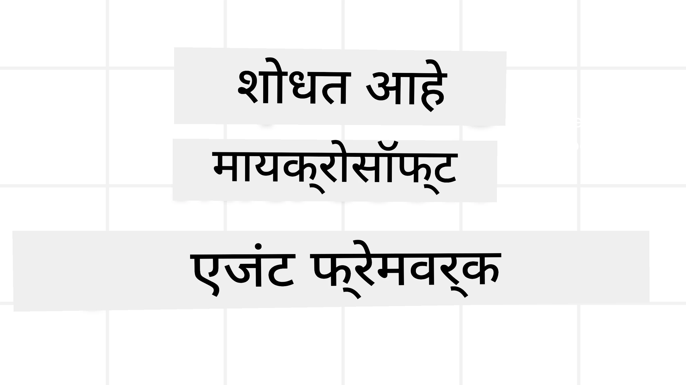
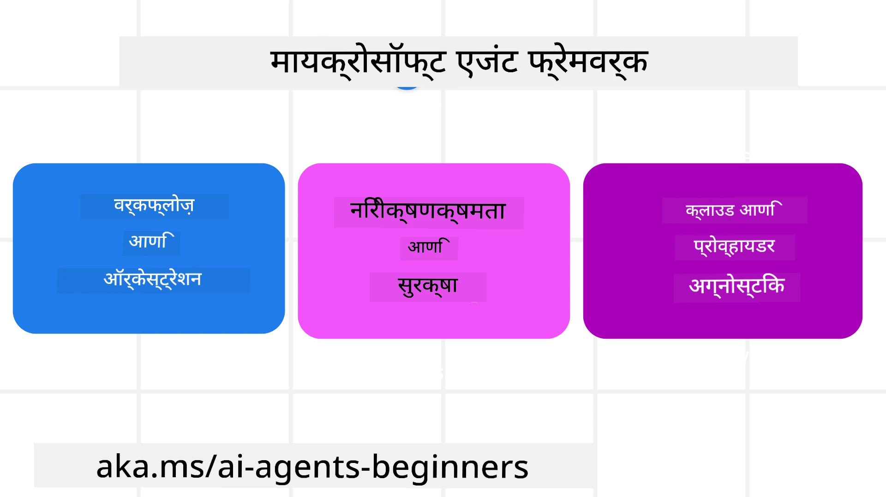
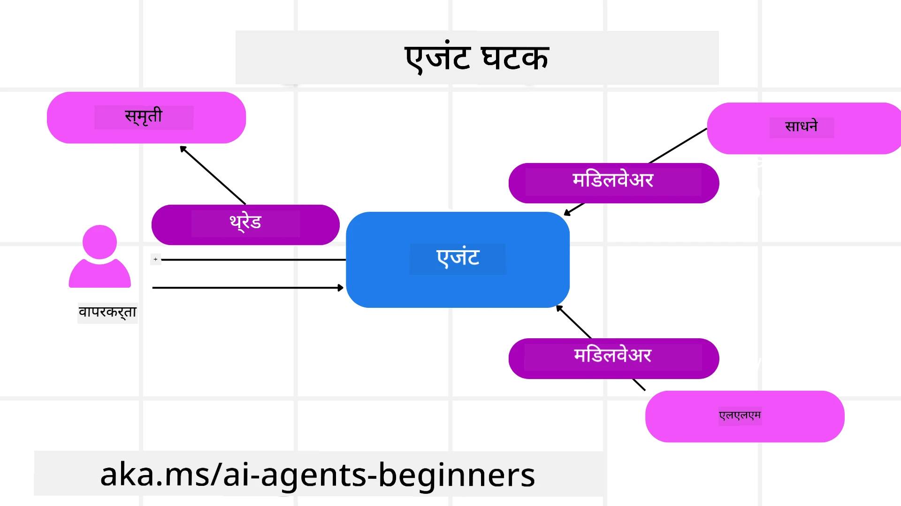

<!--
CO_OP_TRANSLATOR_METADATA:
{
  "original_hash": "19c4dab375acbc733855cc7f2f04edbc",
  "translation_date": "2025-10-02T11:15:24+00:00",
  "source_file": "14-microsoft-agent-framework/README.md",
  "language_code": "mr"
}
-->
# Microsoft Agent Framework शोधत आहे



### परिचय

या धड्यात आपण शिकणार आहोत:

- Microsoft Agent Framework समजून घेणे: मुख्य वैशिष्ट्ये आणि मूल्य  
- Microsoft Agent Framework चे मुख्य संकल्पना शोधणे
- MAF आणि Semantic Kernel आणि AutoGen ची तुलना: स्थलांतर मार्गदर्शक

## शिकण्याची उद्दिष्टे

हा धडा पूर्ण केल्यानंतर, तुम्हाला खालील गोष्टी करता येतील:

- Microsoft Agent Framework वापरून उत्पादनासाठी तयार AI एजंट तयार करणे
- तुमच्या Agentic Use Cases साठी Microsoft Agent Framework ची मुख्य वैशिष्ट्ये लागू करणे
- विद्यमान Agentic फ्रेमवर्क आणि साधनांचे स्थलांतर आणि एकत्रीकरण करणे  

## कोड नमुने 

[Microsoft Agent Framework (MAF)](https://aka.ms/ai-agents-beginners/agent-framewrok) साठी कोड नमुने या रिपॉझिटरीमध्ये `xx-python-agent-framework` आणि `xx-dotnet-agent-framework` फाइल्समध्ये उपलब्ध आहेत.

## Microsoft Agent Framework समजून घेणे



[Microsoft Agent Framework (MAF)](https://aka.ms/ai-agents-beginners/agent-framewrok) हे Semantic Kernel आणि AutoGen मधील अनुभव आणि शिकवणुकीवर आधारित आहे. हे उत्पादन आणि संशोधन वातावरणातील विविध प्रकारच्या Agentic Use Cases हाताळण्यासाठी लवचिकता प्रदान करते, ज्यामध्ये समाविष्ट आहे:

- **Sequential Agent orchestration** जिथे चरण-दर-चरण कार्यप्रवाह आवश्यक असतो.
- **Concurrent orchestration** जिथे एजंट्स एकाच वेळी कार्य पूर्ण करतात.
- **Group chat orchestration** जिथे एजंट्स एकत्रितपणे एका कार्यावर सहयोग करतात.
- **Handoff Orchestration** जिथे एजंट्स उपकार्ये पूर्ण झाल्यावर कार्य एकमेकांना हस्तांतरित करतात.
- **Magnetic Orchestration** जिथे व्यवस्थापक एजंट कार्य सूची तयार करतो आणि उपएजंट्सचे समन्वय हाताळतो.

उत्पादनात AI एजंट्स वितरित करण्यासाठी, MAF मध्ये खालील वैशिष्ट्ये समाविष्ट आहेत:

- **Observability** OpenTelemetry चा वापर करून, जिथे AI एजंटची प्रत्येक क्रिया, साधन वापर, ऑर्केस्ट्रेशन चरण, विचार प्रक्रिया आणि Azure AI Foundry डॅशबोर्डद्वारे कार्यप्रदर्शन निरीक्षण समाविष्ट आहे.
- **Security** Azure AI Foundry वर एजंट्स होस्ट करून, ज्यामध्ये भूमिका-आधारित प्रवेश, खाजगी डेटा हाताळणी आणि अंगभूत सामग्री सुरक्षा यासारखे सुरक्षा नियंत्रण समाविष्ट आहे.
- **Durability** एजंट थ्रेड्स आणि कार्यप्रवाह थांबवणे, पुन्हा सुरू करणे आणि त्रुटींपासून पुनर्प्राप्त करणे शक्य आहे, ज्यामुळे दीर्घकालीन प्रक्रिया सक्षम होते.
- **Control** जिथे मानवी हस्तक्षेप कार्यप्रवाह समर्थित आहेत, जिथे कार्ये मानवी मंजुरीसाठी चिन्हांकित केली जातात.

Microsoft Agent Framework हे इंटरऑपरेबल असण्यावर देखील लक्ष केंद्रित करते:

- **Cloud-agnostic** - एजंट्स कंटेनरमध्ये, ऑन-प्रेमिस आणि विविध क्लाउड्समध्ये चालवता येतात.
- **Provider-agnostic** - एजंट्स तुमच्या पसंतीच्या SDK च्या माध्यमातून तयार करता येतात, ज्यामध्ये Azure OpenAI आणि OpenAI समाविष्ट आहे.
- **Open Standards चे एकत्रीकरण** - एजंट्स Agent-to-Agent (A2A) आणि Model Context Protocol (MCP) सारख्या प्रोटोकॉलचा वापर करून इतर एजंट्स आणि साधने शोधू शकतात आणि वापरू शकतात.
- **Plugins आणि Connectors** - Microsoft Fabric, SharePoint, Pinecone आणि Qdrant सारख्या डेटा आणि मेमरी सेवांशी कनेक्शन स्थापित करता येते.

आता Microsoft Agent Framework च्या मुख्य संकल्पनांवर या वैशिष्ट्यांचा कसा उपयोग केला जातो ते पाहूया.

## Microsoft Agent Framework च्या मुख्य संकल्पना

### एजंट्स



**एजंट तयार करणे**

एजंट तयार करणे हे अनुमान सेवा (LLM Provider), AI एजंटने अनुसरण करण्यासाठी निर्देशांचा संच आणि नियुक्त `name` परिभाषित करून केले जाते:

```python
agent = AzureOpenAIChatClient(credential=AzureCliCredential()).create_agent( instructions="You are good at recommending trips to customers based on their preferences.", name="TripRecommender" )
```

वरील उदाहरणात `Azure OpenAI` वापरले आहे, परंतु एजंट्स विविध सेवांचा वापर करून तयार करता येतात, ज्यामध्ये `Azure AI Foundry Agent Service` समाविष्ट आहे:

```python
AzureAIAgentClient(async_credential=credential).create_agent( name="HelperAgent", instructions="You are a helpful assistant." ) as agent
```

OpenAI `Responses`, `ChatCompletion` APIs

```python
agent = OpenAIResponsesClient().create_agent( name="WeatherBot", instructions="You are a helpful weather assistant.", )
```

```python
agent = OpenAIChatClient().create_agent( name="HelpfulAssistant", instructions="You are a helpful assistant.", )
```

किंवा A2A प्रोटोकॉल वापरून रिमोट एजंट्स:

```python
agent = A2AAgent( name=agent_card.name, description=agent_card.description, agent_card=agent_card, url="https://your-a2a-agent-host" )
```

**एजंट चालवणे**

एजंट्स `.run` किंवा `.run_stream` पद्धतींचा वापर करून चालवले जातात, जे नॉन-स्ट्रीमिंग किंवा स्ट्रीमिंग प्रतिसादांसाठी असतात.

```python
result = await agent.run("What are good places to visit in Amsterdam?")
print(result.text)
```

```python
async for update in agent.run_stream("What are the good places to visit in Amsterdam?"):
    if update.text:
        print(update.text, end="", flush=True)

```

प्रत्येक एजंट रनमध्ये `max_tokens`, एजंटला कॉल करता येणारी `tools`, आणि एजंटसाठी वापरलेले `model` यासारख्या पॅरामीटर्स सानुकूलित करण्याचे पर्याय असू शकतात.

हे उपयोगकर्ता कार्य पूर्ण करण्यासाठी विशिष्ट मॉडेल्स किंवा साधने आवश्यक असलेल्या प्रकरणांमध्ये उपयुक्त आहे.

**साधने**

साधने एजंट परिभाषित करताना परिभाषित केली जाऊ शकतात:

```python
def get_attractions( location: Annotated[str, Field(description="The location to get the top tourist attractions for")], ) -> str: """Get the top tourist attractions for a given location.""" return f"The top attractions for {location} are." 


# When creating a ChatAgent directly 

agent = ChatAgent( chat_client=OpenAIChatClient(), instructions="You are a helpful assistant", tools=[get_attractions]

```

आणि एजंट चालवताना देखील:

```python

result1 = await agent.run( "What's the best place to visit in Seattle?", tools=[get_attractions] # Tool provided for this run only )
```

**एजंट थ्रेड्स**

एजंट थ्रेड्स मल्टी-टर्न संभाषण हाताळण्यासाठी वापरले जातात. थ्रेड्स तयार करण्यासाठी खालील पद्धती वापरल्या जातात:

- `get_new_thread()` वापरून, ज्यामुळे थ्रेड वेळोवेळी जतन केला जाऊ शकतो.
- एजंट चालवताना स्वयंचलितपणे थ्रेड तयार करणे, ज्यामुळे थ्रेड चालू रन दरम्यानच टिकतो.

थ्रेड तयार करण्यासाठी कोड खालीलप्रमाणे आहे:

```python
# Create a new thread. 
thread = agent.get_new_thread() # Run the agent with the thread. 
response = await agent.run("Hello, I am here to help you book travel. Where would you like to go?", thread=thread)

```

त्यानंतर थ्रेड नंतरच्या वापरासाठी संग्रहित करण्यासाठी सिरीयलाइझ करता येतो:

```python
# Create a new thread. 
thread = agent.get_new_thread() 

# Run the agent with the thread. 

response = await agent.run("Hello, how are you?", thread=thread) 

# Serialize the thread for storage. 

serialized_thread = await thread.serialize() 

# Deserialize the thread state after loading from storage. 

resumed_thread = await agent.deserialize_thread(serialized_thread)
```

**एजंट मिडलवेअर**

एजंट्स साधने आणि LLMs शी संवाद साधून वापरकर्त्याची कार्ये पूर्ण करतात. काही परिस्थितींमध्ये, या संवादांमध्ये काही क्रिया अंमलात आणणे किंवा ट्रॅक करणे आवश्यक असते. एजंट मिडलवेअर यासाठी सक्षम करते:

*Function Middleware*

हे मिडलवेअर एजंट आणि त्याने कॉल करावयाच्या फंक्शन/साधन यामधील क्रिया अंमलात आणण्यास परवानगी देते. उदाहरणार्थ, तुम्हाला फंक्शन कॉलवर काही लॉगिंग करायचे असल्यास हे वापरले जाऊ शकते.

खालील कोडमध्ये `next` परिभाषित करते की पुढील मिडलवेअर किंवा वास्तविक फंक्शन कॉल केले जावे.

```python
async def logging_function_middleware(
    context: FunctionInvocationContext,
    next: Callable[[FunctionInvocationContext], Awaitable[None]],
) -> None:
    """Function middleware that logs function execution."""
    # Pre-processing: Log before function execution
    print(f"[Function] Calling {context.function.name}")

    # Continue to next middleware or function execution
    await next(context)

    # Post-processing: Log after function execution
    print(f"[Function] {context.function.name} completed")
```

*Chat Middleware*

हे मिडलवेअर एजंट आणि LLM दरम्यानच्या विनंत्यांमध्ये क्रिया अंमलात आणण्यास किंवा लॉग करण्यास परवानगी देते.

यामध्ये AI सेवेला पाठवले जाणारे `messages` यासारखी महत्त्वाची माहिती समाविष्ट आहे.

```python
async def logging_chat_middleware(
    context: ChatContext,
    next: Callable[[ChatContext], Awaitable[None]],
) -> None:
    """Chat middleware that logs AI interactions."""
    # Pre-processing: Log before AI call
    print(f"[Chat] Sending {len(context.messages)} messages to AI")

    # Continue to next middleware or AI service
    await next(context)

    # Post-processing: Log after AI response
    print("[Chat] AI response received")

```

**एजंट मेमरी**

`Agentic Memory` धड्यात कव्हर केल्याप्रमाणे, मेमरी एजंटला विविध संदर्भांवर कार्य करण्यास सक्षम करण्यासाठी महत्त्वाचा घटक आहे. MAF मध्ये विविध प्रकारच्या मेमरी ऑफर केल्या जातात:

*In-Memory Storage*

हे मेमरी थ्रेड्समध्ये अनुप्रयोग रनटाइम दरम्यान संग्रहित केले जाते.

```python
# Create a new thread. 
thread = agent.get_new_thread() # Run the agent with the thread. 
response = await agent.run("Hello, I am here to help you book travel. Where would you like to go?", thread=thread)
```

*Persistent Messages*

ही मेमरी विविध सत्रांमध्ये संभाषण इतिहास संग्रहित करण्यासाठी वापरली जाते. ती `chat_message_store_factory` वापरून परिभाषित केली जाते:

```python
from agent_framework import ChatMessageStore

# Create a custom message store
def create_message_store():
    return ChatMessageStore()

agent = ChatAgent(
    chat_client=OpenAIChatClient(),
    instructions="You are a Travel assistant.",
    chat_message_store_factory=create_message_store
)

```

*Dynamic Memory*

ही मेमरी एजंट्स चालवण्यापूर्वी संदर्भात जोडली जाते. या मेमरी बाह्य सेवांमध्ये संग्रहित केल्या जाऊ शकतात, जसे की mem0:

```python
from agent_framework.mem0 import Mem0Provider

# Using Mem0 for advanced memory capabilities
memory_provider = Mem0Provider(
    api_key="your-mem0-api-key",
    user_id="user_123",
    application_id="my_app"
)

agent = ChatAgent(
    chat_client=OpenAIChatClient(),
    instructions="You are a helpful assistant with memory.",
    context_providers=memory_provider
)

```

**एजंट Observability**

विश्वसनीय आणि देखभाल करण्यायोग्य Agentic Systems तयार करण्यासाठी Observability महत्त्वाचे आहे. MAF OpenTelemetry सह एकत्रित होते जे चांगल्या निरीक्षणासाठी ट्रेसिंग आणि मीटर प्रदान करते.

```python
from agent_framework.observability import get_tracer, get_meter

tracer = get_tracer()
meter = get_meter()
with tracer.start_as_current_span("my_custom_span"):
    # do something
    pass
counter = meter.create_counter("my_custom_counter")
counter.add(1, {"key": "value"})
```

### कार्यप्रवाह

MAF कार्यप्रवाह ऑफर करते जे कार्य पूर्ण करण्यासाठी पूर्व-परिभाषित चरण आहेत आणि त्या चरणांमध्ये AI एजंट्स घटक म्हणून समाविष्ट आहेत.

कार्यप्रवाह विविध घटकांनी बनलेले असतात जे चांगले नियंत्रण प्रवाह सक्षम करतात. कार्यप्रवाह **मल्टी-एजंट ऑर्केस्ट्रेशन** आणि **चेकपॉइंटिंग** सक्षम करतात जे कार्यप्रवाह स्थिती जतन करतात.

कार्यप्रवाहाचे मुख्य घटक आहेत:

**Executors**

Executors इनपुट संदेश प्राप्त करतात, त्यांना नियुक्त कार्ये करतात आणि नंतर आउटपुट संदेश तयार करतात. हे कार्यप्रवाह मोठ्या कार्याच्या पूर्णतेकडे पुढे नेतो. Executors हे AI एजंट किंवा सानुकूल लॉजिक असू शकतात.

**Edges**

Edges कार्यप्रवाहातील संदेशांचा प्रवाह परिभाषित करण्यासाठी वापरले जातात. हे खालीलप्रमाणे असू शकतात:

*Direct Edges* - Executors दरम्यान साधे एक-ते-एक कनेक्शन:

```python
from agent_framework import WorkflowBuilder

builder = WorkflowBuilder()
builder.add_edge(source_executor, target_executor)
builder.set_start_executor(source_executor)
workflow = builder.build()
```

*Conditional Edges* - विशिष्ट अट पूर्ण झाल्यानंतर सक्रिय होतात. उदाहरणार्थ, हॉटेलच्या खोल्या उपलब्ध नसल्यास, एक Executor इतर पर्याय सुचवू शकतो.

*Switch-case Edges* - परिभाषित अटींनुसार संदेश वेगवेगळ्या Executors कडे रूट करतात. उदाहरणार्थ, प्रवासी ग्राहकाला प्राधान्य प्रवेश असल्यास त्यांची कार्ये दुसऱ्या कार्यप्रवाहाद्वारे हाताळली जातील.

*Fan-out Edges* - एक संदेश अनेक लक्ष्यांकडे पाठवतात.

*Fan-in Edges* - वेगवेगळ्या Executors कडून अनेक संदेश गोळा करतात आणि एका लक्ष्याकडे पाठवतात.

**Events**

कार्यप्रवाहांमध्ये चांगले निरीक्षण प्रदान करण्यासाठी, MAF कार्यप्रवाहाच्या अंमलबजावणीसाठी अंगभूत इव्हेंट्स ऑफर करते, ज्यामध्ये समाविष्ट आहे:

- `WorkflowStartedEvent`  - कार्यप्रवाह अंमलबजावणी सुरू होते
- `WorkflowOutputEvent` - कार्यप्रवाह आउटपुट तयार करतो
- `WorkflowErrorEvent` - कार्यप्रवाह त्रुटीला सामोरे जातो
- `ExecutorInvokeEvent`  - Executor प्रक्रिया सुरू करतो
- `ExecutorCompleteEvent`  -  Executor प्रक्रिया पूर्ण करतो
- `RequestInfoEvent` - विनंती जारी केली जाते

## इतर फ्रेमवर्कमधून स्थलांतर (Semantic Kernel आणि AutoGen)

### MAF आणि Semantic Kernel मधील फरक

**सोपे एजंट तयार करणे**

Semantic Kernel प्रत्येक एजंटसाठी Kernel instance तयार करण्यावर अवलंबून असते. MAF मुख्य प्रदात्यांसाठी विस्तार वापरून एक सोपी पद्धत वापरते.

```python
agent = AzureOpenAIChatClient(credential=AzureCliCredential()).create_agent( instructions="You are good at reccomending trips to customers based on their preferences.", name="TripRecommender" )
```

**एजंट थ्रेड तयार करणे**

Semantic Kernel मध्ये थ्रेड्स मॅन्युअली तयार करणे आवश्यक आहे. MAF मध्ये, एजंटला थेट थ्रेड नियुक्त केले जाते.

```python
thread = agent.get_new_thread() # Run the agent with the thread. 
```

**साधन नोंदणी**

Semantic Kernel मध्ये, साधने Kernel मध्ये नोंदवली जातात आणि नंतर Kernel एजंटला पास केली जाते. MAF मध्ये, साधने एजंट तयार करताना थेट नोंदवली जातात.

```python
agent = ChatAgent( chat_client=OpenAIChatClient(), instructions="You are a helpful assistant", tools=[get_attractions]
```

### MAF आणि AutoGen मधील फरक

**Teams vs Workflows**

AutoGen मध्ये एजंट्ससाठी इव्हेंट-ड्रिव्हन क्रियाकलापासाठी `Teams` इव्हेंट स्ट्रक्चर आहे. MAF मध्ये `Workflows` वापरले जातात जे ग्राफ-आधारित आर्किटेक्चरद्वारे डेटा Executors कडे रूट करतात.

**साधन तयार करणे**

AutoGen `FunctionTool` वापरते जे एजंट्ससाठी फंक्शन्स कॉल करण्यासाठी तयार करते. MAF @ai_function वापरते जे समान प्रकारे कार्य करते परंतु प्रत्येक फंक्शनसाठी स्कीम्स स्वयंचलितपणे ओळखते.

**एजंट वर्तन**

AutoGen मध्ये एजंट्स डीफॉल्टनुसार सिंगल-टर्न एजंट्स असतात, जोपर्यंत `max_tool_iterations` उच्च सेट केले जात नाही. MAF मध्ये `ChatAgent` डीफॉल्टनुसार मल्टी-टर्न आहे, म्हणजे तो वापरकर्त्याचे कार्य पूर्ण होईपर्यंत साधने कॉल करत राहील.

## कोड नमुने 

Microsoft Agent Framework साठी कोड नमुने या रिपॉझिटरीमध्ये `xx-python-agent-framework` आणि `xx-dotnet-agent-framework` फाइल्समध्ये उपलब्ध आहेत.

## Microsoft Agent Framework बद्दल अधिक प्रश्न आहेत?

[Azure AI Foundry Discord](https://aka.ms/ai-agents/discord) मध्ये सामील व्हा, इतर शिकणाऱ्यांशी भेटा, ऑफिस तासांमध्ये सहभागी व्हा आणि तुमचे AI एजंट्स संबंधित प्रश्न विचारून उत्तर मिळवा.

---

**अस्वीकरण**:  
हा दस्तऐवज AI भाषांतर सेवा [Co-op Translator](https://github.com/Azure/co-op-translator) वापरून भाषांतरित करण्यात आला आहे. आम्ही अचूकतेसाठी प्रयत्नशील असलो तरी कृपया लक्षात ठेवा की स्वयंचलित भाषांतरांमध्ये त्रुटी किंवा अचूकतेचा अभाव असू शकतो. मूळ भाषेतील दस्तऐवज हा अधिकृत स्रोत मानला जावा. महत्त्वाच्या माहितीसाठी व्यावसायिक मानवी भाषांतराची शिफारस केली जाते. या भाषांतराचा वापर करून निर्माण होणाऱ्या कोणत्याही गैरसमज किंवा चुकीच्या अर्थासाठी आम्ही जबाबदार राहणार नाही.