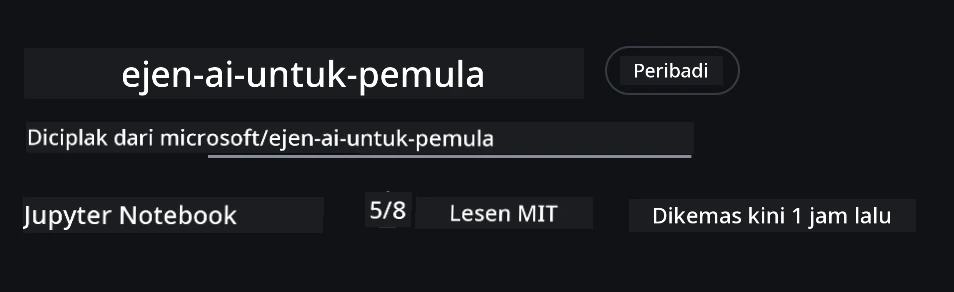
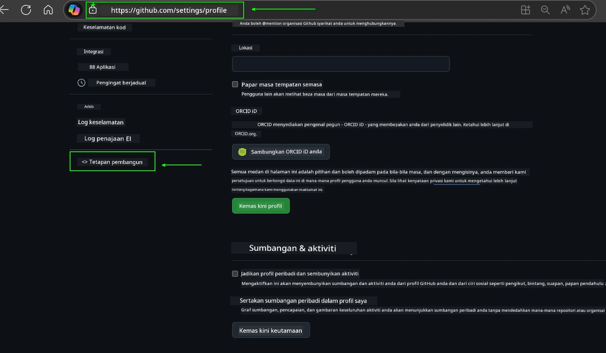
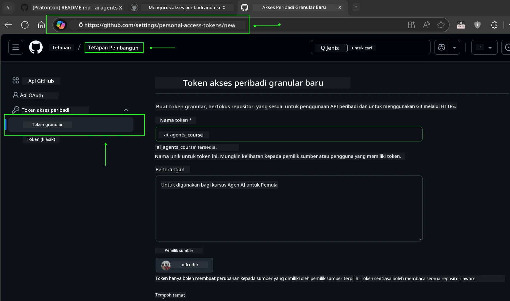
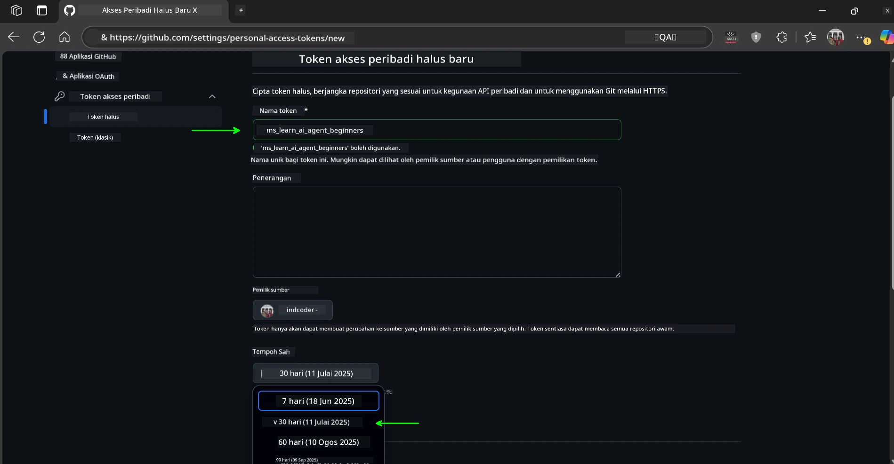
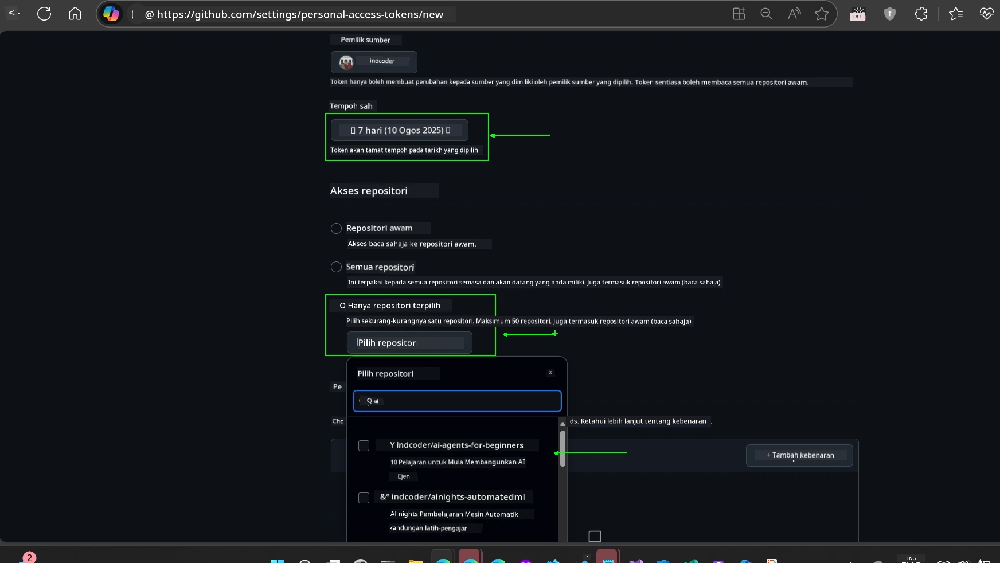
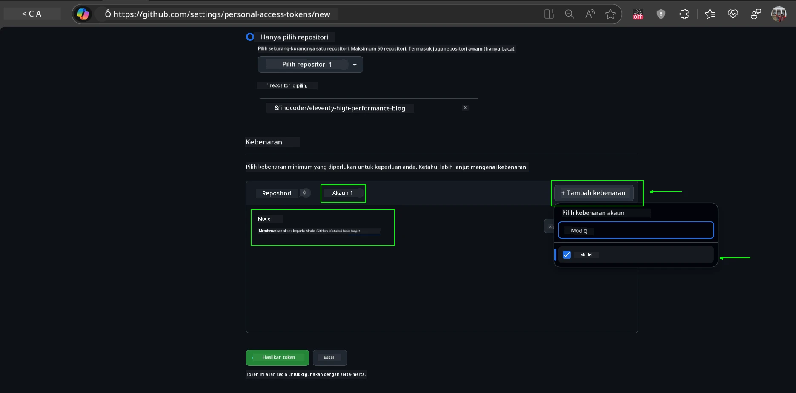
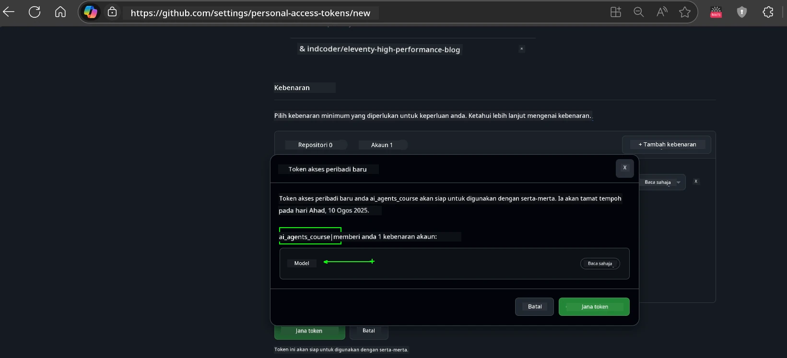
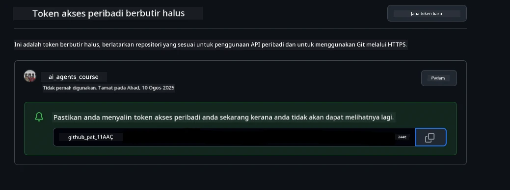
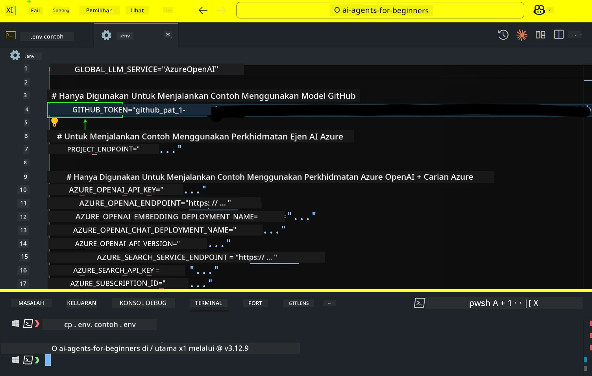
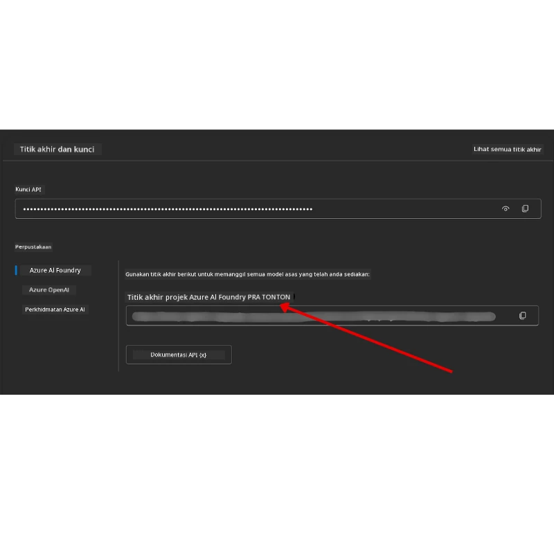

<!--
CO_OP_TRANSLATOR_METADATA:
{
  "original_hash": "63b1a8f6e840df15934935b728e569f0",
  "translation_date": "2025-12-03T14:45:02+00:00",
  "source_file": "00-course-setup/README.md",
  "language_code": "ms"
}
-->
# Persediaan Kursus

## Pengenalan

Pelajaran ini akan membincangkan cara menjalankan contoh kod dalam kursus ini.

## Sertai Pelajar Lain dan Dapatkan Bantuan

Sebelum anda mula mengklon repositori anda, sertai [saluran Discord AI Agents For Beginners](https://aka.ms/ai-agents/discord) untuk mendapatkan bantuan dengan persediaan, sebarang soalan tentang kursus, atau untuk berhubung dengan pelajar lain.

## Klon atau Fork Repositori ini

Untuk memulakan, sila klon atau fork Repositori GitHub. Ini akan membuat versi bahan kursus anda sendiri supaya anda boleh menjalankan, menguji, dan mengubah suai kod!

Ini boleh dilakukan dengan mengklik pautan untuk <a href="https://github.com/microsoft/ai-agents-for-beginners/fork" target="_blank">fork repositori</a>

Anda kini sepatutnya mempunyai versi forked kursus ini di pautan berikut:



### Klon Shallow (disyorkan untuk bengkel / Codespaces)

  >Repositori penuh boleh menjadi besar (~3 GB) apabila anda memuat turun sejarah penuh dan semua fail. Jika anda hanya menghadiri bengkel atau hanya memerlukan beberapa folder pelajaran, klon shallow (atau klon sparse) mengelakkan kebanyakan muat turun itu dengan memotong sejarah dan/atau melangkau blobs.

#### Klon shallow cepat — sejarah minimum, semua fail

Gantikan `<your-username>` dalam arahan di bawah dengan URL fork anda (atau URL upstream jika anda lebih suka).

Untuk mengklon hanya sejarah komit terbaru (muat turun kecil):

```bash|powershell
git clone --depth 1 https://github.com/<your-username>/ai-agents-for-beginners.git
```

Untuk mengklon cawangan tertentu:

```bash|powershell
git clone --depth 1 --branch <branch-name> https://github.com/<your-username>/ai-agents-for-beginners.git
```

#### Klon separa (sparse) — blobs minimum + hanya folder terpilih

Ini menggunakan klon separa dan sparse-checkout (memerlukan Git 2.25+ dan disyorkan Git moden dengan sokongan klon separa):

```bash|powershell
git clone --depth 1 --filter=blob:none --sparse https://github.com/<your-username>/ai-agents-for-beginners.git
```

Masuk ke dalam folder repositori:

```bash|powershell
cd ai-agents-for-beginners
```

Kemudian tentukan folder mana yang anda mahu (contoh di bawah menunjukkan dua folder):

```bash|powershell
git sparse-checkout set 00-course-setup 01-intro-to-ai-agents
```

Selepas mengklon dan mengesahkan fail, jika anda hanya memerlukan fail dan ingin membebaskan ruang (tanpa sejarah git), sila padam metadata repositori (💀tidak boleh dipulihkan — anda akan kehilangan semua fungsi Git: tiada komit, tarik, tolak, atau akses sejarah).

```bash
# zsh/bash
rm -rf .git
```

```powershell
# PowerShell
Remove-Item -Recurse -Force .git
```

#### Menggunakan GitHub Codespaces (disyorkan untuk mengelakkan muat turun besar secara tempatan)

- Buat Codespace baru untuk repositori ini melalui [UI GitHub](https://github.com/codespaces).  

- Dalam terminal Codespace yang baru dibuat, jalankan salah satu arahan klon shallow/sparse di atas untuk membawa hanya folder pelajaran yang anda perlukan ke dalam ruang kerja Codespace.
- Pilihan: selepas mengklon dalam Codespaces, keluarkan .git untuk mendapatkan semula ruang tambahan (lihat arahan penghapusan di atas).
- Nota: Jika anda lebih suka membuka repositori secara langsung dalam Codespaces (tanpa klon tambahan), sedar bahawa Codespaces akan membina persekitaran devcontainer dan mungkin masih menyediakan lebih daripada yang anda perlukan. Mengklon salinan shallow dalam Codespace baru memberi anda lebih kawalan ke atas penggunaan cakera.

#### Petua

- Sentiasa gantikan URL klon dengan fork anda jika anda ingin mengedit/komit.
- Jika anda kemudian memerlukan lebih banyak sejarah atau fail, anda boleh mengambilnya atau menyesuaikan sparse-checkout untuk memasukkan folder tambahan.

## Menjalankan Kod

Kursus ini menawarkan siri Jupyter Notebooks yang boleh anda jalankan untuk mendapatkan pengalaman langsung membina AI Agents.

Contoh kod menggunakan sama ada:

**Memerlukan Akaun GitHub - Percuma**:

1) Rangka Kerja Semantic Kernel + Pasar Model GitHub. Dilabelkan sebagai (semantic-kernel.ipynb)
2) Rangka Kerja AutoGen + Pasar Model GitHub. Dilabelkan sebagai (autogen.ipynb)

**Memerlukan Langganan Azure**:

3) Azure AI Foundry + Perkhidmatan Azure AI Agent. Dilabelkan sebagai (azureaiagent.ipynb)

Kami menggalakkan anda mencuba ketiga-tiga jenis contoh untuk melihat mana yang paling sesuai untuk anda.

Pilihan mana pun yang anda pilih, ia akan menentukan langkah persediaan yang perlu anda ikuti di bawah:

## Keperluan

- Python 3.12+
  - **NOTA**: Jika anda tidak mempunyai Python3.12 dipasang, pastikan anda memasangnya. Kemudian buat venv anda menggunakan python3.12 untuk memastikan versi yang betul dipasang dari fail requirements.txt.
  
    >Contoh

    Buat direktori Python venv:

    ```bash|powershell
    python -m venv venv
    ```

    Kemudian aktifkan persekitaran venv untuk:

    ```bash
    # zsh/bash
    source venv/bin/activate
    ```
  
    ```dos
    # Command Prompt for Windows
    venv\Scripts\activate
    ```

- .NET 10+: Untuk kod contoh yang menggunakan .NET, pastikan anda memasang [.NET 10 SDK](https://dotnet.microsoft.com/download/dotnet/10.0) atau lebih baru. Kemudian, periksa versi SDK .NET yang dipasang:

    ```bash|powershell
    dotnet --list-sdks
    ```

- Akaun GitHub - Untuk Akses ke Pasar Model GitHub
- Langganan Azure - Untuk Akses ke Azure AI Foundry
- Akaun Azure AI Foundry - Untuk Akses ke Perkhidmatan Azure AI Agent

Kami telah menyertakan fail `requirements.txt` di akar repositori ini yang mengandungi semua pakej Python yang diperlukan untuk menjalankan contoh kod.

Anda boleh memasangnya dengan menjalankan arahan berikut di terminal anda di akar repositori:

```bash|powershell
pip install -r requirements.txt
```

Kami mengesyorkan membuat persekitaran maya Python untuk mengelakkan sebarang konflik dan masalah.

## Persediaan VSCode

Pastikan anda menggunakan versi Python yang betul dalam VSCode.


## Persediaan untuk Contoh menggunakan Model GitHub 

### Langkah 1: Dapatkan Token Akses Peribadi (PAT) GitHub Anda

Kursus ini menggunakan Pasar Model GitHub, memberikan akses percuma ke Model Bahasa Besar (LLMs) yang akan anda gunakan untuk membina AI Agents.

Untuk menggunakan Model GitHub, anda perlu membuat [Token Akses Peribadi GitHub](https://docs.github.com/en/authentication/keeping-your-account-and-data-secure/managing-your-personal-access-tokens).

Ini boleh dilakukan dengan pergi ke <a href="https://github.com/settings/personal-access-tokens" target="_blank">tetapan Token Akses Peribadi</a> dalam Akaun GitHub anda.

Sila ikuti [Prinsip Keistimewaan Minimum](https://docs.github.com/en/get-started/learning-to-code/storing-your-secrets-safely) semasa membuat token anda. Ini bermakna anda hanya perlu memberikan token keizinan yang diperlukan untuk menjalankan contoh kod dalam kursus ini.

1. Pilih pilihan `Fine-grained tokens` di sebelah kiri skrin anda dengan pergi ke **Developer settings**

   

   Kemudian pilih `Generate new token`.

   

2. Masukkan nama deskriptif untuk token anda yang mencerminkan tujuannya, menjadikannya mudah dikenali kemudian.

    🔐 Cadangan Tempoh Token

    Tempoh yang disyorkan: 30 hari
    Untuk postur yang lebih selamat, anda boleh memilih tempoh yang lebih pendek—seperti 7 hari 🛡️
    Ia adalah cara yang baik untuk menetapkan sasaran peribadi dan menyelesaikan kursus semasa momentum pembelajaran anda tinggi 🚀.

    

3. Hadkan skop token ke fork repositori ini.

    

4. Hadkan keizinan token: Di bawah **Permissions**, klik tab **Account**, dan klik butang "+ Add permissions". Dropdown akan muncul. Sila cari **Models** dan tandakan kotak untuknya.

    

5. Sahkan keizinan yang diperlukan sebelum menjana token. 

6. Sebelum menjana token, pastikan anda bersedia menyimpan token di tempat yang selamat seperti peti besi pengurus kata laluan, kerana ia tidak akan ditunjukkan lagi selepas anda menciptanya. 

Salin token baru anda yang baru sahaja anda buat. Anda kini akan menambahkannya ke fail `.env` yang disertakan dalam kursus ini.

### Langkah 2: Buat Fail `.env` Anda

Untuk membuat fail `.env` anda jalankan arahan berikut di terminal anda.

```bash
# zsh/bash
cp .env.example .env
```

```powershell
# PowerShell
Copy-Item .env.example .env
```

Ini akan menyalin fail contoh dan membuat `.env` dalam direktori anda di mana anda mengisi nilai untuk pembolehubah persekitaran.

Dengan token anda disalin, buka fail `.env` dalam editor teks kegemaran anda dan tampal token anda ke dalam medan `GITHUB_TOKEN`.



Anda kini sepatutnya boleh menjalankan contoh kod dalam kursus ini.

## Persediaan untuk Contoh menggunakan Azure AI Foundry dan Perkhidmatan Azure AI Agent

### Langkah 1: Dapatkan Endpoint Projek Azure Anda

Ikuti langkah-langkah untuk membuat hub dan projek dalam Azure AI Foundry yang terdapat di sini: [Gambaran keseluruhan sumber Hub](https://learn.microsoft.com/azure/ai-foundry/concepts/ai-resources)

Setelah anda membuat projek anda, anda perlu mendapatkan string sambungan untuk projek anda.

Ini boleh dilakukan dengan pergi ke halaman **Overview** projek anda di portal Azure AI Foundry.



### Langkah 2: Buat Fail `.env` Anda

Untuk membuat fail `.env` anda jalankan arahan berikut di terminal anda.

```bash
# zsh/bash
cp .env.example .env
```

```powershell
# PowerShell
Copy-Item .env.example .env
```

Ini akan menyalin fail contoh dan membuat `.env` dalam direktori anda di mana anda mengisi nilai untuk pembolehubah persekitaran.

Dengan token anda disalin, buka fail `.env` dalam editor teks kegemaran anda dan tampal token anda ke dalam medan `PROJECT_ENDPOINT`.

### Langkah 3: Log Masuk ke Azure

Sebagai amalan keselamatan terbaik, kami akan menggunakan [pengesahan tanpa kunci](https://learn.microsoft.com/azure/developer/ai/keyless-connections?tabs=csharp%2Cazure-cli?WT.mc_id=academic-105485-koreyst) untuk mengesahkan ke Azure OpenAI dengan Microsoft Entra ID. 

Seterusnya, buka terminal dan jalankan `az login --use-device-code` untuk log masuk ke akaun Azure anda.

Setelah anda log masuk, pilih langganan anda di terminal.

## Pembolehubah Persekitaran Tambahan - Azure Search dan Azure OpenAI 

Untuk Pelajaran Agentic RAG - Pelajaran 5 - terdapat contoh yang menggunakan Azure Search dan Azure OpenAI.

Jika anda ingin menjalankan contoh ini, anda perlu menambah pembolehubah persekitaran berikut ke fail `.env` anda:

### Halaman Gambaran Keseluruhan (Projek)

- `AZURE_SUBSCRIPTION_ID` - Semak **Project details** di halaman **Overview** projek anda.

- `AZURE_AI_PROJECT_NAME` - Lihat di bahagian atas halaman **Overview** projek anda.

- `AZURE_OPENAI_SERVICE` - Cari ini di tab **Included capabilities** untuk **Azure OpenAI Service** di halaman **Overview**.

### Pusat Pengurusan

- `AZURE_OPENAI_RESOURCE_GROUP` - Pergi ke **Project properties** di halaman **Overview** di **Management Center**.

- `GLOBAL_LLM_SERVICE` - Di bawah **Connected resources**, cari nama sambungan **Azure AI Services**. Jika tidak disenaraikan, periksa **Azure portal** di bawah kumpulan sumber anda untuk nama sumber AI Services.

### Halaman Model + Endpoint

- `AZURE_OPENAI_EMBEDDING_DEPLOYMENT_NAME` - Pilih model embedding anda (contohnya, `text-embedding-ada-002`) dan catat **Deployment name** dari butiran model.

- `AZURE_OPENAI_CHAT_DEPLOYMENT_NAME` - Pilih model chat anda (contohnya, `gpt-4o-mini`) dan catat **Deployment name** dari butiran model.

### Portal Azure

- `AZURE_OPENAI_ENDPOINT` - Cari **Azure AI services**, klik padanya, kemudian pergi ke **Resource Management**, **Keys and Endpoint**, tatal ke bawah ke "Azure OpenAI endpoints", dan salin yang mengatakan "Language APIs".

- `AZURE_OPENAI_API_KEY` - Dari skrin yang sama, salin KEY 1 atau KEY 2.

- `AZURE_SEARCH_SERVICE_ENDPOINT` - Cari sumber **Azure AI Search** anda, klik padanya, dan lihat **Overview**.

- `AZURE_SEARCH_API_KEY` - Kemudian pergi ke **Settings** dan kemudian **Keys** untuk menyalin kunci admin utama atau sekunder.

### Halaman Luar

- `AZURE_OPENAI_API_VERSION` - Lawati halaman [kitaran hayat versi API](https://learn.microsoft.com/azure/ai-services/openai/api-version-deprecation#latest-ga-api-release) di bawah **Latest GA API release**.

### Persediaan pengesahan tanpa kunci

Daripada mengekodkan kelayakan anda, kami akan menggunakan sambungan tanpa kunci dengan Azure OpenAI. Untuk melakukannya, kami akan mengimport `DefaultAzureCredential` dan kemudian memanggil fungsi `DefaultAzureCredential` untuk mendapatkan kelayakan.

```python
# Python
from azure.identity import DefaultAzureCredential, InteractiveBrowserCredential
```

## Tersangkut di Mana-Mana?
Jika anda menghadapi sebarang masalah menjalankan tetapan ini, sertai <a href="https://discord.gg/kzRShWzttr" target="_blank">Azure AI Community Discord</a> kami atau <a href="https://github.com/microsoft/ai-agents-for-beginners/issues?WT.mc_id=academic-105485-koreyst" target="_blank">buat isu</a>.

## Pelajaran Seterusnya

Anda kini bersedia untuk menjalankan kod bagi kursus ini. Selamat belajar lebih lanjut tentang dunia AI Agents!

[Pengenalan kepada AI Agents dan Kes Penggunaan Agen](../01-intro-to-ai-agents/README.md)

---

<!-- CO-OP TRANSLATOR DISCLAIMER START -->
**Penafian**:  
Dokumen ini telah diterjemahkan menggunakan perkhidmatan terjemahan AI [Co-op Translator](https://github.com/Azure/co-op-translator). Walaupun kami berusaha untuk ketepatan, sila ambil perhatian bahawa terjemahan automatik mungkin mengandungi kesilapan atau ketidaktepatan. Dokumen asal dalam bahasa asalnya harus dianggap sebagai sumber yang berwibawa. Untuk maklumat penting, terjemahan manusia profesional adalah disyorkan. Kami tidak bertanggungjawab atas sebarang salah faham atau salah tafsir yang timbul daripada penggunaan terjemahan ini.
<!-- CO-OP TRANSLATOR DISCLAIMER END -->