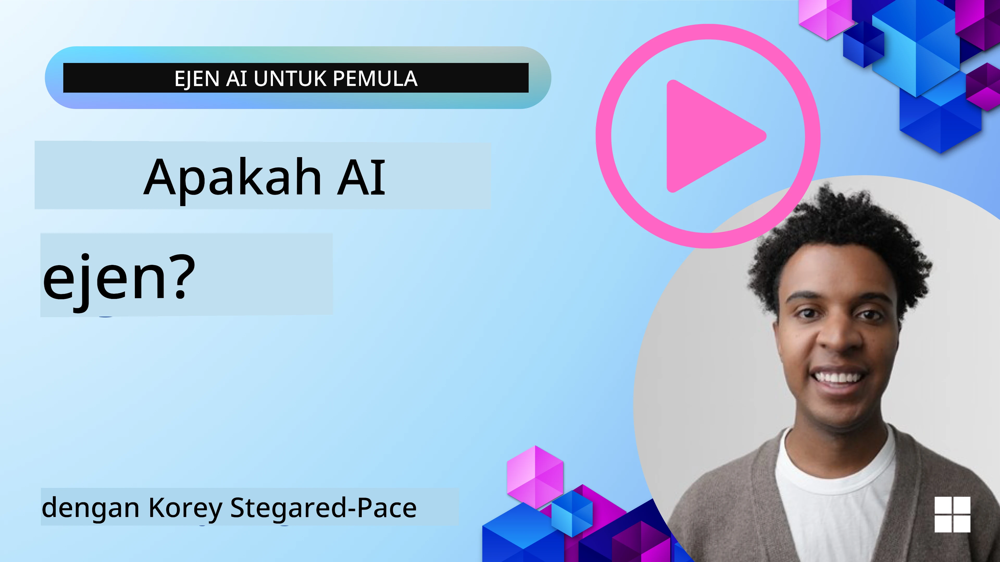
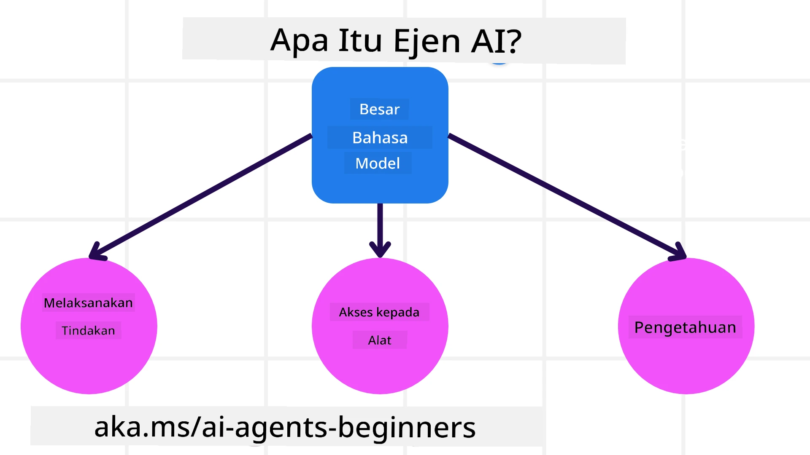
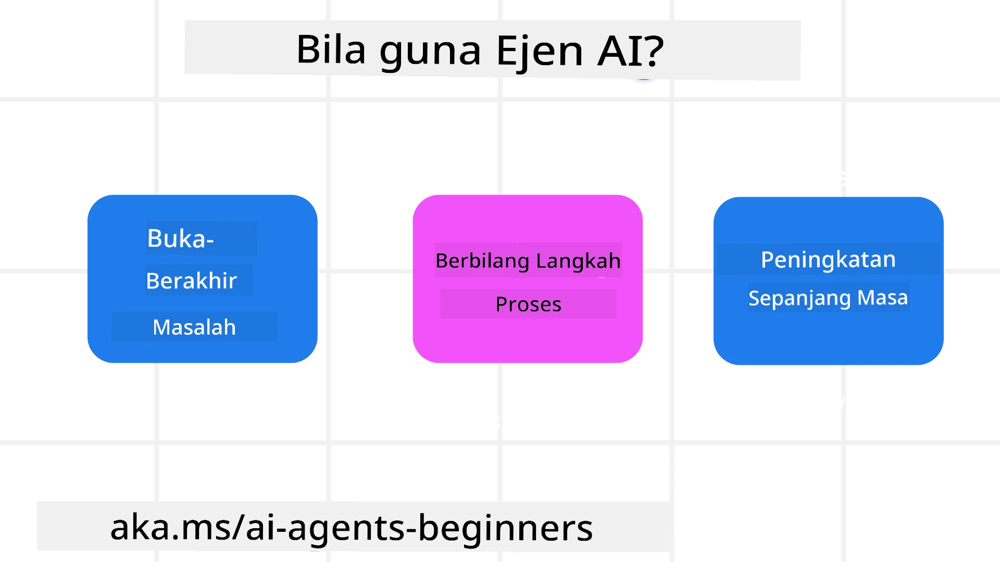

<!--
CO_OP_TRANSLATOR_METADATA:
{
  "original_hash": "cdd28bc00816d2773bb2b5968d782abc",
  "translation_date": "2025-11-11T11:29:38+00:00",
  "source_file": "01-intro-to-ai-agents/README.md",
  "language_code": "ms"
}
-->

> _(Klik imej di atas untuk menonton video pelajaran ini)_

# Pengenalan kepada Ejen AI dan Kes Penggunaan Ejen

Selamat datang ke kursus "Ejen AI untuk Pemula"! Kursus ini menyediakan pengetahuan asas dan contoh aplikasi untuk membina Ejen AI.

Sertai <a href="https://discord.gg/kzRShWzttr" target="_blank">Komuniti Discord Azure AI</a> untuk berhubung dengan pelajar lain dan Pembina Ejen AI serta ajukan sebarang soalan yang anda ada tentang kursus ini.

Untuk memulakan kursus ini, kita akan memahami dengan lebih baik apa itu Ejen AI dan bagaimana kita boleh menggunakannya dalam aplikasi dan aliran kerja yang kita bina.

## Pengenalan

Pelajaran ini merangkumi:

- Apa itu Ejen AI dan apakah jenis ejen yang berbeza?
- Kes penggunaan terbaik untuk Ejen AI dan bagaimana ia boleh membantu kita?
- Apakah beberapa asas penting dalam mereka bentuk Penyelesaian Ejen?

## Matlamat Pembelajaran
Selepas menyelesaikan pelajaran ini, anda seharusnya dapat:

- Memahami konsep Ejen AI dan bagaimana ia berbeza daripada penyelesaian AI lain.
- Menggunakan Ejen AI dengan cara yang paling efisien.
- Mereka bentuk penyelesaian ejen secara produktif untuk pengguna dan pelanggan.

## Mendefinisikan Ejen AI dan Jenis-Jenis Ejen AI

### Apa itu Ejen AI?

Ejen AI adalah **sistem** yang membolehkan **Model Bahasa Besar (LLMs)** untuk **melakukan tindakan** dengan memperluaskan keupayaannya melalui pemberian **akses kepada alat** dan **pengetahuan** kepada LLMs.

Mari kita pecahkan definisi ini kepada bahagian yang lebih kecil:

- **Sistem** - Penting untuk memikirkan ejen bukan sebagai satu komponen tunggal tetapi sebagai sistem yang terdiri daripada banyak komponen. Pada tahap asas, komponen Ejen AI adalah:
  - **Persekitaran** - Ruang yang ditentukan di mana Ejen AI beroperasi. Sebagai contoh, jika kita mempunyai Ejen AI tempahan perjalanan, persekitarannya boleh menjadi sistem tempahan perjalanan yang digunakan oleh Ejen AI untuk menyelesaikan tugas.
  - **Sensor** - Persekitaran mempunyai maklumat dan memberikan maklum balas. Ejen AI menggunakan sensor untuk mengumpul dan mentafsir maklumat tentang keadaan semasa persekitaran. Dalam contoh Ejen Tempahan Perjalanan, sistem tempahan perjalanan boleh memberikan maklumat seperti ketersediaan hotel atau harga penerbangan.
  - **Aktuator** - Setelah Ejen AI menerima keadaan semasa persekitaran, untuk tugas semasa, ejen menentukan tindakan apa yang perlu dilakukan untuk mengubah persekitaran. Untuk ejen tempahan perjalanan, ia mungkin menempah bilik yang tersedia untuk pengguna.

**Model Bahasa Besar** - Konsep ejen telah wujud sebelum penciptaan LLMs. Kelebihan membina Ejen AI dengan LLMs adalah keupayaannya untuk mentafsir bahasa manusia dan data. Keupayaan ini membolehkan LLMs mentafsir maklumat persekitaran dan menentukan rancangan untuk mengubah persekitaran.

**Melakukan Tindakan** - Di luar sistem Ejen AI, LLMs terhad kepada situasi di mana tindakannya adalah menghasilkan kandungan atau maklumat berdasarkan arahan pengguna. Dalam sistem Ejen AI, LLMs boleh menyelesaikan tugas dengan mentafsir permintaan pengguna dan menggunakan alat yang tersedia dalam persekitarannya.

**Akses kepada Alat** - Alat yang boleh diakses oleh LLM ditentukan oleh 1) persekitaran di mana ia beroperasi dan 2) pembangun Ejen AI. Dalam contoh ejen perjalanan kita, alat ejen terhad oleh operasi yang tersedia dalam sistem tempahan, dan/atau pembangun boleh mengehadkan akses alat ejen kepada penerbangan.

**Memori+Pengetahuan** - Memori boleh menjadi jangka pendek dalam konteks perbualan antara pengguna dan ejen. Jangka panjang, di luar maklumat yang disediakan oleh persekitaran, Ejen AI juga boleh mendapatkan pengetahuan daripada sistem lain, perkhidmatan, alat, dan bahkan ejen lain. Dalam contoh ejen perjalanan, pengetahuan ini boleh menjadi maklumat tentang keutamaan perjalanan pengguna yang terletak dalam pangkalan data pelanggan.

### Jenis-Jenis Ejen yang Berbeza

Sekarang kita mempunyai definisi umum tentang Ejen AI, mari kita lihat beberapa jenis ejen tertentu dan bagaimana ia boleh digunakan untuk ejen tempahan perjalanan AI.

| **Jenis Ejen**                | **Penerangan**                                                                                                                       | **Contoh**                                                                                                                                                                                                                   |
| ----------------------------- | ------------------------------------------------------------------------------------------------------------------------------------- | ----------------------------------------------------------------------------------------------------------------------------------------------------------------------------------------------------------------------------- |
| **Ejen Refleks Mudah**        | Melakukan tindakan segera berdasarkan peraturan yang telah ditetapkan.                                                                | Ejen perjalanan mentafsir konteks e-mel dan meneruskan aduan perjalanan kepada khidmat pelanggan.                                                                                                                          |
| **Ejen Refleks Berasaskan Model** | Melakukan tindakan berdasarkan model dunia dan perubahan kepada model tersebut.                                                       | Ejen perjalanan memprioritaskan laluan dengan perubahan harga yang signifikan berdasarkan akses kepada data harga sejarah.                                                                                                             |
| **Ejen Berasaskan Matlamat**  | Membuat rancangan untuk mencapai matlamat tertentu dengan mentafsir matlamat dan menentukan tindakan untuk mencapainya.                | Ejen perjalanan menempah perjalanan dengan menentukan pengaturan perjalanan yang diperlukan (kereta, pengangkutan awam, penerbangan) dari lokasi semasa ke destinasi.                                                                                |
| **Ejen Berasaskan Utiliti**   | Mengambil kira keutamaan dan menimbang pertukaran secara numerik untuk menentukan cara mencapai matlamat.                              | Ejen perjalanan memaksimumkan utiliti dengan menimbang kemudahan vs. kos semasa menempah perjalanan.                                                                                                                                          |
| **Ejen Pembelajaran**         | Meningkatkan dari masa ke masa dengan memberi respons kepada maklum balas dan menyesuaikan tindakan dengan sewajarnya.                 | Ejen perjalanan meningkatkan dengan menggunakan maklum balas pelanggan daripada tinjauan selepas perjalanan untuk membuat penyesuaian kepada tempahan masa depan.                                                                                                               |
| **Ejen Hierarki**             | Menampilkan pelbagai ejen dalam sistem bertingkat, dengan ejen peringkat tinggi memecahkan tugas kepada subtugas untuk ejen peringkat rendah melengkapinya. | Ejen perjalanan membatalkan perjalanan dengan membahagikan tugas kepada subtugas (contohnya, membatalkan tempahan tertentu) dan membiarkan ejen peringkat rendah melengkapinya, melaporkan kembali kepada ejen peringkat tinggi.                                     |
| **Sistem Multi-Ejen (MAS)**   | Ejen melengkapkan tugas secara bebas, sama ada secara koperatif atau kompetitif.                                                      | Koperatif: Pelbagai ejen menempah perkhidmatan perjalanan tertentu seperti hotel, penerbangan, dan hiburan. Kompetitif: Pelbagai ejen mengurus dan bersaing dalam kalendar tempahan hotel yang dikongsi untuk menempah pelanggan ke hotel. |

## Bila Menggunakan Ejen AI

Dalam bahagian sebelumnya, kita menggunakan kes penggunaan Ejen Perjalanan untuk menerangkan bagaimana jenis ejen yang berbeza boleh digunakan dalam senario tempahan perjalanan yang berbeza. Kita akan terus menggunakan aplikasi ini sepanjang kursus.

Mari kita lihat jenis kes penggunaan yang paling sesuai untuk Ejen AI:

- **Masalah Terbuka** - membolehkan LLM menentukan langkah-langkah yang diperlukan untuk menyelesaikan tugas kerana ia tidak selalu dapat dikodkan secara tetap dalam aliran kerja.
- **Proses Berbilang Langkah** - tugas yang memerlukan tahap kerumitan di mana Ejen AI perlu menggunakan alat atau maklumat dalam beberapa giliran dan bukannya pengambilan satu kali.  
- **Peningkatan dari Masa ke Masa** - tugas di mana ejen boleh meningkatkan dari masa ke masa dengan menerima maklum balas sama ada daripada persekitarannya atau pengguna untuk memberikan utiliti yang lebih baik.

Kami akan membincangkan lebih banyak pertimbangan menggunakan Ejen AI dalam pelajaran Membina Ejen AI yang Boleh Dipercayai.

## Asas Penyelesaian Ejen

### Pembangunan Ejen

Langkah pertama dalam mereka bentuk sistem Ejen AI adalah untuk menentukan alat, tindakan, dan tingkah laku. Dalam kursus ini, kami memberi tumpuan kepada penggunaan **Perkhidmatan Ejen AI Azure** untuk menentukan Ejen kami. Ia menawarkan ciri seperti:

- Pemilihan Model Terbuka seperti OpenAI, Mistral, dan Llama
- Penggunaan Data Berlesen melalui penyedia seperti Tripadvisor
- Penggunaan alat OpenAPI 3.0 yang standard

### Corak Ejen

Komunikasi dengan LLMs adalah melalui arahan. Memandangkan sifat separa autonomi Ejen AI, ia tidak selalu mungkin atau diperlukan untuk mengarahkan semula LLM secara manual selepas perubahan dalam persekitaran. Kami menggunakan **Corak Ejen** yang membolehkan kami mengarahkan LLM dalam beberapa langkah dengan cara yang lebih berskala.

Kursus ini dibahagikan kepada beberapa corak ejen popular semasa.

### Kerangka Ejen

Kerangka Ejen membolehkan pembangun melaksanakan corak ejen melalui kod. Kerangka ini menawarkan templat, pemalam, dan alat untuk kerjasama Ejen AI yang lebih baik. Manfaat ini menyediakan keupayaan untuk pemerhatian dan penyelesaian masalah sistem Ejen AI yang lebih baik.

Dalam kursus ini, kami akan meneroka kerangka AutoGen yang berasaskan penyelidikan dan kerangka Ejen yang sedia untuk pengeluaran daripada Semantic Kernel.

## Kod Contoh

- Python: [Kerangka Ejen](./code_samples/01-python-agent-framework.ipynb)
- .NET: [Kerangka Ejen](./code_samples/01-dotnet-agent-framework.md)

## Ada Lagi Soalan tentang Ejen AI?

Sertai [Azure AI Foundry Discord](https://aka.ms/ai-agents/discord) untuk berhubung dengan pelajar lain, menghadiri waktu pejabat, dan mendapatkan jawapan kepada soalan Ejen AI anda.

## Pelajaran Sebelumnya

[Persediaan Kursus](../00-course-setup/README.md)

## Pelajaran Seterusnya

[Meneroka Kerangka Ejen](../02-explore-agentic-frameworks/README.md)

---

<!-- CO-OP TRANSLATOR DISCLAIMER START -->
**Penafian**:  
Dokumen ini telah diterjemahkan menggunakan perkhidmatan terjemahan AI [Co-op Translator](https://github.com/Azure/co-op-translator). Walaupun kami berusaha untuk ketepatan, sila ambil perhatian bahawa terjemahan automatik mungkin mengandungi kesilapan atau ketidaktepatan. Dokumen asal dalam bahasa asalnya harus dianggap sebagai sumber yang berwibawa. Untuk maklumat penting, terjemahan manusia profesional adalah disyorkan. Kami tidak bertanggungjawab atas sebarang salah faham atau salah tafsir yang timbul daripada penggunaan terjemahan ini.
<!-- CO-OP TRANSLATOR DISCLAIMER END -->