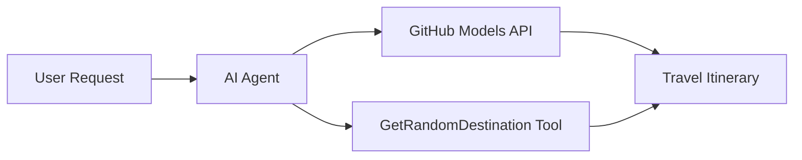

<!--
CO_OP_TRANSLATOR_METADATA:
{
  "original_hash": "5f351412e934f0833c8c821a0a60efaf",
  "translation_date": "2025-11-13T13:23:12+00:00",
  "source_file": "01-intro-to-ai-agents/code_samples/01-dotnet-agent-framework.md",
  "language_code": "ms"
}
-->
# 🌍 Ejen Pelancongan AI dengan Microsoft Agent Framework (.NET)

## 📋 Gambaran Senario

Contoh ini menunjukkan cara membina ejen perancangan pelancongan pintar menggunakan Microsoft Agent Framework untuk .NET. Ejen ini boleh secara automatik menghasilkan jadual perjalanan harian yang diperibadikan untuk destinasi rawak di seluruh dunia.

### Keupayaan Utama:

- 🎲 **Pemilihan Destinasi Rawak**: Menggunakan alat khas untuk memilih tempat percutian
- 🗺️ **Perancangan Perjalanan Pintar**: Mencipta jadual perjalanan terperinci hari demi hari
- 🔄 **Penstriman Masa Nyata**: Menyokong respons segera dan penstriman
- 🛠️ **Integrasi Alat Khas**: Menunjukkan cara untuk memperluaskan keupayaan ejen

## 🔧 Seni Bina Teknikal

### Teknologi Teras

- **Microsoft Agent Framework**: Implementasi .NET terkini untuk pembangunan ejen AI
- **Integrasi Model GitHub**: Menggunakan perkhidmatan inferens model AI GitHub
- **Keserasian API OpenAI**: Memanfaatkan pustaka klien OpenAI dengan titik akhir tersuai
- **Konfigurasi Selamat**: Pengurusan kunci API berdasarkan persekitaran

### Komponen Utama

1. **AIAgent**: Pengatur utama ejen yang mengendalikan aliran perbualan
2. **Alat Khas**: Fungsi `GetRandomDestination()` tersedia untuk ejen
3. **Chat Client**: Antara muka perbualan yang disokong oleh Model GitHub
4. **Sokongan Penstriman**: Keupayaan penjanaan respons masa nyata

### Corak Integrasi



## 🚀 Memulakan

### Prasyarat

- [.NET 10 SDK](https://dotnet.microsoft.com/download/dotnet/10.0) atau lebih tinggi
- [Token akses API Model GitHub](https://docs.github.com/github-models/github-models-at-scale/using-your-own-api-keys-in-github-models)

### Pembolehubah Persekitaran Diperlukan

```bash
# zsh/bash
export GH_TOKEN=<your_github_token>
export GH_ENDPOINT=https://models.github.ai/inference
export GH_MODEL_ID=openai/gpt-5-mini
```

```powershell
# PowerShell
$env:GH_TOKEN = "<your_github_token>"
$env:GH_ENDPOINT = "https://models.github.ai/inference"
$env:GH_MODEL_ID = "openai/gpt-5-mini"
```

### Kod Contoh

Untuk menjalankan contoh kod,

```bash
# zsh/bash
chmod +x ./01-dotnet-agent-framework.cs
./01-dotnet-agent-framework.cs
```

Atau menggunakan CLI dotnet:

```bash
dotnet run ./01-dotnet-agent-framework.cs
```

Lihat [`01-dotnet-agent-framework.cs`](../../../../01-intro-to-ai-agents/code_samples/01-dotnet-agent-framework.cs) untuk kod lengkap.

```csharp
#!/usr/bin/dotnet run

#:package Microsoft.Extensions.AI@9.*
#:package Microsoft.Agents.AI.OpenAI@1.*-*

using System.ClientModel;
using System.ComponentModel;

using Microsoft.Agents.AI;
using Microsoft.Extensions.AI;

using OpenAI;

// Tool Function: Random Destination Generator
// This static method will be available to the agent as a callable tool
// The [Description] attribute helps the AI understand when to use this function
// This demonstrates how to create custom tools for AI agents
[Description("Provides a random vacation destination.")]
static string GetRandomDestination()
{
    // List of popular vacation destinations around the world
    // The agent will randomly select from these options
    var destinations = new List<string>
    {
        "Paris, France",
        "Tokyo, Japan",
        "New York City, USA",
        "Sydney, Australia",
        "Rome, Italy",
        "Barcelona, Spain",
        "Cape Town, South Africa",
        "Rio de Janeiro, Brazil",
        "Bangkok, Thailand",
        "Vancouver, Canada"
    };

    // Generate random index and return selected destination
    // Uses System.Random for simple random selection
    var random = new Random();
    int index = random.Next(destinations.Count);
    return destinations[index];
}

// Extract configuration from environment variables
// Retrieve the GitHub Models API endpoint, defaults to https://models.github.ai/inference if not specified
// Retrieve the model ID, defaults to openai/gpt-5-mini if not specified
// Retrieve the GitHub token for authentication, throws exception if not specified
var github_endpoint = Environment.GetEnvironmentVariable("GH_ENDPOINT") ?? "https://models.github.ai/inference";
var github_model_id = Environment.GetEnvironmentVariable("GH_MODEL_ID") ?? "openai/gpt-5-mini";
var github_token = Environment.GetEnvironmentVariable("GH_TOKEN") ?? throw new InvalidOperationException("GH_TOKEN is not set.");

// Configure OpenAI Client Options
// Create configuration options to point to GitHub Models endpoint
// This redirects OpenAI client calls to GitHub's model inference service
var openAIOptions = new OpenAIClientOptions()
{
    Endpoint = new Uri(github_endpoint)
};

// Initialize OpenAI Client with GitHub Models Configuration
// Create OpenAI client using GitHub token for authentication
// Configure it to use GitHub Models endpoint instead of OpenAI directly
var openAIClient = new OpenAIClient(new ApiKeyCredential(github_token), openAIOptions);

// Create AI Agent with Travel Planning Capabilities
// Initialize OpenAI client, get chat client for specified model, and create AI agent
// Configure agent with travel planning instructions and random destination tool
// The agent can now plan trips using the GetRandomDestination function
AIAgent agent = openAIClient
    .GetChatClient(github_model_id)
    .CreateAIAgent(
        instructions: "You are a helpful AI Agent that can help plan vacations for customers at random destinations",
        tools: [AIFunctionFactory.Create(GetRandomDestination)]
    );

// Execute Agent: Plan a Day Trip
// Run the agent with streaming enabled for real-time response display
// Shows the agent's thinking and response as it generates the content
// Provides better user experience with immediate feedback
await foreach (var update in agent.RunStreamingAsync("Plan me a day trip"))
{
    await Task.Delay(10);
    Console.Write(update);
}
```

## 🎓 Pengajaran Utama

1. **Seni Bina Ejen**: Microsoft Agent Framework menyediakan pendekatan yang bersih dan selamat jenis untuk membina ejen AI dalam .NET
2. **Integrasi Alat**: Fungsi yang dihiasi dengan atribut `[Description]` menjadi alat yang tersedia untuk ejen
3. **Pengurusan Konfigurasi**: Pembolehubah persekitaran dan pengendalian kelayakan selamat mengikuti amalan terbaik .NET
4. **Keserasian OpenAI**: Integrasi Model GitHub berfungsi dengan lancar melalui API yang serasi dengan OpenAI

## 🔗 Sumber Tambahan

- [Dokumentasi Microsoft Agent Framework](https://learn.microsoft.com/agent-framework)
- [Marketplace Model GitHub](https://github.com/marketplace?type=models)
- [Microsoft.Extensions.AI](https://learn.microsoft.com/dotnet/ai/microsoft-extensions-ai)
- [.NET Single File Apps](https://devblogs.microsoft.com/dotnet/announcing-dotnet-run-app)

---

<!-- CO-OP TRANSLATOR DISCLAIMER START -->
**Penafian**:  
Dokumen ini telah diterjemahkan menggunakan perkhidmatan terjemahan AI [Co-op Translator](https://github.com/Azure/co-op-translator). Walaupun kami berusaha untuk ketepatan, sila ambil perhatian bahawa terjemahan automatik mungkin mengandungi kesilapan atau ketidaktepatan. Dokumen asal dalam bahasa asalnya harus dianggap sebagai sumber yang berwibawa. Untuk maklumat yang kritikal, terjemahan manusia profesional adalah disyorkan. Kami tidak bertanggungjawab atas sebarang salah faham atau salah tafsir yang timbul daripada penggunaan terjemahan ini.
<!-- CO-OP TRANSLATOR DISCLAIMER END -->