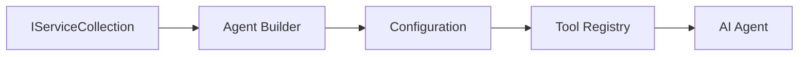

<!--
CO_OP_TRANSLATOR_METADATA:
{
  "original_hash": "bcc874e190347bd6a095aed56dc16de8",
  "translation_date": "2025-11-13T13:27:05+00:00",
  "source_file": "03-agentic-design-patterns/code_samples/03-dotnet-agent-framework.md",
  "language_code": "ms"
}
-->
# 🎨 Corak Reka Bentuk Agentic dengan Model GitHub (.NET)

## 📋 Objektif Pembelajaran

Contoh ini menunjukkan corak reka bentuk bertaraf perusahaan untuk membina agen pintar menggunakan Microsoft Agent Framework dalam .NET dengan integrasi Model GitHub. Anda akan mempelajari corak profesional dan pendekatan seni bina yang menjadikan agen bersedia untuk pengeluaran, mudah diselenggara, dan boleh diskalakan.

### Corak Reka Bentuk Perusahaan

- 🏭 **Corak Kilang (Factory Pattern)**: Penciptaan agen yang standard dengan suntikan kebergantungan
- 🔧 **Corak Pembina (Builder Pattern)**: Konfigurasi dan penyediaan agen yang lancar
- 🧵 **Corak Selamat Benang (Thread-Safe Patterns)**: Pengurusan perbualan serentak
- 📋 **Corak Repositori (Repository Pattern)**: Pengurusan alat dan keupayaan yang teratur

## 🎯 Kelebihan Seni Bina Khusus .NET

### Ciri Perusahaan

- **Taip Kuat (Strong Typing)**: Pengesahan semasa kompilasi dan sokongan IntelliSense
- **Suntikan Kebergantungan (Dependency Injection)**: Integrasi bekas DI terbina dalam
- **Pengurusan Konfigurasi**: Pola IConfiguration dan Options
- **Async/Await**: Sokongan pengaturcaraan asinkron kelas pertama

### Corak Sedia Pengeluaran

- **Integrasi Log**: Sokongan ILogger dan log berstruktur
- **Pemeriksaan Kesihatan**: Pemantauan dan diagnostik terbina dalam
- **Pengesahan Konfigurasi**: Taip kuat dengan anotasi data
- **Pengendalian Ralat**: Pengurusan pengecualian berstruktur

## 🔧 Seni Bina Teknikal

### Komponen Teras .NET

- **Microsoft.Extensions.AI**: Abstraksi perkhidmatan AI yang bersatu
- **Microsoft.Agents.AI**: Rangka kerja orkestrasi agen perusahaan
- **Integrasi Model GitHub**: Corak klien API berprestasi tinggi
- **Sistem Konfigurasi**: Integrasi appsettings.json dan persekitaran

### Pelaksanaan Corak Reka Bentuk



## 🏗️ Corak Perusahaan yang Ditunjukkan

### 1. **Corak Penciptaan**

- **Kilang Agen (Agent Factory)**: Penciptaan agen terpusat dengan konfigurasi yang konsisten
- **Corak Pembina (Builder Pattern)**: API lancar untuk konfigurasi agen yang kompleks
- **Corak Singleton**: Pengurusan sumber dan konfigurasi yang dikongsi
- **Suntikan Kebergantungan (Dependency Injection)**: Gandingan longgar dan kebolehujian

### 2. **Corak Tingkah Laku**

- **Corak Strategi (Strategy Pattern)**: Strategi pelaksanaan alat yang boleh ditukar
- **Corak Perintah (Command Pattern)**: Operasi agen yang dikapsulkan dengan undo/redo
- **Corak Pemerhati (Observer Pattern)**: Pengurusan kitaran hayat agen yang didorong oleh acara
- **Kaedah Templat (Template Method)**: Aliran kerja pelaksanaan agen yang standard

### 3. **Corak Struktur**

- **Corak Penyesuai (Adapter Pattern)**: Lapisan integrasi API Model GitHub
- **Corak Dekorator (Decorator Pattern)**: Peningkatan keupayaan agen
- **Corak Fasad (Facade Pattern)**: Antara muka interaksi agen yang dipermudahkan
- **Corak Proksi (Proxy Pattern)**: Pemuatan malas dan caching untuk prestasi

## 📚 Prinsip Reka Bentuk .NET

### Prinsip SOLID

- **Tanggungjawab Tunggal (Single Responsibility)**: Setiap komponen mempunyai satu tujuan yang jelas
- **Terbuka/Tertutup (Open/Closed)**: Boleh diperluas tanpa pengubahsuaian
- **Penggantian Liskov (Liskov Substitution)**: Pelaksanaan alat berasaskan antara muka
- **Pemisahan Antara Muka (Interface Segregation)**: Antara muka yang fokus dan padu
- **Penyongsangan Kebergantungan (Dependency Inversion)**: Bergantung pada abstraksi, bukan konkrit

### Seni Bina Bersih

- **Lapisan Domain**: Abstraksi teras agen dan alat
- **Lapisan Aplikasi**: Orkestrasi agen dan aliran kerja
- **Lapisan Infrastruktur**: Integrasi Model GitHub dan perkhidmatan luaran
- **Lapisan Persembahan**: Interaksi pengguna dan pemformatan respons

## 🔒 Pertimbangan Perusahaan

### Keselamatan

- **Pengurusan Kredensial**: Pengendalian kunci API yang selamat dengan IConfiguration
- **Pengesahan Input**: Taip kuat dan pengesahan anotasi data
- **Pembersihan Output**: Pemprosesan dan penapisan respons yang selamat
- **Log Audit**: Penjejakan operasi yang komprehensif

### Prestasi

- **Corak Asinkron**: Operasi I/O tanpa sekatan
- **Pengumpulan Sambungan**: Pengurusan klien HTTP yang cekap
- **Caching**: Caching respons untuk meningkatkan prestasi
- **Pengurusan Sumber**: Corak pelupusan dan pembersihan yang betul

### Skalabiliti

- **Keselamatan Benang (Thread Safety)**: Sokongan pelaksanaan agen serentak
- **Pengumpulan Sumber**: Penggunaan sumber yang cekap
- **Pengurusan Beban**: Had kadar dan pengendalian tekanan balik
- **Pemantauan**: Metrik prestasi dan pemeriksaan kesihatan

## 🚀 Penggunaan Pengeluaran

- **Pengurusan Konfigurasi**: Tetapan khusus persekitaran
- **Strategi Log**: Log berstruktur dengan ID korelasi
- **Pengendalian Ralat**: Pengendalian pengecualian global dengan pemulihan yang betul
- **Pemantauan**: Wawasan aplikasi dan kaunter prestasi
- **Pengujian**: Corak ujian unit, ujian integrasi, dan ujian beban

Bersedia untuk membina agen pintar bertaraf perusahaan dengan .NET? Mari kita reka sesuatu yang kukuh! 🏢✨

## 🚀 Memulakan

### Prasyarat

- [.NET 10 SDK](https://dotnet.microsoft.com/download/dotnet/10.0) atau lebih tinggi
- [Token akses API Model GitHub](https://docs.github.com/github-models/github-models-at-scale/using-your-own-api-keys-in-github-models)

### Pembolehubah Persekitaran Diperlukan

```bash
# zsh/bash
export GH_TOKEN=<your_github_token>
export GH_ENDPOINT=https://models.github.ai/inference
export GH_MODEL_ID=openai/gpt-5-mini
```

```powershell
# PowerShell
$env:GH_TOKEN = "<your_github_token>"
$env:GH_ENDPOINT = "https://models.github.ai/inference"
$env:GH_MODEL_ID = "openai/gpt-5-mini"
```

### Kod Contoh

Untuk menjalankan contoh kod,

```bash
# zsh/bash
chmod +x ./03-dotnet-agent-framework.cs
./03-dotnet-agent-framework.cs
```

Atau menggunakan CLI dotnet:

```bash
dotnet run ./03-dotnet-agent-framework.cs
```

Lihat [`03-dotnet-agent-framework.cs`](../../../../03-agentic-design-patterns/code_samples/03-dotnet-agent-framework.cs) untuk kod lengkap.

```csharp
#!/usr/bin/dotnet run

#:package Microsoft.Extensions.AI@10.*
#:package Microsoft.Agents.AI.OpenAI@1.*-*

using System.ClientModel;
using System.ComponentModel;

using Microsoft.Agents.AI;
using Microsoft.Extensions.AI;

using OpenAI;

// Tool Function: Random Destination Generator
// This static method will be available to the agent as a callable tool
// The [Description] attribute helps the AI understand when to use this function
// This demonstrates how to create custom tools for AI agents
[Description("Provides a random vacation destination.")]
static string GetRandomDestination()
{
    // List of popular vacation destinations around the world
    // The agent will randomly select from these options
    var destinations = new List<string>
    {
        "Paris, France",
        "Tokyo, Japan",
        "New York City, USA",
        "Sydney, Australia",
        "Rome, Italy",
        "Barcelona, Spain",
        "Cape Town, South Africa",
        "Rio de Janeiro, Brazil",
        "Bangkok, Thailand",
        "Vancouver, Canada"
    };

    // Generate random index and return selected destination
    // Uses System.Random for simple random selection
    var random = new Random();
    int index = random.Next(destinations.Count);
    return destinations[index];
}

// Extract configuration from environment variables
// Retrieve the GitHub Models API endpoint, defaults to https://models.github.ai/inference if not specified
// Retrieve the model ID, defaults to openai/gpt-5-mini if not specified
// Retrieve the GitHub token for authentication, throws exception if not specified
var github_endpoint = Environment.GetEnvironmentVariable("GH_ENDPOINT") ?? "https://models.github.ai/inference";
var github_model_id = Environment.GetEnvironmentVariable("GH_MODEL_ID") ?? "openai/gpt-5-mini";
var github_token = Environment.GetEnvironmentVariable("GH_TOKEN") ?? throw new InvalidOperationException("GH_TOKEN is not set.");

// Configure OpenAI Client Options
// Create configuration options to point to GitHub Models endpoint
// This redirects OpenAI client calls to GitHub's model inference service
var openAIOptions = new OpenAIClientOptions()
{
    Endpoint = new Uri(github_endpoint)
};

// Initialize OpenAI Client with GitHub Models Configuration
// Create OpenAI client using GitHub token for authentication
// Configure it to use GitHub Models endpoint instead of OpenAI directly
var openAIClient = new OpenAIClient(new ApiKeyCredential(github_token), openAIOptions);

// Define Agent Identity and Comprehensive Instructions
// Agent name for identification and logging purposes
var AGENT_NAME = "TravelAgent";

// Detailed instructions that define the agent's personality, capabilities, and behavior
// This system prompt shapes how the agent responds and interacts with users
var AGENT_INSTRUCTIONS = """
You are a helpful AI Agent that can help plan vacations for customers.

Important: When users specify a destination, always plan for that location. Only suggest random destinations when the user hasn't specified a preference.

When the conversation begins, introduce yourself with this message:
"Hello! I'm your TravelAgent assistant. I can help plan vacations and suggest interesting destinations for you. Here are some things you can ask me:
1. Plan a day trip to a specific location
2. Suggest a random vacation destination
3. Find destinations with specific features (beaches, mountains, historical sites, etc.)
4. Plan an alternative trip if you don't like my first suggestion

What kind of trip would you like me to help you plan today?"

Always prioritize user preferences. If they mention a specific destination like "Bali" or "Paris," focus your planning on that location rather than suggesting alternatives.
""";

// Create AI Agent with Advanced Travel Planning Capabilities
// Initialize complete agent pipeline: OpenAI client → Chat client → AI agent
// Configure agent with name, detailed instructions, and available tools
// This demonstrates the .NET agent creation pattern with full configuration
AIAgent agent = openAIClient
    .GetChatClient(github_model_id)
    .CreateAIAgent(
        name: AGENT_NAME,
        instructions: AGENT_INSTRUCTIONS,
        tools: [AIFunctionFactory.Create(GetRandomDestination)]
    );

// Create New Conversation Thread for Context Management
// Initialize a new conversation thread to maintain context across multiple interactions
// Threads enable the agent to remember previous exchanges and maintain conversational state
// This is essential for multi-turn conversations and contextual understanding
AgentThread thread = agent.GetNewThread();

// Execute Agent: First Travel Planning Request
// Run the agent with an initial request that will likely trigger the random destination tool
// The agent will analyze the request, use the GetRandomDestination tool, and create an itinerary
// Using the thread parameter maintains conversation context for subsequent interactions
await foreach (var update in agent.RunStreamingAsync("Plan me a day trip", thread))
{
    await Task.Delay(10);
    Console.Write(update);
}

Console.WriteLine();

// Execute Agent: Follow-up Request with Context Awareness
// Demonstrate contextual conversation by referencing the previous response
// The agent remembers the previous destination suggestion and will provide an alternative
// This showcases the power of conversation threads and contextual understanding in .NET agents
await foreach (var update in agent.RunStreamingAsync("I don't like that destination. Plan me another vacation.", thread))
{
    await Task.Delay(10);
    Console.Write(update);
}
```

---

<!-- CO-OP TRANSLATOR DISCLAIMER START -->
**Penafian**:  
Dokumen ini telah diterjemahkan menggunakan perkhidmatan terjemahan AI [Co-op Translator](https://github.com/Azure/co-op-translator). Walaupun kami berusaha untuk ketepatan, sila ambil perhatian bahawa terjemahan automatik mungkin mengandungi kesilapan atau ketidaktepatan. Dokumen asal dalam bahasa asalnya harus dianggap sebagai sumber yang berwibawa. Untuk maklumat kritikal, terjemahan manusia profesional adalah disyorkan. Kami tidak bertanggungjawab atas sebarang salah faham atau salah tafsir yang timbul daripada penggunaan terjemahan ini.
<!-- CO-OP TRANSLATOR DISCLAIMER END -->