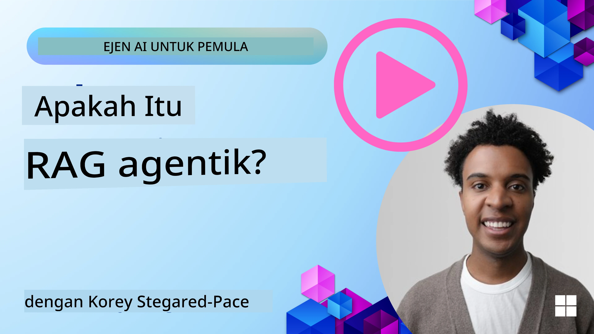
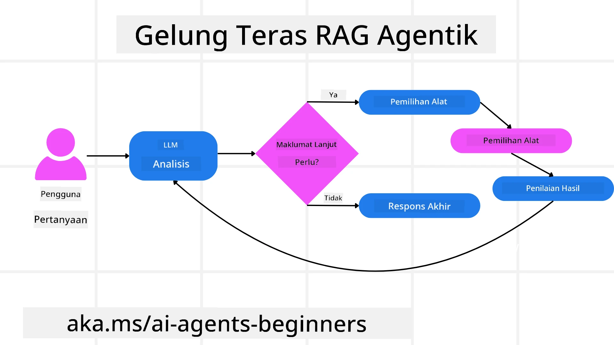
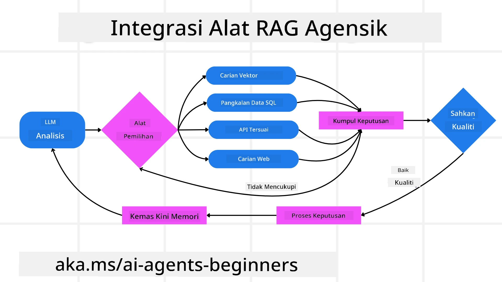
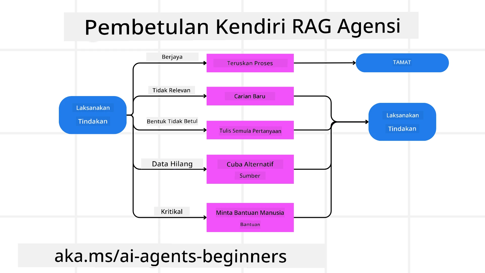

<!--
CO_OP_TRANSLATOR_METADATA:
{
  "original_hash": "0ebf6b2290db55dbf2d10cc49655523b",
  "translation_date": "2025-09-30T07:31:19+00:00",
  "source_file": "05-agentic-rag/README.md",
  "language_code": "ms"
}
-->

> _(Klik pada imej di atas untuk menonton video pelajaran ini)_

# Agentic RAG

Pelajaran ini memberikan gambaran menyeluruh tentang Agentic Retrieval-Augmented Generation (Agentic RAG), satu paradigma AI yang sedang berkembang di mana model bahasa besar (LLM) merancang langkah seterusnya secara autonomi sambil mendapatkan maklumat daripada sumber luaran. Tidak seperti corak statik "retrieval-then-read", Agentic RAG melibatkan panggilan berulang kepada LLM, diselang-selikan dengan panggilan alat atau fungsi serta output yang berstruktur. Sistem ini menilai hasil, memperbaiki pertanyaan, menggunakan alat tambahan jika diperlukan, dan meneruskan kitaran ini sehingga penyelesaian yang memuaskan dicapai.

## Pengenalan

Pelajaran ini akan merangkumi:

- **Memahami Agentic RAG:** Ketahui tentang paradigma AI yang sedang berkembang di mana model bahasa besar (LLM) merancang langkah seterusnya secara autonomi sambil mendapatkan maklumat daripada sumber data luaran.
- **Gaya Iteratif Maker-Checker:** Fahami kitaran panggilan berulang kepada LLM, diselang-selikan dengan panggilan alat atau fungsi serta output yang berstruktur, direka untuk meningkatkan ketepatan dan menangani pertanyaan yang tidak sempurna.
- **Terokai Aplikasi Praktikal:** Kenal pasti senario di mana Agentic RAG cemerlang, seperti persekitaran yang mengutamakan ketepatan, interaksi pangkalan data yang kompleks, dan aliran kerja yang panjang.

## Matlamat Pembelajaran

Selepas menyelesaikan pelajaran ini, anda akan tahu bagaimana untuk/memahami:

- **Memahami Agentic RAG:** Ketahui tentang paradigma AI yang sedang berkembang di mana model bahasa besar (LLM) merancang langkah seterusnya secara autonomi sambil mendapatkan maklumat daripada sumber data luaran.
- **Gaya Iteratif Maker-Checker:** Fahami konsep kitaran panggilan berulang kepada LLM, diselang-selikan dengan panggilan alat atau fungsi serta output yang berstruktur, direka untuk meningkatkan ketepatan dan menangani pertanyaan yang tidak sempurna.
- **Menguasai Proses Pemikiran:** Fahami keupayaan sistem untuk menguasai proses pemikirannya, membuat keputusan tentang cara mendekati masalah tanpa bergantung pada laluan yang telah ditentukan.
- **Aliran Kerja:** Fahami bagaimana model agentic secara bebas memutuskan untuk mendapatkan laporan trend pasaran, mengenal pasti data pesaing, menghubungkan metrik jualan dalaman, mensintesis penemuan, dan menilai strategi.
- **Kitaran Iteratif, Integrasi Alat, dan Memori:** Ketahui tentang kebergantungan sistem pada corak interaksi berulang, mengekalkan keadaan dan memori merentasi langkah untuk mengelakkan kitaran berulang dan membuat keputusan yang lebih bijak.
- **Menangani Mod Kegagalan dan Pembetulan Diri:** Terokai mekanisme pembetulan diri yang kukuh dalam sistem, termasuk iterasi dan pertanyaan semula, menggunakan alat diagnostik, dan bergantung pada pengawasan manusia.
- **Batasan Agensi:** Fahami batasan Agentic RAG, dengan fokus pada autonomi khusus domain, kebergantungan infrastruktur, dan penghormatan terhadap kawalan keselamatan.
- **Kes Penggunaan Praktikal dan Nilai:** Kenal pasti senario di mana Agentic RAG cemerlang, seperti persekitaran yang mengutamakan ketepatan, interaksi pangkalan data yang kompleks, dan aliran kerja yang panjang.
- **Tadbir Urus, Ketelusan, dan Kepercayaan:** Ketahui tentang kepentingan tadbir urus dan ketelusan, termasuk pemikiran yang boleh dijelaskan, kawalan bias, dan pengawasan manusia.

## Apa itu Agentic RAG?

Agentic Retrieval-Augmented Generation (Agentic RAG) adalah satu paradigma AI yang sedang berkembang di mana model bahasa besar (LLM) merancang langkah seterusnya secara autonomi sambil mendapatkan maklumat daripada sumber luaran. Tidak seperti corak statik "retrieval-then-read", Agentic RAG melibatkan panggilan berulang kepada LLM, diselang-selikan dengan panggilan alat atau fungsi serta output yang berstruktur. Sistem ini menilai hasil, memperbaiki pertanyaan, menggunakan alat tambahan jika diperlukan, dan meneruskan kitaran ini sehingga penyelesaian yang memuaskan dicapai. Gaya iteratif "maker-checker" ini meningkatkan ketepatan, menangani pertanyaan yang tidak sempurna, dan memastikan hasil yang berkualiti tinggi.

Sistem ini secara aktif menguasai proses pemikirannya, menulis semula pertanyaan yang gagal, memilih kaedah pengambilan yang berbeza, dan mengintegrasikan pelbagai alat—seperti carian vektor dalam Azure AI Search, pangkalan data SQL, atau API khusus—sebelum menyelesaikan jawapannya. Kualiti yang membezakan sistem agentic adalah keupayaannya untuk menguasai proses pemikirannya. Pelaksanaan RAG tradisional bergantung pada laluan yang telah ditentukan, tetapi sistem agentic secara autonomi menentukan urutan langkah berdasarkan kualiti maklumat yang ditemui.

## Mendefinisikan Agentic Retrieval-Augmented Generation (Agentic RAG)

Agentic Retrieval-Augmented Generation (Agentic RAG) adalah satu paradigma yang sedang berkembang dalam pembangunan AI di mana LLM bukan sahaja mendapatkan maklumat daripada sumber data luaran tetapi juga merancang langkah seterusnya secara autonomi. Tidak seperti corak statik "retrieval-then-read" atau urutan prompt yang ditulis dengan teliti, Agentic RAG melibatkan kitaran panggilan berulang kepada LLM, diselang-selikan dengan panggilan alat atau fungsi serta output yang berstruktur. Pada setiap langkah, sistem menilai hasil yang diperoleh, memutuskan sama ada untuk memperbaiki pertanyaan, menggunakan alat tambahan jika diperlukan, dan meneruskan kitaran ini sehingga mencapai penyelesaian yang memuaskan.

Gaya operasi iteratif "maker-checker" ini direka untuk meningkatkan ketepatan, menangani pertanyaan yang tidak sempurna kepada pangkalan data berstruktur (contohnya NL2SQL), dan memastikan hasil yang seimbang dan berkualiti tinggi. Daripada bergantung semata-mata pada rantai prompt yang direka dengan teliti, sistem ini secara aktif menguasai proses pemikirannya. Ia boleh menulis semula pertanyaan yang gagal, memilih kaedah pengambilan yang berbeza, dan mengintegrasikan pelbagai alat—seperti carian vektor dalam Azure AI Search, pangkalan data SQL, atau API khusus—sebelum menyelesaikan jawapannya. Ini menghapuskan keperluan untuk rangka kerja orkestrasi yang terlalu kompleks. Sebaliknya, kitaran yang agak mudah "panggilan LLM → penggunaan alat → panggilan LLM → …" boleh menghasilkan output yang canggih dan berasas.

## Menguasai Proses Pemikiran

Kualiti yang membezakan sistem "agentic" adalah keupayaannya untuk menguasai proses pemikirannya. Pelaksanaan RAG tradisional sering bergantung pada manusia untuk menentukan laluan bagi model: rantai pemikiran yang menggariskan apa yang perlu diambil dan bila.
Tetapi apabila sistem benar-benar agentic, ia secara dalaman memutuskan cara mendekati masalah. Ia bukan sekadar melaksanakan skrip; ia secara autonomi menentukan urutan langkah berdasarkan kualiti maklumat yang ditemui.
Sebagai contoh, jika diminta untuk mencipta strategi pelancaran produk, ia tidak bergantung semata-mata pada prompt yang menjelaskan keseluruhan aliran kerja penyelidikan dan pengambilan keputusan. Sebaliknya, model agentic secara bebas memutuskan untuk:

1. Mendapatkan laporan trend pasaran semasa menggunakan Bing Web Grounding.
2. Mengenal pasti data pesaing yang relevan menggunakan Azure AI Search.
3. Menghubungkan metrik jualan dalaman sejarah menggunakan Azure SQL Database.
4. Mensintesis penemuan kepada strategi yang kohesif yang diorkestrasi melalui Azure OpenAI Service.
5. Menilai strategi untuk jurang atau ketidakkonsistenan, mendorong satu lagi pusingan pengambilan jika perlu.
Semua langkah ini—memperbaiki pertanyaan, memilih sumber, mengulangi sehingga "puas" dengan jawapan—diputuskan oleh model, bukan ditulis terlebih dahulu oleh manusia.

## Kitaran Iteratif, Integrasi Alat, dan Memori

Sistem agentic bergantung pada corak interaksi berulang:

- **Panggilan Awal:** Matlamat pengguna (iaitu prompt pengguna) disampaikan kepada LLM.
- **Penggunaan Alat:** Jika model mengenal pasti maklumat yang hilang atau arahan yang tidak jelas, ia memilih alat atau kaedah pengambilan—seperti pertanyaan pangkalan data vektor (contohnya Azure AI Search Hybrid search ke atas data peribadi) atau panggilan SQL berstruktur—untuk mendapatkan lebih banyak konteks.
- **Penilaian & Penambahbaikan:** Selepas menyemak data yang dikembalikan, model memutuskan sama ada maklumat mencukupi. Jika tidak, ia memperbaiki pertanyaan, mencuba alat yang berbeza, atau menyesuaikan pendekatannya.
- **Ulang Sehingga Puas:** Kitaran ini berterusan sehingga model menentukan bahawa ia mempunyai kejelasan dan bukti yang mencukupi untuk memberikan respons akhir yang beralasan dengan baik.
- **Memori & Keadaan:** Oleh kerana sistem mengekalkan keadaan dan memori merentasi langkah, ia boleh mengingati percubaan sebelumnya dan hasilnya, mengelakkan kitaran berulang dan membuat keputusan yang lebih bijak semasa ia meneruskan.

Dari masa ke masa, ini mencipta rasa pemahaman yang berkembang, membolehkan model menavigasi tugas yang kompleks dan berbilang langkah tanpa memerlukan manusia untuk campur tangan atau membentuk semula prompt secara berterusan.

## Menangani Mod Kegagalan dan Pembetulan Diri

Autonomi Agentic RAG juga melibatkan mekanisme pembetulan diri yang kukuh. Apabila sistem menghadapi jalan buntu—seperti mendapatkan dokumen yang tidak relevan atau menghadapi pertanyaan yang tidak sempurna—ia boleh:

- **Iterasi dan Pertanyaan Semula:** Daripada memberikan respons yang bernilai rendah, model mencuba strategi carian baru, menulis semula pertanyaan pangkalan data, atau melihat set data alternatif.
- **Menggunakan Alat Diagnostik:** Sistem mungkin menggunakan fungsi tambahan yang direka untuk membantunya menyahpepijat langkah pemikiran atau mengesahkan ketepatan data yang diperoleh. Alat seperti Azure AI Tracing akan menjadi penting untuk membolehkan pemerhatian dan pemantauan yang kukuh.
- **Bergantung pada Pengawasan Manusia:** Untuk senario yang berisiko tinggi atau berulang kali gagal, model mungkin menandakan ketidakpastian dan meminta panduan manusia. Setelah manusia memberikan maklum balas pembetulan, model boleh menggabungkan pelajaran itu untuk masa depan.

Pendekatan iteratif dan dinamik ini membolehkan model untuk terus memperbaiki, memastikan bahawa ia bukan sekadar sistem satu kali tetapi satu yang belajar daripada kesilapan semasa sesi tertentu.

## Batasan Agensi

Walaupun autonominya dalam tugas, Agentic RAG tidak sama dengan Kecerdasan Umum Buatan. Keupayaan "agentic"nya terhad kepada alat, sumber data, dan polisi yang disediakan oleh pembangun manusia. Ia tidak boleh mencipta alatnya sendiri atau melangkaui batas domain yang telah ditetapkan. Sebaliknya, ia cemerlang dalam mengorkestrasi sumber yang ada secara dinamik.
Perbezaan utama daripada bentuk AI yang lebih maju termasuk:

1. **Autonomi Khusus Domain:** Sistem Agentic RAG memberi tumpuan kepada mencapai matlamat yang ditentukan pengguna dalam domain yang diketahui, menggunakan strategi seperti penulisan semula pertanyaan atau pemilihan alat untuk meningkatkan hasil.
2. **Bergantung pada Infrastruktur:** Keupayaan sistem bergantung pada alat dan data yang diintegrasikan oleh pembangun. Ia tidak boleh melampaui batas ini tanpa campur tangan manusia.
3. **Penghormatan terhadap Kawalan Keselamatan:** Garis panduan etika, peraturan pematuhan, dan polisi perniagaan tetap sangat penting. Kebebasan agen sentiasa terhad oleh langkah keselamatan dan mekanisme pengawasan (semoga?).

## Kes Penggunaan Praktikal dan Nilai

Agentic RAG cemerlang dalam senario yang memerlukan penambahbaikan berulang dan ketepatan:

1. **Persekitaran yang Mengutamakan Ketepatan:** Dalam pemeriksaan pematuhan, analisis peraturan, atau penyelidikan undang-undang, model agentic boleh berulang kali mengesahkan fakta, merujuk kepada pelbagai sumber, dan menulis semula pertanyaan sehingga menghasilkan jawapan yang disemak dengan teliti.
2. **Interaksi Pangkalan Data yang Kompleks:** Apabila berurusan dengan data berstruktur di mana pertanyaan sering gagal atau memerlukan penyesuaian, sistem boleh memperbaiki pertanyaannya secara autonomi menggunakan Azure SQL atau Microsoft Fabric OneLake, memastikan pengambilan akhir selaras dengan niat pengguna.
3. **Aliran Kerja yang Panjang:** Sesi yang lebih panjang mungkin berkembang apabila maklumat baru muncul. Agentic RAG boleh terus menggabungkan data baru, mengubah strategi apabila ia belajar lebih banyak tentang ruang masalah.

## Tadbir Urus, Ketelusan, dan Kepercayaan

Apabila sistem ini menjadi lebih autonomi dalam pemikirannya, tadbir urus dan ketelusan adalah penting:

- **Pemikiran yang Boleh Dijelaskan:** Model boleh memberikan jejak audit pertanyaan yang dibuat, sumber yang dirujuk, dan langkah pemikiran yang diambil untuk mencapai kesimpulannya. Alat seperti Azure AI Content Safety dan Azure AI Tracing / GenAIOps boleh membantu mengekalkan ketelusan dan mengurangkan risiko.
- **Kawalan Bias dan Pengambilan yang Seimbang:** Pembangun boleh menyesuaikan strategi pengambilan untuk memastikan sumber data yang seimbang dan representatif dipertimbangkan, dan secara berkala mengaudit output untuk mengesan bias atau corak yang tidak seimbang menggunakan model khusus untuk organisasi sains data lanjutan menggunakan Azure Machine Learning.
- **Pengawasan Manusia dan Pematuhan:** Untuk tugas yang sensitif, semakan manusia tetap penting. Agentic RAG tidak menggantikan pertimbangan manusia dalam keputusan yang berisiko tinggi—ia menambahnya dengan memberikan pilihan yang lebih disemak dengan teliti.

Mempunyai alat yang menyediakan rekod tindakan yang jelas adalah penting. Tanpa alat ini, menyahpepijat proses berbilang langkah boleh menjadi sangat sukar. Lihat contoh berikut daripada Literal AI (syarikat di belakang Chainlit) untuk Agent run:

## Kesimpulan

Agentic RAG mewakili evolusi semula jadi dalam cara sistem AI menangani tugas yang kompleks dan intensif data. Dengan mengadaptasi corak interaksi berulang, memilih alat secara autonomi, dan memperbaiki pertanyaan sehingga mencapai hasil berkualiti tinggi, sistem ini bergerak melangkaui pengikut prompt statik kepada pembuat keputusan yang lebih adaptif dan sedar konteks. Walaupun masih terhad oleh infrastruktur yang ditentukan manusia dan garis panduan etika, keupayaan agentic ini membolehkan interaksi AI yang lebih kaya, lebih dinamik, dan akhirnya lebih berguna untuk kedua-dua perusahaan dan pengguna akhir.

### Ada Lagi Soalan tentang Agentic RAG?

Sertai [Azure AI Foundry Discord](https://aka.ms/ai-agents/discord) untuk berhubung dengan pelajar lain, menghadiri waktu pejabat, dan mendapatkan jawapan kepada soalan AI Agents anda.

## Sumber Tambahan

- <a href="https://learn.microsoft.com/training/modules/use-own-data-azure-openai" target="_blank">Laksanakan Retrieval Augmented Generation (RAG) dengan Azure OpenAI Service: Ketahui cara menggunakan data anda sendiri dengan Azure OpenAI Service. Modul Microsoft Learn ini menyediakan panduan menyeluruh tentang pelaksanaan RAG</a>
- <a href="https://learn.microsoft.com/azure/ai-studio/concepts/evaluation-approach-gen-ai" target="_blank">Penilaian aplikasi AI generatif dengan Azure AI Foundry: Artikel ini merangkumi penilaian dan perbandingan model pada set data yang tersedia secara umum, termasuk aplikasi AI Agentic dan seni bina RAG</a>
- <a href="https://weaviate.io/blog/what-is-agentic-rag" target="_blank">Apa itu Agentic RAG | Weaviate</a>
- <a href="https://ragaboutit.com/agentic-rag-a-complete-guide-to-agent-based-retrieval-augmented-generation/" target="_blank">Agentic RAG: Panduan Lengkap untuk Penjanaan Augmentasi Pengambilan Berasaskan Ejen – Berita dari generasi RAG</a>
- <a href="https://huggingface.co/learn/cookbook/agent_rag" target="_blank">Agentic RAG: tingkatkan RAG anda dengan reformulasi pertanyaan dan pertanyaan kendiri! Buku Panduan AI Sumber Terbuka Hugging Face</a>
- <a href="https://youtu.be/aQ4yQXeB1Ss?si=2HUqBzHoeB5tR04U" target="_blank">Menambah Lapisan Agentic kepada RAG</a>
- <a href="https://www.youtube.com/watch?v=zeAyuLc_f3Q&t=244s" target="_blank">Masa Depan Pembantu Pengetahuan: Jerry Liu</a>
- <a href="https://www.youtube.com/watch?v=AOSjiXP1jmQ" target="_blank">Cara Membina Sistem Agentic RAG</a>
- <a href="https://ignite.microsoft.com/sessions/BRK102?source=sessions" target="_blank">Menggunakan Perkhidmatan Ejen Azure AI Foundry untuk meningkatkan skala ejen AI anda</a>

### Kertas Akademik

- <a href="https://arxiv.org/abs/2303.17651" target="_blank">2303.17651 Self-Refine: Penambahbaikan Iteratif dengan Maklum Balas Kendiri</a>
- <a href="https://arxiv.org/abs/2303.11366" target="_blank">2303.11366 Reflexion: Ejen Bahasa dengan Pembelajaran Pengukuhan Verbal</a>
- <a href="https://arxiv.org/abs/2305.11738" target="_blank">2305.11738 CRITIC: Model Bahasa Besar Boleh Membetulkan Diri dengan Kritikan Interaktif Alat</a>
- <a href="https://arxiv.org/abs/2501.09136" target="_blank">2501.09136 Agentic Retrieval-Augmented Generation: Kajian tentang Agentic RAG</a>

## Pelajaran Sebelumnya

[Pola Reka Bentuk Penggunaan Alat](../04-tool-use/README.md)

## Pelajaran Seterusnya

[Membina Ejen AI yang Boleh Dipercayai](../06-building-trustworthy-agents/README.md)

---

**Penafian**:  
Dokumen ini telah diterjemahkan menggunakan perkhidmatan terjemahan AI [Co-op Translator](https://github.com/Azure/co-op-translator). Walaupun kami berusaha untuk memastikan ketepatan, sila ambil perhatian bahawa terjemahan automatik mungkin mengandungi kesilapan atau ketidaktepatan. Dokumen asal dalam bahasa asalnya harus dianggap sebagai sumber yang berwibawa. Untuk maklumat yang kritikal, terjemahan manusia profesional adalah disyorkan. Kami tidak bertanggungjawab atas sebarang salah faham atau salah tafsir yang timbul daripada penggunaan terjemahan ini.