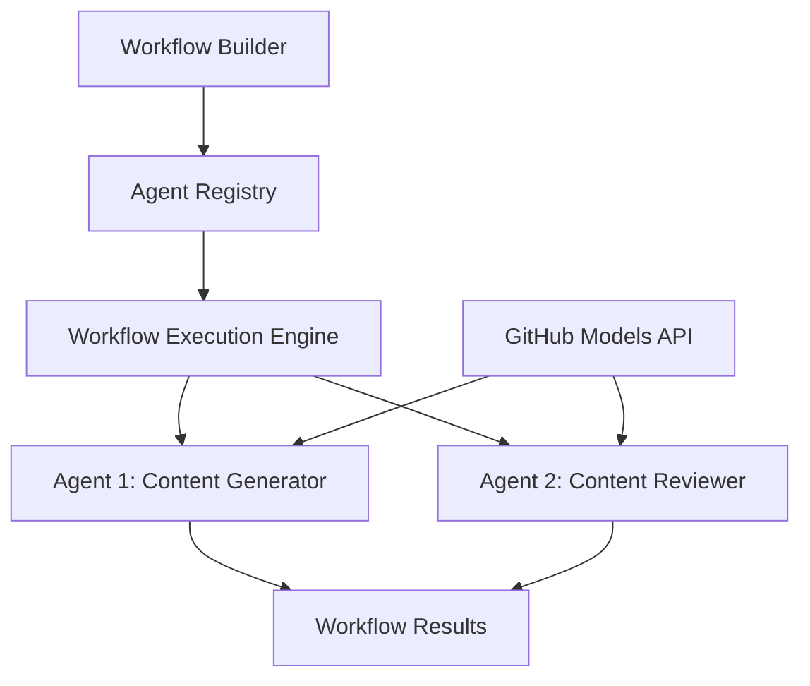

<!--
CO_OP_TRANSLATOR_METADATA:
{
  "original_hash": "034158688d0a45aae06dcbb21b0da5ae",
  "translation_date": "2025-11-11T12:54:54+00:00",
  "source_file": "08-multi-agent/code_samples/workflows-agent-framework/dotNET/01.dotnet-agent-framework-workflow-ghmodel-basic.md",
  "language_code": "ms"
}
-->
# 🔄 Aliran Kerja Asas Ejen dengan Model GitHub (.NET)

## 📋 Tutorial Orkestrasi Aliran Kerja

Notebook ini menunjukkan cara membina **aliran kerja ejen** yang canggih menggunakan Microsoft Agent Framework untuk .NET dan Model GitHub. Anda akan belajar mencipta proses perniagaan berbilang langkah di mana ejen AI bekerjasama untuk menyelesaikan tugas kompleks melalui corak orkestrasi yang terstruktur.

## 🎯 Objektif Pembelajaran

### 🏗️ **Asas Seni Bina Aliran Kerja**
- **Pembina Aliran Kerja**: Reka bentuk dan orkestrasi proses AI berbilang langkah yang kompleks
- **Penyelarasan Ejen**: Menyelaraskan beberapa ejen khusus dalam aliran kerja
- **Integrasi Model GitHub**: Memanfaatkan perkhidmatan inferensi model AI GitHub dalam aliran kerja
- **Reka Bentuk Aliran Kerja Visual**: Mencipta dan memvisualisasikan struktur aliran kerja untuk pemahaman yang lebih baik

### 🔄 **Corak Orkestrasi Proses**
- **Pemprosesan Berurutan**: Rantai tugas ejen berbilang dalam susunan logik
- **Pengurusan Keadaan**: Mengekalkan konteks dan aliran data di antara peringkat aliran kerja
- **Pengendalian Ralat**: Melaksanakan pemulihan ralat yang kukuh dan ketahanan aliran kerja
- **Pengoptimuman Prestasi**: Reka bentuk aliran kerja yang cekap untuk operasi skala perusahaan

### 🏢 **Aplikasi Aliran Kerja Perusahaan**
- **Automasi Proses Perniagaan**: Automasi aliran kerja organisasi yang kompleks
- **Saluran Pengeluaran Kandungan**: Aliran kerja editorial dengan peringkat semakan dan kelulusan
- **Automasi Perkhidmatan Pelanggan**: Penyelesaian pertanyaan pelanggan berbilang langkah
- **Aliran Kerja Pemprosesan Data**: Aliran kerja ETL dengan transformasi berkuasa AI

## ⚙️ Prasyarat & Persediaan

### 📦 **Pakej NuGet Diperlukan**

Demonstrasi aliran kerja ini menggunakan beberapa pakej .NET utama:

```xml
<!-- Core AI Framework -->
<PackageReference Include="Microsoft.Extensions.AI" Version="9.9.0" />

<!-- Agent Framework (Local Development) -->
<!-- Microsoft.Agents.AI.dll - Core agent abstractions -->
<!-- Microsoft.Agents.AI.OpenAI.dll - OpenAI/GitHub Models integration -->

<!-- Configuration and Environment -->
<PackageReference Include="DotNetEnv" Version="3.1.1" />
```

### 🔑 **Konfigurasi Model GitHub**

**Persediaan Persekitaran (fail .env):**
```env
GITHUB_TOKEN=your_github_personal_access_token
GITHUB_ENDPOINT=https://models.inference.ai.azure.com
GITHUB_MODEL_ID=gpt-4o-mini
```

**Akses Model GitHub:**
1. Daftar untuk Model GitHub (kini dalam pratonton)
2. Hasilkan token akses peribadi dengan kebenaran akses model
3. Konfigurasikan pembolehubah persekitaran seperti yang ditunjukkan di atas

### 🏗️ **Gambaran Keseluruhan Seni Bina Aliran Kerja**



**Komponen Utama:**
- **WorkflowBuilder**: Enjin orkestrasi utama untuk mereka bentuk aliran kerja
- **AIAgent**: Ejen khusus individu dengan keupayaan tertentu
- **GitHub Models Client**: Integrasi perkhidmatan inferensi model AI
- **Execution Context**: Menguruskan keadaan dan aliran data antara peringkat aliran kerja

## 🎨 **Corak Reka Bentuk Aliran Kerja Perusahaan**

### 📝 **Aliran Kerja Pengeluaran Kandungan**
```
User Request → Content Generation → Quality Review → Final Output
```

### 🔍 **Saluran Pemprosesan Dokumen**
```
Document Input → Analysis → Extraction → Validation → Structured Output
```

### 💼 **Aliran Kerja Perisikan Perniagaan**
```
Data Collection → Processing → Analysis → Report Generation → Distribution
```

### 🤝 **Automasi Perkhidmatan Pelanggan**
```
Customer Inquiry → Classification → Processing → Response Generation → Follow-up
```

## 🏢 **Manfaat Perusahaan**

### 🎯 **Kebolehpercayaan & Skalabiliti**
- **Pelaksanaan Deterministik**: Hasil aliran kerja yang konsisten dan boleh diulang
- **Pemulihan Ralat**: Pengendalian kegagalan yang baik di mana-mana peringkat aliran kerja
- **Pemantauan Prestasi**: Jejak metrik pelaksanaan dan peluang pengoptimuman
- **Pengurusan Sumber**: Peruntukan dan penggunaan sumber model AI yang cekap

### 🔒 **Keselamatan & Pematuhan**
- **Pengesahan Selamat**: Pengesahan berasaskan token GitHub untuk akses API
- **Jejak Audit**: Log lengkap pelaksanaan aliran kerja dan titik keputusan
- **Kawalan Akses**: Kebenaran granular untuk pelaksanaan dan pemantauan aliran kerja
- **Privasi Data**: Pengendalian maklumat sensitif dengan selamat sepanjang aliran kerja

### 📊 **Keterlihatan & Pengurusan**
- **Reka Bentuk Aliran Kerja Visual**: Representasi jelas aliran proses dan kebergantungan
- **Pemantauan Pelaksanaan**: Penjejakan masa nyata kemajuan dan prestasi aliran kerja
- **Pelaporan Ralat**: Analisis ralat terperinci dan keupayaan penyahpepijatan
- **Analitik Prestasi**: Metrik untuk pengoptimuman dan perancangan kapasiti

Mari bina aliran kerja AI bersedia perusahaan pertama anda! 🚀

## 💻 Menjalankan Kod

Pelaksanaan lengkap tersedia dalam `01.dotnet-agent-framework-workflow-ghmodel-basic.cs`. Fail ini menunjukkan:

1. **Konfigurasi Persekitaran** - Memuatkan kelayakan Model GitHub dari fail `.env`
2. **Persediaan Klien OpenAI** - Mengkonfigurasi klien untuk menggunakan titik akhir Model GitHub
3. **Penciptaan Ejen** - Mendefinisikan ejen khusus (Front Desk dan Concierge)
4. **Pembina Aliran Kerja** - Mencipta aliran kerja berbilang ejen dengan pemprosesan berurutan
5. **Pelaksanaan Aliran Kerja** - Menjalankan aliran kerja dengan hasil penstriman

### 🚀 Menjalankan Contoh

```bash
# Make the script executable (Unix/Linux/macOS)
chmod +x 01.dotnet-agent-framework-workflow-ghmodel-basic.cs

# Run the workflow
./01.dotnet-agent-framework-workflow-ghmodel-basic.cs
```

Atau pada Windows:
```powershell
dotnet run 01.dotnet-agent-framework-workflow-ghmodel-basic.cs
```

### 📝 Output Dijangka

Aliran kerja akan:
1. Menerima permintaan destinasi perjalanan anda ("Saya ingin pergi ke Paris")
2. Ejen Front Desk memberikan cadangan awal
3. Ejen Concierge menyemak dan memperhalusi cadangan
4. Output akhir memaparkan aliran perbualan lengkap

### 🔧 Penyesuaian

Anda boleh menyesuaikan aliran kerja dengan:
- Mengubah arahan ejen untuk mengubah tingkah laku mereka
- Menambah lebih banyak ejen untuk mencipta aliran kerja berbilang langkah yang kompleks
- Mengubah mesej pengguna untuk menguji senario yang berbeza
- Menyesuaikan tepi aliran kerja untuk mencipta corak pelaksanaan yang berbeza

---

<!-- CO-OP TRANSLATOR DISCLAIMER START -->
**Penafian**:  
Dokumen ini telah diterjemahkan menggunakan perkhidmatan terjemahan AI [Co-op Translator](https://github.com/Azure/co-op-translator). Walaupun kami berusaha untuk ketepatan, sila ambil perhatian bahawa terjemahan automatik mungkin mengandungi kesilapan atau ketidaktepatan. Dokumen asal dalam bahasa asalnya harus dianggap sebagai sumber yang berwibawa. Untuk maklumat penting, terjemahan manusia profesional adalah disyorkan. Kami tidak bertanggungjawab atas sebarang salah faham atau salah tafsir yang timbul daripada penggunaan terjemahan ini.
<!-- CO-OP TRANSLATOR DISCLAIMER END -->