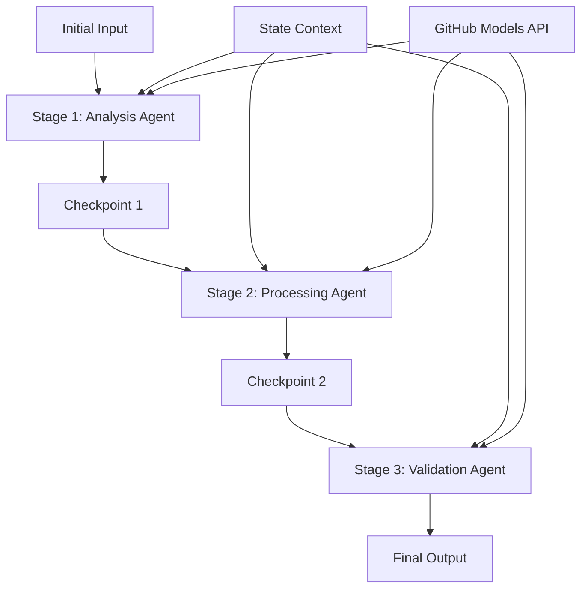

<!--
CO_OP_TRANSLATOR_METADATA:
{
  "original_hash": "1be9c8dcbd79a02d33d2c138684c1394",
  "translation_date": "2025-11-11T13:58:59+00:00",
  "source_file": "08-multi-agent/code_samples/workflows-agent-framework/dotNET/02.dotnet-agent-framework-workflow-ghmodel-sequential.md",
  "language_code": "ms"
}
-->
# ⏩ Aliran Kerja Ejen Berurutan dengan Model GitHub (.NET)

## 📋 Tutorial Pemprosesan Berurutan Lanjutan

Notebook ini menunjukkan **pola aliran kerja berurutan** menggunakan Microsoft Agent Framework untuk .NET dan Model GitHub. Anda akan belajar cara membina saluran pemprosesan langkah demi langkah yang canggih di mana ejen melaksanakan tugas mengikut urutan tertentu, dengan setiap peringkat membina hasil daripada peringkat sebelumnya.

## 🎯 Objektif Pembelajaran

### 🔄 **Seni Bina Pemprosesan Berurutan**
- **Reka Bentuk Aliran Kerja Linear**: Cipta saluran pemprosesan langkah demi langkah dengan kebergantungan yang jelas
- **Pengurusan Keadaan**: Kekalkan konteks dan aliran data di seluruh peringkat aliran kerja berurutan
- **Integrasi Model GitHub**: Manfaatkan model AI GitHub dalam aliran kerja .NET berbilang peringkat
- **Pola Saluran Perusahaan**: Bina sistem pemprosesan berurutan yang sedia untuk pengeluaran

### 🏗️ **Pola Berurutan Lanjutan**
- **Pemprosesan Peringkat-Gate**: Laksanakan titik pemeriksaan pengesahan antara peringkat aliran kerja
- **Pemeliharaan Konteks**: Kekalkan keadaan dan pengetahuan terkumpul di semua peringkat
- **Penyebaran Ralat**: Tangani kegagalan dengan baik dalam rantai pemprosesan berurutan
- **Pengoptimuman Prestasi**: Pelaksanaan berurutan yang cekap dengan kos minimum

### 🏢 **Aplikasi Berurutan Perusahaan**
- **Saluran Pemprosesan Dokumen**: Analisis dokumen berbilang peringkat, transformasi, dan pengesahan
- **Aliran Kerja Jaminan Kualiti**: Semakan berurutan, pengesahan, dan proses kelulusan
- **Saluran Pengeluaran Kandungan**: Penyelidikan → Penulisan → Penyuntingan → Semakan → Penerbitan
- **Automasi Proses Perniagaan**: Aliran kerja perniagaan berbilang langkah dengan kebergantungan peringkat yang jelas

## ⚙️ Prasyarat & Persediaan

### 📦 **Pakej NuGet Diperlukan**

Pakej penting untuk aliran kerja .NET berurutan:

```xml
<!-- Core AI Framework -->
<PackageReference Include="Microsoft.Extensions.AI" Version="9.9.0" />

<!-- Client Model Abstractions -->
<PackageReference Include="System.ClientModel" Version="1.6.1.0" />

<!-- Azure Identity and Async LINQ Support -->
<PackageReference Include="Azure.Identity" Version="1.15.0" />
<PackageReference Include="System.Linq.Async" Version="6.0.3" />

<!-- Local Agent Framework References -->
<!-- Microsoft.Agents.AI.dll - Core agent abstractions -->
<!-- Microsoft.Agents.AI.OpenAI.dll - GitHub Models integration -->
```

### 🔑 **Konfigurasi Model GitHub**

**Persediaan Persekitaran (fail .env):**
```env
GITHUB_TOKEN=your_github_personal_access_token
GITHUB_ENDPOINT=https://models.inference.ai.azure.com
GITHUB_MODEL_ID=gpt-4o-mini
```

**Pengurusan Konfigurasi:**
```csharp
// Load environment variables securely
Env.Load("../../../.env");
var githubToken = Environment.GetEnvironmentVariable("GITHUB_TOKEN");
var githubEndpoint = Environment.GetEnvironmentVariable("GITHUB_ENDPOINT");
var modelId = Environment.GetEnvironmentVariable("GITHUB_MODEL_ID");
```

### 🏗️ **Seni Bina Aliran Kerja Berurutan**



**Komponen Utama:**
- **Ejen Berurutan**: Ejen khusus untuk setiap peringkat pemprosesan
- **Konteks Keadaan**: Mengekalkan data terkumpul dan keputusan di seluruh peringkat
- **Titik Pemeriksaan**: Titik pengesahan antara peringkat untuk memastikan kualiti dan konsistensi
- **Klien Model GitHub**: Akses model AI yang konsisten di semua peringkat aliran kerja

## 🎨 **Pola Reka Bentuk Aliran Kerja Berurutan**

### 📝 **Saluran Pemprosesan Dokumen**
```
Raw Document → Content Extraction → Analysis → Validation → Structured Output
```

### 🎯 **Aliran Kerja Penghasilan Kandungan**
```
Brief/Requirements → Research → Content Creation → Review → Final Polish
```

### 🔍 **Saluran Jaminan Kualiti**
```
Initial Review → Technical Validation → Compliance Check → Final Approval
```

### 💼 **Aliran Kerja Kecerdasan Perniagaan**
```
Data Collection → Processing → Analysis → Report Generation → Distribution
```

## 🏢 **Manfaat Berurutan Perusahaan**

### 🎯 **Kebolehpercayaan & Kualiti**
- **Pemprosesan Deterministik**: Hasil yang konsisten dan boleh diulang melalui peringkat yang terstruktur
- **Gerbang Kualiti**: Titik pengesahan memastikan kualiti di setiap peringkat
- **Pengasingan Ralat**: Masalah dalam satu peringkat tidak merebak ke peringkat seterusnya
- **Jejak Audit**: Penjejakan lengkap keputusan dan transformasi di setiap peringkat

### 📈 **Kebolehskalaan & Prestasi**
- **Reka Bentuk Modular**: Setiap peringkat boleh dioptimumkan secara bebas
- **Pengurusan Sumber**: Peruntukan sumber model AI yang cekap di seluruh peringkat
- **Pengoptimuman Keadaan**: Pemindahan keadaan minimum antara peringkat untuk prestasi optimum
- **Kumpulan Peringkat Selari**: Pelbagai aliran kerja berurutan boleh dijalankan secara selari

### 🔒 **Keselamatan & Pematuhan**
- **Keselamatan Peringkat**: Polisi keselamatan yang berbeza untuk peringkat pemprosesan yang berbeza
- **Pengesahan Data**: Pastikan integriti data dan pematuhan di setiap titik pemeriksaan
- **Kawalan Akses**: Kebenaran granular untuk peringkat aliran kerja yang berbeza
- **Pematuhan Peraturan**: Memenuhi keperluan peraturan melalui pemprosesan yang terstruktur

### 📊 **Pemantauan & Analitik**
- **Metrik Peringkat**: Pemantauan prestasi untuk setiap peringkat aliran kerja
- **Pengenalpastian Kesesakan**: Kenal pasti dan optimumkan peringkat yang perlahan
- **Metrik Kualiti**: Jejak kualiti dan kadar kejayaan di setiap peringkat
- **Pengoptimuman Proses**: Penambahbaikan berterusan berdasarkan analitik peringkat

Mari bina saluran pemprosesan AI berurutan yang kukuh! 🚀

## 💻 Menjalankan Kod

Pelaksanaan lengkap tersedia dalam `02.dotnet-agent-framework-workflow-ghmodel-sequential.cs`. Fail ini menunjukkan **aliran kerja analisis perabot tiga peringkat**:

1. **Peringkat 1 - Ejen Jualan**: Menganalisis imej perabot dan memberikan cadangan pembelian
2. **Peringkat 2 - Ejen Harga**: Memberikan pecahan harga terperinci dan pilihan bajet
3. **Peringkat 3 - Ejen Sebut Harga**: Menjana dokumen sebut harga profesional dalam format Markdown

### 🏗️ **Seni Bina Aliran Kerja**

```
Image Input → Sales Analysis → Price Estimation → Quote Generation → Final Output
```

Setiap ejen:
- Menerima output daripada peringkat sebelumnya sebagai konteks
- Membina analisis sebelumnya dengan kepakaran khusus
- Mengekalkan kesinambungan aliran kerja melalui pengurusan keadaan

### 🚀 Menjalankan Contoh

**Prasyarat:**
- Letakkan imej perabot di `../imgs/home.png` (atau kemas kini pembolehubah `imgPath`)
- Konfigurasikan fail `.env` anda dengan kelayakan Model GitHub

```bash
# Make the script executable (Unix/Linux/macOS)
chmod +x 02.dotnet-agent-framework-workflow-ghmodel-sequential.cs

# Run the sequential workflow
./02.dotnet-agent-framework-workflow-ghmodel-sequential.cs
```

Atau pada Windows:
```powershell
dotnet run 02.dotnet-agent-framework-workflow-ghmodel-sequential.cs
```

### 📝 Output Dijangka

Aliran kerja akan:
1. **Ejen Jualan**: Mengenal pasti item perabot daripada imej dan memberikan cadangan
2. **Ejen Harga**: Menambah analisis harga terperinci dengan peringkat bajet dan cadangan pembelian
3. **Ejen Sebut Harga**: Menjana dokumen sebut harga yang diformat dengan semua maklumat yang disintesis

Output akhir akan menjadi sebut harga perabot profesional yang komprehensif berdasarkan analisis imej.

### 🔧 Pilihan Penyesuaian

**Ubah Tingkah Laku Ejen:**
```csharp
// Adjust agent instructions to change their focus
const string SalesAgentInstructions = "Your custom instructions...";
```

**Ubah Aliran Berurutan:**
```csharp
// Add or reorder workflow stages
var workflow = new WorkflowBuilder(salesagent)
    .AddEdge(salesagent, priceagent)
    .AddEdge(priceagent, quoteagent)
    .AddEdge(quoteagent, newAgent)  // Add another stage
    .Build();
```

**Gunakan Input Berbeza:**
```csharp
// Process text instead of images
ChatMessage userMessage = new ChatMessage(ChatRole.User, [
    new TextContent("Analyze pricing for a modern living room set")
]);
```

### 🎯 Aplikasi Dunia Nyata

Pola berurutan ini sesuai untuk:
- **E-dagang**: Analisis produk → Penetapan harga → Penjanaan sebut harga
- **Hartanah**: Analisis hartanah → Penilaian → Penciptaan senarai
- **Insurans**: Analisis tuntutan → Penilaian → Penjanaan sebut harga
- **Penghasilan Kandungan**: Penyelidikan → Penulisan → Penyuntingan → Penerbitan

### 🔍 Memahami Aliran Keadaan

Setiap ejen dalam urutan menerima:
- **Input Asal**: Mesej pengguna awal (imej + teks)
- **Output Ejen Sebelumnya**: Semua respons ejen sebelumnya dalam sejarah perbualan
- **Konteks Terkumpul**: Keadaan lengkap yang dikekalkan sepanjang aliran kerja

Ini membolehkan pemprosesan berbilang peringkat yang canggih di mana setiap ejen membina konteks komprehensif daripada semua peringkat sebelumnya.

---

<!-- CO-OP TRANSLATOR DISCLAIMER START -->
**Penafian**:  
Dokumen ini telah diterjemahkan menggunakan perkhidmatan terjemahan AI [Co-op Translator](https://github.com/Azure/co-op-translator). Walaupun kami berusaha untuk ketepatan, sila ambil perhatian bahawa terjemahan automatik mungkin mengandungi kesilapan atau ketidaktepatan. Dokumen asal dalam bahasa asalnya harus dianggap sebagai sumber yang berwibawa. Untuk maklumat yang kritikal, terjemahan manusia profesional adalah disyorkan. Kami tidak bertanggungjawab atas sebarang salah faham atau salah tafsir yang timbul daripada penggunaan terjemahan ini.
<!-- CO-OP TRANSLATOR DISCLAIMER END -->