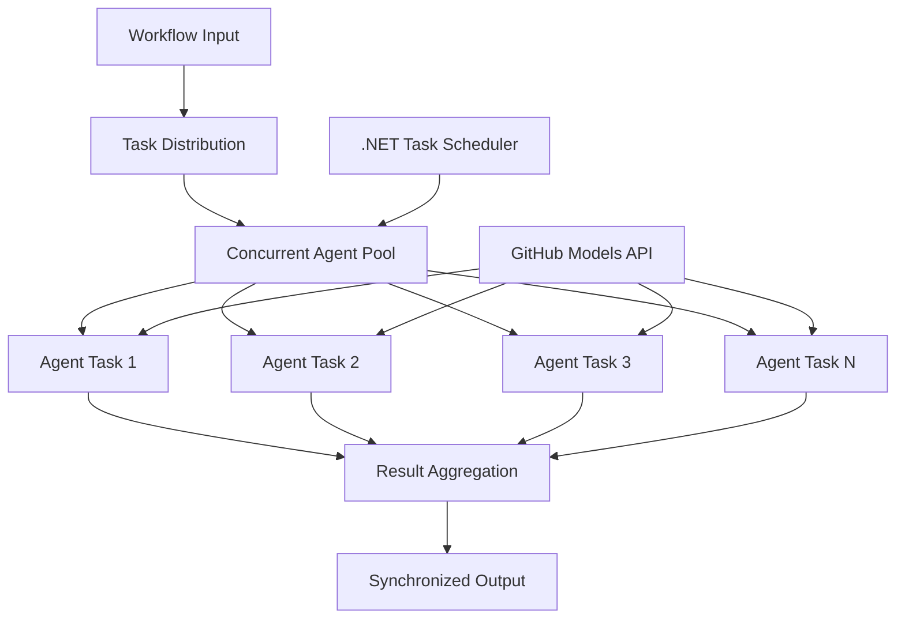

<!--
CO_OP_TRANSLATOR_METADATA:
{
  "original_hash": "b9c6e32c9b5f2fed20b6916984440d88",
  "translation_date": "2025-11-11T13:26:11+00:00",
  "source_file": "08-multi-agent/code_samples/workflows-agent-framework/dotNET/03.dotnet-agent-framework-workflow-ghmodel-concurrent.md",
  "language_code": "ms"
}
-->
# ⚡ Aliran Kerja Ejen Serentak dengan Model GitHub (.NET)

## 📋 Tutorial Pemprosesan Selari Berprestasi Tinggi

Notebook ini menunjukkan **pola aliran kerja serentak** menggunakan Microsoft Agent Framework untuk .NET dan Model GitHub. Anda akan belajar cara membina aliran kerja pemprosesan selari berprestasi tinggi yang memaksimumkan throughput dengan melaksanakan pelbagai ejen AI secara serentak sambil mengekalkan koordinasi dan konsistensi data.

## 🎯 Objektif Pembelajaran

### 🚀 **Asas Pemprosesan Serentak**
- **Pelaksanaan Ejen Selari**: Jalankan pelbagai ejen AI secara serentak untuk prestasi maksimum
- **Corak Async/Await**: Manfaatkan model pengaturcaraan async .NET untuk kecekapan serentak
- **Integrasi Model GitHub**: Koordinasikan pelbagai panggilan serentak ke perkhidmatan inferens model AI GitHub
- **Pengurusan Sumber**: Urus sumber model AI dengan cekap dalam operasi serentak

### 🏗️ **Seni Bina Serentak Lanjutan**
- **Selari Berasaskan Tugas**: Gunakan Perpustakaan Selari Tugas .NET untuk pelaksanaan serentak yang optimum
- **Corak Penyelarasan**: Koordinasikan ejen serentak sambil mengelakkan keadaan perlumbaan
- **Pengimbangan Beban**: Agihkan kerja dengan cekap di seluruh kapasiti pemprosesan serentak yang tersedia
- **Toleransi Kesalahan**: Tangani kegagalan ejen individu tanpa menghentikan keseluruhan aliran kerja

### 🏢 **Aplikasi Serentak untuk Perusahaan**
- **Pemprosesan Dokumen Volum Tinggi**: Proses pelbagai dokumen secara serentak
- **Analisis Kandungan Masa Nyata**: Analisis serentak aliran data masuk
- **Pengoptimuman Pemprosesan Kumpulan**: Maksimumkan throughput untuk operasi pemprosesan data berskala besar
- **Analisis Multi-Mod**: Pemprosesan selari pelbagai jenis dan format kandungan

## ⚙️ Prasyarat & Persediaan

### 📦 **Pakej NuGet Diperlukan**

Pakej penting untuk aliran kerja serentak berprestasi tinggi:

```xml
<!-- Core AI Framework with Async Support -->
<PackageReference Include="Microsoft.Extensions.AI" Version="9.9.0" />

<!-- Client Model Abstractions for API Communication -->
<PackageReference Include="System.ClientModel" Version="1.6.1.0" />

<!-- Azure Identity and Async LINQ for Advanced Operations -->
<PackageReference Include="Azure.Identity" Version="1.15.0" />
<PackageReference Include="System.Linq.Async" Version="6.0.3" />

<!-- Local Agent Framework References -->
<!-- Microsoft.Agents.AI.dll - Core agent abstractions with async support -->
<!-- Microsoft.Agents.AI.OpenAI.dll - GitHub Models integration with concurrency -->
```

### 🔑 **Konfigurasi Model GitHub**

**Persediaan Persekitaran (fail .env):**
```env
GITHUB_TOKEN=your_github_personal_access_token
GITHUB_ENDPOINT=https://models.inference.ai.azure.com
GITHUB_MODEL_ID=gpt-4o-mini
```

**Pertimbangan Pemprosesan Serentak:**
```csharp
// Configure for concurrent operations
var clientOptions = new OpenAIClientOptions()
{
    Endpoint = new Uri(githubEndpoint),
    // Configure connection pooling for concurrent requests
    NetworkTimeout = TimeSpan.FromMinutes(5)
};
```

### 🏗️ **Seni Bina Aliran Kerja Serentak**



**Komponen Utama:**
- **Perpustakaan Selari Tugas**: Sokongan terbina dalam .NET untuk operasi serentak
- **Kolam Ejen**: Pelbagai instans ejen untuk pemprosesan selari
- **Pengagregatan Hasil**: Koordinasi dan penggabungan hasil ejen serentak
- **Titik Penyelarasan**: Pastikan konsistensi data di seluruh operasi serentak

## 🎨 **Pola Reka Bentuk Aliran Kerja Serentak**

### 🔍 **Penyelidikan & Analisis Selari**
```
Research Topic → Concurrent Research Agents → Result Synthesis → Final Report
```

### 📊 **Pemprosesan Data Pelbagai Sumber**
```
Data Sources → Parallel Processing Agents → Data Integration → Unified Output
```

### 🎭 **Saluran Penjanaan Kandungan**
```
Content Requirements → Concurrent Content Generators → Quality Review → Final Content
```

### 🔄 **Pemprosesan Fan-Out/Fan-In**
```
Single Input → Multiple Concurrent Processors → Result Aggregation → Single Output
```

## 🏢 **Manfaat Prestasi untuk Perusahaan**

### ⚡ **Throughput & Skalabiliti**
- **Skalabiliti Prestasi Linear**: Tambah lebih banyak ejen serentak untuk meningkatkan throughput
- **Penggunaan Sumber**: Kecekapan maksimum kapasiti model AI yang tersedia
- **Pengurangan Masa Pemprosesan**: Pengurangan masa yang ketara melalui pelaksanaan selari
- **Skalabiliti Elastik**: Laraskan bilangan ejen serentak secara dinamik berdasarkan beban kerja

### 🛡️ **Kebolehpercayaan & Ketahanan**
- **Pengasingan Kesalahan**: Kegagalan ejen individu tidak menjejaskan operasi serentak lain
- **Kemerosotan Beransur**: Sistem terus beroperasi dengan kapasiti ejen yang dikurangkan
- **Pemulihan Ralat**: Mekanisme percubaan semula automatik untuk operasi serentak yang gagal
- **Pengagihan Beban**: Pengagihan kerja yang sekata di seluruh ejen yang tersedia

### 📊 **Pemantauan Prestasi**
- **Metrik Pelaksanaan Serentak**: Jejak prestasi semua operasi selari
- **Analisis Penggunaan Sumber**: Pantau penggunaan CPU, memori, dan rangkaian
- **Analisis Throughput**: Ukur keuntungan kecekapan daripada pemprosesan serentak
- **Pengesanan Halangan**: Kenal pasti dan selesaikan kekangan prestasi

### 🔧 **Pembangunan & Operasi**
- **Model Pengaturcaraan Async**: Manfaatkan corak async/await .NET yang matang
- **Penyelarasan Tugas**: Keupayaan pengurusan dan penyelarasan tugas terbina dalam
- **Pengendalian Pengecualian**: Pengendalian ralat yang komprehensif untuk operasi serentak
- **Sokongan Debugging**: Alat debugging Visual Studio untuk aliran kerja serentak

Mari bina aliran kerja AI serentak berprestasi tinggi dengan .NET! 🚀

## 💻 Menjalankan Kod

Pelaksanaan lengkap tersedia dalam `03.dotnet-agent-framework-workflow-ghmodel-concurrent.cs`. Fail ini menunjukkan **aliran kerja Fan-Out/Fan-In serentak** untuk perancangan perjalanan:

### 🏗️ **Seni Bina Aliran Kerja**

```
User Request → ConcurrentStartExecutor → [Researcher Agent || Planner Agent] → ConcurrentAggregationExecutor → Final Output
```

**Komponen Utama:**

1. **ConcurrentStartExecutor**: Menyiarkan permintaan pengguna kepada semua ejen secara serentak
2. **Researcher Agent**: Menganalisis destinasi dan tarikan secara serentak
3. **Planner Agent**: Membuat rancangan perjalanan terperinci secara serentak
4. **ConcurrentAggregationExecutor**: Mengumpul dan menggabungkan hasil daripada kedua-dua ejen

### 🎯 **Pola Fan-Out/Fan-In**

Aliran kerja ini menunjukkan pola klasik **Fan-Out/Fan-In**:
- **Fan-Out**: Satu mesej input disiarkan kepada pelbagai ejen secara serentak
- **Pemprosesan Serentak**: Pelbagai ejen bekerja secara selari pada tugas yang sama
- **Fan-In**: Hasil daripada semua ejen dikumpulkan dan digabungkan menjadi satu output

### 🚀 Menjalankan Contoh

```bash
# Make the script executable (Unix/Linux/macOS)
chmod +x 03.dotnet-agent-framework-workflow-ghmodel-concurrent.cs

# Run the concurrent workflow
./03.dotnet-agent-framework-workflow-ghmodel-concurrent.cs
```

Atau pada Windows:
```powershell
dotnet run 03.dotnet-agent-framework-workflow-ghmodel-concurrent.cs
```

### 📝 Output Dijangka

Aliran kerja akan:
1. **Siaran Permintaan**: Hantar "Rancang perjalanan ke Seattle pada bulan Disember" kepada kedua-dua ejen
2. **Pemprosesan Serentak**: Kedua-dua ejen bekerja secara serentak:
   - Penyelidik mengenal pasti tarikan dan butiran
   - Perancang mencipta jadual perjalanan dan logistik
3. **Penggabungan**: Gabungkan kedua-dua respons menjadi output yang komprehensif
4. **Paparkan Hasil**: Tunjukkan rancangan perjalanan yang digabungkan dengan semua maklumat

### 🔧 Pilihan Penyesuaian

**Tambah Lebih Banyak Ejen Serentak:**
```csharp
// Create additional specialized agents
AIAgent budgetAgent = openAIClient.GetChatClient(github_model_id).CreateAIAgent(
    name: "Budget-Agent", instructions: "Calculate travel costs...");

// Add to fan-out
var workflow = new WorkflowBuilder(startExecutor)
    .AddFanOutEdge(startExecutor, targets: [researcherAgent, plannerAgent, budgetAgent])
    .AddFanInEdge(aggregationExecutor, sources: [researcherAgent, plannerAgent, budgetAgent])
    .WithOutputFrom(aggregationExecutor)
    .Build();

// Update aggregation count
if (this._messages.Count == 3) { ... }
```

**Ubah Arahan Ejen:**
```csharp
const string ResearcherAgentInstructions = "Your custom instructions for research...";
const string PlanAgentInstructions = "Your custom instructions for planning...";
```

**Tukar Tugas:**
```csharp
StreamingRun run = await InProcessExecution.StreamAsync(
    workflow, 
    "Plan a European vacation for 2 weeks in summer"
);
```

### 🎯 Aplikasi Dunia Sebenar

Pola serentak ini sesuai untuk:
- **Penciptaan Kandungan**: Pelbagai penulis mencipta bahagian yang berbeza secara serentak
- **Semakan Kod**: Pelbagai penyemak menganalisis kod dari perspektif yang berbeza
- **Penyelidikan Pasaran**: Analisis selari segmen pasaran yang berbeza
- **Pemprosesan Dokumen**: Pengekstrakan, analisis, dan pengesahan secara serentak
- **Analisis Pelbagai Perspektif**: Mendapatkan pandangan berbeza pada input yang sama

### 🔍 Memahami Executor Tersuai

**ConcurrentStartExecutor:**
- Melaksanakan `IMessageHandler<string>` untuk menerima input string
- Menyiarkan mesej kepada semua ejen yang disambungkan
- Menghantar `TurnToken` untuk mencetuskan pemprosesan serentak

**ConcurrentAggregationExecutor:**
- Melaksanakan `IMessageHandler<ChatMessage>` untuk menerima respons ejen
- Mengumpul mesej secara selamat benang
- Menggabungkan apabila semua respons yang dijangka tiba
- Memberikan output akhir menggunakan `context.YieldOutputAsync()`

### ⚡ Manfaat Prestasi

**Serentak vs Berurutan:**
- Berurutan: Ejen1 (30s) → Ejen2 (30s) = **60 saat keseluruhan**
- Serentak: Ejen1 (30s) || Ejen2 (30s) = **30 saat keseluruhan**

**Peningkatan Throughput**: Sehingga N× lebih pantas untuk N ejen serentak (bergantung pada beban kerja dan sumber)

### 🛡️ Pengendalian Ralat

Aliran kerja mengendalikan kegagalan ejen individu dengan baik:
- Jika satu ejen gagal, yang lain terus memproses
- Pengagregat boleh melaksanakan logik tamat masa
- Hasil separa boleh dikembalikan jika diperlukan

### 📊 Ciri Lanjutan

**Bilangan Ejen Dinamik:**
Ubah logik pengagregatan untuk menyokong bilangan ejen yang berubah-ubah:

```csharp
private int _expectedAgentCount;
private readonly List<ChatMessage> _messages = [];

public async ValueTask HandleAsync(ChatMessage message, IWorkflowContext context)
{
    this._messages.Add(message);
    if (this._messages.Count == _expectedAgentCount)
    {
        // Process aggregation
    }
}
```

Pola aliran kerja serentak ini penting untuk membina sistem ejen AI yang berprestasi tinggi dan boleh diskalakan!

---

<!-- CO-OP TRANSLATOR DISCLAIMER START -->
**Penafian**:  
Dokumen ini telah diterjemahkan menggunakan perkhidmatan terjemahan AI [Co-op Translator](https://github.com/Azure/co-op-translator). Walaupun kami berusaha untuk ketepatan, sila ambil perhatian bahawa terjemahan automatik mungkin mengandungi kesilapan atau ketidaktepatan. Dokumen asal dalam bahasa asalnya harus dianggap sebagai sumber yang berwibawa. Untuk maklumat penting, terjemahan manusia profesional adalah disyorkan. Kami tidak bertanggungjawab atas sebarang salah faham atau salah tafsir yang timbul daripada penggunaan terjemahan ini.
<!-- CO-OP TRANSLATOR DISCLAIMER END -->