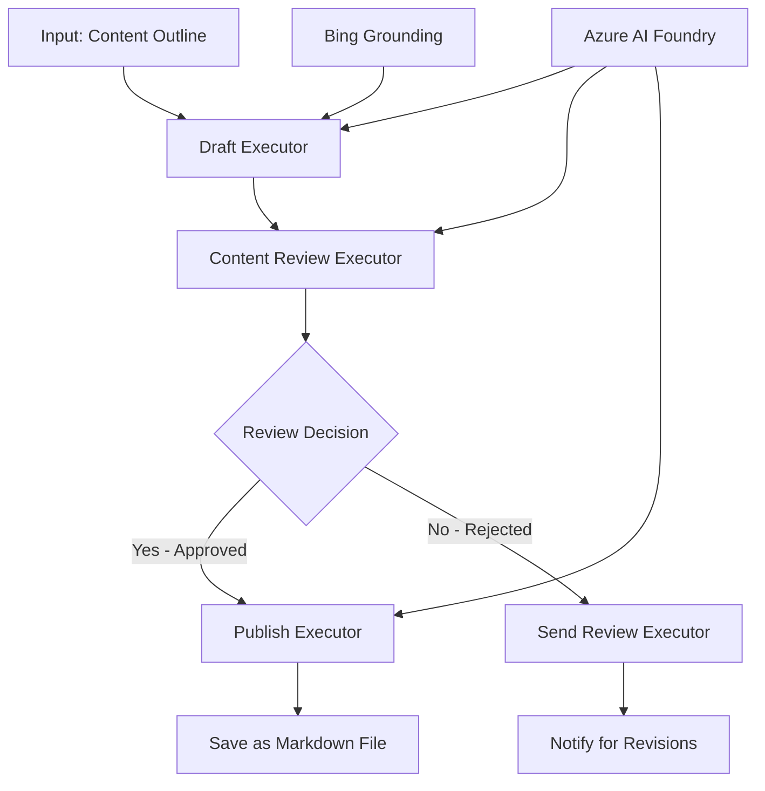

<!--
CO_OP_TRANSLATOR_METADATA:
{
  "original_hash": "8abd335151cee553293b637ee3d80d10",
  "translation_date": "2025-11-11T12:24:20+00:00",
  "source_file": "08-multi-agent/code_samples/workflows-agent-framework/dotNET/04.dotnet-agent-framework-workflow-aifoundry-condition.md",
  "language_code": "ms"
}
-->
# 🔀 Aliran Kerja Ejen Bersyarat dengan Azure AI Foundry (.NET)

## 📋 Tutorial Aliran Kerja Berdasarkan Keputusan Pintar

Notebook ini menunjukkan **pola aliran kerja bersyarat** menggunakan Azure AI Foundry dan Microsoft Agent Framework untuk .NET. Anda akan belajar cara membina aliran kerja canggih yang didorong oleh keputusan, yang secara pintar mengarahkan pemprosesan berdasarkan analisis AI, peraturan perniagaan, dan keadaan dinamik untuk automasi bertaraf perusahaan.

## 🎯 Objektif Pembelajaran

### 🧠 **Arkitektur Keputusan Pintar**
- **Pelaksanaan Logik Bersyarat**: Bina pokok keputusan kompleks dengan pelbagai titik cabang
- **Penghalaan Berkuasa AI**: Gunakan model Azure AI Foundry untuk membuat keputusan penghalaan pintar
- **Penyesuaian Aliran Kerja Dinamik**: Ubah tingkah laku aliran kerja berdasarkan analisis dan keadaan semasa
- **Integrasi Peraturan Perusahaan**: Gabungkan logik perniagaan dan keperluan pematuhan ke dalam aliran kerja

### 🔀 **Pola Bersyarat Lanjutan**
- **Pengambilan Keputusan Multi-Kriteria**: Menilai pelbagai faktor untuk keputusan penghalaan
- **Pemprosesan Berasaskan Konteks**: Membuat keputusan berdasarkan konteks dan sejarah aliran kerja yang terkumpul
- **Pengubahsuaian Aliran Kerja Adaptif**: Menyesuaikan laluan pemprosesan secara dinamik berdasarkan keadaan semasa
- **Integrasi Enjin Peraturan**: Melaksanakan enjin peraturan perniagaan yang canggih dalam aliran kerja

### 🏢 **Aplikasi Bersyarat Perusahaan**
- **Pengelasan & Penghalaan Dokumen**: Secara automatik mengklasifikasikan dan mengarahkan dokumen ke aliran kerja yang sesuai
- **Triage Perkhidmatan Pelanggan**: Penghalaan pintar pertanyaan pelanggan kepada pasukan pengendalian khusus
- **Pemprosesan Pematuhan & Risiko**: Terapkan proses pengesahan dan semakan yang berbeza berdasarkan penilaian risiko
- **Aliran Kerja Jaminan Kualiti**: Mengarahkan kandungan melalui proses semakan yang sesuai berdasarkan metrik kualiti

## ⚙️ Prasyarat & Persediaan

### 📦 **Pakej NuGet Diperlukan**

Pakej lanjutan untuk pemprosesan aliran kerja bersyarat:

```xml
<!-- Core AI Framework -->
<PackageReference Include="Microsoft.Extensions.AI" Version="9.9.0" />

<!-- Azure AI Agents with Persistent State -->
<PackageReference Include="Azure.AI.Agents.Persistent" Version="1.2.0-beta.5" />

<!-- Azure Identity and Utilities -->
<PackageReference Include="Azure.Identity" Version="1.15.0" />
<PackageReference Include="System.Linq.Async" Version="6.0.3" />
<PackageReference Include="DotNetEnv" Version="3.1.1" />

<!-- Local Workflow Framework References -->
<!-- Microsoft.Agents.Workflows.dll - Advanced workflow orchestration -->
<!-- Microsoft.Agents.AI.AzureAI.dll - Azure AI Foundry integration -->
<!-- Microsoft.Agents.AI.dll - Core agent abstractions -->
```

### 🔑 **Konfigurasi Azure AI Foundry**

**Sumber Azure Diperlukan:**
- Ruang kerja Azure AI Foundry dengan model pemprosesan bersyarat
- Langganan Azure dengan kuota dan kebenaran komputasi yang sesuai
- Model AI yang telah dikerahkan untuk pengambilan keputusan dan analisis kandungan
- (Pilihan) Sambungan API Bing Search untuk keupayaan asas

**Konfigurasi Persekitaran (.env file):**
```env
# Azure AI Foundry Configuration
AZURE_AI_PROJECT_ENDPOINT=https://your-project.cognitiveservices.azure.com/
BING_CONNECTION_ID=your-bing-connection-id
```

**Persediaan Pengesahan:**
```csharp
// Azure CLI or Managed Identity authentication
using Azure.Identity;
var credential = new AzureCliCredential();

// Load environment configuration
DotNetEnv.Env.Load("../../../.env");
```

### 🏗️ **Arkitektur Aliran Kerja Bersyarat**



**Komponen Utama:**
- **Draft Executor**: Ejen AI yang mencipta draf kandungan awal daripada rangka
- **Content Review Executor**: Ejen AI yang menilai kualiti dan pematuhan draf
- **Conditional Routing**: Logik keputusan yang mengarahkan berdasarkan hasil semakan
- **Publish/Review Paths**: Laluan pemprosesan berasingan untuk kandungan yang diluluskan vs ditolak
- **State Management**: Mengekalkan konteks kandungan dan semakan sepanjang aliran kerja

## 🎨 **Pola Reka Bentuk Aliran Kerja Bersyarat**

### 📋 **Pengeluaran Kandungan dengan Pintu Kualiti**
```
Outline → Draft Creation → Quality Review → {Approve: Publish | Reject: Revise}
```

### 🎯 **Pemprosesan Dokumen Berasaskan Risiko**
```
Document → Risk Assessment → {Low: Standard | High: Enhanced Review}
```

### 🔍 **Penghalaan Perkhidmatan Pelanggan Pintar**
```
Customer Query → Analysis → {Simple: FAQ Bot | Complex: Human Agent}
```

### 💼 **Aliran Kerja Berpandukan Pematuhan**
```
Content → Compliance Check → {Pass: Publish | Fail: Legal Review}
```

## 🏢 **Manfaat Bersyarat Perusahaan**

### 🎯 **Automasi Pintar**
- **Pengambilan Keputusan Pintar**: Keputusan penghalaan berkuasa AI berdasarkan analisis kandungan dan konteks
- **Pemprosesan Adaptif**: Aliran kerja yang secara automatik menyesuaikan diri berdasarkan keadaan yang berubah
- **Penguatkuasaan Peraturan Perniagaan**: Aplikasi automatik logik perniagaan dan polisi yang kompleks
- **Penghalaan Berasaskan Konteks**: Keputusan berdasarkan sejarah aliran kerja penuh dan konteks terkumpul

### 📈 **Kecemerlangan Operasi**
- **Pengagihan Sumber yang Dioptimumkan**: Mengarahkan kerja kepada pakar dan proses yang paling sesuai
- **Pengurangan Campur Tangan Manual**: Pengambilan keputusan automatik meminimumkan keperluan penghalaan manusia
- **Masa Penyelesaian Lebih Cepat**: Penghalaan langsung kepada kepakaran dan keupayaan pemprosesan yang sesuai
- **Aplikasi Konsisten**: Aplikasi seragam peraturan perniagaan dan kriteria keputusan

### 🛡️ **Pengurusan Risiko & Pematuhan**
- **Penilaian Risiko Automatik**: Penilaian berkuasa AI terhadap kandungan dan tahap risiko situasi
- **Penguatkuasaan Pematuhan**: Penghalaan automatik melalui proses peraturan yang diperlukan
- **Aplikasi Protokol Keselamatan**: Langkah keselamatan yang dipertingkatkan diterapkan berdasarkan penilaian risiko
- **Penyelenggaraan Jejak Audit**: Dokumentasi lengkap keputusan penghalaan dan rasional

### 📊 **Analitik & Penambahbaikan Berterusan**
- **Analitik Keputusan**: Jejak keberkesanan dan ketepatan keputusan penghalaan
- **Pengenalan Pola**: Kenal pasti trend dan pola dalam keputusan penghalaan dari masa ke masa
- **Pengoptimuman Prestasi**: Penambahbaikan berterusan kriteria keputusan dan kecekapan penghalaan
- **Kecerdasan Perniagaan**: Wawasan tentang ciri kandungan dan keperluan pemprosesan

### 🔧 **Kecemerlangan Teknikal**
- **Pengurusan Keadaan Berterusan**: Mengekalkan keadaan kompleks sepanjang pelaksanaan aliran kerja
- **Arkitektur Boleh Skala**: Menangani keperluan pemprosesan bersyarat volum tinggi
- **Keupayaan Integrasi**: Integrasi lancar dengan sistem dan proses perniagaan sedia ada
- **Pemantauan & Kebolehlihatan**: Penjejakan komprehensif prestasi aliran kerja dan keputusan

Mari bina aliran kerja perusahaan yang pintar dan didorong keputusan dengan .NET! 🚀

## 💻 Menjalankan Kod

Pelaksanaan lengkap tersedia dalam `04.dotnet-agent-framework-workflow-aifoundry-condition.cs`. Ini menunjukkan **aliran kerja pengeluaran kandungan dengan pintu kualiti**:

### 🏗️ **Arkitektur Aliran Kerja**

```
Content Outline → Draft Creation → Quality Review → Conditional Routing:
                                                      ├─ Approved (>200 words) → Publish
                                                      └─ Rejected (<200 words) → Review Notification
```

**Ejen dalam Aliran Kerja:**
1. **Evangelist Agent**: Mencipta draf tutorial daripada rangka dengan asas Bing
2. **Content Reviewer Agent**: Menilai kualiti draf (bilangan perkataan, kelengkapan)
3. **Publisher Agent**: Menyimpan kandungan yang diluluskan sebagai fail Markdown dengan cap masa

**Executor Tersuai:**
1. **DraftExecutor**: Mengatur penciptaan draf
2. **ContentReviewExecutor**: Melakukan penilaian kualiti
3. **PublishExecutor**: Mengendalikan penerbitan kandungan yang diluluskan
4. **SendReviewExecutor**: Menguruskan pemberitahuan kandungan yang ditolak

### 🚀 Menjalankan Contoh

**Prasyarat:**
- Ruang kerja Azure AI Foundry dikonfigurasi
- Pengesahan Azure CLI (`az login`)
- (Pilihan) Sambungan Bing Search untuk asas

```bash
# Make the script executable (Unix/Linux/macOS)
chmod +x 04.dotnet-agent-framework-workflow-aifoundry-condition.cs

# Run the conditional workflow
./04.dotnet-agent-framework-workflow-aifoundry-condition.cs
```

Atau pada Windows:
```powershell
dotnet run 04.dotnet-agent-framework-workflow-aifoundry-condition.cs
```

### 📝 Output Dijangka

Aliran kerja akan:
1. **Cipta Ejen**: Memulakan tiga ejen Azure AI Foundry khusus
2. **Hasilkan Draf**: Ejen Evangelist mencipta draf tutorial daripada rangka
3. **Semak Kandungan**: Content Reviewer menilai kualiti draf
4. **Penghalaan Bersyarat**:
   - **Jika diluluskan (>200 perkataan)**: Publish executor menyimpan sebagai fail Markdown
   - **Jika ditolak (<200 perkataan)**: Hantar pemberitahuan semakan
5. **Paparkan Hasil**: Tunjukkan hasil akhir aliran kerja

### 🔧 Pilihan Penyesuaian

**Ubah Kriteria Semakan:**
```csharp
const string ContentReviewerInstructions = @"
You are a content reviewer...
1. Check if content is more than 500 words (instead of 200)
2. Verify technical accuracy
3. Ensure proper formatting
...";
```

**Tambah Laluan Bersyarat Lain:**
```csharp
var workflow = new WorkflowBuilder(draftExecutor)
    .AddEdge(draftExecutor, contentReviewerExecutor)
    .AddEdge(contentReviewerExecutor, publishExecutor, condition: GetCondition("Excellent"))
    .AddEdge(contentReviewerExecutor, editExecutor, condition: GetCondition("Good"))
    .AddEdge(contentReviewerExecutor, sendReviewerExecutor, condition: GetCondition("Poor"))
    .Build();
```

**Ubah Keperluan Kandungan:**
```csharp
string OUTLINE_Content = @"
# Your Custom Topic
## Section 1
https://your-reference-url
## Section 2
...
";
```

### 🎯 Aplikasi Dunia Nyata

Pola aliran kerja bersyarat ini sesuai untuk:
- **Sistem Pengurusan Kandungan**: Aliran kerja editorial automatik dengan pintu kualiti
- **Pemprosesan Dokumen**: Mengarahkan dokumen berdasarkan klasifikasi dan pematuhan
- **Sokongan Pelanggan**: Penghalaan tiket pintar berdasarkan kerumitan dan keutamaan
- **Semakan Undang-Undang**: Mengarahkan kontrak berdasarkan penilaian risiko dan nilai
- **Proses HR**: Mengarahkan aplikasi melalui aliran kerja penyaringan yang sesuai

### 🔍 Memahami Logik Bersyarat

**Fungsi Keadaan:**
```csharp
public Func<object?, bool> GetCondition(string expectedResult) =>
    reviewResult => reviewResult is ReviewResult review && review.Result == expectedResult;
```

Fungsi ini mencipta predikat yang:
1. Memeriksa jika hasil adalah jenis `ReviewResult`
2. Membandingkan sifat `Result` dengan nilai yang diharapkan
3. Mengembalikan benar/palsu untuk menentukan penghalaan

**Tepi Aliran Kerja dengan Keadaan:**
```csharp
.AddEdge(contentReviewerExecutor, publishExecutor, condition: GetCondition("Yes"))
.AddEdge(contentReviewerExecutor, sendReviewerExecutor, condition: GetCondition("No"))
```

### 📊 Ciri Lanjutan

**Pengesahan Skema JSON:**
Aliran kerja menggunakan skema JSON untuk memastikan respons berstruktur:

```csharp
// Define response structure
public class ReviewResult
{
    [JsonPropertyName("review_result")]
    public string Result { get; set; } = string.Empty;
    
    [JsonPropertyName("reason")]
    public string Reason { get; set; } = string.Empty;
    
    [JsonPropertyName("draft_content")]
    public string DraftContent { get; set; } = string.Empty;
}

// Apply to agent
ResponseFormat = ChatResponseFormat.ForJsonSchema(
    AIJsonUtilities.CreateJsonSchema(typeof(ReviewResult)), 
    "ReviewResult", 
    "Review Result From DraftContent"
)
```

**Integrasi Asas Bing:**
Ejen Evangelist menggunakan asas Bing untuk mengakses maklumat masa nyata:

```csharp
var bingGroundingConfig = new BingGroundingSearchConfiguration(bing_conn_id);
BingGroundingToolDefinition bingGroundingTool = new(
    new BingGroundingSearchToolParameters([bingGroundingConfig])
);
```

Ini membolehkan ejen mengikuti URL dalam rangka dan mengekstrak maklumat semasa.

### 🛡️ Pengendalian Ralat

Aliran kerja termasuk pengendalian ralat yang kukuh untuk kandungan yang ditolak:
- Kegagalan semakan mencetuskan laluan alternatif
- Pemberitahuan memberikan alasan penolakan yang jelas
- Kandungan dipelihara untuk semakan semula

### 🔄 Memperluas Aliran Kerja

**Tambah Gelung Semakan:**
Cipta gelung maklum balas yang secara automatik membuat semula draf kandungan:

```csharp
.AddEdge(contentReviewerExecutor, publishExecutor, condition: GetCondition("Yes"))
.AddEdge(contentReviewerExecutor, draftExecutor, condition: GetCondition("No")) // Loop back
```

**Laksanakan Semakan Pelbagai Peringkat:**
Tambah pelbagai peringkat semakan dengan kriteria berbeza:

```csharp
.AddEdge(draftExecutor, technicalReviewer)
.AddEdge(technicalReviewer, editorialReviewer, condition: GetCondition("TechPass"))
.AddEdge(editorialReviewer, publishExecutor, condition: GetCondition("EditPass"))
```

Pola aliran kerja bersyarat ini menyediakan asas untuk membina sistem automasi perusahaan yang canggih dan pintar! 🚀

---

<!-- CO-OP TRANSLATOR DISCLAIMER START -->
**Penafian**:  
Dokumen ini telah diterjemahkan menggunakan perkhidmatan terjemahan AI [Co-op Translator](https://github.com/Azure/co-op-translator). Walaupun kami berusaha untuk ketepatan, sila ambil perhatian bahawa terjemahan automatik mungkin mengandungi kesilapan atau ketidaktepatan. Dokumen asal dalam bahasa asalnya harus dianggap sebagai sumber yang berwibawa. Untuk maklumat penting, terjemahan manusia profesional adalah disyorkan. Kami tidak bertanggungjawab atas sebarang salah faham atau salah tafsir yang timbul daripada penggunaan terjemahan ini.
<!-- CO-OP TRANSLATOR DISCLAIMER END -->