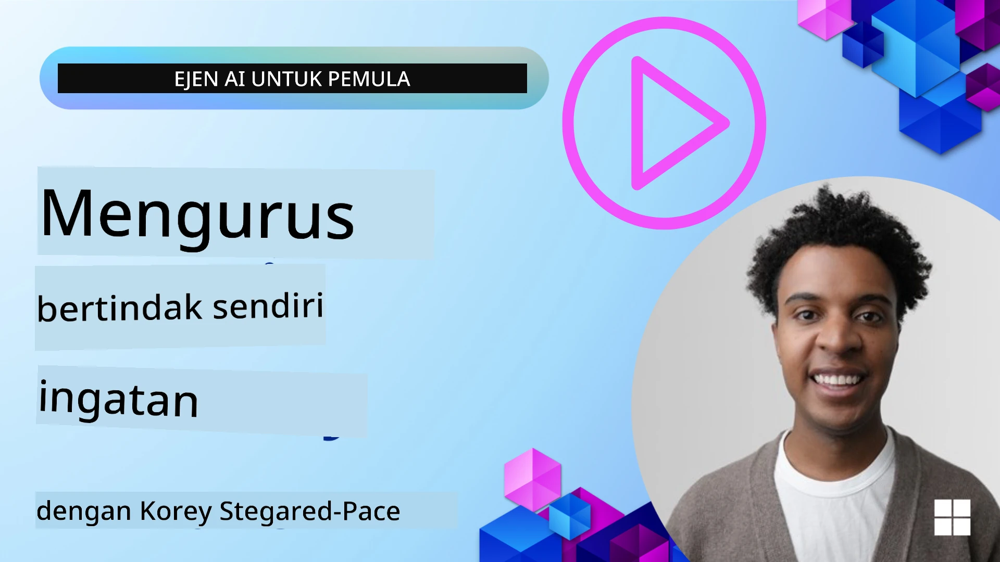

<!--
CO_OP_TRANSLATOR_METADATA:
{
  "original_hash": "a1d90991499ad697c4ad24decaf36968",
  "translation_date": "2025-12-09T12:35:26+00:00",
  "source_file": "13-agent-memory/README.md",
  "language_code": "ms"
}
-->
# Memori untuk Ejen AI 

Apabila membincangkan kelebihan unik dalam mencipta Ejen AI, dua perkara utama sering dibincangkan: keupayaan untuk menggunakan alat bagi menyelesaikan tugas dan keupayaan untuk bertambah baik dari masa ke masa. Memori adalah asas dalam mencipta ejen yang mampu memperbaiki diri sendiri untuk memberikan pengalaman yang lebih baik kepada pengguna kita.

Dalam pelajaran ini, kita akan melihat apa itu memori untuk Ejen AI dan bagaimana kita boleh mengurus serta menggunakannya untuk manfaat aplikasi kita.

## Pengenalan

Pelajaran ini akan merangkumi:

• **Memahami Memori Ejen AI**: Apa itu memori dan mengapa ia penting untuk ejen.

• **Melaksanakan dan Menyimpan Memori**: Kaedah praktikal untuk menambah keupayaan memori kepada ejen AI anda, dengan fokus pada memori jangka pendek dan jangka panjang.

• **Menjadikan Ejen AI Bertambah Baik**: Bagaimana memori membolehkan ejen belajar daripada interaksi lalu dan bertambah baik dari masa ke masa.

## Implementasi yang Tersedia

Pelajaran ini termasuk dua tutorial notebook yang komprehensif:

• **[13-agent-memory.ipynb](./13-agent-memory.ipynb)**: Melaksanakan memori menggunakan Mem0 dan Azure AI Search dengan rangka kerja Semantic Kernel

• **[13-agent-memory-cognee.ipynb](./13-agent-memory-cognee.ipynb)**: Melaksanakan memori berstruktur menggunakan Cognee, secara automatik membina graf pengetahuan yang disokong oleh embeddings, memvisualkan graf, dan pengambilan pintar

## Matlamat Pembelajaran

Selepas menyelesaikan pelajaran ini, anda akan tahu bagaimana untuk:

• **Membezakan antara pelbagai jenis memori ejen AI**, termasuk memori kerja, jangka pendek, dan jangka panjang, serta bentuk khusus seperti memori persona dan episodik.

• **Melaksanakan dan mengurus memori jangka pendek dan jangka panjang untuk ejen AI** menggunakan rangka kerja Semantic Kernel, memanfaatkan alat seperti Mem0, Cognee, memori Whiteboard, dan integrasi dengan Azure AI Search.

• **Memahami prinsip di sebalik ejen AI yang bertambah baik** dan bagaimana sistem pengurusan memori yang kukuh menyumbang kepada pembelajaran dan penyesuaian berterusan.

## Memahami Memori Ejen AI

Secara asasnya, **memori untuk ejen AI merujuk kepada mekanisme yang membolehkan mereka menyimpan dan mengingat maklumat**. Maklumat ini boleh berupa butiran spesifik tentang perbualan, keutamaan pengguna, tindakan lalu, atau corak yang dipelajari.

Tanpa memori, aplikasi AI sering kali tidak mempunyai keadaan, bermakna setiap interaksi bermula dari awal. Ini membawa kepada pengalaman pengguna yang berulang dan mengecewakan di mana ejen "lupa" konteks atau keutamaan sebelumnya.

### Mengapa Memori Penting?

Kepintaran ejen sangat berkait dengan keupayaannya untuk mengingat dan menggunakan maklumat lalu. Memori membolehkan ejen menjadi:

• **Reflektif**: Belajar daripada tindakan dan hasil lalu.

• **Interaktif**: Mengekalkan konteks sepanjang perbualan yang berterusan.

• **Proaktif dan Reaktif**: Menjangka keperluan atau bertindak balas dengan sesuai berdasarkan data sejarah.

• **Autonomi**: Beroperasi dengan lebih bebas dengan menggunakan pengetahuan yang disimpan.

Tujuan melaksanakan memori adalah untuk menjadikan ejen lebih **boleh dipercayai dan berkemampuan**.

### Jenis Memori

#### Memori Kerja

Anggap ini sebagai sehelai kertas draf yang digunakan oleh ejen semasa satu tugas atau proses pemikiran yang sedang berlangsung. Ia menyimpan maklumat segera yang diperlukan untuk mengira langkah seterusnya.

Untuk ejen AI, memori kerja sering menangkap maklumat yang paling relevan daripada perbualan, walaupun sejarah penuh perbualan panjang atau dipotong. Ia memberi fokus kepada elemen utama seperti keperluan, cadangan, keputusan, dan tindakan.

**Contoh Memori Kerja**

Dalam ejen tempahan perjalanan, memori kerja mungkin menangkap permintaan semasa pengguna, seperti "Saya mahu tempah perjalanan ke Paris". Keperluan spesifik ini disimpan dalam konteks segera ejen untuk membimbing interaksi semasa.

#### Memori Jangka Pendek

Jenis memori ini menyimpan maklumat untuk tempoh satu perbualan atau sesi. Ia adalah konteks perbualan semasa, membolehkan ejen merujuk kembali kepada giliran sebelumnya dalam dialog.

**Contoh Memori Jangka Pendek**

Jika pengguna bertanya, "Berapa harga penerbangan ke Paris?" dan kemudian menyusul dengan "Bagaimana dengan penginapan di sana?", memori jangka pendek memastikan ejen tahu "di sana" merujuk kepada "Paris" dalam perbualan yang sama.

#### Memori Jangka Panjang

Ini adalah maklumat yang kekal merentasi pelbagai perbualan atau sesi. Ia membolehkan ejen mengingat keutamaan pengguna, interaksi sejarah, atau pengetahuan umum dalam tempoh yang panjang. Ini penting untuk personalisasi.

**Contoh Memori Jangka Panjang**

Memori jangka panjang mungkin menyimpan bahawa "Ben suka bermain ski dan aktiviti luar, suka kopi dengan pemandangan gunung, dan ingin mengelakkan cerun ski yang sukar kerana kecederaan lalu". Maklumat ini, yang dipelajari daripada interaksi sebelumnya, mempengaruhi cadangan dalam sesi perancangan perjalanan masa depan, menjadikannya sangat diperibadikan.

#### Memori Persona

Jenis memori khusus ini membantu ejen membangunkan "personaliti" atau "persona" yang konsisten. Ia membolehkan ejen mengingat butiran tentang dirinya atau peranannya yang dimaksudkan, menjadikan interaksi lebih lancar dan fokus.

**Contoh Memori Persona**
Jika ejen perjalanan direka untuk menjadi "pakar perancang ski," memori persona mungkin mengukuhkan peranan ini, mempengaruhi responsnya agar selaras dengan nada dan pengetahuan seorang pakar.

#### Memori Alur Kerja/Episodik

Memori ini menyimpan urutan langkah yang diambil oleh ejen semasa tugas yang kompleks, termasuk kejayaan dan kegagalan. Ia seperti mengingat "episod" atau pengalaman lalu untuk belajar daripadanya.

**Contoh Memori Episodik**

Jika ejen cuba menempah penerbangan tertentu tetapi gagal kerana tidak tersedia, memori episodik boleh merekodkan kegagalan ini, membolehkan ejen mencuba penerbangan alternatif atau memberitahu pengguna tentang isu tersebut dengan cara yang lebih bermaklumat semasa percubaan seterusnya.

#### Memori Entiti

Ini melibatkan pengekstrakan dan pengingatan entiti tertentu (seperti orang, tempat, atau benda) dan peristiwa daripada perbualan. Ia membolehkan ejen membina pemahaman berstruktur tentang elemen utama yang dibincangkan.

**Contoh Memori Entiti**

Daripada perbualan tentang perjalanan lalu, ejen mungkin mengekstrak "Paris," "Menara Eiffel," dan "makan malam di restoran Le Chat Noir" sebagai entiti. Dalam interaksi masa depan, ejen boleh mengingat "Le Chat Noir" dan menawarkan untuk membuat tempahan baru di sana.

#### RAG Berstruktur (Retrieval Augmented Generation)

Walaupun RAG adalah teknik yang lebih luas, "RAG Berstruktur" disorot sebagai teknologi memori yang kuat. Ia mengekstrak maklumat padat dan berstruktur daripada pelbagai sumber (perbualan, e-mel, imej) dan menggunakannya untuk meningkatkan ketepatan, pengingatan, dan kelajuan dalam respons. Berbeza dengan RAG klasik yang hanya bergantung pada kesamaan semantik, RAG Berstruktur berfungsi dengan struktur maklumat yang wujud.

**Contoh RAG Berstruktur**

Daripada hanya memadankan kata kunci, RAG Berstruktur boleh menganalisis butiran penerbangan (destinasi, tarikh, masa, syarikat penerbangan) daripada e-mel dan menyimpannya dengan cara yang berstruktur. Ini membolehkan pertanyaan tepat seperti "Penerbangan apa yang saya tempah ke Paris pada hari Selasa?"

## Melaksanakan dan Menyimpan Memori

Melaksanakan memori untuk ejen AI melibatkan proses sistematik **pengurusan memori**, yang termasuk menjana, menyimpan, mengambil, mengintegrasi, mengemas kini, dan bahkan "melupakan" (atau memadam) maklumat. Pengambilan adalah aspek yang sangat penting.

### Alat Memori Khusus

#### Mem0

Salah satu cara untuk menyimpan dan mengurus memori ejen adalah dengan menggunakan alat khusus seperti Mem0. Mem0 berfungsi sebagai lapisan memori yang berterusan, membolehkan ejen mengingat interaksi yang relevan, menyimpan keutamaan pengguna dan konteks fakta, serta belajar daripada kejayaan dan kegagalan dari masa ke masa. Idea di sini adalah bahawa ejen tanpa keadaan berubah menjadi ejen dengan keadaan.

Ia berfungsi melalui **saluran memori dua fasa: pengekstrakan dan pengemaskinian**. Pertama, mesej yang ditambahkan ke thread ejen dihantar ke perkhidmatan Mem0, yang menggunakan Model Bahasa Besar (LLM) untuk meringkaskan sejarah perbualan dan mengekstrak memori baru. Seterusnya, fasa pengemaskinian yang didorong oleh LLM menentukan sama ada untuk menambah, mengubah, atau memadam memori ini, menyimpannya dalam stor data hibrid yang boleh termasuk pangkalan data vektor, graf, dan nilai kunci. Sistem ini juga menyokong pelbagai jenis memori dan boleh menggabungkan memori graf untuk mengurus hubungan antara entiti.

#### Cognee

Pendekatan lain yang kuat adalah menggunakan **Cognee**, memori semantik sumber terbuka untuk ejen AI yang mengubah data berstruktur dan tidak berstruktur menjadi graf pengetahuan yang boleh ditanya dan disokong oleh embeddings. Cognee menyediakan **senibina stor dua** yang menggabungkan carian kesamaan vektor dengan hubungan graf, membolehkan ejen memahami bukan hanya maklumat yang serupa, tetapi bagaimana konsep berkaitan antara satu sama lain.

Ia cemerlang dalam **pengambilan hibrid** yang menggabungkan kesamaan vektor, struktur graf, dan penaakulan LLM - daripada carian chunk mentah hingga soal jawab yang sedar graf. Sistem ini mengekalkan **memori hidup** yang berkembang dan tumbuh sambil tetap boleh ditanya sebagai satu graf yang bersambung, menyokong konteks sesi jangka pendek dan memori berterusan jangka panjang.

Tutorial notebook Cognee ([13-agent-memory-cognee.ipynb](./13-agent-memory-cognee.ipynb)) menunjukkan cara membina lapisan memori bersatu ini, dengan contoh praktikal tentang pengambilan pelbagai sumber data, memvisualkan graf pengetahuan, dan pertanyaan dengan strategi carian yang berbeza yang disesuaikan dengan keperluan ejen tertentu.

### Menyimpan Memori dengan RAG

Selain alat memori khusus seperti Mem0, anda boleh memanfaatkan perkhidmatan carian yang kukuh seperti **Azure AI Search sebagai backend untuk menyimpan dan mengambil memori**, terutamanya untuk RAG berstruktur.

Ini membolehkan anda mengasaskan respons ejen anda dengan data anda sendiri, memastikan jawapan yang lebih relevan dan tepat. Azure AI Search boleh digunakan untuk menyimpan memori perjalanan khusus pengguna, katalog produk, atau sebarang pengetahuan khusus domain lain.

Azure AI Search menyokong keupayaan seperti **RAG Berstruktur**, yang cemerlang dalam mengekstrak dan mengambil maklumat padat dan berstruktur daripada dataset besar seperti sejarah perbualan, e-mel, atau bahkan imej. Ini memberikan "ketepatan dan pengingatan supermanusia" berbanding pendekatan chunking teks dan embedding tradisional.

## Menjadikan Ejen AI Bertambah Baik

Corak biasa untuk ejen yang bertambah baik melibatkan pengenalan **"ejen pengetahuan"**. Ejen berasingan ini memerhatikan perbualan utama antara pengguna dan ejen utama. Peranannya adalah untuk:

1. **Mengenal pasti maklumat berharga**: Menentukan sama ada mana-mana bahagian perbualan bernilai disimpan sebagai pengetahuan umum atau keutamaan pengguna tertentu.

2. **Mengekstrak dan meringkaskan**: Menyaring pembelajaran atau keutamaan penting daripada perbualan.

3. **Menyimpan dalam pangkalan pengetahuan**: Menyimpan maklumat yang diekstrak ini, selalunya dalam pangkalan data vektor, supaya ia boleh diambil kemudian.

4. **Menambah pertanyaan masa depan**: Apabila pengguna memulakan pertanyaan baru, ejen pengetahuan mengambil maklumat yang disimpan yang relevan dan menambahkannya kepada prompt pengguna, memberikan konteks penting kepada ejen utama (serupa dengan RAG).

### Pengoptimuman untuk Memori

• **Pengurusan Latensi**: Untuk mengelakkan melambatkan interaksi pengguna, model yang lebih murah dan cepat boleh digunakan pada awalnya untuk dengan cepat memeriksa sama ada maklumat bernilai disimpan atau diambil, hanya menggunakan proses pengekstrakan/pengambilan yang lebih kompleks apabila perlu.

• **Penyelenggaraan Pangkalan Pengetahuan**: Untuk pangkalan pengetahuan yang semakin berkembang, maklumat yang kurang kerap digunakan boleh dipindahkan ke "stor sejuk" untuk mengurus kos.

## Ada Lagi Soalan Tentang Memori Ejen?

Sertai [Azure AI Foundry Discord](https://aka.ms/ai-agents/discord) untuk berhubung dengan pelajar lain, menghadiri waktu pejabat, dan mendapatkan jawapan kepada soalan anda tentang Ejen AI.

---

<!-- CO-OP TRANSLATOR DISCLAIMER START -->
**Penafian**:  
Dokumen ini telah diterjemahkan menggunakan perkhidmatan terjemahan AI [Co-op Translator](https://github.com/Azure/co-op-translator). Walaupun kami berusaha untuk ketepatan, sila ambil perhatian bahawa terjemahan automatik mungkin mengandungi kesilapan atau ketidaktepatan. Dokumen asal dalam bahasa asalnya harus dianggap sebagai sumber yang berwibawa. Untuk maklumat kritikal, terjemahan manusia profesional adalah disyorkan. Kami tidak bertanggungjawab atas sebarang salah faham atau salah tafsir yang timbul daripada penggunaan terjemahan ini.
<!-- CO-OP TRANSLATOR DISCLAIMER END -->