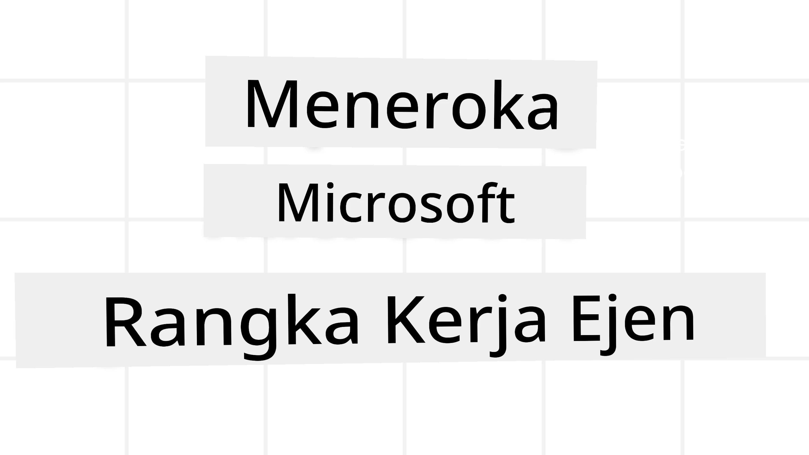
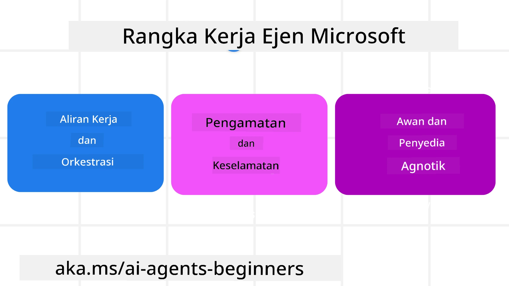
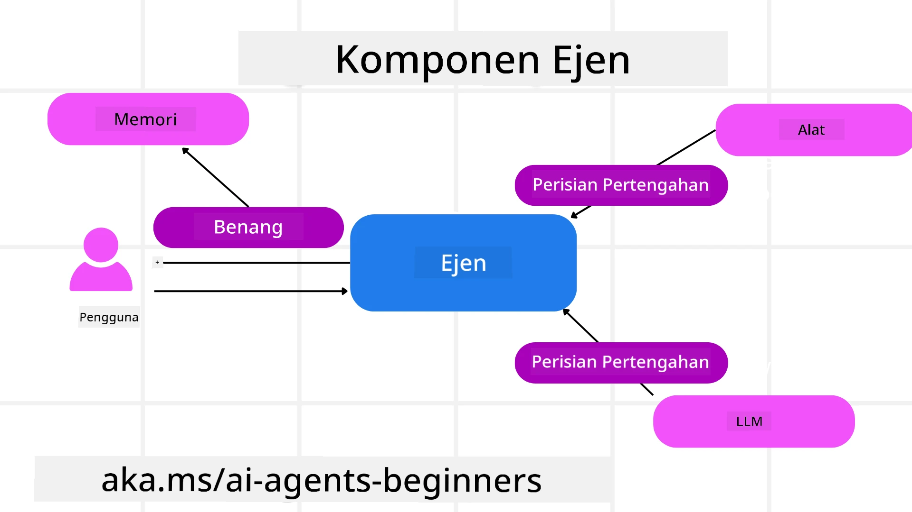

<!--
CO_OP_TRANSLATOR_METADATA:
{
  "original_hash": "19c4dab375acbc733855cc7f2f04edbc",
  "translation_date": "2025-10-02T17:28:35+00:00",
  "source_file": "14-microsoft-agent-framework/README.md",
  "language_code": "ms"
}
-->
# Meneroka Microsoft Agent Framework



### Pengenalan

Pelajaran ini akan merangkumi:

- Memahami Microsoft Agent Framework: Ciri Utama dan Nilai  
- Meneroka Konsep Utama Microsoft Agent Framework
- Membandingkan MAF dengan Semantic Kernel dan AutoGen: Panduan Migrasi

## Matlamat Pembelajaran

Selepas menyelesaikan pelajaran ini, anda akan tahu cara:

- Membina Ejen AI Sedia Pengeluaran menggunakan Microsoft Agent Framework
- Mengaplikasikan ciri utama Microsoft Agent Framework kepada Kes Penggunaan Ejenik anda
- Memindahkan dan mengintegrasikan rangka kerja dan alat ejenik sedia ada  

## Contoh Kod 

Contoh kod untuk [Microsoft Agent Framework (MAF)](https://aka.ms/ai-agents-beginners/agent-framewrok) boleh didapati dalam repositori ini di bawah fail `xx-python-agent-framework` dan `xx-dotnet-agent-framework`.

## Memahami Microsoft Agent Framework



[Microsoft Agent Framework (MAF)](https://aka.ms/ai-agents-beginners/agent-framewrok) dibina berdasarkan pengalaman dan pembelajaran daripada Semantic Kernel dan AutoGen. Ia menawarkan fleksibiliti untuk menangani pelbagai kes penggunaan ejenik yang dilihat dalam persekitaran pengeluaran dan penyelidikan termasuk:

- **Orkestrasi Ejen Berurutan** dalam senario di mana aliran kerja langkah demi langkah diperlukan.
- **Orkestrasi Serentak** dalam senario di mana ejen perlu menyelesaikan tugas pada masa yang sama.
- **Orkestrasi Sembang Berkumpulan** dalam senario di mana ejen boleh bekerjasama dalam satu tugas.
- **Orkestrasi Penyerahan** dalam senario di mana ejen menyerahkan tugas kepada satu sama lain apabila subtugas selesai.
- **Orkestrasi Magnetik** dalam senario di mana ejen pengurus mencipta dan mengubah senarai tugas serta mengendalikan koordinasi sub-ejen untuk menyelesaikan tugas.

Untuk menyampaikan Ejen AI dalam Pengeluaran, MAF juga termasuk ciri untuk:

- **Keterlihatan** melalui penggunaan OpenTelemetry di mana setiap tindakan Ejen AI termasuk pemanggilan alat, langkah orkestrasi, aliran penaakulan dan pemantauan prestasi melalui papan pemuka Azure AI Foundry.
- **Keselamatan** dengan mengehoskan ejen secara asli di Azure AI Foundry yang termasuk kawalan keselamatan seperti akses berdasarkan peranan, pengendalian data peribadi dan keselamatan kandungan terbina dalam.
- **Ketahanan** kerana benang dan aliran kerja ejen boleh berhenti seketika, disambung semula dan pulih daripada kesilapan yang membolehkan proses berjalan lebih lama.
- **Kawalan** kerana aliran kerja manusia dalam gelung disokong di mana tugas ditandakan sebagai memerlukan kelulusan manusia.

Microsoft Agent Framework juga memberi tumpuan kepada kebolehoperasian dengan:

- **Bersifat Bebas Awan** - Ejen boleh berjalan dalam kontena, di premis dan merentasi pelbagai awan yang berbeza.
- **Bersifat Bebas Penyedia** - Ejen boleh dicipta melalui SDK pilihan anda termasuk Azure OpenAI dan OpenAI.
- **Mengintegrasikan Piawaian Terbuka** - Ejen boleh menggunakan protokol seperti Agent-to-Agent (A2A) dan Model Context Protocol (MCP) untuk menemui dan menggunakan ejen dan alat lain.
- **Plugin dan Penyambung** - Sambungan boleh dibuat kepada perkhidmatan data dan memori seperti Microsoft Fabric, SharePoint, Pinecone dan Qdrant.

Mari kita lihat bagaimana ciri-ciri ini diterapkan kepada beberapa konsep utama Microsoft Agent Framework.

## Konsep Utama Microsoft Agent Framework

### Ejen



**Mencipta Ejen**

Penciptaan ejen dilakukan dengan mentakrifkan perkhidmatan inferens (Penyedia LLM), satu set arahan untuk Ejen AI diikuti, dan nama yang diberikan `name`:

```python
agent = AzureOpenAIChatClient(credential=AzureCliCredential()).create_agent( instructions="You are good at recommending trips to customers based on their preferences.", name="TripRecommender" )
```

Kod di atas menggunakan `Azure OpenAI` tetapi ejen boleh dicipta menggunakan pelbagai perkhidmatan termasuk `Azure AI Foundry Agent Service`:

```python
AzureAIAgentClient(async_credential=credential).create_agent( name="HelperAgent", instructions="You are a helpful assistant." ) as agent
```

API `Responses`, `ChatCompletion` OpenAI

```python
agent = OpenAIResponsesClient().create_agent( name="WeatherBot", instructions="You are a helpful weather assistant.", )
```

```python
agent = OpenAIChatClient().create_agent( name="HelpfulAssistant", instructions="You are a helpful assistant.", )
```

atau ejen jauh menggunakan protokol A2A:

```python
agent = A2AAgent( name=agent_card.name, description=agent_card.description, agent_card=agent_card, url="https://your-a2a-agent-host" )
```

**Menjalankan Ejen**

Ejen dijalankan menggunakan kaedah `.run` atau `.run_stream` untuk respons tidak streaming atau streaming.

```python
result = await agent.run("What are good places to visit in Amsterdam?")
print(result.text)
```

```python
async for update in agent.run_stream("What are the good places to visit in Amsterdam?"):
    if update.text:
        print(update.text, end="", flush=True)

```

Setiap larian ejen juga boleh mempunyai pilihan untuk menyesuaikan parameter seperti `max_tokens` yang digunakan oleh ejen, `tools` yang boleh dipanggil oleh ejen, dan juga `model` itu sendiri yang digunakan untuk ejen.

Ini berguna dalam kes di mana model atau alat tertentu diperlukan untuk menyelesaikan tugas pengguna.

**Alat**

Alat boleh ditakrifkan semasa mentakrifkan ejen:

```python
def get_attractions( location: Annotated[str, Field(description="The location to get the top tourist attractions for")], ) -> str: """Get the top tourist attractions for a given location.""" return f"The top attractions for {location} are." 


# When creating a ChatAgent directly 

agent = ChatAgent( chat_client=OpenAIChatClient(), instructions="You are a helpful assistant", tools=[get_attractions]

```

dan juga semasa menjalankan ejen:

```python

result1 = await agent.run( "What's the best place to visit in Seattle?", tools=[get_attractions] # Tool provided for this run only )
```

**Benang Ejen**

Benang Ejen digunakan untuk mengendalikan perbualan berbilang giliran. Benang boleh dicipta sama ada dengan:

- Menggunakan `get_new_thread()` yang membolehkan benang disimpan dari semasa ke semasa
- Mencipta benang secara automatik semasa menjalankan ejen dan hanya mempunyai benang bertahan semasa larian semasa.

Untuk mencipta benang, kodnya kelihatan seperti ini:

```python
# Create a new thread. 
thread = agent.get_new_thread() # Run the agent with the thread. 
response = await agent.run("Hello, I am here to help you book travel. Where would you like to go?", thread=thread)

```

Anda kemudian boleh menyusun benang untuk disimpan untuk kegunaan kemudian:

```python
# Create a new thread. 
thread = agent.get_new_thread() 

# Run the agent with the thread. 

response = await agent.run("Hello, how are you?", thread=thread) 

# Serialize the thread for storage. 

serialized_thread = await thread.serialize() 

# Deserialize the thread state after loading from storage. 

resumed_thread = await agent.deserialize_thread(serialized_thread)
```

**Middleware Ejen**

Ejen berinteraksi dengan alat dan LLM untuk menyelesaikan tugas pengguna. Dalam senario tertentu, kita mahu melaksanakan atau menjejaki interaksi di antara ini. Middleware ejen membolehkan kita melakukan ini melalui:

*Middleware Fungsi*

Middleware ini membolehkan kita melaksanakan tindakan antara ejen dan fungsi/alat yang akan dipanggilnya. Contoh bila ini akan digunakan ialah apabila anda mungkin mahu melakukan beberapa log pada panggilan fungsi.

Dalam kod di bawah `next` mentakrifkan sama ada middleware seterusnya atau fungsi sebenar harus dipanggil.

```python
async def logging_function_middleware(
    context: FunctionInvocationContext,
    next: Callable[[FunctionInvocationContext], Awaitable[None]],
) -> None:
    """Function middleware that logs function execution."""
    # Pre-processing: Log before function execution
    print(f"[Function] Calling {context.function.name}")

    # Continue to next middleware or function execution
    await next(context)

    # Post-processing: Log after function execution
    print(f"[Function] {context.function.name} completed")
```

*Middleware Sembang*

Middleware ini membolehkan kita melaksanakan atau merekodkan tindakan antara ejen dan permintaan antara LLM.

Ini mengandungi maklumat penting seperti `messages` yang dihantar kepada perkhidmatan AI.

```python
async def logging_chat_middleware(
    context: ChatContext,
    next: Callable[[ChatContext], Awaitable[None]],
) -> None:
    """Chat middleware that logs AI interactions."""
    # Pre-processing: Log before AI call
    print(f"[Chat] Sending {len(context.messages)} messages to AI")

    # Continue to next middleware or AI service
    await next(context)

    # Post-processing: Log after AI response
    print("[Chat] AI response received")

```

**Memori Ejen**

Seperti yang dibincangkan dalam pelajaran `Agentic Memory`, memori adalah elemen penting untuk membolehkan ejen beroperasi dalam konteks yang berbeza. MAF menawarkan beberapa jenis memori yang berbeza:

*Penyimpanan Dalam Memori*

Ini adalah memori yang disimpan dalam benang semasa runtime aplikasi.

```python
# Create a new thread. 
thread = agent.get_new_thread() # Run the agent with the thread. 
response = await agent.run("Hello, I am here to help you book travel. Where would you like to go?", thread=thread)
```

*Mesej Berterusan*

Memori ini digunakan apabila menyimpan sejarah perbualan merentasi sesi yang berbeza. Ia ditakrifkan menggunakan `chat_message_store_factory` :

```python
from agent_framework import ChatMessageStore

# Create a custom message store
def create_message_store():
    return ChatMessageStore()

agent = ChatAgent(
    chat_client=OpenAIChatClient(),
    instructions="You are a Travel assistant.",
    chat_message_store_factory=create_message_store
)

```

*Memori Dinamik*

Memori ini ditambahkan pada konteks sebelum ejen dijalankan. Memori ini boleh disimpan dalam perkhidmatan luaran seperti mem0:

```python
from agent_framework.mem0 import Mem0Provider

# Using Mem0 for advanced memory capabilities
memory_provider = Mem0Provider(
    api_key="your-mem0-api-key",
    user_id="user_123",
    application_id="my_app"
)

agent = ChatAgent(
    chat_client=OpenAIChatClient(),
    instructions="You are a helpful assistant with memory.",
    context_providers=memory_provider
)

```

**Keterlihatan Ejen**

Keterlihatan adalah penting untuk membina sistem ejenik yang boleh dipercayai dan boleh diselenggara. MAF berintegrasi dengan OpenTelemetry untuk menyediakan penjejakan dan meter untuk keterlihatan yang lebih baik.

```python
from agent_framework.observability import get_tracer, get_meter

tracer = get_tracer()
meter = get_meter()
with tracer.start_as_current_span("my_custom_span"):
    # do something
    pass
counter = meter.create_counter("my_custom_counter")
counter.add(1, {"key": "value"})
```

### Aliran Kerja

MAF menawarkan aliran kerja yang merupakan langkah-langkah yang telah ditakrifkan untuk menyelesaikan tugas dan termasuk ejen AI sebagai komponen dalam langkah-langkah tersebut.

Aliran kerja terdiri daripada komponen yang berbeza yang membolehkan kawalan aliran yang lebih baik. Aliran kerja juga membolehkan **orkestrasi berbilang ejen** dan **checkpointing** untuk menyimpan keadaan aliran kerja.

Komponen utama aliran kerja adalah:

**Pelaksana**

Pelaksana menerima mesej input, melaksanakan tugas yang diberikan, dan kemudian menghasilkan mesej output. Ini menggerakkan aliran kerja ke arah menyelesaikan tugas yang lebih besar. Pelaksana boleh menjadi ejen AI atau logik tersuai.

**Tepi**

Tepi digunakan untuk mentakrifkan aliran mesej dalam aliran kerja. Ini boleh menjadi:

*Tepi Langsung* - Sambungan satu-ke-satu yang mudah antara pelaksana:

```python
from agent_framework import WorkflowBuilder

builder = WorkflowBuilder()
builder.add_edge(source_executor, target_executor)
builder.set_start_executor(source_executor)
workflow = builder.build()
```

*Tepi Bersyarat* - Diaktifkan selepas syarat tertentu dipenuhi. Contohnya, apabila bilik hotel tidak tersedia, pelaksana boleh mencadangkan pilihan lain.

*Tepi Switch-case* - Mengarahkan mesej kepada pelaksana yang berbeza berdasarkan syarat yang ditakrifkan. Contohnya, jika pelanggan perjalanan mempunyai akses keutamaan dan tugas mereka akan dikendalikan melalui aliran kerja lain.

*Tepi Fan-out* - Menghantar satu mesej kepada pelbagai sasaran.

*Tepi Fan-in* - Mengumpulkan pelbagai mesej daripada pelaksana yang berbeza dan menghantar kepada satu sasaran.

**Acara**

Untuk memberikan keterlihatan yang lebih baik ke dalam aliran kerja, MAF menawarkan acara terbina dalam untuk pelaksanaan termasuk:

- `WorkflowStartedEvent`  - Pelaksanaan aliran kerja bermula
- `WorkflowOutputEvent` - Aliran kerja menghasilkan output
- `WorkflowErrorEvent` - Aliran kerja menghadapi kesilapan
- `ExecutorInvokeEvent`  - Pelaksana mula memproses
- `ExecutorCompleteEvent`  - Pelaksana selesai memproses
- `RequestInfoEvent` - Permintaan dikeluarkan

## Migrasi Daripada Rangka Kerja Lain (Semantic Kernel dan AutoGen)

### Perbezaan antara MAF dan Semantic Kernel

**Penciptaan Ejen yang Dipermudahkan**

Semantic Kernel bergantung pada penciptaan instance Kernel untuk setiap ejen. MAF menggunakan pendekatan yang dipermudahkan dengan menggunakan sambungan untuk penyedia utama.

```python
agent = AzureOpenAIChatClient(credential=AzureCliCredential()).create_agent( instructions="You are good at reccomending trips to customers based on their preferences.", name="TripRecommender" )
```

**Penciptaan Benang Ejen**

Semantic Kernel memerlukan benang untuk dicipta secara manual. Dalam MAF, ejen secara langsung diberikan benang.

```python
thread = agent.get_new_thread() # Run the agent with the thread. 
```

**Pendaftaran Alat**

Dalam Semantic Kernel, alat didaftarkan kepada Kernel dan Kernel kemudian diberikan kepada ejen. Dalam MAF, alat didaftarkan secara langsung semasa proses penciptaan ejen.

```python
agent = ChatAgent( chat_client=OpenAIChatClient(), instructions="You are a helpful assistant", tools=[get_attractions]
```

### Perbezaan antara MAF dan AutoGen

**Pasukan vs Aliran Kerja**

`Teams` adalah struktur acara untuk aktiviti yang didorong oleh acara dengan ejen dalam AutoGen. MAF menggunakan `Workflows` yang mengarahkan data kepada pelaksana melalui seni bina berasaskan graf.

**Penciptaan Alat**

AutoGen menggunakan `FunctionTool` untuk membungkus fungsi yang boleh dipanggil oleh ejen. MAF menggunakan @ai_function yang beroperasi dengan cara yang sama tetapi juga menyimpulkan skema secara automatik untuk setiap fungsi.

**Kelakuan Ejen**

Ejen adalah ejen satu giliran secara lalai dalam AutoGen kecuali `max_tool_iterations` ditetapkan kepada nilai yang lebih tinggi. Dalam MAF, `ChatAgent` adalah ejen berbilang giliran secara lalai yang bermaksud ia akan terus memanggil alat sehingga tugas pengguna selesai.

## Contoh Kod 

Contoh kod untuk Microsoft Agent Framework boleh didapati dalam repositori ini di bawah fail `xx-python-agent-framework` dan `xx-dotnet-agent-framework`.

## Ada Lagi Soalan Tentang Microsoft Agent Framework?

Sertai [Azure AI Foundry Discord](https://aka.ms/ai-agents/discord) untuk berhubung dengan pelajar lain, menghadiri waktu pejabat dan mendapatkan jawapan kepada soalan Ejen AI anda.

---

**Penafian**:  
Dokumen ini telah diterjemahkan menggunakan perkhidmatan terjemahan AI [Co-op Translator](https://github.com/Azure/co-op-translator). Walaupun kami berusaha untuk memastikan ketepatan, sila ambil perhatian bahawa terjemahan automatik mungkin mengandungi kesilapan atau ketidaktepatan. Dokumen asal dalam bahasa asalnya harus dianggap sebagai sumber yang berwibawa. Untuk maklumat yang kritikal, terjemahan manusia profesional adalah disyorkan. Kami tidak bertanggungjawab atas sebarang salah faham atau salah tafsir yang timbul daripada penggunaan terjemahan ini.