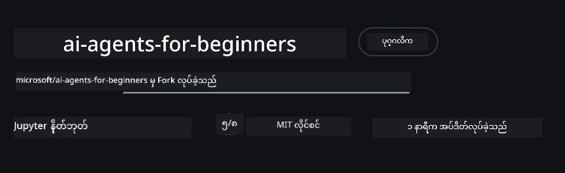
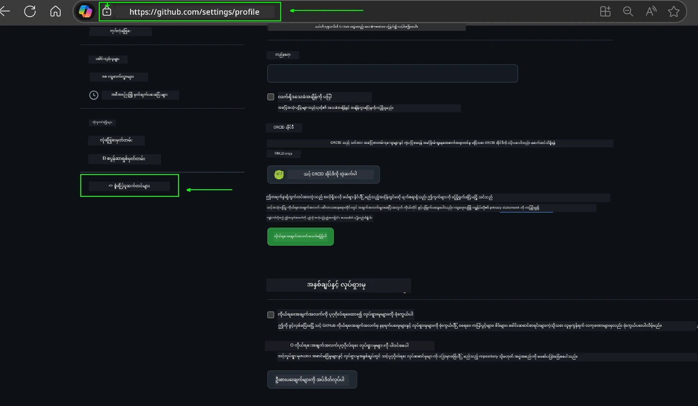
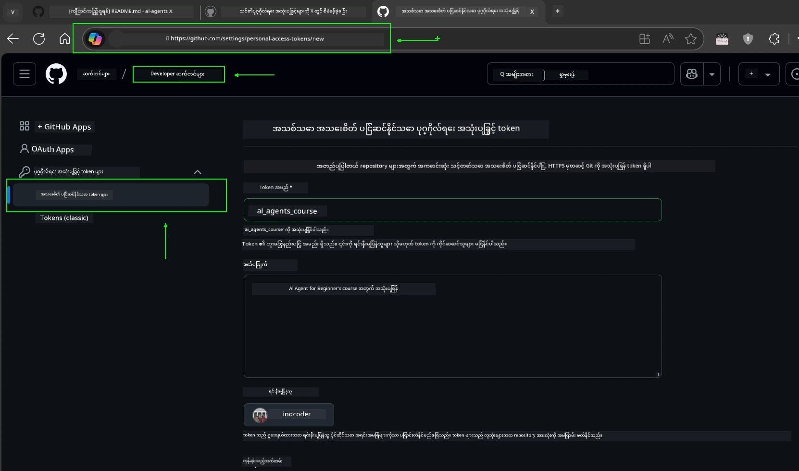
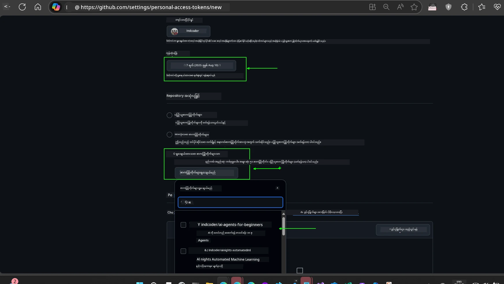
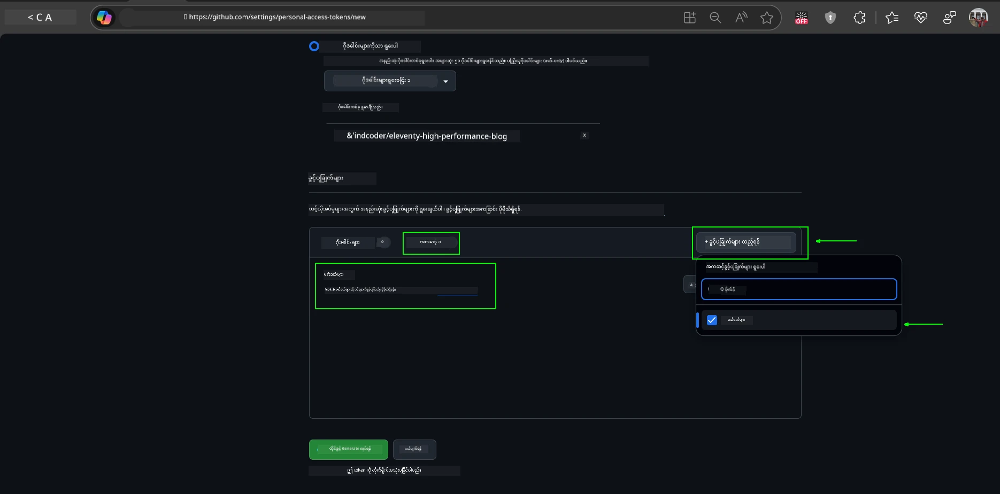
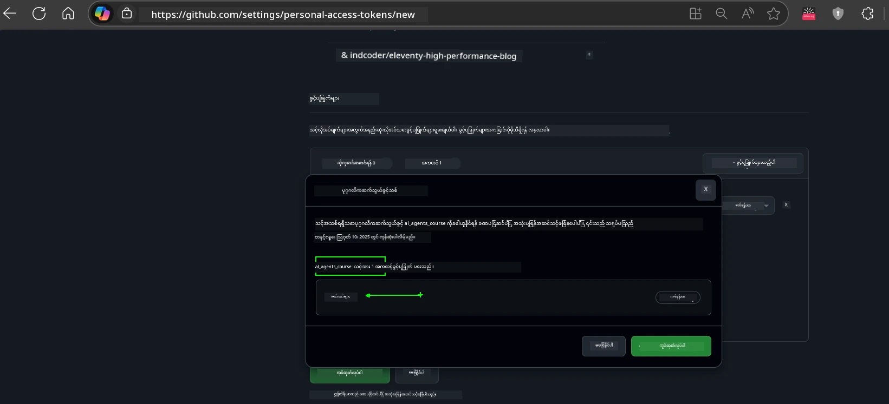
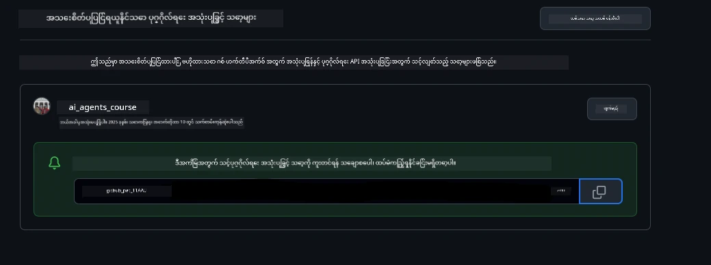
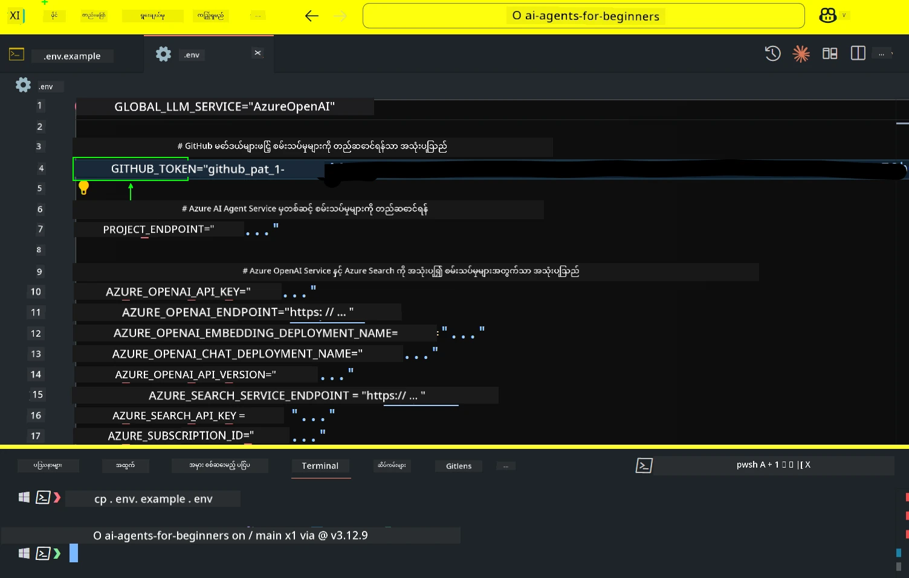
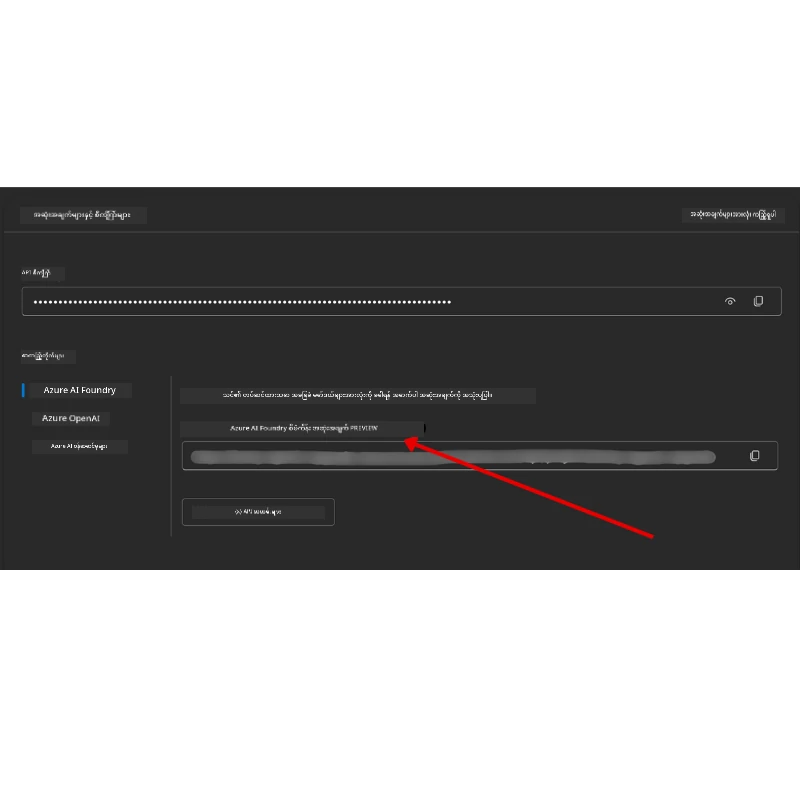

<!--
CO_OP_TRANSLATOR_METADATA:
{
  "original_hash": "63b1a8f6e840df15934935b728e569f0",
  "translation_date": "2025-12-03T15:08:20+00:00",
  "source_file": "00-course-setup/README.md",
  "language_code": "my"
}
-->
# သင်ခန်းစာ စတင်ခြင်း

## မိတ်ဆက်

ဒီသင်ခန်းစာမှာ သင်ခန်းစာရဲ့ ကုဒ်နမူနာတွေကို ဘယ်လိုအသုံးပြုရမလဲဆိုတာကို ဖော်ပြပေးမှာပါ။

## အခြားလေ့လာသူတွေနဲ့ ပေါင်းသင်းပြီး အကူအညီရယူပါ

သင့်ရဲ့ repo ကို clone လုပ်ဖို့မစတင်ခင် [AI Agents For Beginners Discord channel](https://aka.ms/ai-agents/discord) ကို join လုပ်ပါ။ ဒီမှာ setup အတွက် အကူအညီရယူနိုင်သလို သင်ခန်းစာနဲ့ပတ်သက်တဲ့မေးခွန်းတွေမေးနိုင်ပြီး အခြားလေ့လာသူတွေနဲ့ ဆက်သွယ်နိုင်ပါတယ်။

## ဒီ Repo ကို Clone လုပ်ပါ သို့မဟုတ် Fork လုပ်ပါ

စတင်ရန်အတွက် GitHub Repository ကို clone သို့မဟုတ် fork လုပ်ပါ။ ဒါက သင့်ကိုယ်ပိုင် သင်ခန်းစာပစ္စည်းတွေကို ရရှိစေပြီး ကုဒ်တွေကို run, test, ပြင်ဆင်နိုင်စေမှာပါ။

<a href="https://github.com/microsoft/ai-agents-for-beginners/fork" target="_blank">repo ကို fork လုပ်ရန်</a> link ကိုနှိပ်ပါ။

အခု သင့်ရဲ့ fork လုပ်ထားတဲ့ သင်ခန်းစာကို အောက်ပါ link မှာ ရရှိထားပါပြီ။



### Shallow Clone (workshop / Codespaces အတွက် အကြံပြု)

  >Repository အပြည့်အစုံကို download လုပ်တဲ့အခါ file တွေ အများကြီး (~3 GB) ရှိနိုင်ပါတယ်။ Workshop တက်ရောက်ဖို့ သို့မဟုတ် သင်ခန်းစာ folder အနည်းငယ်သာလိုအပ်တဲ့အခါ Shallow clone (သို့မဟုတ် sparse clone) က history အများကြီး download လုပ်ရတာကို ရှောင်ရှားစေပါတယ်။

#### Quick shallow clone — minimal history, all files

အောက်ပါ command တွေမှာ `<your-username>` ကို သင့် fork URL (သို့မဟုတ် upstream URL) နဲ့ အစားထိုးပါ။

နောက်ဆုံး commit history ကိုသာ clone လုပ်ရန် (download size သေး):

```bash|powershell
git clone --depth 1 https://github.com/<your-username>/ai-agents-for-beginners.git
```

တစ်ခုချင်း branch ကို clone လုပ်ရန်:

```bash|powershell
git clone --depth 1 --branch <branch-name> https://github.com/<your-username>/ai-agents-for-beginners.git
```

#### Partial (sparse) clone — minimal blobs + only selected folders

Git 2.25+ version လိုအပ်ပြီး partial clone support ရှိတဲ့ modern Git ကို အကြံပြုပါတယ်။

```bash|powershell
git clone --depth 1 --filter=blob:none --sparse https://github.com/<your-username>/ai-agents-for-beginners.git
```

repo folder ထဲကို ဝင်ပါ:

```bash|powershell
cd ai-agents-for-beginners
```

ထို့နောက် သင်လိုအပ်တဲ့ folder တွေကို ရွေးပါ (အောက်မှာ ဥပမာအနေနဲ့ folder နှစ်ခုကို ဖော်ပြထားပါတယ်):

```bash|powershell
git sparse-checkout set 00-course-setup 01-intro-to-ai-agents
```

clone လုပ်ပြီး file တွေကို စစ်ဆေးပြီးနောက် git history မလိုအပ်ရင် repository metadata ကို ဖျက်ပါ (💀မပြန်ပြင်နိုင် — Git functionality အားလုံးကို ဆုံးရှုံးရပါမယ်: commits, pulls, pushes, history access မရတော့ပါ):

```bash
# zsh/bash
rm -rf .git
```

```powershell
# ပေါဝါရှဲလ်
Remove-Item -Recurse -Force .git
```

#### GitHub Codespaces အသုံးပြုခြင်း (local download အကြီးအကျယ်ကို ရှောင်ရှားရန်အတွက် အကြံပြု)

- [GitHub UI](https://github.com/codespaces) မှာ Codespace အသစ်တစ်ခုကို ဖန်တီးပါ။  

- အသစ်ဖန်တီးထားတဲ့ codespace ရဲ့ terminal မှာ shallow/sparse clone command တွေကို run လုပ်ပြီး သင်လိုအပ်တဲ့ lesson folder တွေကို Codespace workspace ထဲသို့ ယူပါ။
- Optional: Codespaces ထဲမှာ clone လုပ်ပြီးနောက် .git ကို ဖျက်ပြီး အပိုနေရာကို ပြန် reclaim လုပ်ပါ (ဖျက်ရန် command တွေကို အထက်မှာကြည့်ပါ)။
- Note: Repo ကို Codespaces ထဲမှာ တိုက်ရိုက်ဖွင့်ချင်ရင် Codespaces က devcontainer environment ကို တည်ဆောက်ပြီး သင်လိုအပ်တာထက်ပို provision လုပ်နိုင်ပါတယ်။ Codespaces အသစ်တစ်ခုထဲမှာ shallow copy ကို clone လုပ်ခြင်းက disk usage ကိုပိုထိန်းချုပ်နိုင်စေပါတယ်။

#### အကြံပြုချက်များ

- Edit/commit လုပ်ချင်ရင် clone URL ကို သင့် fork နဲ့ အစားထိုးပါ။
- နောက်ပိုင်းမှာ history သို့မဟုတ် file တွေ ပိုလိုအပ်လာရင် fetch လုပ်နိုင်သလို sparse-checkout ကို ပြင်ပြီး folder တွေ ပိုထည့်နိုင်ပါတယ်။

## ကုဒ်ကို Run လုပ်ခြင်း

ဒီသင်ခန်းစာမှာ AI Agents တည်ဆောက်ဖို့ Jupyter Notebooks တွေကို အသုံးပြုပြီး လက်တွေ့လုပ်ဆောင်မှုတွေကို ရယူနိုင်ပါတယ်။

ကုဒ်နမူနာတွေမှာ အောက်ပါ framework တွေကို အသုံးပြုထားပါတယ်။

**GitHub Account လိုအပ်သည် - အခမဲ့**:

1) Semantic Kernel Agent Framework + GitHub Models Marketplace. (semantic-kernel.ipynb) အဖြစ် label လုပ်ထားသည်။
2) AutoGen Framework + GitHub Models Marketplace. (autogen.ipynb) အဖြစ် label လုပ်ထားသည်။

**Azure Subscription လိုအပ်သည်**:

3) Azure AI Foundry + Azure AI Agent Service. (azureaiagent.ipynb) အဖြစ် label လုပ်ထားသည်။

အထက်ပါနမူနာ ၃ မျိုးကို စမ်းသုံးဖို့ အကြံပြုပါတယ်။ သင့်အတွက် အကောင်းဆုံးအလုပ်လုပ်မယ့်နမူနာကို ရွေးချယ်နိုင်ပါတယ်။

သင်ရွေးချယ်တဲ့ option အပေါ်မူတည်ပြီး အောက်မှာဖော်ပြထားတဲ့ setup အဆင့်တွေကို လိုက်နာရပါမယ်။

## လိုအပ်ချက်များ

- Python 3.12+
  - **NOTE**: Python3.12 မရှိရင် install လုပ်ပါ။ requirements.txt file မှာဖော်ပြထားတဲ့ version တွေကို install လုပ်ဖို့ python3.12 ကို အသုံးပြုပြီး venv ဖန်တီးပါ။
  
    >ဥပမာ

    Python venv directory ဖန်တီးပါ:

    ```bash|powershell
    python -m venv venv
    ```

    venv environment ကို activate လုပ်ပါ:

    ```bash
    # zsh/bash
    source venv/bin/activate
    ```
  
    ```dos
    # Command Prompt for Windows
    venv\Scripts\activate
    ```

- .NET 10+: .NET ကို အသုံးပြုထားတဲ့ sample code တွေအတွက် [.NET 10 SDK](https://dotnet.microsoft.com/download/dotnet/10.0) သို့မဟုတ် နောက်ဆုံး version ကို install လုပ်ပါ။ ထို့နောက် install လုပ်ထားတဲ့ .NET SDK version ကို စစ်ဆေးပါ:

    ```bash|powershell
    dotnet --list-sdks
    ```

- GitHub Account - GitHub Models Marketplace ကို အသုံးပြုရန်
- Azure Subscription - Azure AI Foundry ကို အသုံးပြုရန်
- Azure AI Foundry Account - Azure AI Agent Service ကို အသုံးပြုရန်

ဒီ repository ရဲ့ root မှာ `requirements.txt` file ကို ထည့်ထားပြီး Python package တွေကို install လုပ်ဖို့လိုအပ်ပါတယ်။

Terminal မှာ root repository မှာ အောက်ပါ command ကို run လုပ်ပါ:

```bash|powershell
pip install -r requirements.txt
```

Python virtual environment ဖန်တီးခြင်းကို conflicts နဲ့ပြဿနာတွေကို ရှောင်ရှားဖို့ အကြံပြုပါတယ်။

## VSCode Setup

VSCode မှာ Python version မှန်ကန်မှုရှိတာကို သေချာပါစေ။


## GitHub Models ကို အသုံးပြုတဲ့ နမူနာများအတွက် Setup

### အဆင့် ၁: GitHub Personal Access Token (PAT) ကို ရယူပါ

ဒီသင်ခန်းစာမှာ GitHub Models Marketplace ကို အသုံးပြုထားပြီး သင် AI Agents တည်ဆောက်ဖို့ အသုံးပြုမယ့် Large Language Models (LLMs) တွေကို အခမဲ့ access ရရှိစေပါတယ်။

GitHub Models ကို အသုံးပြုဖို့ [GitHub Personal Access Token](https://docs.github.com/en/authentication/keeping-your-account-and-data-secure/managing-your-personal-access-tokens) တစ်ခုကို ဖန်တီးဖို့လိုအပ်ပါတယ်။

GitHub Account ရဲ့ <a href="https://github.com/settings/personal-access-tokens" target="_blank">Personal Access Tokens settings</a> မှာသွားပြီး ဖန်တီးနိုင်ပါတယ်။

Token ဖန်တီးတဲ့အခါ [Principle of Least Privilege](https://docs.github.com/en/get-started/learning-to-code/storing-your-secrets-safely) ကို လိုက်နာပါ။ ဒါက token ကို ဒီသင်ခန်းစာရဲ့ code နမူနာတွေကို run လုပ်ဖို့လိုအပ်တဲ့ permission တွေကိုသာပေးဖို့ အရေးကြီးပါတယ်။

1. **Developer settings** မှာ `Fine-grained tokens` option ကို ရွေးပါ။

   

   ထို့နောက် `Generate new token` ကို ရွေးပါ။

   

2. Token ရဲ့ ရည်ရွယ်ချက်ကို ဖော်ပြတဲ့ အမည်တစ်ခုကို ထည့်ပါ။ နောက်ပိုင်းမှာ အလွယ်တကူသိနိုင်အောင် ဖြစ်စေပါတယ်။

    🔐 Token Duration အကြံပြုချက်

    အကြံပြုထားတဲ့ သက်တမ်း: 30 ရက်
    ပိုမိုလုံခြုံမှုအတွက် သက်တမ်းကို 7 ရက်လိုမျိုး ပိုမိုတိုတောင်းစေဖို့ ရွေးချယ်နိုင်ပါတယ် 🛡️
    သင့်ရဲ့ သင်ခန်းစာ momentum ကို မြှင့်တင်ပြီး သင်ခန်းစာကို အချိန်မီပြီးမြောက်စေဖို့ အကောင်းဆုံးနည်းလမ်းတစ်ခုဖြစ်ပါတယ် 🚀။

    

3. Token ရဲ့ scope ကို ဒီ repository ရဲ့ fork အတွက်သာ ကန့်သတ်ပါ။

    

4. Token ရဲ့ permissions ကို ကန့်သတ်ပါ: **Permissions** အောက်မှာ **Account** tab ကို click လုပ်ပြီး "+ Add permissions" button ကို click လုပ်ပါ။ Dropdown menu တစ်ခုပေါ်လာပါမယ်။ **Models** ကို ရှာပြီး checkbox ကို check လုပ်ပါ။

    

5. Token ကို ဖန်တီးမည့်အခါ လိုအပ်တဲ့ permissions တွေကို verify လုပ်ပါ။ 

6. Token ကို ဖန်တီးမည့်အခါ password manager vault လိုမျိုး secure နေရာမှာ သိမ်းထားဖို့ အဆင်သင့်ဖြစ်နေပါစေ။ Token ကို ဖန်တီးပြီးနောက် ပြန်ကြည့်လို့မရတော့ပါ။ 

သင်ဖန်တီးထားတဲ့ token ကို copy လုပ်ပါ။ အခု သင့် `.env` file ထဲမှာ ထည့်သွင်းပါ။

### အဆင့် ၂: `.env` File ကို ဖန်တီးပါ

Terminal မှာ အောက်ပါ command ကို run လုပ်ပါ။

```bash
# zsh/bash
cp .env.example .env
```

```powershell
# ပေါဝါရှဲလ်
Copy-Item .env.example .env
```

ဒီ command က `.env` file ကို သင့် directory ထဲမှာ ဖန်တီးပြီး environment variable တွေကို ထည့်သွင်းဖို့နေရာပေးပါမယ်။

Token ကို copy လုပ်ပြီး `.env` file ကို သင့်အကြိုက်ဆုံး text editor မှာ ဖွင့်ပါ။ `GITHUB_TOKEN` field ထဲမှာ token ကို paste လုပ်ပါ။



အခု သင့်ရဲ့ သင်ခန်းစာရဲ့ code နမူနာတွေကို run လုပ်နိုင်ပါပြီ။

## Azure AI Foundry နဲ့ Azure AI Agent Service ကို အသုံးပြုတဲ့ နမူနာများအတွက် Setup

### အဆင့် ၁: Azure Project Endpoint ကို ရယူပါ

Azure AI Foundry မှာ hub နဲ့ project တစ်ခုကို ဖန်တီးဖို့ အဆင့်တွေကို [Hub resources overview](https://learn.microsoft.com/azure/ai-foundry/concepts/ai-resources) မှာ ကြည့်ပါ။

Project ကို ဖန်တီးပြီးနောက် project ရဲ့ connection string ကို ရယူဖို့လိုအပ်ပါတယ်။

Azure AI Foundry portal ရဲ့ **Overview** page မှာ သွားပြီး connection string ကို ရယူနိုင်ပါတယ်။



### အဆင့် ၂: `.env` File ကို ဖန်တီးပါ

Terminal မှာ အောက်ပါ command ကို run လုပ်ပါ။

```bash
# zsh/bash
cp .env.example .env
```

```powershell
# ပေါဝါရှဲလ်
Copy-Item .env.example .env
```

ဒီ command က `.env` file ကို သင့် directory ထဲမှာ ဖန်တီးပြီး environment variable တွေကို ထည့်သွင်းဖို့နေရာပေးပါမယ်။

Token ကို copy လုပ်ပြီး `.env` file ကို သင့်အကြိုက်ဆုံး text editor မှာ ဖွင့်ပါ။ `PROJECT_ENDPOINT` field ထဲမှာ token ကို paste လုပ်ပါ။

### အဆင့် ၃: Azure ကို Sign in လုပ်ပါ

လုံခြုံရေးအတွက် [keyless authentication](https://learn.microsoft.com/azure/developer/ai/keyless-connections?tabs=csharp%2Cazure-cli?WT.mc_id=academic-105485-koreyst) ကို အသုံးပြုပြီး Microsoft Entra ID နဲ့ Azure OpenAI ကို authenticate လုပ်ပါ။

Terminal ကို ဖွင့်ပြီး `az login --use-device-code` command ကို run လုပ်ပါ။ Azure account ကို sign in လုပ်ပါ။

Sign in လုပ်ပြီးနောက် terminal မှာ subscription ကို ရွေးပါ။

## အပို Environment Variables - Azure Search နဲ့ Azure OpenAI 

Agentic RAG Lesson - Lesson 5 - မှာ Azure Search နဲ့ Azure OpenAI ကို အသုံးပြုတဲ့ နမူနာတွေပါဝင်ပါတယ်။

ဒီနမူနာတွေကို run လုပ်ချင်ရင် `.env` file ထဲမှာ အောက်ပါ environment variable တွေကို ထည့်သွင်းဖို့လိုအပ်ပါတယ်။

### Overview Page (Project)

- `AZURE_SUBSCRIPTION_ID` - **Overview** page ရဲ့ **Project details** မှာ စစ်ဆေးပါ။

- `AZURE_AI_PROJECT_NAME` - **Overview** page ရဲ့ အပေါ်မှာ project ရဲ့ အမည်ကို ကြည့်ပါ။

- `AZURE_OPENAI_SERVICE` - **Overview** page ရဲ့ **Included capabilities** tab မှာ **Azure OpenAI Service** ကို ရှာပါ။

### Management Center

- `AZURE_OPENAI_RESOURCE_GROUP` - **Management Center** ရဲ့ **Overview** page မှာ **Project properties** ကို သွားပါ။

- `GLOBAL_LLM_SERVICE` - **Connected resources** အောက်မှာ **Azure AI Services** connection name ကို ရှာပါ။ မရှိရင် **Azure portal** ရဲ့ resource group မှာ AI Services resource name ကို စစ်ဆေးပါ။

### Models + Endpoints Page

- `AZURE_OPENAI_EMBEDDING_DEPLOYMENT_NAME` - embedding model (ဥပမာ `text-embedding-ada-002`) ကို ရွေးပြီး model details မှာ **Deployment name** ကို မှတ်သားပါ။

- `AZURE_OPENAI_CHAT_DEPLOYMENT_NAME` - chat model (ဥပမာ `gpt-4o-mini`) ကို ရွေးပြီး model details မှာ **Deployment name** ကို မှတ်သားပါ။

### Azure Portal

- `AZURE_OPENAI_ENDPOINT` - **Azure AI services** ကို ရှာပြီး click လုပ်ပါ။ **Resource Management**, **Keys and Endpoint** ကို သွားပြီး "Azure OpenAI endpoints" မှာ "Language APIs" ဆိုတဲ့ endpoint ကို copy လုပ်ပါ။

- `AZURE_OPENAI_API_KEY` - အဲဒီအပေါ်မှာ KEY 1 သို့မဟုတ် KEY 2 ကို copy လုပ်ပါ။

- `AZURE_SEARCH_SERVICE_ENDPOINT` - **Azure AI Search** resource ကို ရှာပြီး click လုပ်ပါ။ **Overview** page ကို ကြည့်ပါ။

- `AZURE_SEARCH_API_KEY` - **Settings** ကို သွားပြီး **Keys** မှာ primary သို့မဟုတ် secondary admin key ကို copy လုပ်ပါ။

### External Webpage

- `AZURE_OPENAI_API_VERSION` - [API version lifecycle](https://learn.microsoft.com/azure/ai-services/openai/api-version-deprecation#latest-ga-api-release) page ရဲ့ **Latest GA API release** ကို သွားပါ။

### keyless authentication ကို setup လုပ်ပါ

Credential တွေကို hardcode မလုပ်ဘဲ Azure OpenAI နဲ့ keyless connection ကို အသုံးပြုပါ။ `DefaultAzureCredential` ကို import လုပ်ပြီး `DefaultAzureCredential` function ကို later call လုပ်ပါ။

```python
# ပိုင်သွန်
from azure.identity import DefaultAzureCredential, InteractiveBrowserCredential
```

## ဘယ်နေရာမှာပဲ ရှုပ်နေတာလဲ?
ဤစနစ်ကို အလုပ်မလုပ်နိုင်ပါက၊ ကျွန်ုပ်တို့၏ <a href="https://discord.gg/kzRShWzttr" target="_blank">Azure AI Community Discord</a> သို့မဟုတ် <a href="https://github.com/microsoft/ai-agents-for-beginners/issues?WT.mc_id=academic-105485-koreyst" target="_blank">ပြဿနာတစ်ခု ဖန်တီးပါ</a> သို့ ဝင်ရောက်ဆွေးနွေးနိုင်ပါသည်။

## နောက်တစ်ခု သင်ခန်းစာ

ဤသင်တန်းအတွက် ကုဒ်ကို အလုပ်လုပ်ရန် သင်အဆင်သင့်ဖြစ်ပါပြီ။ AI Agents ၏ ကမ္ဘာကြီးကို ပိုမိုလေ့လာရင်း ပျော်ရွှင်ပါစေ! 

[AI Agents နှင့် Agent အသုံးပြုမှု အခွင့်အလမ်းများကို မိတ်ဆက်ခြင်း](../01-intro-to-ai-agents/README.md)

---

<!-- CO-OP TRANSLATOR DISCLAIMER START -->
**ဝက်ဘ်ဆိုက်မှတ်ချက်**:  
ဤစာရွက်စာတမ်းကို AI ဘာသာပြန်ဝန်ဆောင်မှု [Co-op Translator](https://github.com/Azure/co-op-translator) ကို အသုံးပြု၍ ဘာသာပြန်ထားပါသည်။ ကျွန်ုပ်တို့သည် တိကျမှန်ကန်မှုအတွက် ကြိုးစားနေသော်လည်း၊ အလိုအလျောက်ဘာသာပြန်ဆိုမှုများတွင် အမှားများ သို့မဟုတ် မမှန်ကန်မှုများ ပါဝင်နိုင်သည်ကို သတိပြုပါ။ မူလဘာသာစကားဖြင့် ရေးသားထားသော စာရွက်စာတမ်းကို အာဏာတည်သောရင်းမြစ်အဖြစ် သတ်မှတ်သင့်ပါသည်။ အရေးကြီးသော အချက်အလက်များအတွက် လူ့ဘာသာပြန်ပညာရှင်များကို အသုံးပြုရန် အကြံပြုပါသည်။ ဤဘာသာပြန်ကို အသုံးပြုခြင်းမှ ဖြစ်ပေါ်လာသော နားလည်မှုမှားများ သို့မဟုတ် အဓိပ္ပာယ်မှားများအတွက် ကျွန်ုပ်တို့သည် တာဝန်မယူပါ။
<!-- CO-OP TRANSLATOR DISCLAIMER END -->