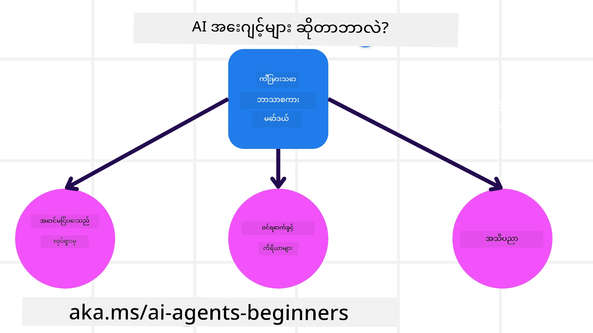
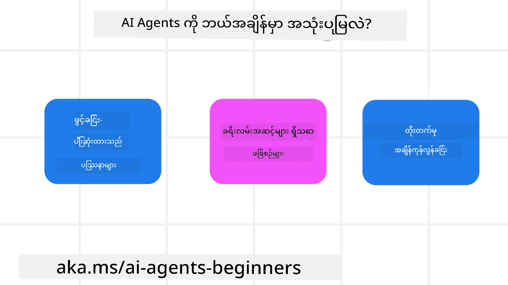

<!--
CO_OP_TRANSLATOR_METADATA:
{
  "original_hash": "cdd28bc00816d2773bb2b5968d782abc",
  "translation_date": "2025-11-11T11:45:20+00:00",
  "source_file": "01-intro-to-ai-agents/README.md",
  "language_code": "my"
}
-->

> _(အထက်ပါပုံကိုနှိပ်ပြီး ဒီသင်ခန်းစာရဲ့ ဗီဒီယိုကို ကြည့်ပါ)_

# AI Agent များနှင့် Agent အသုံးပြုမှုများအကြောင်းမိတ်ဆက်

"AI Agents for Beginners" သင်ခန်းစာသို့ ကြိုဆိုပါတယ်! ဒီသင်ခန်းစာက AI Agent များတည်ဆောက်ရန်အတွက် အခြေခံသိမှတ်စရာများနှင့် လက်တွေ့နမူနာများကို ပေးစွမ်းပါသည်။

<a href="https://discord.gg/kzRShWzttr" target="_blank">Azure AI Discord Community</a> တွင် ပါဝင်ပြီး သင်ခန်းစာနှင့်ပတ်သက်သော မေးခွန်းများကို မေးမြန်းရန်နှင့် အခြားသော သင်ယူသူများနှင့် AI Agent တည်ဆောက်သူများနှင့် တွေ့ဆုံပါ။

ဒီသင်ခန်းစာကို စတင်ရန်အတွက် AI Agent များအကြောင်းနှင့် ကျွန်ုပ်တို့တည်ဆောက်သော အက်ပလီကေးရှင်းများနှင့် လုပ်ငန်းစဉ်များတွင် အဘယ်လိုအသုံးပြုနိုင်သည်ကို ပိုမိုနားလည်ရန် စတင်ပါမည်။

## မိတ်ဆက်

ဒီသင်ခန်းစာတွင် ပါဝင်သောအကြောင်းအရာများမှာ -

- AI Agent များဆိုတာဘာလဲ၊ အမျိုးအစားများက ဘာတွေလဲ?
- AI Agent များအတွက် အကောင်းဆုံးအသုံးပြုမှုများက ဘာတွေလဲ၊ ကျွန်ုပ်တို့ကို ဘယ်လိုအကျိုးကျေးဇူးပေးနိုင်မလဲ?
- Agentic Solutions တည်ဆောက်ရာတွင် အခြေခံအဆင့်များက ဘာတွေလဲ?

## သင်ယူရမည့်ရည်မှန်းချက်များ
ဒီသင်ခန်းစာပြီးဆုံးပြီးနောက်တွင် သင်သည် -

- AI Agent အကြောင်းအရာများကို နားလည်ပြီး အခြား AI ဖြေရှင်းချက်များနှင့် ဘယ်လိုကွဲပြားမှုရှိသည်ကို သိရှိနိုင်မည်။
- AI Agent များကို အကျိုးရှိစွာ အသုံးချနိုင်မည်။
- အသုံးပြုသူများနှင့် ဖောက်သည်များအတွက် Agentic Solutions များကို ထိရောက်စွာ ဒီဇိုင်းဆွဲနိုင်မည်။

## AI Agent များနှင့် AI Agent အမျိုးအစားများကို သတ်မှတ်ခြင်း

### AI Agent များဆိုတာဘာလဲ?

AI Agent များသည် **စနစ်များ**ဖြစ်ပြီး **Large Language Models(LLMs)** ကို **တိုးချဲ့စွမ်းရည်များ**ပေးခြင်းအားဖြင့် **တက်ကြွစွာ လုပ်ဆောင်နိုင်စေခြင်း**ကို အကောင်အထည်ဖော်ပေးသည်။ 

ဒီအဓိပ္ပါယ်ကို အပိုင်းပိုင်းခွဲပြီး ရှင်းပြပါမည် -

- **စနစ်** - Agent များကို တစ်ခုတည်းသောအစိတ်အပိုင်းအဖြစ်မဟုတ်ဘဲ အစိတ်အပိုင်းများစွာပါဝင်သော စနစ်အဖြစ် စဉ်းစားရန် အရေးကြီးသည်။ AI Agent တစ်ခု၏ အခြေခံအစိတ်အပိုင်းများမှာ -
  - **ပတ်ဝန်းကျင်** - AI Agent အလုပ်လုပ်နေသော သတ်မှတ်ထားသော နေရာ။ ဥပမာအားဖြင့် ခရီးသွားစာရင်းသွင်းမှု AI Agent ရှိပါက ပတ်ဝန်းကျင်သည် AI Agent အလုပ်လုပ်ရန် အသုံးပြုသော ခရီးသွားစာရင်းသွင်းမှုစနစ်ဖြစ်နိုင်သည်။
  - **အာရုံခံကိရိယာများ** - ပတ်ဝန်းကျင်တွင် အချက်အလက်များရှိပြီး တုံ့ပြန်မှုများပေးသည်။ AI Agent များသည် ပတ်ဝန်းကျင်၏ လက်ရှိအခြေအနေအကြောင်းကို အချက်အလက်များစုဆောင်းရန်နှင့် အဓိပ္ပါယ်ဖော်ရန် အာရုံခံကိရိယာများကို အသုံးပြုသည်။ ခရီးသွားစာရင်းသွင်းမှု Agent အတွက် ခရီးသွားစာရင်းသွင်းမှုစနစ်သည် ဟိုတယ်ရရှိနိုင်မှု သို့မဟုတ် လေယာဉ်လက်မှတ်ဈေးနှုန်းများကို ပေးနိုင်သည်။
  - **လုပ်ဆောင်သူများ** - AI Agent သည် ပတ်ဝန်းကျင်၏ လက်ရှိအခြေအနေကို ရရှိပြီးနောက် လက်ရှိအလုပ်အတွက် ပတ်ဝန်းကျင်ကို ပြောင်းလဲရန် ဘာလုပ်ဆောင်မည်ကို ဆုံးဖြတ်သည်။ ခရီးသွားစာရင်းသွင်းမှု Agent အတွက် အသုံးပြုသူအတွက် ရရှိနိုင်သောအခန်းကို စာရင်းသွင်းခြင်းဖြစ်နိုင်သည်။

**Large Language Models** - Agent အကြောင်းအရာသည် LLM များဖန်တီးမီကတည်းက ရှိခဲ့သည်။ LLM များနှင့် AI Agent များတည်ဆောက်ခြင်း၏ အားသာချက်မှာ လူ့ဘာသာစကားနှင့် ဒေတာကို အဓိပ္ပါယ်ဖော်နိုင်စွမ်းဖြစ်သည်။ ဒီစွမ်းရည်က LLM များကို ပတ်ဝန်းကျင်အချက်အလက်များကို အဓိပ္ပါယ်ဖော်ရန်နှင့် ပတ်ဝန်းကျင်ကို ပြောင်းလဲရန် အစီအစဉ်တစ်ခုကို သတ်မှတ်ရန် အခွင့်အလမ်းပေးသည်။

**လုပ်ဆောင်မှုများ** - AI Agent စနစ်များအပြင် LLM များသည် အသုံးပြုသူ၏ အကြောင်းအရာကို အခြေခံပြီး အကြောင်းအရာ သို့မဟုတ် အချက်အလက်ကို ဖန်တီးခြင်းဖြင့်သာ အကန့်အသတ်ရှိသည်။ AI Agent စနစ်များတွင် LLM များသည် အသုံးပြုသူ၏ တောင်းဆိုမှုကို အဓိပ္ပါယ်ဖော်ပြီး ပတ်ဝန်းကျင်တွင် ရရှိနိုင်သော ကိရိယာများကို အသုံးပြုခြင်းဖြင့် အလုပ်များကို ပြီးမြောက်စေသည်။

**ကိရိယာများကို အသုံးပြုနိုင်မှု** - LLM ရရှိနိုင်သော ကိရိယာများသည် ၁) ၎င်းအလုပ်လုပ်နေသော ပတ်ဝန်းကျင်နှင့် ၂) AI Agent တည်ဆောက်သူအားဖြင့် သတ်မှတ်ထားသည်။ ခရီးသွား Agent အတွက် ဥပမာအားဖြင့် Agent ၏ ကိရိယာများသည် စာရင်းသွင်းမှုစနစ်တွင် ရရှိနိုင်သော လုပ်ဆောင်မှုများဖြင့် အကန့်အသတ်ရှိပြီး၊ သို့မဟုတ် Developer သည် Agent ၏ ကိရိယာအသုံးပြုမှုကို လေယာဉ်များအထိ အကန့်အသတ်ထားနိုင်သည်။

**မှတ်ဉာဏ်+အသိပညာ** - မှတ်ဉာဏ်သည် အသုံးပြုသူနှင့် Agent အကြား စကားဝိုင်း၏ အကြောင်းအရာတွင် အတိုချုံးဖြစ်နိုင်သည်။ ရေရှည်တွင် ပတ်ဝန်းကျင်မှ ပေးထားသော အချက်အလက်များအပြင် AI Agent များသည် အခြားစနစ်များ၊ ဝန်ဆောင်မှုများ၊ ကိရိယာများနှင့် အခြား Agent များမှ အသိပညာကိုလည်း ရယူနိုင်သည်။ ခရီးသွား Agent အတွက် ဥပမာအားဖြင့် ဒီအသိပညာသည် ဖောက်သည်ဒေတာဘေ့စ်တွင် ရှိသော အသုံးပြုသူ၏ ခရီးသွားနှစ်သက်မှုအကြောင်းအရာဖြစ်နိုင်သည်။

### Agent အမျိုးအစားများ

AI Agent များ၏ အထွေထွေသတ်မှတ်ချက်ကို ရရှိပြီးနောက် ခရီးသွားစာရင်းသွင်းမှု AI Agent တွင် အထူးသတ်မှတ်ထားသော Agent အမျိုးအစားများနှင့် ၎င်းတို့ကို ဘယ်လိုအသုံးပြုမည်ကို ကြည့်ပါ။

| **Agent အမျိုးအစား**          | **ဖော်ပြချက်**                                                                                                                       | **ဥပမာ**                                                                                                                                                                                                                   |
| ----------------------------- | ------------------------------------------------------------------------------------------------------------------------------------- | ----------------------------------------------------------------------------------------------------------------------------------------------------------------------------------------------------------------------------- |
| **Simple Reflex Agents**      | သတ်မှတ်ထားသော စည်းကမ်းများအပေါ် အခြေခံပြီး ချက်ချင်းလုပ်ဆောင်မှုများ ပြုလုပ်သည်။                                                                                  | ခရီးသွား Agent သည် အီးမေးလ်၏ အကြောင်းအရာကို အဓိပ္ပါယ်ဖော်ပြီး ခရီးသွားတိုင်ကြားမှုများကို ဖောက်သည်ဝန်ဆောင်မှုသို့ ပို့သည်။                                                                                                                          |
| **Model-Based Reflex Agents** | ကမ္ဘာ့မော်ဒယ်နှင့် မော်ဒယ်၏ ပြောင်းလဲမှုများအပေါ် အခြေခံပြီး လုပ်ဆောင်မှုများ ပြုလုပ်သည်။                                                              | ခရီးသွား Agent သည် သမိုင်းဈေးနှုန်းဒေတာကို အသုံးပြု၍ ဈေးနှုန်းပြောင်းလဲမှုများကို ဦးစားပေးသည်။                                                                                                             |
| **Goal-Based Agents**         | သတ်မှတ်ထားသော ရည်မှန်းချက်များကို ရှင်းလင်းပြီး ရောက်ရှိရန် လိုအပ်သော လုပ်ဆောင်မှုများကို ဆုံးဖြတ်ခြင်းဖြင့် အစီအစဉ်များ ဖန်တီးသည်။                                  | ခရီးသွား Agent သည် လက်ရှိနေရာမှ သွားရောက်လိုသောနေရာသို့ ခရီးသွားစီစဉ်မှုများ (ကား၊ အများပြည်သူသယ်ယူပို့ဆောင်ရေး၊ လေယာဉ်) ကို ဆုံးဖြတ်ခြင်းဖြင့် ခရီးစဉ်ကို စီစဉ်သည်။                                                                                |
| **Utility-Based Agents**      | နှစ်သက်မှုများကို စဉ်းစားပြီး ရည်မှန်းချက်များကို ရောက်ရှိရန် အကျိုးကျေးဇူးများကို ကိန်းဂဏန်းအဖြစ် တိုင်းတာသည်။                                               | ခရီးသွား Agent သည် ခရီးစဉ်စာရင်းသွင်းရာတွင် အဆင်ပြေမှုနှင့် ကုန်ကျစရိတ်ကို တိုင်းတာခြင်းဖြင့် အကျိုးကျေးဇူးကို အများဆုံးရရှိစေသည်။                                                                                                                                          |
| **Learning Agents**           | တုံ့ပြန်မှုများကို အခြေခံပြီး အချိန်ကြာလာသည်နှင့်အမျှ တုံ့ပြန်မှုများကို ပြင်ဆင်ခြင်းဖြင့် တိုးတက်မှုရှိသည်။                                                        | ခရီးသွား Agent သည် ခရီးစဉ်ပြီးဆုံးပြီးနောက် စစ်တမ်းများမှ ဖောက်သည်တုံ့ပြန်မှုကို အသုံးပြု၍ အနာဂတ်စာရင်းသွင်းမှုများကို ပြင်ဆင်ခြင်းဖြင့် တိုးတက်မှုရှိသည်။                                                                                                               |
| **Hierarchical Agents**       | အဆင့်မြင့် Agent များသည် အလုပ်များကို အဆင့်နိမ့် Agent များအတွက် အလုပ်ခွဲခြင်းဖြင့် အဆင့်တစ်ဆင့်စနစ်တွင် Agent များစီစဉ်ထားသည်။ | ခရီးသွား Agent သည် ခရီးစဉ်ကို ဖျက်သိမ်းခြင်းအား အလုပ်ခွဲခြင်းဖြင့် (ဥပမာအားဖြင့် သတ်မှတ်ထားသော စာရင်းသွင်းမှုများကို ဖျက်သိမ်းခြင်း) အဆင့်နိမ့် Agent များကို အလုပ်များကို ပြီးမြောက်စေပြီး အဆင့်မြင့် Agent သို့ ပြန်လည်တင်ပြသည်။                                     |
| **Multi-Agent Systems (MAS)** | Agent များသည် လွတ်လပ်စွာ အလုပ်များကို ပြီးမြောက်စေပြီး ပူးပေါင်းမှု သို့မဟုတ် ယှဉ်ပြိုင်မှုဖြင့် လုပ်ဆောင်သည်။                                                           | ပူးပေါင်းမှု - Agent များစွာသည် ဟိုတယ်၊ လေယာဉ်နှင့် အပန်းဖြေဝန်ဆောင်မှုများကို စာရင်းသွင်းသည်။ ယှဉ်ပြိုင်မှု - Agent များစွာသည် ဖောက်သည်များကို ဟိုတယ်တွင် စာရင်းသွင်းရန် ဟိုတယ်စာရင်းသွင်းမှု ပြက္ခဒိန်ကို စီမံခန့်ခွဲပြီး ယှဉ်ပြိုင်သည်။ |

## AI Agent များကို ဘယ်အချိန်တွင် အသုံးပြုမည်?

အထက်ပါအပိုင်းတွင် ခရီးသွား Agent အသုံးပြုမှုကို ခရီးသွားစာရင်းသွင်းမှု၏ အခြေအနေများတွင် Agent အမျိုးအစားများကို ဘယ်လိုအသုံးပြုနိုင်သည်ကို ရှင်းပြခဲ့သည်။ ဒီသင်ခန်းစာတစ်လျှောက်လုံး ဒီအက်ပလီကေးရှင်းကို ဆက်လက်အသုံးပြုပါမည်။

AI Agent များကို အသုံးပြုရန် အကောင်းဆုံးဖြစ်သော အသုံးပြုမှုအမျိုးအစားများကို ကြည့်ပါ -

- **ပွင့်လင်းသော ပြဿနာများ** - workflow တစ်ခုတွင် အမြဲတမ်း hardcoded မဖြစ်နိုင်သောကြောင့် LLM ကို လိုအပ်သောအဆင့်များကို ဆုံးဖြတ်ရန် ခွင့်ပြုခြင်း။
- **အဆင့်များစွာပါဝင်သော လုပ်ငန်းစဉ်များ** - AI Agent သည် tool များ သို့မဟုတ် အချက်အလက်များကို တစ်ကြိမ်တည်း retrieve လုပ်ခြင်းမဟုတ်ဘဲ အဆင့်များစွာတွင် အသုံးပြုရန် လိုအပ်သော ရှုပ်ထွေးမှုရှိသော အလုပ်များ။
- **အချိန်ကြာလာသည်နှင့်အမျှ တိုးတက်မှုရှိခြင်း** - Agent သည် ပတ်ဝန်းကျင် သို့မဟုတ် အသုံးပြုသူများမှ တုံ့ပြန်မှုကို ရရှိခြင်းအားဖြင့် utility ပိုမိုကောင်းမွန်စေရန် တိုးတက်မှုရှိသော အလုပ်များ။

AI Agent များကို အသုံးပြုခြင်းနှင့်ပတ်သက်သော အခြားစဉ်းစားရန်အချက်များကို Building Trustworthy AI Agents သင်ခန်းစာတွင် ဖော်ပြပါမည်။

## Agentic Solutions အခြေခံအချက်များ

### Agent တည်ဆောက်ခြင်း

AI Agent စနစ်တစ်ခုကို ဒီဇိုင်းဆွဲရာတွင် ပထမဆုံးအဆင့်မှာ tool များ၊ လုပ်ဆောင်မှုများနှင့် အပြုအမူများကို သတ်မှတ်ခြင်းဖြစ်သည်။ ဒီသင်ခန်းစာတွင် **Azure AI Agent Service** ကို အသုံးပြု၍ Agent များကို သတ်မှတ်ခြင်းအပေါ် အာရုံစိုက်ပါမည်။ ၎င်းသည် အောက်ပါအတိုင်း အင်္ဂါရပ်များကို ပေးသည် -

- OpenAI, Mistral, Llama ကဲ့သို့သော Open Models ရွေးချယ်ခြင်း
- Tripadvisor ကဲ့သို့သော ပေးသွင်းသူများမှ Licensed Data ကို အသုံးပြုခြင်း
- OpenAPI 3.0 tool များကို စံပြအဖြစ် အသုံးပြုခြင်း

### Agentic Patterns

LLM များနှင့် ဆက်သွယ်မှုသည် prompt များဖြင့် ဖြစ်သည်။ AI Agent များ၏ semi-autonomous လုပ်ဆောင်မှုအနေအထားကြောင့် ပတ်ဝန်းကျင်တွင် ပြောင်းလဲမှုဖြစ်ပြီးနောက် LLM ကို လက်စွဲ prompt ပြန်လုပ်ရန် မဖြစ်နိုင်သို့မဟုတ် မလိုအပ်နိုင်ပါ။ **Agentic Patterns** ကို အသုံးပြု၍ LLM ကို အဆင့်များစွာတွင် prompt ပြုလုပ်ရန် ပိုမိုကျယ်ပြန့်သောနည်းလမ်းဖြင့် ပြုလုပ်နိုင်သည်။

ဒီသင်ခန်းစာကို လက်ရှိ လူကြိုက်များသော Agentic Patterns အချို့အပေါ် အခြေခံထားသည်။

### Agentic Frameworks

Agentic Frameworks များသည် Developer များကို Agentic Patterns များကို ကုဒ်ဖြင့် အကောင်အထည်ဖော်ရန် ခွင့်ပြုသည်။ ဒီ Frameworks များသည် template များ၊ plugin များနှင့် tool များကို ပေးပြီး AI Agent များအကြား ပိုမိုကောင်းမွန်သော ပူးပေါင်းဆောင်ရွက်မှုအတွက် အခွင့်အလမ်းပေးသည်။ ဒီအကျိုးကျေးဇူးများသည် AI Agent စနစ်များ၏ အမြင်ပိုမိုကောင်းမွန်မှုနှင့် troubleshooting အတွက် စွမ်းရည်များကို ပေးသည်။

ဒီသင်ခန်းစာတွင် သုတေသနအခြေခံ AutoGen framework နှင့် Semantic Kernel မှ ထုတ်လုပ်မှုအဆင့်

---

<!-- CO-OP TRANSLATOR DISCLAIMER START -->
**အကြောင်းကြားချက်**:  
ဤစာရွက်စာတမ်းကို AI ဘာသာပြန်ဝန်ဆောင်မှု [Co-op Translator](https://github.com/Azure/co-op-translator) ကို အသုံးပြု၍ ဘာသာပြန်ထားပါသည်။ ကျွန်ုပ်တို့သည် တိကျမှုအတွက် ကြိုးစားနေသော်လည်း အလိုအလျောက် ဘာသာပြန်မှုများတွင် အမှားများ သို့မဟုတ် မတိကျမှုများ ပါဝင်နိုင်သည်ကို သတိပြုပါ။ မူရင်းဘာသာစကားဖြင့် ရေးသားထားသော စာရွက်စာတမ်းကို အာဏာတရားရှိသော အရင်းအမြစ်အဖြစ် သတ်မှတ်သင့်ပါသည်။ အရေးကြီးသော အချက်အလက်များအတွက် လူသားပညာရှင်များမှ ဘာသာပြန်မှုကို အကြံပြုပါသည်။ ဤဘာသာပြန်မှုကို အသုံးပြုခြင်းမှ ဖြစ်ပေါ်လာသော အလွဲအမှားများ သို့မဟုတ် အနားလွဲမှုများအတွက် ကျွန်ုပ်တို့သည် တာဝန်မယူပါ။
<!-- CO-OP TRANSLATOR DISCLAIMER END -->