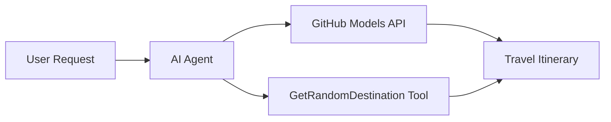

<!--
CO_OP_TRANSLATOR_METADATA:
{
  "original_hash": "5f351412e934f0833c8c821a0a60efaf",
  "translation_date": "2025-11-13T14:33:23+00:00",
  "source_file": "01-intro-to-ai-agents/code_samples/01-dotnet-agent-framework.md",
  "language_code": "my"
}
-->
# 🌍 Microsoft Agent Framework (.NET) ဖြင့် AI ခရီးသွားအကျိုးဆောင်

## 📋 အခြေအနေအကျဉ်းချုပ်

ဤနမူနာသည် Microsoft Agent Framework for .NET ကို အသုံးပြု၍ ဉာဏ်ရည်ရှိသော ခရီးစီမံကိန်းရေးဆွဲသူကို တည်ဆောက်ပုံကို ပြသသည်။ အဆိုပါ agent သည် ကမ္ဘာတစ်ဝှမ်းရှိ အခွင့်အလမ်းများအတွက် ကိုယ်ပိုင်နေ့စဉ်ခရီးစဉ်များကို အလိုအလျောက် ဖန်တီးပေးနိုင်သည်။

### အဓိကစွမ်းရည်များ:

- 🎲 **အခွင့်အလမ်းရွေးချယ်မှု**: အပန်းဖြေခရီးစဉ်များကို ရွေးချယ်ရန် အထူး tool ကို အသုံးပြုသည်
- 🗺️ **ဉာဏ်ရည်ရှိသော ခရီးစဉ်စီမံကိန်းရေးဆွဲမှု**: နေ့စဉ်ခရီးစဉ်အသေးစိတ်များကို ဖန်တီးပေးသည်
- 🔄 **အချိန်နှင့်တပြေးညီ စီးဆင်းမှု**: ချက်ချင်းနှင့် စီးဆင်းမှုတစ်ခုလုံးကို ပံ့ပိုးပေးသည်
- 🛠️ **အထူး tool ပေါင်းစပ်မှု**: agent ၏စွမ်းရည်များကို တိုးချဲ့ပုံကို ပြသသည်

## 🔧 နည်းပညာဆောက်လုပ်ပုံ

### အဓိကနည်းပညာများ

- **Microsoft Agent Framework**: .NET အတွက် AI agent ဖွံ့ဖြိုးတိုးတက်မှု၏ နောက်ဆုံးထုတ်
- **GitHub Models Integration**: GitHub ၏ AI model inference service ကို အသုံးပြုသည်
- **OpenAI API Compatibility**: OpenAI client libraries ကို အထူး endpoint များနှင့်အတူ အသုံးပြုသည်
- **Secure Configuration**: API key များကို ပတ်ဝန်းကျင်အခြေခံစီမံခန့်ခွဲမှု

### အဓိကအစိတ်အပိုင်းများ

1. **AIAgent**: စကားဝိုင်းစီးဆင်းမှုကို စီမံခန့်ခွဲသော အဓိက agent orchestrator
2. **Custom Tools**: agent အတွက် ရရှိနိုင်သော `GetRandomDestination()` function
3. **Chat Client**: GitHub Models-backed စကားဝိုင်း interface
4. **Streaming Support**: အချိန်နှင့်တပြေးညီ တုံ့ပြန်မှုဖန်တီးနိုင်စွမ်း

### ပေါင်းစပ်ပုံစံ



## 🚀 စတင်အသုံးပြုခြင်း

### လိုအပ်ချက်များ

- [.NET 10 SDK](https://dotnet.microsoft.com/download/dotnet/10.0) သို့မဟုတ် အထက်
- [GitHub Models API access token](https://docs.github.com/github-models/github-models-at-scale/using-your-own-api-keys-in-github-models)

### လိုအပ်သော ပတ်ဝန်းကျင် variable များ

```bash
# zsh/bash
export GH_TOKEN=<your_github_token>
export GH_ENDPOINT=https://models.github.ai/inference
export GH_MODEL_ID=openai/gpt-5-mini
```

```powershell
# PowerShell
$env:GH_TOKEN = "<your_github_token>"
$env:GH_ENDPOINT = "https://models.github.ai/inference"
$env:GH_MODEL_ID = "openai/gpt-5-mini"
```

### နမူနာကုဒ်

ကုဒ်နမူနာကို run လုပ်ရန်,

```bash
# zsh/bash
chmod +x ./01-dotnet-agent-framework.cs
./01-dotnet-agent-framework.cs
```

သို့မဟုတ် dotnet CLI ကို အသုံးပြု၍:

```bash
dotnet run ./01-dotnet-agent-framework.cs
```

`01-dotnet-agent-framework.cs` တွင် အပြည့်အစုံကုဒ်ကို ကြည့်ပါ။

```csharp
#!/usr/bin/dotnet run

#:package Microsoft.Extensions.AI@9.*
#:package Microsoft.Agents.AI.OpenAI@1.*-*

using System.ClientModel;
using System.ComponentModel;

using Microsoft.Agents.AI;
using Microsoft.Extensions.AI;

using OpenAI;

// Tool Function: Random Destination Generator
// This static method will be available to the agent as a callable tool
// The [Description] attribute helps the AI understand when to use this function
// This demonstrates how to create custom tools for AI agents
[Description("Provides a random vacation destination.")]
static string GetRandomDestination()
{
    // List of popular vacation destinations around the world
    // The agent will randomly select from these options
    var destinations = new List<string>
    {
        "Paris, France",
        "Tokyo, Japan",
        "New York City, USA",
        "Sydney, Australia",
        "Rome, Italy",
        "Barcelona, Spain",
        "Cape Town, South Africa",
        "Rio de Janeiro, Brazil",
        "Bangkok, Thailand",
        "Vancouver, Canada"
    };

    // Generate random index and return selected destination
    // Uses System.Random for simple random selection
    var random = new Random();
    int index = random.Next(destinations.Count);
    return destinations[index];
}

// Extract configuration from environment variables
// Retrieve the GitHub Models API endpoint, defaults to https://models.github.ai/inference if not specified
// Retrieve the model ID, defaults to openai/gpt-5-mini if not specified
// Retrieve the GitHub token for authentication, throws exception if not specified
var github_endpoint = Environment.GetEnvironmentVariable("GH_ENDPOINT") ?? "https://models.github.ai/inference";
var github_model_id = Environment.GetEnvironmentVariable("GH_MODEL_ID") ?? "openai/gpt-5-mini";
var github_token = Environment.GetEnvironmentVariable("GH_TOKEN") ?? throw new InvalidOperationException("GH_TOKEN is not set.");

// Configure OpenAI Client Options
// Create configuration options to point to GitHub Models endpoint
// This redirects OpenAI client calls to GitHub's model inference service
var openAIOptions = new OpenAIClientOptions()
{
    Endpoint = new Uri(github_endpoint)
};

// Initialize OpenAI Client with GitHub Models Configuration
// Create OpenAI client using GitHub token for authentication
// Configure it to use GitHub Models endpoint instead of OpenAI directly
var openAIClient = new OpenAIClient(new ApiKeyCredential(github_token), openAIOptions);

// Create AI Agent with Travel Planning Capabilities
// Initialize OpenAI client, get chat client for specified model, and create AI agent
// Configure agent with travel planning instructions and random destination tool
// The agent can now plan trips using the GetRandomDestination function
AIAgent agent = openAIClient
    .GetChatClient(github_model_id)
    .CreateAIAgent(
        instructions: "You are a helpful AI Agent that can help plan vacations for customers at random destinations",
        tools: [AIFunctionFactory.Create(GetRandomDestination)]
    );

// Execute Agent: Plan a Day Trip
// Run the agent with streaming enabled for real-time response display
// Shows the agent's thinking and response as it generates the content
// Provides better user experience with immediate feedback
await foreach (var update in agent.RunStreamingAsync("Plan me a day trip"))
{
    await Task.Delay(10);
    Console.Write(update);
}
```

## 🎓 အဓိကသိရှိစရာများ

1. **Agent Architecture**: Microsoft Agent Framework သည် .NET တွင် AI agent များတည်ဆောက်ရန် type-safe နည်းလမ်းကို ပေးသည်
2. **Tool Integration**: `[Description]` attribute ဖြင့် အလှဆင်ထားသော function များသည် agent အတွက် tool များအဖြစ် ရရှိနိုင်သည်
3. **Configuration Management**: ပတ်ဝန်းကျင် variable များနှင့် လုံခြုံ credential စီမံခန့်ခွဲမှုသည် .NET အကောင်းဆုံးအလေ့အကျင့်များကို လိုက်နာသည်
4. **OpenAI Compatibility**: GitHub Models integration သည် OpenAI-compatible API များနှင့် အဆင်ပြေစွာ လုပ်ဆောင်နိုင်သည်

## 🔗 ထပ်မံသိရှိရန်အရင်းအမြစ်များ

- [Microsoft Agent Framework Documentation](https://learn.microsoft.com/agent-framework)
- [GitHub Models Marketplace](https://github.com/marketplace?type=models)
- [Microsoft.Extensions.AI](https://learn.microsoft.com/dotnet/ai/microsoft-extensions-ai)
- [.NET Single File Apps](https://devblogs.microsoft.com/dotnet/announcing-dotnet-run-app)

---

<!-- CO-OP TRANSLATOR DISCLAIMER START -->
**အကြောင်းကြားချက်**:  
ဤစာရွက်စာတမ်းကို AI ဘာသာပြန်ဝန်ဆောင်မှု [Co-op Translator](https://github.com/Azure/co-op-translator) ကို အသုံးပြု၍ ဘာသာပြန်ထားပါသည်။ ကျွန်ုပ်တို့သည် တိကျမှုအတွက် ကြိုးစားနေသော်လည်း အလိုအလျောက် ဘာသာပြန်မှုများတွင် အမှားများ သို့မဟုတ် မမှန်ကန်မှုများ ပါဝင်နိုင်သည်ကို သတိပြုပါ။ မူရင်းဘာသာစကားဖြင့် ရေးသားထားသော စာရွက်စာတမ်းကို အာဏာတရားရှိသော အရင်းအမြစ်အဖြစ် သတ်မှတ်သင့်ပါသည်။ အရေးကြီးသော အချက်အလက်များအတွက် လူက ဘာသာပြန်မှုကို အကြံပြုပါသည်။ ဤဘာသာပြန်မှုကို အသုံးပြုခြင်းမှ ဖြစ်ပေါ်လာသော အလွဲအမှားများ သို့မဟုတ် အနားလွဲမှုများအတွက် ကျွန်ုပ်တို့သည် တာဝန်မယူပါ။
<!-- CO-OP TRANSLATOR DISCLAIMER END -->