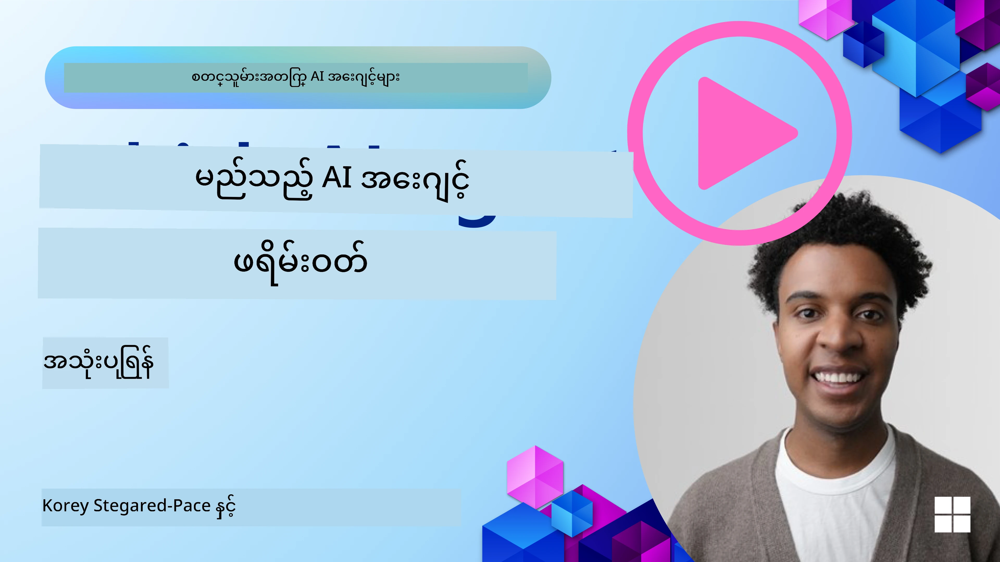

<!--
CO_OP_TRANSLATOR_METADATA:
{
  "original_hash": "7120197753abacc827b64ac2d5d6966f",
  "translation_date": "2025-11-13T14:35:00+00:00",
  "source_file": "02-explore-agentic-frameworks/README.md",
  "language_code": "my"
}
-->
[](https://youtu.be/ODwF-EZo_O8?si=1xoy_B9RNQfrYdF7)

> _(ဤသင်ခန်းစာ၏ဗီဒီယိုကိုကြည့်ရန် အထက်ပါပုံကိုနှိပ်ပါ)_

# AI Agent Frameworks ကိုလေ့လာပါ

AI Agent Frameworks ဆိုသည်မှာ AI အေးဂျင့်များကို ဖန်တီးခြင်း၊ တင်သွင်းခြင်းနှင့် စီမံခန့်ခွဲခြင်းကို လွယ်ကူစေရန် ရည်ရွယ်ထားသော ဆော့ဖ်ဝဲပလက်ဖောင်းများဖြစ်သည်။ ဤ Frameworks များသည် ဖွံ့ဖြိုးတိုးတက်သော AI စနစ်များကို ဖန်တီးရာတွင် အဆင်ပြေစေသော အစိတ်အပိုင်းများ၊ အဆင့်မြှင့်တင်မှုများနှင့် ကိရိယာများကို ပံ့ပိုးပေးသည်။

ဤ Frameworks များသည် AI အေးဂျင့် ဖွံ့ဖြိုးတိုးတက်မှုတွင် ရှိနေသော စိန်ခေါ်မှုများကို စံပြနည်းလမ်းများဖြင့် ဖြေရှင်းပေးခြင်းအားဖြင့် ဖွံ့ဖြိုးသူများကို သူတို့၏ အပလီကေးရှင်းများ၏ ထူးခြားသောအချက်များအပေါ် အာရုံစိုက်စေသည်။ ၎င်းတို့သည် AI စနစ်များကို ဖန်တီးရာတွင် အတိုင်းအတာကျယ်ကျယ်ဖြင့် အသုံးပြုနိုင်စေခြင်း၊ လွယ်ကူစေခြင်းနှင့် ထိရောက်မှုကို မြှင့်တင်ပေးသည်။

## အကျဉ်းချုပ်

ဤသင်ခန်းစာတွင် အောက်ပါအကြောင်းအရာများကို ဖော်ပြမည်ဖြစ်သည်-

- AI Agent Frameworks ဆိုတာဘာလဲ၊ ဖွံ့ဖြိုးသူများအတွက် ဘာတွေကို အောင်မြင်စေသလဲ?
- အဖွဲ့များသည် ၎င်းတို့၏ အေးဂျင့်များ၏ စွမ်းရည်များကို အလျင်အမြန် Prototype ပြုလုပ်ခြင်း၊ ပြန်လည်ပြင်ဆင်ခြင်းနှင့် တိုးတက်စေခြင်းအတွက် ဤ Frameworks များကို ဘယ်လိုအသုံးပြုနိုင်မလဲ?
- Microsoft <a href="https://aka.ms/ai-agents/autogen" target="_blank">AutoGen</a>, <a href="https://aka.ms/ai-agents-beginners/semantic-kernel" target="_blank">Semantic Kernel</a>, နှင့် <a href="https://aka.ms/ai-agents-beginners/ai-agent-service" target="_blank">Azure AI Agent Service</a> တို့မှ ဖန်တီးထားသော Frameworks နှင့် Tools များအကြား ဘာတွေကွာခြားသလဲ?
- Azure Ecosystem Tools များကို တိုက်ရိုက်ပေါင်းစည်းနိုင်မလား၊ သို့မဟုတ် Standalone Solutions လိုအပ်ပါသလား?
- Azure AI Agents Service ဆိုတာဘာလဲ၊ ၎င်းက ကျွန်ုပ်တို့ကို ဘယ်လိုအကျိုးရှိစေသလဲ?

## သင်ယူရမည့်ရည်မှန်းချက်များ

ဤသင်ခန်းစာ၏ ရည်မှန်းချက်များမှာ-

- AI Agent Frameworks ၏ AI ဖွံ့ဖြိုးတိုးတက်မှုတွင် အရေးပါမှုကို နားလည်စေခြင်း။
- AI Agent Frameworks ကို အသုံးပြု၍ ထူးချွန်သော အေးဂျင့်များကို ဖန်တီးနိုင်စေခြင်း။
- AI Agent Frameworks မှ ပံ့ပိုးပေးသော အဓိကစွမ်းရည်များကို နားလည်စေခြင်း။
- AutoGen, Semantic Kernel, နှင့် Azure AI Agent Service တို့အကြား ကွာခြားချက်များကို နားလည်စေခြင်း။

## AI Agent Frameworks ဆိုတာဘာလဲ၊ ဖွံ့ဖြိုးသူများအတွက် ဘာတွေကို အောင်မြင်စေသလဲ?

ရိုးရာ AI Frameworks များသည် AI ကို သင့်အပလီကေးရှင်းများတွင် ပေါင်းစည်းရန် ကူညီပေးပြီး အောက်ပါနည်းလမ်းများဖြင့် အပလီကေးရှင်းများကို ပိုမိုကောင်းမွန်စေသည်-

- **ပုဂ္ဂိုလ်ရေးအလိုက် ပြုလုပ်ခြင်း**: AI သည် အသုံးပြုသူ၏ အပြုအမူနှင့် အကြိုက်အနွေးများကို ခွဲခြားလေ့လာပြီး အကြံပြုချက်များ၊ အကြောင်းအရာများနှင့် အတွေ့အကြုံများကို ပုဂ္ဂိုလ်ရေးအလိုက် ပေးနိုင်သည်။
ဥပမာ- Netflix ကဲ့သို့သော Streaming Services များသည် AI ကို အသုံးပြု၍ ကြည့်ရှုမှုမှတ်တမ်းအပေါ် အခြေခံပြီး ရုပ်ရှင်နှင့် ရုပ်သံအစီအစဉ်များကို အကြံပြုပေးသည်။

- **အလိုအလျောက်လုပ်ဆောင်ခြင်းနှင့် ထိရောက်မှု**: AI သည် ထပ်တလဲလဲလုပ်ဆောင်ရသော အလုပ်များကို အလိုအလျောက်လုပ်ဆောင်ပေးခြင်း၊ အလုပ်လုပ်စဉ်များကို လွယ်ကူစေခြင်းနှင့် လုပ်ငန်းထိရောက်မှုကို မြှင့်တင်ပေးနိုင်သည်။
ဥပမာ- Customer Service Apps များသည် AI Chatbots များကို အသုံးပြု၍ ပုံမှန်မေးခွန်းများကို ဖြေရှင်းပေးပြီး လူ့အေးဂျင့်များအတွက် အချိန်ကုန်သက်သာစေသည်။

- **အသုံးပြုသူအတွေ့အကြုံ မြှင့်တင်ခြင်း**: AI သည် အသုံးပြုသူအတွေ့အကြုံကို မြှင့်တင်ပေးနိုင်သည်။ ဥပမာ- Siri နှင့် Google Assistant ကဲ့သို့သော Virtual Assistants များသည် အသံအမိန့်များကို နားလည်ပြီး တုံ့ပြန်ပေးသည်။

### ဒါတွေကောင်းတယ်ဆိုပေမယ့် AI Agent Framework ဘာလို့လိုအပ်တာလဲ?

AI Agent Frameworks ဆိုသည်မှာ ရိုးရိုး AI Frameworks ထက် ပိုမိုကျယ်ပြန့်သော အရာတစ်ခုဖြစ်သည်။ ၎င်းတို့သည် အသုံးပြုသူများ၊ အခြားအေးဂျင့်များနှင့် ပတ်ဝန်းကျင်တို့နှင့် အပြန်အလှန်ဆက်သွယ်ပြီး သတ်မှတ်ထားသော ရည်မှန်းချက်များကို အောင်မြင်စေသော ထူးချွန်သော အေးဂျင့်များကို ဖန်တီးရန် ရည်ရွယ်ထားသည်။ ၎င်းတို့သည် ကိုယ်ပိုင်ဆုံးဖြတ်ချက်များကို ချမှတ်နိုင်ပြီး အခြေအနေပြောင်းလဲမှုများကို လိုက်လျောညီထွေဖြစ်စေသည်။ AI Agent Frameworks မှ ပံ့ပိုးပေးသော အဓိကစွမ်းရည်များကို ကြည့်ကြရအောင်-

- **အေးဂျင့်များအကြား ပူးပေါင်းဆောင်ရွက်မှု**: အေးဂျင့်များစွာကို ဖန်တီးပြီး အတူတကွ အလုပ်လုပ်နိုင်စေခြင်း၊ ဆက်သွယ်နိုင်စေခြင်းနှင့် ရှုပ်ထွေးသော အလုပ်များကို ဖြေရှင်းနိုင်စေခြင်း။
- **အလုပ်လုပ်စဉ်များကို အလိုအလျောက်လုပ်ဆောင်ခြင်း**: အလုပ်များကို အလိုအလျောက်လုပ်ဆောင်ရန် စနစ်များကို ပံ့ပိုးပေးခြင်း။
- **အခြေအနေကို နားလည်ခြင်းနှင့် လိုက်လျောညီထွေဖြစ်ခြင်း**: အေးဂျင့်များကို အခြေအနေကို နားလည်စေခြင်း၊ အချိန်နှင့်အမျှ ပြောင်းလဲမှုများကို လိုက်လျောညီထွေဖြစ်စေခြင်း။

အကျဉ်းချုပ်အားဖြင့် အေးဂျင့်များသည် ပိုမိုထိရောက်သော စနစ်များကို ဖန်တီးရန်၊ အလိုအလျောက်လုပ်ဆောင်မှုကို နောက်တစ်ဆင့်တိုးတက်စေရန် ကူညီပေးသည်။

## အေးဂျင့်၏ စွမ်းရည်များကို အလျင်အမြန် Prototype ပြုလုပ်ခြင်း၊ ပြန်လည်ပြင်ဆင်ခြင်းနှင့် တိုးတက်စေခြင်း

ဤနယ်ပယ်သည် အလွန်မြန်ဆန်စွာ ပြောင်းလဲနေသော်လည်း AI Agent Frameworks များတွင် Prototype ပြုလုပ်ခြင်းနှင့် Iteration ပြုလုပ်ရာတွင် အထောက်အကူဖြစ်စေသော အချက်အချို့ရှိသည်-

- **Modular Components အသုံးပြုပါ**: AI SDK များတွင် AI နှင့် Memory connectors, natural language သို့မဟုတ် code plugins အသုံးပြု၍ function calling, prompt templates စသည့် အစိတ်အပိုင်းများပါဝင်သည်။
- **ပူးပေါင်းဆောင်ရွက်မှု Tools များကို အသုံးပြုပါ**: အေးဂျင့်များကို သတ်မှတ်ထားသော အခန်းကဏ္ဍများနှင့် အလုပ်များဖြင့် ဒီဇိုင်းဆွဲပြီး ပူးပေါင်းဆောင်ရွက်မှုများကို စမ်းသပ်ပြီး ပြုပြင်နိုင်သည်။
- **Real-Time Learning**: အေးဂျင့်များသည် အပြန်အလှန်ဆက်သွယ်မှုများမှ သင်ယူပြီး ၎င်းတို့၏ အပြုအမူကို အချိန်နှင့်အမျှ ပြောင်းလဲနိုင်သည်။

### Modular Components အသုံးပြုခြင်း

Microsoft Semantic Kernel နှင့် LangChain ကဲ့သို့သော SDK များတွင် AI connectors, prompt templates, memory management စသည့် အစိတ်အပိုင်းများပါဝင်သည်။

**အဖွဲ့များအတွက် အသုံးဝင်ပုံ**: အဖွဲ့များသည် ဤအစိတ်အပိုင်းများကို အလွယ်တကူ စုပေါင်းပြီး အလုပ်လုပ်နိုင်သော Prototype တစ်ခုကို ဖန်တီးနိုင်သည်။

**လက်တွေ့အသုံးပြုမှု**: User input မှ အချက်အလက်များကို ထုတ်ယူရန် pre-built parser ကို အသုံးပြုခြင်း၊ memory module ကို အသုံးပြု၍ အချက်အလက်များကို သိမ်းဆည်းခြင်းနှင့် ပြန်လည်ရယူခြင်း၊ prompt generator ကို အသုံးပြု၍ အသုံးပြုသူများနှင့် ဆက်သွယ်ခြင်း စသည်တို့ကို လုပ်ဆောင်နိုင်သည်။

**ဥပမာကုဒ်**: Semantic Kernel Python နှင့် .Net ကို အသုံးပြု၍ AI Connector တစ်ခုကို အသုံးပြုသည့် ဥပမာကို ကြည့်ပါ-

``` python
# Semantic Kernel Python Example

import asyncio
from typing import Annotated

from semantic_kernel.connectors.ai import FunctionChoiceBehavior
from semantic_kernel.connectors.ai.open_ai import AzureChatCompletion, AzureChatPromptExecutionSettings
from semantic_kernel.contents import ChatHistory
from semantic_kernel.functions import kernel_function
from semantic_kernel.kernel import Kernel

# Define a ChatHistory object to hold the conversation's context
chat_history = ChatHistory()
chat_history.add_user_message("I'd like to go to New York on January 1, 2025")


# Define a sample plugin that contains the function to book travel
class BookTravelPlugin:
    """A Sample Book Travel Plugin"""

    @kernel_function(name="book_flight", description="Book travel given location and date")
    async def book_flight(
        self, date: Annotated[str, "The date of travel"], location: Annotated[str, "The location to travel to"]
    ) -> str:
        return f"Travel was booked to {location} on {date}"

# Create the Kernel
kernel = Kernel()

# Add the sample plugin to the Kernel object
kernel.add_plugin(BookTravelPlugin(), plugin_name="book_travel")

# Define the Azure OpenAI AI Connector
chat_service = AzureChatCompletion(
    deployment_name="YOUR_DEPLOYMENT_NAME", 
    api_key="YOUR_API_KEY", 
    endpoint="https://<your-resource>.azure.openai.com/",
)

# Define the request settings to configure the model with auto-function calling
request_settings = AzureChatPromptExecutionSettings(function_choice_behavior=FunctionChoiceBehavior.Auto())


async def main():
    # Make the request to the model for the given chat history and request settings
    # The Kernel contains the sample that the model will request to invoke
    response = await chat_service.get_chat_message_content(
        chat_history=chat_history, settings=request_settings, kernel=kernel
    )
    assert response is not None

    """
    Note: In the auto function calling process, the model determines it can invoke the 
    `BookTravelPlugin` using the `book_flight` function, supplying the necessary arguments. 
    
    For example:

    "tool_calls": [
        {
            "id": "call_abc123",
            "type": "function",
            "function": {
                "name": "BookTravelPlugin-book_flight",
                "arguments": "{'location': 'New York', 'date': '2025-01-01'}"
            }
        }
    ]

    Since the location and date arguments are required (as defined by the kernel function), if the 
    model lacks either, it will prompt the user to provide them. For instance:

    User: Book me a flight to New York.
    Model: Sure, I'd love to help you book a flight. Could you please specify the date?
    User: I want to travel on January 1, 2025.
    Model: Your flight to New York on January 1, 2025, has been successfully booked. Safe travels!
    """

    print(f"`{response}`")
    # Example AI Model Response: `Your flight to New York on January 1, 2025, has been successfully booked. Safe travels! ✈️🗽`

    # Add the model's response to our chat history context
    chat_history.add_assistant_message(response.content)


if __name__ == "__main__":
    asyncio.run(main())
```
```csharp
// Semantic Kernel C# example

using Microsoft.SemanticKernel;
using Microsoft.SemanticKernel.ChatCompletion;
using System.ComponentModel;
using Microsoft.SemanticKernel.Connectors.AzureOpenAI;

ChatHistory chatHistory = [];
chatHistory.AddUserMessage("I'd like to go to New York on January 1, 2025");

var kernelBuilder = Kernel.CreateBuilder();
kernelBuilder.AddAzureOpenAIChatCompletion(
    deploymentName: "NAME_OF_YOUR_DEPLOYMENT",
    apiKey: "YOUR_API_KEY",
    endpoint: "YOUR_AZURE_ENDPOINT"
);
kernelBuilder.Plugins.AddFromType<BookTravelPlugin>("BookTravel"); 
var kernel = kernelBuilder.Build();

var settings = new AzureOpenAIPromptExecutionSettings()
{
    FunctionChoiceBehavior = FunctionChoiceBehavior.Auto()
};

var chatCompletion = kernel.GetRequiredService<IChatCompletionService>();

var response = await chatCompletion.GetChatMessageContentAsync(chatHistory, settings, kernel);

/*
Behind the scenes, the model recognizes the tool to call, what arguments it already has (location) and (date)
{

"tool_calls": [
    {
        "id": "call_abc123",
        "type": "function",
        "function": {
            "name": "BookTravelPlugin-book_flight",
            "arguments": "{'location': 'New York', 'date': '2025-01-01'}"
        }
    }
]
*/

Console.WriteLine(response.Content);
chatHistory.AddMessage(response!.Role, response!.Content!);

// Example AI Model Response: Your flight to New York on January 1, 2025, has been successfully booked. Safe travels! ✈️🗽

// Define a plugin that contains the function to book travel
public class BookTravelPlugin
{
    [KernelFunction("book_flight")]
    [Description("Book travel given location and date")]
    public async Task<string> BookFlight(DateTime date, string location)
    {
        return await Task.FromResult( $"Travel was booked to {location} on {date}");
    }
}
```

ဤဥပမာတွင် သင်သည် User Input မှ အချက်အလက်များကို ထုတ်ယူရန် pre-built parser ကို ဘယ်လိုအသုံးပြုနိုင်သည်ကို မြင်ရမည်။

### ပူးပေါင်းဆောင်ရွက်မှု Tools များကို အသုံးပြုခြင်း

CrewAI, Microsoft AutoGen, နှင့် Semantic Kernel ကဲ့သို့သော Frameworks များသည် အေးဂျင့်များစွာကို ဖန်တီးရန် အထောက်အကူဖြစ်စေသည်။

**အဖွဲ့များအတွက် အသုံးဝင်ပုံ**: အဖွဲ့များသည် သတ်မှတ်ထားသော အခန်းကဏ္ဍများနှင့် အလုပ်များဖြင့် အေးဂျင့်များကို ဒီဇိုင်းဆွဲပြီး ပူးပေါင်းဆောင်ရွက်မှုများကို စမ်းသပ်ပြီး ပြုပြင်နိုင်သည်။

**လက်တွေ့အသုံးပြုမှု**: အေးဂျင့်များသည် သတ်မှတ်ထားသော အခန်းကဏ္ဍများနှင့် အလုပ်များကို ဆောင်ရွက်ပြီး ပူးပေါင်းဆောင်ရွက်မှုများကို စမ်းသပ်နိုင်သည်။

**ဥပမာကုဒ် (AutoGen)**:

```python
# creating agents, then create a round robin schedule where they can work together, in this case in order

# Data Retrieval Agent
# Data Analysis Agent
# Decision Making Agent

agent_retrieve = AssistantAgent(
    name="dataretrieval",
    model_client=model_client,
    tools=[retrieve_tool],
    system_message="Use tools to solve tasks."
)

agent_analyze = AssistantAgent(
    name="dataanalysis",
    model_client=model_client,
    tools=[analyze_tool],
    system_message="Use tools to solve tasks."
)

# conversation ends when user says "APPROVE"
termination = TextMentionTermination("APPROVE")

user_proxy = UserProxyAgent("user_proxy", input_func=input)

team = RoundRobinGroupChat([agent_retrieve, agent_analyze, user_proxy], termination_condition=termination)

stream = team.run_stream(task="Analyze data", max_turns=10)
# Use asyncio.run(...) when running in a script.
await Console(stream)
```

ဤကုဒ်တွင် အေးဂျင့်များသည် အလုပ်တစ်ခုကို ပူးပေါင်းဆောင်ရွက်ပြီး အလုပ်ကို အောင်မြင်စွာ ပြီးမြောက်စေသည်။

### Real-Time Learning

အဆင့်မြင့် Frameworks များသည် Real-Time Context နားလည်မှုနှင့် လိုက်လျောညီထွေဖြစ်မှုစွမ်းရည်များကို ပံ့ပိုးပေးသည်။

**အဖွဲ့များအတွက် အသုံးဝင်ပုံ**: အဖွဲ့များသည် အေးဂျင့်များကို အပြန်အလှန်ဆက်သွယ်မှုများမှ သင်ယူစေပြီး ၎င်းတို့၏ အပြုအမူကို အချိန်နှင့်အမျှ ပြောင်းလဲစေသည်။

**လက်တွေ့အသုံးပြုမှု**: အေးဂျင့်များသည် အသုံးပြုသူမှ တုံ့ပြန်ချက်များ၊ ပတ်ဝန်းကျင်ဒေတာများနှင့် အလုပ်ရလဒ်များကို ချက်ချင်းသုံးသပ်ပြီး ၎င်းတို့၏ ဗဟုသုတအခြေခံကို ပြုပြင်နိုင်သည်။

## AutoGen, Semantic Kernel နှင့် Azure AI Agent Service တို့အကြား ကွာခြားချက်များ

ဤ Frameworks များကို အမျိုးမျိုးသောနည်းလမ်းများဖြင့် နှိုင်းယှဉ်နိုင်သော်လည်း ၎င်းတို့၏ ဒီဇိုင်း၊ စွမ်းရည်များနှင့် ရည်ရွယ်ချက်များအပေါ် အဓိကအခြေခံချက်များကို ကြည့်ကြရအောင်-

## AutoGen

AutoGen သည် Microsoft Research ၏ AI Frontiers Lab မှ ဖွံ့ဖြိုးတိုးတက်စေသော open-source Framework တစ်ခုဖြစ်သည်။ ၎င်းသည် event-driven, distributed *agentic* applications များအတွက် အထူးပြုထားသည်။

AutoGen သည် အေးဂျင့်များကို အခြေခံထားပြီး ၎င်းတို့သည် ပတ်ဝန်းကျင်ကို သိမြင်နိုင်ခြင်း၊ ဆုံးဖြတ်ချက်ချနိုင်ခြင်းနှင့် သတ်မှတ်ထားသော ရည်မှန်းချက်များကို အောင်မြင်စေခြင်းတို့ကို လုပ်ဆောင်နိုင်သည်။

**အသုံးပြုမှုများ**: Code generation ကို အလိုအလျောက်လုပ်ဆောင်ခြင်း၊ ဒေတာခွဲခြမ်းစိတ်ဖြာခြင်းနှင့် စီမံကိန်းများအတွက် အေးဂျင့်များကို ဖန်တီးခြင်း။

AutoGen ၏ အဓိကအချက်အချို့မှာ-

- **အေးဂျင့်များ**: အေးဂျင့်သည် software entity တစ်ခုဖြစ်ပြီး-
  - **Messages ဖြင့် ဆက်သွယ်ခြင်း**: Messages များသည် synchronous သို့မဟုတ် asynchronous ဖြစ်နိုင်သည်။
  - **ကိုယ်ပိုင် state ကို ထိန်းသိမ်းခြင်း**: Messages များမှ state ကို ပြောင်းလဲနိုင်သည်။
  - **Actions ဆောင်ရွက်ခြင်း**: Messages များမှ state ပြောင်းလဲမှုအပေါ် အခြေခံ၍ Actions များကို ဆောင်ရွက်သည်။

    ```python
    from autogen_agentchat.agents import AssistantAgent
    from autogen_agentchat.messages import TextMessage
    from autogen_ext.models.openai import OpenAIChatCompletionClient


    class MyAgent(RoutedAgent):
        def __init__(self, name: str) -> None:
            super().__init__(name)
            model_client = OpenAIChatCompletionClient(model="gpt-4o")
            self._delegate = AssistantAgent(name, model_client=model_client)
    
        @message_handler
        async def handle_my_message_type(self, message: MyMessageType, ctx: MessageContext) -> None:
            print(f"{self.id.type} received message: {message.content}")
            response = await self._delegate.on_messages(
                [TextMessage(content=message.content, source="user")], ctx.cancellation_token
            )
            print(f"{self.id.type} responded: {response.chat_message.content}")
    ```

    ```python
    
    # main.py
    runtime = SingleThreadedAgentRuntime()
    await MyAgent.register(runtime, "my_agent", lambda: MyAgent())

    runtime.start()  # Start processing messages in the background.
    await runtime.send_message(MyMessageType("Hello, World!"), AgentId("my_agent", "default"))
    ```

    ```text
    # Output from the console:
    my_agent received message: Hello, World!
    my_assistant received message: Hello, World!
    my_assistant responded: Hello! How can I assist you today?
    ```


- **Multi agents**: AutoGen သည် အေးဂျင့်များစွာကို ဖန်တီးပြီး ပူးပေါင်းဆောင်ရွက်နိုင်စေသည်။

    ```python
    editor_description = "Editor for planning and reviewing the content."

    # Example of declaring an Agent
    editor_agent_type = await EditorAgent.register(
    runtime,
    editor_topic_type,  # Using topic type as the agent type.
    lambda: EditorAgent(
        description=editor_description,
        group_chat_topic_type=group_chat_topic_type,
        model_client=OpenAIChatCompletionClient(
            model="gpt-4o-2024-08-06",
            # api_key="YOUR_API_KEY",
        ),
        ),
    )

    # remaining declarations shortened for brevity

    # Group chat
    group_chat_manager_type = await GroupChatManager.register(
    runtime,
    "group_chat_manager",
    lambda: GroupChatManager(
        participant_topic_types=[writer_topic_type, illustrator_topic_type, editor_topic_type, user_topic_type],
        model_client=OpenAIChatCompletionClient(
            model="gpt-4o-2024-08-06",
            # api_key="YOUR_API_KEY",
        ),
        participant_descriptions=[
            writer_description, 
            illustrator_description, 
            editor_description, 
            user_description
        ],
        ),
    )
    ```


- **Agent Runtime**: Framework သည် အေးဂျင့်များအကြား ဆက်သွယ်မှုကို စီမံခန့်ခွဲပေးသည်။

## Semantic Kernel + Agent Framework

Semantic Kernel သည် Enterprise-ready AI Orchestration SDK တစ်ခုဖြစ်သည်။ ၎င်းတွင် AI နှင့် memory connectors, Agent Framework တို့ပါဝင်သည်။

- **AI Connectors**: External AI Services နှင့် ဆက်သွယ်ရန် interface တစ်ခုဖြစ်သည်။

  ```python
  # Semantic Kernel Python
  from semantic_kernel.connectors.ai.open_ai import AzureChatCompletion
  from semantic_kernel.kernel import Kernel

  kernel = Kernel()
  kernel.add_service(
    AzureChatCompletion(
        deployment_name="your-deployment-name",
        api_key="your-api-key",
        endpoint="your-endpoint",
    )
  )
  ```  

    ```csharp
    // Semantic Kernel C#
    using Microsoft.SemanticKernel;

    // Create kernel
    var builder = Kernel.CreateBuilder();
    
    // Add a chat completion service:
    builder.Services.AddAzureOpenAIChatCompletion(
        "your-resource-name",
        "your-endpoint",
        "your-resource-key",
        "deployment-model");
    var kernel = builder.Build();
    ```


- **Plugins**: Application များအတွက် functions များကို encapsulate လုပ်ထားသည်။

  ```python
  from semantic_kernel.connectors.ai.open_ai.services.azure_chat_completion import AzureChatCompletion


  async def main():
      from semantic_kernel.functions import KernelFunctionFromPrompt
      from semantic_kernel.kernel import Kernel

      kernel = Kernel()
      kernel.add_service(AzureChatCompletion())

      user_input = input("User Input:> ")

      kernel_function = KernelFunctionFromPrompt(
          function_name="SummarizeText",
          prompt="""
          Summarize the provided unstructured text in a sentence that is easy to understand.
          Text to summarize: {{$user_input}}
          """,
      )

      response = await kernel_function.invoke(kernel=kernel, user_input=user_input)
      print(f"Model Response: {response}")

      """
      Sample Console Output:

      User Input:> I like dogs
      Model Response: The text expresses a preference for dogs.
      """


  if __name__ == "__main__":
    import asyncio
    asyncio.run(main())
  ```

    ```csharp
    var userInput = Console.ReadLine();

    // Define semantic function inline.
    string skPrompt = @"Summarize the provided unstructured text in a sentence that is easy to understand.
                        Text to summarize: {{$userInput}}";
    
    // create the function from the prompt
    KernelFunction summarizeFunc = kernel.CreateFunctionFromPrompt(
        promptTemplate: skPrompt,
        functionName: "SummarizeText"
    );

    //then import into the current kernel
    kernel.ImportPluginFromFunctions("SemanticFunctions", [summarizeFunc]);

    ```


- **Native function**: Framework သည် native functions များကို တိုက်ရိုက်ခေါ်နိုင်သည်။

    ```csharp
    public class NativeFunctions {

        [SKFunction, Description("Retrieve content from local file")]
        public async Task<string> RetrieveLocalFile(string fileName, int maxSize = 5000)
        {
            string content = await File.ReadAllTextAsync(fileName);
            if (content.Length <= maxSize) return content;
            return content.Substring(0, maxSize);
        }
    }
    
    //Import native function
    string plugInName = "NativeFunction";
    string functionName = "RetrieveLocalFile";

   //To add the functions to a kernel use the following function
    kernel.ImportPluginFromType<NativeFunctions>();

    ```


- **Memory**: AI Apps များအတွက် context management ကို လွယ်ကူစေသည်။

    ```csharp
    var facts = new Dictionary<string,string>();
    facts.Add(
        "Azure Machine Learning; https://learn.microsoft.com/azure/machine-learning/",
        @"Azure Machine Learning is a cloud service for accelerating and
        managing the machine learning project lifecycle. Machine learning professionals,
        data scientists, and engineers can use it in their day-to-day workflows"
    );
    
    facts.Add(
        "Azure SQL Service; https://learn.microsoft.com/azure/azure-sql/",
        @"Azure SQL is a family of managed, secure, and intelligent products
        that use the SQL Server database engine in the Azure cloud."
    );
    
    string memoryCollectionName = "SummarizedAzureDocs";
    
    foreach (var fact in facts) {
        await memoryBuilder.SaveReferenceAsync(
            collection: memoryCollectionName,
            description: fact.Key.Split(";")[1].Trim(),
            text: fact.Value,
            externalId: fact.Key.Split(";")[2].Trim(),
            externalSourceName: "Azure Documentation"
        );
    }
    ```

ဒီအချက်တွေကို `SummarizedAzureDocs` ဆိုတဲ့ memory collection ထဲမှာ သိမ်းဆည်းထားပါတယ်။ ဒီဟာက အလွန်ရိုးရှင်းတဲ့ ဥပမာတစ်ခုဖြစ်ပေမယ့် LLM အတွက် memory ထဲမှာ အချက်အလက်တွေကို သိမ်းဆည်းပုံကို မြင်နိုင်ပါတယ်။

ဒါဆိုရင် Semantic Kernel framework ရဲ့ အခြေခံတွေကို သိပြီးသားဖြစ်ရင်၊ Agent Framework အကြောင်းကို ဆက်လက်လေ့လာကြမယ်။

## Azure AI Agent Service

Azure AI Agent Service ဟာ Microsoft Ignite 2024 မှာ မိတ်ဆက်ခဲ့တဲ့ နောက်ဆုံးထည့်သွင်းထားတဲ့ feature တစ်ခုဖြစ်ပြီး၊ Llama 3, Mistral, Cohere စတဲ့ open-source LLMs ကို တိုက်ရိုက်ခေါ်ယူနိုင်တဲ့ flexible models တွေကို အသုံးပြုနိုင်စေပါတယ်။

Azure AI Agent Service ဟာ လုပ်ငန်းအသုံးပြုမှုအတွက် သင့်လျော်တဲ့ enterprise security mechanism တွေ၊ data storage method တွေကို ပိုမိုခိုင်မာစေပါတယ်။

AutoGen နဲ့ Semantic Kernel စတဲ့ multi-agent orchestration frameworks တွေနဲ့ အလွယ်တကူ အလုပ်လုပ်နိုင်ပါတယ်။

ဒီ service ဟာ Public Preview အဆင့်မှာရှိပြီး Python နဲ့ C# ကို အသုံးပြုပြီး agent တွေကို ဖန်တီးနိုင်ပါတယ်။

Semantic Kernel Python ကို အသုံးပြုပြီး user-defined plugin နဲ့ Azure AI Agent တစ်ခုကို ဖန်တီးနိုင်ပါတယ်။

```python
import asyncio
from typing import Annotated

from azure.identity.aio import DefaultAzureCredential

from semantic_kernel.agents import AzureAIAgent, AzureAIAgentSettings, AzureAIAgentThread
from semantic_kernel.contents import ChatMessageContent
from semantic_kernel.contents import AuthorRole
from semantic_kernel.functions import kernel_function


# Define a sample plugin for the sample
class MenuPlugin:
    """A sample Menu Plugin used for the concept sample."""

    @kernel_function(description="Provides a list of specials from the menu.")
    def get_specials(self) -> Annotated[str, "Returns the specials from the menu."]:
        return """
        Special Soup: Clam Chowder
        Special Salad: Cobb Salad
        Special Drink: Chai Tea
        """

    @kernel_function(description="Provides the price of the requested menu item.")
    def get_item_price(
        self, menu_item: Annotated[str, "The name of the menu item."]
    ) -> Annotated[str, "Returns the price of the menu item."]:
        return "$9.99"


async def main() -> None:
    ai_agent_settings = AzureAIAgentSettings.create()

    async with (
        DefaultAzureCredential() as creds,
        AzureAIAgent.create_client(
            credential=creds,
            conn_str=ai_agent_settings.project_connection_string.get_secret_value(),
        ) as client,
    ):
        # Create agent definition
        agent_definition = await client.agents.create_agent(
            model=ai_agent_settings.model_deployment_name,
            name="Host",
            instructions="Answer questions about the menu.",
        )

        # Create the AzureAI Agent using the defined client and agent definition
        agent = AzureAIAgent(
            client=client,
            definition=agent_definition,
            plugins=[MenuPlugin()],
        )

        # Create a thread to hold the conversation
        # If no thread is provided, a new thread will be
        # created and returned with the initial response
        thread: AzureAIAgentThread | None = None

        user_inputs = [
            "Hello",
            "What is the special soup?",
            "How much does that cost?",
            "Thank you",
        ]

        try:
            for user_input in user_inputs:
                print(f"# User: '{user_input}'")
                # Invoke the agent for the specified thread
                response = await agent.get_response(
                    messages=user_input,
                    thread_id=thread,
                )
                print(f"# {response.name}: {response.content}")
                thread = response.thread
        finally:
            await thread.delete() if thread else None
            await client.agents.delete_agent(agent.id)


if __name__ == "__main__":
    asyncio.run(main())
```

### အဓိကအကြောင်းအရာများ

Azure AI Agent Service ရဲ့ အဓိကအကြောင်းအရာတွေကတော့ -

- **Agent**. Azure AI Agent Service ဟာ Azure AI Foundry နဲ့ ပေါင်းစည်းထားပါတယ်။ AI Foundry အတွင်းမှာ AI Agent ဟာ "smart" microservice တစ်ခုအနေနဲ့ အသုံးပြုနိုင်ပြီး၊ မေးခွန်းတွေကို ဖြေဆိုခြင်း (RAG), လုပ်ဆောင်မှုတွေကို ပြုလုပ်ခြင်း, သို့မဟုတ် workflow တွေကို အလိုအလျောက်လုပ်ဆောင်ခြင်းတို့ကို ပြုလုပ်နိုင်ပါတယ်။ Generative AI models တွေကို tools တွေနဲ့ ပေါင်းစပ်ပြီး အချက်အလက်ရင်းမြစ်တွေကို access လုပ်နိုင်စေပါတယ်။ Agent ရဲ့ ဥပမာတစ်ခုကတော့ -

    ```python
    agent = project_client.agents.create_agent(
        model="gpt-4o-mini",
        name="my-agent",
        instructions="You are helpful agent",
        tools=code_interpreter.definitions,
        tool_resources=code_interpreter.resources,
    )
    ```

    ဒီဥပမာမှာ `gpt-4o-mini` model, `my-agent` ဆိုတဲ့နာမည်နဲ့ `You are helpful agent` ဆိုတဲ့ instruction တွေကို အသုံးပြုပြီး agent တစ်ခုကို ဖန်တီးထားပါတယ်။ ဒီ agent ဟာ code interpretation tasks တွေကို လုပ်ဆောင်နိုင်စေတဲ့ tools နဲ့ resources တွေကို ပေးထားပါတယ်။

- **Thread နဲ့ messages**. Thread ဟာ agent နဲ့ user အကြား စကားပြောခြင်း သို့မဟုတ် အပြန်အလှန်ဆက်သွယ်မှုကို ကိုယ်စားပြုပါတယ်။ Thread တွေကို စကားပြောမှုရဲ့ အဆင့်အတန်းကို track လုပ်ခြင်း, context အချက်အလက်တွေကို သိမ်းဆည်းခြင်း, interaction ရဲ့ state ကို စီမံခန့်ခွဲခြင်းတို့အတွက် အသုံးပြုနိုင်ပါတယ်။ Thread ရဲ့ ဥပမာတစ်ခုကတော့ -

    ```python
    thread = project_client.agents.create_thread()
    message = project_client.agents.create_message(
        thread_id=thread.id,
        role="user",
        content="Could you please create a bar chart for the operating profit using the following data and provide the file to me? Company A: $1.2 million, Company B: $2.5 million, Company C: $3.0 million, Company D: $1.8 million",
    )
    
    # Ask the agent to perform work on the thread
    run = project_client.agents.create_and_process_run(thread_id=thread.id, agent_id=agent.id)
    
    # Fetch and log all messages to see the agent's response
    messages = project_client.agents.list_messages(thread_id=thread.id)
    print(f"Messages: {messages}")
    ```

    အရင် code မှာ thread တစ်ခုကို ဖန်တီးထားပါတယ်။ ထို့နောက် thread ကို message တစ်ခု ပို့ထားပါတယ်။ `create_and_process_run` ကို ခေါ်ပြီး agent ကို thread ပေါ်မှာ အလုပ်လုပ်ဖို့ တောင်းဆိုထားပါတယ်။ Messages တွေကို fetch လုပ်ပြီး agent ရဲ့ response ကို log လုပ်ထားပါတယ်။ Messages တွေက user နဲ့ agent အကြား စကားပြောမှုရဲ့ အဆင့်အတန်းကို ပြသပါတယ်။ Messages တွေဟာ text, image, file စတဲ့ အမျိုးအစားအမျိုးမျိုးဖြစ်နိုင်ပြီး၊ agent ရဲ့ အလုပ်ရလဒ်အနေနဲ့ ဥပမာ image သို့မဟုတ် text response တစ်ခုကို ရရှိနိုင်ပါတယ်။ Developer အနေနဲ့ ဒီအချက်အလက်တွေကို အသုံးပြုပြီး response ကို ဆက်လက် process လုပ်ခြင်း သို့မဟုတ် user ကို ပြသနိုင်ပါတယ်။

- **အခြား AI frameworks တွေနဲ့ ပေါင်းစည်းမှု**. Azure AI Agent Service ဟာ AutoGen နဲ့ Semantic Kernel စတဲ့ frameworks တွေနဲ့ အလုပ်လုပ်နိုင်ပါတယ်။ ဒါဟာ app ရဲ့ အချို့ကို frameworks တစ်ခုမှာ ဖန်တီးပြီး Agent service ကို orchestrator အနေနဲ့ အသုံးပြုခြင်း သို့မဟုတ် အားလုံးကို Agent service မှာ ဖန်တီးနိုင်ပါတယ်။

**အသုံးပြုမှုများ**: Azure AI Agent Service ဟာ secure, scalable, flexible AI agent deployment လိုအပ်တဲ့ လုပ်ငန်းအသုံးပြုမှုအတွက် ဖန်တီးထားပါတယ်။

## ဒီ frameworks တွေကြားက အဓိကကွာခြားချက်တွေကဘာလဲ?

ဒီ frameworks တွေမှာ အချို့ overlap တွေရှိပေမယ့်၊ design, capabilities, target use cases အပေါ်မှာ အဓိကကွာခြားချက်တွေရှိပါတယ် -

- **AutoGen**: Multi-agent systems အပေါ် အဆင့်မြင့်သုတေသနလုပ်ငန်းတွေကို စမ်းသပ်ဖို့အတွက် အကောင်းဆုံးနေရာဖြစ်ပါတယ်။ Sophisticated multi-agent systems တွေကို prototype လုပ်ဖို့အတွက် အကောင်းဆုံးဖြစ်ပါတယ်။
- **Semantic Kernel**: Enterprise agentic applications တွေကို ဖန်တီးဖို့ production-ready agent library ဖြစ်ပါတယ်။ Event-driven, distributed agentic applications တွေကို အဓိကထားပြီး multiple LLMs, SLMs, tools, single/multi-agent design patterns တွေကို enable လုပ်ပါတယ်။
- **Azure AI Agent Service**: Azure Foundry မှာ agents တွေကို ဖန်တီးပြီး deploy လုပ်ဖို့ platform နဲ့ service ဖြစ်ပါတယ်။ Azure OpenAI, Azure AI Search, Bing Search, code execution စတဲ့ services တွေနဲ့ connection တွေကို ဖန်တီးပေးပါတယ်။

## အသုံးပြုမှုများ

အများဆုံးအသုံးပြုမှုအခြေအနေတွေကို ကြည့်ပြီး framework ရွေးချယ်ဖို့ အကူအညီပေးပါမယ် -

> Q: စမ်းသပ်ခြင်း, သင်ယူခြင်း, proof-of-concept agent applications တွေကို ဖန်တီးခြင်းလုပ်ဆောင်နေပြီး၊ အလျင်အမြန် ဖန်တီးပြီး စမ်းသပ်ချင်တယ်။
>
> A: AutoGen ဟာ ဒီအခြေအနေအတွက် အကောင်းဆုံးရွေးချယ်မှုဖြစ်ပါတယ်။ Event-driven, distributed agentic applications တွေကို အဓိကထားပြီး advanced multi-agent design patterns တွေကို support လုပ်ပါတယ်။

> Q: AutoGen ဟာ Semantic Kernel နဲ့ Azure AI Agent Service ထက် ဒီအခြေအနေမှာ ဘာကြောင့် ပိုကောင်းတာလဲ?
>
> A: AutoGen ဟာ event-driven, distributed agentic applications တွေကို အဓိကထားပြီး code generation နဲ့ data analysis tasks တွေကို အလွယ်တကူ automate လုပ်နိုင်စေပါတယ်။ Complex multi-agent systems တွေကို အကျိုးရှိစွာ ဖန်တီးဖို့ လိုအပ်တဲ့ tools နဲ့ capabilities တွေကို ပေးထားပါတယ်။

> Q: Azure AI Agent Service ဟာ ဒီအခြေအနေမှာလည်း အလုပ်လုပ်နိုင်မယ်ထင်တယ်၊ code generation tools တွေပါရှိတယ်လို့လား?
>
> A: ဟုတ်ပါတယ်၊ Azure AI Agent Service ဟာ agents တွေအတွက် platform service ဖြစ်ပြီး၊ multiple models, Azure AI Search, Bing Search, Azure Functions စတဲ့ built-in capabilities တွေကို ပေးထားပါတယ်။ Foundry Portal မှာ agents တွေကို အလွယ်တကူ ဖန်တီးပြီး အကျိုးရှိစွာ deploy လုပ်နိုင်ပါတယ်။

> Q: အခုထိမသေချာသေးဘူး၊ ရွေးချယ်မှုတစ်ခုပဲ ပြောပါ။
>
> A: Semantic Kernel မှာ application ကို အရင်ဖန်တီးပြီး Azure AI Agent Service ကို အသုံးပြုပြီး agent ကို deploy လုပ်ဖို့ အကောင်းဆုံးရွေးချယ်မှုဖြစ်ပါတယ်။ ဒီနည်းလမ်းက multi-agent systems တွေကို Semantic Kernel မှာ ဖန်တီးနိုင်စေပြီး၊ agents တွေကို အလွယ်တကူ persist လုပ်နိုင်စေပါတယ်။ ထို့အပြင် Semantic Kernel မှာ AutoGen connector ပါရှိတဲ့အတွက်၊ frameworks နှစ်ခုကို အလွယ်တကူ ပေါင်းစည်းအသုံးပြုနိုင်ပါတယ်။

## Frameworks တွေကြားက အဓိကကွာခြားချက်တွေကို ဇယားအနေနဲ့ အကျဉ်းချုပ်ပါမယ်:

| Framework | အဓိကအာရုံစိုက်မှု | အဓိကအကြောင်းအရာ | အသုံးပြုမှုများ |
| --- | --- | --- | --- |
| AutoGen | Event-driven, distributed agentic applications | Agents, Personas, Functions, Data | Code generation, data analysis tasks |
| Semantic Kernel | လူ့ဘာသာစကားနဲ့ ဆက်နွယ်မှုကို နားလည်ခြင်း၊ text content ဖန်တီးခြင်း | Agents, Modular Components, Collaboration | Natural language understanding, content generation |
| Azure AI Agent Service | Flexible models, enterprise security, Code generation, Tool calling | Modularity, Collaboration, Process Orchestration | Secure, scalable, and flexible AI agent deployment |

## Azure ecosystem tools တွေကို တိုက်ရိုက်ပေါင်းစည်းနိုင်မလား၊ standalone solutions လိုအပ်မလား?

အဖြေကတော့ ဟုတ်ပါတယ်၊ Azure AI Agent Service ဟာ Azure ecosystem tools တွေနဲ့ တိုက်ရိုက်ပေါင်းစည်းနိုင်ပါတယ်။ Bing, Azure AI Search, Azure Functions စတဲ့ services တွေကို ပေါင်းစည်းနိုင်ပါတယ်။ Azure AI Foundry နဲ့လည်း အနက်ရှိုင်းစွာ ပေါင်းစည်းထားပါတယ်။

AutoGen နဲ့ Semantic Kernel အတွက်လည်း Azure services တွေနဲ့ ပေါင်းစည်းနိုင်ပေမယ့်၊ code မှာ Azure services တွေကို ခေါ်ရပါမယ်။ Azure SDKs ကို အသုံးပြုပြီး agents တွေကနေ Azure services တွေနဲ့ interaction လုပ်နိုင်ပါတယ်။ ထို့အပြင် Azure AI Agent Service ကို AutoGen သို့မဟုတ် Semantic Kernel မှာ ဖန်တီးထားတဲ့ agents တွေကို orchestrator အနေနဲ့ အသုံးပြုနိုင်ပြီး Azure ecosystem ကို အလွယ်တကူ access လုပ်နိုင်ပါတယ်။

## Sample Codes

- Python: [Agent Framework](./code_samples/02-python-agent-framework.ipynb)
- .NET: [Agent Framework](./code_samples/02-dotnet-agent-framework.md)

## AI Agent Frameworks အကြောင်း မေးခွန်းများရှိပါသလား?

[Azure AI Foundry Discord](https://aka.ms/ai-agents/discord) ကို join လုပ်ပြီး အခြားလေ့လာသူတွေနဲ့ တွေ့ဆုံပါ၊ office hours တွေကို တက်ရောက်ပါ၊ AI Agents အကြောင်း မေးခွန်းတွေကို ဖြေရှင်းပါ။

## References

- <a href="https://techcommunity.microsoft.com/blog/azure-ai-services-blog/introducing-azure-ai-agent-service/4298357" target="_blank">Azure Agent Service</a>
- <a href="https://devblogs.microsoft.com/semantic-kernel/microsofts-agentic-ai-frameworks-autogen-and-semantic-kernel/" target="_blank">Semantic Kernel and AutoGen</a>
- <a href="https://learn.microsoft.com/semantic-kernel/frameworks/agent/?pivots=programming-language-python" target="_blank">Semantic Kernel Python Agent Framework</a>
- <a href="https://learn.microsoft.com/semantic-kernel/frameworks/agent/?pivots=programming-language-csharp" target="_blank">Semantic Kernel .Net Agent Framework</a>
- <a href="https://learn.microsoft.com/azure/ai-services/agents/overview" target="_blank">Azure AI Agent service</a>
- <a href="https://techcommunity.microsoft.com/blog/educatordeveloperblog/using-azure-ai-agent-service-with-autogen--semantic-kernel-to-build-a-multi-agen/4363121" target="_blank">Using Azure AI Agent Service with AutoGen / Semantic Kernel to build a multi-agent's solution</a>

## အရင်စာရင်း

[Introduction to AI Agents and Agent Use Cases](../01-intro-to-ai-agents/README.md)

## နောက်စာရင်း

[Understanding Agentic Design Patterns](../03-agentic-design-patterns/README.md)

---

<!-- CO-OP TRANSLATOR DISCLAIMER START -->
**အကြောင်းကြားချက်**:  
ဤစာရွက်စာတမ်းကို AI ဘာသာပြန်ဝန်ဆောင်မှု [Co-op Translator](https://github.com/Azure/co-op-translator) ကို အသုံးပြု၍ ဘာသာပြန်ထားပါသည်။ ကျွန်ုပ်တို့သည် တိကျမှုအတွက် ကြိုးစားနေသော်လည်း အလိုအလျောက် ဘာသာပြန်မှုများတွင် အမှားများ သို့မဟုတ် မမှန်ကန်မှုများ ပါဝင်နိုင်သည်ကို သတိပြုပါ။ မူရင်းဘာသာစကားဖြင့် ရေးသားထားသော စာရွက်စာတမ်းကို အာဏာတရ အရင်းအမြစ်အဖြစ် သတ်မှတ်သင့်ပါသည်။ အရေးကြီးသော အချက်အလက်များအတွက် လူက ဘာသာပြန်မှုကို အကြံပြုပါသည်။ ဤဘာသာပြန်မှုကို အသုံးပြုခြင်းမှ ဖြစ်ပေါ်လာသော အလွဲအမှားများ သို့မဟုတ် အနားလွဲမှုများအတွက် ကျွန်ုပ်တို့သည် တာဝန်မယူပါ။
<!-- CO-OP TRANSLATOR DISCLAIMER END -->