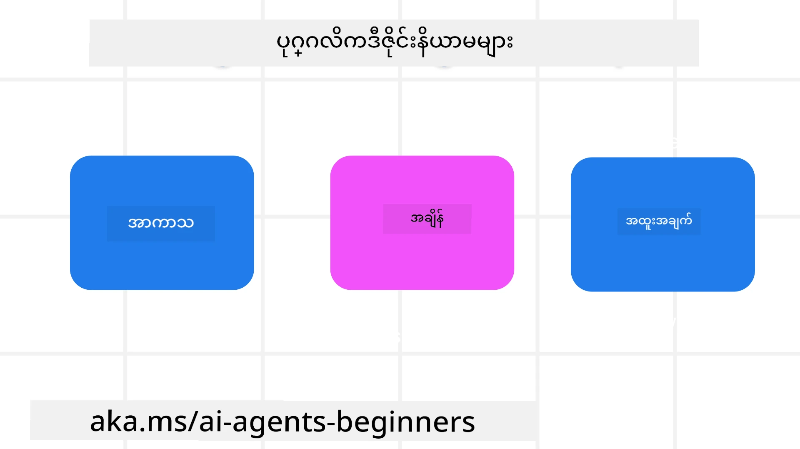

<!--
CO_OP_TRANSLATOR_METADATA:
{
  "original_hash": "d71524fe83a23829ae7a23b4031aaac8",
  "translation_date": "2025-11-13T14:37:53+00:00",
  "source_file": "03-agentic-design-patterns/README.md",
  "language_code": "my"
}
-->

> _(ဤသင်ခန်းစာ၏ ဗီဒီယိုကို ကြည့်ရန် အထက်ပါ ပုံကို နှိပ်ပါ)_
# AI အေးဂျင့် ဒီဇိုင်း မူဝါဒများ

## နိဒါန်း

AI အေးဂျင့်စနစ်များကို တည်ဆောက်ရန် အမျိုးမျိုးသော နည်းလမ်းများ ရှိပါသည်။ Generative AI ဒီဇိုင်းတွင် မရေရာမှုသည် အားသာချက်တစ်ခုဖြစ်ပြီး အားနည်းချက်မဟုတ်သောကြောင့် အင်ဂျင်နီယာများအနေဖြင့် ဘယ်နေရာမှ စတင်ရမည်ကို ရှာဖွေရန် ခက်ခဲတတ်ပါသည်။ ကျွန်ုပ်တို့သည် လူအခြေပြု UX ဒီဇိုင်း မူဝါဒများကို ဖန်တီးထားပြီး ဖောက်သည်အခြေပြု အေးဂျင့်စနစ်များကို ဖန်တီးရန် ဖွံ့ဖြိုးရေးဆရာများအား အကူအညီပေးရန် ရည်ရွယ်ပါသည်။ ဤဒီဇိုင်း မူဝါဒများသည် တိကျသော အဆောက်အအုံမဟုတ်ဘဲ အေးဂျင့် အတွေ့အကြုံများကို သတ်မှတ်ခြင်းနှင့် တည်ဆောက်ခြင်းကို စတင်နေသော အဖွဲ့များအတွက် အစပြုချက်တစ်ခုသာဖြစ်ပါသည်။

ယေဘူယျအားဖြင့် အေးဂျင့်များသည် -

- လူ့စွမ်းရည်များကို ကျယ်ပြန့်စေပြီး အတိုင်းအတာတစ်ခုအထိ တိုးတက်စေပါသည် (ဥပမာ- စိတ်ကူးပေါက်ခြင်း၊ ပြဿနာဖြေရှင်းခြင်း၊ အလိုအလျောက်လုပ်ဆောင်ခြင်း စသည်)
- အသိပညာလွှာများကို ဖြည့်ဆည်းပေးပါသည် (ဥပမာ- အသိပညာနယ်ပယ်များကို အမြန်လေ့လာရန်၊ ဘာသာပြန်ခြင်း စသည်)
- လူတစ်ဦးချင်းစီအနေဖြင့် အခြားသူများနှင့် ပူးပေါင်းလုပ်ဆောင်ရန် နှစ်သက်သော နည်းလမ်းများကို အထောက်အကူပြုပါသည်
- ကျွန်ုပ်တို့ကို ပိုမိုကောင်းမွန်သော ကိုယ်ပိုင်ပုံစံများဖြစ်စေပါသည် (ဥပမာ- ဘဝကိုယ်တိုင်နည်းပြ/တာဝန်ကျေပွန်သူ၊ စိတ်ခံစားမှု ထိန်းချုပ်မှုနှင့် စိတ်တည်ငြိမ်မှု ကျွမ်းကျင်မှုများကို သင်ကြားပေးခြင်း၊ စိတ်ခံစားမှု ခံနိုင်ရည် တိုးတက်စေခြင်း စသည်)

## ဤသင်ခန်းစာတွင် ပါဝင်မည့်အကြောင်းအရာများ

- အေးဂျင့် ဒီဇိုင်း မူဝါဒများဆိုတာဘာလဲ
- ဒီဇိုင်း မူဝါဒများကို အကောင်အထည်ဖော်ရာတွင် လိုက်နာရမည့် လမ်းညွှန်ချက်များ
- ဒီဇိုင်း မူဝါဒများကို အသုံးပြုသည့် နမူနာများ

## သင်ယူရမည့် ရည်မှန်းချက်များ

ဤသင်ခန်းစာပြီးဆုံးပါက သင်သည် -

1. အေးဂျင့် ဒီဇိုင်း မူဝါဒများကို ရှင်းပြနိုင်မည်
2. အေးဂျင့် ဒီဇိုင်း မူဝါဒများကို အသုံးပြုရန် လမ်းညွှန်ချက်များကို ရှင်းပြနိုင်မည်
3. အေးဂျင့် ဒီဇိုင်း မူဝါဒများကို အသုံးပြု၍ အေးဂျင့်တစ်ဦးကို တည်ဆောက်နိုင်မည်

## အေးဂျင့် ဒီဇိုင်း မူဝါဒများ

### အေးဂျင့် (အာကာသ)

ဤသည်မှာ အေးဂျင့်တစ်ဦး လုပ်ဆောင်သည့် ပတ်ဝန်းကျင်ဖြစ်သည်။ ဤမူဝါဒများသည် ရုပ်ပိုင်းဆိုင်ရာနှင့် ဒစ်ဂျစ်တယ်ကမ္ဘာများတွင် ပါဝင်ဆောင်ရွက်ရန် အေးဂျင့်များကို ဒီဇိုင်းဆွဲရာတွင် လမ်းညွှန်သည်။

- **ချိတ်ဆက်ခြင်း၊ ဖျက်စီးခြင်းမဟုတ်** – လူများကို အခြားသူများ၊ ဖြစ်ရပ်များနှင့် လုပ်ဆောင်နိုင်သော အသိပညာများနှင့် ချိတ်ဆက်ပေးပြီး ပူးပေါင်းဆောင်ရွက်မှုနှင့် ချိတ်ဆက်မှုကို အထောက်အကူပြုပါသည်။
- အေးဂျင့်များသည် ဖြစ်ရပ်များ၊ အသိပညာများနှင့် လူများကို ချိတ်ဆက်ပေးပါသည်။
- အေးဂျင့်များသည် လူများကို ပိုမိုနီးကပ်စေပါသည်။ သူတို့ကို အစားထိုးရန် သို့မဟုတ် သေးငယ်စေရန် ဒီဇိုင်းဆွဲထားခြင်း မဟုတ်ပါ။
- **လွယ်ကူစွာ ရရှိနိုင်သော်လည်း တခါတရံ မမြင်သာနိုင်ခြင်း** – အေးဂျင့်သည် အများအားဖြင့် နောက်ခံတွင် လုပ်ဆောင်ပြီး သက်ဆိုင်ရာနှင့် သင့်တော်သောအခါတွင်သာ သတိပေးပါသည်။
  - အေးဂျင့်သည် ခွင့်ပြုထားသော အသုံးပြုသူများအတွက် မည်သည့် စက်ပစ္စည်း သို့မဟုတ် ပလက်ဖောင်းတွင်မဆို လွယ်ကူစွာ ရှာဖွေ၍ ရရှိနိုင်ပါသည်။
  - အေးဂျင့်သည် မျက်နှာပြင်အမျိုးမျိုး (အသံ၊ စကား၊ စာသား စသည်) ကို ထောက်ပံ့ပါသည်။
  - အေးဂျင့်သည် အသုံးပြုသူ၏ လိုအပ်ချက်များကို ခံစားသိမြင်နိုင်မှုအပေါ် မူတည်၍ ရှေ့တန်းနှင့် နောက်ခံအကြား၊ တုံ့ပြန်မှုနှင့် တက်ကြွမှုအကြား ချောမွေ့စွာ ပြောင်းလဲနိုင်ပါသည်။
  - အေးဂျင့်သည် မမြင်သာသော ပုံစံဖြင့် လုပ်ဆောင်နိုင်သော်လည်း ၎င်း၏ နောက်ခံလုပ်ငန်းစဉ်လမ်းကြောင်းနှင့် အခြားအေးဂျင့်များနှင့် ပူးပေါင်းဆောင်ရွက်မှုသည် အသုံးပြုသူအတွက် ပွင့်လင်းမြင်သာပြီး ထိန်းချုပ်နိုင်ပါသည်။

### အေးဂျင့် (အချိန်)

ဤသည်မှာ အေးဂျင့်တစ်ဦးသည် အချိန်အတွင်း လုပ်ဆောင်ပုံဖြစ်သည်။ ဤမူဝါဒများသည် အတိတ်၊ ပစ္စုပ္ပန်နှင့် အနာဂတ်အတွင်း အေးဂျင့်များနှင့် အပြန်အလှန်ဆက်ဆံပုံကို ဒီဇိုင်းဆွဲရာတွင် လမ်းညွှန်သည်။

- **အတိတ်**: အခြေအနေနှင့် အကြောင်းအရာနှစ်ခုစလုံးပါဝင်သည့် သမိုင်းကို ပြန်လည်သုံးသပ်ခြင်း။
  - အေးဂျင့်သည် ဖြစ်ရပ်၊ လူများ သို့မဟုတ် အခြေအနေများသာမက ပိုမိုချောမွေ့သော သမိုင်းဆိုင်ရာဒေတာများကို ခွဲခြမ်းစိတ်ဖြာခြင်းအပေါ် မူတည်၍ ပိုမိုသက်ဆိုင်သော ရလဒ်များကို ပေးစွမ်းပါသည်။
  - အေးဂျင့်သည် အတိတ်ဖြစ်ရပ်များမှ ချိတ်ဆက်မှုများ ဖန်တီးပြီး လက်ရှိအခြေအနေများနှင့် ပူးပေါင်းဆောင်ရွက်ရန် သတိရမှုကို တက်ကြွစွာ ပြန်လည်သုံးသပ်ပါသည်။
- **ယခု**: သတိပေးခြင်းထက် အကြံပြုခြင်း။
  - အေးဂျင့်သည် လူများနှင့် အပြန်အလှန်ဆက်ဆံရာတွင် စုံလင်သော လုပ်ဆောင်မှုကို ပိုင်ဆိုင်ထားသည်။ ဖြစ်ရပ်တစ်ခုဖြစ်ပွားသောအခါ အေးဂျင့်သည် သာမန်သတိပေးချက် သို့မဟုတ် အခြား သာမန်ပုံစံတစ်ခုထက် ကျော်လွန်သည်။ အေးဂျင့်သည် လုပ်ငန်းစဉ်များကို ရိုးရှင်းစေခြင်း သို့မဟုတ် အသုံးပြုသူ၏ အာရုံကို သင့်တော်သောအချိန်တွင် ဦးတည်စေရန် အချက်ပြချက်များကို ဒိုင်နမစ်ပုံစံဖြင့် ဖန်တီးနိုင်ပါသည်။
  - အေးဂျင့်သည် အကြောင်းအရာဆိုင်ရာ ပတ်ဝန်းကျင်၊ လူမှုနှင့် ယဉ်ကျေးမှု ပြောင်းလဲမှုများအပေါ် မူတည်၍ အသုံးပြုသူရည်ရွယ်ချက်နှင့် ကိုက်ညီသော အချက်အလက်များကို ပေးစွမ်းပါသည်။
  - အေးဂျင့်နှင့် အပြန်အလှန်ဆက်ဆံမှုသည် အချိန်ကြာလာသည်နှင့်အမျှ တိုးတက်မှုရှိပြီး အသုံးပြုသူများကို ရေရှည်အားဖြင့် အခွင့်အလမ်းပေးနိုင်ပါသည်။
- **အနာဂတ်**: လိုက်လျောညီထွေဖြစ်ခြင်းနှင့် ဖွံ့ဖြိုးတိုးတက်ခြင်း။
  - အေးဂျင့်သည် စက်ပစ္စည်းများ၊ ပလက်ဖောင်းများနှင့် မျက်နှာပြင်အမျိုးမျိုးကို လိုက်လျောညီထွေဖြစ်ပါသည်။
  - အေးဂျင့်သည် အသုံးပြုသူ၏ အပြုအမူ၊ လက်လှမ်းမီမှုလိုအပ်ချက်များနှင့် ကိုက်ညီပြီး လွတ်လပ်စွာ စိတ်ကြိုက်ပြုလုပ်နိုင်ပါသည်။
  - အေးဂျင့်သည် အသုံးပြုသူနှင့် ဆက်ဆံမှုများအပေါ် မူတည်၍ ဖွံ့ဖြိုးတိုးတက်လာပါသည်။

### အေးဂျင့် (အဓိက)

ဤသည်မှာ အေးဂျင့်တစ်ဦး၏ ဒီဇိုင်းအဓိက အစိတ်အပိုင်းများဖြစ်သည်။

- **မရေရာမှုကို လက်ခံခြင်း သို့မဟုတ် ယုံကြည်မှုကို တည်ဆောက်ခြင်း**။
  - အေးဂျင့်၏ မရေရာမှုအချို့ကို မျှော်လင့်ရမည်။ မရေရာမှုသည် အေးဂျင့်ဒီဇိုင်း၏ အဓိကအစိတ်အပိုင်းတစ်ခုဖြစ်သည်။
  - ယုံကြည်မှုနှင့် ပွင့်လင်းမြင်သာမှုသည် အေးဂျင့်ဒီဇိုင်း၏ အခြေခံအလွှာများဖြစ်သည်။
  - အေးဂျင့်ကို ဖွင့်/ပိတ်ရန် လူသားများသည် ထိန်းချုပ်မှုရှိပြီး အေးဂျင့်၏ အခြေအနေကို အချိန်မရွေး ရှင်းလင်းမြင်သာစွာ မြင်နိုင်ပါသည်။

## ဤမူဝါဒများကို အကောင်အထည်ဖော်ရန် လမ်းညွှန်ချက်များ

ယခင် ဒီဇိုင်းမူဝါဒများကို အသုံးပြုသောအခါ အောက်ပါ လမ်းညွှန်ချက်များကို လိုက်နာပါ -

1. **ပွင့်လင်းမြင်သာမှု**: AI ပါဝင်နေသည်ကို အသုံးပြုသူအား အသိပေးပါ၊ ၎င်း၏ လုပ်ဆောင်ပုံ (အတိတ်လုပ်ဆောင်မှုများအပါအဝင်) နှင့် အကြံပြုချက်ပေးရန်နှင့် စနစ်ကို ပြင်ဆင်ရန် နည်းလမ်းများကို အသိပေးပါ။
2. **ထိန်းချုပ်မှု**: အသုံးပြုသူအား စိတ်ကြိုက်ပြုလုပ်နိုင်စေရန်၊ အလိုက်သင့်ဆုံးရွေးချယ်မှုများနှင့် စိတ်ကြိုက်ပြုလုပ်နိုင်စေရန် စနစ်နှင့် ၎င်း၏ အင်္ဂါရပ်များကို ထိန်းချုပ်နိုင်စေရန် အခွင့်အလမ်းပေးပါ (ဥပမာ- မေ့ပစ်နိုင်စေရန် အခွင့်အလမ်းပေးပါ)။
3. **အမြဲတန်းညီညွတ်မှု**: စက်ပစ္စည်းများနှင့် အဆုံးစွန်များအနှံ့ အမြဲတန်းညီညွတ်သော၊ မျက်နှာပြင်အမျိုးမျိုးဖြင့် အတွေ့အကြုံများ ရရှိစေရန် ရည်ရွယ်ပါ။ မျှော်လင့်ထားသော UI/UX အစိတ်အပိုင်းများကို အသုံးပြုပါ (ဥပမာ- အသံအပြောအပြန်အတွက် မိုက်ခရိုဖုန်းအိုင်ကွန်) နှင့် အသုံးပြုသူ၏ စိတ်ပိုင်းဆိုင်ရာ ဝန်ကို အနည်းဆုံးဖြစ်စေရန် ကြိုးစားပါ (ဥပမာ- အတိုချုံးသော အဖြေများ၊ ရုပ်ပုံအကူအညီများနှင့် ‘ပိုမိုလေ့လာရန်’ အကြောင်းအရာများကို ရည်ရွယ်ပါ)။

## ဤမူဝါဒများနှင့် လမ်းညွှန်ချက်များကို အသုံးပြု၍ ခရီးသွားအေးဂျင့်တစ်ဦးကို ဒီဇိုင်းဆွဲပုံ

ခရီးသွားအေးဂျင့်တစ်ဦးကို ဒီဇိုင်းဆွဲနေသည်ဟု စဉ်းစားပါက ဒီဇိုင်းမူဝါဒများနှင့် လမ်းညွှန်ချက်များကို အောက်ပါအတိုင်း အသုံးပြုနိုင်ပါသည် -

1. **ပွင့်လင်းမြင်သာမှု** – ခရီးသွားအေးဂျင့်သည် AI ပါဝင်သော အေးဂျင့်ဖြစ်ကြောင်း အသုံးပြုသူအား အသိပေးပါ။ စတင်အသုံးပြုရန် အခြေခံညွှန်ကြားချက်များ (ဥပမာ- “မင်္ဂလာပါ” စာတို၊ နမူနာအကြံပြုချက်များ) ပေးပါ။ ၎င်းကို ထုတ်ကုန်စာမျက်နှာတွင် ရှင်းလင်းစွာ မှတ်သားပါ။ အသုံးပြုသူက အတိတ်တွင် မေးမြန်းခဲ့သော အကြံပြုချက်စာရင်းကို ပြပါ။ အကြံပြုချက်ပေးရန် နည်းလမ်းများ (ဥပမာ- လက်မထောင်ခြင်းနှင့် လက်မချခြင်း၊ အကြံပြုချက်ပေးရန် ခလုတ်) ကို ရှင်းလင်းစွာ ဖော်ပြပါ။ အေးဂျင့်တွင် အသုံးပြုမှု သို့မဟုတ် ခေါင်းစဉ်ကန့်သတ်ချက်များ ရှိပါက ရှင်းလင်းစွာ ဖော်ပြပါ။
2. **ထိန်းချုပ်မှု** – အေးဂျင့်ကို ဖန်တီးပြီးနောက် အသုံးပြုသူက ၎င်းကို ပြင်ဆင်နိုင်သည့် နည်းလမ်းများ (ဥပမာ- System Prompt) ကို ရှင်းလင်းစွာ ဖော်ပြပါ။ အေးဂျင့်၏ စကားပြောပုံစံ၊ စာရေးပုံစံနှင့် မပြောသင့်သော အကြောင်းအရာများကို အသုံးပြုသူက ရွေးချယ်နိုင်စေရန် အခွင့်အလမ်းပေးပါ။ ပတ်သက်သော ဖိုင်များ သို့မဟုတ် ဒေတာများ၊ အကြံပြုချက်များနှင့် အတိတ်စကားဝိုင်းများကို ကြည့်ရှုနိုင်ရန်နှင့် ဖျက်နိုင်ရန် ခွင့်ပြုပါ။
3. **အမြဲတန်းညီညွတ်မှု** – Share Prompt, ဖိုင် သို့မဟုတ် ဓာတ်ပုံတစ်ခု ထည့်သွင်းရန်နှင့် တစ်စုံတစ်ခု သို့မဟုတ် တစ်ဦးတစ်ယောက်ကို Tag လုပ်ရန် အိုင်ကွန်များသည် စံနှင့် ရှင်းလင်းစွာ အသိအမှတ်ပြုနိုင်သော အိုင်ကွန်များဖြစ်စေရန် သေချာပါစေ။ ဖိုင်တင်/မျှဝေမှုကို ဖော်ပြရန် Paperclip အိုင်ကွန်နှင့် ဓာတ်ပုံတင်မှုကို ဖော်ပြရန် Image အိုင်ကွန်ကို အသုံးပြုပါ။

## နမူနာကုဒ်များ

- Python: [Agent Framework](./code_samples/03-python-agent-framework.ipynb)
- .NET: [Agent Framework](./code_samples/03-dotnet-agent-framework.md)

## AI အေးဂျင့် ဒီဇိုင်းပုံစံများနှင့် ပတ်သက်၍ မေးခွန်းများ ရှိပါသလား?

[Azure AI Foundry Discord](https://aka.ms/ai-ag

---

<!-- CO-OP TRANSLATOR DISCLAIMER START -->
**အကြောင်းကြားချက်**:  
ဤစာရွက်စာတမ်းကို AI ဘာသာပြန်ဝန်ဆောင်မှု [Co-op Translator](https://github.com/Azure/co-op-translator) ကို အသုံးပြု၍ ဘာသာပြန်ထားပါသည်။ ကျွန်ုပ်တို့သည် တိကျမှုအတွက် ကြိုးစားနေသော်လည်း အလိုအလျောက် ဘာသာပြန်မှုများတွင် အမှားများ သို့မဟုတ် မမှန်ကန်မှုများ ပါဝင်နိုင်သည်ကို သတိပြုပါ။ မူရင်းဘာသာစကားဖြင့် ရေးသားထားသော စာရွက်စာတမ်းကို အာဏာတရ အရင်းအမြစ်အဖြစ် သတ်မှတ်သင့်ပါသည်။ အရေးကြီးသော အချက်အလက်များအတွက် လူ့ဘာသာပြန်ပညာရှင်များကို အသုံးပြုရန် အကြံပြုပါသည်။ ဤဘာသာပြန်မှုကို အသုံးပြုခြင်းမှ ဖြစ်ပေါ်လာသော အလွဲအမှားများ သို့မဟုတ် အနားယူမှုများအတွက် ကျွန်ုပ်တို့သည် တာဝန်မယူပါ။
<!-- CO-OP TRANSLATOR DISCLAIMER END -->