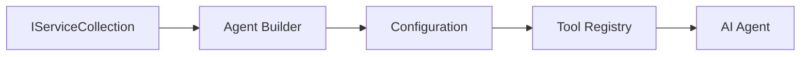

<!--
CO_OP_TRANSLATOR_METADATA:
{
  "original_hash": "bcc874e190347bd6a095aed56dc16de8",
  "translation_date": "2025-11-13T14:39:47+00:00",
  "source_file": "03-agentic-design-patterns/code_samples/03-dotnet-agent-framework.md",
  "language_code": "my"
}
-->
# 🎨 GitHub Models (.NET) နှင့် Agentic Design Patterns

## 📋 သင်ယူရမည့်အရာများ

ဤနမူနာသည် Microsoft Agent Framework ကို .NET တွင် GitHub Models နှင့်ပေါင်းစပ်ပြီး အဆင့်မြင့် design patterns များကို အသုံးပြု၍ စွမ်းဆောင်ရည်မြင့်မားသော agent များကို တည်ဆောက်ခြင်းအတွက် enterprise-grade design patterns များကို ပြသသည်။ သင်သည် agent များကို ထုတ်လုပ်ရန် အသင့်ဖြစ်စေသော၊ ထိန်းသိမ်းရန်လွယ်ကူသော၊ နှင့် အရွယ်အစားကြီးမားသော professional patterns များနှင့် architectural approaches များကို သင်ယူနိုင်ပါမည်။

### Enterprise Design Patterns

- 🏭 **Factory Pattern**: Dependency injection ဖြင့် agent များကို စနစ်တကျ ဖန်တီးခြင်း
- 🔧 **Builder Pattern**: Agent များကို fluent configuration နှင့် setup
- 🧵 **Thread-Safe Patterns**: Concurrent conversation ကို စနစ်တကျ စီမံခန့်ခွဲခြင်း
- 📋 **Repository Pattern**: Tool နှင့် capability များကို စနစ်တကျ စီမံခြင်း

## 🎯 .NET-Specific Architectural Benefits

### Enterprise Features

- **Strong Typing**: Compile-time validation နှင့် IntelliSense အထောက်အပံ့
- **Dependency Injection**: Built-in DI container integration
- **Configuration Management**: IConfiguration နှင့် Options patterns
- **Async/Await**: Asynchronous programming အတွက် အထူးထောက်ပံ့မှု

### Production-Ready Patterns

- **Logging Integration**: ILogger နှင့် structured logging အထောက်အပံ့
- **Health Checks**: Built-in monitoring နှင့် diagnostics
- **Configuration Validation**: Data annotations ဖြင့် strong typing
- **Error Handling**: Structured exception management

## 🔧 Technical Architecture

### Core .NET Components

- **Microsoft.Extensions.AI**: Unified AI service abstractions
- **Microsoft.Agents.AI**: Enterprise agent orchestration framework
- **GitHub Models Integration**: High-performance API client patterns
- **Configuration System**: appsettings.json နှင့် environment integration

### Design Pattern Implementation



## 🏗️ Enterprise Patterns Demonstrated

### 1. **Creational Patterns**

- **Agent Factory**: Configuration တူညီမှုရှိသော agent များကို စုစည်းဖန်တီးခြင်း
- **Builder Pattern**: Complex agent configuration အတွက် Fluent API
- **Singleton Pattern**: Shared resources နှင့် configuration management
- **Dependency Injection**: Loose coupling နှင့် testability

### 2. **Behavioral Patterns**

- **Strategy Pattern**: Tool execution strategy များကို အလွယ်တကူ ပြောင်းလဲနိုင်ခြင်း
- **Command Pattern**: Agent operations များကို undo/redo အထောက်အပံ့ဖြင့် encapsulate
- **Observer Pattern**: Event-driven agent lifecycle management
- **Template Method**: Agent execution workflow များကို စနစ်တကျ ပြုလုပ်ခြင်း

### 3. **Structural Patterns**

- **Adapter Pattern**: GitHub Models API integration layer
- **Decorator Pattern**: Agent capability အားတိုးမြှင့်ခြင်း
- **Facade Pattern**: Agent interaction interface များကို ရိုးရှင်းစေခြင်း
- **Proxy Pattern**: Lazy loading နှင့် caching ဖြင့် စွမ်းဆောင်ရည်မြှင့်ခြင်း

## 📚 .NET Design Principles

### SOLID Principles

- **Single Responsibility**: Component တစ်ခုစီ၏ ရည်ရွယ်ချက်ကို ရှင်းလင်းစေခြင်း
- **Open/Closed**: Modification မရှိဘဲ Extensible ဖြစ်စေခြင်း
- **Liskov Substitution**: Interface-based tool implementation
- **Interface Segregation**: Focused, cohesive interfaces
- **Dependency Inversion**: Abstractions များကို အခြေခံ၍ အလုပ်လုပ်ခြင်း

### Clean Architecture

- **Domain Layer**: Core agent နှင့် tool abstractions
- **Application Layer**: Agent orchestration နှင့် workflows
- **Infrastructure Layer**: GitHub Models integration နှင့် အပြင်ပန်းဝန်ဆောင်မှုများ
- **Presentation Layer**: User interaction နှင့် response formatting

## 🔒 Enterprise Considerations

### Security

- **Credential Management**: IConfiguration ဖြင့် API key များကို လုံခြုံစွာ စီမံခြင်း
- **Input Validation**: Strong typing နှင့် data annotation validation
- **Output Sanitization**: Response များကို လုံခြုံစွာ စီမံခြင်းနှင့် filtering
- **Audit Logging**: Operation tracking အပြည့်အစုံ

### Performance

- **Async Patterns**: Non-blocking I/O operations
- **Connection Pooling**: HTTP client management ကို ထိရောက်စွာ ပြုလုပ်ခြင်း
- **Caching**: Response caching ဖြင့် စွမ်းဆောင်ရည် မြှင့်တင်ခြင်း
- **Resource Management**: Disposal နှင့် cleanup patterns ကို သေချာစွာ ပြုလုပ်ခြင်း

### Scalability

- **Thread Safety**: Concurrent agent execution အထောက်အပံ့
- **Resource Pooling**: Resource များကို ထိရောက်စွာ အသုံးပြုခြင်း
- **Load Management**: Rate limiting နှင့် backpressure handling
- **Monitoring**: Performance metrics နှင့် health checks

## 🚀 Production Deployment

- **Configuration Management**: Environment-specific settings
- **Logging Strategy**: Correlation IDs ဖြင့် structured logging
- **Error Handling**: Global exception handling နှင့် proper recovery
- **Monitoring**: Application insights နှင့် performance counters
- **Testing**: Unit tests, integration tests, နှင့် load testing patterns

Enterprise-grade intelligent agents များကို .NET ဖြင့် တည်ဆောက်ရန် အသင့်ဖြစ်ပါပြီ။ Robust ဖြစ်သော architecture တစ်ခုကို တည်ဆောက်ကြစို့! 🏢✨

## 🚀 စတင်အသုံးပြုခြင်း

### လိုအပ်ချက်များ

- [.NET 10 SDK](https://dotnet.microsoft.com/download/dotnet/10.0) သို့မဟုတ် အထက်
- [GitHub Models API access token](https://docs.github.com/github-models/github-models-at-scale/using-your-own-api-keys-in-github-models)

### လိုအပ်သော Environment Variables

```bash
# zsh/bash
export GH_TOKEN=<your_github_token>
export GH_ENDPOINT=https://models.github.ai/inference
export GH_MODEL_ID=openai/gpt-5-mini
```

```powershell
# PowerShell
$env:GH_TOKEN = "<your_github_token>"
$env:GH_ENDPOINT = "https://models.github.ai/inference"
$env:GH_MODEL_ID = "openai/gpt-5-mini"
```

### နမူနာကုဒ်

ကုဒ်နမူနာကို run လုပ်ရန်,

```bash
# zsh/bash
chmod +x ./03-dotnet-agent-framework.cs
./03-dotnet-agent-framework.cs
```

သို့မဟုတ် dotnet CLI ကို အသုံးပြု၍:

```bash
dotnet run ./03-dotnet-agent-framework.cs
```

[`03-dotnet-agent-framework.cs`](../../../../03-agentic-design-patterns/code_samples/03-dotnet-agent-framework.cs) တွင် အပြည့်အစုံကုဒ်ကို ကြည့်ပါ။

```csharp
#!/usr/bin/dotnet run

#:package Microsoft.Extensions.AI@10.*
#:package Microsoft.Agents.AI.OpenAI@1.*-*

using System.ClientModel;
using System.ComponentModel;

using Microsoft.Agents.AI;
using Microsoft.Extensions.AI;

using OpenAI;

// Tool Function: Random Destination Generator
// This static method will be available to the agent as a callable tool
// The [Description] attribute helps the AI understand when to use this function
// This demonstrates how to create custom tools for AI agents
[Description("Provides a random vacation destination.")]
static string GetRandomDestination()
{
    // List of popular vacation destinations around the world
    // The agent will randomly select from these options
    var destinations = new List<string>
    {
        "Paris, France",
        "Tokyo, Japan",
        "New York City, USA",
        "Sydney, Australia",
        "Rome, Italy",
        "Barcelona, Spain",
        "Cape Town, South Africa",
        "Rio de Janeiro, Brazil",
        "Bangkok, Thailand",
        "Vancouver, Canada"
    };

    // Generate random index and return selected destination
    // Uses System.Random for simple random selection
    var random = new Random();
    int index = random.Next(destinations.Count);
    return destinations[index];
}

// Extract configuration from environment variables
// Retrieve the GitHub Models API endpoint, defaults to https://models.github.ai/inference if not specified
// Retrieve the model ID, defaults to openai/gpt-5-mini if not specified
// Retrieve the GitHub token for authentication, throws exception if not specified
var github_endpoint = Environment.GetEnvironmentVariable("GH_ENDPOINT") ?? "https://models.github.ai/inference";
var github_model_id = Environment.GetEnvironmentVariable("GH_MODEL_ID") ?? "openai/gpt-5-mini";
var github_token = Environment.GetEnvironmentVariable("GH_TOKEN") ?? throw new InvalidOperationException("GH_TOKEN is not set.");

// Configure OpenAI Client Options
// Create configuration options to point to GitHub Models endpoint
// This redirects OpenAI client calls to GitHub's model inference service
var openAIOptions = new OpenAIClientOptions()
{
    Endpoint = new Uri(github_endpoint)
};

// Initialize OpenAI Client with GitHub Models Configuration
// Create OpenAI client using GitHub token for authentication
// Configure it to use GitHub Models endpoint instead of OpenAI directly
var openAIClient = new OpenAIClient(new ApiKeyCredential(github_token), openAIOptions);

// Define Agent Identity and Comprehensive Instructions
// Agent name for identification and logging purposes
var AGENT_NAME = "TravelAgent";

// Detailed instructions that define the agent's personality, capabilities, and behavior
// This system prompt shapes how the agent responds and interacts with users
var AGENT_INSTRUCTIONS = """
You are a helpful AI Agent that can help plan vacations for customers.

Important: When users specify a destination, always plan for that location. Only suggest random destinations when the user hasn't specified a preference.

When the conversation begins, introduce yourself with this message:
"Hello! I'm your TravelAgent assistant. I can help plan vacations and suggest interesting destinations for you. Here are some things you can ask me:
1. Plan a day trip to a specific location
2. Suggest a random vacation destination
3. Find destinations with specific features (beaches, mountains, historical sites, etc.)
4. Plan an alternative trip if you don't like my first suggestion

What kind of trip would you like me to help you plan today?"

Always prioritize user preferences. If they mention a specific destination like "Bali" or "Paris," focus your planning on that location rather than suggesting alternatives.
""";

// Create AI Agent with Advanced Travel Planning Capabilities
// Initialize complete agent pipeline: OpenAI client → Chat client → AI agent
// Configure agent with name, detailed instructions, and available tools
// This demonstrates the .NET agent creation pattern with full configuration
AIAgent agent = openAIClient
    .GetChatClient(github_model_id)
    .CreateAIAgent(
        name: AGENT_NAME,
        instructions: AGENT_INSTRUCTIONS,
        tools: [AIFunctionFactory.Create(GetRandomDestination)]
    );

// Create New Conversation Thread for Context Management
// Initialize a new conversation thread to maintain context across multiple interactions
// Threads enable the agent to remember previous exchanges and maintain conversational state
// This is essential for multi-turn conversations and contextual understanding
AgentThread thread = agent.GetNewThread();

// Execute Agent: First Travel Planning Request
// Run the agent with an initial request that will likely trigger the random destination tool
// The agent will analyze the request, use the GetRandomDestination tool, and create an itinerary
// Using the thread parameter maintains conversation context for subsequent interactions
await foreach (var update in agent.RunStreamingAsync("Plan me a day trip", thread))
{
    await Task.Delay(10);
    Console.Write(update);
}

Console.WriteLine();

// Execute Agent: Follow-up Request with Context Awareness
// Demonstrate contextual conversation by referencing the previous response
// The agent remembers the previous destination suggestion and will provide an alternative
// This showcases the power of conversation threads and contextual understanding in .NET agents
await foreach (var update in agent.RunStreamingAsync("I don't like that destination. Plan me another vacation.", thread))
{
    await Task.Delay(10);
    Console.Write(update);
}
```

---

<!-- CO-OP TRANSLATOR DISCLAIMER START -->
**အကြောင်းကြားချက်**:  
ဤစာရွက်စာတမ်းကို AI ဘာသာပြန်ဝန်ဆောင်မှု [Co-op Translator](https://github.com/Azure/co-op-translator) ကို အသုံးပြု၍ ဘာသာပြန်ထားပါသည်။ ကျွန်ုပ်တို့သည် တိကျမှုအတွက် ကြိုးစားနေသော်လည်း အလိုအလျောက် ဘာသာပြန်ခြင်းတွင် အမှားများ သို့မဟုတ် မမှန်ကန်မှုများ ပါဝင်နိုင်သည်ကို သတိပြုပါ။ မူရင်းဘာသာစကားဖြင့် ရေးသားထားသော စာရွက်စာတမ်းကို အာဏာတရားရှိသော အရင်းအမြစ်အဖြစ် သတ်မှတ်သင့်ပါသည်။ အရေးကြီးသော အချက်အလက်များအတွက် လူက ဘာသာပြန်ခြင်းကို အကြံပြုပါသည်။ ဤဘာသာပြန်ကို အသုံးပြုခြင်းမှ ဖြစ်ပေါ်လာသော အလွဲအမှားများ သို့မဟုတ် အနားလွဲမှုများအတွက် ကျွန်ုပ်တို့သည် တာဝန်မယူပါ။
<!-- CO-OP TRANSLATOR DISCLAIMER END -->