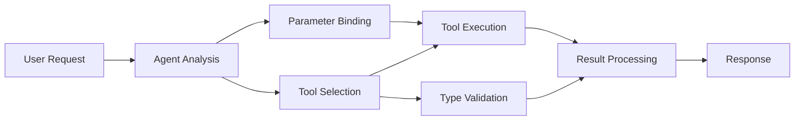

<!--
CO_OP_TRANSLATOR_METADATA:
{
  "original_hash": "91d6061e402489603f2ec8b528cae59b",
  "translation_date": "2025-11-18T18:33:31+00:00",
  "source_file": "04-tool-use/code_samples/04-dotnet-agent-framework.md",
  "language_code": "my"
}
-->
# 🛠️ GitHub Models (.NET) ကို အသုံးပြု၍ အဆင့်မြင့် Tool အသုံးပြုခြင်း

## 📋 သင်ယူရမည့် ရည်ရွယ်ချက်များ

ဒီ notebook က Microsoft Agent Framework ကို .NET နဲ့ GitHub Models တွေကို အသုံးပြုပြီး အဆင့်မြင့် tool တွေကို ပေါင်းစပ်အသုံးပြုနိုင်တဲ့ enterprise-grade ပုံစံတွေကို ပြသပေးမှာပါ။ C# ရဲ့ strong typing နဲ့ .NET ရဲ့ enterprise features တွေကို အသုံးပြုပြီး အထူးပြု tool တွေစွမ်းဆောင်နိုင်တဲ့ agent တွေကို တည်ဆောက်ပုံကို သင်ယူနိုင်ပါမယ်။

### သင်ကျွမ်းကျင်ရမည့် အဆင့်မြင့် Tool စွမ်းဆောင်ရည်များ

- 🔧 **Multi-Tool Architecture**: အထူးပြုစွမ်းဆောင်ရည်များစွာပါဝင်တဲ့ agent တစ်ခုကို တည်ဆောက်ခြင်း
- 🎯 **Type-Safe Tool Execution**: C# ရဲ့ compile-time validation ကို အသုံးပြုခြင်း
- 📊 **Enterprise Tool Patterns**: ထုတ်လုပ်မှုအဆင့် tool ဒီဇိုင်းနဲ့ error ကို ကိုင်တွယ်ပုံ
- 🔗 **Tool Composition**: အဆင့်မြင့် business workflows များအတွက် tool တွေကို ပေါင်းစပ်အသုံးပြုခြင်း

## 🎯 .NET Tool Architecture ရဲ့ အကျိုးကျေးဇူးများ

### Enterprise Tool Features

- **Compile-Time Validation**: Strong typing က tool parameter မှန်ကန်မှုကို အာမခံပေးခြင်း
- **Dependency Injection**: IoC container ကို tool management အတွက် ပေါင်းစပ်အသုံးပြုခြင်း
- **Async/Await Patterns**: Non-blocking tool execution နဲ့ resource ကို သင့်တင့်စွာ စီမံခြင်း
- **Structured Logging**: Tool execution ကို စောင့်ကြည့်နိုင်တဲ့ logging integration

### Production-Ready Patterns

- **Exception Handling**: Typed exceptions နဲ့ error ကို စုံလင်စွာ ကိုင်တွယ်ခြင်း
- **Resource Management**: Disposal patterns နဲ့ memory ကို သင့်တင့်စွာ စီမံခြင်း
- **Performance Monitoring**: Built-in metrics နဲ့ performance counters
- **Configuration Management**: Validation ပါဝင်တဲ့ type-safe configuration

## 🔧 Technical Architecture

### Core .NET Tool Components

- **Microsoft.Extensions.AI**: Tool abstraction layer တစ်ခု
- **Microsoft.Agents.AI**: Enterprise-grade tool orchestration
- **GitHub Models Integration**: Connection pooling ပါဝင်တဲ့ high-performance API client

### Tool Execution Pipeline



## 🛠️ Tool Categories & Patterns

### 1. **Data Processing Tools**

- **Input Validation**: Data annotations နဲ့ strong typing
- **Transform Operations**: Type-safe data conversion နဲ့ formatting
- **Business Logic**: Domain-specific calculation နဲ့ analysis tools
- **Output Formatting**: Structured response generation

### 2. **Integration Tools** 

- **API Connectors**: RESTful service integration ကို HttpClient နဲ့
- **Database Tools**: Entity Framework integration ကို data access အတွက်
- **File Operations**: Validation ပါဝင်တဲ့ secure file system operations
- **External Services**: Third-party service integration patterns

### 3. **Utility Tools**

- **Text Processing**: String manipulation နဲ့ formatting utilities
- **Date/Time Operations**: Culture-aware date/time calculations
- **Mathematical Tools**: Precision calculations နဲ့ statistical operations
- **Validation Tools**: Business rule validation နဲ့ data verification

Enterprise-grade agents တွေကို .NET နဲ့ type-safe tool စွမ်းဆောင်ရည်များနဲ့ တည်ဆောက်ဖို့ အဆင်သင့်ဖြစ်ပါပြီလား? အရည်အသွေးမြင့် solution တွေကို architect လုပ်ကြစို့! 🏢⚡

## 🚀 စတင်အသုံးပြုခြင်း

### လိုအပ်ချက်များ

- [.NET 10 SDK](https://dotnet.microsoft.com/download/dotnet/10.0) သို့မဟုတ် အထက်
- [GitHub Models API access token](https://docs.github.com/github-models/github-models-at-scale/using-your-own-api-keys-in-github-models)

### လိုအပ်သော Environment Variables

```bash
# zsh/bash
export GH_TOKEN=<your_github_token>
export GH_ENDPOINT=https://models.github.ai/inference
export GH_MODEL_ID=openai/gpt-5-mini
```

```powershell
# PowerShell
$env:GH_TOKEN = "<your_github_token>"
$env:GH_ENDPOINT = "https://models.github.ai/inference"
$env:GH_MODEL_ID = "openai/gpt-5-mini"
```

### နမူနာ Code

Code နမူနာကို run ဖို့,

```bash
# zsh/bash
chmod +x ./04-dotnet-agent-framework.cs
./04-dotnet-agent-framework.cs
```

သို့မဟုတ် dotnet CLI ကို အသုံးပြု၍:

```bash
dotnet run ./04-dotnet-agent-framework.cs
```

[`04-dotnet-agent-framework.cs`](../../../../04-tool-use/code_samples/04-dotnet-agent-framework.cs) မှာ အပြည့်အစုံ code ကို ကြည့်ရှုနိုင်ပါသည်။

```csharp
#!/usr/bin/dotnet run

#:package Microsoft.Extensions.AI@10.*
#:package Microsoft.Agents.AI.OpenAI@1.*-*

using System.ClientModel;
using System.ComponentModel;

using Microsoft.Agents.AI;
using Microsoft.Extensions.AI;

using OpenAI;

// Tool Function: Random Destination Generator
// This static method will be available to the agent as a callable tool
// The [Description] attribute helps the AI understand when to use this function
// This demonstrates how to create custom tools for AI agents
[Description("Provides a random vacation destination.")]
static string GetRandomDestination()
{
    // List of popular vacation destinations around the world
    // The agent will randomly select from these options
    var destinations = new List<string>
    {
        "Paris, France",
        "Tokyo, Japan",
        "New York City, USA",
        "Sydney, Australia",
        "Rome, Italy",
        "Barcelona, Spain",
        "Cape Town, South Africa",
        "Rio de Janeiro, Brazil",
        "Bangkok, Thailand",
        "Vancouver, Canada"
    };

    // Generate random index and return selected destination
    // Uses System.Random for simple random selection
    var random = new Random();
    int index = random.Next(destinations.Count);
    return destinations[index];
}

// Extract configuration from environment variables
// Retrieve the GitHub Models API endpoint, defaults to https://models.github.ai/inference if not specified
// Retrieve the model ID, defaults to openai/gpt-5-mini if not specified
// Retrieve the GitHub token for authentication, throws exception if not specified
var github_endpoint = Environment.GetEnvironmentVariable("GH_ENDPOINT") ?? "https://models.github.ai/inference";
var github_model_id = Environment.GetEnvironmentVariable("GH_MODEL_ID") ?? "openai/gpt-5-mini";
var github_token = Environment.GetEnvironmentVariable("GH_TOKEN") ?? throw new InvalidOperationException("GH_TOKEN is not set.");

// Configure OpenAI Client Options
// Create configuration options to point to GitHub Models endpoint
// This redirects OpenAI client calls to GitHub's model inference service
var openAIOptions = new OpenAIClientOptions()
{
    Endpoint = new Uri(github_endpoint)
};

// Initialize OpenAI Client with GitHub Models Configuration
// Create OpenAI client using GitHub token for authentication
// Configure it to use GitHub Models endpoint instead of OpenAI directly
var openAIClient = new OpenAIClient(new ApiKeyCredential(github_token), openAIOptions);

// Define Agent Identity and Comprehensive Instructions
// Agent name for identification and logging purposes
var AGENT_NAME = "TravelAgent";

// Detailed instructions that define the agent's personality, capabilities, and behavior
// This system prompt shapes how the agent responds and interacts with users
var AGENT_INSTRUCTIONS = """
You are a helpful AI Agent that can help plan vacations for customers.

Important: When users specify a destination, always plan for that location. Only suggest random destinations when the user hasn't specified a preference.

When the conversation begins, introduce yourself with this message:
"Hello! I'm your TravelAgent assistant. I can help plan vacations and suggest interesting destinations for you. Here are some things you can ask me:
1. Plan a day trip to a specific location
2. Suggest a random vacation destination
3. Find destinations with specific features (beaches, mountains, historical sites, etc.)
4. Plan an alternative trip if you don't like my first suggestion

What kind of trip would you like me to help you plan today?"

Always prioritize user preferences. If they mention a specific destination like "Bali" or "Paris," focus your planning on that location rather than suggesting alternatives.
""";

// Create AI Agent with Advanced Travel Planning Capabilities
// Initialize complete agent pipeline: OpenAI client → Chat client → AI agent
// Configure agent with name, detailed instructions, and available tools
// This demonstrates the .NET agent creation pattern with full configuration
AIAgent agent = openAIClient
    .GetChatClient(github_model_id)
    .CreateAIAgent(
        name: AGENT_NAME,
        instructions: AGENT_INSTRUCTIONS,
        tools: [AIFunctionFactory.Create(GetRandomDestination)]
    );

// Create New Conversation Thread for Context Management
// Initialize a new conversation thread to maintain context across multiple interactions
// Threads enable the agent to remember previous exchanges and maintain conversational state
// This is essential for multi-turn conversations and contextual understanding
AgentThread thread = agent.GetNewThread();

// Execute Agent: First Travel Planning Request
// Run the agent with an initial request that will likely trigger the random destination tool
// The agent will analyze the request, use the GetRandomDestination tool, and create an itinerary
// Using the thread parameter maintains conversation context for subsequent interactions
await foreach (var update in agent.RunStreamingAsync("Plan me a day trip", thread))
{
    await Task.Delay(10);
    Console.Write(update);
}

Console.WriteLine();

// Execute Agent: Follow-up Request with Context Awareness
// Demonstrate contextual conversation by referencing the previous response
// The agent remembers the previous destination suggestion and will provide an alternative
// This showcases the power of conversation threads and contextual understanding in .NET agents
await foreach (var update in agent.RunStreamingAsync("I don't like that destination. Plan me another vacation.", thread))
{
    await Task.Delay(10);
    Console.Write(update);
}
```

---

<!-- CO-OP TRANSLATOR DISCLAIMER START -->
**အကြောင်းကြားချက်**:  
ဤစာရွက်စာတမ်းကို AI ဘာသာပြန်ဝန်ဆောင်မှု [Co-op Translator](https://github.com/Azure/co-op-translator) ကို အသုံးပြု၍ ဘာသာပြန်ထားပါသည်။ ကျွန်ုပ်တို့သည် တိကျမှုအတွက် ကြိုးစားနေသော်လည်း အလိုအလျောက် ဘာသာပြန်မှုများတွင် အမှားများ သို့မဟုတ် မမှန်ကန်မှုများ ပါဝင်နိုင်သည်ကို သတိပြုပါ။ မူရင်းဘာသာစကားဖြင့် ရေးသားထားသော စာရွက်စာတမ်းကို အာဏာတရားရှိသော အရင်းအမြစ်အဖြစ် သတ်မှတ်သင့်ပါသည်။ အရေးကြီးသော အချက်အလက်များအတွက် လူက ဘာသာပြန်မှုကို အကြံပြုပါသည်။ ဤဘာသာပြန်မှုကို အသုံးပြုခြင်းမှ ဖြစ်ပေါ်လာသော အလွဲအမှားများ သို့မဟုတ် အနားလွဲမှုများအတွက် ကျွန်ုပ်တို့သည် တာဝန်မယူပါ။
<!-- CO-OP TRANSLATOR DISCLAIMER END -->