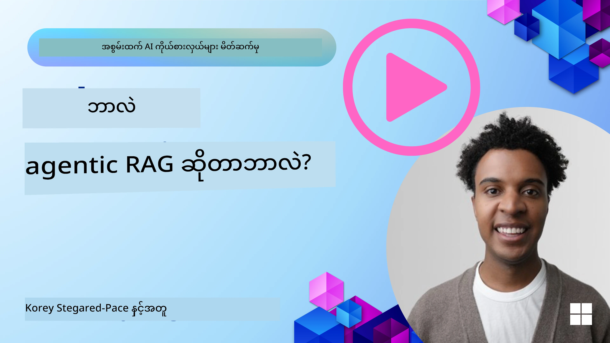
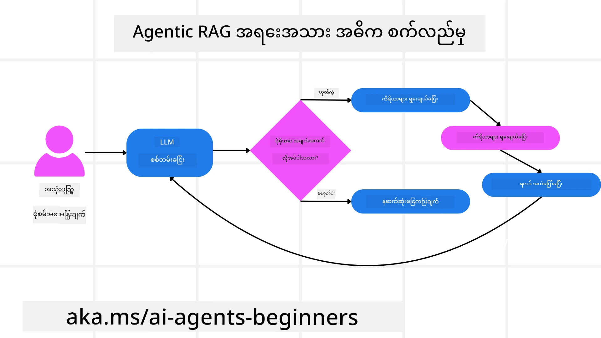
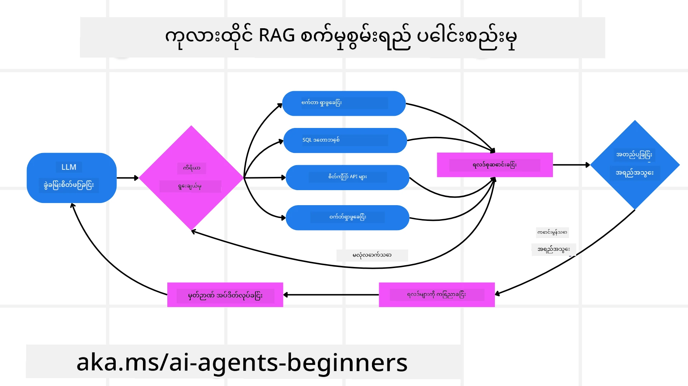
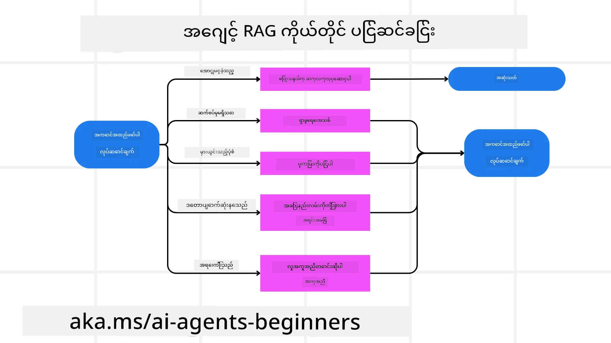
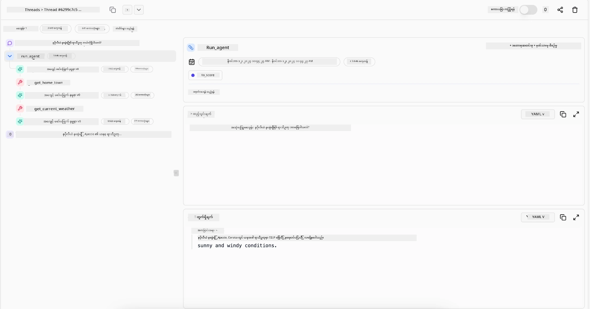

<!--
CO_OP_TRANSLATOR_METADATA:
{
  "original_hash": "0ebf6b2290db55dbf2d10cc49655523b",
  "translation_date": "2025-09-30T07:55:58+00:00",
  "source_file": "05-agentic-rag/README.md",
  "language_code": "my"
}
-->

> _(အထက်ပါပုံကိုနှိပ်ပြီး ဒီသင်ခန်းစာရဲ့ ဗီဒီယိုကို ကြည့်ပါ)_

# Agentic RAG

ဒီသင်ခန်းစာမှာ Agentic Retrieval-Augmented Generation (Agentic RAG) ဆိုတဲ့ AI နည်းပညာအသစ်တစ်ခုကို အကျယ်အဝန်းရှင်းလင်းပြသထားပါတယ်။ ဒီနည်းပညာမှာ အကြီးစားဘာသာစကားမော်ဒယ်များ (LLMs) က အပြင်ပအရင်းအမြစ်များမှ အချက်အလက်များကို ရယူရင်း၊ ကိုယ်တိုင်အဆင့်ဆင့် အစီအစဉ်ချပြီး ဆက်လက်လုပ်ဆောင်နိုင်ပါတယ်။ ရိုးရိုး static retrieval-then-read ပုံစံနဲ့မတူဘဲ၊ Agentic RAG မှာ LLM ကို အဆင့်ဆင့်ခေါ်ယူပြီး tool သို့မဟုတ် function calls နဲ့ structured outputs တွေကို ပေါင်းစပ်အသုံးပြုပါတယ်။ စနစ်က ရလဒ်တွေကို အကဲဖြတ်ပြီး၊ query တွေကို ပြင်ဆင်၊ လိုအပ်လျှင် tool အသစ်တွေကို ခေါ်ယူပြီး၊ လိုက်ဖက်တဲ့ဖြေရှင်းချက်ရရှိတဲ့အထိ ဒီစက်ဝိုင်းကို ဆက်လက်လုပ်ဆောင်ပါတယ်။

## အကျဉ်းချုပ်

ဒီသင်ခန်းစာမှာ အောက်ပါအကြောင်းအရာများကို လေ့လာပါမည်-

- **Agentic RAG ကိုနားလည်ခြင်း:** အကြီးစားဘာသာစကားမော်ဒယ်များ (LLMs) က အပြင်ပအရင်းအမြစ်များမှ အချက်အလက်များကို ရယူရင်း၊ ကိုယ်တိုင်အဆင့်ဆင့် အစီအစဉ်ချပြီး ဆက်လက်လုပ်ဆောင်နိုင်တဲ့ AI နည်းပညာအသစ်ကို လေ့လာပါ။
- **Iterative Maker-Checker ပုံစံကို နားလည်ခြင်း:** LLM ကို အဆင့်ဆင့်ခေါ်ယူပြီး tool သို့မဟုတ် function calls နဲ့ structured outputs တွေကို ပေါင်းစပ်အသုံးပြုတဲ့ loop ပုံစံကို နားလည်ပါ။
- **အကောင်အထည်ဖော်နိုင်မှုများကို ရှာဖွေခြင်း:** Agentic RAG က ထူးချွန်တဲ့နေရာများကို ရှာဖွေပါ၊ ဥပမာ- အမှန်တကယ်ဖြစ်မှုကို ဦးစားပေးတဲ့ပတ်ဝန်းကျင်များ၊ ရှုပ်ထွေးတဲ့ database အပြန်အလှန်ဆက်သွယ်မှုများ၊ နှင့် အချိန်ကြာရှည် workflows များ။

## သင်ယူရမည့်ရည်မှန်းချက်များ

ဒီသင်ခန်းစာပြီးဆုံးပြီးနောက်မှာ သင်သည် အောက်ပါအရာများကို နားလည်နိုင်ပါမည်-

- **Agentic RAG ကိုနားလည်ခြင်း:** AI နည်းပညာအသစ်တစ်ခုဖြစ်တဲ့ Agentic RAG ကို နားလည်ပါ။
- **Iterative Maker-Checker ပုံစံ:** LLM ကို အဆင့်ဆင့်ခေါ်ယူပြီး tool သို့မဟုတ် function calls နဲ့ structured outputs တွေကို ပေါင်းစပ်အသုံးပြုတဲ့ loop ပုံစံကို နားလည်ပါ။
- **Reasoning Process ကို ကိုယ်တိုင်ဆောင်ရွက်နိုင်မှု:** စနစ်က ကိုယ်တိုင် reasoning process ကို ဆောင်ရွက်နိုင်မှု၊ ပြဿနာကို ဖြေရှင်းဖို့ အစီအစဉ်ချခြင်းကို နားလည်ပါ။
- **Workflow:** Agentic မော်ဒယ်က ကိုယ်တိုင် market trend reports ရယူခြင်း၊ ပြိုင်ဘက်အချက်အလက်များကို ရှာဖွေခြင်း၊ internal sales metrics တွေကို correlation လုပ်ခြင်း၊ အချက်အလက်တွေကို စနစ်တကျ စုစည်းခြင်း၊ strategy ကို အကဲဖြတ်ခြင်း စသည်တို့ကို ဆောင်ရွက်နိုင်ပုံကို နားလည်ပါ။
- **Iterative Loops, Tool Integration, and Memory:** Loop interaction pattern ကို အသုံးပြုပြီး state နှင့် memory ကို ထိန်းသိမ်းခြင်း၊ repetitive loops မဖြစ်အောင်လုပ်ဆောင်ခြင်း၊ informed decisions လုပ်ဆောင်ခြင်းကို လေ့လာပါ။
- **Failure Modes နှင့် Self-Correction ကို ကိုင်တွယ်ခြင်း:** Iterating, re-querying, diagnostic tools အသုံးပြုခြင်း၊ လူ့အကူအညီကို အားကိုးခြင်း စသည်တို့ဖြင့် စနစ်၏ self-correction mechanism ကို လေ့လာပါ။
- **Agentic RAG ၏ အကန့်အသတ်များ:** Domain-specific autonomy, infrastructure dependence, guardrails များကို လိုက်နာခြင်း စသည်တို့ကို နားလည်ပါ။
- **အကောင်အထည်ဖော်နိုင်မှုများနှင့် အကျိုးကျေးဇူးများ:** Agentic RAG က ထူးချွန်တဲ့နေရာများကို ရှာဖွေပါ၊ ဥပမာ- အမှန်တကယ်ဖြစ်မှုကို ဦးစားပေးတဲ့ပတ်ဝန်းကျင်များ၊ ရှုပ်ထွေးတဲ့ database အပြန်အလှန်ဆက်သွယ်မှုများ၊ နှင့် အချိန်ကြာရှည် workflows များ။
- **Governance, Transparency, and Trust:** Governance နှင့် transparency ၏ အရေးပါမှု၊ reasoning ကို ရှင်းလင်းပြနိုင်မှု၊ bias control နှင့် လူ့အကူအညီကို လေ့လာပါ။

## Agentic RAG ဆိုတာဘာလဲ?

Agentic Retrieval-Augmented Generation (Agentic RAG) ဆိုတာ AI နည်းပညာအသစ်တစ်ခုဖြစ်ပြီး အကြီးစားဘာသာစကားမော်ဒယ်များ (LLMs) က အပြင်ပအရင်းအမြစ်များမှ အချက်အလက်များကို ရယူရင်း၊ ကိုယ်တိုင်အဆင့်ဆင့် အစီအစဉ်ချပြီး ဆက်လက်လုပ်ဆောင်နိုင်ပါတယ်။ Static retrieval-then-read ပုံစံနဲ့မတူဘဲ၊ Agentic RAG မှာ LLM ကို အဆင့်ဆင့်ခေါ်ယူပြီး tool သို့မဟုတ် function calls နဲ့ structured outputs တွေကို ပေါင်းစပ်အသုံးပြုပါတယ်။ စနစ်က ရလဒ်တွေကို အကဲဖြတ်ပြီး၊ query တွေကို ပြင်ဆင်၊ လိုအပ်လျှင် tool အသစ်တွေကို ခေါ်ယူပြီး၊ လိုက်ဖက်တဲ့ဖြေရှင်းချက်ရရှိတဲ့အထိ ဒီစက်ဝိုင်းကို ဆက်လက်လုပ်ဆောင်ပါတယ်။

ဒီ iterative “maker-checker” ပုံစံက အမှန်တကယ်ဖြစ်မှုကို တိုးတက်စေပြီး၊ malformed queries တွေကို ကိုင်တွယ်နိုင်စွမ်းရှိစေပြီး၊ အရည်အသွေးမြင့်မားတဲ့ရလဒ်တွေကို အာမခံပါတယ်။ စနစ်က reasoning process ကို ကိုယ်တိုင်ဆောင်ရွက်နိုင်ပြီး၊ မအောင်မြင်တဲ့ queries တွေကို ပြန်ရေးခြင်း၊ retrieval methods အသစ်တွေကို ရွေးခြင်း၊ tools များကို ပေါင်းစပ်အသုံးပြုခြင်း စသည်တို့ကို ဆောင်ရွက်နိုင်ပါတယ်။ 

## Agentic Retrieval-Augmented Generation (Agentic RAG) ကို အဓိပ္ပါယ်ဖွင့်ဆိုခြင်း

Agentic Retrieval-Augmented Generation (Agentic RAG) ဆိုတာ AI နည်းပညာတိုးတက်မှုအသစ်တစ်ခုဖြစ်ပြီး LLMs တွေက အပြင်ပအရင်းအမြစ်များမှ အချက်အလက်များကို ရယူရင်း၊ ကိုယ်တိုင်အဆင့်ဆင့် အစီအစဉ်ချပြီး ဆက်လက်လုပ်ဆောင်နိုင်ပါတယ်။ Static retrieval-then-read patterns သို့မဟုတ် scripted prompt sequences တွေကို မလိုအပ်ဘဲ၊ Agentic RAG မှာ LLM ကို အဆင့်ဆင့်ခေါ်ယူပြီး tool သို့မဟုတ် function calls နဲ့ structured outputs တွေကို ပေါင်းစပ်အသုံးပြုပါတယ်။ 

ဒီ iterative “maker-checker” ပုံစံက malformed queries တွေကို ကိုင်တွယ်နိုင်စွမ်းရှိစေပြီး၊ balanced, high-quality results တွေကို အာမခံပါတယ်။ Prompt chains တွေကို အားကိုးမနေဘဲ reasoning process ကို ကိုယ်တိုင်ဆောင်ရွက်နိုင်စွမ်းရှိပါတယ်။ Query တွေကို ပြန်ရေးခြင်း၊ retrieval methods အသစ်တွေကို ရွေးခြင်း၊ tools များကို ပေါင်းစပ်အသုံးပြုခြင်း စသည်တို့ကို ဆောင်ရွက်နိုင်ပါတယ်။

## Reasoning Process ကို ကိုယ်တိုင်ဆောင်ရွက်နိုင်မှု

Agentic စနစ်တစ်ခုရဲ့ ထူးခြားချက်က reasoning process ကို ကိုယ်တိုင်ဆောင်ရွက်နိုင်မှုဖြစ်ပါတယ်။ ရိုးရိုး RAG implementations တွေက model အတွက် pre-defined path ကို လူတွေက ရေးဆွဲပေးရပါတယ်။ 

Agentic စနစ်ကတော့ ပြဿနာကို ကိုယ်တိုင်ဆောင်ရွက်ပြီး၊ အချက်အလက်ရဲ့ အရည်အသွေးအပေါ်မူတည်ပြီး အဆင့်ဆင့်လုပ်ဆောင်နိုင်ပါတယ်။ 

ဥပမာ- product launch strategy တစ်ခုကို ဖန်တီးဖို့ model ကို မေးမြန်းတဲ့အခါ၊ agentic model က-

1. Bing Web Grounding ကို အသုံးပြုပြီး market trend reports ရယူခြင်း
2. Azure AI Search ကို အသုံးပြုပြီး ပြိုင်ဘက်အချက်အလက်များ ရှာဖွေခြင်း
3. Azure SQL Database ကို အသုံးပြုပြီး historical internal sales metrics တွေကို correlation လုပ်ခြင်း
4. Azure OpenAI Service ကို အသုံးပြုပြီး findings တွေကို စနစ်တကျ စုစည်းခြင်း
5. Strategy ကို gaps သို့မဟုတ် inconsistencies များအတွက် အကဲဖြတ်ခြင်း

ဒီအဆင့်တွေကို model ကိုယ်တိုင် ဆောင်ရွက်ပြီး၊ လူတွေက pre-scripted instructions မပေးရပါ။

## Iterative Loops, Tool Integration, and Memory

Agentic စနစ်က looped interaction pattern ကို အားကိုးပါတယ်-

- **Initial Call:** User prompt ကို LLM ကို ပေးပို့ခြင်း
- **Tool Invocation:** Model က missing information သို့မဟုတ် ambiguous instructions တွေကို တွေ့ရှိလျှင် tool သို့မဟုတ် retrieval method ကို ရွေးချယ်ခြင်း
- **Assessment & Refinement:** Returned data ကို ပြန်လည်သုံးသပ်ပြီး၊ လိုအပ်လျှင် query ကို ပြင်ဆင်ခြင်း၊ tool အသစ်ကို အသုံးပြုခြင်း
- **Repeat Until Satisfied:** Model က clarity နှင့် evidence ရရှိတဲ့အထိ cycle ကို ဆက်လက်လုပ်ဆောင်ခြင်း
- **Memory & State:** State နှင့် memory ကို ထိန်းသိမ်းခြင်း၊ repetitive loops မဖြစ်အောင်လုပ်ဆောင်ခြင်း

ဒီစနစ်က multi-step tasks တွေကို လူတွေက အမြဲတမ်း intervention မလုပ်ရဘဲ ဆောင်ရွက်နိုင်စွမ်းရှိစေပါတယ်။

## Failure Modes နှင့် Self-Correction ကို ကိုင်တွယ်ခြင်း

Agentic RAG ရဲ့ autonomy က robust self-correction mechanisms ကိုလည်း ပါဝင်ပါတယ်။ 

- **Iterate and Re-Query:** Low-value responses မပေးဘဲ၊ search strategies အသစ်တွေကို အသုံးပြုခြင်း၊ database queries တွေကို ပြန်ရေးခြင်း
- **Use Diagnostic Tools:** Debugging tools သို့မဟုတ် data correctness ကို အတည်ပြုနိုင်တဲ့ functions တွေကို အသုံးပြုခြင်း
- **Fallback on Human Oversight:** High-stakes scenarios တွေမှာ လူ့အကူအညီကို အားကိုးခြင်း

## Boundaries of Agency

Agentic RAG ရဲ့ autonomy က human developers တွေက ပေးထားတဲ့ tools, data sources, policies တွေကိုသာ အားကိုးပါတယ်။ 

1. **Domain-Specific Autonomy:** User-defined goals ကို ရှေ့ဆောင်နိုင်မှု
2. **Infrastructure-Dependent:** Developer တွေက ပေးထားတဲ့ tools နှင့် data အပေါ်မူတည်မှု
3. **Respect for Guardrails:** Ethical guidelines, compliance rules, business policies များကို လိုက်နာမှု

## Practical Use Cases and Value

Agentic RAG က အောက်ပါနေရာများမှာ ထူးချွန်ပါတယ်-

1. **Correctness-First Environments:** Compliance checks, regulatory analysis, legal research စသည်တို့မှာ အမှန်တကယ်ဖြစ်မှုကို အာမခံနိုင်မှု
2. **Complex Database Interactions:** Structured data queries တွေကို ပြန်လည်ပြင်ဆင်နိုင်မှု
3. **Extended Workflows:** အချိန်ကြာရှည် sessions တွေမှာ dynamic adaptation လုပ်နိုင်မှု

## Governance, Transparency, and Trust

Agentic RAG systems တွေမှာ governance နှင့် transparency အရေးကြီးပါတယ်-

- **Explainable Reasoning:** Queries, sources, reasoning steps တွေကို audit trail အနေနဲ့ ပေးနိုင်မှု
- **Bias Control and Balanced Retrieval:** Balanced data sources ကို ရွေးချယ်နိုင်မှု
- **Human Oversight and Compliance:** Sensitive tasks တွေမှာ လူ့အကူအညီကို အားကိုးမှု

## နိဂုံး

Agentic RAG က data-intensive tasks တွေကို handle လုပ်ပုံမှာ တိုးတက်မှုတစ်ခုဖြစ်ပါတယ်။ Loop interaction pattern ကို အသုံးပြုပြီး tools တွေကို ကိုယ်တိုင်ရွေးချယ်ခြင်း၊ queries တွေကို ပြင်ဆင်ခြင်း စသည်တို့က static prompt-following ကို ကျော်လွန်ပြီး adaptive, context-aware decision-making ကို ဆောင်ရွက်နိုင်စေပါတယ်။

### Agentic RAG အကြောင်း မေးမြန်းလိုပါသလား?

[Azure AI Foundry Discord](https://aka.ms/ai-agents/discord) ကို join လုပ်ပြီး အခြားသောလေ့လာသူများနှင့် တွေ့ဆုံပါ၊ office hours တွေကို တက်ရောက်ပါ၊ AI Agents အကြောင်း မေးမြန်းပါ။

## အပိုဆောင်းအရင်းအမြစ်များ

- <a href="https://learn.microsoft.com/training/modules/use-own-data-azure-openai" target="_blank">Azure OpenAI Service ကို အသုံးပြုပြီး Retrieval Augmented Generation (RAG) ကို အကောင်အထည်ဖော်ခြင်း: Microsoft Learn module မှာ RAG ကို အကောင်အထည်ဖော်ပုံကို လေ့လာပါ</a>
- <a href="https://learn.microsoft.com/azure/ai-studio/concepts/evaluation-approach-gen-ai" target="_blank">Azure AI Foundry မှ Generative AI applications အကဲဖြတ်ခြင်း: Agentic AI applications နှင့် RAG architectures အကဲဖြတ်ပုံကို လေ့လာပါ</a>
- <a href="https://weaviate.io/blog/what-is-agentic-rag" target="_blank">Agentic RAG ဆိုတာဘာလဲ | Weaviate</a>
- <a href="https://ragaboutit.com/agentic-rag-a-complete-guide-to-agent-based-retrieval-augmented-generation/" target="_blank">Agentic RAG: Agent-Based Retrieval Augmented Generation အကြောင်းလုံးဝလမ်းညွှန် – generation RAG မှ သတင်း</a>
- <a href="https://huggingface.co/learn/cookbook/agent_rag" target="_blank">Agentic RAG: သင့် RAG ကို query reformulation နှင့် self-query ဖြင့် အရှိန်မြှင့်ပါ! Hugging Face Open-Source AI Cookbook</a>
- <a href="https://youtu.be/aQ4yQXeB1Ss?si=2HUqBzHoeB5tR04U" target="_blank">RAG တွင် Agentic Layers ထည့်သွင်းခြင်း</a>
- <a href="https://www.youtube.com/watch?v=zeAyuLc_f3Q&t=244s" target="_blank">Knowledge Assistants ရဲ့ အနာဂတ်: Jerry Liu</a>
- <a href="https://www.youtube.com/watch?v=AOSjiXP1jmQ" target="_blank">Agentic RAG Systems ကို ဘယ်လို တည်ဆောက်မလဲ</a>
- <a href="https://ignite.microsoft.com/sessions/BRK102?source=sessions" target="_blank">Azure AI Foundry Agent Service ကို အသုံးပြု၍ သင့် AI agents ကို အတိုင်းအတာချဲ့ထွင်ခြင်း</a>

### သုတေသနစာတမ်းများ

- <a href="https://arxiv.org/abs/2303.17651" target="_blank">2303.17651 Self-Refine: Self-Feedback ဖြင့် Iterative Refinement</a>
- <a href="https://arxiv.org/abs/2303.11366" target="_blank">2303.11366 Reflexion: Verbal Reinforcement Learning ပါရှိသော Language Agents</a>
- <a href="https://arxiv.org/abs/2305.11738" target="_blank">2305.11738 CRITIC: Large Language Models သည် Tool-Interactive Critiquing ဖြင့် Self-Correct လုပ်နိုင်သည်</a>
- <a href="https://arxiv.org/abs/2501.09136" target="_blank">2501.09136 Agentic Retrieval-Augmented Generation: Agentic RAG အပေါ် Survey</a>

## ယခင်သင်ခန်းစာ

[Tool Use Design Pattern](../04-tool-use/README.md)

## နောက်သင်ခန်းစာ

[Trustworthy AI Agents တည်ဆောက်ခြင်း](../06-building-trustworthy-agents/README.md)

---

**အကြောင်းကြားချက်**:  
ဤစာရွက်စာတမ်းကို AI ဘာသာပြန်ဝန်ဆောင်မှု [Co-op Translator](https://github.com/Azure/co-op-translator) ကို အသုံးပြု၍ ဘာသာပြန်ထားပါသည်။ ကျွန်ုပ်တို့သည် တိကျမှုအတွက် ကြိုးစားနေသော်လည်း၊ အလိုအလျောက် ဘာသာပြန်ခြင်းတွင် အမှားများ သို့မဟုတ် မမှန်ကန်မှုများ ပါဝင်နိုင်သည်ကို သတိပြုပါ။ မူရင်းဘာသာစကားဖြင့် ရေးသားထားသော စာရွက်စာတမ်းကို အာဏာရှိသော ရင်းမြစ်အဖြစ် သတ်မှတ်သင့်ပါသည်။ အရေးကြီးသော အချက်အလက်များအတွက် လူက ဘာသာပြန်ခြင်းကို အကြံပြုပါသည်။ ဤဘာသာပြန်ကို အသုံးပြုခြင်းမှ ဖြစ်ပေါ်လာသော အလွဲအလွဲအချော်များ သို့မဟုတ် အနားယူမှုများအတွက် ကျွန်ုပ်တို့သည် တာဝန်မယူပါ။