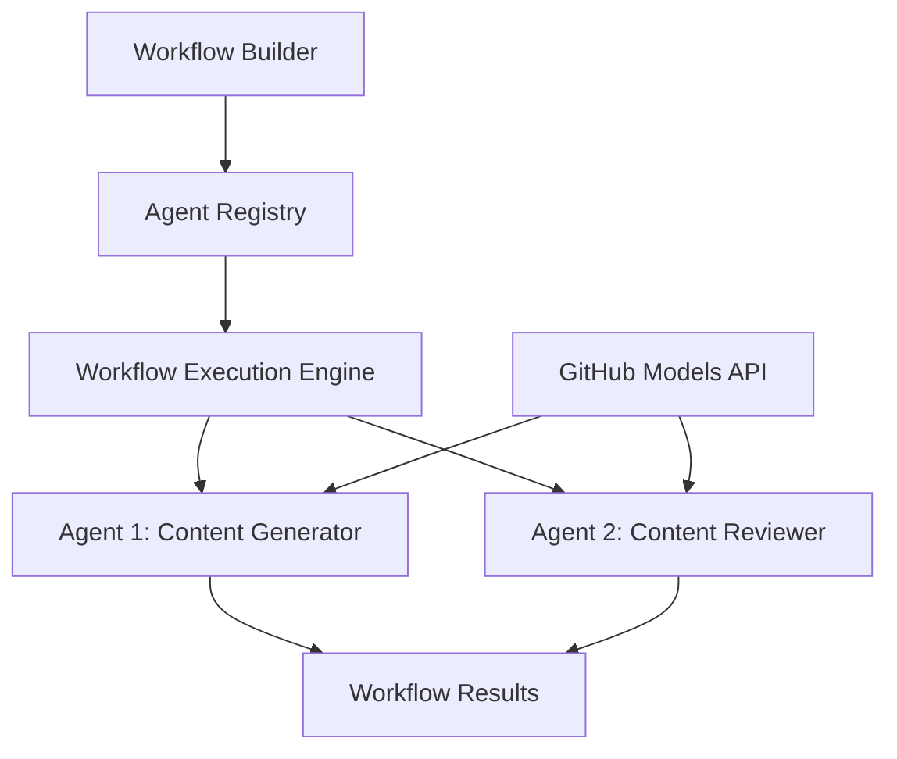

<!--
CO_OP_TRANSLATOR_METADATA:
{
  "original_hash": "034158688d0a45aae06dcbb21b0da5ae",
  "translation_date": "2025-11-11T13:00:57+00:00",
  "source_file": "08-multi-agent/code_samples/workflows-agent-framework/dotNET/01.dotnet-agent-framework-workflow-ghmodel-basic.md",
  "language_code": "my"
}
-->
# 🔄 GitHub Models (.NET) ကို အသုံးပြု၍ အခြေခံ Agent Workflows

## 📋 Workflow Orchestration သင်ခန်းစာ

ဒီ notebook က Microsoft Agent Framework for .NET နဲ့ GitHub Models ကို အသုံးပြုပြီး **agent workflows** တည်ဆောက်နည်းကို ပြသထားပါတယ်။ AI agents တွေကို structured orchestration patterns တွေဖြင့် ပေါင်းစပ်ပြီး အဆင့်ဆင့်လုပ်ငန်းစဉ်တွေကို အောင်မြင်စွာ ပြုလုပ်နိုင်ဖို့ သင်ယူပါမယ်။

## 🎯 သင်ယူရမယ့် အချက်များ

### 🏗️ **Workflow Architecture အခြေခံအချက်များ**
- **Workflow Builder**: အဆင့်ဆင့် AI လုပ်ငန်းစဉ်တွေကို တည်ဆောက်ပြီး စီမံခန့်ခွဲပါ
- **Agent Coordination**: လုပ်ငန်းစဉ်တွင်းမှာ အထူးပြု agent တွေကို ပေါင်းစပ်စီမံပါ
- **GitHub Models Integration**: GitHub ရဲ့ AI model inference service ကို workflows တွေမှာ အသုံးပြုပါ
- **Visual Workflow Design**: လုပ်ငန်းစဉ်ဖွဲ့စည်းမှုကို ပိုမိုနားလည်စေရန် ရှင်းလင်းသော ပုံစံဖြင့် ဖန်တီးပါ

### 🔄 **Process Orchestration Patterns**
- **Sequential Processing**: Agent tasks တွေကို အဆင့်ဆင့် logical order ဖြင့် ချိတ်ဆက်ပါ
- **State Management**: လုပ်ငန်းစဉ်အဆင့်တွေကြားမှာ context နဲ့ data flow ကို ထိန်းသိမ်းပါ
- **Error Handling**: အမှားတွေကို ပြန်လည်ပြုပြင်နိုင်တဲ့ စနစ်တကျလုပ်ငန်းစဉ် resilience ကို တည်ဆောက်ပါ
- **Performance Optimization**: အဖွဲ့အစည်းအဆင့်လုပ်ငန်းစဉ်တွေကို ထိရောက်စွာ ဒီဇိုင်းဆွဲပါ

### 🏢 **အဖွဲ့အစည်းလုပ်ငန်းစဉ်များ**
- **Business Process Automation**: အဖွဲ့အစည်းလုပ်ငန်းစဉ်တွေကို အဆင့်မြှင့်တင်ပါ
- **Content Production Pipeline**: ပြင်ဆင်ခြင်းနဲ့ အတည်ပြုခြင်းအဆင့်တွေပါဝင်တဲ့ အယ်ဒီတာလုပ်ငန်းစဉ်
- **Customer Service Automation**: ဖောက်သည်မေးခွန်းများကို အဆင့်ဆင့်ဖြေရှင်းခြင်း
- **Data Processing Workflows**: AI-powered transformation ပါဝင်တဲ့ ETL လုပ်ငန်းစဉ်

## ⚙️ လိုအပ်ချက်များနှင့် Setup

### 📦 **လိုအပ်သော NuGet Packages**

ဒီ workflow demonstration မှာ အရေးပါတဲ့ .NET packages အချို့ကို အသုံးပြုထားပါတယ်။

```xml
<!-- Core AI Framework -->
<PackageReference Include="Microsoft.Extensions.AI" Version="9.9.0" />

<!-- Agent Framework (Local Development) -->
<!-- Microsoft.Agents.AI.dll - Core agent abstractions -->
<!-- Microsoft.Agents.AI.OpenAI.dll - OpenAI/GitHub Models integration -->

<!-- Configuration and Environment -->
<PackageReference Include="DotNetEnv" Version="3.1.1" />
```

### 🔑 **GitHub Models Configuration**

**Environment Setup (.env file):**
```env
GITHUB_TOKEN=your_github_personal_access_token
GITHUB_ENDPOINT=https://models.inference.ai.azure.com
GITHUB_MODEL_ID=gpt-4o-mini
```

**GitHub Models Access:**
1. GitHub Models (လက်ရှိ preview) ကို စာရင်းသွင်းပါ
2. model access permissions ပါဝင်တဲ့ personal access token ကို ဖန်တီးပါ
3. အထက်မှာ ပြထားတဲ့အတိုင်း environment variables ကို configure လုပ်ပါ

### 🏗️ **Workflow Architecture အကျဉ်းချုပ်**



**အဓိက Components:**
- **WorkflowBuilder**: လုပ်ငန်းစဉ်တွေကို ဒီဇိုင်းဆွဲဖို့အတွက် အဓိက orchestration engine
- **AIAgent**: အထူးပြုစွမ်းရည်ရှိတဲ့ individual agents
- **GitHub Models Client**: AI model inference service integration
- **Execution Context**: လုပ်ငန်းစဉ်အဆင့်တွေကြားမှာ state နဲ့ data flow ကို စီမံခန့်ခွဲခြင်း

## 🎨 **အဖွဲ့အစည်းလုပ်ငန်းစဉ် ဒီဇိုင်း Patterns**

### 📝 **Content Production Workflow**
```
User Request → Content Generation → Quality Review → Final Output
```

### 🔍 **Document Processing Pipeline**
```
Document Input → Analysis → Extraction → Validation → Structured Output
```

### 💼 **Business Intelligence Workflow**
```
Data Collection → Processing → Analysis → Report Generation → Distribution
```

### 🤝 **Customer Service Automation**
```
Customer Inquiry → Classification → Processing → Response Generation → Follow-up
```

## 🏢 **အဖွဲ့အစည်းအကျိုးကျေးဇူးများ**

### 🎯 **ယုံကြည်မှုနှင့် အရွယ်အစား**
- **Deterministic Execution**: တိကျပြီး ထပ်တလဲလဲဖြစ်တဲ့ လုပ်ငန်းစဉ်ရလဒ်
- **Error Recovery**: လုပ်ငန်းစဉ်အဆင့်မဆို အမှားတွေကို ပြုပြင်နိုင်မှု
- **Performance Monitoring**: လုပ်ငန်းစဉ် metrics တွေကို စောင့်ကြည့်ပြီး အဆင့်မြှင့်တင်နိုင်မှု
- **Resource Management**: AI model resources တွေကို ထိရောက်စွာ အသုံးပြုခြင်း

### 🔒 **လုံခြုံမှုနှင့် အညီအနွယ်**
- **Secure Authentication**: GitHub token-based authentication ဖြင့် API access
- **Audit Trails**: လုပ်ငန်းစဉ်အဆင့်တွေအားလုံးကို မှတ်တမ်းတင်ထားခြင်း
- **Access Control**: လုပ်ငန်းစဉ်အဆင့်တွေအတွက် permission တွေကို စိတ်ကြိုက်ပြုလုပ်နိုင်မှု
- **Data Privacy**: လုပ်ငန်းစဉ်အတွင်း sensitive information ကို လုံခြုံစွာ စီမံခြင်း

### 📊 **Observability နှင့် စီမံခန့်ခွဲမှု**
- **Visual Workflow Design**: လုပ်ငန်းစဉ် flow နဲ့ အချင်းချင်းဆက်စပ်မှုကို ရှင်းလင်းစွာ ဖော်ပြထားခြင်း
- **Execution Monitoring**: လုပ်ငန်းစဉ်တိုးတက်မှုနဲ့ performance ကို အချိန်နှင့်တပြေးညီ စောင့်ကြည့်ခြင်း
- **Error Reporting**: အမှားတွေကို အသေးစိတ်ခွဲခြမ်းစိတ်ဖြာပြီး debugging လုပ်နိုင်မှု
- **Performance Analytics**: Optimization နဲ့ capacity planning အတွက် metrics တွေ

အခုတော့ သင့်ရဲ့ ပထမဆုံး enterprise-ready AI workflow ကို တည်ဆောက်လိုက်ရအောင်! 🚀

## 💻 Code ကို Run လုပ်ခြင်း

အပြည့်အစုံ implementation ကို `01.dotnet-agent-framework-workflow-ghmodel-basic.cs` မှာ ရှာနိုင်ပါတယ်။ ဒီ file မှာ ပြသထားတာတွေက:

1. **Environment Configuration** - GitHub Models credentials ကို `.env` file မှာ load လုပ်ခြင်း
2. **OpenAI Client Setup** - GitHub Models endpoint ကို အသုံးပြုဖို့ client ကို configure လုပ်ခြင်း
3. **Agent Creation** - အထူးပြု agent တွေ (Front Desk နဲ့ Concierge) ကို သတ်မှတ်ခြင်း
4. **Workflow Builder** - Sequential processing နဲ့ multi-agent workflow တည်ဆောက်ခြင်း
5. **Workflow Execution** - Streaming results နဲ့ workflow ကို run လုပ်ခြင်း

### 🚀 Example ကို Run လုပ်ခြင်း

```bash
# Make the script executable (Unix/Linux/macOS)
chmod +x 01.dotnet-agent-framework-workflow-ghmodel-basic.cs

# Run the workflow
./01.dotnet-agent-framework-workflow-ghmodel-basic.cs
```

Windows မှာ:
```powershell
dotnet run 01.dotnet-agent-framework-workflow-ghmodel-basic.cs
```

### 📝 မျှော်လင့်ရမယ့် Output

ဒီ workflow က:
1. သင့်ရဲ့ ခရီးသွား destination request ("I would like to go to Paris") ကို လက်ခံပါမယ်
2. Front Desk agent က အစပိုင်းအကြံပြုချက်ကို ပေးပါမယ်
3. Concierge agent က အကြံပြုချက်ကို ပြန်လည်သုံးသပ်ပြီး ပြုပြင်ပါမယ်
4. နောက်ဆုံး output မှာ အပြည့်အစုံ conversation stream ကို ပြသပါမယ်

### 🔧 Customization

သင့် workflow ကို အောက်ပါအတိုင်း customize လုပ်နိုင်ပါတယ်:
- Agent instructions တွေကို ပြောင်းလဲပြီး သူတို့ရဲ့ အပြုအမူကို ပြောင်းလဲပါ
- အဆင့်ဆင့် workflows တွေဖန်တီးဖို့ agent တွေကို ပေါင်းထည့်ပါ
- User message ကို ပြောင်းပြီး အခြား scenarios တွေကို စမ်းသပ်ပါ
- Workflow edges တွေကို ပြောင်းပြီး execution patterns အသစ်တွေ ဖန်တီးပါ

---

<!-- CO-OP TRANSLATOR DISCLAIMER START -->
**အကြောင်းကြားချက်**:  
ဤစာရွက်စာတမ်းကို AI ဘာသာပြန်ဝန်ဆောင်မှု [Co-op Translator](https://github.com/Azure/co-op-translator) ကို အသုံးပြု၍ ဘာသာပြန်ထားပါသည်။ ကျွန်ုပ်တို့သည် တိကျမှုအတွက် ကြိုးစားနေသော်လည်း အလိုအလျောက် ဘာသာပြန်မှုများတွင် အမှားများ သို့မဟုတ် မမှန်ကန်မှုများ ပါဝင်နိုင်သည်ကို သတိပြုပါ။ မူရင်းဘာသာစကားဖြင့် ရေးသားထားသော စာရွက်စာတမ်းကို အာဏာတရားရှိသော အရင်းအမြစ်အဖြစ် သတ်မှတ်သင့်ပါသည်။ အရေးကြီးသော အချက်အလက်များအတွက် လူက ဘာသာပြန်မှုကို အကြံပြုပါသည်။ ဤဘာသာပြန်မှုကို အသုံးပြုခြင်းမှ ဖြစ်ပေါ်လာသော အလွဲအမှားများ သို့မဟုတ် အနားလွဲမှုများအတွက် ကျွန်ုပ်တို့သည် တာဝန်မယူပါ။
<!-- CO-OP TRANSLATOR DISCLAIMER END -->