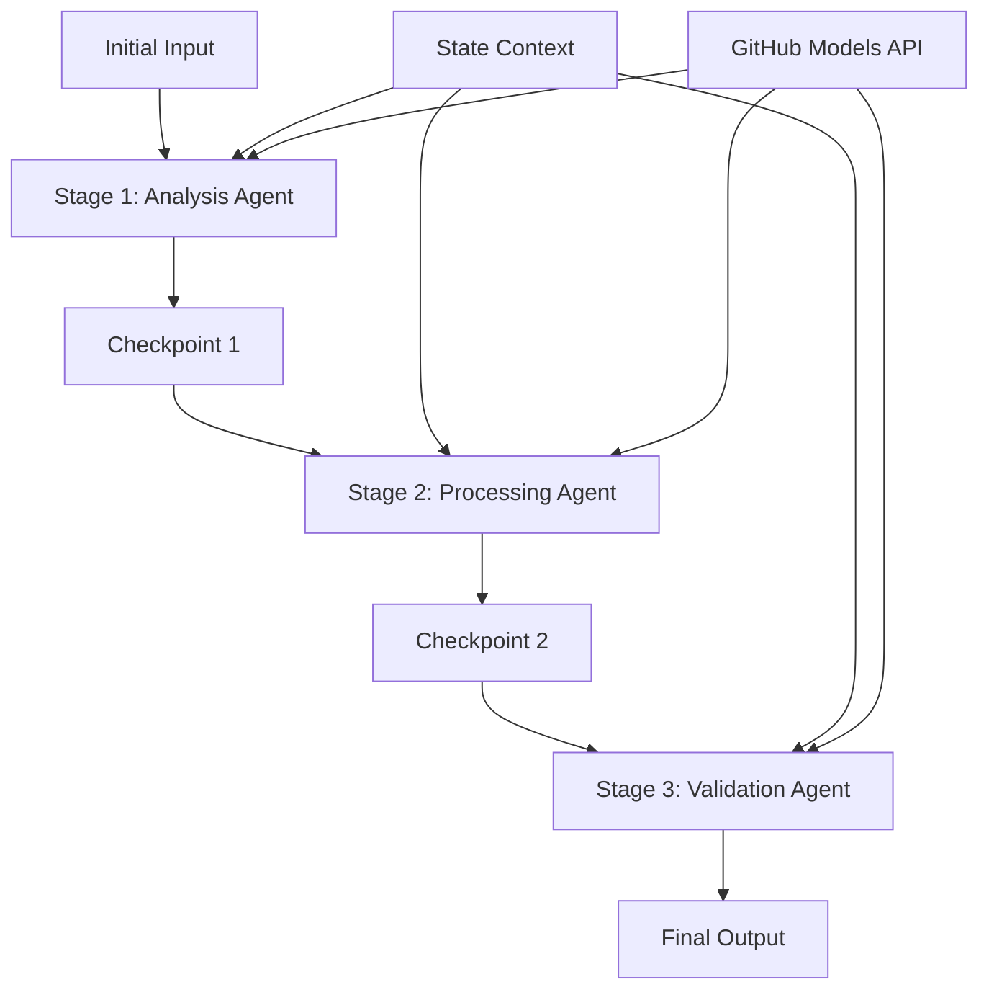

<!--
CO_OP_TRANSLATOR_METADATA:
{
  "original_hash": "1be9c8dcbd79a02d33d2c138684c1394",
  "translation_date": "2025-11-11T14:06:37+00:00",
  "source_file": "08-multi-agent/code_samples/workflows-agent-framework/dotNET/02.dotnet-agent-framework-workflow-ghmodel-sequential.md",
  "language_code": "my"
}
-->
# ⏩ GitHub Models (.NET) ကို အသုံးပြု၍ အဆင့်လိုက် Agent Workflows

## 📋 အဆင့်မြင့် အဆင့်လိုက် အလုပ်လုပ်ပုံ သင်ခန်းစာ

ဒီ notebook က Microsoft Agent Framework for .NET နဲ့ GitHub Models ကို အသုံးပြုပြီး **အဆင့်လိုက် workflow patterns** ကို ပြသထားပါတယ်။ အဆင့်လိုက် အလုပ်လုပ်ပုံ pipeline တွေကို တည်ဆောက်ပုံ၊ agent တွေကို အတိအကျ အဆင့်လိုက် အလုပ်လုပ်စေပြီး၊ အဆင့်တစ်ခုစီက ရလဒ်တွေကို နောက်တစ်ဆင့်မှာ ဆက်လက်အသုံးပြုပုံကို သင်ယူနိုင်ပါမယ်။

## 🎯 သင်ယူရမယ့် အချက်များ

### 🔄 **အဆင့်လိုက် အလုပ်လုပ်ပုံ Architecture**
- **Linear Workflow Design**: အဆင့်လိုက် အလုပ်လုပ်ပုံ pipeline တွေကို dependency ရှင်းလင်းစွာ ဖန်တီးခြင်း
- **State Management**: အဆင့်လိုက် workflow တွေမှာ context နဲ့ data flow ကို ထိန်းသိမ်းခြင်း
- **GitHub Models Integration**: GitHub ရဲ့ AI models ကို multi-stage .NET workflows တွေမှာ အသုံးပြုခြင်း
- **Enterprise Pipeline Patterns**: အဆင့်လိုက် အလုပ်လုပ်ပုံ စနစ်တွေကို production-ready အဆင့်အထိ တည်ဆောက်ခြင်း

### 🏗️ **အဆင့်မြင့် အဆင့်လိုက် Patterns**
- **Stage-Gate Processing**: Workflow အဆင့်တွေကြားမှာ validation checkpoints တွေ ထည့်သွင်းခြင်း
- **Context Preservation**: အဆင့်တိုင်းမှာ state နဲ့ accumulated knowledge ကို ထိန်းသိမ်းခြင်း
- **Error Propagation**: အဆင့်လိုက် processing chains တွေမှာ error တွေကို gracefully handle လုပ်ခြင်း
- **Performance Optimization**: အဆင့်လိုက် အလုပ်လုပ်ပုံကို အနည်းဆုံး overhead နဲ့ ထိရောက်စွာ အကောင်အထည်ဖော်ခြင်း

### 🏢 **အဆင့်လိုက် Enterprise Applications**
- **Document Processing Pipeline**: အဆင့်များစွာသော စာရွက်စာတမ်း analysis, transformation, validation
- **Quality Assurance Workflows**: အဆင့်လိုက် ပြန်လည်သုံးသပ်ခြင်း၊ validation နဲ့ အတည်ပြုခြင်း
- **Content Production Pipeline**: Research → Writing → Editing → Review → Publishing
- **Business Process Automation**: အဆင့်လိုက် business workflows တွေကို dependency ရှင်းလင်းစွာ ဖန်တီးခြင်း

## ⚙️ လိုအပ်ချက်များ & Setup

### 📦 **လိုအပ်သော NuGet Packages**

.NET အဆင့်လိုက် workflows အတွက် အရေးကြီးသော packages:

```xml
<!-- Core AI Framework -->
<PackageReference Include="Microsoft.Extensions.AI" Version="9.9.0" />

<!-- Client Model Abstractions -->
<PackageReference Include="System.ClientModel" Version="1.6.1.0" />

<!-- Azure Identity and Async LINQ Support -->
<PackageReference Include="Azure.Identity" Version="1.15.0" />
<PackageReference Include="System.Linq.Async" Version="6.0.3" />

<!-- Local Agent Framework References -->
<!-- Microsoft.Agents.AI.dll - Core agent abstractions -->
<!-- Microsoft.Agents.AI.OpenAI.dll - GitHub Models integration -->
```

### 🔑 **GitHub Models Configuration**

**Environment Setup (.env file):**
```env
GITHUB_TOKEN=your_github_personal_access_token
GITHUB_ENDPOINT=https://models.inference.ai.azure.com
GITHUB_MODEL_ID=gpt-4o-mini
```

**Configuration Management:**
```csharp
// Load environment variables securely
Env.Load("../../../.env");
var githubToken = Environment.GetEnvironmentVariable("GITHUB_TOKEN");
var githubEndpoint = Environment.GetEnvironmentVariable("GITHUB_ENDPOINT");
var modelId = Environment.GetEnvironmentVariable("GITHUB_MODEL_ID");
```

### 🏗️ **အဆင့်လိုက် Workflow Architecture**



**အဓိက Components:**
- **Sequential Agents**: အဆင့်တိုင်းအတွက် အထူးပြု agent များ
- **State Context**: အဆင့်တိုင်းမှာ accumulated data နဲ့ ဆုံးဖြတ်ချက်တွေကို ထိန်းသိမ်းခြင်း
- **Checkpoints**: အဆင့်တွေကြားမှာ quality နဲ့ consistency အတွက် validation points
- **GitHub Models Client**: Workflow အဆင့်တိုင်းမှာ AI model ကို တစ်ပြိုင်တည်း access လုပ်နိုင်ခြင်း

## 🎨 **အဆင့်လိုက် Workflow Design Patterns**

### 📝 **Document Processing Pipeline**
```
Raw Document → Content Extraction → Analysis → Validation → Structured Output
```

### 🎯 **Content Creation Workflow**
```
Brief/Requirements → Research → Content Creation → Review → Final Polish
```

### 🔍 **Quality Assurance Pipeline**
```
Initial Review → Technical Validation → Compliance Check → Final Approval
```

### 💼 **Business Intelligence Workflow**
```
Data Collection → Processing → Analysis → Report Generation → Distribution
```

## 🏢 **အဆင့်လိုက် Enterprise အကျိုးကျေးဇူးများ**

### 🎯 **ယုံကြည်မှု & အရည်အသွေး**
- **Deterministic Processing**: အဆင့်လိုက် structured stages တွေကြောင့် အမြဲတမ်း ထပ်တူကျတဲ့ ရလဒ်တွေ ရရှိခြင်း
- **Quality Gates**: အဆင့်တိုင်းမှာ validation checkpoints တွေဖြင့် အရည်အသွေးကို အတည်ပြုခြင်း
- **Error Isolation**: အဆင့်တစ်ခုမှာ ဖြစ်ပေါ်တဲ့ ပြဿနာတွေကို နောက်ထပ်အဆင့်တွေကို မထိခိုက်စေခြင်း
- **Audit Trails**: အဆင့်တိုင်းမှာ ဆုံးဖြတ်ချက်နဲ့ transformation တွေကို အပြည့်အစုံ tracking လုပ်နိုင်ခြင်း

### 📈 **Scalability & Performance**
- **Modular Design**: အဆင့်တိုင်းကို သီးသန့် optimize လုပ်နိုင်ခြင်း
- **Resource Management**: အဆင့်တိုင်းမှာ AI model resources တွေကို ထိရောက်စွာ အသုံးပြုခြင်း
- **State Optimization**: အဆင့်တွေကြားမှာ state transfer ကို အနည်းဆုံးဖြစ်အောင် optimize လုပ်ခြင်း
- **Parallel Stage Groups**: အဆင့်လိုက် workflows များစွာကို တစ်ပြိုင်တည်း run လုပ်နိုင်ခြင်း

### 🔒 **Security & Compliance**
- **Stage-Level Security**: အဆင့်တိုင်းအတွက် security policies များ
- **Data Validation**: အဆင့်တိုင်းမှာ data integrity နဲ့ compliance ကို အတည်ပြုခြင်း
- **Access Control**: Workflow အဆင့်တိုင်းအတွက် permission များကို သီးသန့် ထိန်းချုပ်နိုင်ခြင်း
- **Regulatory Compliance**: Structured processing ဖြင့် စည်းမျဉ်းများကို လိုက်နာနိုင်ခြင်း

### 📊 **Monitoring & Analytics**
- **Stage-Level Metrics**: Workflow အဆင့်တိုင်းအတွက် performance monitoring
- **Bottleneck Identification**: အဆင့်တွေအနည်းဆုံး optimize လုပ်ရန် slow stages တွေကို ရှာဖွေခြင်း
- **Quality Metrics**: အဆင့်တိုင်းမှာ quality နဲ့ success rates ကို tracking လုပ်ခြင်း
- **Process Optimization**: Stage-level analytics အပေါ် အခြေခံပြီး အဆင့်မြှင့်တင်ခြင်း

အားလုံးအဆင့်မြင့် AI processing pipelines တွေ တည်ဆောက်ကြစို့! 🚀

## 💻 Code ကို Run လုပ်ခြင်း

Implementation အပြည့်အစုံကို `02.dotnet-agent-framework-workflow-ghmodel-sequential.cs` မှာ ရရှိနိုင်ပါတယ်။ ဒီ file က **three-stage furniture analysis workflow** ကို ပြသထားပါတယ်။

1. **Stage 1 - Sales Agent**: furniture images ကို analysis လုပ်ပြီး purchase suggestions ပေးခြင်း
2. **Stage 2 - Price Agent**: pricing breakdowns နဲ့ budget options ပေးခြင်း
3. **Stage 3 - Quote Agent**: Markdown format နဲ့ professional quote document တစ်ခုကို ဖန်တီးပေးခြင်း

### 🏗️ **Workflow Architecture**

```
Image Input → Sales Analysis → Price Estimation → Quote Generation → Final Output
```

Agent တစ်ခုစီ:
- နောက်တစ်ဆင့်အတွက် context အနေနဲ့ အရင်အဆင့်ရဲ့ output ကို လက်ခံခြင်း
- အရင် analysis အပေါ် အခြေခံပြီး အထူးပြု expertise ဖြင့် ဆက်လက်လုပ်ဆောင်ခြင်း
- State management ဖြင့် workflow continuity ကို ထိန်းသိမ်းခြင်း

### 🚀 Example ကို Run လုပ်ခြင်း

**လိုအပ်ချက်များ:**
- Furniture image ကို `../imgs/home.png` (သို့မဟုတ် `imgPath` variable ကို update လုပ်ပါ) မှာ ထည့်ပါ
- GitHub Models credentials နဲ့ `.env` file ကို configure လုပ်ပါ

```bash
# Make the script executable (Unix/Linux/macOS)
chmod +x 02.dotnet-agent-framework-workflow-ghmodel-sequential.cs

# Run the sequential workflow
./02.dotnet-agent-framework-workflow-ghmodel-sequential.cs
```

Windows မှာ:
```powershell
dotnet run 02.dotnet-agent-framework-workflow-ghmodel-sequential.cs
```

### 📝 မျှော်လင့်ရသော Output

Workflow က:
1. **Sales Agent**: Image ထဲက furniture items တွေကို ရှာဖွေပြီး အကြံပေးချက်တွေ ပေးပါမယ်
2. **Price Agent**: Pricing analysis နဲ့ budget tiers, shopping recommendations တွေ ထည့်သွင်းပါမယ်
3. **Quote Agent**: အချက်အလက်အားလုံးကို စုစည်းပြီး formatted quote document တစ်ခု ဖန်တီးပါမယ်

နောက်ဆုံး output က furniture image analysis အပေါ် အခြေခံပြီး professional furniture quote တစ်ခု ဖြစ်ပါမယ်။

### 🔧 Customization Options

**Agent Behavior ကို ပြောင်းလဲခြင်း:**
```csharp
// Adjust agent instructions to change their focus
const string SalesAgentInstructions = "Your custom instructions...";
```

**Sequential Flow ကို ပြောင်းလဲခြင်း:**
```csharp
// Add or reorder workflow stages
var workflow = new WorkflowBuilder(salesagent)
    .AddEdge(salesagent, priceagent)
    .AddEdge(priceagent, quoteagent)
    .AddEdge(quoteagent, newAgent)  // Add another stage
    .Build();
```

**Input ကို ပြောင်းလဲခြင်း:**
```csharp
// Process text instead of images
ChatMessage userMessage = new ChatMessage(ChatRole.User, [
    new TextContent("Analyze pricing for a modern living room set")
]);
```

### 🎯 အမှန်တကယ် အသုံးချ Applications

ဒီအဆင့်လိုက် pattern က အောက်ပါအတွက် အထူးသင့်လျော်ပါတယ်:
- **E-commerce**: Product analysis → Pricing → Quote generation
- **Real Estate**: Property analysis → Valuation → Listing creation
- **Insurance**: Claim analysis → Assessment → Quote generation
- **Content Creation**: Research → Writing → Editing → Publishing

### 🔍 State Flow ကို နားလည်ခြင်း

Sequence ထဲက agent တစ်ခုစီက:
- **Original Input**: User message (image + text) ကို လက်ခံခြင်း
- **Previous Agent Outputs**: အရင် agent response တွေကို conversation history အနေနဲ့ လက်ခံခြင်း
- **Accumulated Context**: Workflow တစ်ခုလုံးမှာ state ကို ထိန်းသိမ်းထားခြင်း

ဒီလိုနည်းလမ်းက အဆင့်များစွာသော processing ကို sophisticated အဆင့်အထိ တည်ဆောက်နိုင်ပြီး၊ agent တစ်ခုစီက အရင်အဆင့်တွေရဲ့ context အားလုံးကို အခြေခံပြီး ဆက်လက်လုပ်ဆောင်နိုင်ပါတယ်။

---

<!-- CO-OP TRANSLATOR DISCLAIMER START -->
**အကြောင်းကြားချက်**:  
ဤစာရွက်စာတမ်းကို AI ဘာသာပြန်ဝန်ဆောင်မှု [Co-op Translator](https://github.com/Azure/co-op-translator) ကို အသုံးပြု၍ ဘာသာပြန်ထားပါသည်။ ကျွန်ုပ်တို့သည် တိကျမှုအတွက် ကြိုးစားနေသော်လည်း အလိုအလျောက် ဘာသာပြန်မှုများတွင် အမှားများ သို့မဟုတ် မမှန်ကန်မှုများ ပါဝင်နိုင်သည်ကို သတိပြုပါ။ မူရင်းဘာသာစကားဖြင့် ရေးသားထားသော စာရွက်စာတမ်းကို အာဏာတရ အရင်းအမြစ်အဖြစ် သတ်မှတ်သင့်ပါသည်။ အရေးကြီးသော အချက်အလက်များအတွက် လူက ဘာသာပြန်မှုကို အသုံးပြုရန် အကြံပြုပါသည်။ ဤဘာသာပြန်မှုကို အသုံးပြုခြင်းမှ ဖြစ်ပေါ်လာသော အလွဲအမှားများ သို့မဟုတ် အနားယူမှုများအတွက် ကျွန်ုပ်တို့သည် တာဝန်မယူပါ။
<!-- CO-OP TRANSLATOR DISCLAIMER END -->