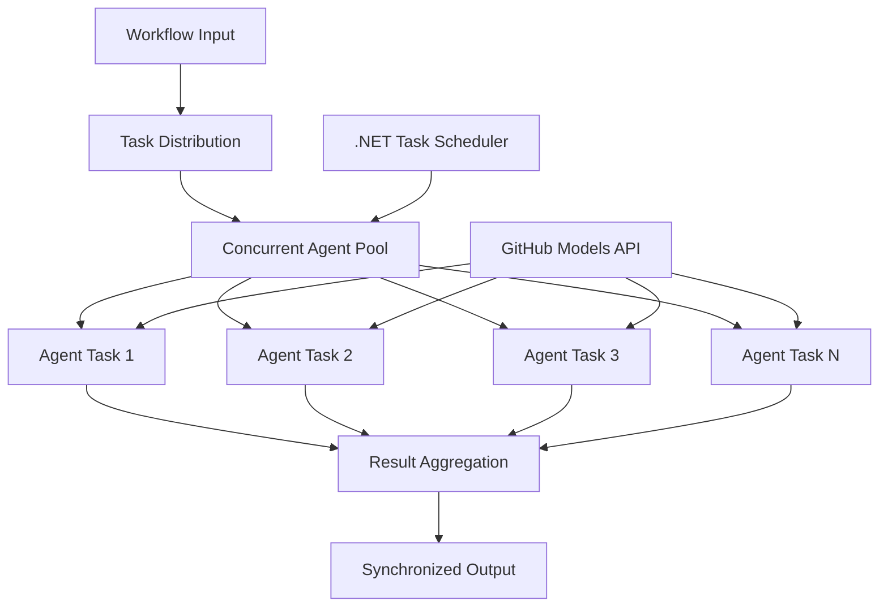

<!--
CO_OP_TRANSLATOR_METADATA:
{
  "original_hash": "b9c6e32c9b5f2fed20b6916984440d88",
  "translation_date": "2025-11-11T13:34:26+00:00",
  "source_file": "08-multi-agent/code_samples/workflows-agent-framework/dotNET/03.dotnet-agent-framework-workflow-ghmodel-concurrent.md",
  "language_code": "my"
}
-->
# ⚡ GitHub Models (.NET) နှင့်အတူ တစ်ချိန်တည်းလုပ်ဆောင်နိုင်သော Agent Workflows

## 📋 မြန်နှုန်းမြင့် Parallel Processing သင်ခန်းစာ

ဒီ notebook က Microsoft Agent Framework for .NET နဲ့ GitHub Models ကို အသုံးပြုပြီး **တစ်ချိန်တည်းလုပ်ဆောင်နိုင်သော workflow ပုံစံများ** ကို ပြသထားပါတယ်။ AI agents များကို တစ်ချိန်တည်းတွင် အများအပြား အလုပ်လုပ်ဆောင်စေပြီး throughput ကို အများဆုံးတိုးမြှင့်နိုင်တဲ့ high-performance, parallel processing workflows ကို တည်ဆောက်ပုံကို သင်လေ့လာနိုင်ပါမယ်။ 

## 🎯 သင်ယူရမည့်အရာများ

### 🚀 **တစ်ချိန်တည်းလုပ်ဆောင်နိုင်မှု အခြေခံများ**
- **Parallel Agent Execution**: AI agents များကို တစ်ချိန်တည်းတွင် အများဆုံး performance ရရှိရန် အလုပ်လုပ်ဆောင်စေခြင်း
- **Async/Await Patterns**: .NET ရဲ့ async programming model ကို အသုံးပြု၍ အကျိုးရှိသော concurrency ရရှိခြင်း
- **GitHub Models Integration**: GitHub ရဲ့ AI model inference service ကို တစ်ချိန်တည်းတွင် ခေါ်ယူမှုများကို စီမံခြင်း
- **Resource Management**: တစ်ချိန်တည်းလုပ်ဆောင်မှုများအတွက် AI model resources ကို ထိရောက်စွာ စီမံခြင်း

### 🏗️ **တစ်ချိန်တည်းလုပ်ဆောင်နိုင်မှု အဆင့်မြင့် Architecture**
- **Task-Based Parallelism**: .NET Task Parallel Library ကို အသုံးပြု၍ အကောင်းဆုံး တစ်ချိန်တည်းလုပ်ဆောင်မှု ရရှိခြင်း
- **Synchronization Patterns**: တစ်ချိန်တည်းလုပ်ဆောင်နေသော agents များကို စီမံခြင်းနှင့် race conditions မဖြစ်အောင် ကာကွယ်ခြင်း
- **Load Balancing**: ရရှိနိုင်သော processing capacity အတွင်း အလုပ်များကို ထိရောက်စွာ ဖြန့်ဝေခြင်း
- **Fault Tolerance**: တစ်ဦး agent fail ဖြစ်ပါက အားလုံး workflow ရပ်မနေစေရန် စီမံခြင်း

### 🏢 **အဖွဲ့အစည်းအဆင့် တစ်ချိန်တည်းလုပ်ဆောင်နိုင်မှု Applications**
- **High-Volume Document Processing**: စာရွက်များကို တစ်ချိန်တည်းတွင် အများအပြား လုပ်ဆောင်ခြင်း
- **Real-Time Content Analysis**: ဝင်လာသော data streams များကို တစ်ချိန်တည်းတွင် ခွဲခြမ်းစိတ်ဖြာခြင်း
- **Batch Processing Optimization**: အကြီးစား data processing operations များအတွက် throughput ကို အများဆုံးတိုးမြှင့်ခြင်း
- **Multi-Modal Analysis**: အမျိုးမျိုးသော content types နှင့် formats များကို တစ်ချိန်တည်းတွင် လုပ်ဆောင်ခြင်း

## ⚙️ လိုအပ်ချက်များနှင့် Setup

### 📦 **လိုအပ်သော NuGet Packages**

မြန်နှုန်းမြင့် တစ်ချိန်တည်းလုပ်ဆောင်နိုင်သော workflows အတွက် အရေးကြီးသော packages:

```xml
<!-- Core AI Framework with Async Support -->
<PackageReference Include="Microsoft.Extensions.AI" Version="9.9.0" />

<!-- Client Model Abstractions for API Communication -->
<PackageReference Include="System.ClientModel" Version="1.6.1.0" />

<!-- Azure Identity and Async LINQ for Advanced Operations -->
<PackageReference Include="Azure.Identity" Version="1.15.0" />
<PackageReference Include="System.Linq.Async" Version="6.0.3" />

<!-- Local Agent Framework References -->
<!-- Microsoft.Agents.AI.dll - Core agent abstractions with async support -->
<!-- Microsoft.Agents.AI.OpenAI.dll - GitHub Models integration with concurrency -->
```

### 🔑 **GitHub Models Configuration**

**Environment Setup (.env file):**
```env
GITHUB_TOKEN=your_github_personal_access_token
GITHUB_ENDPOINT=https://models.inference.ai.azure.com
GITHUB_MODEL_ID=gpt-4o-mini
```

**Concurrent Processing Considerations:**
```csharp
// Configure for concurrent operations
var clientOptions = new OpenAIClientOptions()
{
    Endpoint = new Uri(githubEndpoint),
    // Configure connection pooling for concurrent requests
    NetworkTimeout = TimeSpan.FromMinutes(5)
};
```

### 🏗️ **Concurrent Workflow Architecture**



**အဓိက Components:**
- **Task Parallel Library**: .NET ရဲ့ တစ်ချိန်တည်းလုပ်ဆောင်မှုများအတွက် built-in support
- **Agent Pool**: Parallel processing အတွက် agent instances အများအပြား
- **Result Aggregation**: တစ်ချိန်တည်းလုပ်ဆောင်နေသော agent results များကို စီမံခြင်းနှင့် ပေါင်းစည်းခြင်း
- **Synchronization Points**: တစ်ချိန်တည်းလုပ်ဆောင်မှုများအတွင်း data consistency ရရှိစေရန်

## 🎨 **Concurrent Workflow Design Patterns**

### 🔍 **Parallel Research & Analysis**
```
Research Topic → Concurrent Research Agents → Result Synthesis → Final Report
```

### 📊 **Multi-Source Data Processing**
```
Data Sources → Parallel Processing Agents → Data Integration → Unified Output
```

### 🎭 **Content Generation Pipeline**
```
Content Requirements → Concurrent Content Generators → Quality Review → Final Content
```

### 🔄 **Fan-Out/Fan-In Processing**
```
Single Input → Multiple Concurrent Processors → Result Aggregation → Single Output
```

## 🏢 **အဖွဲ့အစည်းအဆင့် Performance အကျိုးကျေးဇူးများ**

### ⚡ **Throughput & Scalability**
- **Linear Performance Scaling**: တစ်ချိန်တည်းလုပ်ဆောင်နိုင်သော agents များ ပေါင်းထည့်ခြင်းအားဖြင့် throughput တိုးမြှင့်ခြင်း
- **Resource Utilization**: ရရှိနိုင်သော AI model capacity ကို အများဆုံး ထိရောက်စွာ အသုံးပြုခြင်း
- **Reduced Processing Time**: Parallel execution ဖြင့် processing အချိန်ကို အများကြီး လျှော့ချနိုင်ခြင်း
- **Elastic Scaling**: workload အပေါ်မူတည်၍ တစ်ချိန်တည်းလုပ်ဆောင်နိုင်သော agent အရေအတွက်ကို အလိုအလျောက် ပြောင်းလဲခြင်း

### 🛡️ **Reliability & Resilience**
- **Fault Isolation**: တစ်ဦး agent fail ဖြစ်ပါက အခြားတစ်ချိန်တည်းလုပ်ဆောင်မှုများကို မထိခိုက်စေရန်
- **Graceful Degradation**: agent capacity လျော့နည်းသည့်အခါ system ဆက်လက်လုပ်ဆောင်နိုင်ခြင်း
- **Error Recovery**: fail ဖြစ်သော တစ်ချိန်တည်းလုပ်ဆောင်မှုများအတွက် automatic retry mechanisms
- **Load Distribution**: ရရှိနိုင်သော agents များအတွင်း အလုပ်များကို တန်းတူ ဖြန့်ဝေခြင်း

### 📊 **Performance Monitoring**
- **Concurrent Execution Metrics**: တစ်ချိန်တည်းလုပ်ဆောင်မှုများ၏ performance ကို စောင့်ကြည့်ခြင်း
- **Resource Usage Analytics**: CPU, memory, နှင့် network utilization ကို စောင့်ကြည့်ခြင်း
- **Throughput Analysis**: တစ်ချိန်တည်းလုပ်ဆောင်မှုများမှ efficiency ရရှိမှုကို တိုင်းတာခြင်း
- **Bottleneck Detection**: performance constraints များကို ရှာဖွေပြီး ဖြေရှင်းခြင်း

### 🔧 **Development & Operations**
- **Async Programming Model**: .NET ရဲ့ အဆင့်မြင့် async/await patterns ကို အသုံးပြုခြင်း
- **Task Coordination**: တစ်ချိန်တည်းလုပ်ဆောင်မှုများအတွက် built-in task management နှင့် coordination capabilities
- **Exception Handling**: တစ်ချိန်တည်းလုပ်ဆောင်မှုများအတွက် comprehensive error handling
- **Debugging Support**: Visual Studio debugging tools ကို အသုံးပြု၍ တစ်ချိန်တည်း workflows များကို debug လုပ်ခြင်း

အမြန်နှုန်းမြင့် တစ်ချိန်တည်းလုပ်ဆောင်နိုင်သော AI workflows များကို .NET ဖြင့် တည်ဆောက်ကြစို့! 🚀

## 💻 Code ကို Run လုပ်ခြင်း

အပြည့်အစုံ implementation ကို `03.dotnet-agent-framework-workflow-ghmodel-concurrent.cs` တွင် ရရှိနိုင်ပါသည်။ ဒီ file က travel planning အတွက် **Fan-Out/Fan-In concurrent workflow** ကို ပြသထားပါတယ်:

### 🏗️ **Workflow Architecture**

```
User Request → ConcurrentStartExecutor → [Researcher Agent || Planner Agent] → ConcurrentAggregationExecutor → Final Output
```

**အဓိက Components:**

1. **ConcurrentStartExecutor**: user request ကို တစ်ချိန်တည်းတွင် agents အားလုံးသို့ broadcast လုပ်ခြင်း
2. **Researcher Agent**: destinations နှင့် attractions များကို တစ်ချိန်တည်းတွင် ခွဲခြမ်းစိတ်ဖြာခြင်း
3. **Planner Agent**: detailed travel plans များကို တစ်ချိန်တည်းတွင် ဖန်တီးခြင်း
4. **ConcurrentAggregationExecutor**: agents နှစ်ဦးမှ ရလဒ်များကို စုစည်းပြီး ပေါင်းစည်းခြင်း

### 🎯 **Fan-Out/Fan-In Pattern**

ဒီ workflow က **Fan-Out/Fan-In** pattern ရဲ့ classic ပုံစံကို ပြသထားပါတယ်:
- **Fan-Out**: input message တစ်ခုကို တစ်ချိန်တည်းတွင် agents အများအပြားသို့ broadcast လုပ်ခြင်း
- **Concurrent Processing**: agents များသည် တစ်ချိန်တည်းတွင် တစ်ခုတည်းသော task ကို လုပ်ဆောင်ခြင်း
- **Fan-In**: agents အားလုံးမှ ရလဒ်များကို စုစည်းပြီး output တစ်ခုအဖြစ် ပေါင်းစည်းခြင်း

### 🚀 Example ကို Run လုပ်ခြင်း

```bash
# Make the script executable (Unix/Linux/macOS)
chmod +x 03.dotnet-agent-framework-workflow-ghmodel-concurrent.cs

# Run the concurrent workflow
./03.dotnet-agent-framework-workflow-ghmodel-concurrent.cs
```

Windows တွင်:
```powershell
dotnet run 03.dotnet-agent-framework-workflow-ghmodel-concurrent.cs
```

### 📝 မျှော်လင့်ရသော Output

Workflow သည်:
1. **Broadcast Request**: "Plan a trip to Seattle in December" ကို agents နှစ်ဦးသို့ ပို့ခြင်း
2. **Concurrent Processing**: agents နှစ်ဦးသည် တစ်ချိန်တည်းတွင် အလုပ်လုပ်ဆောင်ခြင်း:
   - Researcher သည် attractions နှင့် details များကို ရှာဖွေခြင်း
   - Planner သည် itinerary နှင့် logistics များကို ဖန်တီးခြင်း
3. **Aggregation**: response နှစ်ခုကို ပေါင်းစည်းပြီး output တစ်ခုအဖြစ် ပြုလုပ်ခြင်း
4. **Display Results**: travel plan အပြည့်အစုံကို ပြသခြင်း

### 🔧 Customization Options

**Concurrent Agents ပေါင်းထည့်ခြင်း:**
```csharp
// Create additional specialized agents
AIAgent budgetAgent = openAIClient.GetChatClient(github_model_id).CreateAIAgent(
    name: "Budget-Agent", instructions: "Calculate travel costs...");

// Add to fan-out
var workflow = new WorkflowBuilder(startExecutor)
    .AddFanOutEdge(startExecutor, targets: [researcherAgent, plannerAgent, budgetAgent])
    .AddFanInEdge(aggregationExecutor, sources: [researcherAgent, plannerAgent, budgetAgent])
    .WithOutputFrom(aggregationExecutor)
    .Build();

// Update aggregation count
if (this._messages.Count == 3) { ... }
```

**Agent Instructions ပြောင်းလဲခြင်း:**
```csharp
const string ResearcherAgentInstructions = "Your custom instructions for research...";
const string PlanAgentInstructions = "Your custom instructions for planning...";
```

**Task ကို ပြောင်းလဲခြင်း:**
```csharp
StreamingRun run = await InProcessExecution.StreamAsync(
    workflow, 
    "Plan a European vacation for 2 weeks in summer"
);
```

### 🎯 အမှန်တကယ် Applications

ဒီ concurrent pattern သည် အောက်ပါအတွက် အထူးသင့်လျော်ပါသည်:
- **Content Creation**: စာရေးသူများ အပိုင်းအခြားများကို တစ်ချိန်တည်းတွင် ဖန်တီးခြင်း
- **Code Review**: code ကို အမြင်အမျိုးမျိုးဖြင့် တစ်ချိန်တည်းတွင် စစ်ဆေးခြင်း
- **Market Research**: market segments များကို တစ်ချိန်တည်းတွင် ခွဲခြမ်းစိတ်ဖြာခြင်း
- **Document Processing**: extraction, analysis, နှင့် validation ကို တစ်ချိန်တည်းတွင် လုပ်ဆောင်ခြင်း
- **Multi-Perspective Analysis**: input တစ်ခုအပေါ် အမြင်အမျိုးမျိုး ရရှိခြင်း

### 🔍 Custom Executors ကို နားလည်ခြင်း

**ConcurrentStartExecutor:**
- `IMessageHandler<string>` ကို implement လုပ်ပြီး string input ကို လက်ခံခြင်း
- messages များကို agents အားလုံးသို့ broadcast လုပ်ခြင်း
- `TurnToken` ကို ပို့ပြီး တစ်ချိန်တည်းလုပ်ဆောင်မှုကို trigger လုပ်ခြင်း

**ConcurrentAggregationExecutor:**
- `IMessageHandler<ChatMessage>` ကို implement လုပ်ပြီး agent responses ကို လက်ခံခြင်း
- thread-safe ဖြစ်သော နည်းလမ်းဖြင့် messages များကို စုစည်းခြင်း
- မျှော်လင့်ထားသော responses အားလုံးရောက်လာသောအခါ aggregate လုပ်ခြင်း
- `context.YieldOutputAsync()` ကို အသုံးပြု၍ final output ကို ပေးခြင်း

### ⚡ Performance အကျိုးကျေးဇူးများ

**Concurrent vs Sequential:**
- Sequential: Agent1 (30s) → Agent2 (30s) = **60 seconds total**
- Concurrent: Agent1 (30s) || Agent2 (30s) = **30 seconds total**

**Throughput တိုးမြှင့်မှု**: workload နှင့် resources အပေါ်မူတည်၍ N concurrent agents အတွက် N× မြန်ဆန်နိုင်ခြင်း

### 🛡️ Error Handling

Workflow သည် agent တစ်ဦး fail ဖြစ်ပါက အကျိုးသက်ရောက်မှုကို ထိန်းချုပ်နိုင်ပါသည်:
- တစ်ဦး agent fail ဖြစ်ပါက အခြားများ ဆက်လက်လုပ်ဆောင်နိုင်ခြင်း
- Aggregator သည် timeout logic ကို implement လုပ်နိုင်ခြင်း
- လိုအပ်ပါက partial results ကို ပြန်ပေးနိုင်ခြင်း

### 📊 အဆင့်မြင့် Features

**Dynamic Agent Count:**
aggregation logic ကို variable agent counts ကို support ပြုလုပ်ရန် ပြောင်းလဲနိုင်ပါသည်:

```csharp
private int _expectedAgentCount;
private readonly List<ChatMessage> _messages = [];

public async ValueTask HandleAsync(ChatMessage message, IWorkflowContext context)
{
    this._messages.Add(message);
    if (this._messages.Count == _expectedAgentCount)
    {
        // Process aggregation
    }
}
```

ဒီ concurrent workflow pattern သည် မြန်နှုန်းမြင့်၊ scalable AI agent systems များကို တည်ဆောက်ရန် အရေးကြီးပါသည်!

---

<!-- CO-OP TRANSLATOR DISCLAIMER START -->
**အကြောင်းကြားချက်**:  
ဤစာရွက်စာတမ်းကို AI ဘာသာပြန်ဝန်ဆောင်မှု [Co-op Translator](https://github.com/Azure/co-op-translator) ကို အသုံးပြု၍ ဘာသာပြန်ထားပါသည်။ ကျွန်ုပ်တို့သည် တိကျမှုအတွက် ကြိုးစားနေသော်လည်း အလိုအလျောက် ဘာသာပြန်မှုများတွင် အမှားများ သို့မဟုတ် မမှန်ကန်မှုများ ပါဝင်နိုင်သည်ကို သတိပြုပါ။ မူရင်းဘာသာစကားဖြင့် ရေးသားထားသော စာရွက်စာတမ်းကို အာဏာတရ အရင်းအမြစ်အဖြစ် သတ်မှတ်သင့်ပါသည်။ အရေးကြီးသော အချက်အလက်များအတွက် လူက ဘာသာပြန်မှုကို အသုံးပြုရန် အကြံပြုပါသည်။ ဤဘာသာပြန်မှုကို အသုံးပြုခြင်းမှ ဖြစ်ပေါ်လာသော အလွဲအမှားများ သို့မဟုတ် အနားလွဲမှုများအတွက် ကျွန်ုပ်တို့သည် တာဝန်မယူပါ။
<!-- CO-OP TRANSLATOR DISCLAIMER END -->