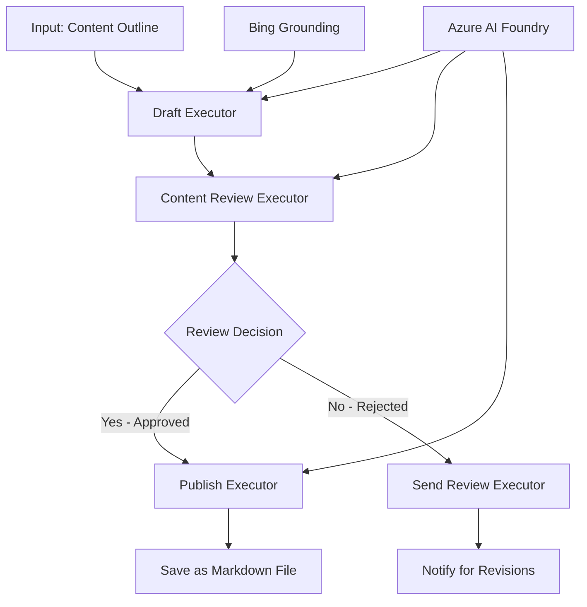

<!--
CO_OP_TRANSLATOR_METADATA:
{
  "original_hash": "8abd335151cee553293b637ee3d80d10",
  "translation_date": "2025-11-11T12:33:42+00:00",
  "source_file": "08-multi-agent/code_samples/workflows-agent-framework/dotNET/04.dotnet-agent-framework-workflow-aifoundry-condition.md",
  "language_code": "my"
}
-->
# 🔀 Azure AI Foundry (.NET) ဖြင့် အခြေအနေအခြေခံ Agent Workflows

## 📋 အခြေအနေအခြေခံ Intelligent Workflow Tutorial

ဒီ notebook က Azure AI Foundry နဲ့ Microsoft Agent Framework for .NET ကို အသုံးပြုပြီး **အခြေအနေအခြေခံ workflow patterns** ကို ပြသထားပါတယ်။ AI အကဲဖြတ်မှု၊ စီးပွားရေးစည်းမျဉ်းများနဲ့ အခြေအနေအပြောင်းအလဲများအပေါ် အခြေခံပြီး အဆင့်မြင့်၊ ဆုံးဖြတ်ချက်အခြေခံ workflows ကို တည်ဆောက်ပုံကို သင်ယူနိုင်ပါမယ်။

## 🎯 သင်ယူရမည့် အချက်များ

### 🧠 **Intelligent Decision Architecture**
- **အခြေအနေအခြေခံ Logic အကောင်အထည်ဖော်ခြင်း**: အခွဲအခြာများစွာပါဝင်တဲ့ ဆုံးဖြတ်ချက်ပုံစံများ တည်ဆောက်ပါ။
- **AI-Powered Routing**: Azure AI Foundry models ကို အသုံးပြုပြီး အခြေအနေအခြေခံ routing ဆုံးဖြတ်ချက်များ ပြုလုပ်ပါ။
- **Dynamic Workflow Adaptation**: အချိန်နဲ့အမျှ အခြေအနေများအပေါ် workflow အပြုအပြောင်းများ ပြုလုပ်ပါ။
- **စီးပွားရေးစည်းမျဉ်းများ ထည့်သွင်းခြင်း**: စီးပွားရေးစည်းမျဉ်းများနဲ့ လိုက်နာမှုလိုအပ်ချက်များကို workflows တွင် ထည့်သွင်းပါ။

### 🔀 **အဆင့်မြင့် အခြေအနေအခြေခံ Patterns**
- **Multi-Criteria Decision Making**: Routing ဆုံးဖြတ်ချက်များအတွက် အချက်အလက်များစွာကို အကဲဖြတ်ပါ။
- **Context-Aware Processing**: Workflow context နဲ့ သမိုင်းအပေါ် အခြေခံပြီး ဆုံးဖြတ်ချက်များ ပြုလုပ်ပါ။
- **Adaptive Workflow Modification**: အချိန်နဲ့အမျှ အခြေအနေများအပေါ် processing paths များကို ပြုလုပ်ပါ။
- **Rule Engine Integration**: Sophisticated စီးပွားရေးစည်းမျဉ်းများကို workflows တွင် ထည့်သွင်းပါ။

### 🏢 **စီးပွားရေးအခြေအနေအခြေခံ Applications**
- **စာရွက်စာတမ်း အမျိုးအစားခွဲခြင်းနှင့် Routing**: စာရွက်စာတမ်းများကို သင့်လျော်သော workflows သို့ အလိုအလျောက် ခွဲခြားပြီး ပို့ပါ။
- **Customer Service Triage**: ဖောက်သည်မေးခွန်းများကို အထူးကုအဖွဲ့များသို့ အလိုအလျောက် ပို့ပါ။
- **Compliance & Risk Processing**: အန္တရာယ်အကဲဖြတ်မှုအပေါ် အခြေခံပြီး validation နှင့် ပြန်လည်သုံးသပ်မှုလုပ်ငန်းစဉ်များကို အသုံးပြုပါ။
- **Quality Assurance Workflows**: အရည်အသွေး metrics အပေါ် အခြေခံပြီး သင့်လျော်သော ပြန်လည်သုံးသပ်မှုလုပ်ငန်းစဉ်များသို့ ပို့ပါ။

## ⚙️ လိုအပ်ချက်များနှင့် Setup

### 📦 **လိုအပ်သော NuGet Packages**

အခြေအနေအခြေခံ workflow processing အတွက် အဆင့်မြင့် packages:

```xml
<!-- Core AI Framework -->
<PackageReference Include="Microsoft.Extensions.AI" Version="9.9.0" />

<!-- Azure AI Agents with Persistent State -->
<PackageReference Include="Azure.AI.Agents.Persistent" Version="1.2.0-beta.5" />

<!-- Azure Identity and Utilities -->
<PackageReference Include="Azure.Identity" Version="1.15.0" />
<PackageReference Include="System.Linq.Async" Version="6.0.3" />
<PackageReference Include="DotNetEnv" Version="3.1.1" />

<!-- Local Workflow Framework References -->
<!-- Microsoft.Agents.Workflows.dll - Advanced workflow orchestration -->
<!-- Microsoft.Agents.AI.AzureAI.dll - Azure AI Foundry integration -->
<!-- Microsoft.Agents.AI.dll - Core agent abstractions -->
```

### 🔑 **Azure AI Foundry Configuration**

**လိုအပ်သော Azure Resources:**
- Conditional processing models ပါဝင်တဲ့ Azure AI Foundry workspace
- Compute quotas နဲ့ permissions များပါဝင်တဲ့ Azure subscription
- ဆုံးဖြတ်ချက်လုပ်ခြင်းနှင့် content analysis အတွက် AI models များကို deploy လုပ်ထားခြင်း
- (Optional) Bing Search API connection grounding capabilities အတွက်

**Environment Configuration (.env file):**
```env
# Azure AI Foundry Configuration
AZURE_AI_PROJECT_ENDPOINT=https://your-project.cognitiveservices.azure.com/
BING_CONNECTION_ID=your-bing-connection-id
```

**Authentication Setup:**
```csharp
// Azure CLI or Managed Identity authentication
using Azure.Identity;
var credential = new AzureCliCredential();

// Load environment configuration
DotNetEnv.Env.Load("../../../.env");
```

### 🏗️ **Conditional Workflow Architecture**



**အဓိက Components:**
- **Draft Executor**: AI agent တစ်ခုက အကြမ်းအနေနဲ့ content drafts များကို outline များမှ ဖန်တီးပေးသည်။
- **Content Review Executor**: AI agent တစ်ခုက draft quality နဲ့ compliance ကို အကဲဖြတ်ပေးသည်။
- **Conditional Routing**: Review ရလဒ်များအပေါ် အခြေခံပြီး routing ဆုံးဖြတ်ချက်များ ပြုလုပ်သည်။
- **Publish/Review Paths**: အတည်ပြုထားသော content နှင့် ပယ်ချထားသော content အတွက် သီးခြား processing paths များ
- **State Management**: Workflow တစ်ခုလုံးအတွင်း content နဲ့ review context ကို ထိန်းသိမ်းထားသည်။

## 🎨 **Conditional Workflow Design Patterns**

### 📋 **Content Production with Quality Gates**
```
Outline → Draft Creation → Quality Review → {Approve: Publish | Reject: Revise}
```

### 🎯 **Risk-Based Document Processing**
```
Document → Risk Assessment → {Low: Standard | High: Enhanced Review}
```

### 🔍 **Intelligent Customer Service Routing**
```
Customer Query → Analysis → {Simple: FAQ Bot | Complex: Human Agent}
```

### 💼 **Compliance-Driven Workflows**
```
Content → Compliance Check → {Pass: Publish | Fail: Legal Review}
```

## 🏢 **စီးပွားရေးအခြေအနေအခြေခံ အကျိုးကျေးဇူးများ**

### 🎯 **Intelligent Automation**
- **Smart Decision Making**: Content analysis နဲ့ context အပေါ် အခြေခံပြီး AI-powered routing ဆုံးဖြတ်ချက်များ
- **Adaptive Processing**: အခြေအနေများအပေါ် အလိုအလျောက် ပြုလုပ်သော workflows
- **Business Rule Enforcement**: စီးပွားရေးစည်းမျဉ်းများနှင့် policies များကို အလိုအလျောက် အသုံးပြုခြင်း
- **Context-Aware Routing**: Workflow history နဲ့ accumulated context အပေါ် အခြေခံသော ဆုံးဖြတ်ချက်များ

### 📈 **Operational Excellence**
- **Optimized Resource Allocation**: အလုပ်များကို သင့်လျော်သော အထူးကုများနှင့် လုပ်ငန်းစဉ်များသို့ ပို့ခြင်း
- **Reduced Manual Intervention**: အလိုအလျောက် ဆုံးဖြတ်ချက်များက manual routing လိုအပ်ချက်ကို လျှော့ချပေးသည်။
- **Faster Resolution Times**: သင့်လျော်သော အထူးကျွမ်းကျင်မှုနှင့် processing capabilities သို့ တိုက်ရိုက် ပို့ခြင်း
- **Consistent Application**: စီးပွားရေးစည်းမျဉ်းများနှင့် ဆုံးဖြတ်ချက် criteria များကို တူညီစွာ အသုံးပြုခြင်း

### 🛡️ **Risk Management & Compliance**
- **Automated Risk Assessment**: Content နဲ့ အခြေအနေအန္တရာယ်အဆင့်များကို AI-powered အကဲဖြတ်ခြင်း
- **Compliance Enforcement**: လိုအပ်သော စည်းမျဉ်းများနှင့် လိုက်နာမှုလုပ်ငန်းစဉ်များကို အလိုအလျောက် routing ပြုလုပ်ခြင်း
- **Security Protocol Application**: အန္တရာယ်အကဲဖြတ်မှုအပေါ် အခြေခံပြီး လုံခြုံရေးအဆင့်များကို တိုးမြှင့်ခြင်း
- **Audit Trail Maintenance**: Routing ဆုံးဖြတ်ချက်များနှင့် အကြောင်းရင်းများကို အပြည့်အစုံ documentation ပြုလုပ်ထားခြင်း

### 📊 **Analytics & Continuous Improvement**
- **Decision Analytics**: Routing ဆုံးဖြတ်ချက်များ၏ ထိရောက်မှုနှင့် တိကျမှုကို စောင့်ကြည့်ခြင်း
- **Pattern Recognition**: Routing ဆုံးဖြတ်ချက်များတွင် အချိန်နဲ့အမျှ လမ်းကြောင်းများကို ရှာဖွေခြင်း
- **Performance Optimization**: ဆုံးဖြတ်ချက် criteria နှင့် routing ထိရောက်မှုကို အဆင့်မြှင့်တင်ခြင်း
- **Business Intelligence**: Content characteristics နှင့် processing လိုအပ်ချက်များအပေါ် အမြင်များ ရရှိခြင်း

### 🔧 **Technical Excellence**
- **Persistent State Management**: Workflow execution အတွင်း complex state ကို ထိန်းသိမ်းထားခြင်း
- **Scalable Architecture**: အမြင့်မားသော conditional processing လိုအပ်ချက်များကို ကိုင်တွယ်နိုင်သော architecture
- **Integration Capabilities**: ရှိပြီးသား စီးပွားရေးစနစ်များနှင့် လုပ်ငန်းစဉ်များနှင့် seamless integration
- **Monitoring & Observability**: Workflow performance နှင့် ဆုံးဖြတ်ချက်များကို စောင့်ကြည့်ခြင်း

.NET ဖြင့် Intelligent, Decision-Driven Enterprise Workflows ကို တည်ဆောက်ကြစို့! 🚀

## 💻 Code ကို Run လုပ်ခြင်း

`04.dotnet-agent-framework-workflow-aifoundry-condition.cs` တွင် အပြည့်အစုံ implementation ကို တွေ့နိုင်ပါသည်။ ဒီမှာ **quality gates ပါဝင်တဲ့ content production workflow** ကို ပြသထားပါတယ်။

### 🏗️ **Workflow Architecture**

```
Content Outline → Draft Creation → Quality Review → Conditional Routing:
                                                      ├─ Approved (>200 words) → Publish
                                                      └─ Rejected (<200 words) → Review Notification
```

**Workflow အတွင်းရှိ Agents:**
1. **Evangelist Agent**: Bing grounding ဖြင့် outline များမှ tutorial drafts များ ဖန်တီးသည်။
2. **Content Reviewer Agent**: Draft quality (စာလုံးအရေအတွက်၊ ပြည့်စုံမှု) ကို အကဲဖြတ်သည်။
3. **Publisher Agent**: Markdown ဖိုင်အဖြစ် အတည်ပြုထားသော content ကို သိမ်းဆည်းသည်။

**Custom Executors:**
1. **DraftExecutor**: Draft ဖန်တီးမှုကို စီမံခန့်ခွဲသည်။
2. **ContentReviewExecutor**: အရည်အသွေးအကဲဖြတ်မှုကို ပြုလုပ်သည်။
3. **PublishExecutor**: အတည်ပြုထားသော content ကို ပုံနှိပ်ခြင်း
4. **SendReviewExecutor**: ပယ်ချထားသော content အကြောင်းကြားမှုများကို စီမံခန့်ခွဲသည်။

### 🚀 Example ကို Run လုပ်ခြင်း

**လိုအပ်ချက်များ:**
- Azure AI Foundry workspace ကို configure လုပ်ထားခြင်း
- Azure CLI authentication (`az login`)
- (Optional) Bing Search connection grounding အတွက်

```bash
# Make the script executable (Unix/Linux/macOS)
chmod +x 04.dotnet-agent-framework-workflow-aifoundry-condition.cs

# Run the conditional workflow
./04.dotnet-agent-framework-workflow-aifoundry-condition.cs
```

Windows တွင်:
```powershell
dotnet run 04.dotnet-agent-framework-workflow-aifoundry-condition.cs
```

### 📝 မျှော်လင့်ရသော Output

Workflow က:
1. **Agents ဖန်တီးခြင်း**: Azure AI Foundry agents သုံးခုကို initialize လုပ်သည်။
2. **Draft ဖန်တီးခြင်း**: Evangelist agent က outline မှ tutorial draft ကို ဖန်တီးသည်။
3. **Content Review**: Content Reviewer က draft quality ကို အကဲဖြတ်သည်။
4. **Conditional Routing**:
   - **အတည်ပြုထားပါက (>200 စာလုံး)**: Publish executor က Markdown ဖိုင်အဖြစ် သိမ်းဆည်းသည်။
   - **ပယ်ချထားပါက (<200 စာလုံး)**: Review notification ကို ပို့သည်။
5. **ရလဒ်များ ပြသခြင်း**: Workflow ရလဒ်ကို ပြသသည်။

### 🔧 Customization Options

**Review Criteria ကို ပြောင်းလဲခြင်း**:
```csharp
const string ContentReviewerInstructions = @"
You are a content reviewer...
1. Check if content is more than 500 words (instead of 200)
2. Verify technical accuracy
3. Ensure proper formatting
...";
```

**Conditional Paths များ ထပ်ထည့်ခြင်း**:
```csharp
var workflow = new WorkflowBuilder(draftExecutor)
    .AddEdge(draftExecutor, contentReviewerExecutor)
    .AddEdge(contentReviewerExecutor, publishExecutor, condition: GetCondition("Excellent"))
    .AddEdge(contentReviewerExecutor, editExecutor, condition: GetCondition("Good"))
    .AddEdge(contentReviewerExecutor, sendReviewerExecutor, condition: GetCondition("Poor"))
    .Build();
```

**Content Requirements ကို ပြောင်းလဲခြင်း**:
```csharp
string OUTLINE_Content = @"
# Your Custom Topic
## Section 1
https://your-reference-url
## Section 2
...
";
```

### 🎯 အမှန်တကယ် Applications

ဒီ conditional workflow pattern က အောက်ပါအတွက် သင့်လျော်သည်:
- **Content Management Systems**: Quality gates ပါဝင်တဲ့ automated editorial workflows
- **Document Processing**: Classification နဲ့ compliance အပေါ် အခြေခံပြီး စာရွက်စာတမ်းများကို route လုပ်ခြင်း
- **Customer Support**: အရေးကြီးမှုနဲ့ အခက်အခဲအပေါ် အခြေခံပြီး intelligent ticket routing
- **Legal Review**: Risk assessment နဲ့ value အပေါ် အခြေခံပြီး contract များကို route လုပ်ခြင်း
- **HR Processes**: Application များကို သင့်လျော်သော screening workflows များသို့ route လုပ်ခြင်း

### 🔍 Conditional Logic ကို နားလည်ခြင်း

**Condition Function**:
```csharp
public Func<object?, bool> GetCondition(string expectedResult) =>
    reviewResult => reviewResult is ReviewResult review && review.Result == expectedResult;
```

ဒီ function က predicate တစ်ခုကို ဖန်တီးပေးသည်:
1. `ReviewResult` အမျိုးအစားဖြစ်ကြောင်း စစ်ဆေးသည်။
2. `Result` property ကို မျှော်လင့်ထားသောတန်ဖိုးနှင့် နှိုင်းယှဉ်သည်။
3. Routing ဆုံးဖြတ်ချက်များအတွက် true/false ကို ပြန်ပေးသည်။

**Workflow Edges with Conditions**:
```csharp
.AddEdge(contentReviewerExecutor, publishExecutor, condition: GetCondition("Yes"))
.AddEdge(contentReviewerExecutor, sendReviewerExecutor, condition: GetCondition("No"))
```

### 📊 အဆင့်မြင့် Features

**JSON Schema Validation**:
Workflow က structured responses အတွက် JSON schemas ကို အသုံးပြုသည်:

```csharp
// Define response structure
public class ReviewResult
{
    [JsonPropertyName("review_result")]
    public string Result { get; set; } = string.Empty;
    
    [JsonPropertyName("reason")]
    public string Reason { get; set; } = string.Empty;
    
    [JsonPropertyName("draft_content")]
    public string DraftContent { get; set; } = string.Empty;
}

// Apply to agent
ResponseFormat = ChatResponseFormat.ForJsonSchema(
    AIJsonUtilities.CreateJsonSchema(typeof(ReviewResult)), 
    "ReviewResult", 
    "Review Result From DraftContent"
)
```

**Bing Grounding Integration**:
Evangelist agent က Bing grounding ကို အသုံးပြုပြီး အချိန်နဲ့အမျှ အချက်အလက်များကို ရယူသည်:

```csharp
var bingGroundingConfig = new BingGroundingSearchConfiguration(bing_conn_id);
BingGroundingToolDefinition bingGroundingTool = new(
    new BingGroundingSearchToolParameters([bingGroundingConfig])
);
```

ဒီဟာက agent ကို outline ထဲမှာ URLs များကို လိုက်နာပြီး လက်ရှိအချက်အလက်များကို ရယူနိုင်စေသည်။

### 🛡️ Error Handling

Workflow က ပယ်ချထားသော content အတွက် error handling အကောင်းဆုံးဖြစ်စေသည်:
- Review မအောင်မြင်ပါက alternative path ကို trigger လုပ်သည်။
- Notifications က rejection အကြောင်းရင်းများကို ရှင်းလင်းပေးသည်။
- Content ကို ပြန်လည်ပြင်ဆင်ရန်အတွက် သိမ်းဆည်းထားသည်။

### 🔄 Workflow ကို တိုးချဲ့ခြင်း

**Revision Loop ထည့်သွင်းခြင်း**:
Content ကို အလိုအလျောက် ပြန်လည် draft လုပ်ပေးသော feedback loop တစ်ခု ဖန်တီးပါ:

```csharp
.AddEdge(contentReviewerExecutor, publishExecutor, condition: GetCondition("Yes"))
.AddEdge(contentReviewerExecutor, draftExecutor, condition: GetCondition("No")) // Loop back
```

**Multi-Level Review ကို အကောင်အထည်ဖော်ခြင်း**:
Criteria များကွဲပြားသော review အဆင့်များကို ထည့်သွင်းပါ:

```csharp
.AddEdge(draftExecutor, technicalReviewer)
.AddEdge(technicalReviewer, editorialReviewer, condition: GetCondition("TechPass"))
.AddEdge(editorialReviewer, publishExecutor, condition: GetCondition("EditPass"))
```

ဒီ conditional workflow pattern က အဆင့်မြင့်၊ Intelligent စီးပွားရေး automation systems တည်ဆောက်ရန် အခြေခံအဆောက်အအုံကို ပေးစွမ်းပါသည်! 🚀

---

<!-- CO-OP TRANSLATOR DISCLAIMER START -->
**အကြောင်းကြားချက်**:  
ဤစာရွက်စာတမ်းကို AI ဘာသာပြန်ဝန်ဆောင်မှု [Co-op Translator](https://github.com/Azure/co-op-translator) ကို အသုံးပြု၍ ဘာသာပြန်ထားပါသည်။ ကျွန်ုပ်တို့သည် တိကျမှုအတွက် ကြိုးစားနေသော်လည်း အလိုအလျောက် ဘာသာပြန်မှုများတွင် အမှားများ သို့မဟုတ် မမှန်ကန်မှုများ ပါဝင်နိုင်သည်ကို သတိပြုပါ။ မူရင်းဘာသာစကားဖြင့် ရေးသားထားသော စာရွက်စာတမ်းကို အာဏာတရားရှိသော အရင်းအမြစ်အဖြစ် သတ်မှတ်သင့်ပါသည်။ အရေးကြီးသော အချက်အလက်များအတွက် လူ့ဘာသာပြန်ပညာရှင်များကို အသုံးပြုရန် အကြံပြုပါသည်။ ဤဘာသာပြန်မှုကို အသုံးပြုခြင်းမှ ဖြစ်ပေါ်လာသော အလွဲအမှားများ သို့မဟုတ် အနားလွဲမှုများအတွက် ကျွန်ုပ်တို့သည် တာဝန်မယူပါ။
<!-- CO-OP TRANSLATOR DISCLAIMER END -->