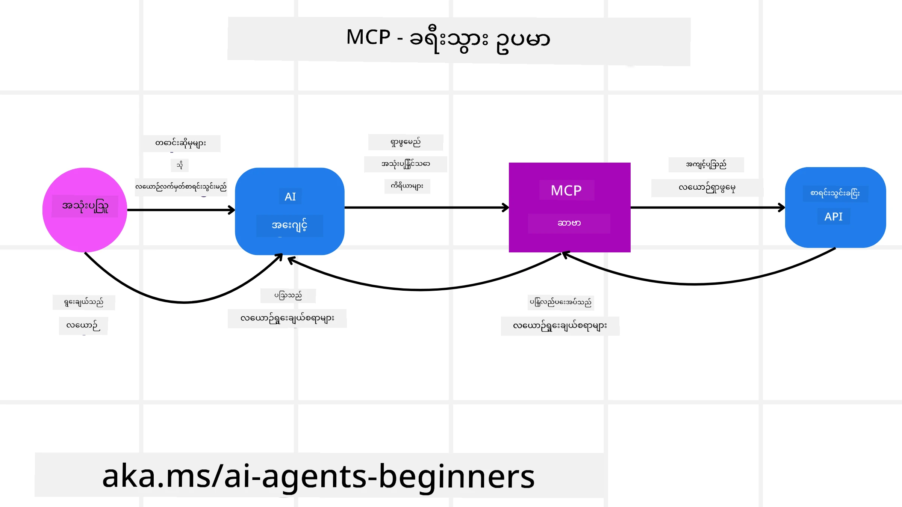
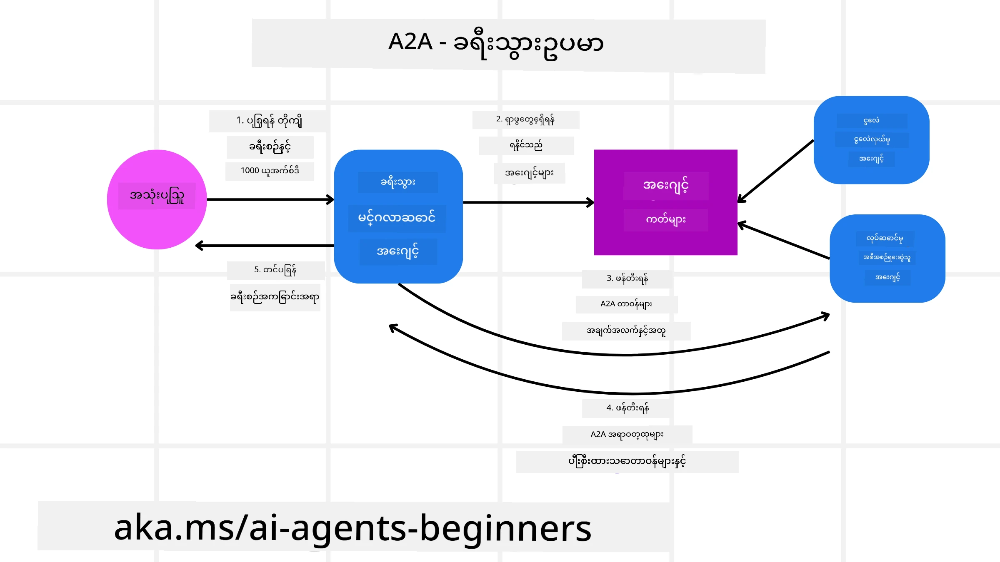
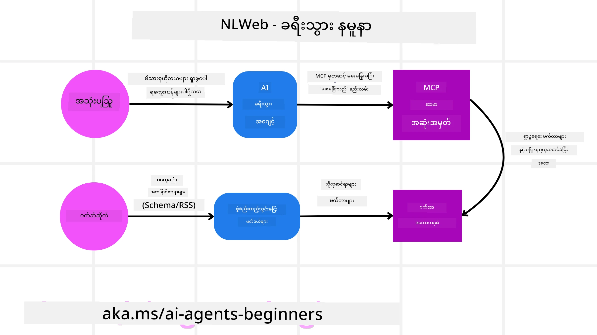

<!--
CO_OP_TRANSLATOR_METADATA:
{
  "original_hash": "aff92c6f019b4627ca9399c6e3882e17",
  "translation_date": "2025-09-18T15:51:33+00:00",
  "source_file": "11-agentic-protocols/README.md",
  "language_code": "my"
}
-->
# Agentic Protocols (MCP, A2A နှင့် NLWeb) ကို အသုံးပြုခြင်း

> _(ဤသင်ခန်းစာ၏ ဗီဒီယိုကို ကြည့်ရန် အထက်ပါ ပုံကို နှိပ်ပါ)_

AI အေးဂျင့်များ အသုံးပြုမှု တိုးလာသည့်အခါ၊ စံသတ်မှတ်မှု၊ လုံခြုံရေးနှင့် ဖွင့်လှစ်ဆန်းသစ်မှုကို ပံ့ပိုးပေးနိုင်သော ပရိုတိုကောများအတွက် လိုအပ်ချက်များလည်း တိုးလာသည်။ ဤသင်ခန်းစာတွင် Model Context Protocol (MCP), Agent to Agent (A2A) နှင့် Natural Language Web (NLWeb) ဆိုသော လိုအပ်ချက်များကို ဖြည့်ဆည်းရန် ရည်ရွယ်ထားသော ပရိုတိုကော ၃ ခုကို လေ့လာမည်ဖြစ်သည်။

## အကျဉ်းချုပ်

ဤသင်ခန်းစာတွင် လေ့လာမည်မှာ -

• **MCP** သည် AI အေးဂျင့်များကို အသုံးပြုသူ၏ တာဝန်များကို ပြည့်စုံစွာ ဆောင်ရွက်ရန် အပြင်ပစ္စည်းများနှင့် ဒေတာများကို ဝင်ရောက်အသုံးပြုခွင့်ပေးပုံ။

• **A2A** သည် အမျိုးမျိုးသော AI အေးဂျင့်များအကြား ဆက်သွယ်မှုနှင့် ပူးပေါင်းဆောင်ရွက်မှုကို အကောင်အထည်ဖော်ပုံ။

• **NLWeb** သည် AI အေးဂျင့်များကို ဝဘ်ဆိုဒ်များ၏ အကြောင်းအရာကို ရှာဖွေပြီး အပြန်အလှန် ဆက်သွယ်နိုင်စေရန် သဘာဝဘာသာစကား အင်တာဖေ့စ်များကို ပေးပုံ။

## သင်ယူရမည့် ရည်မှန်းချက်များ

• **MCP, A2A နှင့် NLWeb** ၏ အဓိကရည်ရွယ်ချက်နှင့် အကျိုးကျေးဇူးများကို AI အေးဂျင့်များ၏ အခြေအနေတွင် **သိရှိနိုင်ရန်**။

• **ပရိုတိုကောတစ်ခုစီ** သည် LLMs, tools နှင့် အခြားအေးဂျင့်များအကြား ဆက်သွယ်မှုနှင့် အပြန်အလှန်ဆက်သွယ်မှုကို **ဘယ်လို အကောင်အထည်ဖော်ပေးသလဲ** ဆိုသည်ကို ရှင်းပြနိုင်ရန်။

• **အေးဂျင့်စနစ်များ** တည်ဆောက်ရာတွင် ပရိုတိုကောတစ်ခုစီ၏ သီးခြားအခန်းကဏ္ဍများကို **သိရှိနိုင်ရန်**။

## Model Context Protocol

**Model Context Protocol (MCP)** သည် LLMs များကို context နှင့် tools များပေးရန် အဆင့်မြင့်စံသတ်မှတ်မှုဖြစ်သည်။ ၎င်းသည် AI အေးဂျင့်များကို အမျိုးမျိုးသော ဒေတာရင်းမြစ်များနှင့် tools များကို တစ်စည်းတစ်လုံးအနေဖြင့် ချိတ်ဆက်နိုင်စေရန် "universal adaptor" အဖြစ် လုပ်ဆောင်ပေးသည်။

MCP ၏ အစိတ်အပိုင်းများ၊ API ကို တိုက်ရိုက်အသုံးပြုခြင်းနှင့် နှိုင်းယှဉ်သော အကျိုးကျေးဇူးများ၊ AI အေးဂျင့်များသည် MCP server ကို ဘယ်လိုအသုံးပြုနိုင်သည်ဆိုသည်ကို ဥပမာဖြင့် လေ့လာကြမည်။

### MCP ၏ အဓိကအစိတ်အပိုင်းများ

MCP သည် **client-server architecture** အပေါ် အခြေခံပြီး အဓိကအစိတ်အပိုင်းများမှာ -

• **Hosts** သည် MCP Server များနှင့် ချိတ်ဆက်မှုကို စတင်သော LLM အပလီကေးရှင်းများ (ဥပမာ - VSCode ကဲ့သို့သော code editor) ဖြစ်သည်။

• **Clients** သည် host application အတွင်းရှိ အစိတ်အပိုင်းများဖြစ်ပြီး servers များနှင့် တစ်ဦးတည်းချိတ်ဆက်မှုကို ထိန်းသိမ်းသည်။

• **Servers** သည် သတ်မှတ်ထားသော စွမ်းရည်များကို ဖော်ထုတ်ပေးသော အလွယ်တကူအသုံးပြုနိုင်သော အစီအစဉ်များဖြစ်သည်။

MCP Server ၏ စွမ်းရည်များတွင် ပါဝင်သော အဓိက primitive ၃ ခုမှာ -

• **Tools**: AI အေးဂျင့်များက တစ်ခုခုလုပ်ဆောင်ရန် ခေါ်ယူနိုင်သော discrete actions သို့မဟုတ် functions များဖြစ်သည်။ ဥပမာအားဖြင့် ရာသီဥတုဝန်ဆောင်မှုသည် "get weather" tool ကို ဖော်ထုတ်နိုင်သည်၊ e-commerce server သည် "purchase product" tool ကို ဖော်ထုတ်နိုင်သည်။ MCP servers များသည် tool တစ်ခုစီ၏ အမည်၊ ဖော်ပြချက်နှင့် input/output schema ကို ၎င်းတို့၏ capabilities listing တွင် ဖော်ပြသည်။

• **Resources**: MCP server က ပေးနိုင်သော ဖတ်ရှုနိုင်သော ဒေတာ items သို့မဟုတ် စာရွက်များဖြစ်ပြီး clients များက ၎င်းတို့ကို လိုအပ်သည့်အခါ retrieve လုပ်နိုင်သည်။ ဥပမာအားဖြင့် ဖိုင်အကြောင်းအရာများ၊ ဒေတာဘေ့စ်မှတ်တမ်းများ သို့မဟုတ် log files များ။ Resources များသည် text (ဥပမာ - code သို့မဟုတ် JSON) သို့မဟုတ် binary (ဥပမာ - images သို့မဟုတ် PDFs) ဖြစ်နိုင်သည်။

• **Prompts**: ၎င်းသည် အဆင့်မြင့် workflows များကို ပံ့ပိုးပေးသော အကြံပြု prompt templates များဖြစ်သည်။

### MCP ၏ အကျိုးကျေးဇူးများ

MCP သည် AI အေးဂျင့်များအတွက် အရေးပါသော အကျိုးကျေးဇူးများကို ပေးသည် -

• **Dynamic Tool Discovery**: Agents များသည် server မှ ရရှိနိုင်သော tools များ၏ စာရင်းနှင့် ၎င်းတို့၏ လုပ်ဆောင်ချက်များကို dynamic အနေဖြင့် ရရှိနိုင်သည်။ ၎င်းသည် static coding လိုအပ်သော traditional APIs များနှင့် နှိုင်းယှဉ်၍ API ပြောင်းလဲမှုများအတွက် code updates လိုအပ်မှုကို လျှော့ချပေးသည်။ MCP သည် "တစ်ကြိမ်ချိတ်ဆက်ပြီး အမြဲအသုံးပြုနိုင်" စနစ်ကို ပေးသည်။

• **Interoperability Across LLMs**: MCP သည် အမျိုးမျိုးသော LLMs များအကြား လုပ်ဆောင်နိုင်မှုကို ပံ့ပိုးပေးပြီး အဓိကမော်ဒယ်များကို ပြောင်းလဲသုံးစွဲနိုင်စေရန် လွယ်ကူမှုကို ပေးသည်။

• **Standardized Security**: MCP သည် စံသတ်မှတ်ထားသော authentication နည်းလမ်းကို ပါဝင်ပြီး MCP servers များကို ထပ်မံချိတ်ဆက်ရာတွင် scalability ကို တိုးတက်စေသည်။ ၎င်းသည် traditional APIs များအတွက် authentication keys များကို စီမံခန့်ခွဲရန် လွယ်ကူစေသည်။

### MCP ၏ ဥပမာ

ဥပမာအားဖြင့် အသုံးပြုသူတစ်ဦးသည် MCP ဖြင့် အလုပ်လုပ်သော AI အကူအညီကို အသုံးပြု၍ လေယာဉ်လက်မှတ်ကို ရှာဖွေလိုသည်။

1. **Connection**: AI အကူအညီ (MCP client) သည် လေကြောင်းလိုင်းမှ MCP server နှင့် ချိတ်ဆက်သည်။

2. **Tool Discovery**: Client သည် လေကြောင်းလိုင်း၏ MCP server ကို "သင့်တွင် ရရှိနိုင်သော tools များက ဘာတွေလဲ?" ဟု မေးမြန်းသည်။ Server သည် "search flights" နှင့် "book flights" tools များကို ပြန်လည်ဖြေကြားသည်။

3. **Tool Invocation**: အသုံးပြုသူသည် AI အကူအညီကို "Portland မှ Honolulu သို့ လေယာဉ်လက်မှတ်ကို ရှာဖွေပါ" ဟု မေးမြန်းသည်။ AI အကူအညီသည် ၎င်း၏ LLM ကို အသုံးပြု၍ "search flights" tool ကို ခေါ်ယူရန်လိုအပ်ကြောင်း သတ်မှတ်ပြီး သက်ဆိုင်သော parameters (origin, destination) ကို MCP server သို့ ပေးပို့သည်။

4. **Execution and Response**: MCP server သည် လေကြောင်းလိုင်း၏ internal booking API ကို ခေါ်ယူပြီး လေယာဉ်အချက်အလက် (ဥပမာ - JSON data) ကို AI အကူအညီထံ ပြန်ပေးသည်။

5. **Further Interaction**: AI အကူအညီသည် လေယာဉ်ရွေးချယ်မှုများကို အသုံးပြုသူထံ တင်ပြသည်။ အသုံးပြုသူသည် လေယာဉ်တစ်ခုကို ရွေးချယ်ပြီးနောက် AI အကူအညီသည် "book flight" tool ကို MCP server တွင် ခေါ်ယူကာ booking ကို ပြီးစီးစေသည်။

## Agent-to-Agent Protocol (A2A)

MCP သည် LLMs များကို tools များနှင့် ချိတ်ဆက်ပေးရန် အဓိကထားသော်လည်း **Agent-to-Agent (A2A) protocol** သည် AI အေးဂျင့်များအကြား ဆက်သွယ်မှုနှင့် ပူးပေါင်းဆောင်ရွက်မှုကို ပိုမိုတိုးတက်စေသည်။ A2A သည် အဖွဲ့အစည်းများ၊ ပတ်ဝန်းကျင်များနှင့် နည်းပညာစနစ်များအကြား AI အေးဂျင့်များကို ချိတ်ဆက်ကာ ပူးပေါင်းဆောင်ရွက်မှုကို အကောင်အထည်ဖော်ပေးသည်။

A2A ၏ အစိတ်အပိုင်းများနှင့် အကျိုးကျေးဇူးများကို လေ့လာပြီး A2A ကို ကျွန်ုပ်တို့၏ ခရီးသွားအပလီကေးရှင်းတွင် ဘယ်လို အသုံးပြုနိုင်သည်ဆိုသည်ကို ဥပမာဖြင့် လေ့လာကြမည်။

### A2A ၏ အဓိကအစိတ်အပိုင်းများ

A2A သည် အေးဂျင့်များအကြား ဆက်သွယ်မှုကို အဓိကထားပြီး အသုံးပြုသူ၏ subtask ကို ပြည့်စုံစွာ ဆောင်ရွက်ရန် ပူးပေါင်းဆောင်ရွက်စေသည်။ Protocol ၏ အစိတ်အပိုင်းတစ်ခုစီသည် ဤရည်ရွယ်ချက်ကို ပံ့ပိုးပေးသည် -

#### Agent Card

MCP server သည် tools များ၏ စာရင်းကို မျှဝေသည့်နည်းလမ်းနှင့် ဆင်တူ၊ Agent Card တွင် -

- အေးဂျင့်၏ အမည်  
- ၎င်း၏ **အထွေထွေလုပ်ဆောင်နိုင်မှု** ဖော်ပြချက်  
- **သီးခြားကျွမ်းကျင်မှုများ** ၏ စာရင်းနှင့် ဖော်ပြချက်များ  
- အေးဂျင့်၏ **လက်ရှိ Endpoint URL**  
- အေးဂျင့်၏ **ဗားရှင်း** နှင့် **စွမ်းရည်များ** (ဥပမာ - streaming responses, push notifications)  

#### Agent Executor

Agent Executor သည် **အသုံးပြုသူ chat ၏ context ကို remote agent သို့ ပေးပို့ရန်** တာဝန်ရှိသည်။ Remote agent သည် ၎င်းကို အသုံးပြု၍ လုပ်ဆောင်ရန်လိုအပ်သော task ကို နားလည်သည်။

#### Artifact

Remote agent သည် တောင်းဆိုထားသော task ကို ပြီးစီးပြီးနောက် ၎င်း၏ အလုပ်ရလဒ်ကို artifact အဖြစ် ဖန်တီးသည်။ Artifact တွင် **အေးဂျင့်၏ အလုပ်ရလဒ်**၊ **လုပ်ဆောင်ခဲ့သည့်အကြောင်းဖော်ပြချက်** နှင့် **text context** ပါဝင်သည်။ Artifact ကို ပေးပို့ပြီးနောက် Remote agent နှင့် ချိတ်ဆက်မှုကို လိုအပ်သည်အထိ ပိတ်ထားသည်။

#### Event Queue

ဤအစိတ်အပိုင်းသည် **အပ်ဒိတ်များကို စီမံခန့်ခွဲခြင်းနှင့် မက်ဆေ့များကို ပေးပို့ခြင်း** အတွက် အသုံးပြုသည်။ Task ပြီးစီးရန် အချိန်ကြာနိုင်သောအခြေအနေများတွင် အေးဂျင့်များအကြား ချိတ်ဆက်မှုကို မပိတ်မိစေရန် အရေးပါသည်။

### A2A ၏ အကျိုးကျေးဇူးများ

• **Enhanced Collaboration**: Vendor များနှင့် platform များကွဲပြားသည့် အေးဂျင့်များကို ဆက်သွယ်မှု၊ context မျှဝေမှုနှင့် ပူးပေါင်းဆောင်ရွက်မှုကို ပံ့ပိုးပေးသည်။  

• **Model Selection Flexibility**: A2A အေးဂျင့်တစ်ခုစီသည် ၎င်း၏ requests များကို ဆောင်ရွက်ရန် အသုံးပြုမည့် LLM ကို ဆုံးဖြတ်နိုင်သည်။  

• **Built-in Authentication**: Authentication ကို A2A protocol တွင် တိုက်ရိုက်ပါဝင်စေပြီး အေးဂျင့်များအကြား လုံခြုံမှုကို တိုးတက်စေသည်။  

### A2A ၏ ဥပမာ

ခရီးသွား booking scenario ကို A2A ဖြင့် တိုးတက်စေခြင်းကို လေ့လာကြမည်။

1. **User Request to Multi-Agent**: အသုံးပြုသူသည် "Travel Agent" A2A client/agent ကို "လာမည့်အပတ် Honolulu သို့ ခရီးစဉ်တစ်ခုလုံး (လေယာဉ်, ဟိုတယ်, ကားငှား) ကို စီစဉ်ပေးပါ" ဟု မေးမြန်းသည်။

2. **Orchestration by Travel Agent**: Travel Agent သည် request ကို လက်ခံပြီး LLM ကို အသုံးပြု၍ task ကို reasoning လုပ်ကာ အခြား specialized agents များနှင့် ဆက်သွယ်ရန် ဆုံးဖြတ်သည်။

3. **Inter-Agent Communication**: Travel Agent သည် A2A protocol ကို အသုံးပြု၍ "Airline Agent," "Hotel Agent," နှင့် "Car Rental Agent" တို့နှင့် ချိတ်ဆက်သည်။

4. **Delegated Task Execution**: Travel Agent သည် specialized agents များထံ task များကို ပေးပို့သည် (ဥပမာ - "Find flights to Honolulu," "Book a hotel," "Rent a car")။ Specialized agents များသည် ၎င်းတို့၏ LLMs နှင့် tools များကို အသုံးပြု၍ task များကို ဆောင်ရွက်သည်။

5. **Consolidated Response**: Downstream agents များသည် task များကို ပြီးစီးပြီးနောက် Travel Agent သည် ရလဒ်များကို စုစည်းကာ အသုံးပြုသူထံ ပြန်လည်တင်ပြသည်။

## Natural Language Web (NLWeb)

ဝဘ်ဆိုဒ်များသည် အင်တာနက်ပေါ်တွင် ဒေတာနှင့် အချက်အလက်များကို ရယူရန် အသုံးပြုသူများအတွက် အဓိကနည်းလမ်းဖြစ်လာခဲ့သည်။

NLWeb ၏ အစိတ်အပိုင်းများ၊ အကျိုးကျေးဇူးများနှင့် ကျွန်ုပ်တို့၏ ခရီးသွားအပလီကေးရှင်းတွင် NLWeb ဘယ်လို အလုပ်လုပ်သည်ဆိုသည်ကို ဥပမာဖြင့် လေ့လာကြမည်။

### NLWeb ၏ အစိတ်အပိုင်းများ

- **NLWeb Application (Core Service Code)**: သဘာဝဘာသာစကားမေးခွန်းများကို ဆောင်ရွက်ပေးသော စနစ်။ ၎င်းသည် platform ၏ အစိတ်အပိုင်းများကို ချိတ်ဆက်ကာ အဖြေများဖန်တီးသည်။  

- **NLWeb Protocol**: ဝဘ်ဆိုဒ်နှင့် သဘာဝဘာသာစကား interaction အတွက် **အခြေခံစည်းမျဉ်းများ** ဖြစ်သည်။  

- **MCP Server (Model Context Protocol Endpoint)**: NLWeb setup တစ်ခုစီသည် MCP server အဖြစ်လည်း လုပ်ဆောင်သည်။  

- **Embedding Models**: ဝဘ်ဆိုဒ်အကြောင်းအရာကို **vectors** အဖြစ် ပြောင်းလဲရန် အသုံးပြုသည်။  

- **Vector Database (Retrieval Mechanism)**: Website content ၏ embeddings များကို သိမ်းဆည်းထားသော database ဖြစ်သည်။  

### NLWeb ၏ ဥပမာ

ခရီးသွား booking website ကို NLWeb ဖြင့် အကောင်အထည်ဖော်ခြင်းကို လေ့လာကြမည်။

1. **Data Ingestion**: Travel website ၏ product catalogs များကို Schema.org သို့မဟုတ် RSS feeds ဖြင့် format လ

---

**အကြောင်းကြားချက်**:  
ဤစာရွက်စာတမ်းကို AI ဘာသာပြန်ဝန်ဆောင်မှု [Co-op Translator](https://github.com/Azure/co-op-translator) ကို အသုံးပြု၍ ဘာသာပြန်ထားပါသည်။ ကျွန်ုပ်တို့သည် တိကျမှုအတွက် ကြိုးစားနေသော်လည်း၊ အလိုအလျောက် ဘာသာပြန်ခြင်းတွင် အမှားများ သို့မဟုတ် မတိကျမှုများ ပါဝင်နိုင်သည်ကို သတိပြုပါ။ မူရင်းဘာသာစကားဖြင့် ရေးသားထားသော စာရွက်စာတမ်းကို အာဏာတရ အရင်းအမြစ်အဖြစ် ရှုလေ့လာသင့်ပါသည်။ အရေးကြီးသော အချက်အလက်များအတွက် လူ့ဘာသာပြန်ပညာရှင်များမှ ဘာသာပြန်ခြင်းကို အကြံပြုပါသည်။ ဤဘာသာပြန်ကို အသုံးပြုခြင်းမှ ဖြစ်ပေါ်လာသော အလွဲအလွတ်များ သို့မဟုတ် အနားလွဲမှုများအတွက် ကျွန်ုပ်တို့သည် တာဝန်မယူပါ။