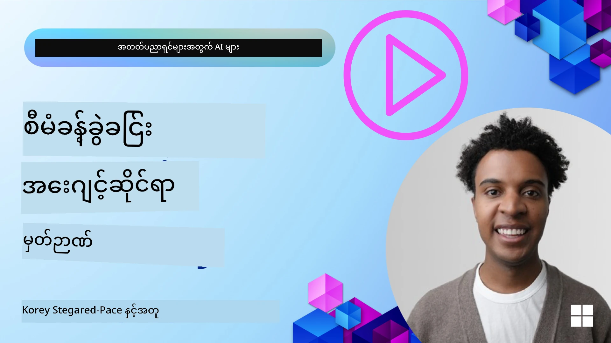

<!--
CO_OP_TRANSLATOR_METADATA:
{
  "original_hash": "a1d90991499ad697c4ad24decaf36968",
  "translation_date": "2025-12-09T12:55:44+00:00",
  "source_file": "13-agent-memory/README.md",
  "language_code": "my"
}
-->
# AI အေးဂျင့်များအတွက် မှတ်ဉာဏ်

AI အေးဂျင့်များ ဖန်တီးရာတွင် အထူးအကျိုးကျေးဇူးများကို ဆွေးနွေးသောအခါ၊ အဓိကအားဖြင့် အလုပ်များကို ပြီးမြောက်စေရန် ကိရိယာများကို ခေါ်ယူနိုင်ခြင်းနှင့် အချိန်ကြာလာသည်နှင့်အမျှ တိုးတက်လာနိုင်ခြင်းတို့ကို အဓိကထား၍ ဆွေးနွေးကြသည်။ မှတ်ဉာဏ်သည် အသုံးပြုသူများအတွက် ပိုမိုကောင်းမွန်သော အတွေ့အကြုံများ ဖန်တီးနိုင်သော ကိုယ်တိုင်တိုးတက်လာသော အေးဂျင့်ကို ဖန်တီးရာတွင် အခြေခံအဆင့်ဖြစ်သည်။

ဒီသင်ခန်းစာမှာ AI အေးဂျင့်များအတွက် မှတ်ဉာဏ်ဆိုတာ ဘာလဲ၊ ဒါကို ဘယ်လို စီမံခန့်ခွဲပြီး ကျွန်ုပ်တို့၏ အက်ပလီကေးရှင်းများအတွက် အကျိုးရှိအောင် အသုံးချနိုင်မလဲဆိုတာကို လေ့လာပါမည်။

## အကျဉ်းချုပ်

ဒီသင်ခန်းစာမှာ အောက်ပါအကြောင်းအရာများကို လေ့လာပါမည်-

• **AI အေးဂျင့် မှတ်ဉာဏ်ကို နားလည်ခြင်း**: မှတ်ဉာဏ်ဆိုတာ ဘာလဲ၊ အေးဂျင့်များအတွက် အရေးကြီးတဲ့အကြောင်း။

• **မှတ်ဉာဏ်ကို အကောင်အထည်ဖော်ခြင်းနှင့် သိမ်းဆည်းခြင်း**: အေးဂျင့်များတွင် မှတ်ဉာဏ်စွမ်းရည်များ ထည့်သွင်းရန် လက်တွေ့နည်းလမ်းများ၊ အတိုချုပ်မှတ်ဉာဏ်နှင့် ရေရှည်မှတ်ဉာဏ်ကို အဓိကထား၍။

• **AI အေးဂျင့်များကို ကိုယ်တိုင်တိုးတက်လာစေရန်**: အေးဂျင့်များသည် ယခင်အတွေ့အကြုံများမှ သင်ယူပြီး အချိန်ကြာလာသည်နှင့်အမျှ တိုးတက်လာစေရန် မှတ်ဉာဏ်က ဘယ်လို အထောက်အကူပြုနိုင်သည်။

## ရရှိနိုင်သော အကောင်အထည်ဖော်မှုများ

ဒီသင်ခန်းစာမှာ အောက်ပါ သင်ခန်းစာအိတ်ဖိုင်များ ပါဝင်သည်-

• **[13-agent-memory.ipynb](./13-agent-memory.ipynb)**: Mem0 နှင့် Azure AI Search ကို Semantic Kernel framework ဖြင့် အသုံးပြု၍ မှတ်ဉာဏ်ကို အကောင်အထည်ဖော်ခြင်း

• **[13-agent-memory-cognee.ipynb](./13-agent-memory-cognee.ipynb)**: Cognee ကို အသုံးပြု၍ ဖွဲ့စည်းထားသော မှတ်ဉာဏ်ကို အကောင်အထည်ဖော်ခြင်း၊ embeddings-backed knowledge graph ကို အလိုအလျောက် တည်ဆောက်ခြင်း၊ graph ကို မြင်သာအောင် ပြသခြင်းနှင့် ထိရောက်သော ရှာဖွေမှု

## သင်ယူရမည့် ရည်မှန်းချက်များ

ဒီသင်ခန်းစာပြီးဆုံးပြီးနောက်တွင် သင်သည်-

• **AI အေးဂျင့် မှတ်ဉာဏ်အမျိုးအစားများကို ခွဲခြားနိုင်မည်**- အလုပ်လုပ်နေသော မှတ်ဉာဏ်၊ အတိုချုပ်မှတ်ဉာဏ်၊ ရေရှည်မှတ်ဉာဏ်နှင့် persona memory, episodic memory ကဲ့သို့ အထူးပြုမှတ်ဉာဏ်များ။

• **AI အေးဂျင့်များအတွက် အတိုချုပ်မှတ်ဉာဏ်နှင့် ရေရှည်မှတ်ဉာဏ်ကို အကောင်အထည်ဖော်ခြင်းနှင့် စီမံခန့်ခွဲခြင်း**- Semantic Kernel framework ကို အသုံးပြု၍ Mem0, Cognee, Whiteboard memory နှင့် Azure AI Search နှင့် ပေါင်းစပ်ခြင်း။

• **ကိုယ်တိုင်တိုးတက်လာသော AI အေးဂျင့်များ၏ မူလကျသော အခြေခံအချက်များကို နားလည်ခြင်း**- မှတ်ဉာဏ်စီမံခန့်ခွဲမှုစနစ်များသည် ဆက်လက်လေ့လာခြင်းနှင့် အလျင်အမြန် လိုက်လျောညီထွေဖြစ်စေရန် ဘယ်လို အထောက်အကူပြုနိုင်သည်။

## AI အေးဂျင့် မှတ်ဉာဏ်ကို နားလည်ခြင်း

အခြေခံအားဖြင့် **AI အေးဂျင့်များအတွက် မှတ်ဉာဏ်ဆိုတာ သတင်းအချက်အလက်များကို သိမ်းဆည်းခြင်းနှင့် ပြန်လည်မှတ်မိနိုင်စေသော စနစ်များကို ဆိုလိုသည်**။ ဒီသတင်းအချက်အလက်များမှာ စကားဝိုင်းအကြောင်းအရာများ၊ အသုံးပြုသူ၏ အကြိုက်များ၊ ယခင်လုပ်ဆောင်မှုများ သို့မဟုတ် သင်ယူထားသော ပုံစံများဖြစ်နိုင်သည်။

မှတ်ဉာဏ်မရှိပါက AI အက်ပလီကေးရှင်းများသည် အခြေအနေမရှိသော (stateless) ဖြစ်ပြီး၊ အပြန်အလှန်ဆက်သွယ်မှုတိုင်းကို အစမှစရမည်ဖြစ်သည်။ ဒါက အေးဂျင့်သည် ယခင်အကြောင်းအရာများ သို့မဟုတ် အကြိုက်များကို "မေ့သွား"သော အတွေ့အကြုံကို ဖြစ်စေပြီး ထပ်တလဲလဲနှင့် စိတ်ပျက်စရာ ဖြစ်စေသည်။

### မှတ်ဉာဏ် အရေးကြီးတဲ့အကြောင်း

အေးဂျင့်၏ ဉာဏ်ပညာသည် ယခင်သတင်းအချက်အလက်များကို မှတ်မိပြီး အသုံးချနိုင်စွမ်းနှင့် နက်နက်ရှိုင်းရှိုင်း ဆက်စပ်နေသည်။ မှတ်ဉာဏ်က အေးဂျင့်များကို အောက်ပါအတိုင်း ဖြစ်စေသည်-

• **အတွေးအမြင်ရှိသော**: ယခင်လုပ်ဆောင်မှုများနှင့် ရလဒ်များမှ သင်ယူခြင်း။

• **အပြန်အလှန်ဆက်သွယ်နိုင်သော**: ဆက်လက်ပြောဆိုမှုအတွင်း အကြောင်းအရာကို ထိန်းသိမ်းထားခြင်း။

• **ကြိုတင်ပြင်ဆင်နိုင်သောနှင့် တုံ့ပြန်နိုင်သော**: ယခင်သတင်းအချက်အလက်များအပေါ် အခြေခံ၍ လိုအပ်ချက်များကို ကြိုတင်ခန့်မှန်းခြင်း သို့မဟုတ် သင့်တော်သော တုံ့ပြန်မှုများ ပြုလုပ်ခြင်း။

• **ကိုယ်တိုင်လုပ်ဆောင်နိုင်သော**: သိမ်းဆည်းထားသော အသိပညာကို အသုံးပြု၍ ပိုမိုလွတ်လပ်စွာ လုပ်ဆောင်နိုင်ခြင်း။

မှတ်ဉာဏ်ကို အကောင်အထည်ဖော်ခြင်း၏ ရည်ရွယ်ချက်မှာ အေးဂျင့်များကို ပိုမို **ယုံကြည်ရပြီး စွမ်းဆောင်နိုင်စေခြင်း** ဖြစ်သည်။

### မှတ်ဉာဏ် အမျိုးအစားများ

#### အလုပ်လုပ်နေသော မှတ်ဉာဏ်

ဒီအမျိုးအစားကို အေးဂျင့်တစ်ခုသည် တစ်ခုတည်းသော လုပ်ငန်းစဉ် သို့မဟုတ် အတွေးအခေါ်စဉ်အတွင်း အသုံးပြုသော အရေးကြီးသော သတင်းအချက်အလက်များကို သိမ်းဆည်းထားသော စက္ကူတစ်ရွက်လို ထင်ရသည်။

AI အေးဂျင့်များအတွက် အလုပ်လုပ်နေသော မှတ်ဉာဏ်သည် စကားဝိုင်းအကြောင်းအရာများမှ အရေးကြီးသော အချက်အလက်များကို ဖော်ထုတ်ခြင်းကို အဓိကထားသည်။ 

**အလုပ်လုပ်နေသော မှတ်ဉာဏ် ဥပမာ**

ခရီးသွားလုပ်ငန်းအေးဂျင့်တစ်ခုသည် "ပဲရစ်ကို ခရီးသွားလိုပါတယ်" ဆိုသော အသုံးပြုသူ၏ လက်ရှိတောင်းဆိုမှုကို သိမ်းဆည်းထားပြီး ယခင်အပြန်အလှန်ဆက်သွယ်မှုများကို မသိမ်းဆည်းထားပါ။

#### အတိုချုပ်မှတ်ဉာဏ်

ဒီအမျိုးအစားမှတ်ဉာဏ်သည် တစ်ခါတည်းသော စကားဝိုင်း သို့မဟုတ် session တစ်ခုအတွင်း သတင်းအချက်အလက်များကို သိမ်းဆည်းထားသည်။ 

**အတိုချုပ်မှတ်ဉာဏ် ဥပမာ**

အသုံးပြုသူက "ပဲရစ်ကို လေယာဉ်ခရီးစရိတ် ဘယ်လောက်လဲ" ဟုမေးပြီး "အဲဒီမှာ အိမ်ခန်းစရိတ်ကော" ဟု ဆက်မေးပါက အေးဂျင့်သည် "အဲဒီမှာ" ဆိုသည်မှာ "ပဲရစ်" ကို ဆိုလိုသည်ဟု သိရှိနိုင်သည်။

#### ရေရှည်မှတ်ဉာဏ်

ဒီအမျိုးအစားမှတ်ဉာဏ်သည် session သို့မဟုတ် စကားဝိုင်းများစွာအတွင်း သတင်းအချက်အလက်များကို သိမ်းဆည်းထားသည်။ 

**ရေရှည်မှတ်ဉာဏ် ဥပမာ**

"Ben သည် နှင်းလျှောစီးခြင်းနှင့် ပြင်ပလှုပ်ရှားမှုများကို နှစ်သက်ပြီး၊ တောင်တန်းရှုခင်းရှိနေရာတွင် ကော်ဖီသောက်ရန်နှစ်သက်သည်။" ဆိုသော သတင်းအချက်အလက်ကို သိမ်းဆည်းထားပြီး နောက်ထပ် session တွင် Ben အတွက် အထူးပြု အကြံပြုချက်များပေးနိုင်သည်။

#### Persona Memory

ဒီအမျိုးအစားမှတ်ဉာဏ်သည် အေးဂျင့်တစ်ခု၏ "ပုဂ္ဂိုလ်ရေး" သို့မဟုတ် "အခန်းကဏ္ဍ" ကို ဖွဲ့စည်းရန် အထောက်အကူပြုသည်။

**Persona Memory ဥပမာ**

ခရီးသွားအေးဂျင့်သည် "နှင်းလျှောစီးခြင်းအကျွမ်းတော်ရှိသူ" အဖြစ် ဖွဲ့စည်းထားပါက၊ သူ၏ အဖြေများသည် အကျွမ်းတော်ရှိသူ၏ အသံနှင့် အသိပညာကို ထင်ဟပ်စေမည်။

#### Workflow/Episodic Memory

ဒီမှတ်ဉာဏ်သည် အေးဂျင့်တစ်ခုသည် ရှုပ်ထွေးသော လုပ်ငန်းစဉ်တစ်ခုအတွင်း လုပ်ဆောင်ခဲ့သော အဆင့်များကို သိမ်းဆည်းထားသည်။

**Episodic Memory ဥပမာ**

အေးဂျင့်သည် လေယာဉ်တစ်စင်းကို ကြိုးစားဘွတ်ကင်လုပ်ခဲ့ပြီး မရရှိခဲ့ပါက၊ ဒီအချက်ကို မှတ်ဉာဏ်တွင် သိမ်းဆည်းထားပြီး နောက်တစ်ကြိမ်တွင် အသုံးပြုသူကို ပိုမိုသိရှိသော အချက်အလက်များဖြင့် အကြောင်းကြားနိုင်သည်။

#### Entity Memory

ဒီမှတ်ဉာဏ်သည် စကားဝိုင်းများမှ လူများ၊ နေရာများ သို့မဟုတ် အရာများကို ဖော်ထုတ်ပြီး သိမ်းဆည်းထားသည်။

**Entity Memory ဥပမာ**

"Le Chat Noir" စားသောက်ဆိုင်တွင် ညစာစားခဲ့သည်ဟု အသုံးပြုသူက ပြောပါက၊ အေးဂျင့်သည် နောက်တစ်ကြိမ်တွင် "Le Chat Noir" တွင် နောက်ထပ်ဘွတ်ကင်လုပ်ရန် အကြံပြုနိုင်သည်။

#### Structured RAG (Retrieval Augmented Generation)

Structured RAG သည် သတင်းအချက်အလက်များကို ဖွဲ့စည်းထားသော ပုံစံဖြင့် သိမ်းဆည်းပြီး၊ အေးဂျင့်၏ တုံ့ပြန်မှုများကို ပိုမိုတိကျစေသည်။

**Structured RAG ဥပမာ**

Structured RAG သည် "ပဲရစ်ကို သွားမည့် လေယာဉ်" ကဲ့သို့သော တိကျသော မေးခွန်းများကို ဖြေဆိုနိုင်ရန် သတင်းအချက်အလက်များကို ဖွဲ့စည်းထားသည်။

## မှတ်ဉာဏ်ကို အကောင်အထည်ဖော်ခြင်းနှင့် သိမ်းဆည်းခြင်း

AI အေးဂျင့်များအတွက် မှတ်ဉာဏ်ကို အကောင်အထည်ဖော်ခြင်းသည် **မှတ်ဉာဏ်စီမံခန့်ခွဲမှု** လုပ်ငန်းစဉ်တစ်ခုဖြစ်ပြီး၊ သတင်းအချက်အလက်များကို ဖန်တီးခြင်း၊ သိမ်းဆည်းခြင်း၊ ပြန်လည်ရယူခြင်း၊ ပေါင်းစပ်ခြင်း၊ အပ်ဒိတ်လုပ်ခြင်းနှင့် "မေ့ခြင်း" (delete) အထိ ပါဝင်သည်။

### အထူးပြု မှတ်ဉာဏ်ကိရိယာများ

#### Mem0

Mem0 သည် အေးဂျင့်များအတွက် မှတ်ဉာဏ်ကို သိမ်းဆည်းရန် အထူးပြုကိရိယာတစ်ခုဖြစ်ပြီး၊ အေးဂျင့်များကို အခြေအနေရှိသော (stateful) ဖြစ်စေသည်။

#### Cognee

Cognee သည် AI အေးဂျင့်များအတွက် semantic memory ဖြစ်ပြီး၊ သတင်းအချက်အလက်များကို knowledge graph အဖြစ် ပြောင်းလဲသိမ်းဆည်းသည်။

### RAG ဖြင့် မှတ်ဉာဏ်ကို သိမ်းဆည်းခြင်း

Azure AI Search ကို Structured RAG အနေနှင့် အသုံးပြု၍ သတင်းအချက်အလက်များကို သိမ်းဆည်းပြီး AI အေးဂျင့်၏ တုံ့ပြန်မှုများကို ပိုမိုတိကျစေသည်။

## AI အေးဂျင့်များကို ကိုယ်တိုင်တိုးတက်လာစေရန်

AI အေးဂျင့်များကို ကိုယ်တိုင်တိုးတက်လာစေရန် **"knowledge agent"** ကို ထည့်သွင်းရန် လေ့လာကြသည်။

### မှတ်ဉာဏ်အတွက် အကောင်းဆုံးနည်းလမ်းများ

• **Latency Management**: အေးဂျင့်၏ တုံ့ပြန်မှုကို အမြန်ဆုံးဖြစ်စေရန် အဆင့်မြင့်မော်ဒယ်ကို လိုအပ်သောအခါတွင်သာ အသုံးပြုခြင်း။

• **Knowledge Base Maintenance**: သတင်းအချက်အလက်များကို "အေးသော သိမ်းဆည်းမှု" (cold storage) သို့ ရွှေ့ခြင်း။

## AI အေးဂျင့် မှတ်ဉာဏ်နှင့် ပတ်သက်သော မေးခွန်းများရှိပါသလား?

[Azure AI Foundry Discord](https://aka.ms/ai-agents/discord) တွင် ပါဝင်ပြီး အခြားသော သင်ယူသူများနှင့် တွေ့ဆုံပါ၊ office hours တွင် ပါဝင်ပြီး AI အေးဂျင့်များနှင့် ပတ်သက်သော မေးခွန်းများကို ဖြေရှင်းပါ။

---

<!-- CO-OP TRANSLATOR DISCLAIMER START -->
**အကြောင်းကြားချက်**:  
ဤစာရွက်စာတမ်းကို AI ဘာသာပြန်ဝန်ဆောင်မှု [Co-op Translator](https://github.com/Azure/co-op-translator) ကို အသုံးပြု၍ ဘာသာပြန်ထားပါသည်။ ကျွန်ုပ်တို့သည် တိကျမှုအတွက် ကြိုးစားနေသော်လည်း အလိုအလျောက် ဘာသာပြန်မှုများတွင် အမှားများ သို့မဟုတ် မတိကျမှုများ ပါဝင်နိုင်သည်ကို သတိပြုပါ။ မူရင်းဘာသာစကားဖြင့် ရေးသားထားသော စာရွက်စာတမ်းကို အာဏာတရားရှိသော အရင်းအမြစ်အဖြစ် သတ်မှတ်သင့်ပါသည်။ အရေးကြီးသော အချက်အလက်များအတွက် လူ့ဘာသာပြန်ပညာရှင်များကို အသုံးပြုရန် အကြံပြုပါသည်။ ဤဘာသာပြန်မှုကို အသုံးပြုခြင်းမှ ဖြစ်ပေါ်လာသော အလွဲအမှားများ သို့မဟုတ် အနားယူမှုများအတွက် ကျွန်ုပ်တို့သည် တာဝန်မယူပါ။
<!-- CO-OP TRANSLATOR DISCLAIMER END -->