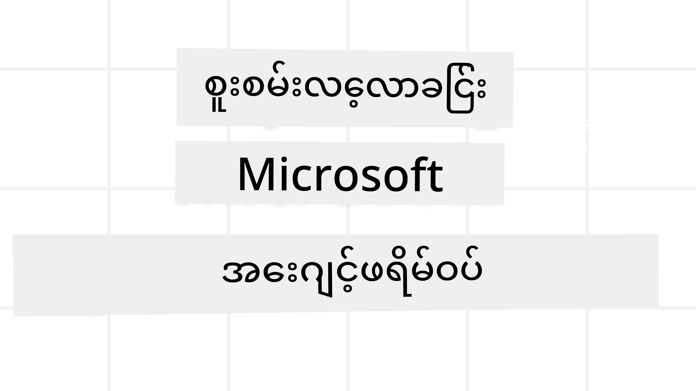
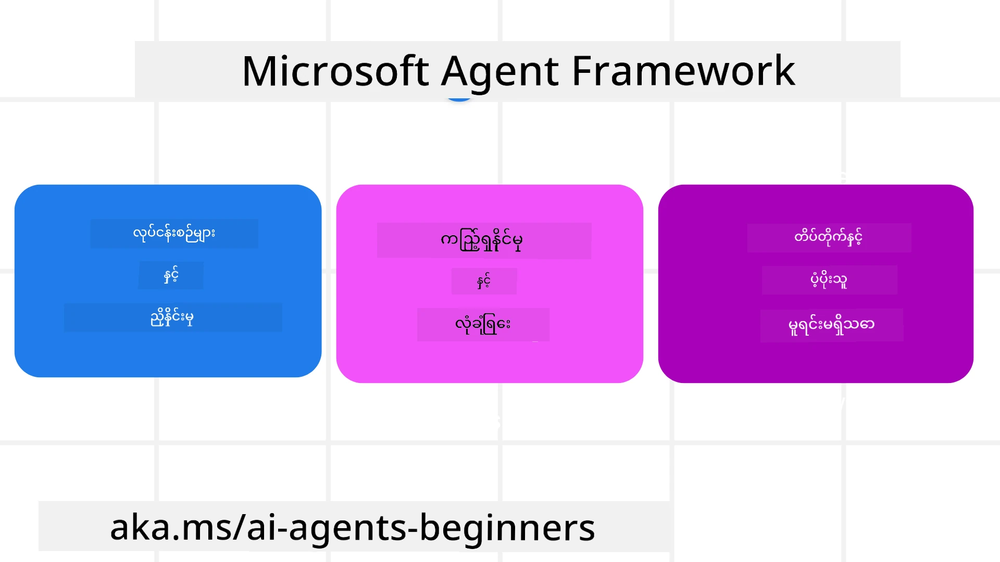
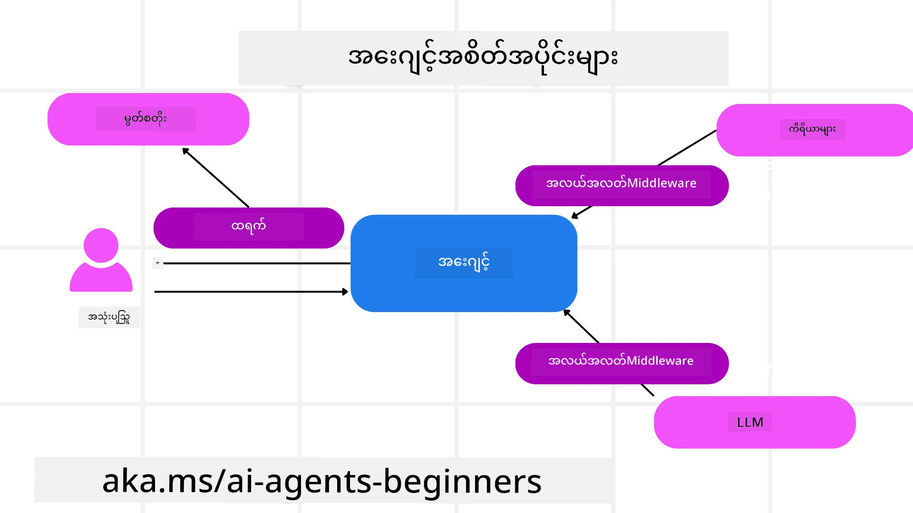

<!--
CO_OP_TRANSLATOR_METADATA:
{
  "original_hash": "19c4dab375acbc733855cc7f2f04edbc",
  "translation_date": "2025-10-02T06:06:23+00:00",
  "source_file": "14-microsoft-agent-framework/README.md",
  "language_code": "my"
}
-->
# Microsoft Agent Framework ကိုလေ့လာခြင်း



### အကျဉ်းချုပ်

ဒီသင်ခန်းစာမှာ အောက်ပါအကြောင်းအရာတွေကို လေ့လာပါမယ်-

- Microsoft Agent Framework ကိုနားလည်ခြင်း: အဓိကအင်္ဂါရပ်များနှင့် အကျိုးကျေးဇူး  
- Microsoft Agent Framework ရဲ့ အဓိကအယူအဆများကို လေ့လာခြင်း  
- MAF ကို Semantic Kernel နှင့် AutoGen နှင့် နှိုင်းယှဉ်ခြင်း: ပြောင်းရွှေ့လမ်းညွှန်  

## သင်ယူရမည့်ရည်မှန်းချက်များ

ဒီသင်ခန်းစာပြီးဆုံးတဲ့အခါမှာ သင်တတ်မြောက်ထားမယ့်အရာတွေက-

- Microsoft Agent Framework ကို အသုံးပြုပြီး ထုတ်လုပ်မှုအဆင့် AI Agents တည်ဆောက်နိုင်ခြင်း  
- Microsoft Agent Framework ရဲ့ အဓိကအင်္ဂါရပ်တွေကို သင့် Agentic Use Cases တွေမှာ အသုံးချနိုင်ခြင်း  
- ရှိပြီးသား Agentic frameworks နှင့် tools တွေကို ပြောင်းရွှေ့ပြီး ပေါင်းစည်းနိုင်ခြင်း  

## ကုဒ်နမူနာများ

[Microsoft Agent Framework (MAF)](https://aka.ms/ai-agents-beginners/agent-framewrok) အတွက် ကုဒ်နမူနာတွေကို ဒီ repository ရဲ့ `xx-python-agent-framework` နှင့် `xx-dotnet-agent-framework` ဖိုင်တွေမှာ ရှာဖွေနိုင်ပါတယ်။

## Microsoft Agent Framework ကိုနားလည်ခြင်း



[Microsoft Agent Framework (MAF)](https://aka.ms/ai-agents-beginners/agent-framewrok) ဟာ Semantic Kernel နှင့် AutoGen ရဲ့ အတွေ့အကြုံတွေကို အခြေခံပြီး တည်ဆောက်ထားပါတယ်။ ဒါဟာ ထုတ်လုပ်မှုနဲ့ သုတေသနပတ်ဝန်းကျင်မှာ တွေ့ရတဲ့ agentic use cases အမျိုးမျိုးကို ဖြေရှင်းနိုင်ဖို့ လွယ်ကူမှုကို ပေးစွမ်းပါတယ်။ အထူးသဖြင့်-

- **Sequential Agent orchestration** - အဆင့်ဆင့်လုပ်ငန်းစဉ်တွေလိုအပ်တဲ့အခါမှာ အသုံးပြုနိုင်ပါတယ်။
- **Concurrent orchestration** - Agents တွေ တစ်ချိန်တည်းမှာ တာဝန်တွေကို ပြီးမြောက်စေဖို့လိုအပ်တဲ့အခါမှာ အသုံးပြုနိုင်ပါတယ်။
- **Group chat orchestration** - Agents တွေ တစ်ခုတည်းသော တာဝန်ကို ပူးပေါင်းလုပ်ဆောင်နိုင်တဲ့အခါမှာ အသုံးပြုနိုင်ပါတယ်။
- **Handoff Orchestration** - Subtasks တွေ ပြီးမြောက်တဲ့အခါမှာ Agents တွေ တာဝန်ကို အချင်းချင်း လွှဲပြောင်းပေးနိုင်ပါတယ်။
- **Magnetic Orchestration** - Manager agent က တာဝန်စာရင်းကို ဖန်တီးပြီး ပြင်ဆင်ပေးပြီး Subagents တွေကို တာဝန်တွေကို ပြီးမြောက်စေဖို့ စီမံခန့်ခွဲပေးပါတယ်။

ထုတ်လုပ်မှုအဆင့် AI Agents တွေကို ပေးစွမ်းဖို့ MAF မှာ အောက်ပါအင်္ဂါရပ်တွေ ပါဝင်ပါတယ်-

- **Observability** - OpenTelemetry ကို အသုံးပြုပြီး AI Agent ရဲ့ tool invocation, orchestration အဆင့်တွေ, reasoning flows, performance monitoring တွေကို Azure AI Foundry dashboards မှာ ကြည့်ရှုနိုင်ပါတယ်။
- **Security** - Agents တွေကို Azure AI Foundry မှာ native-hosting လုပ်ပြီး role-based access, private data handling, built-in content safety စတဲ့ security controls တွေ ပါဝင်ပါတယ်။
- **Durability** - Agent threads နဲ့ workflows တွေ pause, resume, error recovery လုပ်နိုင်ပြီး ရှည်လျားတဲ့လုပ်ငန်းစဉ်တွေကို အဆင်ပြေစေပါတယ်။
- **Control** - Human-in-the-loop workflows တွေကို ပံ့ပိုးပေးပြီး တာဝန်တွေကို လူ့အတည်ပြုချက်လိုအပ်တဲ့အခါမှာ အမှတ်အသားပြုနိုင်ပါတယ်။

Microsoft Agent Framework ဟာ အပြန်အလှန်လုပ်ဆောင်နိုင်မှုကို အဓိကထားပြီး-

- **Cloud-agnostic** - Agents တွေကို containers, on-prem, နှင့် cloud အမျိုးမျိုးမှာ run လုပ်နိုင်ပါတယ်။
- **Provider-agnostic** - Agents တွေကို သင့်နှစ်သက်တဲ့ SDK (Azure OpenAI, OpenAI) တွေကို အသုံးပြုပြီး ဖန်တီးနိုင်ပါတယ်။
- **Open Standards တွေကို ပေါင်းစည်းခြင်း** - Agents တွေဟာ Agent-to-Agent (A2A) နဲ့ Model Context Protocol (MCP) စတဲ့ protocols တွေကို အသုံးပြုပြီး အခြား agents နဲ့ tools တွေကို ရှာဖွေပြီး အသုံးချနိုင်ပါတယ်။
- **Plugins နှင့် Connectors** - Microsoft Fabric, SharePoint, Pinecone, Qdrant စတဲ့ data နဲ့ memory services တွေကို ချိတ်ဆက်နိုင်ပါတယ်။

အခု Microsoft Agent Framework ရဲ့ အဓိကအယူအဆတွေကို ဘယ်လိုအသုံးချနိုင်လဲဆိုတာကို ကြည့်ကြမယ်။

## Microsoft Agent Framework ရဲ့ အဓိကအယူအဆများ

### Agents



**Agents ဖန်တီးခြင်း**

Agent ဖန်တီးခြင်းကို inference service (LLM Provider), AI Agent အတွက် လိုက်နာရမယ့် အညွှန်းများ, နဲ့ `name` တစ်ခု သတ်မှတ်ခြင်းဖြင့် ပြုလုပ်ပါတယ်-

```python
agent = AzureOpenAIChatClient(credential=AzureCliCredential()).create_agent( instructions="You are good at recommending trips to customers based on their preferences.", name="TripRecommender" )
```

အထက်ပါနမူနာမှာ `Azure OpenAI` ကို အသုံးပြုထားပေမယ့် Agents တွေကို `Azure AI Foundry Agent Service` အပါအဝင် ဝန်ဆောင်မှုအမျိုးမျိုးကို အသုံးပြုပြီး ဖန်တီးနိုင်ပါတယ်-

```python
AzureAIAgentClient(async_credential=credential).create_agent( name="HelperAgent", instructions="You are a helpful assistant." ) as agent
```

OpenAI `Responses`, `ChatCompletion` APIs

```python
agent = OpenAIResponsesClient().create_agent( name="WeatherBot", instructions="You are a helpful weather assistant.", )
```

```python
agent = OpenAIChatClient().create_agent( name="HelpfulAssistant", instructions="You are a helpful assistant.", )
```

သို့မဟုတ် remote agents တွေကို A2A protocol အသုံးပြုပြီး-

```python
agent = A2AAgent( name=agent_card.name, description=agent_card.description, agent_card=agent_card, url="https://your-a2a-agent-host" )
```

**Agents ကို Run လုပ်ခြင်း**

Agents တွေကို `.run` သို့မဟုတ် `.run_stream` methods တွေကို အသုံးပြုပြီး non-streaming သို့မဟုတ် streaming responses အတွက် run လုပ်နိုင်ပါတယ်။

```python
result = await agent.run("What are good places to visit in Amsterdam?")
print(result.text)
```

```python
async for update in agent.run_stream("What are the good places to visit in Amsterdam?"):
    if update.text:
        print(update.text, end="", flush=True)

```

Agent run တစ်ခုစီမှာ `max_tokens`, `tools`, `model` စတဲ့ parameters တွေကို customize လုပ်နိုင်တဲ့ options တွေပါဝင်ပါတယ်။

ဒါဟာ သုံးစွဲသူရဲ့ တာဝန်ကို ပြီးမြောက်စေဖို့ အထူးသတ်မှတ်ထားတဲ့ models သို့မဟုတ် tools တွေလိုအပ်တဲ့အခါမှာ အသုံးဝင်ပါတယ်။

**Tools**

Tools တွေကို Agent ကို ဖန်တီးတဲ့အခါမှာ သတ်မှတ်နိုင်သလို-

```python
def get_attractions( location: Annotated[str, Field(description="The location to get the top tourist attractions for")], ) -> str: """Get the top tourist attractions for a given location.""" return f"The top attractions for {location} are." 


# When creating a ChatAgent directly 

agent = ChatAgent( chat_client=OpenAIChatClient(), instructions="You are a helpful assistant", tools=[get_attractions]

```

Agent ကို run လုပ်တဲ့အခါမှာလည်း သတ်မှတ်နိုင်ပါတယ်-

```python

result1 = await agent.run( "What's the best place to visit in Seattle?", tools=[get_attractions] # Tool provided for this run only )
```

**Agent Threads**

Agent Threads တွေကို multi-turn conversations ကို စီမံခန့်ခွဲဖို့ အသုံးပြုပါတယ်။ Threads တွေကို ဖန်တီးဖို့ `get_new_thread()` ကို အသုံးပြုနိုင်ပြီး thread ကို အချိန်ကြာမြင့်စွာ သိမ်းဆည်းနိုင်ပါတယ်။ သို့မဟုတ် Agent run လုပ်တဲ့အခါမှာ thread ကို အလိုအလျောက် ဖန်တီးပြီး run လုပ်နေတဲ့အချိန်အတွင်းသာ ရှိနေစေနိုင်ပါတယ်။

Thread ကို ဖန်တီးဖို့ ကုဒ်နမူနာက-

```python
# Create a new thread. 
thread = agent.get_new_thread() # Run the agent with the thread. 
response = await agent.run("Hello, I am here to help you book travel. Where would you like to go?", thread=thread)

```

Thread ကို serialize လုပ်ပြီး နောက်ပိုင်းမှာ အသုံးပြုဖို့ သိမ်းဆည်းနိုင်ပါတယ်-

```python
# Create a new thread. 
thread = agent.get_new_thread() 

# Run the agent with the thread. 

response = await agent.run("Hello, how are you?", thread=thread) 

# Serialize the thread for storage. 

serialized_thread = await thread.serialize() 

# Deserialize the thread state after loading from storage. 

resumed_thread = await agent.deserialize_thread(serialized_thread)
```

**Agent Middleware**

Agents တွေဟာ tools နဲ့ LLMs တွေကို အသုံးပြုပြီး သုံးစွဲသူရဲ့ တာဝန်တွေကို ပြီးမြောက်စေပါတယ်။ တချို့အခြေအနေတွေမှာ Agent နဲ့ tools/LLMs တွေ အကြားမှာ လုပ်ဆောင်မှုတွေကို track လုပ်ဖို့လိုအပ်ပါတယ်။ Agent middleware ဟာ ဒီလိုလုပ်ဆောင်မှုတွေကို track လုပ်ဖို့ အခွင့်အရေးပေးပါတယ်။

*Function Middleware*

ဒီ middleware ဟာ Agent နဲ့ function/tool တစ်ခုကို ခေါ်ဆိုတဲ့အခါမှာ လုပ်ဆောင်မှုတစ်ခုကို run လုပ်ဖို့ ခွင့်ပြုပါတယ်။ ဥပမာ- function call ကို log လုပ်ချင်တဲ့အခါမှာ အသုံးပြုနိုင်ပါတယ်။

အောက်ပါကုဒ်မှာ `next` ဟာ နောက်ထပ် middleware သို့မဟုတ် အမှန်တကယ် function ကို ခေါ်ဆိုဖို့ သတ်မှတ်ပါတယ်။

```python
async def logging_function_middleware(
    context: FunctionInvocationContext,
    next: Callable[[FunctionInvocationContext], Awaitable[None]],
) -> None:
    """Function middleware that logs function execution."""
    # Pre-processing: Log before function execution
    print(f"[Function] Calling {context.function.name}")

    # Continue to next middleware or function execution
    await next(context)

    # Post-processing: Log after function execution
    print(f"[Function] {context.function.name} completed")
```

*Chat Middleware*

ဒီ middleware ဟာ Agent နဲ့ LLM အကြား request တွေကို log လုပ်ဖို့ သို့မဟုတ် လုပ်ဆောင်မှုတစ်ခုကို run လုပ်ဖို့ ခွင့်ပြုပါတယ်။

ဒီမှာ AI service ကို ပေးပို့နေတဲ့ `messages` စတဲ့ အရေးကြီးတဲ့အချက်အလက်တွေ ပါဝင်ပါတယ်။

```python
async def logging_chat_middleware(
    context: ChatContext,
    next: Callable[[ChatContext], Awaitable[None]],
) -> None:
    """Chat middleware that logs AI interactions."""
    # Pre-processing: Log before AI call
    print(f"[Chat] Sending {len(context.messages)} messages to AI")

    # Continue to next middleware or AI service
    await next(context)

    # Post-processing: Log after AI response
    print("[Chat] AI response received")

```

**Agent Memory**

`Agentic Memory` သင်ခန်းစာမှာ ဖော်ပြထားသလို memory ဟာ Agent ကို အခြေအနေအမျိုးမျိုးမှာ လုပ်ဆောင်နိုင်စေဖို့ အရေးကြီးတဲ့ အစိတ်အပိုင်းတစ်ခုပါ။ MAF မှာ memory အမျိုးမျိုးကို ပံ့ပိုးပေးထားပါတယ်-

*In-Memory Storage*

ဒီ memory ဟာ application runtime အတွင်း threads တွေမှာ သိမ်းဆည်းထားတဲ့ memory ဖြစ်ပါတယ်။

```python
# Create a new thread. 
thread = agent.get_new_thread() # Run the agent with the thread. 
response = await agent.run("Hello, I am here to help you book travel. Where would you like to go?", thread=thread)
```

*Persistent Messages*

ဒီ memory ဟာ session အမျိုးမျိုးအတွင်း စကားဝိုင်းသမိုင်းကို သိမ်းဆည်းဖို့ အသုံးပြုပါတယ်။ `chat_message_store_factory` ကို အသုံးပြုပြီး သတ်မှတ်ထားပါတယ်-

```python
from agent_framework import ChatMessageStore

# Create a custom message store
def create_message_store():
    return ChatMessageStore()

agent = ChatAgent(
    chat_client=OpenAIChatClient(),
    instructions="You are a Travel assistant.",
    chat_message_store_factory=create_message_store
)

```

*Dynamic Memory*

ဒီ memory ဟာ Agent run လုပ်မယ့်အခါ context မှာ ထည့်သွင်းထားတဲ့ memory ဖြစ်ပါတယ်။ ဒီ memory တွေကို mem0 စတဲ့ အပြင်ပ memory services တွေမှာ သိမ်းဆည်းနိုင်ပါတယ်-

```python
from agent_framework.mem0 import Mem0Provider

# Using Mem0 for advanced memory capabilities
memory_provider = Mem0Provider(
    api_key="your-mem0-api-key",
    user_id="user_123",
    application_id="my_app"
)

agent = ChatAgent(
    chat_client=OpenAIChatClient(),
    instructions="You are a helpful assistant with memory.",
    context_providers=memory_provider
)

```

**Agent Observability**

Observability ဟာ ယုံကြည်စိတ်ချရပြီး ထိန်းသိမ်းနိုင်တဲ့ agentic systems တွေ တည်ဆောက်ဖို့ အရေးကြီးပါတယ်။ MAF ဟာ OpenTelemetry နဲ့ ပေါင်းစည်းပြီး tracing နဲ့ meters တွေကို ပံ့ပိုးပေးပါတယ်။

```python
from agent_framework.observability import get_tracer, get_meter

tracer = get_tracer()
meter = get_meter()
with tracer.start_as_current_span("my_custom_span"):
    # do something
    pass
counter = meter.create_counter("my_custom_counter")
counter.add(1, {"key": "value"})
```

### Workflows

MAF မှာ pre-defined steps တွေကို အသုံးပြုပြီး တာဝန်တစ်ခုကို ပြီးမြောက်စေဖို့ workflows တွေကို ပံ့ပိုးပေးပါတယ်။ AI agents တွေကို ဒီ steps တွေမှာ components အဖြစ် ထည့်သွင်းထားပါတယ်။

Workflows တွေဟာ control flow ကို ပိုမိုကောင်းမွန်စေတဲ့ components အမျိုးမျိုးနဲ့ ဖွဲ့စည်းထားပါတယ်။ Workflows တွေဟာ **multi-agent orchestration** နဲ့ **checkpointing** ကို ပံ့ပိုးပေးပြီး workflow states တွေကို သိမ်းဆည်းနိုင်ပါတယ်။

Workflow ရဲ့ အဓိက components တွေက-

**Executors**

Executors တွေဟာ input messages ကို လက်ခံပြီး တာဝန်တွေကို လုပ်ဆောင်ပြီး output messages ကို ထုတ်ပေးပါတယ်။ ဒါဟာ workflow ကို တာဝန်အကြီးအကျယ်ကို ပြီးမြောက်စေဖို့ ရှေ့ဆက်စေပါတယ်။ Executors တွေဟာ AI agent သို့မဟုတ် custom logic ဖြစ်နိုင်ပါတယ်။

**Edges**

Edges တွေဟာ workflow မှာ messages တွေကို လမ်းကြောင်းသတ်မှတ်ဖို့ အသုံးပြုပါတယ်။ အမျိုးအစားတွေက-

*Direct Edges* - Executors တွေကို တစ်ခုတည်းနဲ့ ချိတ်ဆက်ထားတဲ့ လမ်းကြောင်း:

```python
from agent_framework import WorkflowBuilder

builder = WorkflowBuilder()
builder.add_edge(source_executor, target_executor)
builder.set_start_executor(source_executor)
workflow = builder.build()
```

*Conditional Edges* - အခြေအနေတစ်ခုကို ပြည့်စုံတဲ့အခါ activated ဖြစ်ပါတယ်။ ဥပမာ- ဟိုတယ်အခန်းတွေ မရရှိတဲ့အခါမှာ အခြားရွေးချယ်စရာတွေကို အကြံပေးနိုင်ပါတယ်။

*Switch-case Edges* - သတ်မှတ်ထားတဲ့ အခြေအနေအရ messages တွေကို Executors အမျိုးမျိုးဆီ ပို့ပေးပါတယ်။ ဥပမာ- ခရီးသွားသူ priority access ရှိပြီး သူ့တာဝန်တွေကို အခြား workflow မှာ စီမံခန့်ခွဲရမယ်။

*Fan-out Edges* - Message တစ်ခုကို အများအပြား target တွေဆီ ပို့ပေးပါတယ်။

*Fan-in Edges* - Executors အမျိုးမျိုးဆီက message အများအပြားကို စုစည်းပြီး target တစ်ခုဆီ ပို့ပေးပါတယ်။

**Events**

Workflow တွေကို ပိုမိုကောင်းမွန်စေဖို့ MAF မှာ execution အတွက် built-in events တွေကို ပံ့ပိုးပေးထားပါတယ်-

- `WorkflowStartedEvent`  - Workflow execution စတင်ခြင်း
- `WorkflowOutputEvent` - Workflow output ထုတ်ပေးခြင်း
- `WorkflowErrorEvent` - Workflow မှာ error ဖြစ်ပေါ်ခြင်း
- `ExecutorInvokeEvent`  - Executor လုပ်ဆောင်မှု စတင်ခြင်း
- `ExecutorCompleteEvent`  - Executor လုပ်ဆောင်မှု ပြီးဆုံးခြင်း
- `RequestInfoEvent` - Request တစ်ခု ထုတ်ပေးခြင်း

## အခြား Frameworks (Semantic Kernel နှင့် AutoGen) မှ ပြောင်းရွှေ့ခြင်း

### MAF နှင့် Semantic Kernel အကြား ကွာခြားချက်များ

**Agent ဖန်တီးခြင်းကို ရိုးရှင်းစေခြင်း**

Semantic Kernel မှာ Agent တစ်ခုစီအတွက် Kernel instance တစ်ခုဖန်တီးဖို့ လိုအပ်ပါတယ်။ MAF မှာတော့ main providers အတွက် extensions တွေကို အသုံးပြုပြီး ရိုးရှင်းစေပါတယ်။

```python
agent = AzureOpenAIChatClient(credential=AzureCliCredential()).create_agent( instructions="You are good at reccomending trips to customers based on their preferences.", name="TripRecommender" )
```

**Agent Thread ဖန်တီးခြင်း**

Semantic Kernel မှာ Threads တွေကို လက်ဖြင့် ဖန်တီးဖို့ လိုအပ်ပါတယ်။ MAF မှာတော့ Agent ကို Thread တစ်ခုကို တိုက်ရိုက် assign လုပ်ထားပါတယ်။

```python
thread = agent.get_new_thread() # Run the agent with the thread. 
```

**Tool Registration**

Semantic Kernel မှာ Tools တွေကို Kernel မှာ register လုပ်ပြီး Kernel ကို Agent ဆီ ပေးပို့ရပါတယ်။ MAF မှာတော့ Tools တွေကို Agent ဖန်တီးတဲ့အခါမှာ တိုက်ရိုက် register လုပ်နိုင်ပါတယ်။

```python
agent = ChatAgent( chat_client=OpenAIChatClient(), instructions="You are a helpful assistant", tools=[get_attractions]
```

### MAF နှင့် AutoGen အကြား ကွာခြားချက်များ

**Teams နှင့် Workflows**

AutoGen မှာ Agents တွေကို event-driven activity အတွက် `Teams` ကို အသုံးပြုပါတယ်။ MAF မှာတော့ `Workflows` ကို အသုံးပြုပြီး data ကို Executors ဆီ graph-based architecture ဖြင့် လမ်းကြောင်းသတ်မှတ်ပေးပါတယ်။

**Tool ဖန်တီးခြင်း**

AutoGen မှာ `FunctionTool` ကို အသုံးပြုပြီး Agents တွေခေါ်ဆိုဖို့ function တွေကို wrap လုပ်ပါတယ်။ MAF မှာ @ai_function ကို အသုံးပြုပြီး function တစ်ခုစီအတွက် schemas တွေကို အလိုအလျောက် သတ်မှတ်ပေးပါတယ်။

**Agent အပြုအမူ**

AutoGen မှာ Agents တွေဟာ default အနေဖြင့် single-turn ဖြစ်ပါတယ်။ `max_tool_iterations` ကို မြင့်တင်ထားမှ multi-turn ဖြစ်ပါတယ်။ MAF မှာတော့ `ChatAgent` ဟာ default အနေဖြင့် multi-turn ဖြစ်ပြီး သုံးစွဲသူရဲ့ တာဝန်ကို ပြီးမြောက်စေရန် tools တွေကို ဆက်လက်ခေါ်ဆိုနေပါတယ်။

## ကုဒ်နမူနာများ

Microsoft Agent Framework အတွက် ကုဒ်နမူနာတွေကို ဒီ repository ရဲ့ `xx-python-agent-framework` နှင့် `xx-dotnet-agent-framework` ဖိုင်တွေမှာ ရှာဖွေနိုင်ပါတယ်။

## Microsoft Agent Framework အကြောင်း ပိုမိုမေးမြန်းလိုပါသလား?

[Azure AI Foundry Discord](https://aka.ms/ai-agents/discord) ကို ဝင်ရောက်ပြီး အခြားလေ့လာသူတွေနဲ့ တွေ့ဆုံပါ၊ office hours တွေကို တက်ရောက်ပါ၊ သင့် AI Agents အကြောင်းမေးမြန်းပါ။

---

**အကြောင်းကြားချက်**:  
ဤစာရွက်စာတမ်းကို AI ဘာသာပြန်ဝန်ဆောင်မှု [Co-op Translator](https://github.com/Azure/co-op-translator) ကို အသုံးပြု၍ ဘာသာပြန်ထားပါသည်။ ကျွန်ုပ်တို့သည် တိကျမှုအတွက် ကြိုးစားနေသော်လည်း အလိုအလျောက် ဘာသာပြန်မှုများတွင် အမှားများ သို့မဟုတ် မတိကျမှုများ ပါဝင်နိုင်သည်ကို သတိပြုပါ။ မူရင်းဘာသာစကားဖြင့် ရေးသားထားသော စာရွက်စာတမ်းကို အာဏာတရ အရင်းအမြစ်အဖြစ် သတ်မှတ်သင့်ပါသည်။ အရေးကြီးသော အချက်အလက်များအတွက် လူက ဘာသာပြန်မှုကို အသုံးပြုရန် အကြံပြုပါသည်။ ဤဘာသာပြန်မှုကို အသုံးပြုခြင်းမှ ဖြစ်ပေါ်လာသော အလွဲအမှားများ သို့မဟုတ် အနားယူမှုများအတွက် ကျွန်ုပ်တို့သည် တာဝန်မယူပါ။