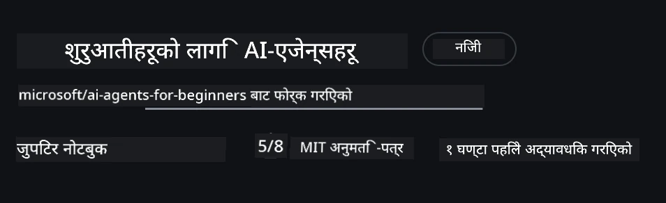
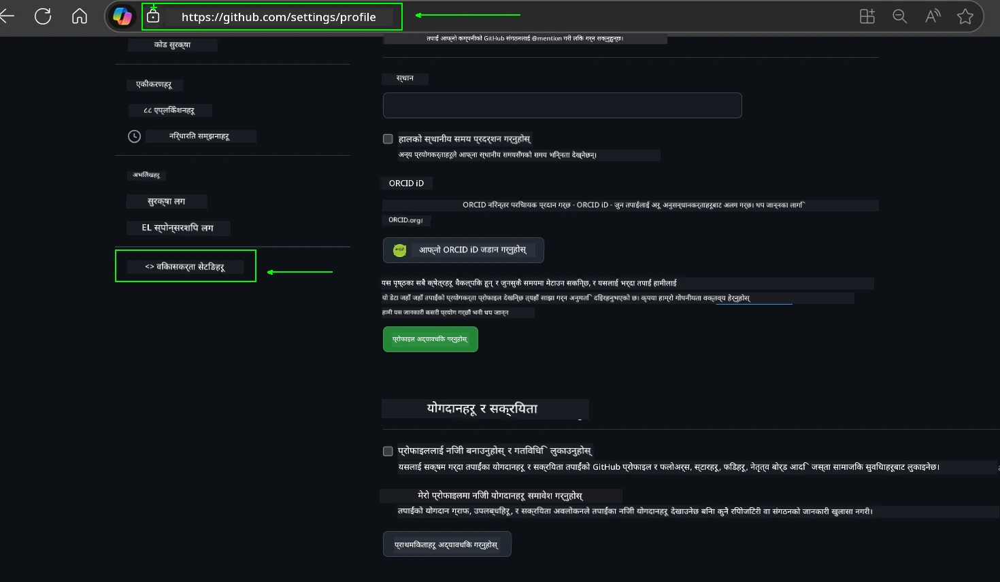
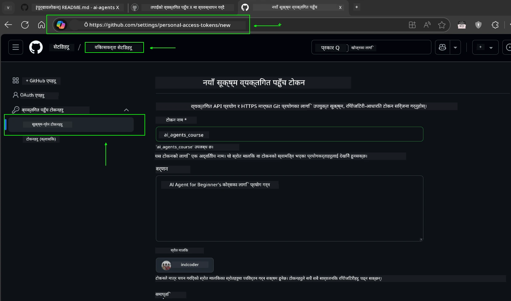
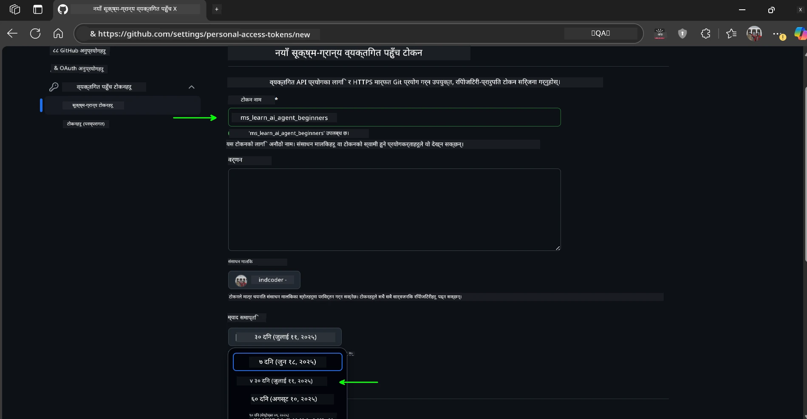
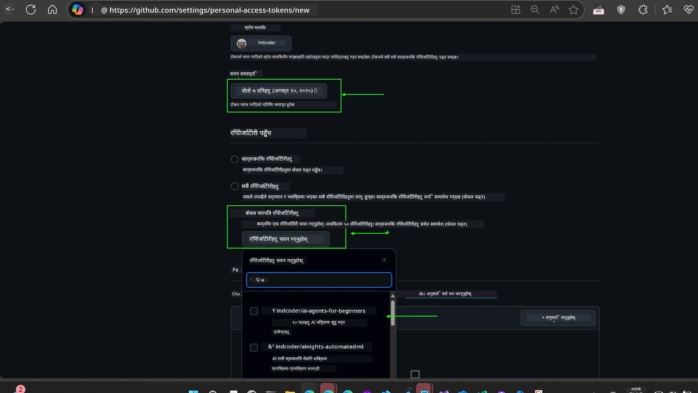
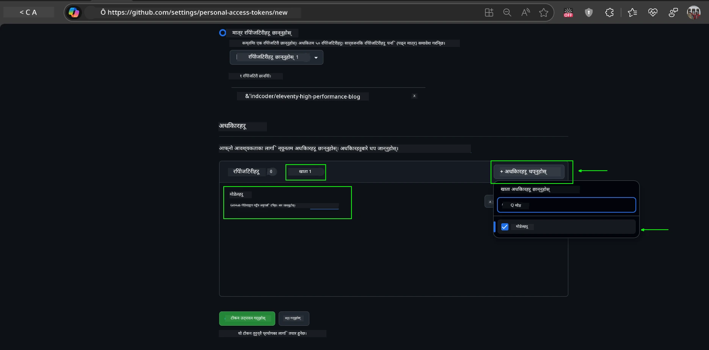
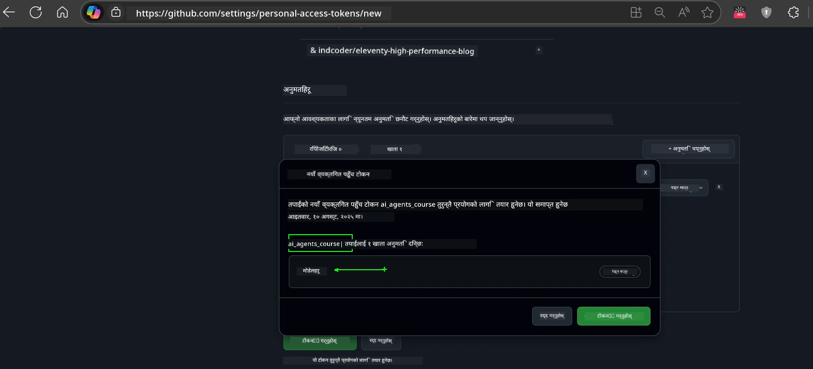
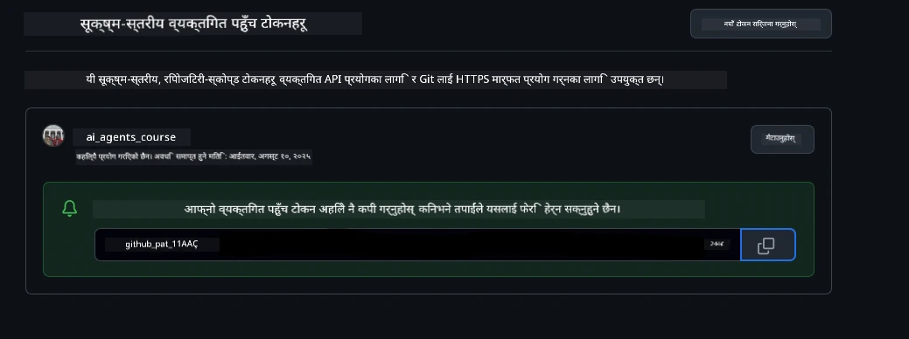
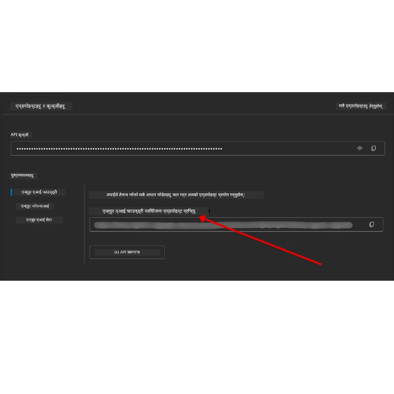

<!--
CO_OP_TRANSLATOR_METADATA:
{
  "original_hash": "63b1a8f6e840df15934935b728e569f0",
  "translation_date": "2025-12-03T14:11:17+00:00",
  "source_file": "00-course-setup/README.md",
  "language_code": "ne"
}
-->
# कोर्स सेटअप

## परिचय

यो पाठले यस कोर्सका कोड नमूनाहरू कसरी चलाउने भन्ने कुरा समेट्छ।

## अन्य सिक्नेहरूमा सामेल हुनुहोस् र सहयोग प्राप्त गर्नुहोस्

तपाईंको रिपो क्लोन गर्न सुरु गर्नु अघि, [AI Agents For Beginners Discord च्यानल](https://aka.ms/ai-agents/discord) मा सामेल हुनुहोस्। यहाँ सेटअपमा सहयोग, कोर्स सम्बन्धी कुनै पनि प्रश्न, वा अन्य सिक्नेहरूसँग जडान गर्न सक्नुहुन्छ।

## यो रिपो क्लोन वा फोर्क गर्नुहोस्

सुरु गर्न, कृपया GitHub रिपोजिटरी क्लोन वा फोर्क गर्नुहोस्। यसले तपाईंलाई कोर्स सामग्रीको आफ्नै संस्करण बनाउने अनुमति दिन्छ ताकि तपाईं कोड चलाउन, परीक्षण गर्न, र परिमार्जन गर्न सक्नुहुन्छ!

यो गर्नको लागि <a href="https://github.com/microsoft/ai-agents-for-beginners/fork" target="_blank">रिपो फोर्क गर्नुहोस्</a> लिंकमा क्लिक गर्नुहोस्।

अब तपाईंको कोर्सको फोर्क गरिएको संस्करण निम्न लिंकमा उपलब्ध हुनेछ:



### शैलो क्लोन (वर्कशप / Codespaces का लागि सिफारिस गरिएको)

  >पूर्ण रिपोजिटरी ठूलो (~3 GB) हुन सक्छ जब तपाईं सम्पूर्ण इतिहास र सबै फाइलहरू डाउनलोड गर्नुहुन्छ। यदि तपाईं केवल वर्कशपमा भाग लिँदै हुनुहुन्छ वा केवल केही पाठ फोल्डरहरू चाहिन्छ भने, शैलो क्लोन (वा स्पार्स क्लोन) ले अधिकांश डाउनलोडलाई रोक्छ।

#### छिटो शैलो क्लोन — न्यूनतम इतिहास, सबै फाइलहरू

तलका आदेशहरूमा `<your-username>` लाई तपाईंको फोर्क URL (वा तपाईंलाई मनपर्ने अपस्ट्रीम URL) सँग बदल्नुहोस्।

केवल पछिल्लो कमिट इतिहास क्लोन गर्न (सानो डाउनलोड):

```bash|powershell
git clone --depth 1 https://github.com/<your-username>/ai-agents-for-beginners.git
```

विशिष्ट ब्रान्च क्लोन गर्न:

```bash|powershell
git clone --depth 1 --branch <branch-name> https://github.com/<your-username>/ai-agents-for-beginners.git
```

#### आंशिक (स्पार्स) क्लोन — न्यूनतम ब्लब्स + केवल चयनित फोल्डरहरू

यसले आंशिक क्लोन र स्पार्स-चेकआउट प्रयोग गर्दछ (Git 2.25+ आवश्यक छ र आंशिक क्लोन समर्थनको साथ आधुनिक Git सिफारिस गरिएको छ):

```bash|powershell
git clone --depth 1 --filter=blob:none --sparse https://github.com/<your-username>/ai-agents-for-beginners.git
```

रिपो फोल्डरमा जानुहोस्:

```bash|powershell
cd ai-agents-for-beginners
```

त्यसपछि तपाईं चाहिने फोल्डरहरू निर्दिष्ट गर्नुहोस् (तलको उदाहरणले दुई फोल्डरहरू देखाउँछ):

```bash|powershell
git sparse-checkout set 00-course-setup 01-intro-to-ai-agents
```

क्लोन र फाइलहरू प्रमाणित गरेपछि, यदि तपाईंलाई केवल फाइलहरू चाहिन्छ र ठाउँ खाली गर्न चाहनुहुन्छ भने (कुनै git इतिहास छैन), कृपया रिपोजिटरी मेटाडाटा मेटाउनुहोस् (💀अपरिवर्तनीय — तपाईं सबै Git कार्यक्षमता गुमाउनुहुनेछ: कुनै कमिट, पुल, पुश, वा इतिहास पहुँच छैन)।

```bash
# zsh/bash
rm -rf .git
```

```powershell
# पावरशेल
Remove-Item -Recurse -Force .git
```

#### GitHub Codespaces प्रयोग गर्दै (स्थानीय ठूलो डाउनलोडहरू रोक्न सिफारिस गरिएको)

- [GitHub UI](https://github.com/codespaces) मार्फत यस रिपोको लागि नयाँ Codespace सिर्जना गर्नुहोस्।  

- नयाँ सिर्जित Codespace को टर्मिनलमा, माथिका शैलो/स्पार्स क्लोन आदेशहरू चलाउनुहोस् ताकि तपाईंलाई आवश्यक पाठ फोल्डरहरू Codespace कार्यक्षेत्रमा ल्याउन सक्नुहुन्छ।
- वैकल्पिक: Codespaces भित्र क्लोन गरेपछि, अतिरिक्त ठाउँ पुनः प्राप्त गर्न .git हटाउनुहोस् (माथिका हटाउने आदेशहरू हेर्नुहोस्)।
- नोट: यदि तपाईं Codespaces मा रिपो सीधा खोल्न चाहनुहुन्छ (अतिरिक्त क्लोन बिना), Codespaces ले devcontainer वातावरण निर्माण गर्नेछ र अझै पनि तपाईंलाई आवश्यक भन्दा बढी प्रावधान गर्न सक्छ। नयाँ Codespace भित्र शैलो प्रतिलिपि क्लोन गर्नुले डिस्क प्रयोगमा अधिक नियन्त्रण दिन्छ।

#### सुझावहरू

- यदि तपाईं सम्पादन/कमिट गर्न चाहनुहुन्छ भने सधैं क्लोन URL तपाईंको फोर्कसँग बदल्नुहोस्।
- यदि तपाईंलाई पछि थप इतिहास वा फाइलहरू चाहिन्छ भने, तपाईं तिनीहरूलाई फेच गर्न वा स्पार्स-चेकआउट समायोजन गर्न सक्नुहुन्छ।

## कोड चलाउँदै

यो कोर्सले Jupyter Notebooks को श्रृंखला प्रदान गर्दछ जसले तपाईंलाई AI Agents निर्माण गर्न व्यावहारिक अनुभव प्राप्त गर्न अनुमति दिन्छ।

कोड नमूनाहरू निम्न प्रयोग गर्छन्:

**GitHub खाता आवश्यक - निःशुल्क**:

1) Semantic Kernel Agent Framework + GitHub Models Marketplace। (semantic-kernel.ipynb) लेबल गरिएको।
2) AutoGen Framework + GitHub Models Marketplace। (autogen.ipynb) लेबल गरिएको।

**Azure सदस्यता आवश्यक**:

3) Azure AI Foundry + Azure AI Agent Service। (azureaiagent.ipynb) लेबल गरिएको।

हामी तपाईंलाई तीन प्रकारका उदाहरणहरू प्रयास गर्न प्रोत्साहित गर्छौं ताकि कुन तपाईंको लागि राम्रो काम गर्छ हेर्न सक्नुहुन्छ।

तपाईंले जुन विकल्प चयन गर्नुहुन्छ, यसले तलका सेटअप चरणहरू निर्धारण गर्नेछ:

## आवश्यकताहरू

- Python 3.12+
  - **NOTE**: यदि तपाईंले Python3.12 स्थापना गर्नुभएको छैन भने, सुनिश्चित गर्नुहोस् कि तपाईं यसलाई स्थापना गर्नुहुन्छ। त्यसपछि requirements.txt फाइलबाट सही संस्करणहरू स्थापना गर्न python3.12 प्रयोग गरेर आफ्नो venv सिर्जना गर्नुहोस्।
  
    >उदाहरण

    Python venv डाइरेक्टरी सिर्जना गर्नुहोस्:

    ```bash|powershell
    python -m venv venv
    ```

    त्यसपछि venv वातावरण सक्रिय गर्नुहोस्:

    ```bash
    # जेडएसएच/ब्याश
    source venv/bin/activate
    ```
  
    ```dos
    # Command Prompt for Windows
    venv\Scripts\activate
    ```

- .NET 10+: .NET प्रयोग गर्ने नमूनाहरूका लागि, सुनिश्चित गर्नुहोस् कि तपाईंले [.NET 10 SDK](https://dotnet.microsoft.com/download/dotnet/10.0) वा पछिल्लो संस्करण स्थापना गर्नुभएको छ। त्यसपछि, तपाईंको स्थापना गरिएको .NET SDK संस्करण जाँच गर्नुहोस्:

    ```bash|powershell
    dotnet --list-sdks
    ```

- GitHub खाता - GitHub Models Marketplace पहुँचको लागि
- Azure सदस्यता - Azure AI Foundry पहुँचको लागि
- Azure AI Foundry खाता - Azure AI Agent Service पहुँचको लागि

हामीले यस रिपोजिटरीको मूलमा `requirements.txt` फाइल समावेश गरेका छौं जसमा कोड नमूनाहरू चलाउन आवश्यक सबै Python प्याकेजहरू छन्।

तपाईं यसलाई निम्न आदेश चलाएर स्थापना गर्न सक्नुहुन्छ:

```bash|powershell
pip install -r requirements.txt
```

हामी कुनै पनि द्वन्द्व र समस्याहरू रोक्न Python भर्चुअल वातावरण सिर्जना गर्न सिफारिस गर्छौं।

## VSCode सेटअप गर्नुहोस्

VSCode मा सही संस्करणको Python प्रयोग गरिरहेको सुनिश्चित गर्नुहोस्।


## GitHub Models प्रयोग गर्ने नमूनाहरूको सेटअप 

### चरण 1: तपाईंको GitHub व्यक्तिगत पहुँच टोकन (PAT) प्राप्त गर्नुहोस्

यो कोर्सले GitHub Models Marketplace प्रयोग गर्दछ, जसले तपाईंलाई ठूलो भाषा मोडेलहरू (LLMs) नि:शुल्क पहुँच प्रदान गर्दछ जसलाई तपाईं AI Agents निर्माण गर्न प्रयोग गर्नुहुनेछ।

GitHub Models प्रयोग गर्न, तपाईंले [GitHub व्यक्तिगत पहुँच टोकन](https://docs.github.com/en/authentication/keeping-your-account-and-data-secure/managing-your-personal-access-tokens) सिर्जना गर्न आवश्यक छ।

यो तपाईंको GitHub खाताको <a href="https://github.com/settings/personal-access-tokens" target="_blank">व्यक्तिगत पहुँच टोकन सेटिङ</a> मा गएर गर्न सकिन्छ।

कृपया टोकन सिर्जना गर्दा [कम विशेषाधिकारको सिद्धान्त](https://docs.github.com/en/get-started/learning-to-code/storing-your-secrets-safely) पालना गर्नुहोस्। यसको मतलब तपाईंले टोकनलाई यस कोर्सका कोड नमूनाहरू चलाउन आवश्यक अनुमति मात्र दिनुपर्छ।

1. **Developer settings** मा गएर `Fine-grained tokens` विकल्प चयन गर्नुहोस्।

   

   त्यसपछि `Generate new token` चयन गर्नुहोस्।

   

2. टोकनको उद्देश्यलाई प्रतिबिम्बित गर्ने वर्णनात्मक नाम प्रविष्ट गर्नुहोस् ताकि पछि यसलाई सजिलै पहिचान गर्न सकिन्छ।

    🔐 टोकन अवधि सिफारिस

    सिफारिस गरिएको अवधि: 30 दिन
    अधिक सुरक्षित दृष्टिकोणको लागि, तपाईं छोटो अवधि चयन गर्न सक्नुहुन्छ—जस्तै 7 दिन 🛡️
    यो व्यक्तिगत लक्ष्य सेट गर्न र कोर्स पूरा गर्नको लागि राम्रो तरिका हो जब तपाईंको सिक्ने गति उच्च छ 🚀।

    

3. टोकनको स्कोपलाई यस रिपोजिटरीको फोर्कमा सीमित गर्नुहोस्।

    

4. टोकनको अनुमति सीमित गर्नुहोस्: **Permissions** अन्तर्गत, **Account** ट्याबमा क्लिक गर्नुहोस्, र "+ Add permissions" बटन क्लिक गर्नुहोस्। ड्रपडाउन देखा पर्नेछ। कृपया **Models** खोज्नुहोस् र यसको लागि बाकस जाँच गर्नुहोस्।

    

5. टोकन सिर्जना गर्नु अघि आवश्यक अनुमति प्रमाणित गर्नुहोस्। 

6. टोकन सिर्जना गर्नु अघि, सुनिश्चित गर्नुहोस् कि तपाईं टोकनलाई सुरक्षित ठाउँमा जस्तै पासवर्ड म्यानेजर भल्टमा भण्डारण गर्न तयार हुनुहुन्छ, किनकि यो सिर्जना गरेपछि फेरि देखाइने छैन। 

तपाईंले अहिले सिर्जना गरेको नयाँ टोकन प्रतिलिपि गर्नुहोस्। अब तपाईंले यसलाई यस कोर्समा समावेश गरिएको `.env` फाइलमा थप्नु पर्नेछ।

### चरण 2: तपाईंको `.env` फाइल सिर्जना गर्नुहोस्

तपाईंको `.env` फाइल सिर्जना गर्न निम्न आदेश टर्मिनलमा चलाउनुहोस्।

```bash
# जेडएसएच/ब्याश
cp .env.example .env
```

```powershell
# पावरशेल
Copy-Item .env.example .env
```

यसले उदाहरण फाइललाई प्रतिलिपि गर्नेछ र `.env` तपाईंको डाइरेक्टरीमा सिर्जना गर्नेछ जहाँ तपाईं वातावरण चरहरूको लागि मानहरू भर्नेछ।

तपाईंको टोकन प्रतिलिपि गरेर, `.env` फाइललाई तपाईंको मनपर्ने टेक्स्ट एडिटरमा खोल्नुहोस् र `GITHUB_TOKEN` फिल्डमा टोकन पेस्ट गर्नुहोस्।


अब तपाईं यस कोर्सका कोड नमूनाहरू चलाउन सक्षम हुनुहुनेछ।

## Azure AI Foundry र Azure AI Agent Service प्रयोग गर्ने नमूनाहरूको सेटअप

### चरण 1: तपाईंको Azure प्रोजेक्ट अन्त बिन्दु प्राप्त गर्नुहोस्

Azure AI Foundry मा हब र प्रोजेक्ट सिर्जना गर्ने चरणहरू यहाँ फेला पार्नुहोस्: [Hub resources overview](https://learn.microsoft.com/azure/ai-foundry/concepts/ai-resources)

तपाईंले आफ्नो प्रोजेक्ट सिर्जना गरेपछि, तपाईंले आफ्नो प्रोजेक्टको लागि कनेक्शन स्ट्रिङ प्राप्त गर्न आवश्यक छ।

यो Azure AI Foundry पोर्टलमा तपाईंको प्रोजेक्टको **Overview** पृष्ठमा गएर गर्न सकिन्छ।



### चरण 2: तपाईंको `.env` फाइल सिर्जना गर्नुहोस्

तपाईंको `.env` फाइल सिर्जना गर्न निम्न आदेश टर्मिनलमा चलाउनुहोस्।

```bash
# zsh/bash
cp .env.example .env
```

```powershell
# पावरशेल
Copy-Item .env.example .env
```

यसले उदाहरण फाइललाई प्रतिलिपि गर्नेछ र `.env` तपाईंको डाइरेक्टरीमा सिर्जना गर्नेछ जहाँ तपाईं वातावरण चरहरूको लागि मानहरू भर्नेछ।

तपाईंको टोकन प्रतिलिपि गरेर, `.env` फाइललाई तपाईंको मनपर्ने टेक्स्ट एडिटरमा खोल्नुहोस् र `PROJECT_ENDPOINT` फिल्डमा टोकन पेस्ट गर्नुहोस्।

### चरण 3: Azure मा साइन इन गर्नुहोस्

सुरक्षा उत्तम अभ्यासको रूपमा, हामी [keyless authentication](https://learn.microsoft.com/azure/developer/ai/keyless-connections?tabs=csharp%2Cazure-cli?WT.mc_id=academic-105485-koreyst) प्रयोग गरेर Microsoft Entra ID सँग Azure OpenAI मा प्रमाणित गर्नेछौं। 

अर्को, टर्मिनल खोल्नुहोस् र `az login --use-device-code` चलाएर Azure खातामा साइन इन गर्नुहोस्।

तपाईंले साइन इन गरेपछि, टर्मिनलमा आफ्नो सदस्यता चयन गर्नुहोस्।

## अतिरिक्त वातावरण चरहरू - Azure Search र Azure OpenAI 

Agentic RAG पाठ - पाठ 5 - मा Azure Search र Azure OpenAI प्रयोग गर्ने नमूनाहरू छन्।

यदि तपाईं यी नमूनाहरू चलाउन चाहनुहुन्छ भने, तपाईंले आफ्नो `.env` फाइलमा निम्न वातावरण चरहरू थप्न आवश्यक छ:

### Overview पृष्ठ (प्रोजेक्ट)

- `AZURE_SUBSCRIPTION_ID` - **Overview** पृष्ठको **Project details** मा जाँच गर्नुहोस्।

- `AZURE_AI_PROJECT_NAME` - तपाईंको प्रोजेक्टको **Overview** पृष्ठको शीर्षमा हेर्नुहोस्।

- `AZURE_OPENAI_SERVICE` - **Overview** पृष्ठको **Included capabilities** ट्याबमा **Azure OpenAI Service** को लागि फेला पार्नुहोस्।

### व्यवस्थापन केन्द्र

- `AZURE_OPENAI_RESOURCE_GROUP` - **Management Center** को **Overview** पृष्ठमा **Project properties** मा जानुहोस्।

- `GLOBAL_LLM_SERVICE` - **Connected resources** अन्तर्गत, **Azure AI Services** कनेक्शन नाम फेला पार्नुहोस्। यदि सूचीबद्ध छैन भने, **Azure portal** मा तपाईंको स्रोत समूह अन्तर्गत AI Services स्रोत नाम जाँच गर्नुहोस्।

### Models + Endpoints पृष्ठ

- `AZURE_OPENAI_EMBEDDING_DEPLOYMENT_NAME` - तपाईंको embedding मोडेल चयन गर्नुहोस् (जस्तै, `text-embedding-ada-002`) र मोडेल विवरणबाट **Deployment name** नोट गर्नुहोस्।

- `AZURE_OPENAI_CHAT_DEPLOYMENT_NAME` - तपाईंको chat मोडेल चयन गर्नुहोस् (जस्तै, `gpt-4o-mini`) र मोडेल विवरणबाट **Deployment name** नोट गर्नुहोस्।

### Azure पोर्टल

- `AZURE_OPENAI_ENDPOINT` - **Azure AI services** खोज्नुहोस्, त्यसपछि **Resource Management**, **Keys and Endpoint** मा जानुहोस्, "Azure OpenAI endpoints" मा स्क्रोल गर्नुहोस्, र "Language APIs" भन्ने एक प्रतिलिपि गर्नुहोस्।

- `AZURE_OPENAI_API_KEY` - त्यही स्क्रिनबाट, KEY 1 वा KEY 2 प्रतिलिपि गर्नुहोस्।

- `AZURE_SEARCH_SERVICE_ENDPOINT` - तपाईंको **Azure AI Search** स्रोत फेला पार्नुहोस्, यसलाई क्लिक गर्नुहोस्, र **Overview** हेर्नुहोस्।

- `AZURE_SEARCH_API_KEY` - त्यसपछि **Settings** मा जानुहोस् र **Keys** मा प्रमुख वा माध्यमिक प्रशासक कुञ्जी प्रतिलिपि गर्नुहोस्।

### बाह्य वेबपेज

- `AZURE_OPENAI_API_VERSION` - [API version lifecycle](https://learn.microsoft.com/azure/ai-services/openai/api-version-deprecation#latest-ga-api-release) पृष्ठ अन्तर्गत **Latest GA API release** मा जानुहोस्।

### keyless authentication सेटअप गर्नुहोस्

तपाईंको प्रमाणहरू हार्डकोड गर्नुको सट्टा, हामी Azure OpenAI सँग keyless कनेक्शन प्रयोग गर्नेछौं। यसका लागि, हामी `DefaultAzureCredential` आयात गर्नेछौं र पछि `DefaultAzureCredential` फंक्शनलाई प्रमाण प्राप्त गर्न कल गर्नेछौं।

```python
# पाइथन
from azure.identity import DefaultAzureCredential, InteractiveBrowserCredential
```

## कतै अडिनुभएको छ?
यदि तपाईंलाई यो सेटअप चलाउन कुनै समस्या छ भने, हाम्रो <a href="https://discord.gg/kzRShWzttr" target="_blank">Azure AI Community Discord</a> मा सामेल हुनुहोस् वा <a href="https://github.com/microsoft/ai-agents-for-beginners/issues?WT.mc_id=academic-105485-koreyst" target="_blank">समस्या सिर्जना गर्नुहोस्</a>।

## अर्को पाठ

अब तपाईं यस पाठ्यक्रमको कोड चलाउन तयार हुनुहुन्छ। AI एजेन्टहरूको संसारको बारेमा थप सिक्न शुभकामना!

[AI एजेन्टहरू र एजेन्ट प्रयोग केसहरूको परिचय](../01-intro-to-ai-agents/README.md)

---

<!-- CO-OP TRANSLATOR DISCLAIMER START -->
**अस्वीकरण**:  
यो दस्तावेज़ AI अनुवाद सेवा [Co-op Translator](https://github.com/Azure/co-op-translator) प्रयोग गरी अनुवाद गरिएको हो। हामी यथासम्भव शुद्धताको प्रयास गर्छौं, तर कृपया जानकार रहनुहोस् कि स्वचालित अनुवादहरूमा त्रुटिहरू वा अशुद्धताहरू हुन सक्छन्। यसको मूल भाषामा रहेको मूल दस्तावेज़लाई आधिकारिक स्रोत मानिनुपर्छ। महत्वपूर्ण जानकारीका लागि, व्यावसायिक मानव अनुवाद सिफारिस गरिन्छ। यस अनुवादको प्रयोगबाट उत्पन्न हुने कुनै पनि गलतफहमी वा गलत व्याख्याका लागि हामी जिम्मेवार हुने छैनौं।
<!-- CO-OP TRANSLATOR DISCLAIMER END -->