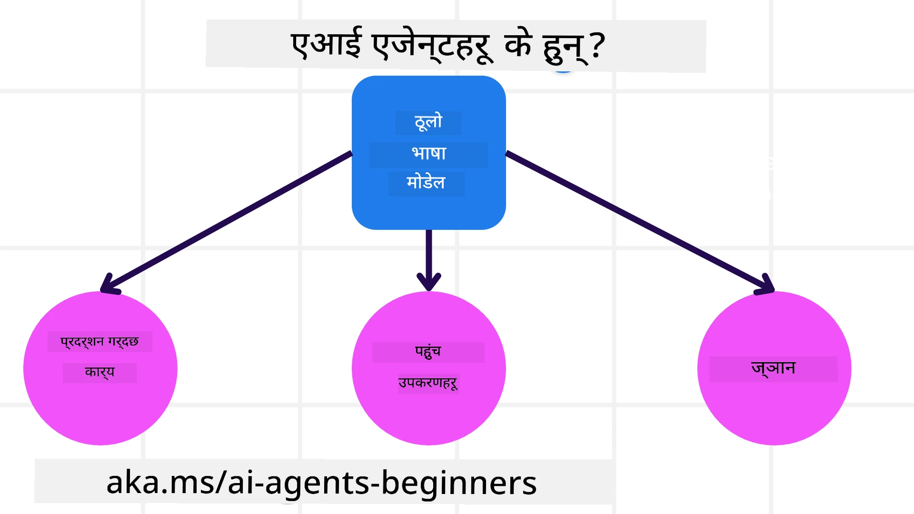
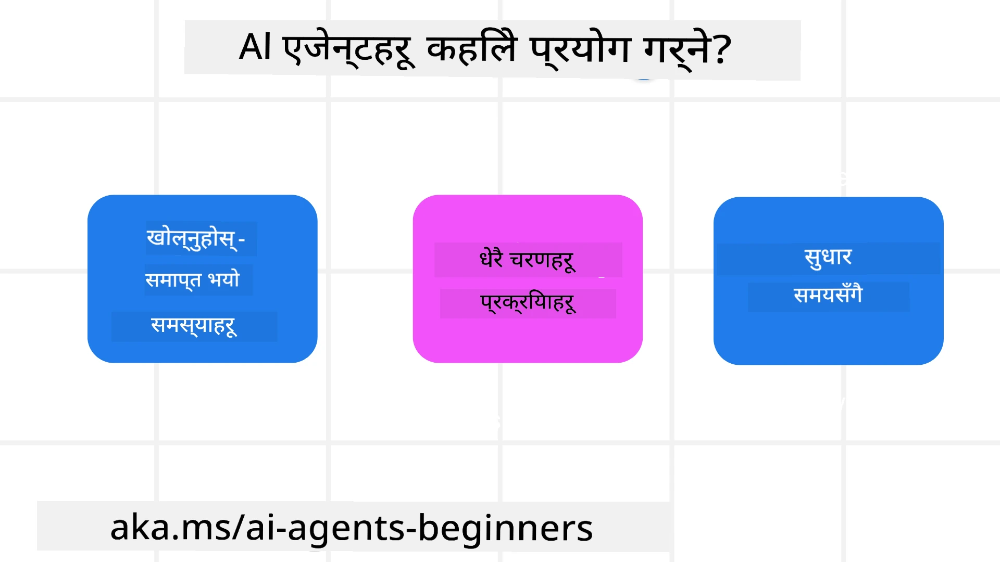

<!--
CO_OP_TRANSLATOR_METADATA:
{
  "original_hash": "cdd28bc00816d2773bb2b5968d782abc",
  "translation_date": "2025-11-11T11:06:51+00:00",
  "source_file": "01-intro-to-ai-agents/README.md",
  "language_code": "ne"
}
-->

> _(यो पाठको भिडियो हेर्न माथिको तस्बिरमा क्लिक गर्नुहोस्)_

# AI एजेन्ट्स र एजेन्ट प्रयोगका केसहरूको परिचय

"AI एजेन्ट्सको लागि शुरुवातकर्ता" कोर्समा स्वागत छ! यो कोर्सले AI एजेन्ट्स निर्माणका लागि आधारभूत ज्ञान र प्रयोगात्मक नमूनाहरू प्रदान गर्दछ।

अन्य सिक्नेहरू र AI एजेन्ट निर्माताहरूसँग भेट्न र यस कोर्सबारे कुनै पनि प्रश्न सोध्न <a href="https://discord.gg/kzRShWzttr" target="_blank">Azure AI Discord Community</a> मा सामेल हुनुहोस्।

यो कोर्स सुरु गर्न, हामी AI एजेन्ट्स के हुन् र हामीले निर्माण गर्ने एप्लिकेसन र वर्कफ्लोहरूमा तिनीहरूलाई कसरी प्रयोग गर्न सकिन्छ भन्ने राम्रो समझ प्राप्त गरेर सुरु गर्छौं।

## परिचय

यो पाठले समेट्छ:

- AI एजेन्ट्स के हुन् र तिनीहरूको विभिन्न प्रकारहरू के हुन्?
- कुन प्रयोगका केसहरू AI एजेन्ट्सका लागि उपयुक्त छन् र तिनीहरूले हामीलाई कसरी सहयोग गर्न सक्छन्?
- एजेन्टिक समाधान डिजाइन गर्दा केहि आधारभूत निर्माण ब्लकहरू के हुन्?

## सिक्ने लक्ष्यहरू
यो पाठ पूरा गरेपछि, तपाईंले:

- AI एजेन्ट्सको अवधारणाहरू बुझ्न र अन्य AI समाधानहरूबाट तिनीहरू कसरी फरक छन् भन्ने जान्न सक्नुहुन्छ।
- AI एजेन्ट्सलाई सबैभन्दा प्रभावकारी रूपमा लागू गर्न सक्नुहुन्छ।
- प्रयोगकर्ता र ग्राहकहरूको लागि उत्पादक रूपमा एजेन्टिक समाधानहरू डिजाइन गर्न सक्नुहुन्छ।

## AI एजेन्ट्सको परिभाषा र प्रकारहरू

### AI एजेन्ट्स के हुन्?

AI एजेन्ट्स **प्रणालीहरू** हुन् जसले **ठूलो भाषा मोडेलहरू (LLMs)** लाई **कार्यहरू गर्न** सक्षम बनाउँछन्, तिनीहरूको क्षमता विस्तार गरेर LLMs लाई **उपकरणहरू** र **ज्ञान**मा पहुँच प्रदान गर्छन्।

आउनुहोस्, यो परिभाषालाई साना भागहरूमा तोडौं:

- **प्रणाली** - एजेन्ट्सलाई केवल एकल घटकको रूपमा होइन, तर धेरै घटकहरूको प्रणालीको रूपमा सोच्नु महत्त्वपूर्ण छ। AI एजेन्टको आधारभूत स्तरमा घटकहरू हुन्:
  - **पर्यावरण** - AI एजेन्ट सञ्चालन गर्ने परिभाषित स्थान। उदाहरणका लागि, यदि हामीसँग यात्रा बुकिङ AI एजेन्ट छ भने, पर्यावरण यात्रा बुकिङ प्रणाली हुन सक्छ जुन AI एजेन्टले कार्यहरू पूरा गर्न प्रयोग गर्छ।
  - **सेन्सरहरू** - पर्यावरणसँग जानकारी हुन्छ र प्रतिक्रिया प्रदान गर्छ। AI एजेन्ट्सले सेन्सरहरू प्रयोग गरेर पर्यावरणको वर्तमान अवस्थाको बारेमा जानकारी संकलन र व्याख्या गर्छ। यात्रा बुकिङ एजेन्टको उदाहरणमा, यात्रा बुकिङ प्रणालीले होटल उपलब्धता वा उडान मूल्यहरूको जानकारी प्रदान गर्न सक्छ।
  - **एक्चुएटरहरू** - एकपटक AI एजेन्टले पर्यावरणको वर्तमान अवस्था प्राप्त गरेपछि, वर्तमान कार्यका लागि एजेन्टले पर्यावरण परिवर्तन गर्न के कार्य गर्नुपर्छ भन्ने निर्णय गर्छ। यात्रा बुकिङ एजेन्टको लागि, यो प्रयोगकर्ताको लागि उपलब्ध कोठा बुक गर्न हुन सक्छ।

**ठूलो भाषा मोडेलहरू** - एजेन्ट्सको अवधारणा LLMs सिर्जना हुनु अघि नै अस्तित्वमा थियो। LLMs प्रयोग गरेर AI एजेन्ट्स निर्माणको फाइदा भनेको तिनीहरूको मानव भाषा र डाटालाई व्याख्या गर्ने क्षमता हो। यो क्षमता LLMs लाई पर्यावरणीय जानकारी व्याख्या गर्न र पर्यावरण परिवर्तन गर्न योजना परिभाषित गर्न सक्षम बनाउँछ।

**कार्यहरू गर्नुहोस्** - AI एजेन्ट प्रणालीहरू बाहिर, LLMs प्रयोगकर्ताको प्रम्प्टको आधारमा सामग्री वा जानकारी सिर्जना गर्ने स्थितिमा सीमित छन्। AI एजेन्ट प्रणालीहरू भित्र, LLMs उपकरणहरू प्रयोग गरेर र तिनीहरूको पर्यावरणमा उपलब्ध जानकारीको आधारमा कार्यहरू पूरा गर्न सक्षम छन्।

**उपकरणहरूमा पहुँच** - LLMs लाई के उपकरणहरूमा पहुँच छ भन्ने कुरा 1) तिनीहरू सञ्चालन गर्ने पर्यावरण र 2) AI एजेन्टको विकासकर्ताले परिभाषित गर्छ। हाम्रो यात्रा एजेन्ट उदाहरणमा, एजेन्टको उपकरणहरू बुकिङ प्रणालीमा उपलब्ध अपरेसनहरूद्वारा सीमित छन्, र/वा विकासकर्ताले उडानहरूमा एजेन्टको उपकरण पहुँच सीमित गर्न सक्छ।

**स्मृति+ज्ञान** - स्मृति वार्तालापको सन्दर्भमा छोटो अवधिको हुन सक्छ। लामो अवधिमा, पर्यावरणले प्रदान गरेको जानकारी बाहिर, AI एजेन्ट्सले अन्य प्रणालीहरू, सेवाहरू, उपकरणहरू, र अन्य एजेन्टहरूबाट पनि ज्ञान पुनःप्राप्त गर्न सक्छ। यात्रा एजेन्टको उदाहरणमा, यो ज्ञान ग्राहक डेटाबेसमा रहेको प्रयोगकर्ताको यात्रा प्राथमिकताहरूको जानकारी हुन सक्छ।

### विभिन्न प्रकारका एजेन्टहरू

अब हामीसँग AI एजेन्ट्सको सामान्य परिभाषा छ, आउनुहोस् केही विशिष्ट एजेन्ट प्रकारहरू हेर्नुहोस् र तिनीहरू यात्रा बुकिङ AI एजेन्टमा कसरी लागू हुनेछन्।

| **एजेन्ट प्रकार**                | **विवरण**                                                                                                                       | **उदाहरण**                                                                                                                                                                                                                   |
| ----------------------------- | ------------------------------------------------------------------------------------------------------------------------------------- | ----------------------------------------------------------------------------------------------------------------------------------------------------------------------------------------------------------------------------- |
| **साधारण रिफ्लेक्स एजेन्टहरू**      | पूर्वनिर्धारित नियमहरूको आधारमा तत्काल कार्यहरू प्रदर्शन गर्छ।                                                                                  | यात्रा एजेन्टले इमेलको सन्दर्भ व्याख्या गरेर यात्रा गुनासोहरू ग्राहक सेवामा अगाडि बढाउँछ।                                                                                                                          |
| **मोडेल-आधारित रिफ्लेक्स एजेन्टहरू** | विश्वको मोडेल र त्यस मोडेलमा परिवर्तनहरूको आधारमा कार्यहरू प्रदर्शन गर्छ।                                                              | यात्रा एजेन्टले ऐतिहासिक मूल्य डाटामा पहुँचको आधारमा महत्वपूर्ण मूल्य परिवर्तन भएका मार्गहरू प्राथमिकता दिन्छ।                                                                                                             |
| **गोल-आधारित एजेन्टहरू**         | विशिष्ट लक्ष्यहरू प्राप्त गर्न योजना बनाउँछ, लक्ष्य व्याख्या गरेर त्यसलाई प्राप्त गर्न आवश्यक कार्यहरू निर्धारण गर्छ।                                  | यात्रा एजेन्टले वर्तमान स्थानबाट गन्तव्यसम्म आवश्यक यात्रा व्यवस्था (कार, सार्वजनिक यातायात, उडानहरू) निर्धारण गरेर यात्रा बुक गर्छ।                                                                                |
| **युटिलिटी-आधारित एजेन्टहरू**      | प्राथमिकताहरू विचार गर्छ र लक्ष्यहरू प्राप्त गर्न संख्यात्मक रूपमा व्यापार-अफहरू तौल गर्छ।                                               | यात्रा एजेन्टले यात्रा बुक गर्दा सुविधाको तुलनामा लागत तौल गरेर युटिलिटी अधिकतम गर्छ।                                                                                                                                          |
| **सिक्ने एजेन्टहरू**           | प्रतिक्रिया प्राप्त गरेर र कार्यहरू समायोजन गरेर समयसँग सुधार गर्छ।                                                        | यात्रा एजेन्टले पोस्ट-ट्रिप सर्वेक्षणबाट ग्राहक प्रतिक्रिया प्रयोग गरेर भविष्यका बुकिङहरूमा समायोजन गरेर सुधार गर्छ।                                                                                                               |
| **हाइरार्किकल एजेन्टहरू**       | टियर प्रणालीमा धेरै एजेन्टहरू विशेषता राख्छ, उच्च-स्तरका एजेन्टहरूले कार्यहरू उप-कार्यहरूमा तोड्छन् ताकि तल्लो-स्तरका एजेन्टहरूले तिनीहरू पूरा गर्न सकून्। | यात्रा एजेन्टले विशिष्ट बुकिङहरू रद्द गर्ने उप-कार्यहरूमा कार्यलाई विभाजन गरेर यात्रा रद्द गर्छ, र तल्लो-स्तरका एजेन्टहरूले तिनीहरू पूरा गरेर उच्च-स्तरका एजेन्टलाई रिपोर्ट गर्छ।                                     |
| **मल्टि-एजेन्ट प्रणालीहरू (MAS)** | एजेन्टहरूले स्वतन्त्र रूपमा कार्यहरू पूरा गर्छन्, सहकारी वा प्रतिस्पर्धात्मक रूपमा।                                                           | सहकारी: धेरै एजेन्टहरूले होटलहरू, उडानहरू, र मनोरञ्जन जस्ता विशिष्ट यात्रा सेवाहरू बुक गर्छन्। प्रतिस्पर्धात्मक: धेरै एजेन्टहरूले साझा होटल बुकिङ क्यालेन्डर व्यवस्थापन गर्छन् र ग्राहकहरूलाई होटलमा बुक गर्न प्रतिस्पर्धा गर्छन्। |

## AI एजेन्ट्स कहिले प्रयोग गर्ने

पहिलेको खण्डमा, हामीले यात्रा एजेन्ट प्रयोग-केस प्रयोग गरेर यात्रा बुकिङका विभिन्न परिदृश्यहरूमा विभिन्न प्रकारका एजेन्टहरू कसरी प्रयोग गर्न सकिन्छ भन्ने व्याख्या गर्यौं। हामी यो एप्लिकेसनलाई कोर्सभरि प्रयोग गर्नेछौं।

आउनुहोस्, AI एजेन्ट्सका लागि सबैभन्दा उपयुक्त प्रयोगका केसहरूको प्रकारहरू हेर्नुहोस्:

- **खुला-अन्त समस्याहरू** - LLM लाई कार्य पूरा गर्न आवश्यक चरणहरू निर्धारण गर्न अनुमति दिनुहोस् किनभने यो सधैं वर्कफ्लोमा हार्डकोड गर्न सकिँदैन।
- **बहु-चरण प्रक्रिया** - कार्यहरू जसले जटिलताको स्तर आवश्यक पार्छ जसमा AI एजेन्टले उपकरणहरू वा जानकारीलाई एकल शट पुनःप्राप्तिको सट्टा धेरै पटक प्रयोग गर्नुपर्छ।  
- **समयसँग सुधार** - कार्यहरू जहाँ एजेन्टले आफ्नो पर्यावरण वा प्रयोगकर्ताहरूबाट प्रतिक्रिया प्राप्त गरेर समयसँग सुधार गर्न सक्छ ताकि राम्रो युटिलिटी प्रदान गर्न सकियोस्।

AI एजेन्ट्स प्रयोग गर्ने थप विचारहरू "विश्वसनीय AI एजेन्ट्स निर्माण" पाठमा समेटिन्छ।

## एजेन्टिक समाधानहरूको आधारभूत कुरा

### एजेन्ट विकास

AI एजेन्ट प्रणाली डिजाइन गर्ने पहिलो चरण भनेको उपकरणहरू, कार्यहरू, र व्यवहारहरू परिभाषित गर्नु हो। यस कोर्समा, हामी **Azure AI Agent Service** प्रयोग गरेर हाम्रो एजेन्टहरू परिभाषित गर्न केन्द्रित छौं। यसले निम्न सुविधाहरू प्रदान गर्दछ:

- OpenAI, Mistral, र Llama जस्ता खुला मोडेलहरूको चयन
- Tripadvisor जस्ता प्रदायकहरू मार्फत लाइसेन्स गरिएको डाटा प्रयोग
- मानकीकृत OpenAPI 3.0 उपकरणहरूको प्रयोग

### एजेन्टिक ढाँचा

LLMs सँगको संवाद प्रम्प्टहरू मार्फत हुन्छ। AI एजेन्टहरूको अर्ध-स्वायत्त प्रकृतिको कारण, पर्यावरणमा परिवर्तन पछि LLM लाई म्यानुअली पुनःप्रम्प्ट गर्नु सधैं सम्भव वा आवश्यक हुँदैन। हामी **एजेन्टिक ढाँचा** प्रयोग गर्छौं जसले LLM लाई धेरै चरणहरूमा अधिक स्केलेबल तरिकामा प्रम्प्ट गर्न अनुमति दिन्छ।

यो कोर्स केही हालका लोकप्रिय एजेन्टिक ढाँचामा विभाजित छ।

### एजेन्टिक फ्रेमवर्कहरू

एजेन्टिक फ्रेमवर्कहरूले विकासकर्ताहरूलाई कोड मार्फत एजेन्टिक ढाँचा लागू गर्न अनुमति दिन्छ। यी फ्रेमवर्कहरूले टेम्प्लेटहरू, प्लगइनहरू, र उपकरणहरू प्रदान गर्छन् जसले AI एजेन्टहरूको राम्रो सहयोगको लागि फाइदाहरू प्रदान गर्छ। यी फाइदाहरूले AI एजेन्ट प्रणालीहरूको राम्रो अवलोकन र समस्या समाधानको क्षमता प्रदान गर्छ।

यस कोर्समा, हामी अनुसन्धान-चालित AutoGen फ्रेमवर्क र उत्पादन-तयार एजेन्ट फ्रेमवर्क (Semantic Kernel बाट) अन्वेषण गर्नेछौं।

## नमूना कोडहरू

- Python: [एजेन्ट फ्रेमवर्क](./code_samples/01-python-agent-framework.ipynb)
- .NET: [एजेन्ट फ्रेमवर्क](./code_samples/01-dotnet-agent-framework.md)

## AI एजेन्ट्सबारे थप प्रश्नहरू छन्?

[Azure AI Foundry Discord](https://aka.ms/ai-agents/discord) मा सामेल हुनुहोस् ताकि अन्य सिक्नेहरूसँग भेट गर्न, कार्यालय समयमा सहभागी हुन र तपाईंका AI एजेन्ट्सका प्रश्नहरूको उत्तर प्राप्त गर्न सकियोस्।

## अघिल्लो पाठ

[कोर्स सेटअप](../00-course-setup/README.md)

## अर्को पाठ

[एजेन्टिक फ्रेमवर्कहरू अन्वेषण गर्दै](../02-explore-agentic-frameworks/README.md)

---

<!-- CO-OP TRANSLATOR DISCLAIMER START -->
**अस्वीकरण**:  
यो दस्तावेज़ AI अनुवाद सेवा [Co-op Translator](https://github.com/Azure/co-op-translator) प्रयोग गरेर अनुवाद गरिएको छ। हामी शुद्धताको लागि प्रयास गर्छौं, तर कृपया ध्यान दिनुहोस् कि स्वचालित अनुवादमा त्रुटिहरू वा अशुद्धताहरू हुन सक्छ। यसको मूल भाषा मा रहेको दस्तावेज़लाई आधिकारिक स्रोत मानिनुपर्छ। महत्वपूर्ण जानकारीको लागि, व्यावसायिक मानव अनुवाद सिफारिस गरिन्छ। यस अनुवादको प्रयोगबाट उत्पन्न हुने कुनै पनि गलतफहमी वा गलत व्याख्याको लागि हामी जिम्मेवार हुने छैनौं।
<!-- CO-OP TRANSLATOR DISCLAIMER END -->