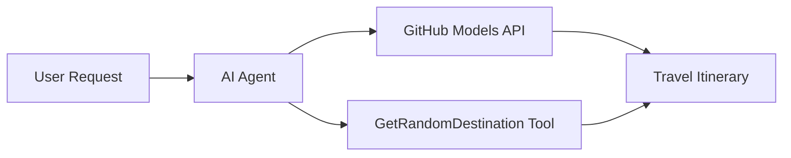

<!--
CO_OP_TRANSLATOR_METADATA:
{
  "original_hash": "5f351412e934f0833c8c821a0a60efaf",
  "translation_date": "2025-11-13T11:55:38+00:00",
  "source_file": "01-intro-to-ai-agents/code_samples/01-dotnet-agent-framework.md",
  "language_code": "ne"
}
-->
# 🌍 माइक्रोसफ्ट एजेन्ट फ्रेमवर्क (.NET) संग AI यात्रा एजेन्ट

## 📋 परिदृश्यको अवलोकन

यो उदाहरणले माइक्रोसफ्ट एजेन्ट फ्रेमवर्कको प्रयोग गरेर एक बुद्धिमान यात्रा योजना एजेन्ट कसरी निर्माण गर्ने भनेर देखाउँछ। एजेन्टले विश्वभरका विभिन्न गन्तव्यहरूको लागि व्यक्तिगत दिन-यात्रा योजना स्वतः उत्पन्न गर्न सक्छ।

### मुख्य क्षमताहरू:

- 🎲 **र्यान्डम गन्तव्य चयन**: छुट्टीको स्थान चयन गर्न कस्टम टूल प्रयोग गर्दछ
- 🗺️ **बुद्धिमान यात्रा योजना**: विस्तृत दिन-प्रतिदिनको योजना बनाउँछ
- 🔄 **रियल-टाइम स्ट्रिमिङ**: तत्काल र स्ट्रिमिङ प्रतिक्रियाहरूलाई समर्थन गर्दछ
- 🛠️ **कस्टम टूल एकीकरण**: एजेन्टको क्षमताहरू विस्तार गर्ने तरिका प्रदर्शन गर्दछ

## 🔧 प्राविधिक वास्तुकला

### मुख्य प्रविधिहरू

- **माइक्रोसफ्ट एजेन्ट फ्रेमवर्क**: .NET को लागि AI एजेन्ट विकासको नवीनतम कार्यान्वयन
- **GitHub मोडेल्स एकीकरण**: GitHub को AI मोडेल इन्फरेन्स सेवा प्रयोग गर्दछ
- **OpenAI API अनुकूलता**: कस्टम अन्तर्क्रियासँग OpenAI क्लाइन्ट लाइब्रेरीहरू प्रयोग गर्दछ
- **सुरक्षित कन्फिगरेसन**: वातावरण-आधारित API कुञ्जी व्यवस्थापन

### मुख्य घटकहरू

1. **AIAgent**: मुख्य एजेन्ट आयोजक जसले संवाद प्रवाहलाई व्यवस्थापन गर्दछ
2. **कस्टम टूलहरू**: एजेन्टलाई उपलब्ध `GetRandomDestination()` फङ्क्सन
3. **च्याट क्लाइन्ट**: GitHub मोडेल्स-समर्थित संवाद इन्टरफेस
4. **स्ट्रिमिङ समर्थन**: रियल-टाइम प्रतिक्रिया उत्पन्न गर्ने क्षमता

### एकीकरण ढाँचा



## 🚀 सुरु गर्ने तरिका

### पूर्वापेक्षाहरू

- [.NET 10 SDK](https://dotnet.microsoft.com/download/dotnet/10.0) वा उच्च संस्करण
- [GitHub मोडेल्स API पहुँच टोकन](https://docs.github.com/github-models/github-models-at-scale/using-your-own-api-keys-in-github-models)

### आवश्यक वातावरण चरहरू

```bash
# zsh/bash
export GH_TOKEN=<your_github_token>
export GH_ENDPOINT=https://models.github.ai/inference
export GH_MODEL_ID=openai/gpt-5-mini
```

```powershell
# PowerShell
$env:GH_TOKEN = "<your_github_token>"
$env:GH_ENDPOINT = "https://models.github.ai/inference"
$env:GH_MODEL_ID = "openai/gpt-5-mini"
```

### नमूना कोड

कोड उदाहरण चलाउन,

```bash
# zsh/bash
chmod +x ./01-dotnet-agent-framework.cs
./01-dotnet-agent-framework.cs
```

वा dotnet CLI प्रयोग गरेर:

```bash
dotnet run ./01-dotnet-agent-framework.cs
```

पूरा कोडको लागि [`01-dotnet-agent-framework.cs`](../../../../01-intro-to-ai-agents/code_samples/01-dotnet-agent-framework.cs) हेर्नुहोस्।

```csharp
#!/usr/bin/dotnet run

#:package Microsoft.Extensions.AI@9.*
#:package Microsoft.Agents.AI.OpenAI@1.*-*

using System.ClientModel;
using System.ComponentModel;

using Microsoft.Agents.AI;
using Microsoft.Extensions.AI;

using OpenAI;

// Tool Function: Random Destination Generator
// This static method will be available to the agent as a callable tool
// The [Description] attribute helps the AI understand when to use this function
// This demonstrates how to create custom tools for AI agents
[Description("Provides a random vacation destination.")]
static string GetRandomDestination()
{
    // List of popular vacation destinations around the world
    // The agent will randomly select from these options
    var destinations = new List<string>
    {
        "Paris, France",
        "Tokyo, Japan",
        "New York City, USA",
        "Sydney, Australia",
        "Rome, Italy",
        "Barcelona, Spain",
        "Cape Town, South Africa",
        "Rio de Janeiro, Brazil",
        "Bangkok, Thailand",
        "Vancouver, Canada"
    };

    // Generate random index and return selected destination
    // Uses System.Random for simple random selection
    var random = new Random();
    int index = random.Next(destinations.Count);
    return destinations[index];
}

// Extract configuration from environment variables
// Retrieve the GitHub Models API endpoint, defaults to https://models.github.ai/inference if not specified
// Retrieve the model ID, defaults to openai/gpt-5-mini if not specified
// Retrieve the GitHub token for authentication, throws exception if not specified
var github_endpoint = Environment.GetEnvironmentVariable("GH_ENDPOINT") ?? "https://models.github.ai/inference";
var github_model_id = Environment.GetEnvironmentVariable("GH_MODEL_ID") ?? "openai/gpt-5-mini";
var github_token = Environment.GetEnvironmentVariable("GH_TOKEN") ?? throw new InvalidOperationException("GH_TOKEN is not set.");

// Configure OpenAI Client Options
// Create configuration options to point to GitHub Models endpoint
// This redirects OpenAI client calls to GitHub's model inference service
var openAIOptions = new OpenAIClientOptions()
{
    Endpoint = new Uri(github_endpoint)
};

// Initialize OpenAI Client with GitHub Models Configuration
// Create OpenAI client using GitHub token for authentication
// Configure it to use GitHub Models endpoint instead of OpenAI directly
var openAIClient = new OpenAIClient(new ApiKeyCredential(github_token), openAIOptions);

// Create AI Agent with Travel Planning Capabilities
// Initialize OpenAI client, get chat client for specified model, and create AI agent
// Configure agent with travel planning instructions and random destination tool
// The agent can now plan trips using the GetRandomDestination function
AIAgent agent = openAIClient
    .GetChatClient(github_model_id)
    .CreateAIAgent(
        instructions: "You are a helpful AI Agent that can help plan vacations for customers at random destinations",
        tools: [AIFunctionFactory.Create(GetRandomDestination)]
    );

// Execute Agent: Plan a Day Trip
// Run the agent with streaming enabled for real-time response display
// Shows the agent's thinking and response as it generates the content
// Provides better user experience with immediate feedback
await foreach (var update in agent.RunStreamingAsync("Plan me a day trip"))
{
    await Task.Delay(10);
    Console.Write(update);
}
```

## 🎓 मुख्य सिकाइहरू

1. **एजेन्ट वास्तुकला**: माइक्रोसफ्ट एजेन्ट फ्रेमवर्कले .NET मा AI एजेन्ट निर्माण गर्न सफा, प्रकार-सुरक्षित दृष्टिकोण प्रदान गर्दछ
2. **टूल एकीकरण**: `[Description]` विशेषताहरूले सजाइएको फङ्क्सनहरू एजेन्टका लागि उपलब्ध टूलहरू बन्छन्
3. **कन्फिगरेसन व्यवस्थापन**: वातावरण चरहरू र सुरक्षित प्रमाणपत्र ह्यान्डलिङ .NET को उत्कृष्ट अभ्यासहरू अनुसरण गर्दछ
4. **OpenAI अनुकूलता**: GitHub मोडेल्स एकीकरण OpenAI-संगत API हरूसँग सहज रूपमा काम गर्दछ

## 🔗 थप स्रोतहरू

- [माइक्रोसफ्ट एजेन्ट फ्रेमवर्क दस्तावेज](https://learn.microsoft.com/agent-framework)
- [GitHub मोडेल्स मार्केटप्लेस](https://github.com/marketplace?type=models)
- [Microsoft.Extensions.AI](https://learn.microsoft.com/dotnet/ai/microsoft-extensions-ai)
- [.NET सिंगल फाइल एप्स](https://devblogs.microsoft.com/dotnet/announcing-dotnet-run-app)

---

<!-- CO-OP TRANSLATOR DISCLAIMER START -->
**अस्वीकरण**:  
यो दस्तावेज़ AI अनुवाद सेवा [Co-op Translator](https://github.com/Azure/co-op-translator) प्रयोग गरी अनुवाद गरिएको हो। हामी यथासम्भव शुद्धताको लागि प्रयास गर्छौं, तर कृपया जानकार हुनुहोस् कि स्वचालित अनुवादहरूमा त्रुटिहरू वा अशुद्धताहरू हुन सक्छ। यसको मूल भाषामा रहेको मूल दस्तावेज़लाई आधिकारिक स्रोत मानिनुपर्छ। महत्त्वपूर्ण जानकारीको लागि, व्यावसायिक मानव अनुवाद सिफारिस गरिन्छ। यस अनुवादको प्रयोगबाट उत्पन्न हुने कुनै पनि गलतफहमी वा गलत व्याख्याको लागि हामी जिम्मेवार हुनेछैनौं।
<!-- CO-OP TRANSLATOR DISCLAIMER END -->