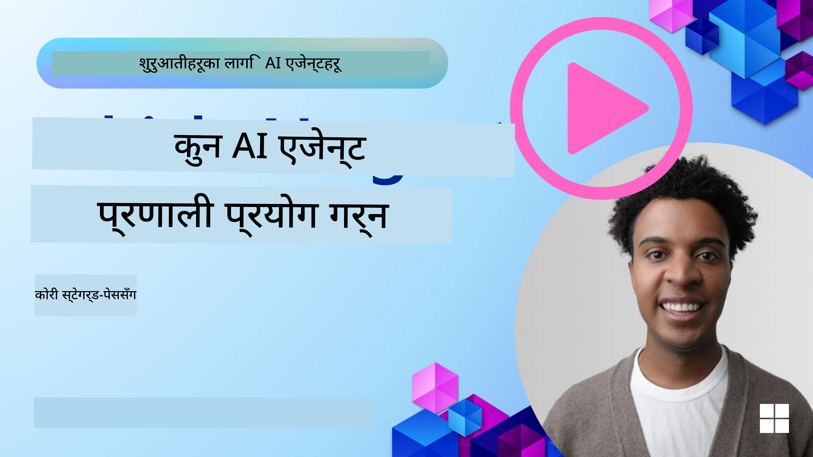

<!--
CO_OP_TRANSLATOR_METADATA:
{
  "original_hash": "7120197753abacc827b64ac2d5d6966f",
  "translation_date": "2025-11-13T11:57:42+00:00",
  "source_file": "02-explore-agentic-frameworks/README.md",
  "language_code": "ne"
}
-->
[](https://youtu.be/ODwF-EZo_O8?si=1xoy_B9RNQfrYdF7)

> _(माथिको तस्बिरमा क्लिक गरेर यस पाठको भिडियो हेर्नुहोस्)_

# AI एजेन्ट फ्रेमवर्क्स अन्वेषण गर्नुहोस्

AI एजेन्ट फ्रेमवर्क्स भनेको AI एजेन्टहरू निर्माण, तैनाती, र व्यवस्थापनलाई सरल बनाउन डिजाइन गरिएका सफ्टवेयर प्लेटफर्महरू हुन्। यी फ्रेमवर्कहरूले विकासकर्ताहरूलाई पूर्व-निर्मित कम्पोनेन्टहरू, एब्स्ट्र्याक्सनहरू, र उपकरणहरू प्रदान गर्छन् जसले जटिल AI प्रणालीहरूको विकासलाई सहज बनाउँछ।

यी फ्रेमवर्कहरूले AI एजेन्ट विकासमा सामान्य चुनौतीहरूको लागि मानकीकृत दृष्टिकोण प्रदान गरेर विकासकर्ताहरूलाई उनीहरूको अनुप्रयोगहरूको अद्वितीय पक्षहरूमा ध्यान केन्द्रित गर्न मद्दत गर्छन्। तिनीहरूले AI प्रणालीहरू निर्माणमा स्केलेबिलिटी, पहुँचयोग्यता, र दक्षता बढाउँछन्।

## परिचय

यस पाठले निम्न विषयहरू समेट्नेछ:

- AI एजेन्ट फ्रेमवर्क्स के हुन् र तिनीहरूले विकासकर्ताहरूलाई के हासिल गर्न सक्षम बनाउँछन्?
- टोलीहरूले कसरी ती फ्रेमवर्कहरू प्रयोग गरेर छिटो प्रोटोटाइप बनाउन, दोहोर्याउन, र एजेन्टको क्षमताहरू सुधार गर्न सक्छन्?
- Microsoft द्वारा सिर्जना गरिएका <a href="https://aka.ms/ai-agents/autogen" target="_blank">AutoGen</a>, <a href="https://aka.ms/ai-agents-beginners/semantic-kernel" target="_blank">Semantic Kernel</a>, र <a href="https://aka.ms/ai-agents-beginners/ai-agent-service" target="_blank">Azure AI Agent Service</a> बीचको भिन्नता के हो?
- के म मेरो विद्यमान Azure इकोसिस्टम उपकरणहरू सिधै एकीकृत गर्न सक्छु, वा मलाई स्वतन्त्र समाधानहरू चाहिन्छ?
- Azure AI Agents सेवा के हो र यसले मलाई कसरी मद्दत गरिरहेको छ?

## सिक्ने लक्ष्यहरू

यस पाठको लक्ष्यहरू तपाईंलाई निम्न कुरा बुझ्न मद्दत गर्नु हो:

- AI विकासमा AI एजेन्ट फ्रेमवर्क्सको भूमिका।
- बुद्धिमान एजेन्टहरू निर्माण गर्न AI एजेन्ट फ्रेमवर्क्सको उपयोग कसरी गर्ने।
- AI एजेन्ट फ्रेमवर्क्सले सक्षम बनाएका प्रमुख क्षमताहरू।
- AutoGen, Semantic Kernel, र Azure AI Agent Service बीचको भिन्नता।

## AI एजेन्ट फ्रेमवर्क्स के हुन् र तिनीहरूले विकासकर्ताहरूलाई के गर्न सक्षम बनाउँछन्?

परम्परागत AI फ्रेमवर्कहरूले तपाईंलाई AI लाई तपाईंको अनुप्रयोगहरूमा एकीकृत गर्न मद्दत गर्न सक्छन् र यी अनुप्रयोगहरूलाई निम्न तरिकामा सुधार गर्न सक्छन्:

- **व्यक्तिगतकरण**: AI ले प्रयोगकर्ताको व्यवहार र प्राथमिकताहरू विश्लेषण गरेर व्यक्तिगत सिफारिसहरू, सामग्री, र अनुभवहरू प्रदान गर्न सक्छ।
उदाहरण: Netflix जस्ता स्ट्रिमिङ सेवाहरूले AI प्रयोग गरेर हेर्ने इतिहासको आधारमा फिल्म र शोहरू सिफारिस गर्छन्, जसले प्रयोगकर्ता संलग्नता र सन्तुष्टि बढाउँछ।
- **स्वचालन र दक्षता**: AI ले दोहोरिने कार्यहरू स्वचालित गर्न, कार्यप्रवाहहरू सरल बनाउन, र सञ्चालन दक्षता सुधार गर्न सक्छ।
उदाहरण: ग्राहक सेवा अनुप्रयोगहरूले सामान्य प्रश्नहरूको सामना गर्न AI-संचालित च्याटबोटहरू प्रयोग गर्छन्, प्रतिक्रिया समय घटाउँछन् र जटिल मुद्दाहरूको लागि मानव एजेन्टहरूलाई स्वतन्त्र बनाउँछन्।
- **प्रयोगकर्ता अनुभव सुधार**: AI ले आवाज पहिचान, प्राकृतिक भाषा प्रशोधन, र भविष्यवाणी पाठ जस्ता बुद्धिमान सुविधाहरू प्रदान गरेर समग्र प्रयोगकर्ता अनुभव सुधार गर्न सक्छ।
उदाहरण: Siri र Google Assistant जस्ता भर्चुअल सहायकहरूले AI प्रयोग गरेर आवाज आदेशहरू बुझ्न र प्रतिक्रिया दिन्छन्, जसले प्रयोगकर्ताहरूलाई उनीहरूको उपकरणहरूसँग अन्तरक्रिया गर्न सजिलो बनाउँछ।

### यो सबै राम्रो सुनिन्छ, त्यसो भए किन हामीलाई AI एजेन्ट फ्रेमवर्क चाहिन्छ?

AI एजेन्ट फ्रेमवर्कहरू केवल AI फ्रेमवर्कहरू भन्दा बढी प्रतिनिधित्व गर्छन्। तिनीहरू बुद्धिमान एजेन्टहरूको निर्माणलाई सक्षम बनाउन डिजाइन गरिएका छन् जसले प्रयोगकर्ताहरू, अन्य एजेन्टहरू, र वातावरणसँग अन्तरक्रिया गर्न सक्छन् र विशिष्ट लक्ष्यहरू प्राप्त गर्न सक्छन्। यी एजेन्टहरूले स्वायत्त व्यवहार देखाउन सक्छन्, निर्णय लिन सक्छन्, र परिवर्तनशील अवस्थाहरूमा अनुकूलन गर्न सक्छन्। आउनुहोस् AI एजेन्ट फ्रेमवर्कहरूले सक्षम बनाएका केही प्रमुख क्षमताहरू हेरौं:

- **एजेन्ट सहयोग र समन्वय**: धेरै AI एजेन्टहरू सिर्जना गर्न सक्षम बनाउनुहोस् जसले एकसाथ काम गर्न, संवाद गर्न, र जटिल कार्यहरू समाधान गर्न समन्वय गर्न सक्छ।
- **कार्य स्वचालन र व्यवस्थापन**: बहु-चरण कार्यप्रवाहहरू स्वचालित गर्न, कार्य प्रतिनिधि गर्न, र एजेन्टहरू बीच गतिशील कार्य व्यवस्थापनको लागि संयन्त्रहरू प्रदान गर्नुहोस्।
- **सन्दर्भात्मक समझ र अनुकूलन**: एजेन्टहरूलाई सन्दर्भ बुझ्न, परिवर्तनशील वातावरणमा अनुकूलन गर्न, र वास्तविक-समय जानकारीको आधारमा निर्णय लिन सक्षम बनाउनुहोस्।

संक्षेपमा भन्नुपर्दा, एजेन्टहरूले तपाईंलाई थप गर्न, स्वचालनलाई अर्को स्तरमा लैजान, र अधिक बुद्धिमान प्रणालीहरू सिर्जना गर्न अनुमति दिन्छन् जसले आफ्नो वातावरणबाट अनुकूलन र सिक्न सक्छ।

## कसरी छिटो प्रोटोटाइप बनाउन, दोहोर्याउन, र एजेन्टको क्षमताहरू सुधार गर्न सकिन्छ?

यो एक छिटो परिवर्तन हुने क्षेत्र हो, तर अधिकांश AI एजेन्ट फ्रेमवर्कहरूमा केही सामान्य कुराहरू छन् जसले तपाईंलाई छिटो प्रोटोटाइप बनाउन र दोहोर्याउन मद्दत गर्न सक्छ, जस्तै मोड्युल कम्पोनेन्टहरू, सहयोगात्मक उपकरणहरू, र वास्तविक-समय सिकाइ। आउनुहोस् यी विषयहरूमा गहिराइमा जाऔं:

- **मोड्युल कम्पोनेन्टहरूको प्रयोग गर्नुहोस्**: AI SDKहरूले पूर्व-निर्मित कम्पोनेन्टहरू जस्तै AI र मेमोरी कनेक्टरहरू, प्राकृतिक भाषा वा कोड प्लगइनहरू प्रयोग गरेर कार्य कलिंग, प्रम्प्ट टेम्प्लेटहरू, र अन्य धेरै प्रदान गर्छन्।
- **सहयोगात्मक उपकरणहरूको उपयोग गर्नुहोस्**: विशिष्ट भूमिकाहरू र कार्यहरू सहित एजेन्टहरू डिजाइन गर्नुहोस्, जसले सहयोगात्मक कार्यप्रवाहहरू परीक्षण र सुधार गर्न सक्षम बनाउँछ।
- **वास्तविक-समयमा सिक्नुहोस्**: प्रतिक्रिया लूपहरू कार्यान्वयन गर्नुहोस् जहाँ एजेन्टहरूले अन्तरक्रियाबाट सिक्छन् र गतिशील रूपमा आफ्नो व्यवहार समायोजन गर्छन्।

### मोड्युल कम्पोनेन्टहरूको प्रयोग गर्नुहोस्

Microsoft Semantic Kernel र LangChain जस्ता SDKहरूले पूर्व-निर्मित कम्पोनेन्टहरू जस्तै AI कनेक्टरहरू, प्रम्प्ट टेम्प्लेटहरू, र मेमोरी व्यवस्थापन प्रदान गर्छन्।

**टोलीहरूले कसरी प्रयोग गर्न सक्छन्**: टोलीहरूले यी कम्पोनेन्टहरू छिटो कार्यात्मक प्रोटोटाइप बनाउनको लागि एकत्रित गर्न सक्छन्, जसले स्क्र्याचबाट सुरु नगरी छिटो प्रयोग र दोहोर्याउन अनुमति दिन्छ।

**व्यवहारमा यो कसरी काम गर्छ**: तपाईंले प्रयोगकर्ता इनपुटबाट जानकारी निकाल्न पूर्व-निर्मित पार्सर, डेटा भण्डारण र पुनःप्राप्त गर्न मेमोरी मोड्युल, र प्रयोगकर्ताहरूसँग अन्तरक्रिया गर्न प्रम्प्ट जनरेटर प्रयोग गर्न सक्नुहुन्छ, यी कम्पोनेन्टहरू स्क्र्याचबाट निर्माण नगरी।

**उदाहरण कोड**। आउनुहोस् Semantic Kernel Python र .Net को साथ पूर्व-निर्मित AI कनेक्टर प्रयोग गरेर मोडेललाई प्रयोगकर्ता इनपुटमा प्रतिक्रिया दिन कसरी प्रयोग गर्न सकिन्छ भन्ने उदाहरण हेरौं:

``` python
# Semantic Kernel Python Example

import asyncio
from typing import Annotated

from semantic_kernel.connectors.ai import FunctionChoiceBehavior
from semantic_kernel.connectors.ai.open_ai import AzureChatCompletion, AzureChatPromptExecutionSettings
from semantic_kernel.contents import ChatHistory
from semantic_kernel.functions import kernel_function
from semantic_kernel.kernel import Kernel

# Define a ChatHistory object to hold the conversation's context
chat_history = ChatHistory()
chat_history.add_user_message("I'd like to go to New York on January 1, 2025")


# Define a sample plugin that contains the function to book travel
class BookTravelPlugin:
    """A Sample Book Travel Plugin"""

    @kernel_function(name="book_flight", description="Book travel given location and date")
    async def book_flight(
        self, date: Annotated[str, "The date of travel"], location: Annotated[str, "The location to travel to"]
    ) -> str:
        return f"Travel was booked to {location} on {date}"

# Create the Kernel
kernel = Kernel()

# Add the sample plugin to the Kernel object
kernel.add_plugin(BookTravelPlugin(), plugin_name="book_travel")

# Define the Azure OpenAI AI Connector
chat_service = AzureChatCompletion(
    deployment_name="YOUR_DEPLOYMENT_NAME", 
    api_key="YOUR_API_KEY", 
    endpoint="https://<your-resource>.azure.openai.com/",
)

# Define the request settings to configure the model with auto-function calling
request_settings = AzureChatPromptExecutionSettings(function_choice_behavior=FunctionChoiceBehavior.Auto())


async def main():
    # Make the request to the model for the given chat history and request settings
    # The Kernel contains the sample that the model will request to invoke
    response = await chat_service.get_chat_message_content(
        chat_history=chat_history, settings=request_settings, kernel=kernel
    )
    assert response is not None

    """
    Note: In the auto function calling process, the model determines it can invoke the 
    `BookTravelPlugin` using the `book_flight` function, supplying the necessary arguments. 
    
    For example:

    "tool_calls": [
        {
            "id": "call_abc123",
            "type": "function",
            "function": {
                "name": "BookTravelPlugin-book_flight",
                "arguments": "{'location': 'New York', 'date': '2025-01-01'}"
            }
        }
    ]

    Since the location and date arguments are required (as defined by the kernel function), if the 
    model lacks either, it will prompt the user to provide them. For instance:

    User: Book me a flight to New York.
    Model: Sure, I'd love to help you book a flight. Could you please specify the date?
    User: I want to travel on January 1, 2025.
    Model: Your flight to New York on January 1, 2025, has been successfully booked. Safe travels!
    """

    print(f"`{response}`")
    # Example AI Model Response: `Your flight to New York on January 1, 2025, has been successfully booked. Safe travels! ✈️🗽`

    # Add the model's response to our chat history context
    chat_history.add_assistant_message(response.content)


if __name__ == "__main__":
    asyncio.run(main())
```
```csharp
// Semantic Kernel C# example

using Microsoft.SemanticKernel;
using Microsoft.SemanticKernel.ChatCompletion;
using System.ComponentModel;
using Microsoft.SemanticKernel.Connectors.AzureOpenAI;

ChatHistory chatHistory = [];
chatHistory.AddUserMessage("I'd like to go to New York on January 1, 2025");

var kernelBuilder = Kernel.CreateBuilder();
kernelBuilder.AddAzureOpenAIChatCompletion(
    deploymentName: "NAME_OF_YOUR_DEPLOYMENT",
    apiKey: "YOUR_API_KEY",
    endpoint: "YOUR_AZURE_ENDPOINT"
);
kernelBuilder.Plugins.AddFromType<BookTravelPlugin>("BookTravel"); 
var kernel = kernelBuilder.Build();

var settings = new AzureOpenAIPromptExecutionSettings()
{
    FunctionChoiceBehavior = FunctionChoiceBehavior.Auto()
};

var chatCompletion = kernel.GetRequiredService<IChatCompletionService>();

var response = await chatCompletion.GetChatMessageContentAsync(chatHistory, settings, kernel);

/*
Behind the scenes, the model recognizes the tool to call, what arguments it already has (location) and (date)
{

"tool_calls": [
    {
        "id": "call_abc123",
        "type": "function",
        "function": {
            "name": "BookTravelPlugin-book_flight",
            "arguments": "{'location': 'New York', 'date': '2025-01-01'}"
        }
    }
]
*/

Console.WriteLine(response.Content);
chatHistory.AddMessage(response!.Role, response!.Content!);

// Example AI Model Response: Your flight to New York on January 1, 2025, has been successfully booked. Safe travels! ✈️🗽

// Define a plugin that contains the function to book travel
public class BookTravelPlugin
{
    [KernelFunction("book_flight")]
    [Description("Book travel given location and date")]
    public async Task<string> BookFlight(DateTime date, string location)
    {
        return await Task.FromResult( $"Travel was booked to {location} on {date}");
    }
}
```

यस उदाहरणबाट तपाईंले देख्न सक्नुहुन्छ कि कसरी पूर्व-निर्मित पार्सर प्रयोग गरेर प्रयोगकर्ता इनपुटबाट प्रमुख जानकारी निकाल्न सकिन्छ, जस्तै उडान बुकिङ अनुरोधको उत्पत्ति, गन्तव्य, र मिति। यो मोड्युल दृष्टिकोणले तपाईंलाई उच्च-स्तरीय तर्कमा ध्यान केन्द्रित गर्न अनुमति दिन्छ।

### सहयोगात्मक उपकरणहरूको उपयोग गर्नुहोस्

CrewAI, Microsoft AutoGen, र Semantic Kernel जस्ता फ्रेमवर्कहरूले धेरै एजेन्टहरू सिर्जना गर्न सुविधा प्रदान गर्छन् जसले एकसाथ काम गर्न सक्छन्।

**टोलीहरूले कसरी प्रयोग गर्न सक्छन्**: टोलीहरूले विशिष्ट भूमिकाहरू र कार्यहरू सहित एजेन्टहरू डिजाइन गर्न सक्छन्, जसले सहयोगात्मक कार्यप्रवाहहरू परीक्षण र सुधार गर्न सक्षम बनाउँछ र समग्र प्रणाली दक्षता सुधार गर्छ।

**व्यवहारमा यो कसरी काम गर्छ**: तपाईंले एजेन्टहरूको टोली सिर्जना गर्न सक्नुहुन्छ जहाँ प्रत्येक एजेन्टसँग डेटा पुनःप्राप्ति, विश्लेषण, वा निर्णय-निर्माण जस्ता विशेष कार्यहरू छन्। यी एजेन्टहरूले जानकारी साझा गर्न र प्रयोगकर्ता प्रश्नको उत्तर दिन वा कार्य पूरा गर्न जस्ता सामान्य लक्ष्य प्राप्त गर्न संवाद गर्न सक्छन्।

**उदाहरण कोड (AutoGen)**:

```python
# creating agents, then create a round robin schedule where they can work together, in this case in order

# Data Retrieval Agent
# Data Analysis Agent
# Decision Making Agent

agent_retrieve = AssistantAgent(
    name="dataretrieval",
    model_client=model_client,
    tools=[retrieve_tool],
    system_message="Use tools to solve tasks."
)

agent_analyze = AssistantAgent(
    name="dataanalysis",
    model_client=model_client,
    tools=[analyze_tool],
    system_message="Use tools to solve tasks."
)

# conversation ends when user says "APPROVE"
termination = TextMentionTermination("APPROVE")

user_proxy = UserProxyAgent("user_proxy", input_func=input)

team = RoundRobinGroupChat([agent_retrieve, agent_analyze, user_proxy], termination_condition=termination)

stream = team.run_stream(task="Analyze data", max_turns=10)
# Use asyncio.run(...) when running in a script.
await Console(stream)
```

पछिल्लो कोडमा तपाईंले देख्न सक्नुहुन्छ कि कसरी तपाईंले डेटा विश्लेषणमा संलग्न धेरै एजेन्टहरू समावेश गर्ने कार्य सिर्जना गर्न सक्नुहुन्छ। प्रत्येक एजेन्टले विशिष्ट कार्य गर्दछ, र कार्य एजेन्टहरूलाई समन्वय गरेर इच्छित परिणाम प्राप्त गर्न कार्यान्वयन गरिन्छ। विशेष भूमिकाहरू भएका समर्पित एजेन्टहरू सिर्जना गरेर, तपाईं कार्य दक्षता र प्रदर्शन सुधार गर्न सक्नुहुन्छ।

### वास्तविक-समयमा सिक्नुहोस्

उन्नत फ्रेमवर्कहरूले वास्तविक-समय सन्दर्भ समझ र अनुकूलनको लागि क्षमताहरू प्रदान गर्छन्।

**टोलीहरूले कसरी प्रयोग गर्न सक्छन्**: टोलीहरूले प्रतिक्रिया लूपहरू कार्यान्वयन गर्न सक्छन् जहाँ एजेन्टहरूले अन्तरक्रियाबाट सिक्छन् र गतिशील रूपमा आफ्नो व्यवहार समायोजन गर्छन्, जसले क्षमताहरूको निरन्तर सुधार र परिष्कृततामा योगदान पुर्‍याउँछ।

**व्यवहारमा यो कसरी काम गर्छ**: एजेन्टहरूले प्रयोगकर्ता प्रतिक्रिया, वातावरणीय डेटा, र कार्य परिणामहरू विश्लेषण गर्न सक्छन् ताकि उनीहरूको ज्ञान आधार अद्यावधिक गर्न, निर्णय-निर्माण एल्गोरिदम समायोजन गर्न, र समयसँगै प्रदर्शन सुधार गर्न सकून्। यो दोहोरिने सिकाइ प्रक्रियाले एजेन्टहरूलाई परिवर्तनशील अवस्थाहरू र प्रयोगकर्ता प्राथमिकताहरूमा अनुकूलन गर्न सक्षम बनाउँछ, समग्र प्रणाली प्रभावकारिता बढाउँछ।

## AutoGen, Semantic Kernel र Azure AI Agent Service बीचको भिन्नता के हो?

यी फ्रेमवर्कहरूको तुलना गर्न धेरै तरिकाहरू छन्, तर आउनुहोस् तिनीहरूको डिजाइन, क्षमताहरू, र लक्षित प्रयोग केसहरूको सन्दर्भमा केही प्रमुख भिन्नताहरू हेरौं:

## AutoGen

AutoGen Microsoft Research को AI Frontiers Lab द्वारा विकसित एक ओपन-सोर्स फ्रेमवर्क हो। यसले इभेन्ट-ड्राइभन, वितरित *agentic* अनुप्रयोगहरूमा ध्यान केन्द्रित गर्दछ, जसले धेरै LLMs र SLMs, उपकरणहरू, र उन्नत बहु-एजेन्ट डिजाइन ढाँचाहरू सक्षम बनाउँछ।

AutoGen एजेन्टहरूको कोर अवधारणामा आधारित छ, जुन स्वायत्त इकाइहरू हुन् जसले आफ्नो वातावरण बुझ्न सक्छन्, निर्णय लिन सक्छन्, र विशिष्ट लक्ष्यहरू प्राप्त गर्न कार्य गर्न सक्छन्। एजेन्टहरूले एसिंक्रोनस सन्देशहरूको माध्यमबाट संवाद गर्छन्, जसले तिनीहरूलाई स्वतन्त्र रूपमा र समानान्तरमा काम गर्न अनुमति दिन्छ, प्रणाली स्केलेबिलिटी र प्रतिक्रियाशीलता बढाउँछ।

<a href="https://en.wikipedia.org/wiki/Actor_model" target="_blank">एजेन्टहरू अभिनेता मोडेलमा आधारित छन्</a>। विकिपेडियाका अनुसार, अभिनेता _समानान्तर गणनाको आधारभूत निर्माण खण्ड हो। यसले प्राप्त गरेको सन्देशको प्रतिक्रिया स्वरूप, एक अभिनेता: स्थानीय निर्णय लिन सक्छ, थप अभिनेता सिर्जना गर्न सक्छ, थप सन्देशहरू पठाउन सक्छ, र प्राप्त हुने अर्को सन्देशको प्रतिक्रिया कसरी दिने भनेर निर्धारण गर्न सक्छ_।

**प्रयोग केसहरू**: कोड उत्पादन स्वचालन, डेटा विश्लेषण कार्यहरू, र योजना र अनुसन्धान कार्यहरूको लागि अनुकूलित एजेन्टहरू निर्माण।

यहाँ AutoGen का केही महत्त्वपूर्ण कोर अवधारणाहरू छन्:

- **एजेन्टहरू**। एक एजेन्ट भनेको सफ्टवेयर इकाई हो जसले:
  - **सन्देशहरूको माध्यमबाट संवाद गर्छ**, यी सन्देशहरू समकालिक वा असमकालिक हुन सक्छन्।
  - **आफ्नो राज्य कायम राख्छ**, जुन आउने सन्देशहरूद्वारा संशोधित गर्न सकिन्छ।
  - **कार्यहरू प्रदर्शन गर्छ** प्राप्त सन्देशहरू वा यसको राज्यमा परिवर्तनहरूको प्रतिक्रिया स्वरूप। यी कार्यहरूले एजेन्टको राज्यलाई संशोधित गर्न सक्छन् र बाह्य प्रभावहरू उत्पादन गर्न सक्छन्, जस्तै सन्देश लगहरू अद्यावधिक गर्नु, नयाँ सन्देशहरू पठाउनु, कोड कार्यान्वयन गर्नु, वा API कलहरू गर्नु।

  यहाँ तपाईंले च्याट क्षमताहरू भएको आफ्नो एजेन्ट सिर्जना गर्ने छोटो कोड स्निपेट पाउनुहुन्छ:

    ```python
    from autogen_agentchat.agents import AssistantAgent
    from autogen_agentchat.messages import TextMessage
    from autogen_ext.models.openai import OpenAIChatCompletionClient


    class MyAgent(RoutedAgent):
        def __init__(self, name: str) -> None:
            super().__init__(name)
            model_client = OpenAIChatCompletionClient(model="gpt-4o")
            self._delegate = AssistantAgent(name, model_client=model_client)
    
        @message_handler
        async def handle_my_message_type(self, message: MyMessageType, ctx: MessageContext) -> None:
            print(f"{self.id.type} received message: {message.content}")
            response = await self._delegate.on_messages(
                [TextMessage(content=message.content, source="user")], ctx.cancellation_token
            )
            print(f"{self.id.type} responded: {response.chat_message.content}")
    ```
    
    पछिल्लो कोडमा, `MyAgent` सिर्जना गरिएको छ र `RoutedAgent` बाट उत्तराधिकार लिन्छ। यसमा सन्देशको सामग्री प्रिन्ट गर्ने सन्देश ह्यान्डलर छ र त्यसपछि `AssistantAgent` प्रतिनिधि प्रयोग गरेर प्रतिक्रिया पठाउँछ। विशेष रूपमा ध्यान दिनुहोस् कि हामीले `self._delegate` लाई `AssistantAgent` को एक उदाहरण असाइन गर्छौं जुन च्याट कम्प्लिशनहरू ह्यान्डल गर्न सक्ने पूर्व-निर्मित एजेन्ट हो।

    आउनुहोस् AutoGen लाई यस एजेन्ट प्रकारको बारेमा जानकारी गराऔं र कार्यक्रम सुरु गरौं:

    ```python
    
    # main.py
    runtime = SingleThreadedAgentRuntime()
    await MyAgent.register(runtime, "my_agent", lambda: MyAgent())

    runtime.start()  # Start processing messages in the background.
    await runtime.send_message(MyMessageType("Hello, World!"), AgentId("my_agent", "default"))
    ```

    पछिल्लो कोडमा एजेन्टहरू रनटाइमसँग दर्ता गरिएका छन् र त्यसपछि एजेन्टलाई सन्देश पठाइन्छ जसको परिणामस्वरूप निम्न आउटपुट प्राप्त हुन्छ:

    ```text
    # Output from the console:
    my_agent received message: Hello, World!
    my_assistant received message: Hello, World!
    my_assistant responded: Hello! How can I assist you today?
    ```

- **बहु एजेन्टहरू**। AutoGen ले धेरै एजेन्टहरू सिर्जना गर्न समर्थन गर्दछ जसले जटिल कार्यहरू प्राप्त गर्न एकसाथ काम गर्न सक्छ। एजेन्टहरूले संवाद गर्न, जानकारी साझा गर्न, र समस्याहरू अधिक कुशलतापूर्वक समाधान गर्न आफ्नो कार्यहरू समन्वय गर्न सक्छन्। बहु-एजेन्ट प्रणाली सिर्जना गर्न, तपाईंले डेटा पुनःप्राप्ति, विश्लेषण, निर्णय-निर्माण, र प्रयोगकर्ता अन्तरक्रिया जस्ता विशेष कार्यहरू र भूमिकाहरू भएका विभिन्न प्रकारका एजेन्टहरू परिभाषित गर्न सक्नुहुन्छ। आउनुहोस् यस्तो सिर्जना कस्तो देखिन्छ भनेर हेरौं:

    ```python
    editor_description = "Editor for planning and reviewing the content."

    # Example of declaring an Agent
    editor_agent_type = await EditorAgent.register(
    runtime,
    editor_topic_type,  # Using topic type as the agent type.
    lambda: EditorAgent(
        description=editor_description,
        group_chat_topic_type=group_chat_topic_type,
        model_client=OpenAIChatCompletionClient(
            model="gpt-4o-2024-08-06",
            # api_key="YOUR_API_KEY",
        ),
        ),
    )

    # remaining declarations shortened for brevity

    # Group chat
    group_chat_manager_type = await GroupChatManager.register(
    runtime,
    "group_chat_manager",
    lambda: GroupChatManager(
        participant_topic_types=[writer_topic_type, illustrator_topic_type, editor_topic_type, user_topic_type],
        model_client=OpenAIChatCompletionClient(
            model="gpt-4o-2024-08-06",
            # api_key="YOUR_API_KEY",
        ),
        participant_descriptions=[
            writer_description, 
            illustrator_description, 
            editor_description, 
            user_description
        ],
        ),
    )
    ```

    पछिल्लो कोडमा हामीसँग `GroupChatManager` छ जुन रनटाइमसँग दर्ता गरिएको छ। यो प्रबन्धक विभिन्न प्रकारका एजेन्टहरू, जस्तै लेखकहरू, चित्रकारहरू, सम्पादकहरू, र प्रयोगकर्ताहरू बीचको अन्तरक्रियालाई समन्वय गर्न जिम्मेवार छ।

- **एजेन्ट रनटाइम**। फ्रेमवर्कले रनटाइम वातावरण प्रदान गर्दछ, एजेन्टहरू बीचको संवाद सक्षम बनाउँछ, तिनीहरूको पहिचान र जीवनचक्र व्यवस्थापन गर्दछ, र सुरक्षा र गोपनीयता सीमाहरू लागू गर्दछ। यसको मतलब तपाईंले आफ्नो एजेन्टहरूलाई सुरक्षित र नियन्त्रण गरिएको वातावरणमा चलाउन सक्नुहुन्छ, सुनिश्चित गर्दै कि तिनीहरू सुरक्षित र कुशलतापूर्वक अन्तरक्रिया गर्न सक्छन्। यहाँ दुई रुचिकर रनटाइमहरू छन्:
  - **स्ट्यान्ड-अलोन रनटाइम**। यो एकल-प्रक्रिया अनुप्रयोगहरूको लागि राम्रो विकल्प हो जहाँ सबै एजेन्टहरू एउटै प्रोग्रामिङ भाषामा कार्यान्वित गरिएका छन् र एउटै प्रक्रियामा चल्छन्। यहाँ यसको काम गर्ने तरिकाको चित्रण छ:
  
    <a href="https://microsoft.github.io/autogen/stable/_images/architecture-standalone.svg" target="_blank">स्ट्यान्ड-अलोन रनटाइम</a>   
अनुप्रयोग स्ट्याक

    *एजेन्टहरूले रनटाइम मार्फत सन्देशहरूको माध्यमबाट संवाद गर्छन्, र रनटाइमले एजेन्टहरूको जीवनचक्र व्यवस्थापन गर्छ*

  - **वितरित एजेन्ट रनटाइम**, बहु-प्रक्रिया अनुप्रयोगहरूको लागि उपयुक्त छ जहाँ एजेन्टहरू विभिन्न प्रोग्रामिङ भाषाहरूमा कार्यान्वित गरिएका हुन सक्छन् र विभिन्न मेसिनहरूमा चलिरहेका छन्। यहाँ यसको काम गर्ने तरिकाको चित्रण छ:
  
    <a href="https://microsoft.github.io/autogen/stable/_images/architecture-distributed.svg" target="_blank">वितरित रनटाइम</a>

## Semantic Kernel + एजेन्ट फ्रेमवर्क

Semantic Kernel एक उद्यम-तयार AI Orchestration SDK हो। यसमा AI र मेमोरी कनेक्टरहरू, साथै एक एजेन्ट फ्रेमवर्क समावेश छ।

पहिले केही कोर कम्पोनेन्टहरू कभर गरौं:

- **AI कनेक्टरहरू**: यो बाह्य AI सेवाहरू र डेटा स्रोतहरूसँग अन्तरफलक हो जसलाई Python र C# मा प्रयोग गर्न सकिन्छ।

  ```python
  # Semantic Kernel Python
  from semantic_kernel.connectors.ai.open_ai import AzureChatCompletion
  from semantic_kernel.kernel import Kernel

  kernel = Kernel()
  kernel.add_service(
    AzureChatCompletion(
        deployment_name="your-deployment-name",
        api_key="your-api-key",
        endpoint="your-endpoint",
    )
  )
  ```  

    ```csharp
    // Semantic Kernel C#
    using Microsoft.SemanticKernel;

    // Create kernel
    var builder = Kernel.CreateBuilder();
    
    // Add a chat completion service:
    builder.Services.AddAzureOpenAIChatCompletion(
        "your-resource-name",
        "your-endpoint",
        "your-resource-key",
        "deployment-model");
    var kernel = builder.Build();
    ```

    यहाँ तपाईंले देख्न सक्नुहुन्छ कि कसरी तपाईंले कर्नेल सिर्जना गर्न सक्नुहुन्छ र च्याट कम्प्लिशन सेवा थप्न सक्नुहुन्छ। Semantic Kernel ले बाह्य AI सेवासँग जडान सिर्जना गर्छ, यस अवस्थामा Azure OpenAI Chat Completion।

- **प
यी तथ्यहरू त्यसपछि मेमोरी संग्रह `SummarizedAzureDocs` मा भण्डारण गरिन्छ। यो धेरै सरल उदाहरण हो, तर तपाईंले कसरी LLM को लागि जानकारी मेमोरीमा भण्डारण गर्न सकिन्छ भन्ने देख्न सक्नुहुन्छ।

त्यसोभए, यो Semantic Kernel फ्रेमवर्कको आधारभूत कुरा हो, तर Agent Framework के हो?

## Azure AI Agent सेवा

Azure AI Agent सेवा हालै थपिएको सुविधा हो, जुन Microsoft Ignite 2024 मा प्रस्तुत गरिएको थियो। यसले AI एजेन्टहरू विकास र तैनाथ गर्न थप लचिलो मोडेलहरू प्रदान गर्दछ, जस्तै Llama 3, Mistral, र Cohere जस्ता ओपन-सोर्स LLM हरूलाई प्रत्यक्ष रूपमा कल गर्न।

Azure AI Agent सेवा बलियो उद्यम सुरक्षा संयन्त्रहरू र डाटा भण्डारण विधिहरू प्रदान गर्दछ, जसले यसलाई उद्यम अनुप्रयोगहरूको लागि उपयुक्त बनाउँछ।

यो AutoGen र Semantic Kernel जस्ता बहु-एजेन्ट समन्वय फ्रेमवर्कहरूसँग सहज रूपमा काम गर्दछ।

यो सेवा हाल सार्वजनिक पूर्वावलोकनमा छ र एजेन्ट निर्माणका लागि Python र C# समर्थन गर्दछ।

Semantic Kernel Python प्रयोग गरेर, हामी प्रयोगकर्ताद्वारा परिभाषित प्लगइनको साथ Azure AI Agent बनाउन सक्छौं:

```python
import asyncio
from typing import Annotated

from azure.identity.aio import DefaultAzureCredential

from semantic_kernel.agents import AzureAIAgent, AzureAIAgentSettings, AzureAIAgentThread
from semantic_kernel.contents import ChatMessageContent
from semantic_kernel.contents import AuthorRole
from semantic_kernel.functions import kernel_function


# Define a sample plugin for the sample
class MenuPlugin:
    """A sample Menu Plugin used for the concept sample."""

    @kernel_function(description="Provides a list of specials from the menu.")
    def get_specials(self) -> Annotated[str, "Returns the specials from the menu."]:
        return """
        Special Soup: Clam Chowder
        Special Salad: Cobb Salad
        Special Drink: Chai Tea
        """

    @kernel_function(description="Provides the price of the requested menu item.")
    def get_item_price(
        self, menu_item: Annotated[str, "The name of the menu item."]
    ) -> Annotated[str, "Returns the price of the menu item."]:
        return "$9.99"


async def main() -> None:
    ai_agent_settings = AzureAIAgentSettings.create()

    async with (
        DefaultAzureCredential() as creds,
        AzureAIAgent.create_client(
            credential=creds,
            conn_str=ai_agent_settings.project_connection_string.get_secret_value(),
        ) as client,
    ):
        # Create agent definition
        agent_definition = await client.agents.create_agent(
            model=ai_agent_settings.model_deployment_name,
            name="Host",
            instructions="Answer questions about the menu.",
        )

        # Create the AzureAI Agent using the defined client and agent definition
        agent = AzureAIAgent(
            client=client,
            definition=agent_definition,
            plugins=[MenuPlugin()],
        )

        # Create a thread to hold the conversation
        # If no thread is provided, a new thread will be
        # created and returned with the initial response
        thread: AzureAIAgentThread | None = None

        user_inputs = [
            "Hello",
            "What is the special soup?",
            "How much does that cost?",
            "Thank you",
        ]

        try:
            for user_input in user_inputs:
                print(f"# User: '{user_input}'")
                # Invoke the agent for the specified thread
                response = await agent.get_response(
                    messages=user_input,
                    thread_id=thread,
                )
                print(f"# {response.name}: {response.content}")
                thread = response.thread
        finally:
            await thread.delete() if thread else None
            await client.agents.delete_agent(agent.id)


if __name__ == "__main__":
    asyncio.run(main())
```

### मुख्य अवधारणाहरू

Azure AI Agent सेवामा निम्न मुख्य अवधारणाहरू छन्:

- **एजेन्ट**। Azure AI Agent सेवा Azure AI Foundry सँग एकीकृत छ। AI Foundry भित्र, AI एजेन्ट "स्मार्ट" माइक्रोसर्भिसको रूपमा कार्य गर्दछ जसले प्रश्नहरूको उत्तर दिन (RAG), कार्यहरू गर्न, वा पूर्ण रूपमा कार्यप्रवाह स्वचालित गर्न प्रयोग गर्न सकिन्छ। यसले जेनेरेटिभ AI मोडेलहरूको शक्ति र वास्तविक-विश्व डाटा स्रोतहरूसँग पहुँच र अन्तरक्रिया गर्न उपकरणहरूको संयोजन गरेर यो हासिल गर्दछ। यहाँ एउटा एजेन्टको उदाहरण छ:

    ```python
    agent = project_client.agents.create_agent(
        model="gpt-4o-mini",
        name="my-agent",
        instructions="You are helpful agent",
        tools=code_interpreter.definitions,
        tool_resources=code_interpreter.resources,
    )
    ```

    यस उदाहरणमा, `gpt-4o-mini` मोडेल, `my-agent` नाम, र निर्देशनहरू `You are helpful agent` को साथ एजेन्ट सिर्जना गरिएको छ। एजेन्टलाई कोड व्याख्या कार्यहरू गर्न उपकरण र स्रोतहरू प्रदान गरिएको छ।

- **थ्रेड र सन्देशहरू**। थ्रेड अर्को महत्त्वपूर्ण अवधारणा हो। यसले एजेन्ट र प्रयोगकर्ताबीचको कुराकानी वा अन्तरक्रियालाई प्रतिनिधित्व गर्दछ। थ्रेडहरू कुराकानीको प्रगति ट्र्याक गर्न, सन्दर्भ जानकारी भण्डारण गर्न, र अन्तरक्रियाको अवस्थालाई व्यवस्थापन गर्न प्रयोग गर्न सकिन्छ। यहाँ थ्रेडको एउटा उदाहरण छ:

    ```python
    thread = project_client.agents.create_thread()
    message = project_client.agents.create_message(
        thread_id=thread.id,
        role="user",
        content="Could you please create a bar chart for the operating profit using the following data and provide the file to me? Company A: $1.2 million, Company B: $2.5 million, Company C: $3.0 million, Company D: $1.8 million",
    )
    
    # Ask the agent to perform work on the thread
    run = project_client.agents.create_and_process_run(thread_id=thread.id, agent_id=agent.id)
    
    # Fetch and log all messages to see the agent's response
    messages = project_client.agents.list_messages(thread_id=thread.id)
    print(f"Messages: {messages}")
    ```

    अघिल्लो कोडमा, एउटा थ्रेड सिर्जना गरिएको छ। त्यसपछि, थ्रेडमा सन्देश पठाइन्छ। `create_and_process_run` कल गरेर, एजेन्टलाई थ्रेडमा काम गर्न सोधिएको छ। अन्ततः, सन्देशहरू फेच गरिन्छ र एजेन्टको प्रतिक्रिया हेर्न लग गरिन्छ। सन्देशहरूले प्रयोगकर्ता र एजेन्टबीचको कुराकानीको प्रगति संकेत गर्दछ। यो पनि महत्त्वपूर्ण छ कि सन्देशहरू विभिन्न प्रकारका हुन सक्छन् जस्तै पाठ, छवि, वा फाइल, जसको परिणामस्वरूप एजेन्टको कामले उदाहरणका लागि छवि वा पाठ प्रतिक्रिया उत्पादन गरेको छ। विकासकर्ताको रूपमा, तपाईंले यो जानकारीलाई थप प्रक्रिया गर्न वा प्रयोगकर्तालाई प्रस्तुत गर्न प्रयोग गर्न सक्नुहुन्छ।

- **अन्य AI फ्रेमवर्कहरूसँग एकीकृत हुन्छ**। Azure AI Agent सेवा AutoGen र Semantic Kernel जस्ता अन्य फ्रेमवर्कहरूसँग अन्तरक्रिया गर्न सक्छ, जसको अर्थ तपाईं आफ्नो अनुप्रयोगको केही भाग यी फ्रेमवर्कहरूमध्ये कुनै एकमा निर्माण गर्न सक्नुहुन्छ र उदाहरणका लागि Agent सेवालाई समन्वयकको रूपमा प्रयोग गर्न सक्नुहुन्छ वा तपाईं सबै कुरा Agent सेवामा निर्माण गर्न सक्नुहुन्छ।

**प्रयोगका केसहरू**: Azure AI Agent सेवा सुरक्षित, स्केलेबल, र लचिलो AI एजेन्ट तैनाथी आवश्यक पर्ने उद्यम अनुप्रयोगहरूको लागि डिजाइन गरिएको हो।

## यी फ्रेमवर्कहरू बीच के फरक छ?

यो सुन्दा यी फ्रेमवर्कहरू बीच धेरै समानता छ जस्तो लाग्छ, तर तिनीहरूको डिजाइन, क्षमताहरू, र लक्षित प्रयोगका केसहरूको सन्दर्भमा केही प्रमुख भिन्नताहरू छन्:

- **AutoGen**: यो बहु-एजेन्ट प्रणालीहरूको अग्रणी अनुसन्धानमा केन्द्रित प्रयोग फ्रेमवर्क हो। यो जटिल बहु-एजेन्ट प्रणालीहरूको प्रोटोटाइप र प्रयोग गर्न उत्तम स्थान हो।
- **Semantic Kernel**: यो उद्यम एजेन्टिक अनुप्रयोगहरू निर्माणका लागि उत्पादन-तयार एजेन्ट पुस्तकालय हो। यो घटनाचालित, वितरित एजेन्टिक अनुप्रयोगहरूमा केन्द्रित छ, जसले बहु LLMs र SLMs, उपकरणहरू, र एकल/बहु-एजेन्ट डिजाइन ढाँचाहरू सक्षम गर्दछ।
- **Azure AI Agent सेवा**: यो Azure Foundry मा एजेन्टहरूको लागि प्लेटफर्म र तैनाथी सेवा हो। यसले Azure OpenAI, Azure AI Search, Bing Search र कोड कार्यान्वयन जस्ता Azure Found द्वारा समर्थित सेवाहरूमा कनेक्टिभिटी निर्माण गर्न प्रस्ताव गर्दछ।

अझै पनि कुन छनोट गर्ने भन्नेमा निश्चित छैन?

### प्रयोगका केसहरू

आउनुहोस्, केही सामान्य प्रयोगका केसहरू हेरेर तपाईंलाई मद्दत गर्ने प्रयास गरौं:

> प्रश्न: म प्रयोग गर्दैछु, सिक्दैछु र प्रमाण-को-धारणा एजेन्ट अनुप्रयोगहरू निर्माण गर्दैछु, र म छिटो निर्माण र प्रयोग गर्न सक्षम हुन चाहन्छु
>

>उत्तर: AutoGen यस परिदृश्यको लागि राम्रो विकल्प हुनेछ, किनभने यो घटनाचालित, वितरित एजेन्टिक अनुप्रयोगहरूमा केन्द्रित छ र उन्नत बहु-एजेन्ट डिजाइन ढाँचाहरूलाई समर्थन गर्दछ।

> प्रश्न: यस प्रयोगका केसको लागि Semantic Kernel र Azure AI Agent सेवाभन्दा AutoGen किन राम्रो विकल्प हो?
>
> उत्तर: AutoGen विशेष रूपमा घटनाचालित, वितरित एजेन्टिक अनुप्रयोगहरूको लागि डिजाइन गरिएको हो, जसले यसलाई कोड उत्पादन र डाटा विश्लेषण कार्यहरू स्वचालित गर्न उपयुक्त बनाउँछ। यसले जटिल बहु-एजेन्ट प्रणालीहरू कुशलतापूर्वक निर्माण गर्न आवश्यक उपकरण र क्षमताहरू प्रदान गर्दछ।

>प्रश्न: Azure AI Agent सेवा पनि यहाँ काम गर्न सक्छ जस्तो लाग्छ, यसमा कोड उत्पादन र थपका लागि उपकरणहरू छन्?
>
> उत्तर: हो, Azure AI Agent सेवा एजेन्टहरूको लागि प्लेटफर्म सेवा हो र यसमा बहु मोडेलहरू, Azure AI Search, Bing Search र Azure Functions को लागि निर्मित क्षमताहरू थपिएको छ। यसले Foundry Portal मा तपाईंका एजेन्टहरू निर्माण गर्न र तिनीहरूलाई स्केलमा तैनाथ गर्न सजिलो बनाउँछ।

> प्रश्न: म अझै पनि अलमलमा छु, मलाई एउटा विकल्प मात्र दिनुहोस्
>
> उत्तर: एउटा उत्कृष्ट विकल्प Semantic Kernel मा तपाईंको अनुप्रयोग निर्माण गर्नु हो र त्यसपछि Azure AI Agent सेवा प्रयोग गरेर तपाईंको एजेन्ट तैनाथ गर्नु हो। यस दृष्टिकोणले तपाईंलाई बहु-एजेन्ट प्रणालीहरू निर्माण गर्नको लागि Semantic Kernel को शक्ति प्रयोग गर्दै तपाईंका एजेन्टहरू सजिलैसँग स्थायी बनाउन अनुमति दिन्छ। थप रूपमा, Semantic Kernel मा AutoGen मा कनेक्टर छ, जसले यी दुई फ्रेमवर्कहरू सँगै प्रयोग गर्न सजिलो बनाउँछ।

आउनुहोस्, यी फ्रेमवर्कहरूको मुख्य भिन्नताहरूलाई तालिकामा संक्षेप गरौं:

| फ्रेमवर्क | फोकस | मुख्य अवधारणाहरू | प्रयोगका केसहरू |
| --- | --- | --- | --- |
| AutoGen | घटनाचालित, वितरित एजेन्टिक अनुप्रयोगहरू | एजेन्टहरू, व्यक्तित्वहरू, कार्यहरू, डाटा | कोड उत्पादन, डाटा विश्लेषण कार्यहरू |
| Semantic Kernel | मानव-जस्तै पाठ सामग्री बुझ्ने र उत्पन्न गर्ने | एजेन्टहरू, मोड्युलर कम्पोनेन्टहरू, सहकार्य | प्राकृतिक भाषा बुझाइ, सामग्री उत्पादन |
| Azure AI Agent सेवा | लचिलो मोडेलहरू, उद्यम सुरक्षा, कोड उत्पादन, उपकरण कल | मोड्युलरिटी, सहकार्य, प्रक्रिया समन्वय | सुरक्षित, स्केलेबल, र लचिलो AI एजेन्ट तैनाथी |

यी फ्रेमवर्कहरूको लागि आदर्श प्रयोगका केसहरू के हुन्?

## के म मेरो विद्यमान Azure इकोसिस्टम उपकरणहरू प्रत्यक्ष रूपमा एकीकृत गर्न सक्छु, वा मलाई स्वतन्त्र समाधानहरू चाहिन्छ?

उत्तर हो, तपाईं Azure AI Agent सेवा विशेष गरी प्रयोग गरेर आफ्नो विद्यमान Azure इकोसिस्टम उपकरणहरू प्रत्यक्ष रूपमा एकीकृत गर्न सक्नुहुन्छ, किनभने यो अन्य Azure सेवाहरूसँग सहज रूपमा काम गर्न निर्माण गरिएको छ। उदाहरणका लागि, तपाईं Bing, Azure AI Search, र Azure Functions एकीकृत गर्न सक्नुहुन्छ। Azure AI Foundry सँग पनि गहिरो एकीकरण छ।

AutoGen र Semantic Kernel को लागि, तपाईं Azure सेवाहरू एकीकृत गर्न सक्नुहुन्छ, तर यसले तपाईंलाई आफ्नो कोडबाट Azure सेवाहरू कल गर्न आवश्यक हुन सक्छ। अर्को तरिका भनेको Azure SDKs प्रयोग गरेर तपाईंका एजेन्टहरूबाट Azure सेवाहरूसँग अन्तरक्रिया गर्नु हो। थप रूपमा, जस्तै उल्लेख गरिएको थियो, तपाईं AutoGen वा Semantic Kernel मा निर्माण गरिएका तपाईंका एजेन्टहरूको लागि समन्वयकको रूपमा Azure AI Agent सेवा प्रयोग गर्न सक्नुहुन्छ, जसले Azure इकोसिस्टममा सजिलो पहुँच प्रदान गर्दछ।

## नमूना कोडहरू

- Python: [Agent Framework](./code_samples/02-python-agent-framework.ipynb)
- .NET: [Agent Framework](./code_samples/02-dotnet-agent-framework.md)

## AI Agent Frameworks बारे थप प्रश्नहरू छन्?

[Azure AI Foundry Discord](https://aka.ms/ai-agents/discord) मा सामेल हुनुहोस्, अन्य सिक्नेहरूसँग भेट्नुहोस्, कार्यालय समयहरूमा सहभागी हुनुहोस् र तपाईंका AI एजेन्टहरूको प्रश्नहरूको उत्तर पाउनुहोस्।

## सन्दर्भहरू

- <a href="https://techcommunity.microsoft.com/blog/azure-ai-services-blog/introducing-azure-ai-agent-service/4298357" target="_blank">Azure Agent सेवा</a>
- <a href="https://devblogs.microsoft.com/semantic-kernel/microsofts-agentic-ai-frameworks-autogen-and-semantic-kernel/" target="_blank">Semantic Kernel र AutoGen</a>
- <a href="https://learn.microsoft.com/semantic-kernel/frameworks/agent/?pivots=programming-language-python" target="_blank">Semantic Kernel Python Agent Framework</a>
- <a href="https://learn.microsoft.com/semantic-kernel/frameworks/agent/?pivots=programming-language-csharp" target="_blank">Semantic Kernel .Net Agent Framework</a>
- <a href="https://learn.microsoft.com/azure/ai-services/agents/overview" target="_blank">Azure AI Agent सेवा</a>
- <a href="https://techcommunity.microsoft.com/blog/educatordeveloperblog/using-azure-ai-agent-service-with-autogen--semantic-kernel-to-build-a-multi-agen/4363121" target="_blank">AutoGen / Semantic Kernel सँग Azure AI Agent सेवा प्रयोग गरेर बहु-एजेन्ट समाधान निर्माण गर्दै</a>

## अघिल्लो पाठ

[AI एजेन्टहरू र एजेन्ट प्रयोगका केसहरूको परिचय](../01-intro-to-ai-agents/README.md)

## अर्को पाठ

[एजेन्टिक डिजाइन ढाँचाहरू बुझ्दै](../03-agentic-design-patterns/README.md)

---

<!-- CO-OP TRANSLATOR DISCLAIMER START -->
**अस्वीकरण**:  
यो दस्तावेज़ AI अनुवाद सेवा [Co-op Translator](https://github.com/Azure/co-op-translator) प्रयोग गरी अनुवाद गरिएको हो। हामी यथासम्भव शुद्धता सुनिश्चित गर्न प्रयास गर्छौं, तर कृपया ध्यान दिनुहोस् कि स्वचालित अनुवादमा त्रुटिहरू वा अशुद्धताहरू हुन सक्छन्। यसको मूल भाषामा रहेको मूल दस्तावेज़लाई आधिकारिक स्रोत मानिनुपर्छ। महत्त्वपूर्ण जानकारीका लागि, व्यावसायिक मानव अनुवाद सिफारिस गरिन्छ। यस अनुवादको प्रयोगबाट उत्पन्न हुने कुनै पनि गलतफहमी वा गलत व्याख्याका लागि हामी जिम्मेवार हुने छैनौं।
<!-- CO-OP TRANSLATOR DISCLAIMER END -->