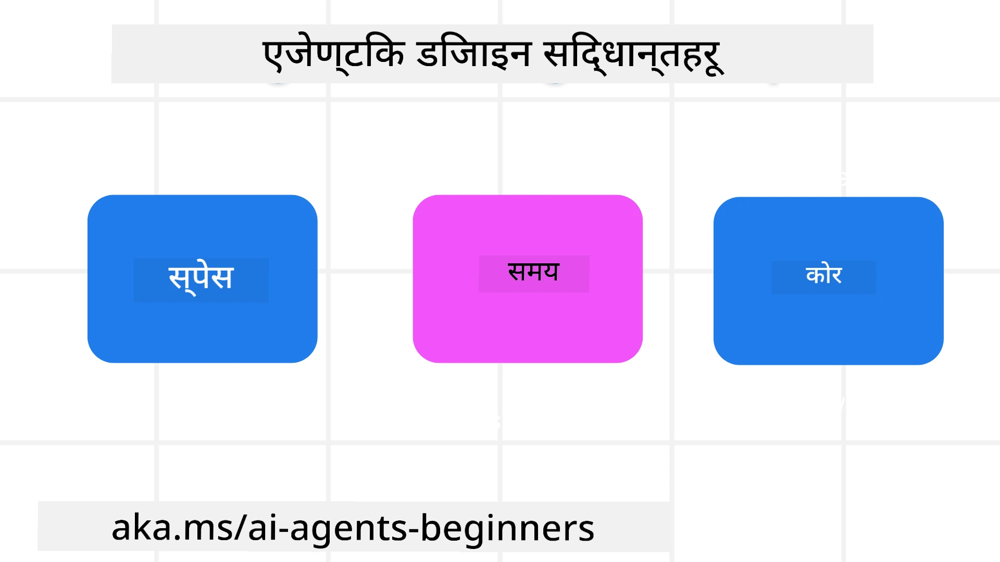

<!--
CO_OP_TRANSLATOR_METADATA:
{
  "original_hash": "d71524fe83a23829ae7a23b4031aaac8",
  "translation_date": "2025-11-13T11:59:58+00:00",
  "source_file": "03-agentic-design-patterns/README.md",
  "language_code": "ne"
}
-->

> _(यो पाठको भिडियो हेर्न माथिको तस्बिरमा क्लिक गर्नुहोस्)_
# AI एजेन्टिक डिजाइन सिद्धान्तहरू

## परिचय

AI एजेन्टिक प्रणालीहरू निर्माण गर्ने धेरै तरिकाहरू छन्। जेनेरेटिभ AI डिजाइनमा अस्पष्टता एउटा विशेषता हो, बग होइन, त्यसैले इन्जिनियरहरूले कहाँबाट सुरु गर्ने भन्ने कुरा कहिलेकाहीं गाह्रो हुन्छ। हामीले मानव-केंद्रित UX डिजाइन सिद्धान्तहरूको सेट तयार गरेका छौं जसले विकासकर्ताहरूलाई ग्राहक-केंद्रित एजेन्टिक प्रणालीहरू निर्माण गर्न सक्षम बनाउँछ, जसले उनीहरूको व्यापारिक आवश्यकताहरू समाधान गर्न सक्छ। यी डिजाइन सिद्धान्तहरू कुनै अनिवार्य आर्किटेक्चर होइनन्, तर टोलीहरूले एजेन्ट अनुभवहरू परिभाषित र निर्माण गर्दा सुरु गर्ने बिन्दु हुन्।

सामान्यतया, एजेन्टहरूले:

- मानव क्षमताहरूलाई फराकिलो र विस्तार गर्नुपर्छ (ब्रेनस्टर्मिङ, समस्या समाधान, स्वचालन, आदि)
- ज्ञानको खाडलहरू भर्नुपर्छ (ज्ञान क्षेत्रहरूमा गति दिन, अनुवाद, आदि)
- हामीले अरूसँग काम गर्न रुचाउने तरिकामा सहकार्यलाई सहज र समर्थन गर्नुपर्छ
- हामीलाई हाम्रो राम्रो संस्करण बनाउन मद्दत गर्नुपर्छ (जस्तै, जीवन प्रशिक्षक/कार्य मास्टर, भावनात्मक नियन्त्रण र ध्यान सीपहरू सिक्न मद्दत गर्ने, लचिलोपन निर्माण गर्ने, आदि)

## यो पाठले समेट्नेछ

- एजेन्टिक डिजाइन सिद्धान्तहरू के हुन्
- यी डिजाइन सिद्धान्तहरू कार्यान्वयन गर्दा पालना गर्नुपर्ने केही दिशानिर्देशहरू के हुन्
- डिजाइन सिद्धान्तहरूको प्रयोगका केही उदाहरणहरू के हुन्

## सिकाइका लक्ष्यहरू

यो पाठ पूरा गरेपछि, तपाईं सक्षम हुनुहुनेछ:

1. एजेन्टिक डिजाइन सिद्धान्तहरू के हुन् भनेर व्याख्या गर्न
2. एजेन्टिक डिजाइन सिद्धान्तहरूको प्रयोगका लागि दिशानिर्देशहरू व्याख्या गर्न
3. एजेन्टिक डिजाइन सिद्धान्तहरूको प्रयोग गरेर कसरी एजेन्ट निर्माण गर्ने बुझ्न

## एजेन्टिक डिजाइन सिद्धान्तहरू

### एजेन्ट (स्पेस)

यो एजेन्ट सञ्चालन हुने वातावरण हो। यी सिद्धान्तहरूले भौतिक र डिजिटल दुनियाँमा संलग्न हुने एजेन्टहरू डिजाइन गर्न कसरी जानकारी दिन्छन्।

- **जोड्ने, नत भत्काउने** – सहकार्य र सम्बन्धलाई सक्षम बनाउन मानिसहरूलाई अन्य मानिसहरू, घटनाहरू, र कार्यात्मक ज्ञानसँग जोड्न मद्दत गर्नुहोस्।
  - एजेन्टहरूले घटनाहरू, ज्ञान, र मानिसहरूलाई जोड्छन्।
  - एजेन्टहरूले मानिसहरूलाई नजिक ल्याउँछन्। तिनीहरू मानिसहरूलाई प्रतिस्थापन गर्न वा तुच्छ देखाउन डिजाइन गरिएका हुँदैनन्।
- **सजिलै पहुँचयोग्य तर कहिलेकाहीं अदृश्य** – एजेन्ट प्रायः पृष्ठभूमिमा सञ्चालन हुन्छ र केवल सान्दर्भिक र उपयुक्त हुँदा हामीलाई संकेत दिन्छ।
  - एजेन्ट कुनै पनि उपकरण वा प्लेटफर्ममा अधिकृत प्रयोगकर्ताहरूका लागि सजिलै पत्ता लगाउन र पहुँच गर्न सकिन्छ।
  - एजेन्टले बहु-मोडल इनपुट र आउटपुट (ध्वनि, आवाज, पाठ, आदि) समर्थन गर्दछ।
  - एजेन्टले प्रयोगकर्ताको आवश्यकताको संवेदनामा निर्भर गर्दै अग्रभूमि र पृष्ठभूमिबीच सहज रूपमा संक्रमण गर्न सक्छ।
  - एजेन्ट अदृश्य रूपमा सञ्चालन हुन सक्छ, तर यसको पृष्ठभूमि प्रक्रिया मार्ग र अन्य एजेन्टहरूसँगको सहकार्य प्रयोगकर्ताका लागि पारदर्शी र नियन्त्रणयोग्य हुन्छ।

### एजेन्ट (समय)

यो एजेन्टले समयको साथ कसरी सञ्चालन गर्छ भन्ने हो। यी सिद्धान्तहरूले विगत, वर्तमान, र भविष्यभरि अन्तरक्रिया गर्ने एजेन्टहरू डिजाइन गर्न कसरी जानकारी दिन्छन्।

- **विगत**: इतिहासलाई प्रतिबिम्बित गर्ने जसमा अवस्था र सन्दर्भ दुवै समावेश छन्।
  - एजेन्टले केवल घटना, मानिसहरू, वा अवस्थाहरूभन्दा परको समृद्ध ऐतिहासिक डाटाको विश्लेषणको आधारमा थप सान्दर्भिक परिणामहरू प्रदान गर्दछ।
  - एजेन्टले विगतका घटनाहरूबाट सम्बन्धहरू सिर्जना गर्छ र हालको अवस्थासँग संलग्न हुन सक्रिय रूपमा स्मृतिलाई प्रतिबिम्बित गर्छ।
- **अहिले**: सूचित गर्नुभन्दा संकेत दिने।
  - एजेन्टले मानिसहरूसँग अन्तरक्रिया गर्न व्यापक दृष्टिकोण समेट्छ। जब कुनै घटना हुन्छ, एजेन्ट स्थिर सूचनाहरू वा अन्य स्थिर औपचारिकताभन्दा पर जान्छ। एजेन्टले प्रवाहहरू सरल बनाउन सक्छ वा प्रयोगकर्ताको ध्यान सही समयमा निर्देशित गर्न गतिशील रूपमा संकेतहरू उत्पन्न गर्न सक्छ।
  - एजेन्टले सन्दर्भात्मक वातावरण, सामाजिक र सांस्कृतिक परिवर्तनहरू, र प्रयोगकर्ताको उद्देश्यअनुसार जानकारी प्रदान गर्दछ।
  - एजेन्ट अन्तरक्रिया क्रमिक हुन सक्छ, प्रयोगकर्ताहरूलाई लामो अवधिमा सशक्त बनाउन जटिलतामा विकसित हुँदै।
- **भविष्य**: अनुकूलन र विकास।
  - एजेन्ट विभिन्न उपकरणहरू, प्लेटफर्महरू, र मोडालिटीहरूसँग अनुकूलन गर्दछ।
  - एजेन्ट प्रयोगकर्ताको व्यवहार, पहुँच आवश्यकताहरूमा अनुकूलन गर्दछ, र स्वतन्त्र रूपमा अनुकूलनयोग्य हुन्छ।
  - एजेन्ट प्रयोगकर्ताको निरन्तर अन्तरक्रियाद्वारा आकार लिन्छ र विकसित हुन्छ।

### एजेन्ट (कोर)

यी एजेन्टको डिजाइनको कोरमा रहेका प्रमुख तत्वहरू हुन्।

- **अनिश्चिततालाई अँगाल्नुहोस् तर विश्वास स्थापना गर्नुहोस्।**
  - एजेन्टको केही स्तरको अनिश्चितता अपेक्षित छ। अनिश्चितता एजेन्ट डिजाइनको प्रमुख तत्व हो।
  - विश्वास र पारदर्शिता एजेन्ट डिजाइनका आधारभूत तहहरू हुन्।
  - मानिसहरूले एजेन्ट कहिले अन/अफ गर्ने भन्ने नियन्त्रणमा हुन्छन् र एजेन्टको स्थिति सधैं स्पष्ट रूपमा देखिने हुन्छ।

## यी सिद्धान्तहरू कार्यान्वयन गर्नका लागि दिशानिर्देशहरू

पछिल्ला डिजाइन सिद्धान्तहरू प्रयोग गर्दा, निम्न दिशानिर्देशहरू प्रयोग गर्नुहोस्:

1. **पारदर्शिता**: प्रयोगकर्तालाई AI संलग्न छ भन्ने जानकारी दिनुहोस्, यो कसरी काम गर्छ (विगतका कार्यहरू सहित), र प्रतिक्रिया दिन र प्रणाली परिमार्जन गर्न कसरी।
2. **नियन्त्रण**: प्रयोगकर्तालाई अनुकूलन गर्न, प्राथमिकताहरू निर्दिष्ट गर्न र व्यक्तिगत बनाउन सक्षम गर्नुहोस्, र प्रणाली र यसको विशेषताहरूमा नियन्त्रण राख्नुहोस् (भूल्न सक्ने क्षमता सहित)।
3. **संगतता**: उपकरणहरू र अन्त्य बिन्दुहरूमा स्थिर, बहु-मोडल अनुभवहरूको लक्ष्य राख्नुहोस्। जहाँ सम्भव छ परिचित UI/UX तत्वहरू प्रयोग गर्नुहोस् (जस्तै, आवाज अन्तरक्रियाको लागि माइक्रोफोन आइकन) र ग्राहकको संज्ञानात्मक भारलाई सकेसम्म कम गर्नुहोस् (जस्तै, संक्षिप्त प्रतिक्रियाहरू, दृश्य सहायता, र 'थप जान्नुहोस्' सामग्रीको लक्ष्य राख्नुहोस्)।

## यी सिद्धान्तहरू र दिशानिर्देशहरू प्रयोग गरेर ट्राभल एजेन्ट कसरी डिजाइन गर्ने

कल्पना गर्नुहोस् तपाईं ट्राभल एजेन्ट डिजाइन गर्दै हुनुहुन्छ, यहाँ तपाईंले डिजाइन सिद्धान्तहरू र दिशानिर्देशहरू प्रयोग गरेर कसरी सोच्न सक्नुहुन्छ:

1. **पारदर्शिता** – प्रयोगकर्तालाई ट्राभल एजेन्ट AI-सक्षम एजेन्ट हो भनेर जानकारी दिनुहोस्। कसरी सुरु गर्ने भन्ने केही आधारभूत निर्देशनहरू प्रदान गर्नुहोस् (जस्तै, "नमस्ते" सन्देश, नमूना प्रम्प्टहरू)। यो उत्पादन पृष्ठमा स्पष्ट रूपमा कागजात गर्नुहोस्। प्रयोगकर्ताले विगतमा सोधेका प्रम्प्टहरूको सूची देखाउनुहोस्। प्रतिक्रिया कसरी दिन सकिन्छ भन्ने कुरा स्पष्ट बनाउनुहोस् (थम्ब्स अप र डाउन, प्रतिक्रिया पठाउने बटन, आदि)। यदि एजेन्टसँग प्रयोग वा विषय प्रतिबन्धहरू छन् भने स्पष्ट रूपमा उल्लेख गर्नुहोस्।
2. **नियन्त्रण** – प्रयोगकर्ताले एजेन्टलाई निर्माण गरेपछि यसलाई परिमार्जन कसरी गर्न सकिन्छ भन्ने कुरा स्पष्ट बनाउनुहोस्, जस्तै सिस्टम प्रम्प्ट। प्रयोगकर्तालाई एजेन्ट कत्तिको विस्तृत हुनुपर्छ, यसको लेखन शैली, र एजेन्टले के कुरा गर्नु हुँदैन भन्ने कुनै पनि सर्तहरू छनोट गर्न सक्षम बनाउनुहोस्। प्रयोगकर्तालाई कुनै पनि सम्बन्धित फाइलहरू वा डाटा, प्रम्प्टहरू, र विगतका कुराकानीहरू हेर्न र मेटाउन अनुमति दिनुहोस्।
3. **संगतता** – प्रम्प्ट सेयर गर्ने, फाइल वा फोटो थप्ने, र कसैलाई वा केहि ट्याग गर्ने आइकनहरू मानक र चिनिने बनाउनुहोस्। एजेन्टसँग फाइल अपलोड/सेयर गर्न कागजको क्लिप आइकन प्रयोग गर्नुहोस्, र ग्राफिक्स अपलोड गर्न छवि आइकन प्रयोग गर्नुहोस्।

## नमूना कोडहरू

- Python: [एजेन्ट फ्रेमवर्क](./code_samples/03-python-agent-framework.ipynb)
- .NET: [एजेन्ट फ्रेमवर्क](./code_samples/03-dotnet-agent-framework.md)

## AI एजेन्टिक डिजाइन ढाँचाहरूको बारेमा थप प्रश्नहरू छन्?

[Azure AI Foundry Discord](https://aka.ms/ai-agents/discord) मा सामेल हुनुहोस्, अन्य सिक्नेहरूसँग भेट्नुहोस्, कार्यालय समयमा सहभागी हुनुहोस्, र तपाईंका AI एजेन्टहरूको प्रश्नहरूको उत्तर पाउनुहोस्।

## थप स्रोतहरू

- <a href="https://openai.com" target="_blank">एजेन्टिक AI प्रणालीहरूको शासनका लागि अभ्यासहरू | OpenAI</a>
- <a href="https://microsoft.com" target="_blank">HAX टूलकिट प्रोजेक्ट - माइक्रोसफ्ट रिसर्च</a>
- <a href="https://responsibleaitoolbox.ai" target="_blank">उत्तरदायी AI टूलबक्स</a>

## अघिल्लो पाठ

[एजेन्टिक फ्रेमवर्कहरूको अन्वेषण](../02-explore-agentic-frameworks/README.md)

## अर्को पाठ

[टूल प्रयोग डिजाइन ढाँचा](../04-tool-use/README.md)

---

<!-- CO-OP TRANSLATOR DISCLAIMER START -->
**अस्वीकरण**:  
यो दस्तावेज़ AI अनुवाद सेवा [Co-op Translator](https://github.com/Azure/co-op-translator) प्रयोग गरी अनुवाद गरिएको हो। हामी यथासम्भव शुद्धता सुनिश्चित गर्न प्रयास गर्छौं, तर कृपया ध्यान दिनुहोस् कि स्वचालित अनुवादहरूमा त्रुटिहरू वा अशुद्धताहरू हुन सक्छन्। यसको मूल भाषामा रहेको मूल दस्तावेज़लाई आधिकारिक स्रोत मानिनुपर्छ। महत्त्वपूर्ण जानकारीका लागि, व्यावसायिक मानव अनुवाद सिफारिस गरिन्छ। यस अनुवादको प्रयोगबाट उत्पन्न हुने कुनै पनि गलतफहमी वा गलत व्याख्याका लागि हामी जिम्मेवार हुने छैनौं।
<!-- CO-OP TRANSLATOR DISCLAIMER END -->