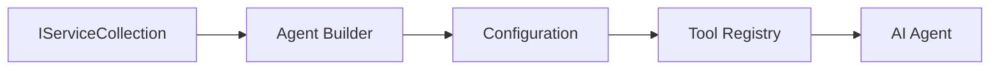

<!--
CO_OP_TRANSLATOR_METADATA:
{
  "original_hash": "bcc874e190347bd6a095aed56dc16de8",
  "translation_date": "2025-11-13T12:01:00+00:00",
  "source_file": "03-agentic-design-patterns/code_samples/03-dotnet-agent-framework.md",
  "language_code": "ne"
}
-->
# 🎨 GitHub मोडेलहरूसँग .NET मा एजेन्टिक डिजाइन ढाँचाहरू

## 📋 सिकाइ उद्देश्यहरू

यो उदाहरणले Microsoft Agent Framework प्रयोग गरेर .NET मा GitHub मोडेलहरूसँग बुद्धिमान एजेन्टहरू निर्माण गर्नका लागि उद्यम-स्तरीय डिजाइन ढाँचाहरू प्रदर्शन गर्दछ। तपाईंले एजेन्टहरूलाई उत्पादन-तयार, मर्मतयोग्य, र स्केलेबल बनाउने व्यावसायिक ढाँचाहरू र वास्तुकलाको दृष्टिकोणहरू सिक्नुहुनेछ।

### उद्यम डिजाइन ढाँचाहरू

- 🏭 **फ्याक्ट्री ढाँचा**: निर्भरता इन्जेक्शनको साथ मानकीकृत एजेन्ट निर्माण
- 🔧 **बिल्डर ढाँचा**: प्रवाही एजेन्ट कन्फिगरेसन र सेटअप
- 🧵 **थ्रेड-सुरक्षित ढाँचाहरू**: समवर्ती संवाद व्यवस्थापन
- 📋 **रिपोजिटरी ढाँचा**: उपकरण र क्षमता व्यवस्थापनको संगठन

## 🎯 .NET-विशिष्ट वास्तुकलाको फाइदाहरू

### उद्यम सुविधाहरू

- **स्ट्रङ टाइपिङ**: कम्पाइल-समय मान्यता र IntelliSense समर्थन
- **निर्भरता इन्जेक्शन**: बिल्ट-इन DI कन्टेनर एकीकरण
- **कन्फिगरेसन व्यवस्थापन**: IConfiguration र Options ढाँचाहरू
- **Async/Await**: पहिलो श्रेणीको असिन्क्रोनस प्रोग्रामिङ समर्थन

### उत्पादन-तयार ढाँचाहरू

- **लगिङ एकीकरण**: ILogger र संरचित लगिङ समर्थन
- **स्वास्थ्य जाँचहरू**: बिल्ट-इन अनुगमन र निदान
- **कन्फिगरेसन मान्यता**: डेटा एनोटेसनहरूसँग स्ट्रङ टाइपिङ
- **त्रुटि व्यवस्थापन**: संरचित अपवाद व्यवस्थापन

## 🔧 प्राविधिक वास्तुकला

### कोर .NET कम्पोनेन्टहरू

- **Microsoft.Extensions.AI**: एकीकृत AI सेवा अमूर्तताहरू
- **Microsoft.Agents.AI**: उद्यम एजेन्ट समन्वय फ्रेमवर्क
- **GitHub मोडेल एकीकरण**: उच्च-प्रदर्शन API क्लाइन्ट ढाँचाहरू
- **कन्फिगरेसन प्रणाली**: appsettings.json र वातावरण एकीकरण

### डिजाइन ढाँचा कार्यान्वयन



## 🏗️ प्रदर्शन गरिएका उद्यम ढाँचाहरू

### 1. **सिर्जनात्मक ढाँचाहरू**

- **एजेन्ट फ्याक्ट्री**: स्थिर कन्फिगरेसनको साथ केन्द्रीय एजेन्ट निर्माण
- **बिल्डर ढाँचा**: जटिल एजेन्ट कन्फिगरेसनको लागि प्रवाही API
- **सिङ्गलटन ढाँचा**: साझा स्रोत र कन्फिगरेसन व्यवस्थापन
- **निर्भरता इन्जेक्शन**: लुज कपलिङ र परीक्षणयोग्यता

### 2. **व्यवहारिक ढाँचाहरू**

- **स्ट्राटेजी ढाँचा**: विनिमेय उपकरण कार्यान्वयन रणनीतिहरू
- **कमाण्ड ढाँचा**: एजेन्ट अपरेसनहरूलाई समेटेर undo/redo समर्थन
- **अवलोकनकर्ता ढाँचा**: घटना-चालित एजेन्ट जीवनचक्र व्यवस्थापन
- **टेम्प्लेट विधि**: मानकीकृत एजेन्ट कार्यान्वयन कार्यप्रवाहहरू

### 3. **संरचनात्मक ढाँचाहरू**

- **एडाप्टर ढाँचा**: GitHub मोडेल API एकीकरण तह
- **डेकोरेटर ढाँचा**: एजेन्ट क्षमताको वृद्धि
- **फेसाड ढाँचा**: सरलीकृत एजेन्ट अन्तरक्रिया इन्टरफेसहरू
- **प्रोक्सी ढाँचा**: प्रदर्शनको लागि लेजी लोडिङ र क्यासिङ

## 📚 .NET डिजाइन सिद्धान्तहरू

### SOLID सिद्धान्तहरू

- **सिङ्गल जिम्मेवारी**: प्रत्येक कम्पोनेन्टको एक स्पष्ट उद्देश्य
- **ओपन/क्लोज्ड**: परिमार्जन बिना विस्तारयोग्य
- **लिस्कोभ प्रतिस्थापन**: इन्टरफेस-आधारित उपकरण कार्यान्वयनहरू
- **इन्टरफेस विभाजन**: केन्द्रित, सुसंगत इन्टरफेसहरू
- **निर्भरता उल्टो**: अमूर्ततामा निर्भर गर्नुहोस्, ठोसतामा होइन

### सफा वास्तुकला

- **डोमेन तह**: कोर एजेन्ट र उपकरण अमूर्तताहरू
- **अनुप्रयोग तह**: एजेन्ट समन्वय र कार्यप्रवाहहरू
- **पूर्वाधार तह**: GitHub मोडेल एकीकरण र बाह्य सेवाहरू
- **प्रस्तुति तह**: प्रयोगकर्ता अन्तरक्रिया र प्रतिक्रिया ढाँचा

## 🔒 उद्यम विचारहरू

### सुरक्षा

- **क्रेडेन्सियल व्यवस्थापन**: IConfiguration सँग सुरक्षित API कुञ्जी ह्यान्डलिङ
- **इनपुट मान्यता**: स्ट्रङ टाइपिङ र डेटा एनोटेसन मान्यता
- **आउटपुट सफाई**: सुरक्षित प्रतिक्रिया प्रशोधन र फिल्टरिङ
- **अडिट लगिङ**: व्यापक अपरेसन ट्र्याकिङ

### प्रदर्शन

- **असिन्क ढाँचाहरू**: गैर-अवरुद्ध I/O अपरेसनहरू
- **कनेक्शन पूलिङ**: कुशल HTTP क्लाइन्ट व्यवस्थापन
- **क्यासिङ**: प्रदर्शन सुधारको लागि प्रतिक्रिया क्यासिङ
- **स्रोत व्यवस्थापन**: उचित डिस्पोजल र सफाई ढाँचाहरू

### स्केलेबिलिटी

- **थ्रेड सुरक्षा**: समवर्ती एजेन्ट कार्यान्वयन समर्थन
- **स्रोत पूलिङ**: कुशल स्रोत उपयोग
- **लोड व्यवस्थापन**: दर सीमित र ब्याकप्रेसर ह्यान्डलिङ
- **अनुगमन**: प्रदर्शन मेट्रिक्स र स्वास्थ्य जाँचहरू

## 🚀 उत्पादन परिनियोजन

- **कन्फिगरेसन व्यवस्थापन**: वातावरण-विशिष्ट सेटिङहरू
- **लगिङ रणनीति**: संरचित लगिङ र सम्बन्ध आईडीहरूसँग
- **त्रुटि व्यवस्थापन**: उचित पुन:प्राप्तिसँग ग्लोबल अपवाद व्यवस्थापन
- **अनुगमन**: अनुप्रयोग अन्तर्दृष्टि र प्रदर्शन काउन्टरहरू
- **परीक्षण**: युनिट परीक्षण, एकीकरण परीक्षण, र लोड परीक्षण ढाँचाहरू

उद्यम-स्तरीय बुद्धिमान एजेन्टहरू .NET मा निर्माण गर्न तयार हुनुहुन्छ? केही बलियो वास्तुकला बनाऔं! 🏢✨

## 🚀 सुरु गर्दै

### पूर्वआवश्यकताहरू

- [.NET 10 SDK](https://dotnet.microsoft.com/download/dotnet/10.0) वा उच्च
- [GitHub मोडेल API पहुँच टोकन](https://docs.github.com/github-models/github-models-at-scale/using-your-own-api-keys-in-github-models)

### आवश्यक वातावरण चरहरू

```bash
# zsh/bash
export GH_TOKEN=<your_github_token>
export GH_ENDPOINT=https://models.github.ai/inference
export GH_MODEL_ID=openai/gpt-5-mini
```

```powershell
# PowerShell
$env:GH_TOKEN = "<your_github_token>"
$env:GH_ENDPOINT = "https://models.github.ai/inference"
$env:GH_MODEL_ID = "openai/gpt-5-mini"
```

### नमूना कोड

कोड उदाहरण चलाउन,

```bash
# zsh/bash
chmod +x ./03-dotnet-agent-framework.cs
./03-dotnet-agent-framework.cs
```

वा dotnet CLI प्रयोग गरेर:

```bash
dotnet run ./03-dotnet-agent-framework.cs
```

पूरा कोडको लागि हेर्नुहोस् [`03-dotnet-agent-framework.cs`](../../../../03-agentic-design-patterns/code_samples/03-dotnet-agent-framework.cs)।

```csharp
#!/usr/bin/dotnet run

#:package Microsoft.Extensions.AI@10.*
#:package Microsoft.Agents.AI.OpenAI@1.*-*

using System.ClientModel;
using System.ComponentModel;

using Microsoft.Agents.AI;
using Microsoft.Extensions.AI;

using OpenAI;

// Tool Function: Random Destination Generator
// This static method will be available to the agent as a callable tool
// The [Description] attribute helps the AI understand when to use this function
// This demonstrates how to create custom tools for AI agents
[Description("Provides a random vacation destination.")]
static string GetRandomDestination()
{
    // List of popular vacation destinations around the world
    // The agent will randomly select from these options
    var destinations = new List<string>
    {
        "Paris, France",
        "Tokyo, Japan",
        "New York City, USA",
        "Sydney, Australia",
        "Rome, Italy",
        "Barcelona, Spain",
        "Cape Town, South Africa",
        "Rio de Janeiro, Brazil",
        "Bangkok, Thailand",
        "Vancouver, Canada"
    };

    // Generate random index and return selected destination
    // Uses System.Random for simple random selection
    var random = new Random();
    int index = random.Next(destinations.Count);
    return destinations[index];
}

// Extract configuration from environment variables
// Retrieve the GitHub Models API endpoint, defaults to https://models.github.ai/inference if not specified
// Retrieve the model ID, defaults to openai/gpt-5-mini if not specified
// Retrieve the GitHub token for authentication, throws exception if not specified
var github_endpoint = Environment.GetEnvironmentVariable("GH_ENDPOINT") ?? "https://models.github.ai/inference";
var github_model_id = Environment.GetEnvironmentVariable("GH_MODEL_ID") ?? "openai/gpt-5-mini";
var github_token = Environment.GetEnvironmentVariable("GH_TOKEN") ?? throw new InvalidOperationException("GH_TOKEN is not set.");

// Configure OpenAI Client Options
// Create configuration options to point to GitHub Models endpoint
// This redirects OpenAI client calls to GitHub's model inference service
var openAIOptions = new OpenAIClientOptions()
{
    Endpoint = new Uri(github_endpoint)
};

// Initialize OpenAI Client with GitHub Models Configuration
// Create OpenAI client using GitHub token for authentication
// Configure it to use GitHub Models endpoint instead of OpenAI directly
var openAIClient = new OpenAIClient(new ApiKeyCredential(github_token), openAIOptions);

// Define Agent Identity and Comprehensive Instructions
// Agent name for identification and logging purposes
var AGENT_NAME = "TravelAgent";

// Detailed instructions that define the agent's personality, capabilities, and behavior
// This system prompt shapes how the agent responds and interacts with users
var AGENT_INSTRUCTIONS = """
You are a helpful AI Agent that can help plan vacations for customers.

Important: When users specify a destination, always plan for that location. Only suggest random destinations when the user hasn't specified a preference.

When the conversation begins, introduce yourself with this message:
"Hello! I'm your TravelAgent assistant. I can help plan vacations and suggest interesting destinations for you. Here are some things you can ask me:
1. Plan a day trip to a specific location
2. Suggest a random vacation destination
3. Find destinations with specific features (beaches, mountains, historical sites, etc.)
4. Plan an alternative trip if you don't like my first suggestion

What kind of trip would you like me to help you plan today?"

Always prioritize user preferences. If they mention a specific destination like "Bali" or "Paris," focus your planning on that location rather than suggesting alternatives.
""";

// Create AI Agent with Advanced Travel Planning Capabilities
// Initialize complete agent pipeline: OpenAI client → Chat client → AI agent
// Configure agent with name, detailed instructions, and available tools
// This demonstrates the .NET agent creation pattern with full configuration
AIAgent agent = openAIClient
    .GetChatClient(github_model_id)
    .CreateAIAgent(
        name: AGENT_NAME,
        instructions: AGENT_INSTRUCTIONS,
        tools: [AIFunctionFactory.Create(GetRandomDestination)]
    );

// Create New Conversation Thread for Context Management
// Initialize a new conversation thread to maintain context across multiple interactions
// Threads enable the agent to remember previous exchanges and maintain conversational state
// This is essential for multi-turn conversations and contextual understanding
AgentThread thread = agent.GetNewThread();

// Execute Agent: First Travel Planning Request
// Run the agent with an initial request that will likely trigger the random destination tool
// The agent will analyze the request, use the GetRandomDestination tool, and create an itinerary
// Using the thread parameter maintains conversation context for subsequent interactions
await foreach (var update in agent.RunStreamingAsync("Plan me a day trip", thread))
{
    await Task.Delay(10);
    Console.Write(update);
}

Console.WriteLine();

// Execute Agent: Follow-up Request with Context Awareness
// Demonstrate contextual conversation by referencing the previous response
// The agent remembers the previous destination suggestion and will provide an alternative
// This showcases the power of conversation threads and contextual understanding in .NET agents
await foreach (var update in agent.RunStreamingAsync("I don't like that destination. Plan me another vacation.", thread))
{
    await Task.Delay(10);
    Console.Write(update);
}
```

---

<!-- CO-OP TRANSLATOR DISCLAIMER START -->
**अस्वीकरण**:  
यो दस्तावेज़ AI अनुवाद सेवा [Co-op Translator](https://github.com/Azure/co-op-translator) प्रयोग गरी अनुवाद गरिएको हो। हामी यथासम्भव शुद्धताको प्रयास गर्छौं, तर कृपया जानकार रहनुहोस् कि स्वचालित अनुवादहरूमा त्रुटिहरू वा अशुद्धताहरू हुन सक्छन्। यसको मूल भाषामा रहेको मूल दस्तावेज़लाई आधिकारिक स्रोत मानिनुपर्छ। महत्त्वपूर्ण जानकारीका लागि, व्यावसायिक मानव अनुवाद सिफारिस गरिन्छ। यस अनुवादको प्रयोगबाट उत्पन्न हुने कुनै पनि गलतफहमी वा गलत व्याख्याको लागि हामी जिम्मेवार हुने छैनौं।
<!-- CO-OP TRANSLATOR DISCLAIMER END -->