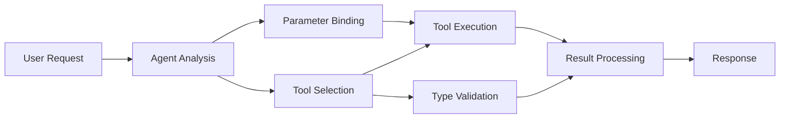

<!--
CO_OP_TRANSLATOR_METADATA:
{
  "original_hash": "91d6061e402489603f2ec8b528cae59b",
  "translation_date": "2025-11-18T17:11:30+00:00",
  "source_file": "04-tool-use/code_samples/04-dotnet-agent-framework.md",
  "language_code": "ne"
}
-->
# 🛠️ GitHub मोडेलहरूसँग उन्नत उपकरण प्रयोग (.NET)

## 📋 सिक्ने उद्देश्यहरू

यो नोटबुकले Microsoft Agent Framework प्रयोग गरेर .NET मा GitHub मोडेलहरूसँग उद्यम-स्तरको उपकरण एकीकरण ढाँचाहरू प्रदर्शन गर्दछ। तपाईंले C# को बलियो टाइपिङ र .NET को उद्यम सुविधाहरू प्रयोग गर्दै धेरै विशेष उपकरणहरूसँग परिष्कृत एजेन्टहरू निर्माण गर्न सिक्नुहुनेछ।

### उन्नत उपकरण क्षमताहरू जसमा तपाईं महारत हासिल गर्नुहुनेछ

- 🔧 **बहु-उपकरण आर्किटेक्चर**: धेरै विशेष क्षमताहरू भएका एजेन्टहरू निर्माण गर्नु
- 🎯 **टाइप-सुरक्षित उपकरण कार्यान्वयन**: C# को कम्पाइल-टाइम मान्यता प्रयोग गर्नु
- 📊 **उद्यम उपकरण ढाँचाहरू**: उत्पादन-तयार उपकरण डिजाइन र त्रुटि व्यवस्थापन
- 🔗 **उपकरण संरचना**: जटिल व्यापार कार्यप्रवाहहरूको लागि उपकरणहरू संयोजन गर्नु

## 🎯 .NET उपकरण आर्किटेक्चरका फाइदाहरू

### उद्यम उपकरण सुविधाहरू

- **कम्पाइल-टाइम मान्यता**: बलियो टाइपिङले उपकरण प्यारामिटरको शुद्धता सुनिश्चित गर्दछ
- **डिपेन्डेन्सी इन्जेक्शन**: IoC कन्टेनर एकीकरण उपकरण व्यवस्थापनको लागि
- **Async/Await ढाँचाहरू**: उचित स्रोत व्यवस्थापनसहित गैर-अवरोधक उपकरण कार्यान्वयन
- **संरचित लगिङ**: उपकरण कार्यान्वयन अनुगमनको लागि बिल्ट-इन लगिङ एकीकरण

### उत्पादन-तयार ढाँचाहरू

- **अपवाद व्यवस्थापन**: टाइप गरिएको अपवादहरूसहित व्यापक त्रुटि व्यवस्थापन
- **स्रोत व्यवस्थापन**: उचित डिस्पोजल ढाँचाहरू र मेमोरी व्यवस्थापन
- **प्रदर्शन अनुगमन**: बिल्ट-इन मेट्रिक्स र प्रदर्शन काउन्टरहरू
- **कन्फिगरेसन व्यवस्थापन**: मान्यता सहित टाइप-सुरक्षित कन्फिगरेसन

## 🔧 प्राविधिक आर्किटेक्चर

### कोर .NET उपकरण घटकहरू

- **Microsoft.Extensions.AI**: एकीकृत उपकरण अमूर्त तह
- **Microsoft.Agents.AI**: उद्यम-स्तरको उपकरण समन्वय
- **GitHub मोडेल एकीकरण**: उच्च-प्रदर्शन API क्लाइन्ट कनेक्शन पूलिङसहित

### उपकरण कार्यान्वयन पाइपलाइन



## 🛠️ उपकरण कोटीहरू र ढाँचाहरू

### 1. **डाटा प्रशोधन उपकरणहरू**

- **इनपुट मान्यता**: डाटा एनोटेसनसहित बलियो टाइपिङ
- **रूपान्तरण अपरेशनहरू**: टाइप-सुरक्षित डाटा रूपान्तरण र ढाँचाबद्धता
- **व्यापारिक तर्क**: डोमेन-विशिष्ट गणना र विश्लेषण उपकरणहरू
- **आउटपुट ढाँचाबद्धता**: संरचित प्रतिक्रिया उत्पादन

### 2. **एकीकरण उपकरणहरू**

- **API कनेक्टरहरू**: HttpClient सँग RESTful सेवा एकीकरण
- **डाटाबेस उपकरणहरू**: डाटा पहुँचको लागि Entity Framework एकीकरण
- **फाइल अपरेशनहरू**: मान्यता सहित सुरक्षित फाइल प्रणाली अपरेशनहरू
- **बाह्य सेवाहरू**: तेस्रो-पक्ष सेवा एकीकरण ढाँचाहरू

### 3. **युटिलिटी उपकरणहरू**

- **पाठ प्रशोधन**: स्ट्रिङ हेरफेर र ढाँचाबद्धता उपयोगिताहरू
- **मिति/समय अपरेशनहरू**: संस्कृति-सचेत मिति/समय गणनाहरू
- **गणितीय उपकरणहरू**: सटीक गणना र सांख्यिकीय अपरेशनहरू
- **मान्यता उपकरणहरू**: व्यापार नियम मान्यता र डाटा प्रमाणीकरण

उद्यम-स्तरका एजेन्टहरू बलियो, टाइप-सुरक्षित उपकरण क्षमताहरूको साथ निर्माण गर्न तयार हुनुहुन्छ? आउनुहोस्, केही व्यावसायिक-स्तरका समाधानहरू आर्किटेक्ट गरौं! 🏢⚡

## 🚀 सुरु गर्दै

### पूर्वापेक्षाहरू

- [.NET 10 SDK](https://dotnet.microsoft.com/download/dotnet/10.0) वा उच्च
- [GitHub मोडेल API पहुँच टोकन](https://docs.github.com/github-models/github-models-at-scale/using-your-own-api-keys-in-github-models)

### आवश्यक वातावरण चरहरू

```bash
# zsh/bash
export GH_TOKEN=<your_github_token>
export GH_ENDPOINT=https://models.github.ai/inference
export GH_MODEL_ID=openai/gpt-5-mini
```

```powershell
# PowerShell
$env:GH_TOKEN = "<your_github_token>"
$env:GH_ENDPOINT = "https://models.github.ai/inference"
$env:GH_MODEL_ID = "openai/gpt-5-mini"
```

### नमूना कोड

कोड उदाहरण चलाउन,

```bash
# zsh/bash
chmod +x ./04-dotnet-agent-framework.cs
./04-dotnet-agent-framework.cs
```

वा dotnet CLI प्रयोग गरेर:

```bash
dotnet run ./04-dotnet-agent-framework.cs
```

पूरा कोडको लागि [`04-dotnet-agent-framework.cs`](../../../../04-tool-use/code_samples/04-dotnet-agent-framework.cs) हेर्नुहोस्।

```csharp
#!/usr/bin/dotnet run

#:package Microsoft.Extensions.AI@10.*
#:package Microsoft.Agents.AI.OpenAI@1.*-*

using System.ClientModel;
using System.ComponentModel;

using Microsoft.Agents.AI;
using Microsoft.Extensions.AI;

using OpenAI;

// Tool Function: Random Destination Generator
// This static method will be available to the agent as a callable tool
// The [Description] attribute helps the AI understand when to use this function
// This demonstrates how to create custom tools for AI agents
[Description("Provides a random vacation destination.")]
static string GetRandomDestination()
{
    // List of popular vacation destinations around the world
    // The agent will randomly select from these options
    var destinations = new List<string>
    {
        "Paris, France",
        "Tokyo, Japan",
        "New York City, USA",
        "Sydney, Australia",
        "Rome, Italy",
        "Barcelona, Spain",
        "Cape Town, South Africa",
        "Rio de Janeiro, Brazil",
        "Bangkok, Thailand",
        "Vancouver, Canada"
    };

    // Generate random index and return selected destination
    // Uses System.Random for simple random selection
    var random = new Random();
    int index = random.Next(destinations.Count);
    return destinations[index];
}

// Extract configuration from environment variables
// Retrieve the GitHub Models API endpoint, defaults to https://models.github.ai/inference if not specified
// Retrieve the model ID, defaults to openai/gpt-5-mini if not specified
// Retrieve the GitHub token for authentication, throws exception if not specified
var github_endpoint = Environment.GetEnvironmentVariable("GH_ENDPOINT") ?? "https://models.github.ai/inference";
var github_model_id = Environment.GetEnvironmentVariable("GH_MODEL_ID") ?? "openai/gpt-5-mini";
var github_token = Environment.GetEnvironmentVariable("GH_TOKEN") ?? throw new InvalidOperationException("GH_TOKEN is not set.");

// Configure OpenAI Client Options
// Create configuration options to point to GitHub Models endpoint
// This redirects OpenAI client calls to GitHub's model inference service
var openAIOptions = new OpenAIClientOptions()
{
    Endpoint = new Uri(github_endpoint)
};

// Initialize OpenAI Client with GitHub Models Configuration
// Create OpenAI client using GitHub token for authentication
// Configure it to use GitHub Models endpoint instead of OpenAI directly
var openAIClient = new OpenAIClient(new ApiKeyCredential(github_token), openAIOptions);

// Define Agent Identity and Comprehensive Instructions
// Agent name for identification and logging purposes
var AGENT_NAME = "TravelAgent";

// Detailed instructions that define the agent's personality, capabilities, and behavior
// This system prompt shapes how the agent responds and interacts with users
var AGENT_INSTRUCTIONS = """
You are a helpful AI Agent that can help plan vacations for customers.

Important: When users specify a destination, always plan for that location. Only suggest random destinations when the user hasn't specified a preference.

When the conversation begins, introduce yourself with this message:
"Hello! I'm your TravelAgent assistant. I can help plan vacations and suggest interesting destinations for you. Here are some things you can ask me:
1. Plan a day trip to a specific location
2. Suggest a random vacation destination
3. Find destinations with specific features (beaches, mountains, historical sites, etc.)
4. Plan an alternative trip if you don't like my first suggestion

What kind of trip would you like me to help you plan today?"

Always prioritize user preferences. If they mention a specific destination like "Bali" or "Paris," focus your planning on that location rather than suggesting alternatives.
""";

// Create AI Agent with Advanced Travel Planning Capabilities
// Initialize complete agent pipeline: OpenAI client → Chat client → AI agent
// Configure agent with name, detailed instructions, and available tools
// This demonstrates the .NET agent creation pattern with full configuration
AIAgent agent = openAIClient
    .GetChatClient(github_model_id)
    .CreateAIAgent(
        name: AGENT_NAME,
        instructions: AGENT_INSTRUCTIONS,
        tools: [AIFunctionFactory.Create(GetRandomDestination)]
    );

// Create New Conversation Thread for Context Management
// Initialize a new conversation thread to maintain context across multiple interactions
// Threads enable the agent to remember previous exchanges and maintain conversational state
// This is essential for multi-turn conversations and contextual understanding
AgentThread thread = agent.GetNewThread();

// Execute Agent: First Travel Planning Request
// Run the agent with an initial request that will likely trigger the random destination tool
// The agent will analyze the request, use the GetRandomDestination tool, and create an itinerary
// Using the thread parameter maintains conversation context for subsequent interactions
await foreach (var update in agent.RunStreamingAsync("Plan me a day trip", thread))
{
    await Task.Delay(10);
    Console.Write(update);
}

Console.WriteLine();

// Execute Agent: Follow-up Request with Context Awareness
// Demonstrate contextual conversation by referencing the previous response
// The agent remembers the previous destination suggestion and will provide an alternative
// This showcases the power of conversation threads and contextual understanding in .NET agents
await foreach (var update in agent.RunStreamingAsync("I don't like that destination. Plan me another vacation.", thread))
{
    await Task.Delay(10);
    Console.Write(update);
}
```

---

<!-- CO-OP TRANSLATOR DISCLAIMER START -->
**अस्वीकरण**:  
यो दस्तावेज AI अनुवाद सेवा [Co-op Translator](https://github.com/Azure/co-op-translator) प्रयोग गरेर अनुवाद गरिएको छ। हामी शुद्धताको लागि प्रयास गर्छौं, तर कृपया ध्यान दिनुहोस् कि स्वचालित अनुवादमा त्रुटिहरू वा अशुद्धताहरू हुन सक्छ। यसको मूल भाषा मा रहेको मूल दस्तावेजलाई आधिकारिक स्रोत मानिनुपर्छ। महत्वपूर्ण जानकारीको लागि, व्यावसायिक मानव अनुवाद सिफारिस गरिन्छ। यस अनुवादको प्रयोगबाट उत्पन्न हुने कुनै पनि गलतफहमी वा गलत व्याख्याको लागि हामी जिम्मेवार हुनेछैनौं।
<!-- CO-OP TRANSLATOR DISCLAIMER END -->