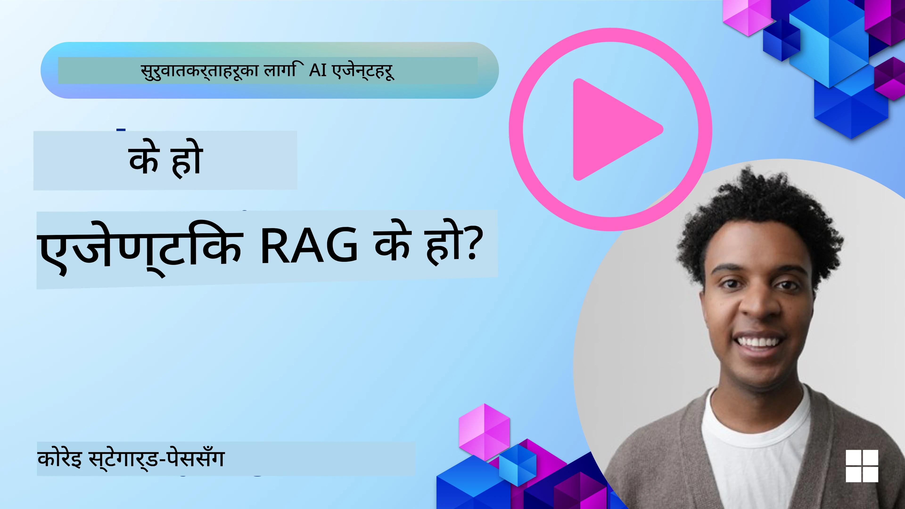
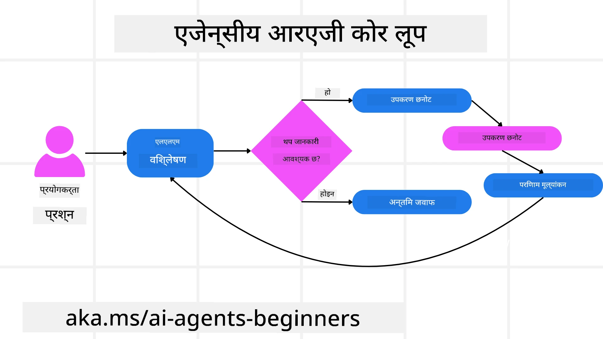
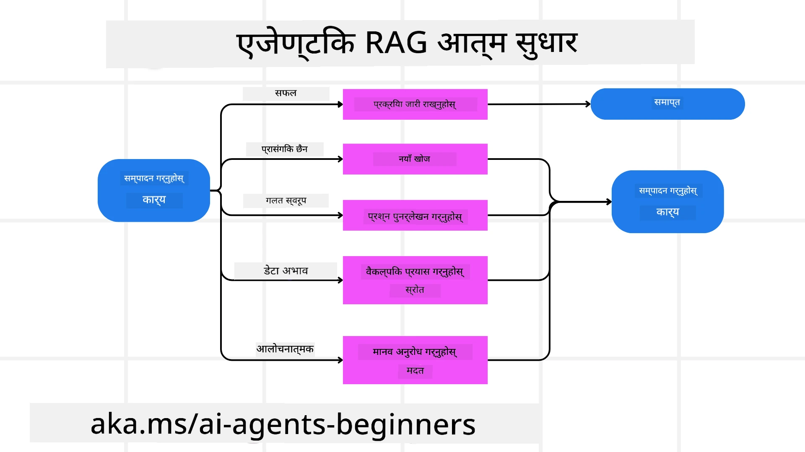
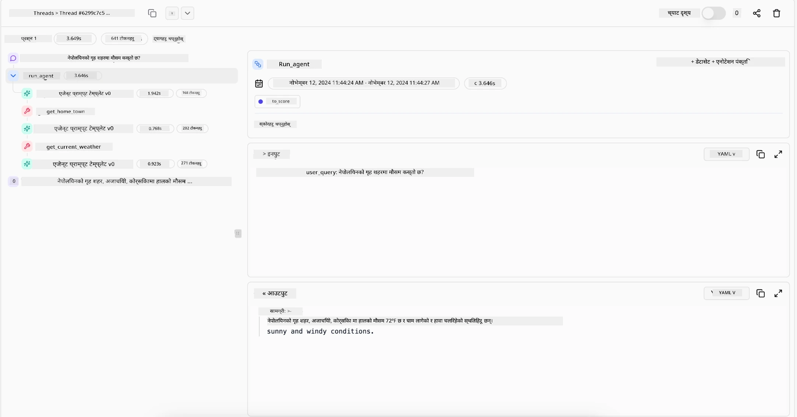

<!--
CO_OP_TRANSLATOR_METADATA:
{
  "original_hash": "0ebf6b2290db55dbf2d10cc49655523b",
  "translation_date": "2025-09-30T06:45:31+00:00",
  "source_file": "05-agentic-rag/README.md",
  "language_code": "ne"
}
-->

> _(माथिको चित्रमा क्लिक गरेर यस पाठको भिडियो हेर्नुहोस्)_

# Agentic RAG

यो पाठले Agentic Retrieval-Augmented Generation (Agentic RAG) को विस्तृत परिचय प्रदान गर्दछ। यो एक नयाँ AI दृष्टिकोण हो जहाँ ठूला भाषा मोडेलहरू (LLMs) स्वतन्त्र रूपमा आफ्नो अर्को कदम योजना गर्छन् र बाह्य स्रोतहरूबाट जानकारी संकलन गर्छन्। स्थिर "retrieval-then-read" ढाँचाको विपरीत, Agentic RAG ले LLM मा पुनरावृत्त कलहरू समावेश गर्दछ, उपकरण वा कार्य कलहरू र संरचित आउटपुटहरू बीचमा। प्रणालीले परिणामहरूको मूल्यांकन गर्छ, क्वेरीहरू सुधार्छ, आवश्यक परे थप उपकरणहरू प्रयोग गर्छ, र सन्तोषजनक समाधान प्राप्त नभएसम्म यो चक्र जारी राख्छ।

## परिचय

यो पाठले निम्न विषयहरू समेट्छ:

- **Agentic RAG बुझ्नुहोस्:** ठूला भाषा मोडेलहरू (LLMs) स्वतन्त्र रूपमा आफ्नो अर्को कदम योजना गर्छन् र बाह्य डेटा स्रोतहरूबाट जानकारी संकलन गर्ने नयाँ AI दृष्टिकोणको बारेमा जान्नुहोस्।
- **Iterative Maker-Checker शैली बुझ्नुहोस्:** LLM मा पुनरावृत्त कलहरूको चक्र बुझ्नुहोस्, उपकरण वा कार्य कलहरू र संरचित आउटपुटहरू बीचमा, सहीतामा सुधार गर्न र गलत क्वेरीहरूलाई व्यवस्थापन गर्न डिजाइन गरिएको।
- **व्यावहारिक प्रयोगहरू अन्वेषण गर्नुहोस्:** Agentic RAG उत्कृष्ट हुने परिदृश्यहरू पहिचान गर्नुहोस्, जस्तै सहीतामा प्राथमिकता दिने वातावरण, जटिल डाटाबेस अन्तर्क्रियाहरू, र विस्तारित कार्यप्रवाहहरू।

## सिकाइका लक्ष्यहरू

यो पाठ पूरा गरेपछि, तपाईंलाई निम्न विषयहरू थाहा हुनेछ/बुझ्नुहुनेछ:

- **Agentic RAG बुझ्नुहोस्:** ठूला भाषा मोडेलहरू (LLMs) स्वतन्त्र रूपमा आफ्नो अर्को कदम योजना गर्छन् र बाह्य डेटा स्रोतहरूबाट जानकारी संकलन गर्ने नयाँ AI दृष्टिकोणको बारेमा जान्नुहोस्।
- **Iterative Maker-Checker शैली:** सहीतामा सुधार गर्न र गलत क्वेरीहरूलाई व्यवस्थापन गर्न डिजाइन गरिएको पुनरावृत्त चक्रको अवधारणा बुझ्नुहोस्।
- **तर्क प्रक्रियाको स्वामित्व:** प्रणालीले आफ्नो तर्क प्रक्रियाको स्वामित्व लिन सक्ने क्षमता बुझ्नुहोस्, पूर्व-परिभाषित मार्गहरूमा निर्भर नगरी समस्याहरूलाई कसरी समाधान गर्ने निर्णय लिन्छ।
- **कार्यप्रवाह:** Agentic मोडेलले स्वतन्त्र रूपमा बजार प्रवृत्ति रिपोर्टहरू संकलन गर्ने, प्रतिस्पर्धी डेटा पहिचान गर्ने, आन्तरिक बिक्री मेट्रिक्ससँग सम्बन्धित गर्ने, निष्कर्षहरू संश्लेषण गर्ने, र रणनीति मूल्यांकन गर्ने निर्णय कसरी लिन्छ भन्ने बुझ्नुहोस्।
- **पुनरावृत्त चक्रहरू, उपकरण एकीकरण, र मेमोरी:** प्रणालीले पुनरावृत्त अन्तर्क्रिया ढाँचामा निर्भर गर्दछ, चरणहरूमा राज्य र मेमोरी कायम राख्छ ताकि दोहोरिने चक्रहरूबाट बच्न र सूचित निर्णयहरू गर्न सकियोस्।
- **असफलता मोडहरू व्यवस्थापन र आत्म-सुधार:** प्रणालीको बलियो आत्म-सुधार संयन्त्रहरू अन्वेषण गर्नुहोस्, जस्तै पुनरावृत्ति र पुनः क्वेरी, डायग्नोस्टिक उपकरणहरूको प्रयोग, र मानव निरीक्षणमा निर्भरता।
- **एजेंसीको सीमा:** Agentic RAG को सीमाहरू बुझ्नुहोस्, डोमेन-विशिष्ट स्वतन्त्रता, पूर्वाधार निर्भरता, र सुरक्षा उपायहरूको सम्मानमा केन्द्रित।
- **व्यावहारिक प्रयोगहरू र मूल्य:** Agentic RAG उत्कृष्ट हुने परिदृश्यहरू पहिचान गर्नुहोस्, जस्तै सहीतामा प्राथमिकता दिने वातावरण, जटिल डाटाबेस अन्तर्क्रियाहरू, र विस्तारित कार्यप्रवाहहरू।
- **शासन, पारदर्शिता, र विश्वास:** शासन र पारदर्शिताको महत्त्व बुझ्नुहोस्, जसमा व्याख्यात्मक तर्क, पूर्वाग्रह नियन्त्रण, र मानव निरीक्षण समावेश छ।

## Agentic RAG के हो?

Agentic Retrieval-Augmented Generation (Agentic RAG) एक नयाँ AI दृष्टिकोण हो जहाँ ठूला भाषा मोडेलहरू (LLMs) स्वतन्त्र रूपमा आफ्नो अर्को कदम योजना गर्छन् र बाह्य स्रोतहरूबाट जानकारी संकलन गर्छन्। स्थिर "retrieval-then-read" ढाँचाको विपरीत, Agentic RAG ले LLM मा पुनरावृत्त कलहरू समावेश गर्दछ, उपकरण वा कार्य कलहरू र संरचित आउटपुटहरू बीचमा। प्रणालीले परिणामहरूको मूल्यांकन गर्छ, क्वेरीहरू सुधार्छ, आवश्यक परे थप उपकरणहरू प्रयोग गर्छ, र सन्तोषजनक समाधान प्राप्त नभएसम्म यो चक्र जारी राख्छ। यो पुनरावृत्त "maker-checker" शैलीले सहीतामा सुधार गर्छ, गलत क्वेरीहरूलाई व्यवस्थापन गर्छ, र उच्च-गुणस्तरका परिणामहरू सुनिश्चित गर्छ।

प्रणालीले सक्रिय रूपमा आफ्नो तर्क प्रक्रियाको स्वामित्व लिन्छ, असफल क्वेरीहरू पुनःलेखन गर्छ, विभिन्न पुनःप्राप्ति विधिहरू चयन गर्छ, र अन्तिम उत्तर दिनु अघि धेरै उपकरणहरू—जस्तै Azure AI Search मा भेक्टर खोज, SQL डाटाबेस, वा कस्टम APIs—एकीकृत गर्छ। Agentic प्रणालीको विशिष्ट गुण यसको तर्क प्रक्रियाको स्वामित्व लिने क्षमता हो। परम्परागत RAG कार्यान्वयनहरू पूर्व-परिभाषित मार्गहरूमा निर्भर गर्दछ, तर Agentic प्रणालीले स्वतन्त्र रूपमा प्राप्त जानकारीको गुणस्तरको आधारमा चरणहरूको क्रम निर्धारण गर्छ।

## Agentic Retrieval-Augmented Generation (Agentic RAG) को परिभाषा

Agentic Retrieval-Augmented Generation (Agentic RAG) AI विकासमा एक नयाँ दृष्टिकोण हो जहाँ LLMs ले बाह्य डेटा स्रोतहरूबाट जानकारी संकलन मात्र गर्दैनन्, तर स्वतन्त्र रूपमा आफ्नो अर्को कदम योजना पनि गर्छन्। स्थिर "retrieval-then-read" ढाँचाहरू वा सावधानीपूर्वक स्क्रिप्ट गरिएको प्रम्प्ट अनुक्रमहरूको विपरीत, Agentic RAG ले LLM मा पुनरावृत्त कलहरूको चक्र समावेश गर्दछ, उपकरण वा कार्य कलहरू र संरचित आउटपुटहरू बीचमा। प्रत्येक चरणमा, प्रणालीले प्राप्त परिणामहरूको मूल्यांकन गर्छ, क्वेरीहरू सुधार गर्ने निर्णय लिन्छ, आवश्यक परे थप उपकरणहरू प्रयोग गर्छ, र सन्तोषजनक समाधान प्राप्त नभएसम्म यो चक्र जारी राख्छ।

यो पुनरावृत्त "maker-checker" शैलीको सञ्चालन सहीतामा सुधार गर्न, संरचित डाटाबेसहरू (जस्तै NL2SQL) मा गलत क्वेरीहरू व्यवस्थापन गर्न, र सन्तुलित, उच्च-गुणस्तरका परिणामहरू सुनिश्चित गर्न डिजाइन गरिएको हो। सावधानीपूर्वक इन्जिनियर गरिएको प्रम्प्ट चेनहरूमा मात्र निर्भर रहने सट्टा, प्रणालीले सक्रिय रूपमा आफ्नो तर्क प्रक्रियाको स्वामित्व लिन्छ। यो असफल क्वेरीहरू पुनःलेखन गर्न सक्छ, विभिन्न पुनःप्राप्ति विधिहरू चयन गर्न सक्छ, र अन्तिम उत्तर दिनु अघि धेरै उपकरणहरू—जस्तै Azure AI Search मा भेक्टर खोज, SQL डाटाबेस, वा कस्टम APIs—एकीकृत गर्न सक्छ। यसले अत्यधिक जटिल अरेस्ट्रेसन फ्रेमवर्कहरूको आवश्यकता हटाउँछ। यसको सट्टा, "LLM कल → उपकरण प्रयोग → LLM कल → …" को तुलनात्मक रूपमा सरल चक्रले परिष्कृत र राम्रोसँग आधारित आउटपुटहरू उत्पादन गर्न सक्छ।

## तर्क प्रक्रियाको स्वामित्व

एजेन्टिक प्रणालीलाई "एजेन्टिक" बनाउने विशिष्ट गुण यसको तर्क प्रक्रियाको स्वामित्व लिने क्षमता हो। परम्परागत RAG कार्यान्वयनहरू प्रायः मोडेलको लागि मानवद्वारा पूर्व-परिभाषित मार्गमा निर्भर हुन्छन्: के पुनःप्राप्त गर्ने र कहिले गर्ने भन्ने कुरा बताउने विचारको श्रृंखला।
तर जब प्रणाली वास्तवमै एजेन्टिक हुन्छ, यसले आन्तरिक रूपमा समस्या समाधान गर्ने तरिका निर्णय गर्छ। यो केवल स्क्रिप्ट कार्यान्वयन गरिरहेको छैन; यो प्राप्त जानकारीको गुणस्तरको आधारमा चरणहरूको क्रम स्वतन्त्र रूपमा निर्धारण गरिरहेको छ।
उदाहरणका लागि, यदि यसलाई उत्पादन प्रक्षेपण रणनीति बनाउन भनिएको छ भने, यसले सम्पूर्ण अनुसन्धान र निर्णय-निर्माण कार्यप्रवाहलाई स्पष्ट पार्ने प्रम्प्टमा मात्र निर्भर हुँदैन। यसको सट्टा, एजेन्टिक मोडेल स्वतन्त्र रूपमा निर्णय गर्छ:

1. Bing Web Grounding प्रयोग गरेर वर्तमान बजार प्रवृत्ति रिपोर्टहरू पुनःप्राप्त गर्नुहोस्।
2. Azure AI Search प्रयोग गरेर सम्बन्धित प्रतिस्पर्धी डेटा पहिचान गर्नुहोस्।
3. Azure SQL Database प्रयोग गरेर ऐतिहासिक आन्तरिक बिक्री मेट्रिक्ससँग सम्बन्धित गर्नुहोस्।
4. Azure OpenAI Service मार्फत समन्वयित रणनीतिमा निष्कर्षहरू संश्लेषण गर्नुहोस्।
5. रणनीतिमा खाडल वा असंगतता मूल्यांकन गर्नुहोस्, आवश्यक परे पुनःप्राप्तिको अर्को चरणलाई प्रेरित गर्दै।
यी सबै चरणहरू—क्वेरीहरू सुधार गर्ने, स्रोतहरू चयन गर्ने, "सन्तुष्ट" उत्तर प्राप्त नभएसम्म पुनरावृत्ति गर्ने—मोडेलले निर्णय गर्छ, मानवद्वारा पूर्व-स्क्रिप्ट गरिएको होइन।

## पुनरावृत्त चक्रहरू, उपकरण एकीकरण, र मेमोरी

एजेन्टिक प्रणालीले पुनरावृत्त अन्तर्क्रिया ढाँचामा निर्भर गर्दछ:

- **प्रारम्भिक कल:** प्रयोगकर्ताको लक्ष्य (उर्फ प्रयोगकर्ता प्रम्प्ट) LLM मा प्रस्तुत गरिन्छ।
- **उपकरण आह्वान:** यदि मोडेलले हराएको जानकारी वा अस्पष्ट निर्देशनहरू पहिचान गर्छ भने, यो उपकरण वा पुनःप्राप्ति विधि चयन गर्छ—जस्तै भेक्टर डाटाबेस क्वेरी (जस्तै Azure AI Search Hybrid खोज निजी डेटा माथि) वा संरचित SQL कल—थप सन्दर्भ संकलन गर्न।
- **मूल्यांकन र सुधार:** फिर्ता गरिएको डेटा समीक्षा गरेपछि, मोडेलले जानकारी पर्याप्त छ कि छैन भन्ने निर्णय गर्छ। यदि छैन भने, यो क्वेरी सुधार्छ, फरक उपकरण प्रयास गर्छ, वा आफ्नो दृष्टिकोण समायोजन गर्छ।
- **सन्तुष्ट नभएसम्म दोहोर्याउनुहोस्:** यो चक्र मोडेलले पर्याप्त स्पष्टता र प्रमाण छ भनेर निर्धारण नगरेसम्म जारी रहन्छ ताकि अन्तिम, राम्रोसँग तर्क गरिएको प्रतिक्रिया दिन सकियोस्।
- **मेमोरी र अवस्था:** प्रणालीले चरणहरूमा अवस्था र मेमोरी कायम राख्ने भएकाले, यसले अघिल्लो प्रयासहरू र तिनीहरूको परिणामहरू सम्झन सक्छ, दोहोरिने चक्रहरूबाट बच्न र अगाडि बढ्दै गर्दा थप सूचित निर्णयहरू गर्न सक्छ।

समयसँगै, यसले विकसित समझको भावना सिर्जना गर्छ, मोडेललाई जटिल, बहु-चरण कार्यहरू नेभिगेट गर्न सक्षम बनाउँछ, मानवले निरन्तर हस्तक्षेप वा प्रम्प्ट पुनःआकार दिन आवश्यक पर्दैन।

## असफलता मोडहरू व्यवस्थापन र आत्म-सुधार

Agentic RAG को स्वतन्त्रता बलियो आत्म-सुधार संयन्त्रहरू पनि समावेश गर्दछ। जब प्रणालीले मृत अन्त्यहरूमा पुग्छ—जस्तै अप्रासंगिक कागजातहरू पुनःप्राप्त गर्ने वा गलत क्वेरीहरू सामना गर्ने—यसले निम्न कार्यहरू गर्न सक्छ:

- **पुनरावृत्ति र पुनः क्वेरी:** कम-मूल्य प्रतिक्रियाहरू फिर्ता गर्ने सट्टा, मोडेलले नयाँ खोज रणनीतिहरू प्रयास गर्छ, डाटाबेस क्वेरीहरू पुनःलेखन गर्छ, वा वैकल्पिक डेटा सेटहरू हेर्छ।
- **डायग्नोस्टिक उपकरणहरूको प्रयोग:** प्रणालीले आफ्नो तर्क चरणहरू डिबग गर्न वा पुनःप्राप्त गरिएको डेटा सही छ कि छैन पुष्टि गर्न डिजाइन गरिएको थप कार्यहरू आह्वान गर्न सक्छ। Azure AI Tracing जस्ता उपकरणहरू बलियो अवलोकनीयता र अनुगमन सक्षम गर्न महत्त्वपूर्ण हुनेछ।
- **मानव निरीक्षणमा निर्भरता:** उच्च-जोखिम वा बारम्बार असफल परिदृश्यहरूको लागि, मोडेलले अनिश्चितता झण्डा लगाउन सक्छ र मानव मार्गदर्शनको अनुरोध गर्न सक्छ। एकपटक मानवले सुधारात्मक प्रतिक्रिया प्रदान गरेपछि, मोडेलले त्यो पाठलाई अगाडि समावेश गर्न सक्छ।

यो पुनरावृत्त र गतिशील दृष्टिकोणले मोडेललाई निरन्तर सुधार गर्न अनुमति दिन्छ, सुनिश्चित गर्दै कि यो केवल एक-शट प्रणाली होइन तर एक यस्तो प्रणाली हो जसले दिइएको सत्रको क्रममा आफ्ना गल्तीहरूबाट सिक्छ।

## एजेंसीको सीमा

कार्यभित्रको स्वतन्त्रता हुँदासमेत, Agentic RAG कृत्रिम सामान्य बुद्धिमत्तासँग समान छैन। यसको "एजेन्टिक" क्षमता मानव विकासकर्ताहरूले प्रदान गरेका उपकरणहरू, डेटा स्रोतहरू, र नीतिहरूमा सीमित छ। यसले आफ्नै उपकरणहरू आविष्कार गर्न सक्दैन वा सेट गरिएका डोमेन सीमाहरू बाहिर जान सक्दैन। बरु, यसले उपलब्ध स्रोतहरूको गतिशील रूपमा समन्वय गर्न उत्कृष्ट प्रदर्शन गर्छ।
अधिक उन्नत AI रूपहरूबाट मुख्य भिन्नताहरू समावेश छन्:

1. **डोमेन-विशिष्ट स्वतन्त्रता:** Agentic RAG प्रणालीहरू ज्ञात डोमेनभित्र प्रयोगकर्ताद्वारा परिभाषित लक्ष्यहरू प्राप्त गर्न केन्द्रित छन्, परिणामहरू सुधार गर्न क्वेरी पुनःलेखन वा उपकरण चयन जस्ता रणनीतिहरू प्रयोग गर्दै।
2. **पूर्वाधार-निर्भर:** प्रणालीको क्षमता विकासकर्ताहरूले एकीकृत गरेका उपकरणहरू र डाटामा निर्भर गर्दछ। यसले मानव हस्तक्षेप बिना यी सीमाहरू पार गर्न सक्दैन।
3. **सुरक्षा उपायहरूको सम्मान:** नैतिक दिशानिर्देशहरू, अनुपालन नियमहरू, र व्यापार नीतिहरू अझै धेरै महत्त्वपूर्ण छन्। एजेन्टको स्वतन्त्रता सधैं सुरक्षा उपायहरू र निरीक्षण संयन्त्रहरूद्वारा सीमित हुन्छ (आशा गरौं?)।

## व्यावहारिक प्रयोगहरू र मूल्य

Agentic RAG पुनरावृत्त सुधार र सटीकता आवश्यक पर्ने परिदृश्यहरूमा उत्कृष्ट प्रदर्शन गर्छ:

1. **सहीतामा प्राथमिकता दिने वातावरण:** अनुपालन जाँच, नियामक विश्लेषण, वा कानुनी अनुसन्धानमा, एजेन्टिक मोडेलले तथ्यहरू बारम्बार प्रमाणित गर्न, धेरै स्रोतहरू परामर्श गर्न, र पूर्ण रूपमा जाँच गरिएको उत्तर उत्पादन गर्न क्वेरीहरू पुनःलेखन गर्न सक्छ।
2. **जटिल डाटाबेस अन्तर्क्रियाहरू:** संरचित डाटासँग व्यवहार गर्दा जहाँ क्वेरीहरू प्रायः असफल हुन सक्छन् वा समायोजन आवश्यक पर्छ, प्रणालीले Azure SQL वा Microsoft Fabric OneLake प्रयोग गरेर स्वतन्त्र रूपमा आफ्नो क्वेरीहरू सुधार गर्न सक्छ, सुनिश्चित गर्दै कि अन्तिम पुनःप्राप्ति प्रयोगकर्ताको उद्देश्यसँग मेल खान्छ।
3. **विस्तारित कार्यप्रवाहहरू:** नयाँ जानकारी सतहमा आउँदा लामो समयसम्म चल्ने सत्रहरू विकसित हुन सक्छन्। Agentic RAG ले लगातार नयाँ डेटा समावेश गर्न सक्छ, समस्या क्षेत्रको बारेमा थप सिक्दै रणनीतिहरू परिवर्तन गर्दै।

## शासन, पारदर्शिता, र विश्वास

यी प्रणालीहरू तर्कमा स्वतन्त्र हुँदै जाँदा, शासन र पारदर्शिता महत्त्वपूर्ण छन्:

- **व्याख्यात्मक तर्क:** मोडेलले यसले बनाएको क्वेरीहरूको अडिट ट्रेल, यसले परामर्श गरेको स्रोतहरू, र यसको निष्कर्षमा पुग्न लिएको तर्क चरणहरू प्रदान गर्न सक्छ। Azure AI Content Safety र Azure AI Tracing / GenAIOps जस्ता उपकरणहरूले पारदर्शिता कायम राख्न र जोखिमहरू कम गर्न मद्दत गर्न सक्छ।
- **पूर्वाग्रह नियन्त्रण र सन्तुलित पुनःप्राप्ति:** विकासकर्ताहरूले सन्तुलित, प्रतिनिधि डेटा स्रोतहरू विचार गर्न सुनिश्चित गर्न पुनःप्राप्ति रणनीतिहरू ट्युन गर्न सक्छन्, र Azure Machine Learning प्रयोग गरेर उन्नत डेटा विज्ञान संगठनहरूको लागि अनुकूलित मोडेलहरू प्रयोग गरेर आउटपुटहरू नियमित रूपमा अडिट गर्न सक्छन्।
- **मानव निरीक्षण र अनुपालन:** संवेदनशील कार्यहरूको लागि, मानव समीक्षा आवश्यक रहन्छ। Agentic RAG उच्च-जोखिम निर्णयहरूमा मानव निर्णयलाई प्रतिस्थापन गर्दैन—यसले थप पूर्ण रूपमा जाँच गरिएको विकल्पहरू प्रदान गरेर यसलाई बढाउँछ।

कार्यहरूको स्पष्ट रेकर्ड प्रदान गर्ने उपकरणहरू हुनु महत्त्वपूर्ण छ। तिनीहरू बिना, बहु-चरण प्रक्रियालाई डिबग गर्न धेरै गाह्रो हुन सक्छ। Literal AI (Chainlit को पछाडि कम्पनी) बाट Agent चलाउने निम्न उदाहरण हेर्नुहोस्:

## निष्कर्ष

Agentic RAG जटिल, डेटा-गहन कार्यहरूलाई कसरी AI प्रणालीहरूले व्यवस्थापन गर्छन् भन्ने कुरामा प्राकृतिक विकासको प्रतिनिधित्व गर्दछ। पुनरावृत्त अन्तर्क्रिया ढाँचालाई अपनाएर, स्वतन्त्र रूपमा उपकरणहरू चयन गरेर, र उच्च-गुणस्तरको परिणाम प्राप्त नभएसम्म क्वेरीहरू सुधार गरेर, प्रणाली स्थिर प्रम्प्ट-पालनबाट परिष्कृत, सन्दर्भ-सचेत निर्णय-निर्मातामा रूपान्तरण हुन्छ। मानवद्वारा परिभाषित पूर्वाधार र नैतिक दिशानिर्देशहरूद्वारा सीमित रहँदा पनि, यी एजेन्टिक क्षमताहरूले उद्यमहरू र अन्त-प्रयोगकर्ताहरूका लागि धनी, अधिक गतिशील, र अन्ततः अधिक उपयोगी AI अन्तर्क्रियाहरू सक्षम बनाउँछन्।

### Agentic RAG बारे थप प्रश्नहरू छन्?

[Azure AI Foundry Discord](https://aka.ms/ai-agents/discord) मा सामेल हुनुहोस् अन्य सिक्नेहरूसँग भेट्न, कार्यालय समयमा भाग लिन, र आफ्नो
- <a href="https://ragaboutit.com/agentic-rag-a-complete-guide-to-agent-based-retrieval-augmented-generation/" target="_blank">एजेन्टिक RAG: एजेन्ट-आधारित रिट्रिभल अग्मेन्टेड जेनेरेसनको पूर्ण मार्गदर्शन – जेनेरेसन RAG बाट समाचार</a>
- <a href="https://huggingface.co/learn/cookbook/agent_rag" target="_blank">एजेन्टिक RAG: क्वेरी पुनःसंरचना र सेल्फ-क्वेरीको साथ आफ्नो RAGलाई टर्बोचार्ज गर्नुहोस्! Hugging Face ओपन-सोर्स AI कुकबुक</a>
- <a href="https://youtu.be/aQ4yQXeB1Ss?si=2HUqBzHoeB5tR04U" target="_blank">RAGमा एजेन्टिक तहहरू थप्दै</a>
- <a href="https://www.youtube.com/watch?v=zeAyuLc_f3Q&t=244s" target="_blank">ज्ञान सहायकहरूको भविष्य: जेरी लिउ</a>
- <a href="https://www.youtube.com/watch?v=AOSjiXP1jmQ" target="_blank">एजेन्टिक RAG प्रणाली कसरी निर्माण गर्ने</a>
- <a href="https://ignite.microsoft.com/sessions/BRK102?source=sessions" target="_blank">Azure AI Foundry Agent Service प्रयोग गरेर आफ्नो AI एजेन्टहरूलाई स्केल गर्नुहोस्</a>

### शैक्षिक पत्रहरू

- <a href="https://arxiv.org/abs/2303.17651" target="_blank">2303.17651 Self-Refine: सेल्फ-फिडब्याकको साथ पुनरावृत्त परिमार्जन</a>
- <a href="https://arxiv.org/abs/2303.11366" target="_blank">2303.11366 Reflexion: भर्बल रिइन्फोर्समेन्ट लर्निङको साथ भाषा एजेन्टहरू</a>
- <a href="https://arxiv.org/abs/2305.11738" target="_blank">2305.11738 CRITIC: ठूला भाषा मोडेलहरूले टूल-इन्टरएक्टिभ क्रिटिकिङको साथ आफैं सुधार गर्न सक्छन्</a>
- <a href="https://arxiv.org/abs/2501.09136" target="_blank">2501.09136 एजेन्टिक रिट्रिभल-अग्मेन्टेड जेनेरेसन: एजेन्टिक RAGमा सर्वेक्षण</a>

## अघिल्लो पाठ

[टूल प्रयोग डिजाइन ढाँचा](../04-tool-use/README.md)

## अर्को पाठ

[विश्वसनीय AI एजेन्टहरू निर्माण गर्दै](../06-building-trustworthy-agents/README.md)

---

**अस्वीकरण**:  
यो दस्तावेज़ AI अनुवाद सेवा [Co-op Translator](https://github.com/Azure/co-op-translator) प्रयोग गरेर अनुवाद गरिएको हो। हामी यथार्थताको लागि प्रयास गर्छौं, तर कृपया ध्यान दिनुहोस् कि स्वचालित अनुवादमा त्रुटिहरू वा अशुद्धताहरू हुन सक्छ। मूल दस्तावेज़ यसको मातृभाषामा आधिकारिक स्रोत मानिनुपर्छ। महत्वपूर्ण जानकारीको लागि, व्यावसायिक मानव अनुवाद सिफारिस गरिन्छ। यस अनुवादको प्रयोगबाट उत्पन्न हुने कुनै पनि गलतफहमी वा गलत व्याख्याको लागि हामी जिम्मेवार हुनेछैनौं।