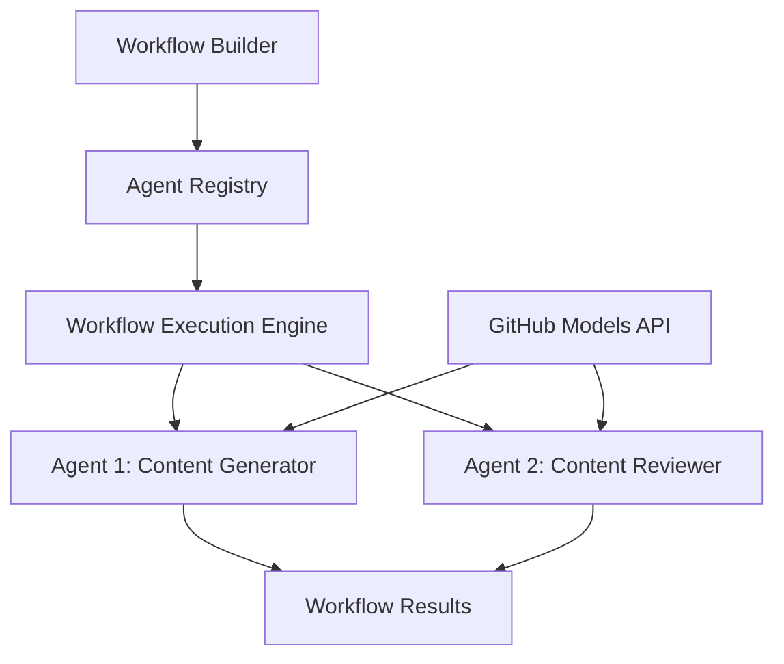

<!--
CO_OP_TRANSLATOR_METADATA:
{
  "original_hash": "034158688d0a45aae06dcbb21b0da5ae",
  "translation_date": "2025-11-11T12:46:10+00:00",
  "source_file": "08-multi-agent/code_samples/workflows-agent-framework/dotNET/01.dotnet-agent-framework-workflow-ghmodel-basic.md",
  "language_code": "ne"
}
-->
# 🔄 GitHub मोडेलहरू (.NET) संग आधारभूत एजेन्ट वर्कफ्लोहरू

## 📋 वर्कफ्लो ओरकेस्ट्रेशन ट्युटोरियल

यो नोटबुकले Microsoft Agent Framework for .NET र GitHub मोडेलहरू प्रयोग गरेर परिष्कृत **एजेन्ट वर्कफ्लोहरू** निर्माण गर्ने तरिका प्रदर्शन गर्दछ। तपाईंले बहु-चरणीय व्यापार प्रक्रियाहरू सिर्जना गर्न सिक्नुहुनेछ जहाँ AI एजेन्टहरूले संरचित ओरकेस्ट्रेशन ढाँचाहरू मार्फत जटिल कार्यहरू पूरा गर्न सहयोग गर्छन्।

## 🎯 सिक्ने उद्देश्यहरू

### 🏗️ **वर्कफ्लो आर्किटेक्चरको आधारभूत कुरा**
- **वर्कफ्लो बिल्डर**: जटिल बहु-चरणीय AI प्रक्रियाहरू डिजाइन र ओरकेस्ट्रेट गर्नुहोस्
- **एजेन्ट समन्वय**: वर्कफ्लोहरूमा धेरै विशेषज्ञ एजेन्टहरू समन्वय गर्नुहोस्
- **GitHub मोडेलहरूको एकीकरण**: वर्कफ्लोहरूमा GitHub को AI मोडेल इनफरेन्स सेवा प्रयोग गर्नुहोस्
- **दृश्य वर्कफ्लो डिजाइन**: राम्रो बुझाइको लागि वर्कफ्लो संरचनाहरू सिर्जना र दृश्यात्मक बनाउनुहोस्

### 🔄 **प्रक्रिया ओरकेस्ट्रेशन ढाँचाहरू**
- **क्रमिक प्रशोधन**: तार्किक क्रममा धेरै एजेन्ट कार्यहरू जडान गर्नुहोस्
- **राज्य व्यवस्थापन**: वर्कफ्लो चरणहरूमा सन्दर्भ र डाटा प्रवाह कायम राख्नुहोस्
- **त्रुटि ह्यान्डलिंग**: बलियो त्रुटि पुन: प्राप्ति र वर्कफ्लो लचिलोपन कार्यान्वयन गर्नुहोस्
- **प्रदर्शन अनुकूलन**: उद्यम-स्तरको अपरेशनहरूको लागि कुशल वर्कफ्लोहरू डिजाइन गर्नुहोस्

### 🏢 **उद्यम वर्कफ्लो अनुप्रयोगहरू**
- **व्यापार प्रक्रिया स्वचालन**: जटिल संगठनात्मक वर्कफ्लोहरू स्वचालित गर्नुहोस्
- **सामग्री उत्पादन पाइपलाइन**: समीक्षा र अनुमोदन चरणहरू सहित सम्पादकीय वर्कफ्लोहरू
- **ग्राहक सेवा स्वचालन**: बहु-चरणीय ग्राहक सोधपुछ समाधान
- **डाटा प्रशोधन वर्कफ्लोहरू**: AI-संचालित रूपान्तरणको साथ ETL वर्कफ्लोहरू

## ⚙️ आवश्यकताहरू र सेटअप

### 📦 **आवश्यक NuGet प्याकेजहरू**

यो वर्कफ्लो प्रदर्शनले धेरै प्रमुख .NET प्याकेजहरू प्रयोग गर्दछ:

```xml
<!-- Core AI Framework -->
<PackageReference Include="Microsoft.Extensions.AI" Version="9.9.0" />

<!-- Agent Framework (Local Development) -->
<!-- Microsoft.Agents.AI.dll - Core agent abstractions -->
<!-- Microsoft.Agents.AI.OpenAI.dll - OpenAI/GitHub Models integration -->

<!-- Configuration and Environment -->
<PackageReference Include="DotNetEnv" Version="3.1.1" />
```

### 🔑 **GitHub मोडेलहरूको कन्फिगरेसन**

**पर्यावरण सेटअप (.env फाइल):**
```env
GITHUB_TOKEN=your_github_personal_access_token
GITHUB_ENDPOINT=https://models.inference.ai.azure.com
GITHUB_MODEL_ID=gpt-4o-mini
```

**GitHub मोडेलहरूको पहुँच:**
1. GitHub मोडेलहरूको लागि साइन अप गर्नुहोस् (हाल प्रिभ्यूमा)
2. मोडेल पहुँच अनुमति सहित व्यक्तिगत पहुँच टोकन उत्पन्न गर्नुहोस्
3. माथि देखाइएको अनुसार वातावरण चरहरू कन्फिगर गर्नुहोस्

### 🏗️ **वर्कफ्लो आर्किटेक्चरको अवलोकन**



**मुख्य घटकहरू:**
- **WorkflowBuilder**: वर्कफ्लोहरू डिजाइन गर्न मुख्य ओरकेस्ट्रेशन इन्जिन
- **AIAgent**: विशिष्ट क्षमताहरू भएका व्यक्तिगत विशेषज्ञ एजेन्टहरू
- **GitHub Models Client**: AI मोडेल इनफरेन्स सेवा एकीकरण
- **Execution Context**: वर्कफ्लो चरणहरू बीच राज्य र डाटा प्रवाह व्यवस्थापन गर्दछ

## 🎨 **उद्यम वर्कफ्लो डिजाइन ढाँचाहरू**

### 📝 **सामग्री उत्पादन वर्कफ्लो**
```
User Request → Content Generation → Quality Review → Final Output
```

### 🔍 **डकुमेन्ट प्रशोधन पाइपलाइन**
```
Document Input → Analysis → Extraction → Validation → Structured Output
```

### 💼 **व्यापार बुद्धिमत्ता वर्कफ्लो**
```
Data Collection → Processing → Analysis → Report Generation → Distribution
```

### 🤝 **ग्राहक सेवा स्वचालन**
```
Customer Inquiry → Classification → Processing → Response Generation → Follow-up
```

## 🏢 **उद्यम लाभहरू**

### 🎯 **विश्वसनीयता र स्केलेबिलिटी**
- **डिटर्मिनिस्टिक कार्यान्वयन**: सुसंगत, पुन: दोहोर्याउन सकिने वर्कफ्लो परिणामहरू
- **त्रुटि पुन: प्राप्ति**: वर्कफ्लोको कुनै पनि चरणमा असफलताको सुन्दर ह्यान्डलिंग
- **प्रदर्शन अनुगमन**: कार्यान्वयन मेट्रिक्स र अनुकूलन अवसरहरू ट्र्याक गर्नुहोस्
- **स्रोत व्यवस्थापन**: AI मोडेल स्रोतहरूको कुशल आवंटन र उपयोग

### 🔒 **सुरक्षा र अनुपालन**
- **सुरक्षित प्रमाणीकरण**: API पहुँचको लागि GitHub टोकन-आधारित प्रमाणीकरण
- **अडिट ट्रेल्स**: वर्कफ्लो कार्यान्वयन र निर्णय बिन्दुहरूको पूर्ण लगिङ
- **पहुंच नियन्त्रण**: वर्कफ्लो कार्यान्वयन र अनुगमनको लागि सूक्ष्म अनुमति
- **डाटा गोपनीयता**: वर्कफ्लोहरूमा संवेदनशील जानकारीको सुरक्षित ह्यान्डलिंग

### 📊 **अवलोकनशीलता र व्यवस्थापन**
- **दृश्य वर्कफ्लो डिजाइन**: प्रक्रिया प्रवाह र निर्भरताहरूको स्पष्ट प्रतिनिधित्व
- **कार्यान्वयन अनुगमन**: वर्कफ्लो प्रगति र प्रदर्शनको वास्तविक-समय ट्र्याकिङ
- **त्रुटि रिपोर्टिङ**: विस्तृत त्रुटि विश्लेषण र डिबगिङ क्षमता
- **प्रदर्शन एनालिटिक्स**: अनुकूलन र क्षमता योजना मेट्रिक्स

आफ्नो पहिलो उद्यम-तयार AI वर्कफ्लो निर्माण गरौं! 🚀

## 💻 कोड चलाउँदै

पूर्ण कार्यान्वयन `01.dotnet-agent-framework-workflow-ghmodel-basic.cs` मा उपलब्ध छ। यो फाइलले प्रदर्शन गर्दछ:

1. **पर्यावरण कन्फिगरेसन** - `.env` फाइलबाट GitHub मोडेलहरूको प्रमाणपत्र लोड गर्दै
2. **OpenAI क्लाइन्ट सेटअप** - GitHub मोडेलहरूको अन्त बिन्दु प्रयोग गर्न क्लाइन्ट कन्फिगर गर्दै
3. **एजेन्ट सिर्जना** - विशेषज्ञ एजेन्टहरू परिभाषित गर्दै (फ्रन्ट डेस्क र कन्सियर्ज)
4. **वर्कफ्लो बिल्डर** - क्रमिक प्रशोधनको साथ बहु-एजेन्ट वर्कफ्लो सिर्जना गर्दै
5. **वर्कफ्लो कार्यान्वयन** - स्ट्रिमिङ परिणामहरूको साथ वर्कफ्लो चलाउँदै

### 🚀 उदाहरण चलाउँदै

```bash
# Make the script executable (Unix/Linux/macOS)
chmod +x 01.dotnet-agent-framework-workflow-ghmodel-basic.cs

# Run the workflow
./01.dotnet-agent-framework-workflow-ghmodel-basic.cs
```

वा Windows मा:
```powershell
dotnet run 01.dotnet-agent-framework-workflow-ghmodel-basic.cs
```

### 📝 अपेक्षित आउटपुट

वर्कफ्लोले:
1. तपाईंको यात्रा गन्तव्य अनुरोध स्वीकार गर्दछ ("म पेरिस जान चाहन्छु")
2. फ्रन्ट डेस्क एजेन्टले प्रारम्भिक सिफारिस प्रदान गर्दछ
3. कन्सियर्ज एजेन्टले सिफारिस समीक्षा र सुधार गर्दछ
4. अन्तिम आउटपुटले पूर्ण संवाद स्ट्रिम प्रदर्शन गर्दछ

### 🔧 अनुकूलन

तपाईं वर्कफ्लोलाई निम्न तरिकाले अनुकूलित गर्न सक्नुहुन्छ:
- एजेन्ट निर्देशनहरू परिमार्जन गरेर तिनीहरूको व्यवहार परिवर्तन गर्नुहोस्
- जटिल बहु-चरणीय वर्कफ्लोहरू सिर्जना गर्न थप एजेन्टहरू थप्नुहोस्
- विभिन्न परिदृश्यहरू परीक्षण गर्न प्रयोगकर्ता सन्देश परिवर्तन गर्नुहोस्
- विभिन्न कार्यान्वयन ढाँचाहरू सिर्जना गर्न वर्कफ्लो किनाराहरू समायोजन गर्नुहोस्

---

<!-- CO-OP TRANSLATOR DISCLAIMER START -->
**अस्वीकरण**:  
यो दस्तावेज AI अनुवाद सेवा [Co-op Translator](https://github.com/Azure/co-op-translator) प्रयोग गरेर अनुवाद गरिएको छ। हामी शुद्धताको लागि प्रयास गर्छौं, तर कृपया ध्यान दिनुहोस् कि स्वचालित अनुवादमा त्रुटि वा अशुद्धता हुन सक्छ। यसको मूल भाषा मा रहेको मूल दस्तावेजलाई आधिकारिक स्रोत मानिनुपर्छ। महत्वपूर्ण जानकारीको लागि, व्यावसायिक मानव अनुवाद सिफारिस गरिन्छ। यस अनुवादको प्रयोगबाट उत्पन्न हुने कुनै पनि गलतफहमी वा गलत व्याख्याको लागि हामी जिम्मेवार हुने छैनौं।
<!-- CO-OP TRANSLATOR DISCLAIMER END -->