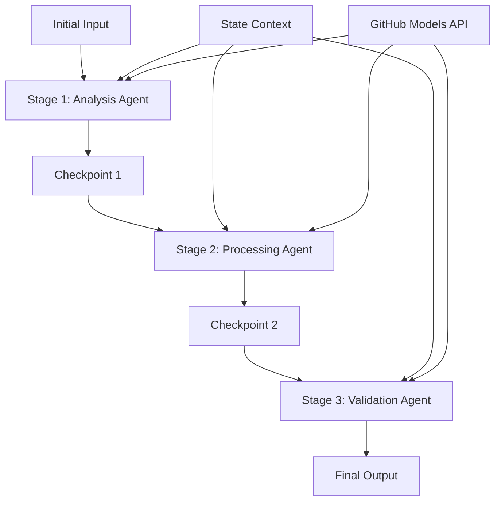

<!--
CO_OP_TRANSLATOR_METADATA:
{
  "original_hash": "1be9c8dcbd79a02d33d2c138684c1394",
  "translation_date": "2025-11-11T13:48:14+00:00",
  "source_file": "08-multi-agent/code_samples/workflows-agent-framework/dotNET/02.dotnet-agent-framework-workflow-ghmodel-sequential.md",
  "language_code": "ne"
}
-->
# ⏩ GitHub मोडेलहरूसँग क्रमिक एजेन्ट वर्कफ्लो (.NET)

## 📋 उन्नत क्रमिक प्रक्रिया ट्यूटोरियल

यो नोटबुकले Microsoft Agent Framework for .NET र GitHub मोडेलहरू प्रयोग गरेर **क्रमिक वर्कफ्लो ढाँचाहरू** प्रदर्शन गर्दछ। तपाईंले एजेन्टहरूले निश्चित क्रममा कार्यान्वयन गर्ने, प्रत्येक चरणले अघिल्लो चरणको नतिजामा आधारित हुने जटिल, चरण-दर-चरण प्रक्रिया पाइपलाइन निर्माण गर्न सिक्नुहुनेछ।

## 🎯 सिक्ने उद्देश्यहरू

### 🔄 **क्रमिक प्रक्रिया आर्किटेक्चर**
- **रेखीय वर्कफ्लो डिजाइन**: स्पष्ट निर्भरतासहित चरण-दर-चरण प्रक्रिया पाइपलाइन सिर्जना गर्नुहोस्
- **स्टेट व्यवस्थापन**: क्रमिक वर्कफ्लो चरणहरूमा सन्दर्भ र डाटा प्रवाह कायम राख्नुहोस्
- **GitHub मोडेलहरूको एकीकरण**: बहु-चरण .NET वर्कफ्लोहरूमा GitHub को AI मोडेलहरू प्रयोग गर्नुहोस्
- **उद्यम पाइपलाइन ढाँचाहरू**: उत्पादन-तयार क्रमिक प्रक्रिया प्रणालीहरू निर्माण गर्नुहोस्

### 🏗️ **उन्नत क्रमिक ढाँचाहरू**
- **स्टेज-गेट प्रक्रिया**: वर्कफ्लो चरणहरू बीच मान्यकरण जाँच बिन्दुहरू कार्यान्वयन गर्नुहोस्
- **सन्दर्भ संरक्षण**: सबै चरणहरूमा स्टेट र संचित ज्ञान कायम राख्नुहोस्
- **त्रुटि प्रसार**: क्रमिक प्रक्रिया चेनहरूमा असफलताहरूलाई सहज रूपमा व्यवस्थापन गर्नुहोस्
- **प्रदर्शन अनुकूलन**: न्यूनतम ओभरहेडसहित कुशल क्रमिक कार्यान्वयन

### 🏢 **उद्यम क्रमिक अनुप्रयोगहरू**
- **डकुमेन्ट प्रक्रिया पाइपलाइन**: बहु-चरण डकुमेन्ट विश्लेषण, रूपान्तरण, र मान्यकरण
- **गुणस्तर आश्वासन वर्कफ्लोहरू**: क्रमिक समीक्षा, मान्यकरण, र स्वीकृति प्रक्रिया
- **सामग्री उत्पादन पाइपलाइन**: अनुसन्धान → लेखन → सम्पादन → समीक्षा → प्रकाशन
- **व्यापार प्रक्रिया स्वचालन**: स्पष्ट चरण निर्भरतासहित बहु-चरण व्यापार वर्कफ्लोहरू

## ⚙️ पूर्वापेक्षाहरू र सेटअप

### 📦 **आवश्यक NuGet प्याकेजहरू**

.NET क्रमिक वर्कफ्लोहरूको लागि आवश्यक प्याकेजहरू:

```xml
<!-- Core AI Framework -->
<PackageReference Include="Microsoft.Extensions.AI" Version="9.9.0" />

<!-- Client Model Abstractions -->
<PackageReference Include="System.ClientModel" Version="1.6.1.0" />

<!-- Azure Identity and Async LINQ Support -->
<PackageReference Include="Azure.Identity" Version="1.15.0" />
<PackageReference Include="System.Linq.Async" Version="6.0.3" />

<!-- Local Agent Framework References -->
<!-- Microsoft.Agents.AI.dll - Core agent abstractions -->
<!-- Microsoft.Agents.AI.OpenAI.dll - GitHub Models integration -->
```

### 🔑 **GitHub मोडेलहरूको कन्फिगरेसन**

**Environment सेटअप (.env फाइल):**
```env
GITHUB_TOKEN=your_github_personal_access_token
GITHUB_ENDPOINT=https://models.inference.ai.azure.com
GITHUB_MODEL_ID=gpt-4o-mini
```

**कन्फिगरेसन व्यवस्थापन:**
```csharp
// Load environment variables securely
Env.Load("../../../.env");
var githubToken = Environment.GetEnvironmentVariable("GITHUB_TOKEN");
var githubEndpoint = Environment.GetEnvironmentVariable("GITHUB_ENDPOINT");
var modelId = Environment.GetEnvironmentVariable("GITHUB_MODEL_ID");
```

### 🏗️ **क्रमिक वर्कफ्लो आर्किटेक्चर**



**मुख्य घटकहरू:**
- **क्रमिक एजेन्टहरू**: प्रत्येक प्रक्रिया चरणको लागि विशेष एजेन्टहरू
- **स्टेट सन्दर्भ**: चरणहरूमा संचित डाटा र निर्णयहरू कायम राख्छ
- **चेकप्वाइन्टहरू**: चरणहरू बीचको मान्यकरण बिन्दुहरू गुणस्तर र स्थिरता सुनिश्चित गर्न
- **GitHub मोडेल क्लाइन्ट**: सबै वर्कफ्लो चरणहरूमा निरन्तर AI मोडेल पहुँच

## 🎨 **क्रमिक वर्कफ्लो डिजाइन ढाँचाहरू**

### 📝 **डकुमेन्ट प्रक्रिया पाइपलाइन**
```
Raw Document → Content Extraction → Analysis → Validation → Structured Output
```

### 🎯 **सामग्री सिर्जना वर्कफ्लो**
```
Brief/Requirements → Research → Content Creation → Review → Final Polish
```

### 🔍 **गुणस्तर आश्वासन पाइपलाइन**
```
Initial Review → Technical Validation → Compliance Check → Final Approval
```

### 💼 **व्यापार बुद्धिमत्ता वर्कफ्लो**
```
Data Collection → Processing → Analysis → Report Generation → Distribution
```

## 🏢 **उद्यम क्रमिक लाभहरू**

### 🎯 **विश्वसनीयता र गुणस्तर**
- **निर्धारित प्रक्रिया**: संरचित चरणहरू मार्फत स्थिर, दोहोरिने परिणामहरू
- **गुणस्तर गेटहरू**: प्रत्येक चरणमा मान्यकरण चेकप्वाइन्टहरूले गुणस्तर सुनिश्चित गर्दछ
- **त्रुटि अलगाव**: एक चरणको समस्याहरूले पछि चरणहरूमा असर गर्दैन
- **अडिट ट्रेलहरू**: प्रत्येक चरणमा निर्णयहरू र रूपान्तरणहरूको पूर्ण ट्र्याकिङ

### 📈 **स्केलेबिलिटी र प्रदर्शन**
- **मोडुलर डिजाइन**: प्रत्येक चरणलाई स्वतन्त्र रूपमा अनुकूलित गर्न सकिन्छ
- **स्रोत व्यवस्थापन**: चरणहरूमा AI मोडेल स्रोतहरूको कुशल आवंटन
- **स्टेट अनुकूलन**: चरणहरू बीच न्यूनतम स्टेट ट्रान्सफरले इष्टतम प्रदर्शन सुनिश्चित गर्दछ
- **समानान्तर चरण समूहहरू**: बहु क्रमिक वर्कफ्लोहरू समानान्तर रूपमा चल्न सक्छन्

### 🔒 **सुरक्षा र अनुपालन**
- **चरण-स्तर सुरक्षा**: विभिन्न प्रक्रिया चरणहरूको लागि फरक सुरक्षा नीतिहरू
- **डाटा मान्यकरण**: प्रत्येक चेकप्वाइन्टमा डाटा अखण्डता र अनुपालन सुनिश्चित गर्नुहोस्
- **पहुंच नियन्त्रण**: विभिन्न वर्कफ्लो चरणहरूको लागि ग्रानुलर अनुमति
- **नियमित अनुपालन**: संरचित प्रक्रियाहरू मार्फत नियामक आवश्यकताहरू पूरा गर्नुहोस्

### 📊 **मोनिटरिङ र एनालिटिक्स**
- **चरण-स्तर मेट्रिक्स**: प्रत्येक वर्कफ्लो चरणको प्रदर्शन मोनिटरिङ
- **बोटलनेक पहिचान**: सुस्त चरणहरू पहिचान र अनुकूलन गर्नुहोस्
- **गुणस्तर मेट्रिक्स**: प्रत्येक चरणमा गुणस्तर र सफलता दर ट्र्याक गर्नुहोस्
- **प्रक्रिया अनुकूलन**: चरण-स्तर एनालिटिक्सको आधारमा निरन्तर सुधार

आउनुहोस्, बलियो क्रमिक AI प्रक्रिया पाइपलाइनहरू निर्माण गरौं! 🚀

## 💻 कोड चलाउँदै

पूर्ण कार्यान्वयन `02.dotnet-agent-framework-workflow-ghmodel-sequential.cs` मा उपलब्ध छ। यो फाइलले **तीन-चरण फर्निचर विश्लेषण वर्कफ्लो** प्रदर्शन गर्दछ:

1. **चरण 1 - बिक्री एजेन्ट**: फर्निचर छविहरू विश्लेषण गर्दछ र खरिद सुझावहरू प्रदान गर्दछ
2. **चरण 2 - मूल्य एजेन्ट**: विस्तृत मूल्य ब्रेकडाउन र बजेट विकल्पहरू प्रदान गर्दछ
3. **चरण 3 - कोट एजेन्ट**: Markdown ढाँचामा व्यावसायिक कोट डकुमेन्ट सिर्जना गर्दछ

### 🏗️ **वर्कफ्लो आर्किटेक्चर**

```
Image Input → Sales Analysis → Price Estimation → Quote Generation → Final Output
```

प्रत्येक एजेन्ट:
- अघिल्लो चरणबाट सन्दर्भको रूपमा आउटपुट प्राप्त गर्दछ
- अघिल्लो विश्लेषणमा विशेष विशेषज्ञता थप्छ
- स्टेट व्यवस्थापन मार्फत वर्कफ्लो निरन्तरता कायम राख्छ

### 🚀 उदाहरण चलाउँदै

**पूर्वापेक्षाहरू:**
- `../imgs/home.png` मा फर्निचर छवि राख्नुहोस् (वा `imgPath` भेरिएबल अपडेट गर्नुहोस्)
- आफ्नो `.env` फाइल GitHub मोडेल क्रेडेन्सियल्ससँग कन्फिगर गर्नुहोस्

```bash
# Make the script executable (Unix/Linux/macOS)
chmod +x 02.dotnet-agent-framework-workflow-ghmodel-sequential.cs

# Run the sequential workflow
./02.dotnet-agent-framework-workflow-ghmodel-sequential.cs
```

वा Windows मा:
```powershell
dotnet run 02.dotnet-agent-framework-workflow-ghmodel-sequential.cs
```

### 📝 अपेक्षित आउटपुट

वर्कफ्लोले:
1. **बिक्री एजेन्ट**: छविबाट फर्निचर वस्तुहरू पहिचान गर्दछ र सिफारिसहरू प्रदान गर्दछ
2. **मूल्य एजेन्ट**: बजेट स्तरहरू र किनमेल सिफारिसहरूसहित विस्तृत मूल्य विश्लेषण थप्छ
3. **कोट एजेन्ट**: सबै जानकारी संश्लेषण गरेर ढाँचाबद्ध कोट डकुमेन्ट सिर्जना गर्दछ

अन्तिम आउटपुट छवि विश्लेषणमा आधारित व्यापक, व्यावसायिक फर्निचर कोट हुनेछ।

### 🔧 अनुकूलन विकल्पहरू

**एजेन्ट व्यवहार परिमार्जन गर्नुहोस्:**
```csharp
// Adjust agent instructions to change their focus
const string SalesAgentInstructions = "Your custom instructions...";
```

**क्रमिक प्रवाह परिवर्तन गर्नुहोस्:**
```csharp
// Add or reorder workflow stages
var workflow = new WorkflowBuilder(salesagent)
    .AddEdge(salesagent, priceagent)
    .AddEdge(priceagent, quoteagent)
    .AddEdge(quoteagent, newAgent)  // Add another stage
    .Build();
```

**भिन्न इनपुट प्रयोग गर्नुहोस्:**
```csharp
// Process text instead of images
ChatMessage userMessage = new ChatMessage(ChatRole.User, [
    new TextContent("Analyze pricing for a modern living room set")
]);
```

### 🎯 वास्तविक-विश्व अनुप्रयोगहरू

यो क्रमिक ढाँचा निम्नका लागि आदर्श छ:
- **ई-कमर्स**: उत्पादन विश्लेषण → मूल्य निर्धारण → कोट सिर्जना
- **रियल इस्टेट**: सम्पत्ति विश्लेषण → मूल्यांकन → सूची सिर्जना
- **बीमा**: दाबी विश्लेषण → मूल्यांकन → कोट सिर्जना
- **सामग्री सिर्जना**: अनुसन्धान → लेखन → सम्पादन → प्रकाशन

### 🔍 स्टेट प्रवाह बुझ्दै

क्रममा प्रत्येक एजेन्टले प्राप्त गर्दछ:
- **मूल इनपुट**: प्रारम्भिक प्रयोगकर्ता सन्देश (छवि + पाठ)
- **अघिल्लो एजेन्ट आउटपुटहरू**: वार्तालाप इतिहासमा सबै अघिल्लो एजेन्ट प्रतिक्रियाहरू
- **संचित सन्दर्भ**: वर्कफ्लो भरमा कायम गरिएको पूर्ण स्टेट

यसले जटिल बहु-चरण प्रक्रिया सक्षम गर्दछ जहाँ प्रत्येक एजेन्टले अघिल्लो चरणहरूको व्यापक सन्दर्भमा आधारित निर्माण गर्दछ।

---

<!-- CO-OP TRANSLATOR DISCLAIMER START -->
**अस्वीकरण**:  
यो दस्तावेज़ AI अनुवाद सेवा [Co-op Translator](https://github.com/Azure/co-op-translator) प्रयोग गरेर अनुवाद गरिएको छ। हामी शुद्धताको लागि प्रयास गर्छौं, तर कृपया ध्यान दिनुहोस् कि स्वचालित अनुवादमा त्रुटिहरू वा अशुद्धताहरू हुन सक्छ। यसको मूल भाषा मा रहेको दस्तावेज़लाई आधिकारिक स्रोत मानिनुपर्छ। महत्वपूर्ण जानकारीको लागि, व्यावसायिक मानव अनुवाद सिफारिस गरिन्छ। यस अनुवादको प्रयोगबाट उत्पन्न हुने कुनै पनि गलतफहमी वा गलत व्याख्याको लागि हामी जिम्मेवार हुने छैनौं।
<!-- CO-OP TRANSLATOR DISCLAIMER END -->