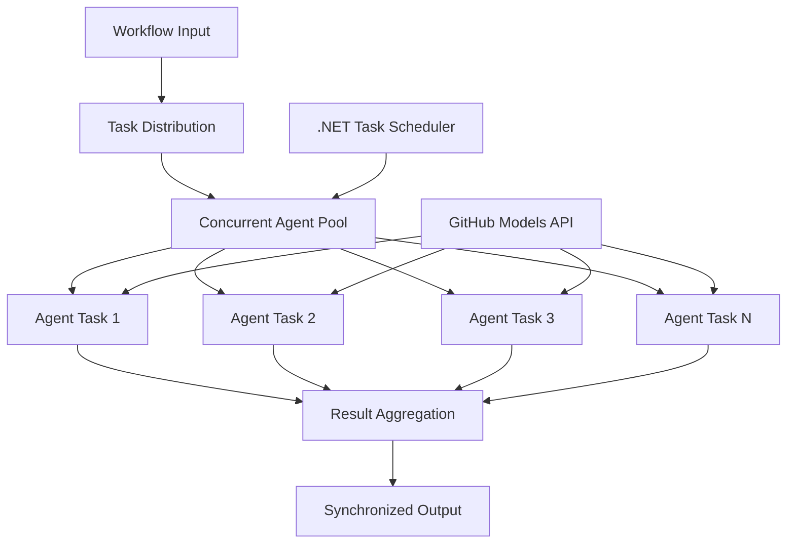

<!--
CO_OP_TRANSLATOR_METADATA:
{
  "original_hash": "b9c6e32c9b5f2fed20b6916984440d88",
  "translation_date": "2025-11-11T13:14:35+00:00",
  "source_file": "08-multi-agent/code_samples/workflows-agent-framework/dotNET/03.dotnet-agent-framework-workflow-ghmodel-concurrent.md",
  "language_code": "ne"
}
-->
# ⚡ GitHub मोडेलहरूसँग समवर्ती एजेन्ट वर्कफ्लो (.NET)

## 📋 उच्च प्रदर्शन समानान्तर प्रशोधन ट्यूटोरियल

यो नोटबुकले **समवर्ती वर्कफ्लो ढाँचाहरू** प्रदर्शन गर्दछ, Microsoft Agent Framework for .NET र GitHub मोडेलहरू प्रयोग गरेर। तपाईंले धेरै AI एजेन्टहरू एकसाथ कार्यान्वयन गरेर throughput अधिकतम बनाउने उच्च प्रदर्शन, समानान्तर प्रशोधन वर्कफ्लो निर्माण गर्न सिक्नुहुनेछ, जबकि समन्वय र डाटा स्थिरता कायम राख्दै।

## 🎯 सिक्ने उद्देश्यहरू

### 🚀 **समवर्ती प्रशोधनको आधारभूत कुरा**
- **समवर्ती एजेन्ट कार्यान्वयन**: अधिकतम प्रदर्शनको लागि धेरै AI एजेन्टहरू एकसाथ चलाउनुहोस्
- **Async/Await ढाँचाहरू**: .NET को async प्रोग्रामिङ मोडेललाई कुशल समवर्तीता लागि प्रयोग गर्नुहोस्
- **GitHub मोडेलहरूको एकीकरण**: GitHub को AI मोडेल इनफरेन्स सेवामा धेरै समवर्ती कलहरू समन्वय गर्नुहोस्
- **स्रोत व्यवस्थापन**: समवर्ती कार्यहरूमा AI मोडेल स्रोतहरू कुशलतापूर्वक व्यवस्थापन गर्नुहोस्

### 🏗️ **उन्नत समवर्ती वास्तुकला**
- **टास्क-आधारित समानान्तरता**: .NET Task Parallel Library प्रयोग गरेर इष्टतम समवर्ती कार्यान्वयन गर्नुहोस्
- **समन्वय ढाँचाहरू**: समवर्ती एजेन्टहरू समन्वय गर्नुहोस् जबकि रेस कन्डिसनहरू टाल्नुहोस्
- **लोड ब्यालेन्सिङ**: उपलब्ध समवर्ती प्रशोधन क्षमता भर काम कुशलतापूर्वक वितरण गर्नुहोस्
- **फॉल्ट टोलरेन्स**: सम्पूर्ण वर्कफ्लो रोक्न बिना व्यक्तिगत एजेन्ट असफलताहरू ह्यान्डल गर्नुहोस्

### 🏢 **उद्यम समवर्ती अनुप्रयोगहरू**
- **उच्च-भोल्युम दस्तावेज प्रशोधन**: धेरै दस्तावेजहरू एकसाथ प्रशोधन गर्नुहोस्
- **रियल-टाइम सामग्री विश्लेषण**: आउने डाटा स्ट्रिमहरूको समवर्ती विश्लेषण गर्नुहोस्
- **ब्याच प्रशोधन अनुकूलन**: ठूलो-स्तरको डाटा प्रशोधन कार्यहरूको throughput अधिकतम गर्नुहोस्
- **मल्टी-मोडल विश्लेषण**: विभिन्न सामग्री प्रकार र ढाँचाहरूको समानान्तर प्रशोधन गर्नुहोस्

## ⚙️ पूर्वापेक्षाहरू र सेटअप

### 📦 **आवश्यक NuGet प्याकेजहरू**

उच्च प्रदर्शन समवर्ती वर्कफ्लोहरूको लागि आवश्यक प्याकेजहरू:

```xml
<!-- Core AI Framework with Async Support -->
<PackageReference Include="Microsoft.Extensions.AI" Version="9.9.0" />

<!-- Client Model Abstractions for API Communication -->
<PackageReference Include="System.ClientModel" Version="1.6.1.0" />

<!-- Azure Identity and Async LINQ for Advanced Operations -->
<PackageReference Include="Azure.Identity" Version="1.15.0" />
<PackageReference Include="System.Linq.Async" Version="6.0.3" />

<!-- Local Agent Framework References -->
<!-- Microsoft.Agents.AI.dll - Core agent abstractions with async support -->
<!-- Microsoft.Agents.AI.OpenAI.dll - GitHub Models integration with concurrency -->
```

### 🔑 **GitHub मोडेलहरूको कन्फिगरेसन**

**Environment सेटअप (.env फाइल):**
```env
GITHUB_TOKEN=your_github_personal_access_token
GITHUB_ENDPOINT=https://models.inference.ai.azure.com
GITHUB_MODEL_ID=gpt-4o-mini
```

**समवर्ती प्रशोधन विचारहरू:**
```csharp
// Configure for concurrent operations
var clientOptions = new OpenAIClientOptions()
{
    Endpoint = new Uri(githubEndpoint),
    // Configure connection pooling for concurrent requests
    NetworkTimeout = TimeSpan.FromMinutes(5)
};
```

### 🏗️ **समवर्ती वर्कफ्लो वास्तुकला**



**मुख्य घटकहरू:**
- **Task Parallel Library**: .NET को समवर्ती कार्यहरूको लागि बिल्ट-इन समर्थन
- **Agent Pool**: समानान्तर प्रशोधनको लागि धेरै एजेन्ट उदाहरणहरू
- **Result Aggregation**: समवर्ती एजेन्ट परिणामहरूको समन्वय र मर्जिंग
- **Synchronization Points**: समवर्ती कार्यहरूमा डाटा स्थिरता सुनिश्चित गर्नुहोस्

## 🎨 **समवर्ती वर्कफ्लो डिजाइन ढाँचाहरू**

### 🔍 **समानान्तर अनुसन्धान र विश्लेषण**
```
Research Topic → Concurrent Research Agents → Result Synthesis → Final Report
```

### 📊 **मल्टी-स्रोत डाटा प्रशोधन**
```
Data Sources → Parallel Processing Agents → Data Integration → Unified Output
```

### 🎭 **सामग्री निर्माण पाइपलाइन**
```
Content Requirements → Concurrent Content Generators → Quality Review → Final Content
```

### 🔄 **Fan-Out/Fan-In प्रशोधन**
```
Single Input → Multiple Concurrent Processors → Result Aggregation → Single Output
```

## 🏢 **उद्यम प्रदर्शन लाभहरू**

### ⚡ **Throughput र स्केलेबिलिटी**
- **रेखीय प्रदर्शन स्केलिङ**: throughput बढाउन थप समवर्ती एजेन्टहरू थप्नुहोस्
- **स्रोत उपयोग**: उपलब्ध AI मोडेल क्षमता को अधिकतम दक्षता
- **प्रशोधन समय घटाउने**: समानान्तर कार्यान्वयन मार्फत महत्वपूर्ण समय कमी
- **इल्यास्टिक स्केलिङ**: कार्यभारको आधारमा समवर्ती एजेन्ट संख्या गतिशील रूपमा समायोजन गर्नुहोस्

### 🛡️ **विश्वसनीयता र लचिलोपन**
- **फॉल्ट आइसोलेसन**: व्यक्तिगत एजेन्ट असफलताहरूले अन्य समवर्ती कार्यहरूलाई असर गर्दैन
- **ग्रेसफुल डिग्रेडेसन**: प्रणालीले घटेको एजेन्ट क्षमता संग सञ्चालन जारी राख्छ
- **त्रुटि पुन:प्राप्ति**: असफल समवर्ती कार्यहरूको लागि स्वचालित पुन: प्रयास संयन्त्रहरू
- **लोड वितरण**: उपलब्ध एजेन्टहरू भर कामको समान वितरण

### 📊 **प्रदर्शन अनुगमन**
- **समवर्ती कार्यान्वयन मेट्रिक्स**: सबै समानान्तर कार्यहरूको प्रदर्शन ट्र्याक गर्नुहोस्
- **स्रोत उपयोग एनालिटिक्स**: CPU, मेमोरी, र नेटवर्क उपयोग अनुगमन गर्नुहोस्
- **Throughput विश्लेषण**: समवर्ती प्रशोधनबाट दक्षता लाभ मापन गर्नुहोस्
- **बोटलनेक डिटेक्शन**: प्रदर्शन बाधाहरू पहिचान र समाधान गर्नुहोस्

### 🔧 **विकास र सञ्चालन**
- **Async प्रोग्रामिङ मोडेल**: .NET को परिपक्व async/await ढाँचाहरू प्रयोग गर्नुहोस्
- **टास्क समन्वय**: समवर्ती वर्कफ्लोहरूको लागि बिल्ट-इन टास्क व्यवस्थापन र समन्वय क्षमता
- **अपवाद ह्यान्डलिङ**: समवर्ती कार्यहरूको लागि व्यापक त्रुटि ह्यान्डलिङ
- **डिबगिङ समर्थन**: समवर्ती वर्कफ्लोहरूको लागि Visual Studio डिबगिङ उपकरणहरू

आउनुहोस् .NET संग उच्च प्रदर्शन समवर्ती AI वर्कफ्लो निर्माण गरौं! 🚀

## 💻 कोड चलाउँदै

पूर्ण कार्यान्वयन `03.dotnet-agent-framework-workflow-ghmodel-concurrent.cs` मा उपलब्ध छ। यो फाइलले यात्रा योजना लागि **Fan-Out/Fan-In समवर्ती वर्कफ्लो** प्रदर्शन गर्दछ:

### 🏗️ **वर्कफ्लो वास्तुकला**

```
User Request → ConcurrentStartExecutor → [Researcher Agent || Planner Agent] → ConcurrentAggregationExecutor → Final Output
```

**मुख्य घटकहरू:**

1. **ConcurrentStartExecutor**: प्रयोगकर्ता अनुरोधलाई सबै एजेन्टहरूमा एकसाथ प्रसारण गर्दछ
2. **Researcher Agent**: गन्तव्यहरू र आकर्षणहरू समानान्तर रूपमा विश्लेषण गर्दछ
3. **Planner Agent**: विस्तृत यात्रा योजनाहरू समानान्तर रूपमा बनाउँछ
4. **ConcurrentAggregationExecutor**: दुबै एजेन्टबाट परिणामहरू सङ्कलन र मर्ज गर्दछ

### 🎯 **Fan-Out/Fan-In ढाँचा**

यो वर्कफ्लोले क्लासिक **Fan-Out/Fan-In** ढाँचालाई प्रदर्शन गर्दछ:
- **Fan-Out**: एक इनपुट सन्देशलाई एकसाथ धेरै एजेन्टहरूमा प्रसारण गरिन्छ
- **समवर्ती प्रशोधन**: धेरै एजेन्टहरू समान कार्यमा समानान्तर रूपमा काम गर्छन्
- **Fan-In**: सबै एजेन्टहरूबाट परिणामहरू सङ्कलन गरिन्छ र एकल आउटपुटमा समाहित गरिन्छ

### 🚀 उदाहरण चलाउँदै

```bash
# Make the script executable (Unix/Linux/macOS)
chmod +x 03.dotnet-agent-framework-workflow-ghmodel-concurrent.cs

# Run the concurrent workflow
./03.dotnet-agent-framework-workflow-ghmodel-concurrent.cs
```

वा Windows मा:
```powershell
dotnet run 03.dotnet-agent-framework-workflow-ghmodel-concurrent.cs
```

### 📝 अपेक्षित आउटपुट

वर्कफ्लोले:
1. **अनुरोध प्रसारण**: "डिसेम्बरमा सिएटलको यात्रा योजना बनाउनुहोस्" दुबै एजेन्टहरूमा पठाउँछ
2. **समवर्ती प्रशोधन**: दुबै एजेन्टहरू एकसाथ काम गर्छन्:
   - Researcher आकर्षणहरू र विवरणहरू पहिचान गर्दछ
   - Planner यात्रा कार्यक्रम र रसद बनाउँछ
3. **Aggregation**: दुबै प्रतिक्रियाहरूलाई व्यापक आउटपुटमा समाहित गर्दछ
4. **परिणाम प्रदर्शन**: सबै जानकारी सहित मर्ज गरिएको यात्रा योजना देखाउँछ

### 🔧 अनुकूलन विकल्पहरू

**थप समवर्ती एजेन्टहरू थप्नुहोस्:**
```csharp
// Create additional specialized agents
AIAgent budgetAgent = openAIClient.GetChatClient(github_model_id).CreateAIAgent(
    name: "Budget-Agent", instructions: "Calculate travel costs...");

// Add to fan-out
var workflow = new WorkflowBuilder(startExecutor)
    .AddFanOutEdge(startExecutor, targets: [researcherAgent, plannerAgent, budgetAgent])
    .AddFanInEdge(aggregationExecutor, sources: [researcherAgent, plannerAgent, budgetAgent])
    .WithOutputFrom(aggregationExecutor)
    .Build();

// Update aggregation count
if (this._messages.Count == 3) { ... }
```

**एजेन्ट निर्देशनहरू परिमार्जन गर्नुहोस्:**
```csharp
const string ResearcherAgentInstructions = "Your custom instructions for research...";
const string PlanAgentInstructions = "Your custom instructions for planning...";
```

**कार्य परिवर्तन गर्नुहोस्:**
```csharp
StreamingRun run = await InProcessExecution.StreamAsync(
    workflow, 
    "Plan a European vacation for 2 weeks in summer"
);
```

### 🎯 वास्तविक-विश्व अनुप्रयोगहरू

यो समवर्ती ढाँचा निम्नका लागि आदर्श छ:
- **सामग्री निर्माण**: धेरै लेखकहरूले विभिन्न खण्डहरू एकसाथ सिर्जना गर्दै
- **कोड समीक्षा**: धेरै समीक्षकहरूले विभिन्न दृष्टिकोणबाट कोड विश्लेषण गर्दै
- **बजार अनुसन्धान**: विभिन्न बजार खण्डहरूको समानान्तर विश्लेषण
- **दस्तावेज प्रशोधन**: समानान्तर रूपमा निकासी, विश्लेषण, र मान्यता
- **मल्टी-पर्सपेक्टिभ विश्लेषण**: एउटै इनपुटमा विविध दृष्टिकोण प्राप्त गर्दै

### 🔍 कस्टम Executors बुझ्दै

**ConcurrentStartExecutor:**
- `IMessageHandler<string>` कार्यान्वयन गर्दछ जसले स्ट्रिङ इनपुट स्वीकार्छ
- सन्देशहरू सबै जडित एजेन्टहरूमा प्रसारण गर्दछ
- समवर्ती प्रशोधन ट्रिगर गर्न `TurnToken` पठाउँछ

**ConcurrentAggregationExecutor:**
- `IMessageHandler<ChatMessage>` कार्यान्वयन गर्दछ जसले एजेन्ट प्रतिक्रियाहरू प्राप्त गर्दछ
- थ्रेड-सुरक्षित तरिकामा सन्देशहरू सङ्कलन गर्दछ
- सबै अपेक्षित प्रतिक्रियाहरू आइपुगेपछि समाहित गर्दछ
- `context.YieldOutputAsync()` प्रयोग गरेर अन्तिम आउटपुट प्रदान गर्दछ

### ⚡ प्रदर्शन लाभहरू

**समवर्ती बनाम क्रमिक:**
- क्रमिक: Agent1 (30s) → Agent2 (30s) = **कुल 60 सेकेन्ड**
- समवर्ती: Agent1 (30s) || Agent2 (30s) = **कुल 30 सेकेन्ड**

**Throughput सुधार**: कार्यभार र स्रोतहरूको आधारमा N समवर्ती एजेन्टहरूको लागि N× छिटो

### 🛡️ त्रुटि ह्यान्डलिङ

वर्कफ्लोले व्यक्तिगत एजेन्ट असफलताहरूलाई सहज रूपमा ह्यान्डल गर्दछ:
- यदि एउटा एजेन्ट असफल हुन्छ भने, अन्यहरू प्रशोधन जारी राख्छन्
- Aggregator ले टाइमआउट तर्क कार्यान्वयन गर्न सक्छ
- आवश्यक परेमा आंशिक परिणामहरू फिर्ता गर्न सकिन्छ

### 📊 उन्नत सुविधाहरू

**डायनामिक एजेन्ट संख्या:**
परिवर्तनीय एजेन्ट संख्यालाई समर्थन गर्न समाहित तर्क परिमार्जन गर्नुहोस्:

```csharp
private int _expectedAgentCount;
private readonly List<ChatMessage> _messages = [];

public async ValueTask HandleAsync(ChatMessage message, IWorkflowContext context)
{
    this._messages.Add(message);
    if (this._messages.Count == _expectedAgentCount)
    {
        // Process aggregation
    }
}
```

यो समवर्ती वर्कफ्लो ढाँचा उच्च प्रदर्शन, स्केलेबल AI एजेन्ट प्रणालीहरू निर्माण गर्न आवश्यक छ!

---

<!-- CO-OP TRANSLATOR DISCLAIMER START -->
**अस्वीकरण**:  
यो दस्तावेज AI अनुवाद सेवा [Co-op Translator](https://github.com/Azure/co-op-translator) प्रयोग गरेर अनुवाद गरिएको छ। हामी शुद्धताको लागि प्रयास गर्छौं, तर कृपया ध्यान दिनुहोस् कि स्वचालित अनुवादमा त्रुटिहरू वा अशुद्धताहरू हुन सक्छ। यसको मूल भाषा मा रहेको मूल दस्तावेजलाई आधिकारिक स्रोत मानिनुपर्छ। महत्वपूर्ण जानकारीको लागि, व्यावसायिक मानव अनुवाद सिफारिस गरिन्छ। यस अनुवादको प्रयोगबाट उत्पन्न हुने कुनै पनि गलतफहमी वा गलत व्याख्याको लागि हामी जिम्मेवार हुनेछैनौं।
<!-- CO-OP TRANSLATOR DISCLAIMER END -->