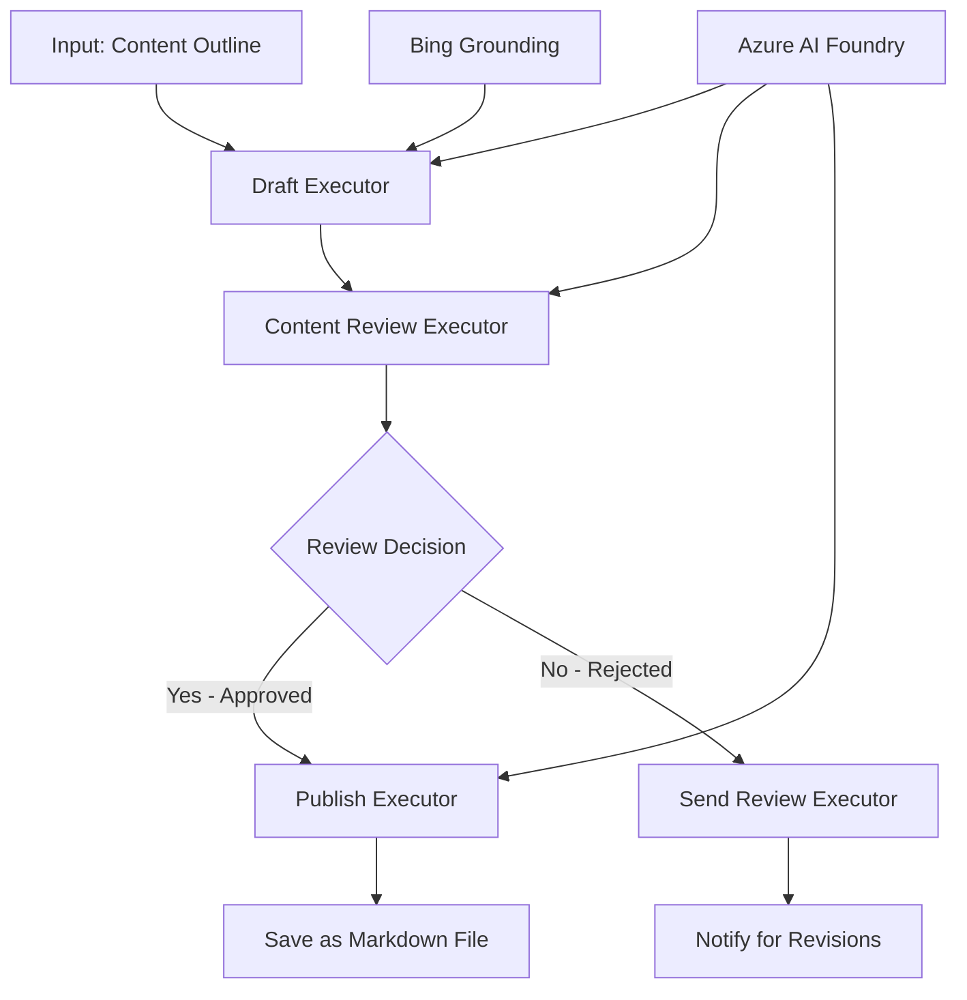

<!--
CO_OP_TRANSLATOR_METADATA:
{
  "original_hash": "8abd335151cee553293b637ee3d80d10",
  "translation_date": "2025-11-11T12:11:01+00:00",
  "source_file": "08-multi-agent/code_samples/workflows-agent-framework/dotNET/04.dotnet-agent-framework-workflow-aifoundry-condition.md",
  "language_code": "ne"
}
-->
# 🔀 Azure AI Foundry (.NET) सँग सर्तसापेक्ष एजेन्ट वर्कफ्लोहरू

## 📋 बुद्धिमानी निर्णय-आधारित वर्कफ्लो ट्यूटोरियल

यो नोटबुकले Azure AI Foundry र Microsoft Agent Framework for .NET प्रयोग गरेर **सर्तसापेक्ष वर्कफ्लो ढाँचाहरू** प्रदर्शन गर्दछ। तपाईंले AI विश्लेषण, व्यापार नियमहरू, र गतिशील अवस्थाहरूको आधारमा बुद्धिमानी रूपमा प्रक्रिया मार्गनिर्देशन गर्ने जटिल, निर्णय-आधारित वर्कफ्लो निर्माण गर्न सिक्नुहुनेछ।

## 🎯 सिक्ने उद्देश्यहरू

### 🧠 **बुद्धिमानी निर्णय आर्किटेक्चर**
- **सर्तसापेक्ष तर्क कार्यान्वयन**: धेरै शाखा बिन्दुहरू सहित जटिल निर्णय वृक्ष निर्माण गर्नुहोस्
- **AI-संचालित मार्गनिर्देशन**: Azure AI Foundry मोडेलहरू प्रयोग गरेर बुद्धिमानी निर्णयहरू गर्नुहोस्
- **गतिशील वर्कफ्लो अनुकूलन**: रनटाइम विश्लेषण र अवस्थाहरूको आधारमा वर्कफ्लो व्यवहार परिवर्तन गर्नुहोस्
- **व्यापार नियम एकीकरण**: वर्कफ्लोहरूमा व्यापार तर्क र अनुपालन आवश्यकताहरू समावेश गर्नुहोस्

### 🔀 **उन्नत सर्तसापेक्ष ढाँचाहरू**
- **बहु-मापदण्ड निर्णय निर्माण**: मार्गनिर्देशन निर्णयहरूको लागि धेरै कारकहरूको मूल्याङ्कन गर्नुहोस्
- **सन्दर्भ-सचेत प्रक्रिया**: संचित वर्कफ्लो सन्दर्भ र इतिहासको आधारमा निर्णय गर्नुहोस्
- **अनुकूलन वर्कफ्लो परिमार्जन**: वास्तविक-समय अवस्थाहरूको आधारमा प्रक्रिया मार्गहरू गतिशील रूपमा समायोजन गर्नुहोस्
- **नियम इन्जिन एकीकरण**: वर्कफ्लोहरूमा जटिल व्यापार नियम इन्जिनहरू कार्यान्वयन गर्नुहोस्

### 🏢 **उद्यम सर्तसापेक्ष अनुप्रयोगहरू**
- **डकुमेन्ट वर्गीकरण र मार्गनिर्देशन**: स्वचालित रूपमा डकुमेन्टहरूलाई उपयुक्त वर्कफ्लोहरूमा वर्गीकृत र मार्गनिर्देशन गर्नुहोस्
- **ग्राहक सेवा ट्रायज**: ग्राहक सोधपुछलाई विशेषज्ञ टोलीहरूमा बुद्धिमानी रूपमा मार्गनिर्देशन गर्नुहोस्
- **अनुपालन र जोखिम प्रक्रिया**: जोखिम मूल्याङ्कनको आधारमा भिन्न मान्यता र समीक्षा प्रक्रियाहरू लागू गर्नुहोस्
- **गुणस्तर आश्वासन वर्कफ्लोहरू**: गुणस्तर मेट्रिक्सको आधारमा सामग्रीलाई उपयुक्त समीक्षा प्रक्रियाहरूमा मार्गनिर्देशन गर्नुहोस्

## ⚙️ पूर्वापेक्षाहरू र सेटअप

### 📦 **आवश्यक NuGet प्याकेजहरू**

सर्तसापेक्ष वर्कफ्लो प्रक्रिया लागि उन्नत प्याकेजहरू:

```xml
<!-- Core AI Framework -->
<PackageReference Include="Microsoft.Extensions.AI" Version="9.9.0" />

<!-- Azure AI Agents with Persistent State -->
<PackageReference Include="Azure.AI.Agents.Persistent" Version="1.2.0-beta.5" />

<!-- Azure Identity and Utilities -->
<PackageReference Include="Azure.Identity" Version="1.15.0" />
<PackageReference Include="System.Linq.Async" Version="6.0.3" />
<PackageReference Include="DotNetEnv" Version="3.1.1" />

<!-- Local Workflow Framework References -->
<!-- Microsoft.Agents.Workflows.dll - Advanced workflow orchestration -->
<!-- Microsoft.Agents.AI.AzureAI.dll - Azure AI Foundry integration -->
<!-- Microsoft.Agents.AI.dll - Core agent abstractions -->
```

### 🔑 **Azure AI Foundry कन्फिगरेसन**

**आवश्यक Azure स्रोतहरू:**
- सर्तसापेक्ष प्रक्रिया मोडेलहरू सहित Azure AI Foundry कार्यक्षेत्र
- उपयुक्त कम्प्युट कोटा र अनुमतिहरू सहित Azure सदस्यता
- निर्णय निर्माण र सामग्री विश्लेषणको लागि तैनात AI मोडेलहरू
- (वैकल्पिक) Bing Search API कनेक्शन ग्राउन्डिङ क्षमताहरूको लागि

**पर्यावरण कन्फिगरेसन (.env फाइल):**
```env
# Azure AI Foundry Configuration
AZURE_AI_PROJECT_ENDPOINT=https://your-project.cognitiveservices.azure.com/
BING_CONNECTION_ID=your-bing-connection-id
```

**प्रमाणीकरण सेटअप:**
```csharp
// Azure CLI or Managed Identity authentication
using Azure.Identity;
var credential = new AzureCliCredential();

// Load environment configuration
DotNetEnv.Env.Load("../../../.env");
```

### 🏗️ **सर्तसापेक्ष वर्कफ्लो आर्किटेक्चर**



**मुख्य घटकहरू:**
- **ड्राफ्ट कार्यान्वयनकर्ता**: प्रारम्भिक सामग्री ड्राफ्टहरू रूपरेखाबाट सिर्जना गर्ने AI एजेन्ट
- **सामग्री समीक्षा कार्यान्वयनकर्ता**: ड्राफ्टको गुणस्तर र अनुपालन मूल्याङ्कन गर्ने AI एजेन्ट
- **सर्तसापेक्ष मार्गनिर्देशन**: समीक्षा परिणामहरूको आधारमा निर्णय तर्क
- **प्रकाशन/समीक्षा मार्गहरू**: स्वीकृत बनाम अस्वीकृत सामग्रीको लागि अलग प्रक्रिया मार्गहरू
- **राज्य व्यवस्थापन**: वर्कफ्लोको क्रममा सामग्री र समीक्षा सन्दर्भ कायम राख्छ

## 🎨 **सर्तसापेक्ष वर्कफ्लो डिजाइन ढाँचाहरू**

### 📋 **गुणस्तर गेटहरू सहित सामग्री उत्पादन**
```
Outline → Draft Creation → Quality Review → {Approve: Publish | Reject: Revise}
```

### 🎯 **जोखिम-आधारित डकुमेन्ट प्रक्रिया**
```
Document → Risk Assessment → {Low: Standard | High: Enhanced Review}
```

### 🔍 **बुद्धिमानी ग्राहक सेवा मार्गनिर्देशन**
```
Customer Query → Analysis → {Simple: FAQ Bot | Complex: Human Agent}
```

### 💼 **अनुपालन-चालित वर्कफ्लोहरू**
```
Content → Compliance Check → {Pass: Publish | Fail: Legal Review}
```

## 🏢 **उद्यम सर्तसापेक्ष लाभहरू**

### 🎯 **बुद्धिमानी स्वचालन**
- **स्मार्ट निर्णय निर्माण**: सामग्री विश्लेषण र सन्दर्भको आधारमा AI-संचालित मार्गनिर्देशन निर्णयहरू
- **अनुकूलन प्रक्रिया**: बदलिँदो अवस्थाहरूको आधारमा स्वचालित रूपमा समायोजन हुने वर्कफ्लोहरू
- **व्यापार नियम प्रवर्तन**: जटिल व्यापार तर्क र नीतिहरूको स्वचालित अनुप्रयोग
- **सन्दर्भ-सचेत मार्गनिर्देशन**: पूर्ण वर्कफ्लो इतिहास र संचित सन्दर्भको आधारमा निर्णयहरू

### 📈 **सञ्चालन उत्कृष्टता**
- **स्रोत आवंटन अनुकूलन**: कामलाई सबैभन्दा उपयुक्त विशेषज्ञहरू र प्रक्रियाहरूमा मार्गनिर्देशन गर्नुहोस्
- **म्यानुअल हस्तक्षेप घटाउनुहोस्**: स्वचालित निर्णय निर्माणले मानव मार्गनिर्देशनको आवश्यकता कम गर्दछ
- **छिटो समाधान समयहरू**: उपयुक्त विशेषज्ञता र प्रक्रिया क्षमताहरूमा सीधा मार्गनिर्देशन
- **समान अनुप्रयोग**: व्यापार नियम र निर्णय मापदण्डहरूको एकरूप अनुप्रयोग

### 🛡️ **जोखिम व्यवस्थापन र अनुपालन**
- **स्वचालित जोखिम मूल्याङ्कन**: सामग्री र स्थिति जोखिम स्तरहरूको AI-संचालित मूल्याङ्कन
- **अनुपालन प्रवर्तन**: आवश्यक नियामक प्रक्रियाहरू मार्फत स्वचालित मार्गनिर्देशन
- **सुरक्षा प्रोटोकल अनुप्रयोग**: जोखिम मूल्याङ्कनको आधारमा उन्नत सुरक्षा उपायहरू लागू गर्नुहोस्
- **अडिट ट्रेल मर्मत**: मार्गनिर्देशन निर्णयहरू र तर्कहरूको पूर्ण दस्तावेजीकरण

### 📊 **विश्लेषण र निरन्तर सुधार**
- **निर्णय विश्लेषण**: मार्गनिर्देशन निर्णयहरूको प्रभावकारिता र शुद्धता ट्र्याक गर्नुहोस्
- **ढाँचा पहिचान**: समयसँगै मार्गनिर्देशन निर्णयहरूमा प्रवृत्ति र ढाँचाहरू पहिचान गर्नुहोस्
- **प्रदर्शन अनुकूलन**: निर्णय मापदण्ड र मार्गनिर्देशन दक्षताको निरन्तर सुधार
- **व्यापार बुद्धिमत्ता**: सामग्री विशेषताहरू र प्रक्रिया आवश्यकताहरूमा अन्तर्दृष्टि

### 🔧 **प्राविधिक उत्कृष्टता**
- **स्थायी राज्य व्यवस्थापन**: वर्कफ्लो कार्यान्वयनको क्रममा जटिल राज्य कायम राख्नुहोस्
- **स्केलेबल आर्किटेक्चर**: उच्च-भोल्युम सर्तसापेक्ष प्रक्रिया आवश्यकताहरूलाई सम्हाल्नुहोस्
- **एकीकरण क्षमता**: विद्यमान व्यापार प्रणालीहरू र प्रक्रियाहरूसँग सहज एकीकरण
- **अनुगमन र अवलोकनीयता**: वर्कफ्लो प्रदर्शन र निर्णयहरूको व्यापक ट्र्याकिङ

.NET सँग बुद्धिमानी, निर्णय-आधारित उद्यम वर्कफ्लोहरू निर्माण गरौं! 🚀

## 💻 कोड चलाउँदै

पूर्ण कार्यान्वयन `04.dotnet-agent-framework-workflow-aifoundry-condition.cs` मा उपलब्ध छ। यसले **गुणस्तर गेटहरू सहित सामग्री उत्पादन वर्कफ्लो** प्रदर्शन गर्दछ:

### 🏗️ **वर्कफ्लो आर्किटेक्चर**

```
Content Outline → Draft Creation → Quality Review → Conditional Routing:
                                                      ├─ Approved (>200 words) → Publish
                                                      └─ Rejected (<200 words) → Review Notification
```

**वर्कफ्लोमा एजेन्टहरू:**
1. **इभान्जेलिस्ट एजेन्ट**: Bing ग्राउन्डिङको साथ रूपरेखाबाट ट्यूटोरियल ड्राफ्टहरू सिर्जना गर्दछ
2. **सामग्री समीक्षक एजेन्ट**: ड्राफ्टको गुणस्तर मूल्याङ्कन गर्दछ (शब्द गणना, पूर्णता)
3. **प्रकाशक एजेन्ट**: स्वीकृत सामग्रीलाई टाइमस्ट्याम्प गरिएको Markdown फाइलको रूपमा बचत गर्दछ

**कस्टम कार्यान्वयनकर्ता:**
1. **DraftExecutor**: ड्राफ्ट सिर्जना समन्वय गर्दछ
2. **ContentReviewExecutor**: गुणस्तर मूल्याङ्कन गर्दछ
3. **PublishExecutor**: स्वीकृत सामग्री प्रकाशन सम्हाल्छ
4. **SendReviewExecutor**: अस्वीकृत सामग्री सूचनाहरू व्यवस्थापन गर्दछ

### 🚀 उदाहरण चलाउँदै

**पूर्वापेक्षाहरू:**
- Azure AI Foundry कार्यक्षेत्र कन्फिगर गरिएको
- Azure CLI प्रमाणीकरण (`az login`)
- (वैकल्पिक) Bing Search कनेक्शन ग्राउन्डिङको लागि

```bash
# Make the script executable (Unix/Linux/macOS)
chmod +x 04.dotnet-agent-framework-workflow-aifoundry-condition.cs

# Run the conditional workflow
./04.dotnet-agent-framework-workflow-aifoundry-condition.cs
```

वा Windows मा:
```powershell
dotnet run 04.dotnet-agent-framework-workflow-aifoundry-condition.cs
```

### 📝 अपेक्षित परिणाम

वर्कफ्लोले:
1. **एजेन्टहरू सिर्जना गर्नुहोस्**: तीन विशेषज्ञ Azure AI Foundry एजेन्टहरू आरम्भ गर्नुहोस्
2. **ड्राफ्ट सिर्जना गर्नुहोस्**: इभान्जेलिस्ट एजेन्टले रूपरेखाबाट ट्यूटोरियल ड्राफ्ट सिर्जना गर्दछ
3. **सामग्री समीक्षा गर्नुहोस्**: सामग्री समीक्षकले ड्राफ्टको गुणस्तर मूल्याङ्कन गर्दछ
4. **सर्तसापेक्ष मार्गनिर्देशन**:
   - **यदि स्वीकृत (>200 शब्द)**: प्रकाशन कार्यान्वयनकर्ताले Markdown फाइलको रूपमा बचत गर्दछ
   - **यदि अस्वीकृत (<200 शब्द)**: समीक्षा सूचना पठाउनुहोस्
5. **परिणाम प्रदर्शन गर्नुहोस्**: अन्तिम वर्कफ्लो परिणाम देखाउनुहोस्

### 🔧 अनुकूलन विकल्पहरू

**समीक्षा मापदण्ड परिमार्जन गर्नुहोस्:**
```csharp
const string ContentReviewerInstructions = @"
You are a content reviewer...
1. Check if content is more than 500 words (instead of 200)
2. Verify technical accuracy
3. Ensure proper formatting
...";
```

**थप सर्तसापेक्ष मार्गहरू थप्नुहोस्:**
```csharp
var workflow = new WorkflowBuilder(draftExecutor)
    .AddEdge(draftExecutor, contentReviewerExecutor)
    .AddEdge(contentReviewerExecutor, publishExecutor, condition: GetCondition("Excellent"))
    .AddEdge(contentReviewerExecutor, editExecutor, condition: GetCondition("Good"))
    .AddEdge(contentReviewerExecutor, sendReviewerExecutor, condition: GetCondition("Poor"))
    .Build();
```

**सामग्री आवश्यकताहरू परिवर्तन गर्नुहोस्:**
```csharp
string OUTLINE_Content = @"
# Your Custom Topic
## Section 1
https://your-reference-url
## Section 2
...
";
```

### 🎯 वास्तविक-विश्व अनुप्रयोगहरू

यो सर्तसापेक्ष वर्कफ्लो ढाँचा निम्नका लागि आदर्श छ:
- **सामग्री व्यवस्थापन प्रणालीहरू**: गुणस्तर गेटहरू सहित स्वचालित सम्पादकीय वर्कफ्लोहरू
- **डकुमेन्ट प्रक्रिया**: वर्गीकरण र अनुपालनको आधारमा डकुमेन्टहरू मार्गनिर्देशन गर्नुहोस्
- **ग्राहक समर्थन**: जटिलता र प्राथमिकताको आधारमा बुद्धिमानी टिकट मार्गनिर्देशन
- **कानूनी समीक्षा**: जोखिम मूल्याङ्कन र मूल्यको आधारमा सम्झौताहरू मार्गनिर्देशन गर्नुहोस्
- **HR प्रक्रिया**: उपयुक्त स्क्रिनिङ वर्कफ्लोहरू मार्फत आवेदनहरू मार्गनिर्देशन गर्नुहोस्

### 🔍 सर्तसापेक्ष तर्क बुझ्दै

**सर्त कार्य:**
```csharp
public Func<object?, bool> GetCondition(string expectedResult) =>
    reviewResult => reviewResult is ReviewResult review && review.Result == expectedResult;
```

यो कार्यले एउटा भविष्यवाणी सिर्जना गर्दछ जसले:
1. परिणाम `ReviewResult` प्रकारको हो कि छैन जाँच गर्दछ
2. `Result` सम्पत्तिलाई अपेक्षित मानसँग तुलना गर्दछ
3. मार्गनिर्देशन निर्धारण गर्न सत्य/झुटो फर्काउँछ

**सर्तसापेक्ष वर्कफ्लो किनाराहरू:**
```csharp
.AddEdge(contentReviewerExecutor, publishExecutor, condition: GetCondition("Yes"))
.AddEdge(contentReviewerExecutor, sendReviewerExecutor, condition: GetCondition("No"))
```

### 📊 उन्नत सुविधाहरू

**JSON स्कीमा मान्यता:**
वर्कफ्लोले संरचित प्रतिक्रियाहरू सुनिश्चित गर्न JSON स्कीमाहरू प्रयोग गर्दछ:

```csharp
// Define response structure
public class ReviewResult
{
    [JsonPropertyName("review_result")]
    public string Result { get; set; } = string.Empty;
    
    [JsonPropertyName("reason")]
    public string Reason { get; set; } = string.Empty;
    
    [JsonPropertyName("draft_content")]
    public string DraftContent { get; set; } = string.Empty;
}

// Apply to agent
ResponseFormat = ChatResponseFormat.ForJsonSchema(
    AIJsonUtilities.CreateJsonSchema(typeof(ReviewResult)), 
    "ReviewResult", 
    "Review Result From DraftContent"
)
```

**Bing ग्राउन्डिङ एकीकरण:**
इभान्जेलिस्ट एजेन्टले Bing ग्राउन्डिङ प्रयोग गरेर वास्तविक-समय जानकारी पहुँच गर्दछ:

```csharp
var bingGroundingConfig = new BingGroundingSearchConfiguration(bing_conn_id);
BingGroundingToolDefinition bingGroundingTool = new(
    new BingGroundingSearchToolParameters([bingGroundingConfig])
);
```

यसले एजेन्टलाई रूपरेखामा URLहरू पछ्याउन र वर्तमान जानकारी निकाल्न सक्षम बनाउँछ।

### 🛡️ त्रुटि व्यवस्थापन

वर्कफ्लोले अस्वीकृत सामग्रीको लागि बलियो त्रुटि व्यवस्थापन समावेश गर्दछ:
- समीक्षा असफलताहरूले वैकल्पिक मार्ग ट्रिगर गर्दछ
- सूचनाहरूले स्पष्ट अस्वीकृति कारणहरू प्रदान गर्दछ
- सामग्री संशोधनको लागि सुरक्षित गरिन्छ

### 🔄 वर्कफ्लो विस्तार गर्दै

**पुनरावलोकन लूप थप्नुहोस्:**
सामग्रीलाई स्वचालित रूपमा पुनः ड्राफ्ट गर्ने फिडब्याक लूप सिर्जना गर्नुहोस्:

```csharp
.AddEdge(contentReviewerExecutor, publishExecutor, condition: GetCondition("Yes"))
.AddEdge(contentReviewerExecutor, draftExecutor, condition: GetCondition("No")) // Loop back
```

**बहु-स्तरीय समीक्षा कार्यान्वयन गर्नुहोस्:**
विभिन्न मापदण्डहरूसँग धेरै समीक्षा चरणहरू थप्नुहोस्:

```csharp
.AddEdge(draftExecutor, technicalReviewer)
.AddEdge(technicalReviewer, editorialReviewer, condition: GetCondition("TechPass"))
.AddEdge(editorialReviewer, publishExecutor, condition: GetCondition("EditPass"))
```

यो सर्तसापेक्ष वर्कफ्लो ढाँचाले जटिल, बुद्धिमानी उद्यम स्वचालन प्रणालीहरू निर्माणको लागि आधार प्रदान गर्दछ! 🚀

---

<!-- CO-OP TRANSLATOR DISCLAIMER START -->
**अस्वीकरण**:  
यो दस्तावेज़ AI अनुवाद सेवा [Co-op Translator](https://github.com/Azure/co-op-translator) प्रयोग गरेर अनुवाद गरिएको छ। हामी शुद्धताको लागि प्रयास गर्छौं, तर कृपया ध्यान दिनुहोस् कि स्वचालित अनुवादमा त्रुटिहरू वा अशुद्धताहरू हुन सक्छ। यसको मूल भाषा मा रहेको दस्तावेज़लाई आधिकारिक स्रोत मानिनुपर्छ। महत्वपूर्ण जानकारीको लागि, व्यावसायिक मानव अनुवाद सिफारिस गरिन्छ। यस अनुवादको प्रयोगबाट उत्पन्न हुने कुनै पनि गलतफहमी वा गलत व्याख्याको लागि हामी जिम्मेवार हुने छैनौं।
<!-- CO-OP TRANSLATOR DISCLAIMER END -->