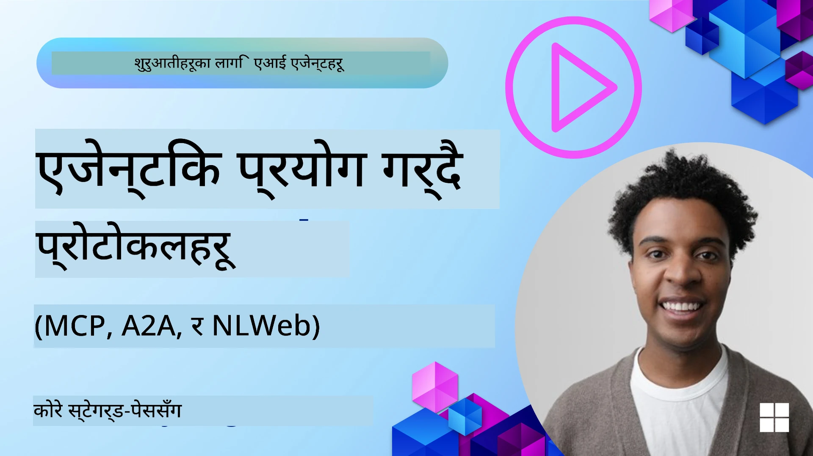
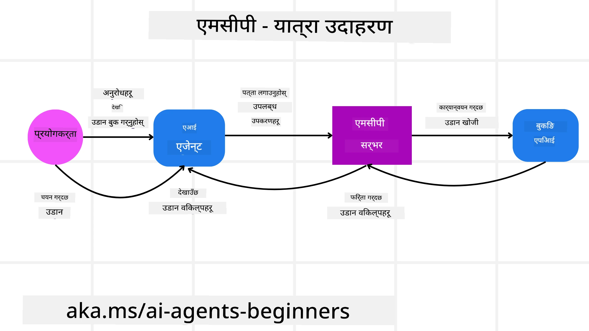
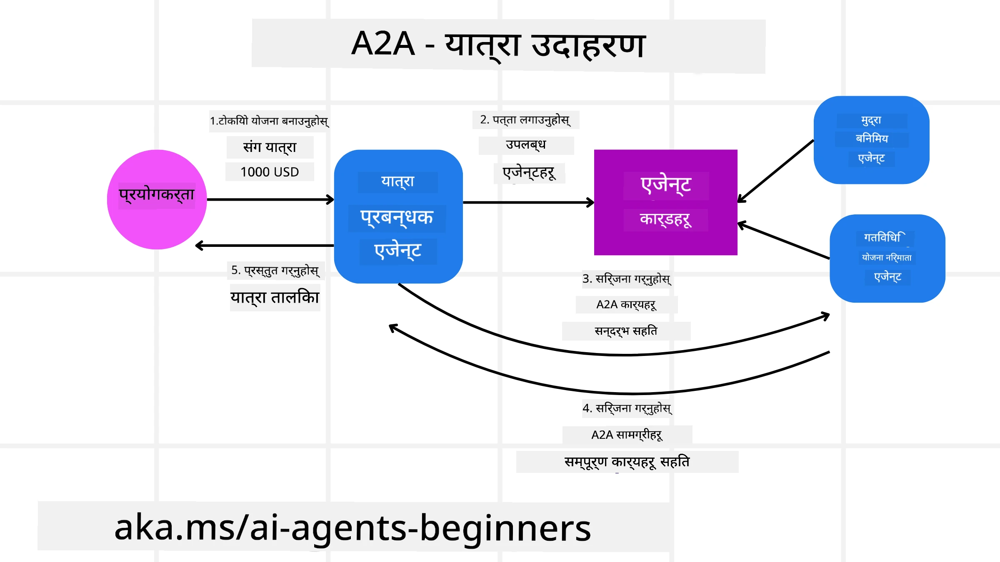
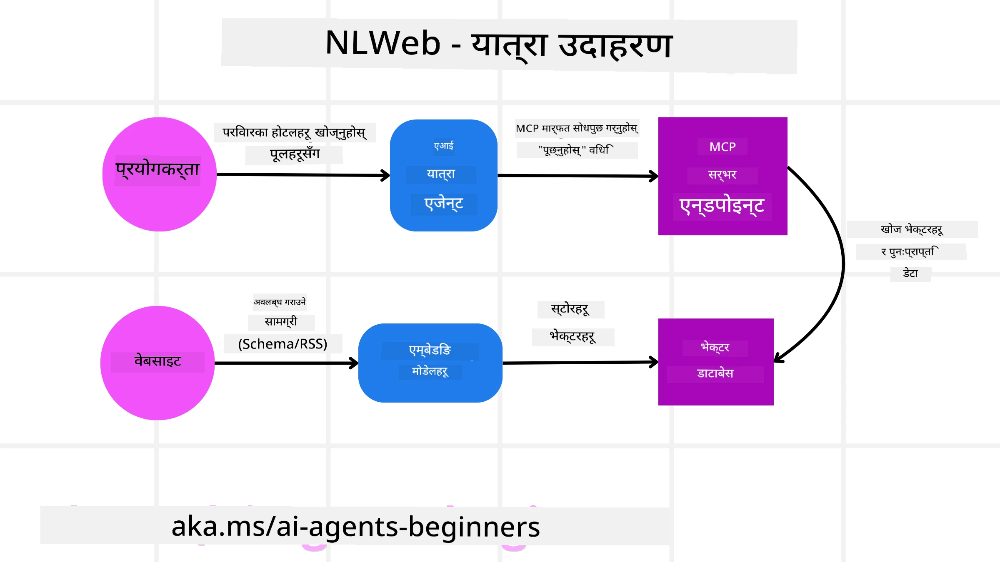

<!--
CO_OP_TRANSLATOR_METADATA:
{
  "original_hash": "aff92c6f019b4627ca9399c6e3882e17",
  "translation_date": "2025-09-18T14:39:14+00:00",
  "source_file": "11-agentic-protocols/README.md",
  "language_code": "ne"
}
-->
# एजेन्टिक प्रोटोकलहरू (MCP, A2A र NLWeb) प्रयोग गर्दै

> _(माथिको चित्रमा क्लिक गरेर यस पाठको भिडियो हेर्नुहोस्)_

जसरी AI एजेन्टहरूको प्रयोग बढ्दै गएको छ, त्यसरी नै मानकीकरण, सुरक्षा, र खुला नवप्रवर्तनलाई समर्थन गर्ने प्रोटोकलहरूको आवश्यकता पनि बढ्दै गएको छ। यस पाठमा, हामी तीन प्रोटोकलहरू - मोडेल कन्टेक्स्ट प्रोटोकल (MCP), एजेन्ट टु एजेन्ट (A2A) र नेचुरल ल्याङ्ग्वेज वेब (NLWeb) को बारेमा छलफल गर्नेछौं।

## परिचय

यस पाठमा हामीले निम्न विषयहरू समेट्नेछौं:

• कसरी **MCP** ले AI एजेन्टहरूलाई बाह्य उपकरणहरू र डाटामा पहुँच प्रदान गरेर प्रयोगकर्ताको कार्यहरू पूरा गर्न मद्दत गर्दछ।

• कसरी **A2A** ले विभिन्न AI एजेन्टहरू बीच सञ्चार र सहकार्यलाई सक्षम बनाउँछ।

• कसरी **NLWeb** ले कुनै पनि वेबसाइटमा प्राकृतिक भाषा इन्टरफेस ल्याएर AI एजेन्टहरूलाई सामग्री पत्ता लगाउन र अन्तर्क्रिया गर्न सक्षम बनाउँछ।

## सिकाइका लक्ष्यहरू

• **पहिचान गर्नुहोस्** MCP, A2A, र NLWeb को मुख्य उद्देश्य र फाइदाहरू AI एजेन्टहरूको सन्दर्भमा।

• **व्याख्या गर्नुहोस्** कसरी प्रत्येक प्रोटोकलले LLMs, उपकरणहरू, र अन्य एजेन्टहरू बीच सञ्चार र अन्तर्क्रिया सहज बनाउँछ।

• **चिन्हित गर्नुहोस्** कसरी प्रत्येक प्रोटोकलले जटिल एजेन्टिक प्रणालीहरू निर्माणमा फरक भूमिका खेल्छ।

## मोडेल कन्टेक्स्ट प्रोटोकल

**मोडेल कन्टेक्स्ट प्रोटोकल (MCP)** एक खुला मानक हो जसले LLMs लाई सन्दर्भ र उपकरणहरू प्रदान गर्न अनुप्रयोगहरूको लागि मानकीकृत तरिका प्रदान गर्दछ। यसले AI एजेन्टहरूलाई विभिन्न डाटा स्रोतहरू र उपकरणहरूसँग एकसमान तरिकामा जडान गर्न "युनिभर्सल एडाप्टर" सक्षम बनाउँछ।

अब हामी MCP का घटकहरू, प्रत्यक्ष API प्रयोगको तुलनामा फाइदाहरू, र AI एजेन्टहरूले MCP सर्भर कसरी प्रयोग गर्न सक्छन् भन्ने उदाहरण हेर्नेछौं।

### MCP का मुख्य घटकहरू

MCP **क्लाइन्ट-सर्भर आर्किटेक्चर** मा सञ्चालन गर्दछ र यसको मुख्य घटकहरू निम्न छन्:

• **होस्टहरू** LLM अनुप्रयोगहरू हुन् (जस्तै, VSCode जस्तो कोड एडिटर) जसले MCP सर्भरसँग जडान सुरु गर्छ।

• **क्लाइन्टहरू** होस्ट अनुप्रयोग भित्रका घटकहरू हुन् जसले सर्भरसँग एक-एक जडान कायम राख्छ।

• **सर्भरहरू** हल्का कार्यक्रमहरू हुन् जसले विशिष्ट क्षमताहरू प्रदान गर्छ।

प्रोटोकलमा तीन मुख्य प्रिमिटिभहरू समावेश छन्, जुन MCP सर्भरका क्षमताहरू हुन्:

• **टूलहरू**: यी छुट्टै कार्यहरू वा कार्यहरू हुन् जुन AI एजेन्टले कुनै कार्य गर्न कल गर्न सक्छ। उदाहरणका लागि, मौसम सेवाले "मौसम प्राप्त गर्नुहोस्" टूल प्रदान गर्न सक्छ, वा ई-कमर्स सर्भरले "उत्पादन खरिद गर्नुहोस्" टूल प्रदान गर्न सक्छ। MCP सर्भरहरूले प्रत्येक टूलको नाम, विवरण, र इनपुट/आउटपुट स्किमालाई आफ्नो क्षमताको सूचीमा विज्ञापन गर्छ।

• **स्रोतहरू**: यी पढ्न मात्र मिल्ने डाटा वस्तुहरू वा कागजातहरू हुन् जुन MCP सर्भरले प्रदान गर्न सक्छ, र क्लाइन्टहरूले तिनीहरूलाई माग अनुसार प्राप्त गर्न सक्छ। उदाहरणहरूमा फाइल सामग्रीहरू, डाटाबेस रेकर्डहरू, वा लग फाइलहरू समावेश छन्। स्रोतहरू पाठ (जस्तै कोड वा JSON) वा बाइनरी (जस्तै छविहरू वा PDFs) हुन सक्छ।

• **प्रम्प्टहरू**: यी पूर्वनिर्धारित टेम्प्लेटहरू हुन् जसले जटिल कार्यप्रवाहहरूलाई सुझाव दिने प्रम्प्टहरू प्रदान गर्छ।

### MCP का फाइदाहरू

MCP ले AI एजेन्टहरूको लागि महत्वपूर्ण फाइदाहरू प्रदान गर्दछ:

• **डायनामिक टूल डिस्कभरी**: एजेन्टहरूले सर्भरबाट उपलब्ध टूलहरूको सूची र तिनीहरूले के गर्छन् भन्ने विवरण गतिशील रूपमा प्राप्त गर्न सक्छन्। यो परम्परागत APIs को तुलनामा फरक छ, जसले अक्सर एकीकृत गर्न स्थिर कोडिङ आवश्यक पार्छ, जसको अर्थ कुनै पनि API परिवर्तनले कोड अपडेट आवश्यक पार्छ। MCP ले "एकपटक एकीकृत गर्नुहोस्" दृष्टिकोण प्रदान गर्दछ, जसले बढी अनुकूलता ल्याउँछ।

• **LLMs बीच अन्तरसञ्चालन**: MCP विभिन्न LLMs मा काम गर्दछ, मुख्य मोडेलहरू स्विच गर्न लचिलोता प्रदान गर्दै प्रदर्शनको लागि मूल्याङ्कन गर्न।

• **मानकीकृत सुरक्षा**: MCP ले मानक प्रमाणीकरण विधि समावेश गर्दछ, अतिरिक्त MCP सर्भरहरूमा पहुँच थप्दा स्केलेबिलिटी सुधार गर्दै। यो विभिन्न परम्परागत APIs का लागि विभिन्न कुञ्जीहरू र प्रमाणीकरण प्रकारहरू व्यवस्थापन गर्न भन्दा सरल छ।

### MCP उदाहरण

कल्पना गर्नुहोस् कि प्रयोगकर्ताले MCP द्वारा संचालित AI सहायक प्रयोग गरेर उडान बुक गर्न चाहन्छ।

1. **जडान**: AI सहायक (MCP क्लाइन्ट) एयरलाइनद्वारा प्रदान गरिएको MCP सर्भरसँग जडान गर्दछ।

2. **टूल डिस्कभरी**: क्लाइन्ट एयरलाइनको MCP सर्भरलाई सोध्छ, "तपाईंसँग उपलब्ध टूलहरू के छन्?" सर्भरले "उडान खोज्नुहोस्" र "उडान बुक गर्नुहोस्" जस्ता टूलहरू प्रदान गर्दछ।

3. **टूल कल गर्नुहोस्**: तपाईं AI सहायकलाई सोध्नुहुन्छ, "कृपया पोर्टल्यान्डबाट होनोलुलुमा उडान खोज्नुहोस्।" AI सहायकले आफ्नो LLM प्रयोग गरेर "उडान खोज्नुहोस्" टूल कल गर्न आवश्यक छ भनेर पहिचान गर्दछ र सम्बन्धित प्यारामिटरहरू (उत्पत्ति, गन्तव्य) MCP सर्भरमा पठाउँछ।

4. **कार्यान्वयन र प्रतिक्रिया**: MCP सर्भरले वास्तविक एयरलाइनको आन्तरिक बुकिङ API मा कल गर्दछ। यसले उडान जानकारी (जस्तै, JSON डाटा) प्राप्त गर्दछ र AI सहायकलाई फिर्ता पठाउँछ।

5. **थप अन्तर्क्रिया**: AI सहायकले उडान विकल्पहरू प्रस्तुत गर्दछ। एकपटक तपाईंले उडान चयन गरेपछि, सहायकले उही MCP सर्भरमा "उडान बुक गर्नुहोस्" टूल कल गर्न सक्छ, बुकिङ पूरा गर्दै।

## एजेन्ट-टु-एजेन्ट प्रोटोकल (A2A)

जहाँ MCP ले LLMs लाई उपकरणहरूसँग जडान गर्न केन्द्रित गर्दछ, **एजेन्ट-टु-एजेन्ट (A2A) प्रोटोकल** यसलाई अर्को स्तरमा लैजान्छ, विभिन्न AI एजेन्टहरू बीच सञ्चार र सहकार्यलाई सक्षम बनाउँदै। A2A ले विभिन्न संगठनहरू, वातावरणहरू, र प्रविधि स्ट्याकहरूमा AI एजेन्टहरूलाई साझा कार्य पूरा गर्न जडान गर्दछ।

हामी A2A का घटकहरू र फाइदाहरूको साथसाथै हाम्रो यात्रा अनुप्रयोगमा यसलाई कसरी लागू गर्न सकिन्छ भन्ने उदाहरणको अध्ययन गर्नेछौं।

### A2A का मुख्य घटकहरू

A2A ले एजेन्टहरू बीच सञ्चारलाई सक्षम बनाउने र प्रयोगकर्ताको उपकार्य पूरा गर्न तिनीहरूलाई सँगै काम गर्न लगाउनेमा केन्द्रित छ। प्रोटोकलका प्रत्येक घटकले यसमा योगदान पुर्‍याउँछ:

#### एजेन्ट कार्ड

जसरी MCP सर्भरले टूलहरूको सूची साझा गर्छ, एजेन्ट कार्डमा निम्न समावेश हुन्छ:
- एजेन्टको नाम।
- यसले पूरा गर्ने **सामान्य कार्यहरूको विवरण**।
- **विशिष्ट सीपहरूको सूची** विवरणसहित, अन्य एजेन्टहरू (वा मानव प्रयोगकर्ताहरू) लाई यो एजेन्टलाई कहिले र किन कल गर्ने भन्ने बुझ्न मद्दत गर्न।
- एजेन्टको **वर्तमान अन्त बिन्दु URL**।
- एजेन्टको **संस्करण** र **क्षमताहरू** जस्तै स्ट्रिमिङ प्रतिक्रियाहरू र पुश सूचनाहरू।

#### एजेन्ट कार्यान्वयनकर्ता

एजेन्ट कार्यान्वयनकर्ता **प्रयोगकर्ताको च्याटको सन्दर्भलाई टाढाको एजेन्टमा पठाउन जिम्मेवार हुन्छ**, टाढाको एजेन्टलाई पूरा गर्नुपर्ने कार्य बुझ्न यो आवश्यक छ। A2A सर्भरमा, एजेन्टले आफ्नो आन्तरिक उपकरणहरू प्रयोग गरेर कार्यहरू कार्यान्वयन गर्न आउने अनुरोधहरू पार्स गर्न आफ्नो LLM प्रयोग गर्दछ।

#### आर्टिफ्याक्ट

एकपटक टाढाको एजेन्टले अनुरोधित कार्य पूरा गरेपछि, यसको कार्य उत्पादन आर्टिफ्याक्टको रूपमा सिर्जना हुन्छ। आर्टिफ्याक्टले **एजेन्टको कार्यको परिणाम**, **के पूरा भयो भन्ने विवरण**, र **प्रोटोकल मार्फत पठाइएको पाठ सन्दर्भ** समावेश गर्दछ। आर्टिफ्याक्ट पठाएपछि, टाढाको एजेन्टसँगको जडान आवश्यक नपरेसम्म बन्द हुन्छ।

#### इभेन्ट क्व्यु

यो घटक **अपडेटहरू ह्यान्डल गर्न र सन्देशहरू पास गर्न** प्रयोग गरिन्छ। उत्पादनमा, एजेन्टिक प्रणालीहरूको लागि यो विशेष रूपमा महत्त्वपूर्ण छ, किनकि कार्य पूरा गर्न समय लाग्न सक्ने अवस्थामा एजेन्टहरू बीचको जडान कार्य पूरा हुनु अघि बन्द हुनबाट रोक्न।

### A2A का फाइदाहरू

• **सहकार्य सुधार**: यसले विभिन्न विक्रेता र प्लेटफर्मका एजेन्टहरूलाई अन्तर्क्रिया गर्न, सन्दर्भ साझा गर्न, र सँगै काम गर्न सक्षम बनाउँछ, परम्परागत रूपमा असम्बद्ध प्रणालीहरूमा सहज स्वचालनलाई सहज बनाउँछ।

• **मोडेल चयनको लचिलोता**: प्रत्येक A2A एजेन्टले आफ्नो अनुरोधहरू सेवा गर्न कुन LLM प्रयोग गर्ने निर्णय गर्न सक्छ, एजेन्टहरू प्रति अनुकूलित वा फाइन-ट्युन गरिएको मोडेलहरू अनुमति दिँदै, केही MCP परिदृश्यहरूमा एकल LLM जडानको विपरीत।

• **निर्मित प्रमाणीकरण**: प्रमाणीकरण A2A प्रोटोकलमा सिधै एकीकृत गरिएको छ, एजेन्ट अन्तर्क्रियाको लागि बलियो सुरक्षा फ्रेमवर्क प्रदान गर्दै।

### A2A उदाहरण

हाम्रो यात्रा बुकिङ परिदृश्यलाई विस्तार गरौं, तर यस पटक A2A प्रयोग गर्दै।

1. **प्रयोगकर्ताको अनुरोध मल्टि-एजेन्टमा**: प्रयोगकर्ताले "ट्राभल एजेन्ट" A2A क्लाइन्ट/एजेन्टसँग अन्तर्क्रिया गर्छ, सायद भन्छ, "कृपया होनोलुलुमा अर्को हप्ता उडान, होटल, र भाडाको कार सहित सम्पूर्ण यात्रा बुक गर्नुहोस्।"

2. **ट्राभल एजेन्टद्वारा समन्वय**: ट्राभल एजेन्टले यो जटिल अनुरोध प्राप्त गर्दछ। यसले कार्यको बारेमा तर्क गर्न र अन्य विशेषज्ञ एजेन्टहरूसँग अन्तर्क्रिया गर्न आवश्यक छ भनेर निर्धारण गर्न आफ्नो LLM प्रयोग गर्दछ।

3. **एजेन्टहरू बीचको सञ्चार**: ट्राभल एजेन्टले A2A प्रोटोकल प्रयोग गरेर डाउनस्ट्रीम एजेन्टहरूसँग जडान गर्दछ, जस्तै "एयरलाइन एजेन्ट," "होटल एजेन्ट," र "कार रेन्टल एजेन्ट" जुन विभिन्न कम्पनीहरूले सिर्जना गरेका छन्।

4. **प्रतिनिधित्व गरिएको कार्य कार्यान्वयन**: ट्राभल एजेन्टले यी विशेषज्ञ एजेन्टहरूलाई विशिष्ट कार्यहरू पठाउँछ (जस्तै, "होनोलुलुमा उडानहरू खोज्नुहोस्," "होटल बुक गर्नुहोस्," "कार भाडामा लिनुहोस्")। यी प्रत्येक विशेषज्ञ एजेन्टहरूले, आफ्नै LLMs चलाउँदै र आफ्नै उपकरणहरू प्रयोग गर्दै (जसले MCP सर्भरहरू पनि हुन सक्छ), बुकिङको विशिष्ट भाग पूरा गर्छ।

5. **समेकित प्रतिक्रिया**: एकपटक सबै डाउनस्ट्रीम एजेन्टहरूले आफ्नो कार्यहरू पूरा गरेपछि, ट्राभल एजेन्टले परिणामहरू (उडान विवरणहरू, होटल पुष्टि, कार भाडा बुकिङ) संकलन गर्दछ र प्रयोगकर्तालाई व्यापक, च्याट शैली प्रतिक्रिया पठाउँछ।

## नेचुरल ल्याङ्ग्वेज वेब (NLWeb)

वेबसाइटहरू लामो समयदेखि इन्टरनेटमा जानकारी र डाटामा पहुँच गर्न प्रयोगकर्ताहरूको प्राथमिक माध्यम बनेका छन्।

अब हामी NLWeb का विभिन्न घटकहरू, NLWeb का फाइदाहरू, र हाम्रो यात्रा अनुप्रयोगको उदाहरण हेरेर NLWeb कसरी काम गर्छ भन्ने अध्ययन गर्नेछौं।

### NLWeb का घटकहरू

- **NLWeb एप्लिकेसन (कोर सेवा कोड)**: प्राकृतिक भाषा प्रश्नहरू प्रशोधन गर्ने प्रणाली। यसले प्लेटफर्मका विभिन्न भागहरूलाई जडान गरेर प्रतिक्रिया सिर्जना गर्दछ। तपाईं यसलाई वेबसाइटको प्राकृतिक भाषा सुविधाहरूलाई शक्ति दिने **इन्जिन** को रूपमा सोच्न सक्नुहुन्छ।

- **NLWeb प्रोटोकल**: यो वेबसाइटसँग प्राकृतिक भाषा अन्तर्क्रिया गर्नको लागि **मूल नियमहरूको सेट** हो। यसले JSON ढाँचामा प्रतिक्रिया पठाउँछ (प्रायः Schema.org प्रयोग गर्दै)। यसको उद्देश्य "AI वेब" को लागि सरल आधार सिर्जना गर्नु हो, ठीक त्यस्तै HTML ले अनलाइन कागजातहरू साझा गर्न सम्भव बनायो।

- **MCP सर्भर (मोडेल कन्टेक्स्ट प्रोटोकल अन्त बिन्दु)**: प्रत्येक NLWeb सेटअप पनि **MCP सर्भर** को रूपमा काम गर्दछ। यसको मतलब यो **टूलहरू (जस्तै "सोध्नुहोस्" विधि) र डाटा** अन्य AI प्रणालीहरूसँग साझा गर्न सक्छ। व्यवहारमा, यसले वेबसाइटको सामग्री र क्षमताहरूलाई AI एजेन्टहरूद्वारा प्रयोग गर्न योग्य बनाउँछ, साइटलाई व्यापक "एजेन्ट इकोसिस्टम" को भाग बनाउँदै।

- **एम्बेडिङ मोडेलहरू**: यी मोडेलहरू वेबसाइट सामग्रीलाई **संख्यात्मक प्रतिनिधित्वहरू (एम्बेडिङ) मा रूपान्तरण गर्न प्रयोग गरिन्छ**। यी एम्बेडिङहरूले कम्प्युटरहरूले तुलना र खोज गर्न सक्ने तरिकामा अर्थलाई समात्छ। तिनीहरू विशेष डाटाबेसमा भण्डारण गरिन्छ, र प्रयोगकर्ताहरूले कुन एम्बेडिङ मोडेल प्रयोग गर्न चाहन्छन् छनोट गर्न सक्छन्।

- **भेक्टर डाटाबेस (पुनःप्राप्ति संयन्त्र)**: यो डाटाबेसले **वेबसाइट सामग्रीको एम्बेडिङहरू भण्डारण गर्दछ**। जब कसैले प्रश्न सोध्छ, NLWeb ले भेक्टर डाटाबेस जाँच गरेर सबैभन्दा सान्दर्भिक जानकारी छिटो फेला पार्छ। यसले सम्भावित उत्तरहरूको छिटो सूची दिन्छ, समानताका आधारमा क्रमबद्ध। NLWeb विभिन्न भेक्टर भण्डारण प्रणालीहरूसँग काम गर्दछ जस्तै Qdrant, Snowflake, Milvus, Azure AI Search, र Elasticsearch।

### NLWeb उदाहरणद्वारा

हाम्रो यात्रा बुकिङ वेबसाइटलाई फेरि विचार गर्नुहोस्, तर यस पटक NLWeb द्वारा संचालित।

1. **डाटा इन्टेक्सन**: यात्रा वेबसाइटको अवस्थित उत्पादन क्याटलगहरू (जस्तै, उडान सूचीहरू, होटल विवरणहरू, भ्रमण प्याकेजहरू) Schema.org प्रयोग गरेर ढाँचाबद्ध गरिन्छ वा RSS फिडहरू मार्फत लोड गरिन्छ। NLWeb का उपकरणहरूले यो संरचित डाटा इन्टेक्सन गर्छन्, एम्बेडिङहरू सिर्जना गर्छन्, र तिनीहरूलाई स्थानीय वा टाढाको भेक्टर डाटाबेसमा भण्डारण गर्छन्।

2. **प्राकृतिक भाषा प्रश्न (मानव)**: प्रयोगकर्ता वेबसाइटमा जान्छ र मेनुहरू नेभिगेट गर्ने सट्टा च्याट इन्टरफेसमा टाइप गर्छ: "मलाई होनोलुलुमा अर्को हप्ता परिवारमैत्री होटल खोज्नुहोस् जसमा पोखरी होस्।"

3. **NLWeb प्रशोधन**: NLWeb एप्लिकेसनले यो प्रश्न प्राप्त गर्छ। यसले प्रश्नलाई बुझ्न LLM मा पठाउँछ र एकै समयमा यसको भेक्टर डाटाबेसमा सम्बन्धित होटल सूचीहरूको खोजी गर्छ।

4. **सटीक परिणामहरू**: LLM ले डाटाबेसबाट खोज परिणामहरू व्याख्या गर्न मद्दत गर्छ, "परिवारमैत्री," "पोखरी," र "होनोलुलु" मापदण्डहरूमा आधारित उत्कृष्ट मिलानहरू पहिचान गर्छ, र त्यसपछि प्राकृतिक भाषा प्रतिक्रिया ढाँचाबद्ध गर्छ। महत्त्वपूर्ण कुरा, प्रतिक्रिया वेबसाइटको क्याटलगबाट वास्तविक होटलहरूलाई सन्दर्भित गर्छ, बनावटी जानकारीबाट बच्दै।

5. **AI एजेन्ट अन्तर्क्रिया**: किनकि NLWeb MCP सर्भरको रूपमा काम गर्दछ, बाह्य AI ट्राभल एजेन्टले पनि वेबसाइटको NLWeb इन्स्ट्यान्ससँग जडान गर्न सक्छ। AI एजेन्टले वेबसाइटलाई सिधै सोध्न MCP विधि `ask` प्रयोग गर्न सक्छ: `ask("होटलले सिफारिस गरेका होनोलुलु क्षेत्रमा कुनै भेगन-मैत्री रेस्टुरेन्ट छन्?")`। NLWeb इन्स्ट्यान्सले यसलाई प्रशोधन गर्छ, यसको डाटाबेसमा रेस्टुरेन्ट जानकारी (यदि लोड गरिएको छ भने) प्रयोग गरेर, र संरचित JSON प्रतिक्रिया फ

---

**अस्वीकरण**:  
यो दस्तावेज़ AI अनुवाद सेवा [Co-op Translator](https://github.com/Azure/co-op-translator) प्रयोग गरेर अनुवाद गरिएको छ। हामी यथासम्भव शुद्धता सुनिश्चित गर्न प्रयास गर्छौं, तर कृपया ध्यान दिनुहोस् कि स्वचालित अनुवादमा त्रुटि वा अशुद्धता हुन सक्छ। यसको मूल भाषा मा रहेको मूल दस्तावेज़लाई आधिकारिक स्रोत मानिनुपर्छ। महत्वपूर्ण जानकारीको लागि, व्यावसायिक मानव अनुवाद सिफारिस गरिन्छ। यस अनुवादको प्रयोगबाट उत्पन्न हुने कुनै पनि गलतफहमी वा गलत व्याख्याको लागि हामी जिम्मेवार हुने छैनौं।