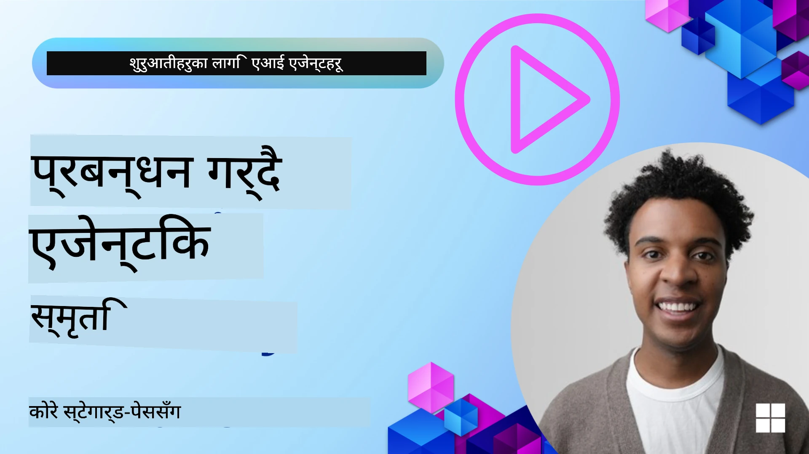

<!--
CO_OP_TRANSLATOR_METADATA:
{
  "original_hash": "a1d90991499ad697c4ad24decaf36968",
  "translation_date": "2025-12-09T12:11:07+00:00",
  "source_file": "13-agent-memory/README.md",
  "language_code": "ne"
}
-->
# एआई एजेन्टहरूको मेमोरी  

एआई एजेन्टहरू निर्माण गर्दा हुने विशेष फाइदाहरूको चर्चा गर्दा मुख्यत: दुई कुराहरूमा ध्यान दिइन्छ: टास्क पूरा गर्न उपकरणहरू प्रयोग गर्ने क्षमता र समयसँगै सुधार गर्ने क्षमता। मेमोरी भनेको आत्म-सुधार गर्ने एजेन्ट निर्माणको आधार हो, जसले हाम्रो प्रयोगकर्ताहरूलाई राम्रो अनुभव प्रदान गर्न सक्छ।

यस पाठमा, हामी एआई एजेन्टहरूको लागि मेमोरी के हो, कसरी यसलाई व्यवस्थापन गर्ने र हाम्रो एप्लिकेसनहरूको फाइदाका लागि प्रयोग गर्ने भन्ने कुरा हेर्नेछौं।

## परिचय  

यस पाठले निम्न विषयहरू समेट्छ:  

• **एआई एजेन्ट मेमोरीको समझ**: मेमोरी के हो र एजेन्टहरूको लागि किन आवश्यक छ।  

• **मेमोरी कार्यान्वयन र भण्डारण**: छोटो अवधिको र लामो अवधिको मेमोरीमा केन्द्रित गर्दै, एआई एजेन्टहरूमा मेमोरी क्षमता थप्ने व्यावहारिक विधिहरू।  

• **एआई एजेन्टहरूलाई आत्म-सुधार गर्ने बनाउने**: मेमोरीले कसरी एजेन्टहरूलाई अघिल्लो अन्तरक्रियाबाट सिक्न र समयसँगै सुधार गर्न सक्षम बनाउँछ।  

## उपलब्ध कार्यान्वयनहरू  

यस पाठमा दुई व्यापक नोटबुक ट्युटोरियलहरू समावेश छन्:  

• **[13-agent-memory.ipynb](./13-agent-memory.ipynb)**: मेमोरीलाई Mem0 र Azure AI Search प्रयोग गरेर Semantic Kernel फ्रेमवर्कसँग कार्यान्वयन गर्दछ।  

• **[13-agent-memory-cognee.ipynb](./13-agent-memory-cognee.ipynb)**: Cognee प्रयोग गरेर संरचित मेमोरी कार्यान्वयन गर्दछ, जसले embeddings द्वारा समर्थित ज्ञान ग्राफ निर्माण, ग्राफ दृश्य, र बौद्धिक पुनःप्राप्ति प्रदान गर्दछ।  

## सिकाइका लक्ष्यहरू  

यस पाठ पूरा गरेपछि, तपाईंलाई निम्न कुराहरू थाहा हुनेछ:  

• **एआई एजेन्ट मेमोरीका विभिन्न प्रकारहरू छुट्याउन सक्ने**, जस्तै कार्यरत, छोटो अवधिको, र लामो अवधिको मेमोरी, साथै विशेष प्रकारहरू जस्तै पर्सोना र एपिसोडिक मेमोरी।  

• **एआई एजेन्टहरूको लागि छोटो र लामो अवधिको मेमोरी कार्यान्वयन र व्यवस्थापन गर्ने**, Semantic Kernel फ्रेमवर्क प्रयोग गर्दै, Mem0, Cognee, Whiteboard मेमोरी जस्ता उपकरणहरू प्रयोग गर्दै र Azure AI Searchसँग एकीकृत गर्दै।  

• **आत्म-सुधार गर्ने एआई एजेन्टहरूको पछाडि रहेको सिद्धान्तहरू बुझ्ने** र कसरी बलियो मेमोरी व्यवस्थापन प्रणालीहरूले निरन्तर सिकाइ र अनुकूलनमा योगदान पुर्‍याउँछ।  

## एआई एजेन्ट मेमोरीको समझ  

यसको मूलमा, **एआई एजेन्टहरूको लागि मेमोरी भनेको तिनीहरूले जानकारी राख्न र सम्झन सक्ने संयन्त्रहरूलाई जनाउँछ**। यो जानकारी वार्ताको विशिष्ट विवरणहरू, प्रयोगकर्ताको प्राथमिकताहरू, अघिल्लो कार्यहरू, वा सिकिएका ढाँचाहरू हुन सक्छ।  

मेमोरी बिना, एआई एप्लिकेसनहरू प्राय: स्टेटलेस हुन्छन्, जसको अर्थ प्रत्येक अन्तरक्रिया नयाँबाट सुरु हुन्छ। यसले एजेन्टले अघिल्लो सन्दर्भ वा प्राथमिकताहरू "भुल्ने" दोहोरिने र निराशाजनक प्रयोगकर्ता अनुभवको कारण बनाउँछ।  

### मेमोरी किन महत्त्वपूर्ण छ?  

एजेन्टको बुद्धिमत्ता अघिल्लो जानकारी सम्झन र प्रयोग गर्ने क्षमतासँग गहिरो रूपमा जोडिएको छ। मेमोरीले एजेन्टहरूलाई निम्न प्रकारका बनाउँछ:  

• **प्रतिबिम्बित**: अघिल्लो कार्यहरू र परिणामहरूबाट सिक्ने।  

• **अन्तरक्रियात्मक**: चलिरहेको वार्ताको सन्दर्भ कायम राख्ने।  

• **प्रोएक्टिभ र प्रतिक्रियात्मक**: ऐतिहासिक डाटाको आधारमा आवश्यकताहरू अनुमान गर्ने वा उपयुक्त प्रतिक्रिया दिने।  

• **स्वायत्त**: भण्डारण गरिएको ज्ञानको आधारमा स्वतन्त्र रूपमा काम गर्ने।  

मेमोरी कार्यान्वयनको लक्ष्य एजेन्टहरूलाई थप **विश्वसनीय र सक्षम** बनाउनु हो।  

### मेमोरीका प्रकारहरू  

#### कार्यरत मेमोरी  

यसलाई एजेन्टले एकल, चलिरहेको कार्य वा सोच प्रक्रियाको समयमा प्रयोग गर्ने स्क्र्याच पेपरको रूपमा सोच्न सकिन्छ। यसले अर्को चरण गणना गर्न आवश्यक तत्काल जानकारी राख्छ।  

एआई एजेन्टहरूको लागि, कार्यरत मेमोरीले वार्ताबाट सबैभन्दा सान्दर्भिक जानकारी समेट्छ, चाहे पूर्ण च्याट इतिहास लामो वा छोटो हो। यसले आवश्यकताहरू, प्रस्तावहरू, निर्णयहरू, र कार्यहरू जस्ता प्रमुख तत्वहरू निकाल्नमा ध्यान केन्द्रित गर्दछ।  

**कार्यरत मेमोरी उदाहरण**  

यात्रा बुक गर्ने एजेन्टमा, कार्यरत मेमोरीले प्रयोगकर्ताको वर्तमान अनुरोध समेट्न सक्छ, जस्तै "म पेरिसको यात्रा बुक गर्न चाहन्छु"। यो विशिष्ट आवश्यकता एजेन्टको तत्काल सन्दर्भमा राखिन्छ ताकि वर्तमान अन्तरक्रियालाई मार्गदर्शन गर्न सकियोस्।  

#### छोटो अवधिको मेमोरी  

यो प्रकारको मेमोरीले एकल वार्ता वा सत्रको अवधिको लागि जानकारी राख्छ। यो वर्तमान च्याटको सन्दर्भ हो, जसले एजेन्टलाई संवादको अघिल्लो चरणहरूमा फर्केर हेर्न अनुमति दिन्छ।  

**छोटो अवधिको मेमोरी उदाहरण**  

यदि प्रयोगकर्ताले सोध्छ, "पेरिसको उडानको लागत कति हुन्छ?" र त्यसपछि "त्यहाँको आवासको बारेमा के?" भन्छ भने, छोटो अवधिको मेमोरीले सुनिश्चित गर्दछ कि एजेन्टलाई थाहा छ "त्यहाँ" भनेको "पेरिस" हो।  

#### लामो अवधिको मेमोरी  

यो जानकारी हो जुन धेरै वार्ता वा सत्रहरूमा कायम रहन्छ। यसले एजेन्टहरूलाई प्रयोगकर्ताको प्राथमिकताहरू, ऐतिहासिक अन्तरक्रियाहरू, वा सामान्य ज्ञान लामो समयसम्म सम्झन अनुमति दिन्छ। यो व्यक्तिगतकरणको लागि महत्त्वपूर्ण छ।  

**लामो अवधिको मेमोरी उदाहरण**  

लामो अवधिको मेमोरीले "बेनलाई स्कीइङ र बाहिरी गतिविधिहरू मनपर्छ, पहाडको दृश्यसहित कफी मनपर्छ, र अघिल्लो चोटका कारण उन्नत स्की ढलानहरूबाट बच्न चाहन्छ" भन्ने जानकारी भण्डारण गर्न सक्छ। यो जानकारी, अघिल्लो अन्तरक्रियाबाट सिकिएको, भविष्यको यात्रा योजना सत्रहरूमा सिफारिसहरूलाई अत्यधिक व्यक्तिगत बनाउँछ।  

#### पर्सोना मेमोरी  

यो विशेष मेमोरी प्रकारले एजेन्टलाई एक सुसंगत "व्यक्तित्व" वा "पर्सोना" विकास गर्न मद्दत गर्दछ। यसले एजेन्टलाई आफू वा आफ्नो इच्छित भूमिकाको बारेमा विवरण सम्झन अनुमति दिन्छ, जसले अन्तरक्रियालाई थप तरल र केन्द्रित बनाउँछ।  

**पर्सोना मेमोरी उदाहरण**  
यदि यात्रा एजेन्टलाई "विशेषज्ञ स्की योजनाकार" को रूपमा डिजाइन गरिएको छ भने, पर्सोना मेमोरीले यो भूमिका सुदृढ गर्न सक्छ, जसले यसको प्रतिक्रियाहरूलाई विशेषज्ञको स्वर र ज्ञानसँग मेल खाने बनाउँछ।  

#### कार्यप्रवाह/एपिसोडिक मेमोरी  

यो मेमोरीले जटिल कार्यको क्रममा एजेन्टले लिएको चरणहरूको क्रम, सफलताहरू र असफलताहरू भण्डारण गर्दछ। यो अघिल्लो "एपिसोडहरू" वा अनुभवहरू सम्झन जस्तै हो।  

**एपिसोडिक मेमोरी उदाहरण**  

यदि एजेन्टले विशिष्ट उडान बुक गर्न प्रयास गर्‍यो तर उपलब्धता अभावका कारण असफल भयो भने, एपिसोडिक मेमोरीले यो असफलता रेकर्ड गर्न सक्छ, जसले एजेन्टलाई वैकल्पिक उडानहरू प्रयास गर्न वा प्रयोगकर्तालाई अर्को प्रयासको क्रममा थप जानकारीसहित समस्या बारे सूचित गर्न अनुमति दिन्छ।  

#### इकाई मेमोरी  

यसले वार्ताबाट विशिष्ट इकाईहरू (जस्तै व्यक्ति, स्थान, वा वस्तुहरू) र घटनाहरू निकाल्न र सम्झन समेट्छ। यसले एजेन्टलाई छलफल गरिएका प्रमुख तत्वहरूको संरचित समझ निर्माण गर्न अनुमति दिन्छ।  

**इकाई मेमोरी उदाहरण**  

अघिल्लो यात्राको बारेमा वार्ताबाट, एजेन्टले "पेरिस," "एफिल टावर," र "ले च्याट नोइर रेस्टुरेन्टमा डिनर" जस्ता इकाईहरू निकाल्न सक्छ। भविष्यको अन्तरक्रियामा, एजेन्टले "ले च्याट नोइर" सम्झन सक्छ र त्यहाँ नयाँ आरक्षण गर्न प्रस्ताव गर्न सक्छ।  

#### संरचित RAG (पुनःप्राप्ति प्रवर्धित उत्पादन)  

RAG एक व्यापक प्रविधि हो, तर "संरचित RAG" लाई शक्तिशाली मेमोरी प्रविधिको रूपमा हाइलाइट गरिएको छ। यसले विभिन्न स्रोतहरू (वार्ता, इमेल, छविहरू) बाट घना, संरचित जानकारी निकाल्छ र प्रतिक्रियामा सटीकता, पुनःप्राप्ति, र गति बढाउन प्रयोग गर्दछ।  

**संरचित RAG उदाहरण**  

केवल कीवर्ड मिलाउने मात्र होइन, संरचित RAG ले इमेलबाट उडान विवरणहरू (गन्तव्य, मिति, समय, एयरलाइन) पार्स गर्न सक्छ र तिनीहरूलाई संरचित रूपमा भण्डारण गर्न सक्छ। यसले "मंगलबार पेरिसको लागि मैले कुन उडान बुक गरे?" जस्ता सटीक प्रश्नहरूलाई अनुमति दिन्छ।  

## मेमोरी कार्यान्वयन र भण्डारण  

एआई एजेन्टहरूको लागि मेमोरी कार्यान्वयनले **मेमोरी व्यवस्थापन** को व्यवस्थित प्रक्रियालाई समेट्छ, जसमा जानकारी उत्पन्न गर्ने, भण्डारण गर्ने, पुनःप्राप्ति गर्ने, एकीकृत गर्ने, अद्यावधिक गर्ने, र "भुल्ने" (वा मेट्ने) समावेश छ। पुनःप्राप्ति विशेष रूपमा महत्त्वपूर्ण पक्ष हो।  

### विशेष मेमोरी उपकरणहरू  

#### Mem0  

एजेन्ट मेमोरी भण्डारण र व्यवस्थापन गर्ने एक तरिका Mem0 जस्ता विशेष उपकरणहरू प्रयोग गर्नु हो। Mem0 एक स्थायी मेमोरी तहको रूपमा काम गर्दछ, जसले एजेन्टहरूलाई सान्दर्भिक अन्तरक्रिया सम्झन, प्रयोगकर्ताको प्राथमिकताहरू र तथ्यात्मक सन्दर्भ भण्डारण गर्न, र समयसँगै सफलताहरू र असफलताहरूबाट सिक्न अनुमति दिन्छ।  

यसले **दुई-चरण मेमोरी पाइपलाइन: निकासी र अद्यावधिक** मार्फत काम गर्दछ। पहिलो, एजेन्टको थ्रेडमा थपिएका सन्देशहरू Mem0 सेवामा पठाइन्छ, जसले वार्ता इतिहासलाई संक्षेपमा प्रस्तुत गर्न र नयाँ मेमोरीहरू निकाल्न ठूलो भाषा मोडेल (LLM) प्रयोग गर्दछ। त्यसपछि, LLM-संचालित अद्यावधिक चरणले यी मेमोरीहरू थप्ने, संशोधन गर्ने वा मेट्ने निर्णय गर्दछ, तिनीहरूलाई भेक्टर, ग्राफ, र की-वैल्यू डाटाबेसहरू समावेश गर्ने हाइब्रिड डाटा स्टोरमा भण्डारण गर्दछ। यो प्रणालीले विभिन्न मेमोरी प्रकारहरूलाई समर्थन गर्दछ र इकाईहरूको बीचको सम्बन्ध व्यवस्थापन गर्न ग्राफ मेमोरी समावेश गर्न सक्छ।  

#### Cognee  

अर्को शक्तिशाली दृष्टिकोण **Cognee** प्रयोग गर्नु हो, एआई एजेन्टहरूको लागि खुला-स्रोत सिमेन्टिक मेमोरी, जसले संरचित र असंरचित डाटालाई क्वेरी गर्न मिल्ने ज्ञान ग्राफमा रूपान्तरण गर्दछ। Cognee ले भेक्टर समानता खोज र ग्राफ सम्बन्धहरूको संयोजन गर्ने **द्वै-भण्डारण वास्तुकला** प्रदान गर्दछ, जसले एजेन्टहरूलाई केवल समान जानकारी मात्र होइन, अवधारणाहरू कसरी एक-अर्कासँग सम्बन्धित छन् भन्ने कुरा बुझ्न सक्षम बनाउँछ।  

यसले **हाइब्रिड पुनःप्राप्ति** मा उत्कृष्टता प्राप्त गर्दछ, जसले भेक्टर समानता, ग्राफ संरचना, र LLM तर्कलाई मिश्रण गर्दछ - कच्चा चंक लुकअपदेखि ग्राफ-सचेत प्रश्न उत्तरसम्म। प्रणालीले **जीवित मेमोरी** कायम राख्छ, जसले बढ्दै र विकसित हुँदै एक जडित ग्राफको रूपमा क्वेरी गर्न मिल्ने रहन्छ, छोटो अवधिको सत्र सन्दर्भ र लामो अवधिको स्थायी मेमोरी दुवैलाई समर्थन गर्दै।  

Cognee नोटबुक ट्युटोरियल ([13-agent-memory-cognee.ipynb](./13-agent-memory-cognee.ipynb)) ले यो एकीकृत मेमोरी तह निर्माण गर्ने व्यावहारिक उदाहरणहरू प्रदर्शन गर्दछ, विविध डाटा स्रोतहरू समाहित गर्ने, ज्ञान ग्राफ दृश्य गर्ने, र विभिन्न खोज रणनीतिहरू प्रयोग गरेर एजेन्टको आवश्यकताहरूमा अनुकूलित क्वेरी गर्ने।  

### RAG प्रयोग गरेर मेमोरी भण्डारण  

विशेष मेमोरी उपकरणहरू जस्तै Mem0 बाहेक, तपाईं **Azure AI Search** जस्ता बलियो खोज सेवाहरूलाई मेमोरी भण्डारण र पुनःप्राप्ति गर्न ब्याकएन्डको रूपमा प्रयोग गर्न सक्नुहुन्छ, विशेष गरी संरचित RAG को लागि।  

यसले तपाईंको एजेन्टको प्रतिक्रियाहरूलाई तपाईंको आफ्नै डाटासँग आधार प्रदान गर्न अनुमति दिन्छ, जसले थप सान्दर्भिक र सटीक उत्तरहरू सुनिश्चित गर्दछ। Azure AI Search प्रयोगकर्ताको यात्रा मेमोरीहरू, उत्पादन क्याटलगहरू, वा कुनै पनि डोमेन-विशिष्ट ज्ञान भण्डारण गर्न प्रयोग गर्न सकिन्छ।  

Azure AI Search ले **संरचित RAG** जस्ता क्षमताहरूलाई समर्थन गर्दछ, जसले वार्ता इतिहास, इमेल, वा छविहरू जस्ता ठूला डाटासेटहरूबाट घना, संरचित जानकारी निकाल्न र पुनःप्राप्ति गर्न उत्कृष्टता प्राप्त गर्दछ। यसले परम्परागत टेक्स्ट चंकिङ र एम्बेडिङ दृष्टिकोणहरूको तुलनामा "सुपरह्युमन सटीकता र पुनःप्राप्ति" प्रदान गर्दछ।  

## एआई एजेन्टहरूलाई आत्म-सुधार गर्ने बनाउने  

आत्म-सुधार गर्ने एजेन्टहरूको लागि सामान्य ढाँचाले **"ज्ञान एजेन्ट"** परिचय गराउँछ। यो छुट्टै एजेन्टले प्रयोगकर्ता र प्राथमिक एजेन्ट बीचको मुख्य वार्तालाई अवलोकन गर्दछ। यसको भूमिका निम्न छ:  

1. **महत्त्वपूर्ण जानकारी पहिचान गर्ने**: वार्ताको कुनै भाग सामान्य ज्ञान वा विशिष्ट प्रयोगकर्ता प्राथमिकता रूपमा बचत गर्न योग्य छ कि छैन निर्धारण गर्ने।  

2. **निकाल्ने र संक्षेप गर्ने**: वार्ताबाट आवश्यक सिकाइ वा प्राथमिकतालाई संक्षेपमा प्रस्तुत गर्ने।  

3. **ज्ञान आधारमा भण्डारण गर्ने**: निकालिएको जानकारीलाई भेक्टर डाटाबेसमा स्थायी रूपमा राख्ने ताकि पछि पुनःप्राप्ति गर्न सकियोस्।  

4. **भविष्यका क्वेरीहरूलाई बढावा दिने**: जब प्रयोगकर्ताले नयाँ क्वेरी सुरु गर्छ, ज्ञान एजेन्टले सान्दर्भिक भण्डारण गरिएको जानकारी पुनःप्राप्ति गर्छ र प्रयोगकर्ताको प्रम्प्टमा थप्छ, प्राथमिक एजेन्टलाई महत्त्वपूर्ण सन्दर्भ प्रदान गर्दै (RAG जस्तै)।  

### मेमोरीका लागि अनुकूलनहरू  

• **लेटेन्सी व्यवस्थापन**: प्रयोगकर्ता अन्तरक्रियालाई ढिलो हुनबाट बचाउन, सस्तो, छिटो मोडेल सुरुमा प्रयोग गर्न सकिन्छ ताकि जानकारी भण्डारण वा पुनःप्राप्ति गर्न योग्य छ कि छैन छिटो जाँच गर्न सकियोस्, केवल आवश्यक पर्दा जटिल निकासी/पुनःप्राप्ति प्रक्रिया सुरु गर्ने।  

• **ज्ञान आधार मर्मत**: बढ्दो ज्ञान आधारको लागि, कम बारम्बार प्रयोग गरिने जानकारीलाई "चिसो भण्डारण" मा सार्न सकिन्छ ताकि लागत व्यवस्थापन गर्न सकियोस्।  

## एजेन्ट मेमोरीको बारेमा थप प्रश्नहरू छन्?  

[Azure AI Foundry Discord](https://aka.ms/ai-agents/discord) मा सामेल हुनुहोस् ताकि अन्य सिक्नेहरूसँग भेट्न, कार्यालय समयमा सहभागी हुन र तपाईंको एआई एजेन्टहरूको प्रश्नहरूको उत्तर पाउन सकियोस्।  

---

<!-- CO-OP TRANSLATOR DISCLAIMER START -->
**अस्वीकरण**:  
यो दस्तावेज़ AI अनुवाद सेवा [Co-op Translator](https://github.com/Azure/co-op-translator) प्रयोग गरेर अनुवाद गरिएको छ। हामी सटीकताको लागि प्रयास गर्छौं, तर कृपया ध्यान दिनुहोस् कि स्वचालित अनुवादमा त्रुटिहरू वा अशुद्धताहरू हुन सक्छ। यसको मूल भाषा मा रहेको मूल दस्तावेज़लाई आधिकारिक स्रोत मानिनुपर्छ। महत्वपूर्ण जानकारीको लागि, व्यावसायिक मानव अनुवाद सिफारिस गरिन्छ। यस अनुवादको प्रयोगबाट उत्पन्न हुने कुनै पनि गलतफहमी वा गलत व्याख्याको लागि हामी जिम्मेवार हुनेछैनौं।
<!-- CO-OP TRANSLATOR DISCLAIMER END -->